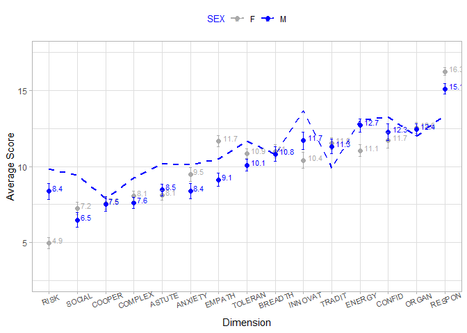
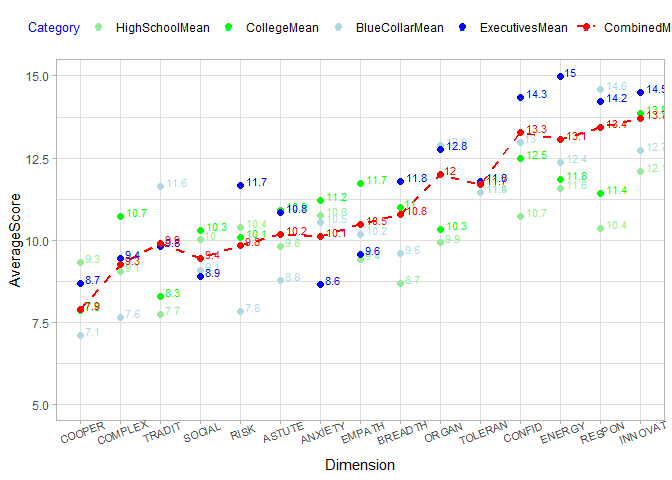
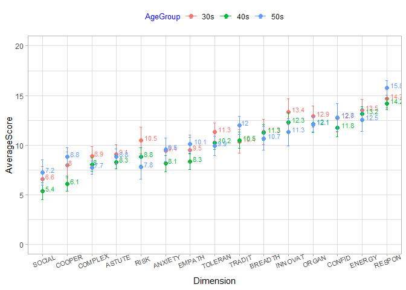
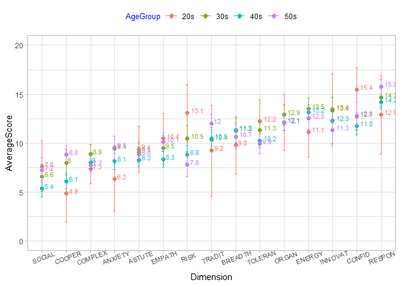
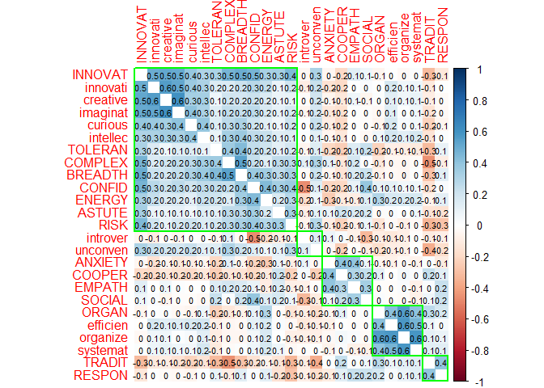
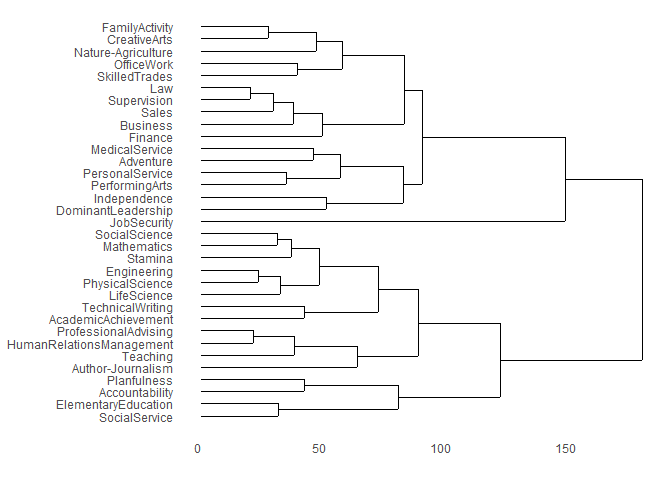
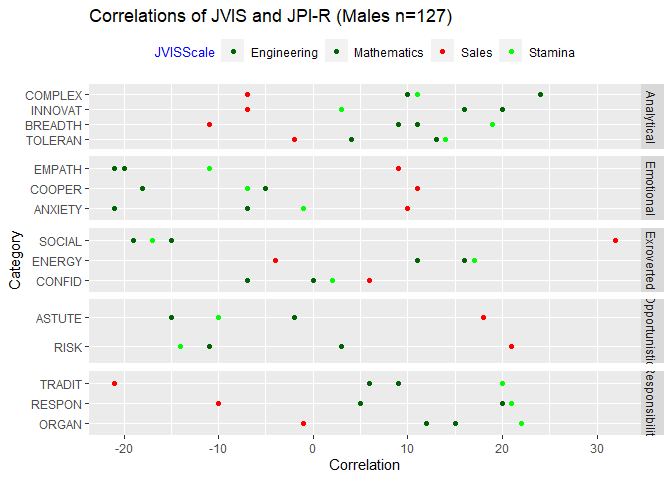
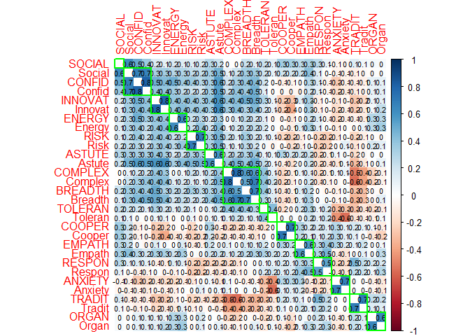
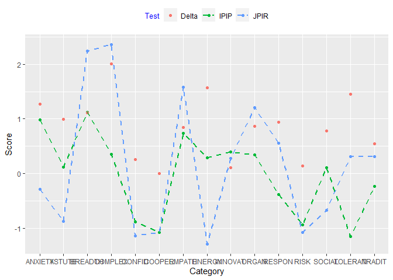
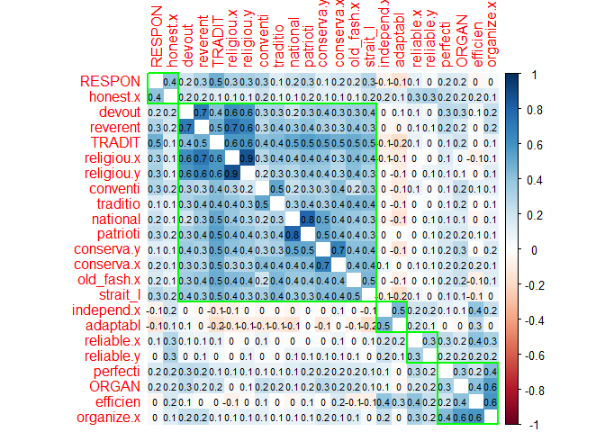

JPI-R Analysis
================

## Data obtained from the **The Eugene-Springfield Community Sample** repository at the **dataverse,** harvard.edu.

## Cluster Plot of JPI-R Dimensions

##### Clustering of Dimensions show correlations within JPI-R clusters, though not strong.

<!-- -->

## JPI-R Results by 15 Dimensions and Faceted by Gender

<!-- -->

<!-- -->

##### Greatest variability in the following Dimensions: INNOVAT, CONFID, RISK, BREADTH, ANXIETY, SOCIAL, EMPATH, COOPER, ENERGY, TRADIT, ORGAN

##### Lowest variability in the following Dimensions: ASTUTE, TOLERAN, COMPLEX, RESPON

## Male results by AGE

<!-- -->

## Female results by AGE

<!-- -->

## 360 amd 525 PDA Correlations.

#### This analysis aligns well-documented cybersecurity behavioral traits to the 15 measures in the JPI-R. These relationships aim to identify dimensions where high scores may suggest a propensity for cybersecurity roles.

###### The 360 PDA is an inventory of person-descriptive adjectives that included Goldberg’s (1992) 100 unipolar Big-Five factor markers, plus terms from each of the item clusters that have been hypothesized as potentially beyond the Big Five (Saucier & Goldberg, 1998).

###### The 525-PDA, a set of the 500 most familiar English person-descriptive adjectives (Saucier, 1997), plus the terms from Saucier’s (1994) 40-item Big-Five “Mini-Markers” that were not already included.

## JPI-R Cluster 1: Analytical

##### This shows the JPI-R Dimensions for “Analytical” in ALL CAPS and a selection of the 360/525 PDA markers in all lower case.

###### This data is filtered for only Males in the Age Range of 20 - 49.

<!-- -->

##### Results:

  - **INNOVATIVE** has strong corrleation to the cyberseucrity
    performance traits of: **creative, imaginative, curious,
    innovative.**

## JPI-R Cluster 2: Emotional

<!-- -->

##### Results:

  - None to note.

## JPI-R Cluster 3: Extroverted

<!-- -->

##### Results:

  - **ENERGY** has strong correlation wtih the cybersecurity performance
    traits of **energetic, active, and vigorous**.
  - **SOCIAL / SOCIAL CONFIDENCE** have a strong corrleation with
    **social and extraverted** and a strong negative correlation with
    **introverted**; cybersecurity professionals report generally low
    sociability and high introversions.

## JPI-R Cluster 4: Opportunistic

<!-- -->

##### Results:

  - **RISK** has moderate correlation wtih the cybersecurity performance
    traits of **daring, independent, and competitive**.

## JPI-R Cluster 5: Dependable

<!-- -->

##### Results:

  - **ORGANIZATION** has moderate/strong correlation wtih the
    cybersecurity performance traits of **organization, efficiency,
    perfection**.
  - **RESPONSIBLE** has strong correlation with the trait of
    **honesty.**

## Summary Table

<table class="table table-striped table-hover table-condensed" style="margin-left: auto; margin-right: auto;">

<thead>

<tr>

<th style="text-align:left;position: sticky; top:0; background-color: #FFFFFF;">

Category

</th>

<th style="text-align:left;position: sticky; top:0; background-color: #FFFFFF;">

Category1

</th>

<th style="text-align:right;position: sticky; top:0; background-color: #FFFFFF;">

Correlation

</th>

</tr>

</thead>

<tbody>

<tr>

<td style="text-align:left;">

ANXIETY

</td>

<td style="text-align:left;">

tense

</td>

<td style="text-align:right;">

0.60

</td>

</tr>

<tr>

<td style="text-align:left;">

ANXIETY

</td>

<td style="text-align:left;">

insecure.y

</td>

<td style="text-align:right;">

0.54

</td>

</tr>

<tr>

<td style="text-align:left;">

ANXIETY

</td>

<td style="text-align:left;">

nervous.y

</td>

<td style="text-align:right;">

0.51

</td>

</tr>

<tr>

<td style="text-align:left;">

ANXIETY

</td>

<td style="text-align:left;">

insecure.x

</td>

<td style="text-align:right;">

0.50

</td>

</tr>

<tr>

<td style="text-align:left;">

ANXIETY

</td>

<td style="text-align:left;">

worried

</td>

<td style="text-align:right;">

0.49

</td>

</tr>

<tr>

<td style="text-align:left;">

ANXIETY

</td>

<td style="text-align:left;">

anxious.x

</td>

<td style="text-align:right;">

0.48

</td>

</tr>

<tr>

<td style="text-align:left;">

COMPLEX

</td>

<td style="text-align:left;">

complex.x

</td>

<td style="text-align:right;">

0.53

</td>

</tr>

<tr>

<td style="text-align:left;">

COMPLEX

</td>

<td style="text-align:left;">

deep.y

</td>

<td style="text-align:right;">

0.52

</td>

</tr>

<tr>

<td style="text-align:left;">

COMPLEX

</td>

<td style="text-align:left;">

deep.x

</td>

<td style="text-align:right;">

0.48

</td>

</tr>

<tr>

<td style="text-align:left;">

CONFID

</td>

<td style="text-align:left;">

outgoing

</td>

<td style="text-align:right;">

0.62

</td>

</tr>

<tr>

<td style="text-align:left;">

CONFID

</td>

<td style="text-align:left;">

extraver.y

</td>

<td style="text-align:right;">

0.61

</td>

</tr>

<tr>

<td style="text-align:left;">

CONFID

</td>

<td style="text-align:left;">

extraver.x

</td>

<td style="text-align:right;">

0.56

</td>

</tr>

<tr>

<td style="text-align:left;">

CONFID

</td>

<td style="text-align:left;">

verbal

</td>

<td style="text-align:right;">

0.54

</td>

</tr>

<tr>

<td style="text-align:left;">

CONFID

</td>

<td style="text-align:left;">

social

</td>

<td style="text-align:right;">

0.54

</td>

</tr>

<tr>

<td style="text-align:left;">

CONFID

</td>

<td style="text-align:left;">

sociable

</td>

<td style="text-align:right;">

0.53

</td>

</tr>

<tr>

<td style="text-align:left;">

CONFID

</td>

<td style="text-align:left;">

popular

</td>

<td style="text-align:right;">

0.49

</td>

</tr>

<tr>

<td style="text-align:left;">

CONFID

</td>

<td style="text-align:left;">

outspoke.x

</td>

<td style="text-align:right;">

0.49

</td>

</tr>

<tr>

<td style="text-align:left;">

CONFID

</td>

<td style="text-align:left;">

entertai

</td>

<td style="text-align:right;">

0.48

</td>

</tr>

<tr>

<td style="text-align:left;">

CONFID

</td>

<td style="text-align:left;">

outspoke.y

</td>

<td style="text-align:right;">

0.48

</td>

</tr>

<tr>

<td style="text-align:left;">

CONFID

</td>

<td style="text-align:left;">

boring

</td>

<td style="text-align:right;">

\-0.49

</td>

</tr>

<tr>

<td style="text-align:left;">

CONFID

</td>

<td style="text-align:left;">

silent

</td>

<td style="text-align:right;">

\-0.50

</td>

</tr>

<tr>

<td style="text-align:left;">

CONFID

</td>

<td style="text-align:left;">

quiet.x

</td>

<td style="text-align:right;">

\-0.51

</td>

</tr>

<tr>

<td style="text-align:left;">

CONFID

</td>

<td style="text-align:left;">

untalkat

</td>

<td style="text-align:right;">

\-0.54

</td>

</tr>

<tr>

<td style="text-align:left;">

EMPATH

</td>

<td style="text-align:left;">

compassi.y

</td>

<td style="text-align:right;">

0.49

</td>

</tr>

<tr>

<td style="text-align:left;">

ENERGY

</td>

<td style="text-align:left;">

energeti.x

</td>

<td style="text-align:right;">

0.57

</td>

</tr>

<tr>

<td style="text-align:left;">

ENERGY

</td>

<td style="text-align:left;">

energeti.y

</td>

<td style="text-align:right;">

0.48

</td>

</tr>

<tr>

<td style="text-align:left;">

ENERGY

</td>

<td style="text-align:left;">

vigorous

</td>

<td style="text-align:right;">

0.48

</td>

</tr>

<tr>

<td style="text-align:left;">

INNOVAT

</td>

<td style="text-align:left;">

creative.y

</td>

<td style="text-align:right;">

0.71

</td>

</tr>

<tr>

<td style="text-align:left;">

INNOVAT

</td>

<td style="text-align:left;">

imaginat.y

</td>

<td style="text-align:right;">

0.70

</td>

</tr>

<tr>

<td style="text-align:left;">

INNOVAT

</td>

<td style="text-align:left;">

original

</td>

<td style="text-align:right;">

0.59

</td>

</tr>

<tr>

<td style="text-align:left;">

INNOVAT

</td>

<td style="text-align:left;">

creative.x

</td>

<td style="text-align:right;">

0.58

</td>

</tr>

<tr>

<td style="text-align:left;">

INNOVAT

</td>

<td style="text-align:left;">

clever

</td>

<td style="text-align:right;">

0.55

</td>

</tr>

<tr>

<td style="text-align:left;">

INNOVAT

</td>

<td style="text-align:left;">

talented

</td>

<td style="text-align:right;">

0.54

</td>

</tr>

<tr>

<td style="text-align:left;">

INNOVAT

</td>

<td style="text-align:left;">

curious.x

</td>

<td style="text-align:right;">

0.52

</td>

</tr>

<tr>

<td style="text-align:left;">

INNOVAT

</td>

<td style="text-align:left;">

innovati

</td>

<td style="text-align:right;">

0.51

</td>

</tr>

<tr>

<td style="text-align:left;">

INNOVAT

</td>

<td style="text-align:left;">

imaginat.x

</td>

<td style="text-align:right;">

0.50

</td>

</tr>

<tr>

<td style="text-align:left;">

INNOVAT

</td>

<td style="text-align:left;">

inquisit

</td>

<td style="text-align:right;">

0.49

</td>

</tr>

<tr>

<td style="text-align:left;">

INNOVAT

</td>

<td style="text-align:left;">

observan

</td>

<td style="text-align:right;">

0.49

</td>

</tr>

<tr>

<td style="text-align:left;">

INNOVAT

</td>

<td style="text-align:left;">

artistic.x

</td>

<td style="text-align:right;">

0.48

</td>

</tr>

<tr>

<td style="text-align:left;">

INNOVAT

</td>

<td style="text-align:left;">

uninquis

</td>

<td style="text-align:right;">

\-0.54

</td>

</tr>

<tr>

<td style="text-align:left;">

INNOVAT

</td>

<td style="text-align:left;">

uncreati.y

</td>

<td style="text-align:right;">

\-0.55

</td>

</tr>

<tr>

<td style="text-align:left;">

INNOVAT

</td>

<td style="text-align:left;">

uncreati.x

</td>

<td style="text-align:right;">

\-0.57

</td>

</tr>

<tr>

<td style="text-align:left;">

INNOVAT

</td>

<td style="text-align:left;">

unimagin

</td>

<td style="text-align:right;">

\-0.63

</td>

</tr>

<tr>

<td style="text-align:left;">

ORGAN

</td>

<td style="text-align:left;">

organize.x

</td>

<td style="text-align:right;">

0.57

</td>

</tr>

<tr>

<td style="text-align:left;">

ORGAN

</td>

<td style="text-align:left;">

organize.y

</td>

<td style="text-align:right;">

0.56

</td>

</tr>

<tr>

<td style="text-align:left;">

ORGAN

</td>

<td style="text-align:left;">

disorgan.y

</td>

<td style="text-align:right;">

\-0.50

</td>

</tr>

<tr>

<td style="text-align:left;">

ORGAN

</td>

<td style="text-align:left;">

disorgan.x

</td>

<td style="text-align:right;">

\-0.58

</td>

</tr>

<tr>

<td style="text-align:left;">

SOCIAL

</td>

<td style="text-align:left;">

extraver.y

</td>

<td style="text-align:right;">

0.55

</td>

</tr>

<tr>

<td style="text-align:left;">

SOCIAL

</td>

<td style="text-align:left;">

extraver.x

</td>

<td style="text-align:right;">

0.50

</td>

</tr>

<tr>

<td style="text-align:left;">

SOCIAL

</td>

<td style="text-align:left;">

outgoing

</td>

<td style="text-align:right;">

0.48

</td>

</tr>

<tr>

<td style="text-align:left;">

SOCIAL

</td>

<td style="text-align:left;">

introver

</td>

<td style="text-align:right;">

\-0.49

</td>

</tr>

<tr>

<td style="text-align:left;">

SOCIAL

</td>

<td style="text-align:left;">

private

</td>

<td style="text-align:right;">

\-0.54

</td>

</tr>

<tr>

<td style="text-align:left;">

TRADIT

</td>

<td style="text-align:left;">

religiou.x

</td>

<td style="text-align:right;">

0.59

</td>

</tr>

<tr>

<td style="text-align:left;">

TRADIT

</td>

<td style="text-align:left;">

religiou.y

</td>

<td style="text-align:right;">

0.57

</td>

</tr>

<tr>

<td style="text-align:left;">

TRADIT

</td>

<td style="text-align:left;">

conserva.y

</td>

<td style="text-align:right;">

0.57

</td>

</tr>

<tr>

<td style="text-align:left;">

TRADIT

</td>

<td style="text-align:left;">

conserva.x

</td>

<td style="text-align:right;">

0.51

</td>

</tr>

<tr>

<td style="text-align:left;">

TRADIT

</td>

<td style="text-align:left;">

patrioti

</td>

<td style="text-align:right;">

0.51

</td>

</tr>

<tr>

<td style="text-align:left;">

TRADIT

</td>

<td style="text-align:left;">

liberal.y

</td>

<td style="text-align:right;">

\-0.53

</td>

</tr>

<tr>

<td style="text-align:left;">

TRADIT

</td>

<td style="text-align:left;">

nonrelig

</td>

<td style="text-align:right;">

\-0.55

</td>

</tr>

<tr>

<td style="text-align:left;">

TRADIT

</td>

<td style="text-align:left;">

liberal.x

</td>

<td style="text-align:right;">

\-0.59

</td>

</tr>

</tbody>

</table>
