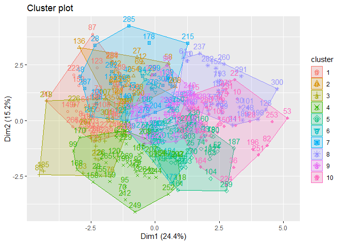

JPI-R Analysis
================

## JPI-R Results by 15 Dimensions and Faceted by Gender

<!-- -->

<!-- -->

##### Greatest variability in the following Dimensions: INNOVAT, CONFID, RISK, BREADTH, ANXIETY, SOCIAL, EMPATH, COOPER, ENERGY, TRADIT, ORGAN

##### Lowest variability in the following Dimensions: ASTUTE, TOLERAN, COMPLEX, RESPON

## Male results by AGE

<!-- -->

## Female results by AGE

<!-- -->

## 360 PDA Correlations

##### The 360 PDA is an inventory of person-descriptive adjectives that included Goldberg’s (1992) 100 unipolar Big-Five factor markers, plus terms from each of the item clusters that have been hypothesized as potentially beyond the Big Five (Saucier & Goldberg, 1998).

##### This shows the JPI-R Dimensions in ALL CAPS and a selection of the 360 PDA markers in all lower case.

<!-- -->
