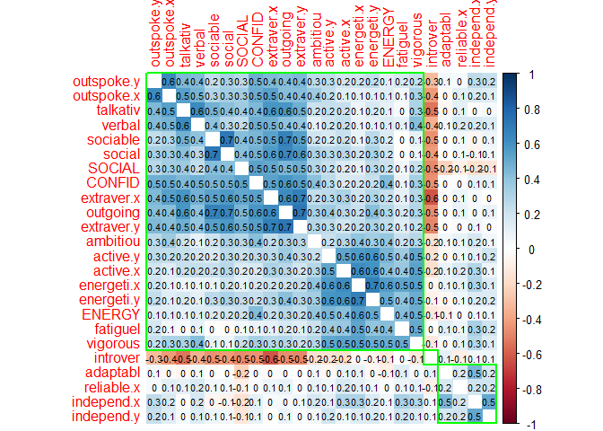

JPI-R Analysis
================

## Data obtained from the **The Eugene-Springfield Community Sample** repository at the **dataverse,** harvard.edu.

## Eugene-Springfield JPI-R Results by Gender

###### The **blue dashed line** represents mean values for males reported in Table 1-2 of the **“JPI-R Technical Manual” by Douglas Jackson** and provided to the author by Sigma.

<!-- -->

## JPI-R Technical Manual results for Males by select demographics.

##### Categories: High School, College, Blue Collar, Executives

###### Data extracted from Table 1-2 of the **“JPI-R Technical Manual” by Douglas Jackson** and provided to the author by Sigma.

<!-- -->

## Eugene-Springfield JPI-R results for Males by Age

<!-- -->

## K-Means Cluster Analysis of Eugene-Springfiled JPI-R results for males

##### K-means cluster analysis aimed to define 10 most common profiles of males. This approach is also presented in the JPI-R Technical Manual Modal Profile Analysis.

###### As described by Jackson: “Each modal profile represents the personality profile and the patterning of behavioral dimensions that is characteristic of the subset of persons in a particular population. In general, individuals will not be perfect representations of a single modal profile but, rather, combinations of several profiles. Even so, the modal profile most similar to an individual’s observed profile is likely to describe him or her best. By the identification of a variety of modal profiles that appear with some frequency in the population, it is possible to classify a majority of the individuals in terms of their similarities to these “pure” types. The extent to which this is possible is an empirical matter, but the goal is to reduce the apparently chaotic diversity of individual profiles to a manageable system involving relatively few modal profiles."

<!-- --><!-- -->

## Correlation of Vocational Interests to JPI-R Dimensions for Males

###### Data extracted from Table 4-18 of the **“JPI-R Technical Manual” by Douglas Jackson** and provided to the author by Sigma. Table 4-18 is described as Correlations between the Jackson Vocational Interest Survey (JVIS) and the JPI: Males (N = 127).

<table class="table table-striped table-hover table-condensed" style="margin-left: auto; margin-right: auto;">

<thead>

<tr>

<th style="text-align:left;position: sticky; top:0; background-color: #FFFFFF;">

JVISScale

</th>

<th style="text-align:right;position: sticky; top:0; background-color: #FFFFFF;">

COMPLEX

</th>

<th style="text-align:right;position: sticky; top:0; background-color: #FFFFFF;">

BREADTH

</th>

<th style="text-align:right;position: sticky; top:0; background-color: #FFFFFF;">

INNOVAT

</th>

<th style="text-align:right;position: sticky; top:0; background-color: #FFFFFF;">

TOLERAN

</th>

<th style="text-align:right;position: sticky; top:0; background-color: #FFFFFF;">

EMPATH

</th>

<th style="text-align:right;position: sticky; top:0; background-color: #FFFFFF;">

ANXIETY

</th>

<th style="text-align:right;position: sticky; top:0; background-color: #FFFFFF;">

COOPER

</th>

<th style="text-align:right;position: sticky; top:0; background-color: #FFFFFF;">

SOCIAL

</th>

<th style="text-align:right;position: sticky; top:0; background-color: #FFFFFF;">

CONFID

</th>

<th style="text-align:right;position: sticky; top:0; background-color: #FFFFFF;">

ENERGY

</th>

<th style="text-align:right;position: sticky; top:0; background-color: #FFFFFF;">

ASTUTE

</th>

<th style="text-align:right;position: sticky; top:0; background-color: #FFFFFF;">

RISK

</th>

<th style="text-align:right;position: sticky; top:0; background-color: #FFFFFF;">

ORGAN

</th>

<th style="text-align:right;position: sticky; top:0; background-color: #FFFFFF;">

TRADIT

</th>

<th style="text-align:right;position: sticky; top:0; background-color: #FFFFFF;">

RESPON

</th>

</tr>

</thead>

<tbody>

<tr>

<td style="text-align:left;">

AcademicAchievement

</td>

<td style="text-align:right;">

39

</td>

<td style="text-align:right;">

46

</td>

<td style="text-align:right;">

26

</td>

<td style="text-align:right;">

31

</td>

<td style="text-align:right;">

\-1

</td>

<td style="text-align:right;">

\-7

</td>

<td style="text-align:right;">

\-17

</td>

<td style="text-align:right;">

\-12

</td>

<td style="text-align:right;">

8

</td>

<td style="text-align:right;">

9

</td>

<td style="text-align:right;">

\-5

</td>

<td style="text-align:right;">

\-11

</td>

<td style="text-align:right;">

20

</td>

<td style="text-align:right;">

11

</td>

<td style="text-align:right;">

35

</td>

</tr>

<tr>

<td style="text-align:left;">

Engineering

</td>

<td style="text-align:right;">

10

</td>

<td style="text-align:right;">

9

</td>

<td style="text-align:right;">

20

</td>

<td style="text-align:right;">

4

</td>

<td style="text-align:right;">

\-20

</td>

<td style="text-align:right;">

\-21

</td>

<td style="text-align:right;">

\-5

</td>

<td style="text-align:right;">

\-15

</td>

<td style="text-align:right;">

0

</td>

<td style="text-align:right;">

16

</td>

<td style="text-align:right;">

\-2

</td>

<td style="text-align:right;">

3

</td>

<td style="text-align:right;">

12

</td>

<td style="text-align:right;">

6

</td>

<td style="text-align:right;">

5

</td>

</tr>

<tr>

<td style="text-align:left;">

Author-Journalism

</td>

<td style="text-align:right;">

40

</td>

<td style="text-align:right;">

12

</td>

<td style="text-align:right;">

20

</td>

<td style="text-align:right;">

14

</td>

<td style="text-align:right;">

\-2

</td>

<td style="text-align:right;">

1

</td>

<td style="text-align:right;">

\-12

</td>

<td style="text-align:right;">

14

</td>

<td style="text-align:right;">

17

</td>

<td style="text-align:right;">

7

</td>

<td style="text-align:right;">

11

</td>

<td style="text-align:right;">

10

</td>

<td style="text-align:right;">

\-8

</td>

<td style="text-align:right;">

\-18

</td>

<td style="text-align:right;">

0

</td>

</tr>

<tr>

<td style="text-align:left;">

SocialScience

</td>

<td style="text-align:right;">

17

</td>

<td style="text-align:right;">

22

</td>

<td style="text-align:right;">

19

</td>

<td style="text-align:right;">

9

</td>

<td style="text-align:right;">

\-12

</td>

<td style="text-align:right;">

\-8

</td>

<td style="text-align:right;">

\-21

</td>

<td style="text-align:right;">

\-28

</td>

<td style="text-align:right;">

\-6

</td>

<td style="text-align:right;">

6

</td>

<td style="text-align:right;">

\-4

</td>

<td style="text-align:right;">

\-19

</td>

<td style="text-align:right;">

4

</td>

<td style="text-align:right;">

24

</td>

<td style="text-align:right;">

22

</td>

</tr>

<tr>

<td style="text-align:left;">

Mathematics

</td>

<td style="text-align:right;">

24

</td>

<td style="text-align:right;">

11

</td>

<td style="text-align:right;">

16

</td>

<td style="text-align:right;">

13

</td>

<td style="text-align:right;">

\-21

</td>

<td style="text-align:right;">

\-7

</td>

<td style="text-align:right;">

\-18

</td>

<td style="text-align:right;">

\-19

</td>

<td style="text-align:right;">

\-7

</td>

<td style="text-align:right;">

11

</td>

<td style="text-align:right;">

\-15

</td>

<td style="text-align:right;">

\-11

</td>

<td style="text-align:right;">

15

</td>

<td style="text-align:right;">

9

</td>

<td style="text-align:right;">

20

</td>

</tr>

<tr>

<td style="text-align:left;">

TechnicalWriting

</td>

<td style="text-align:right;">

28

</td>

<td style="text-align:right;">

27

</td>

<td style="text-align:right;">

16

</td>

<td style="text-align:right;">

21

</td>

<td style="text-align:right;">

7

</td>

<td style="text-align:right;">

3

</td>

<td style="text-align:right;">

\-17

</td>

<td style="text-align:right;">

2

</td>

<td style="text-align:right;">

12

</td>

<td style="text-align:right;">

10

</td>

<td style="text-align:right;">

12

</td>

<td style="text-align:right;">

3

</td>

<td style="text-align:right;">

13

</td>

<td style="text-align:right;">

10

</td>

<td style="text-align:right;">

25

</td>

</tr>

<tr>

<td style="text-align:left;">

PhysicalScience

</td>

<td style="text-align:right;">

14

</td>

<td style="text-align:right;">

19

</td>

<td style="text-align:right;">

15

</td>

<td style="text-align:right;">

13

</td>

<td style="text-align:right;">

\-21

</td>

<td style="text-align:right;">

\-16

</td>

<td style="text-align:right;">

\-14

</td>

<td style="text-align:right;">

\-22

</td>

<td style="text-align:right;">

0

</td>

<td style="text-align:right;">

16

</td>

<td style="text-align:right;">

\-10

</td>

<td style="text-align:right;">

\-5

</td>

<td style="text-align:right;">

13

</td>

<td style="text-align:right;">

3

</td>

<td style="text-align:right;">

6

</td>

</tr>

<tr>

<td style="text-align:left;">

LifeScience

</td>

<td style="text-align:right;">

12

</td>

<td style="text-align:right;">

23

</td>

<td style="text-align:right;">

13

</td>

<td style="text-align:right;">

11

</td>

<td style="text-align:right;">

\-5

</td>

<td style="text-align:right;">

\-9

</td>

<td style="text-align:right;">

\-5

</td>

<td style="text-align:right;">

\-20

</td>

<td style="text-align:right;">

\-3

</td>

<td style="text-align:right;">

6

</td>

<td style="text-align:right;">

\-6

</td>

<td style="text-align:right;">

0

</td>

<td style="text-align:right;">

2

</td>

<td style="text-align:right;">

11

</td>

<td style="text-align:right;">

11

</td>

</tr>

<tr>

<td style="text-align:left;">

Teaching

</td>

<td style="text-align:right;">

7

</td>

<td style="text-align:right;">

20

</td>

<td style="text-align:right;">

12

</td>

<td style="text-align:right;">

12

</td>

<td style="text-align:right;">

18

</td>

<td style="text-align:right;">

12

</td>

<td style="text-align:right;">

10

</td>

<td style="text-align:right;">

22

</td>

<td style="text-align:right;">

11

</td>

<td style="text-align:right;">

\-4

</td>

<td style="text-align:right;">

11

</td>

<td style="text-align:right;">

\-8

</td>

<td style="text-align:right;">

3

</td>

<td style="text-align:right;">

4

</td>

<td style="text-align:right;">

22

</td>

</tr>

<tr>

<td style="text-align:left;">

ProfessionalAdvising

</td>

<td style="text-align:right;">

2

</td>

<td style="text-align:right;">

15

</td>

<td style="text-align:right;">

9

</td>

<td style="text-align:right;">

13

</td>

<td style="text-align:right;">

5

</td>

<td style="text-align:right;">

3

</td>

<td style="text-align:right;">

2

</td>

<td style="text-align:right;">

20

</td>

<td style="text-align:right;">

14

</td>

<td style="text-align:right;">

11

</td>

<td style="text-align:right;">

3

</td>

<td style="text-align:right;">

10

</td>

<td style="text-align:right;">

0

</td>

<td style="text-align:right;">

\-2

</td>

<td style="text-align:right;">

24

</td>

</tr>

<tr>

<td style="text-align:left;">

Independence

</td>

<td style="text-align:right;">

3

</td>

<td style="text-align:right;">

2

</td>

<td style="text-align:right;">

6

</td>

<td style="text-align:right;">

0

</td>

<td style="text-align:right;">

3

</td>

<td style="text-align:right;">

13

</td>

<td style="text-align:right;">

\-17

</td>

<td style="text-align:right;">

\-19

</td>

<td style="text-align:right;">

9

</td>

<td style="text-align:right;">

2

</td>

<td style="text-align:right;">

5

</td>

<td style="text-align:right;">

12

</td>

<td style="text-align:right;">

12

</td>

<td style="text-align:right;">

\-4

</td>

<td style="text-align:right;">

\-3

</td>

</tr>

<tr>

<td style="text-align:left;">

Stamina

</td>

<td style="text-align:right;">

11

</td>

<td style="text-align:right;">

19

</td>

<td style="text-align:right;">

3

</td>

<td style="text-align:right;">

14

</td>

<td style="text-align:right;">

\-11

</td>

<td style="text-align:right;">

\-1

</td>

<td style="text-align:right;">

\-7

</td>

<td style="text-align:right;">

\-17

</td>

<td style="text-align:right;">

2

</td>

<td style="text-align:right;">

17

</td>

<td style="text-align:right;">

\-10

</td>

<td style="text-align:right;">

\-14

</td>

<td style="text-align:right;">

22

</td>

<td style="text-align:right;">

20

</td>

<td style="text-align:right;">

21

</td>

</tr>

<tr>

<td style="text-align:left;">

HumanRelationsManagement

</td>

<td style="text-align:right;">

2

</td>

<td style="text-align:right;">

13

</td>

<td style="text-align:right;">

2

</td>

<td style="text-align:right;">

12

</td>

<td style="text-align:right;">

9

</td>

<td style="text-align:right;">

1

</td>

<td style="text-align:right;">

\-5

</td>

<td style="text-align:right;">

29

</td>

<td style="text-align:right;">

15

</td>

<td style="text-align:right;">

2

</td>

<td style="text-align:right;">

5

</td>

<td style="text-align:right;">

12

</td>

<td style="text-align:right;">

\-7

</td>

<td style="text-align:right;">

\-5

</td>

<td style="text-align:right;">

15

</td>

</tr>

<tr>

<td style="text-align:left;">

SocialService

</td>

<td style="text-align:right;">

7

</td>

<td style="text-align:right;">

7

</td>

<td style="text-align:right;">

1

</td>

<td style="text-align:right;">

20

</td>

<td style="text-align:right;">

39

</td>

<td style="text-align:right;">

15

</td>

<td style="text-align:right;">

7

</td>

<td style="text-align:right;">

25

</td>

<td style="text-align:right;">

\-6

</td>

<td style="text-align:right;">

\-14

</td>

<td style="text-align:right;">

3

</td>

<td style="text-align:right;">

\-12

</td>

<td style="text-align:right;">

\-8

</td>

<td style="text-align:right;">

\-1

</td>

<td style="text-align:right;">

23

</td>

</tr>

<tr>

<td style="text-align:left;">

Adventure

</td>

<td style="text-align:right;">

\-11

</td>

<td style="text-align:right;">

\-15

</td>

<td style="text-align:right;">

0

</td>

<td style="text-align:right;">

\-5

</td>

<td style="text-align:right;">

\-15

</td>

<td style="text-align:right;">

\-29

</td>

<td style="text-align:right;">

\-6

</td>

<td style="text-align:right;">

\-10

</td>

<td style="text-align:right;">

9

</td>

<td style="text-align:right;">

3

</td>

<td style="text-align:right;">

5

</td>

<td style="text-align:right;">

30

</td>

<td style="text-align:right;">

\-31

</td>

<td style="text-align:right;">

\-10

</td>

<td style="text-align:right;">

\-41

</td>

</tr>

<tr>

<td style="text-align:left;">

DominantLeadership

</td>

<td style="text-align:right;">

\-5

</td>

<td style="text-align:right;">

\-13

</td>

<td style="text-align:right;">

\-1

</td>

<td style="text-align:right;">

\-20

</td>

<td style="text-align:right;">

\-21

</td>

<td style="text-align:right;">

\-5

</td>

<td style="text-align:right;">

\-20

</td>

<td style="text-align:right;">

\-29

</td>

<td style="text-align:right;">

15

</td>

<td style="text-align:right;">

6

</td>

<td style="text-align:right;">

2

</td>

<td style="text-align:right;">

13

</td>

<td style="text-align:right;">

\-3

</td>

<td style="text-align:right;">

12

</td>

<td style="text-align:right;">

\-17

</td>

</tr>

<tr>

<td style="text-align:left;">

CreativeArts

</td>

<td style="text-align:right;">

3

</td>

<td style="text-align:right;">

\-15

</td>

<td style="text-align:right;">

\-2

</td>

<td style="text-align:right;">

\-12

</td>

<td style="text-align:right;">

\-9

</td>

<td style="text-align:right;">

\-1

</td>

<td style="text-align:right;">

7

</td>

<td style="text-align:right;">

\-17

</td>

<td style="text-align:right;">

\-15

</td>

<td style="text-align:right;">

\-15

</td>

<td style="text-align:right;">

\-14

</td>

<td style="text-align:right;">

\-15

</td>

<td style="text-align:right;">

\-14

</td>

<td style="text-align:right;">

\-15

</td>

<td style="text-align:right;">

\-24

</td>

</tr>

<tr>

<td style="text-align:left;">

MedicalService

</td>

<td style="text-align:right;">

\-6

</td>

<td style="text-align:right;">

\-1

</td>

<td style="text-align:right;">

\-2

</td>

<td style="text-align:right;">

9

</td>

<td style="text-align:right;">

0

</td>

<td style="text-align:right;">

\-25

</td>

<td style="text-align:right;">

\-5

</td>

<td style="text-align:right;">

2

</td>

<td style="text-align:right;">

3

</td>

<td style="text-align:right;">

7

</td>

<td style="text-align:right;">

\-8

</td>

<td style="text-align:right;">

8

</td>

<td style="text-align:right;">

\-19

</td>

<td style="text-align:right;">

\-4

</td>

<td style="text-align:right;">

\-24

</td>

</tr>

<tr>

<td style="text-align:left;">

PersonalService

</td>

<td style="text-align:right;">

\-22

</td>

<td style="text-align:right;">

\-29

</td>

<td style="text-align:right;">

\-3

</td>

<td style="text-align:right;">

\-22

</td>

<td style="text-align:right;">

\-2

</td>

<td style="text-align:right;">

\-5

</td>

<td style="text-align:right;">

4

</td>

<td style="text-align:right;">

4

</td>

<td style="text-align:right;">

2

</td>

<td style="text-align:right;">

\-10

</td>

<td style="text-align:right;">

3

</td>

<td style="text-align:right;">

9

</td>

<td style="text-align:right;">

\-15

</td>

<td style="text-align:right;">

\-8

</td>

<td style="text-align:right;">

\-36

</td>

</tr>

<tr>

<td style="text-align:left;">

Supervision

</td>

<td style="text-align:right;">

\-9

</td>

<td style="text-align:right;">

\-12

</td>

<td style="text-align:right;">

\-4

</td>

<td style="text-align:right;">

\-1

</td>

<td style="text-align:right;">

\-5

</td>

<td style="text-align:right;">

3

</td>

<td style="text-align:right;">

1

</td>

<td style="text-align:right;">

20

</td>

<td style="text-align:right;">

10

</td>

<td style="text-align:right;">

\-2

</td>

<td style="text-align:right;">

14

</td>

<td style="text-align:right;">

24

</td>

<td style="text-align:right;">

\-6

</td>

<td style="text-align:right;">

\-15

</td>

<td style="text-align:right;">

\-5

</td>

</tr>

<tr>

<td style="text-align:left;">

Finance

</td>

<td style="text-align:right;">

\-17

</td>

<td style="text-align:right;">

\-3

</td>

<td style="text-align:right;">

\-6

</td>

<td style="text-align:right;">

\-4

</td>

<td style="text-align:right;">

\-9

</td>

<td style="text-align:right;">

\-11

</td>

<td style="text-align:right;">

2

</td>

<td style="text-align:right;">

13

</td>

<td style="text-align:right;">

4

</td>

<td style="text-align:right;">

12

</td>

<td style="text-align:right;">

3

</td>

<td style="text-align:right;">

29

</td>

<td style="text-align:right;">

10

</td>

<td style="text-align:right;">

\-12

</td>

<td style="text-align:right;">

\-9

</td>

</tr>

<tr>

<td style="text-align:left;">

PerformingArts

</td>

<td style="text-align:right;">

\-2

</td>

<td style="text-align:right;">

\-22

</td>

<td style="text-align:right;">

\-7

</td>

<td style="text-align:right;">

\-9

</td>

<td style="text-align:right;">

\-1

</td>

<td style="text-align:right;">

\-6

</td>

<td style="text-align:right;">

\-7

</td>

<td style="text-align:right;">

1

</td>

<td style="text-align:right;">

3

</td>

<td style="text-align:right;">

\-11

</td>

<td style="text-align:right;">

\-3

</td>

<td style="text-align:right;">

5

</td>

<td style="text-align:right;">

\-32

</td>

<td style="text-align:right;">

\-14

</td>

<td style="text-align:right;">

\-38

</td>

</tr>

<tr>

<td style="text-align:left;">

Accountability

</td>

<td style="text-align:right;">

\-18

</td>

<td style="text-align:right;">

10

</td>

<td style="text-align:right;">

\-7

</td>

<td style="text-align:right;">

\-5

</td>

<td style="text-align:right;">

13

</td>

<td style="text-align:right;">

24

</td>

<td style="text-align:right;">

20

</td>

<td style="text-align:right;">

\-8

</td>

<td style="text-align:right;">

\-13

</td>

<td style="text-align:right;">

0

</td>

<td style="text-align:right;">

\-5

</td>

<td style="text-align:right;">

\-34

</td>

<td style="text-align:right;">

23

</td>

<td style="text-align:right;">

30

</td>

<td style="text-align:right;">

35

</td>

</tr>

<tr>

<td style="text-align:left;">

ElementaryEducation

</td>

<td style="text-align:right;">

5

</td>

<td style="text-align:right;">

10

</td>

<td style="text-align:right;">

\-7

</td>

<td style="text-align:right;">

11

</td>

<td style="text-align:right;">

30

</td>

<td style="text-align:right;">

22

</td>

<td style="text-align:right;">

21

</td>

<td style="text-align:right;">

33

</td>

<td style="text-align:right;">

\-11

</td>

<td style="text-align:right;">

\-10

</td>

<td style="text-align:right;">

6

</td>

<td style="text-align:right;">

\-22

</td>

<td style="text-align:right;">

6

</td>

<td style="text-align:right;">

5

</td>

<td style="text-align:right;">

26

</td>

</tr>

<tr>

<td style="text-align:left;">

Sales

</td>

<td style="text-align:right;">

\-7

</td>

<td style="text-align:right;">

\-11

</td>

<td style="text-align:right;">

\-7

</td>

<td style="text-align:right;">

\-2

</td>

<td style="text-align:right;">

9

</td>

<td style="text-align:right;">

10

</td>

<td style="text-align:right;">

11

</td>

<td style="text-align:right;">

32

</td>

<td style="text-align:right;">

6

</td>

<td style="text-align:right;">

\-4

</td>

<td style="text-align:right;">

18

</td>

<td style="text-align:right;">

21

</td>

<td style="text-align:right;">

\-1

</td>

<td style="text-align:right;">

\-21

</td>

<td style="text-align:right;">

\-10

</td>

</tr>

<tr>

<td style="text-align:left;">

Planfulness

</td>

<td style="text-align:right;">

\-17

</td>

<td style="text-align:right;">

\-2

</td>

<td style="text-align:right;">

\-7

</td>

<td style="text-align:right;">

\-14

</td>

<td style="text-align:right;">

13

</td>

<td style="text-align:right;">

18

</td>

<td style="text-align:right;">

17

</td>

<td style="text-align:right;">

0

</td>

<td style="text-align:right;">

\-6

</td>

<td style="text-align:right;">

\-8

</td>

<td style="text-align:right;">

\-2

</td>

<td style="text-align:right;">

\-17

</td>

<td style="text-align:right;">

38

</td>

<td style="text-align:right;">

12

</td>

<td style="text-align:right;">

15

</td>

</tr>

<tr>

<td style="text-align:left;">

Law

</td>

<td style="text-align:right;">

\-8

</td>

<td style="text-align:right;">

\-19

</td>

<td style="text-align:right;">

\-9

</td>

<td style="text-align:right;">

\-6

</td>

<td style="text-align:right;">

1

</td>

<td style="text-align:right;">

2

</td>

<td style="text-align:right;">

\-5

</td>

<td style="text-align:right;">

24

</td>

<td style="text-align:right;">

9

</td>

<td style="text-align:right;">

8

</td>

<td style="text-align:right;">

12

</td>

<td style="text-align:right;">

26

</td>

<td style="text-align:right;">

\-2

</td>

<td style="text-align:right;">

\-13

</td>

<td style="text-align:right;">

\-13

</td>

</tr>

<tr>

<td style="text-align:left;">

FamilyActivity

</td>

<td style="text-align:right;">

\-14

</td>

<td style="text-align:right;">

\-20

</td>

<td style="text-align:right;">

\-11

</td>

<td style="text-align:right;">

\-11

</td>

<td style="text-align:right;">

\-2

</td>

<td style="text-align:right;">

\-4

</td>

<td style="text-align:right;">

9

</td>

<td style="text-align:right;">

\-11

</td>

<td style="text-align:right;">

\-10

</td>

<td style="text-align:right;">

\-9

</td>

<td style="text-align:right;">

\-14

</td>

<td style="text-align:right;">

\-4

</td>

<td style="text-align:right;">

\-13

</td>

<td style="text-align:right;">

\-9

</td>

<td style="text-align:right;">

\-23

</td>

</tr>

<tr>

<td style="text-align:left;">

Business

</td>

<td style="text-align:right;">

\-20

</td>

<td style="text-align:right;">

\-20

</td>

<td style="text-align:right;">

\-14

</td>

<td style="text-align:right;">

\-15

</td>

<td style="text-align:right;">

8

</td>

<td style="text-align:right;">

12

</td>

<td style="text-align:right;">

12

</td>

<td style="text-align:right;">

22

</td>

<td style="text-align:right;">

\-1

</td>

<td style="text-align:right;">

\-7

</td>

<td style="text-align:right;">

10

</td>

<td style="text-align:right;">

13

</td>

<td style="text-align:right;">

1

</td>

<td style="text-align:right;">

\-16

</td>

<td style="text-align:right;">

\-1

</td>

</tr>

<tr>

<td style="text-align:left;">

SkilledTrades

</td>

<td style="text-align:right;">

\-14

</td>

<td style="text-align:right;">

\-34

</td>

<td style="text-align:right;">

\-15

</td>

<td style="text-align:right;">

\-23

</td>

<td style="text-align:right;">

4

</td>

<td style="text-align:right;">

7

</td>

<td style="text-align:right;">

13

</td>

<td style="text-align:right;">

\-13

</td>

<td style="text-align:right;">

\-19

</td>

<td style="text-align:right;">

\-13

</td>

<td style="text-align:right;">

\-10

</td>

<td style="text-align:right;">

\-14

</td>

<td style="text-align:right;">

\-7

</td>

<td style="text-align:right;">

1

</td>

<td style="text-align:right;">

\-25

</td>

</tr>

<tr>

<td style="text-align:left;">

Nature-Agriculture

</td>

<td style="text-align:right;">

\-10

</td>

<td style="text-align:right;">

\-1

</td>

<td style="text-align:right;">

\-16

</td>

<td style="text-align:right;">

\-9

</td>

<td style="text-align:right;">

1

</td>

<td style="text-align:right;">

\-5

</td>

<td style="text-align:right;">

8

</td>

<td style="text-align:right;">

\-15

</td>

<td style="text-align:right;">

\-9

</td>

<td style="text-align:right;">

0

</td>

<td style="text-align:right;">

\-5

</td>

<td style="text-align:right;">

0

</td>

<td style="text-align:right;">

\-8

</td>

<td style="text-align:right;">

11

</td>

<td style="text-align:right;">

\-13

</td>

</tr>

<tr>

<td style="text-align:left;">

OfficeWork

</td>

<td style="text-align:right;">

\-27

</td>

<td style="text-align:right;">

\-23

</td>

<td style="text-align:right;">

\-29

</td>

<td style="text-align:right;">

\-27

</td>

<td style="text-align:right;">

\-1

</td>

<td style="text-align:right;">

4

</td>

<td style="text-align:right;">

11

</td>

<td style="text-align:right;">

\-2

</td>

<td style="text-align:right;">

\-21

</td>

<td style="text-align:right;">

\-22

</td>

<td style="text-align:right;">

1

</td>

<td style="text-align:right;">

2

</td>

<td style="text-align:right;">

\-1

</td>

<td style="text-align:right;">

\-11

</td>

<td style="text-align:right;">

\-12

</td>

</tr>

<tr>

<td style="text-align:left;">

JobSecurity

</td>

<td style="text-align:right;">

\-43

</td>

<td style="text-align:right;">

\-30

</td>

<td style="text-align:right;">

\-33

</td>

<td style="text-align:right;">

\-43

</td>

<td style="text-align:right;">

12

</td>

<td style="text-align:right;">

32

</td>

<td style="text-align:right;">

36

</td>

<td style="text-align:right;">

\-7

</td>

<td style="text-align:right;">

\-30

</td>

<td style="text-align:right;">

\-30

</td>

<td style="text-align:right;">

\-1

</td>

<td style="text-align:right;">

\-38

</td>

<td style="text-align:right;">

1

</td>

<td style="text-align:right;">

21

</td>

<td style="text-align:right;">

3

</td>

</tr>

</tbody>

</table>

##### Dendrogram of Vocational Interests

<!-- -->

##### Plot of Correlations of Vocational Interests and JPI-R results

<!-- -->

## JPI-R correlations to a test constructed of 8-10 IPIP Items for each JPI-R dimension

##### All CAPS represents the JPI-R dimension; lower case represents a replicated scale using IPIP items.

<!-- -->

## Demonstration of JPI-R and IPIP test results for a select individual

<!-- -->

## Summary Table: IPIP Questions

<table class="table table-striped table-hover table-condensed" style="margin-left: auto; margin-right: auto;">

<thead>

<tr>

<th style="text-align:left;position: sticky; top:0; background-color: #FFFFFF;">

Category

</th>

<th style="text-align:left;position: sticky; top:0; background-color: #FFFFFF;">

IPIP\_Item\#

</th>

<th style="text-align:right;position: sticky; top:0; background-color: #FFFFFF;">

Correlation

</th>

<th style="text-align:left;position: sticky; top:0; background-color: #FFFFFF;">

Question

</th>

</tr>

</thead>

<tbody>

<tr>

<td style="text-align:left;">

ANXIETY

</td>

<td style="text-align:left;">

H926

</td>

<td style="text-align:right;">

0.65

</td>

<td style="text-align:left;">

Change my mood a lot.

</td>

</tr>

<tr>

<td style="text-align:left;">

ANXIETY

</td>

<td style="text-align:left;">

H927

</td>

<td style="text-align:right;">

0.59

</td>

<td style="text-align:left;">

NA

</td>

</tr>

<tr>

<td style="text-align:left;">

ANXIETY

</td>

<td style="text-align:left;">

H754

</td>

<td style="text-align:right;">

0.57

</td>

<td style="text-align:left;">

NA

</td>

</tr>

<tr>

<td style="text-align:left;">

ANXIETY

</td>

<td style="text-align:left;">

H761

</td>

<td style="text-align:right;">

0.57

</td>

<td style="text-align:left;">

Get irritated easily.

</td>

</tr>

<tr>

<td style="text-align:left;">

ANXIETY

</td>

<td style="text-align:left;">

H755

</td>

<td style="text-align:right;">

0.55

</td>

<td style="text-align:left;">

Lose my temper.

</td>

</tr>

<tr>

<td style="text-align:left;">

ANXIETY

</td>

<td style="text-align:left;">

H758

</td>

<td style="text-align:right;">

0.55

</td>

<td style="text-align:left;">

Act out my frustrations on others.

</td>

</tr>

<tr>

<td style="text-align:left;">

ANXIETY

</td>

<td style="text-align:left;">

E92

</td>

<td style="text-align:right;">

0.55

</td>

<td style="text-align:left;">

Have frequent mood swings.

</td>

</tr>

<tr>

<td style="text-align:left;">

ANXIETY

</td>

<td style="text-align:left;">

S3

</td>

<td style="text-align:right;">

0.52

</td>

<td style="text-align:left;">

Am often worried by things that I said or did

</td>

</tr>

<tr>

<td style="text-align:left;">

ANXIETY

</td>

<td style="text-align:left;">

H1157

</td>

<td style="text-align:right;">

0.51

</td>

<td style="text-align:left;">

NA

</td>

</tr>

<tr>

<td style="text-align:left;">

ANXIETY

</td>

<td style="text-align:left;">

Q77

</td>

<td style="text-align:right;">

0.51

</td>

<td style="text-align:left;">

Get easily agitated.

</td>

</tr>

<tr>

<td style="text-align:left;">

ANXIETY

</td>

<td style="text-align:left;">

V322

</td>

<td style="text-align:right;">

0.50

</td>

<td style="text-align:left;">

Am afraid of losing control of my anger.

</td>

</tr>

<tr>

<td style="text-align:left;">

ANXIETY

</td>

<td style="text-align:left;">

H1133

</td>

<td style="text-align:right;">

0.49

</td>

<td style="text-align:left;">

Grumble about things.

</td>

</tr>

<tr>

<td style="text-align:left;">

ANXIETY

</td>

<td style="text-align:left;">

V203

</td>

<td style="text-align:right;">

0.49

</td>

<td style="text-align:left;">

Am very sensitive and easily hurt.

</td>

</tr>

<tr>

<td style="text-align:left;">

ANXIETY

</td>

<td style="text-align:left;">

H980

</td>

<td style="text-align:right;">

0.49

</td>

<td style="text-align:left;">

Need reassurance.

</td>

</tr>

<tr>

<td style="text-align:left;">

ANXIETY

</td>

<td style="text-align:left;">

R23

</td>

<td style="text-align:right;">

0.47

</td>

<td style="text-align:left;">

Have difficulty keeping my attention on a task.

</td>

</tr>

<tr>

<td style="text-align:left;">

ANXIETY

</td>

<td style="text-align:left;">

X107

</td>

<td style="text-align:right;">

0.47

</td>

<td style="text-align:left;">

Get stressed out easily.

</td>

</tr>

<tr>

<td style="text-align:left;">

ANXIETY

</td>

<td style="text-align:left;">

D96

</td>

<td style="text-align:right;">

0.47

</td>

<td style="text-align:left;">

Am always worried about something.

</td>

</tr>

<tr>

<td style="text-align:left;">

ANXIETY

</td>

<td style="text-align:left;">

E24

</td>

<td style="text-align:right;">

0.47

</td>

<td style="text-align:left;">

Do things that I later regret.

</td>

</tr>

<tr>

<td style="text-align:left;">

ANXIETY

</td>

<td style="text-align:left;">

H643

</td>

<td style="text-align:right;">

0.46

</td>

<td style="text-align:left;">

Feel crushed by setbacks.

</td>

</tr>

<tr>

<td style="text-align:left;">

ANXIETY

</td>

<td style="text-align:left;">

R8

</td>

<td style="text-align:right;">

0.46

</td>

<td style="text-align:left;">

Get into moods where I feel very speeded up and irritable.

</td>

</tr>

<tr>

<td style="text-align:left;">

ANXIETY

</td>

<td style="text-align:left;">

H2035

</td>

<td style="text-align:right;">

0.46

</td>

<td style="text-align:left;">

Ridicule people.

</td>

</tr>

<tr>

<td style="text-align:left;">

ANXIETY

</td>

<td style="text-align:left;">

P342

</td>

<td style="text-align:right;">

0.46

</td>

<td style="text-align:left;">

Act like different people in different situations.

</td>

</tr>

<tr>

<td style="text-align:left;">

ANXIETY

</td>

<td style="text-align:left;">

H108

</td>

<td style="text-align:right;">

0.46

</td>

<td style="text-align:left;">

Am easy to fool.

</td>

</tr>

<tr>

<td style="text-align:left;">

ANXIETY

</td>

<td style="text-align:left;">

H1163

</td>

<td style="text-align:right;">

0.46

</td>

<td style="text-align:left;">

Gossip about others.

</td>

</tr>

<tr>

<td style="text-align:left;">

ANXIETY

</td>

<td style="text-align:left;">

X120

</td>

<td style="text-align:right;">

0.46

</td>

<td style="text-align:left;">

Get caught up in my problems.

</td>

</tr>

<tr>

<td style="text-align:left;">

ANXIETY

</td>

<td style="text-align:left;">

H612

</td>

<td style="text-align:right;">

0.46

</td>

<td style="text-align:left;">

Feel threatened easily.

</td>

</tr>

<tr>

<td style="text-align:left;">

ANXIETY

</td>

<td style="text-align:left;">

H759

</td>

<td style="text-align:right;">

0.46

</td>

<td style="text-align:left;">

Get furious.

</td>

</tr>

<tr>

<td style="text-align:left;">

ANXIETY

</td>

<td style="text-align:left;">

X95

</td>

<td style="text-align:right;">

0.45

</td>

<td style="text-align:left;">

Get upset easily.

</td>

</tr>

<tr>

<td style="text-align:left;">

ANXIETY

</td>

<td style="text-align:left;">

E98

</td>

<td style="text-align:right;">

0.45

</td>

<td style="text-align:left;">

Talk even when I know I shouldn’t.

</td>

</tr>

<tr>

<td style="text-align:left;">

ANXIETY

</td>

<td style="text-align:left;">

H1013

</td>

<td style="text-align:right;">

0.45

</td>

<td style="text-align:left;">

Do things behind other people’s backs.

</td>

</tr>

<tr>

<td style="text-align:left;">

ANXIETY

</td>

<td style="text-align:left;">

H987

</td>

<td style="text-align:right;">

0.45

</td>

<td style="text-align:left;">

Am easily hurt.

</td>

</tr>

<tr>

<td style="text-align:left;">

ANXIETY

</td>

<td style="text-align:left;">

P447

</td>

<td style="text-align:right;">

0.45

</td>

<td style="text-align:left;">

Am not always what I appear to be.

</td>

</tr>

<tr>

<td style="text-align:left;">

ANXIETY

</td>

<td style="text-align:left;">

E149

</td>

<td style="text-align:right;">

0.45

</td>

<td style="text-align:left;">

Am often rushed.

</td>

</tr>

<tr>

<td style="text-align:left;">

ANXIETY

</td>

<td style="text-align:left;">

D71

</td>

<td style="text-align:right;">

0.45

</td>

<td style="text-align:left;">

Often worry about things that turn out to be unimportant.

</td>

</tr>

<tr>

<td style="text-align:left;">

ANXIETY

</td>

<td style="text-align:left;">

E168

</td>

<td style="text-align:right;">

0.44

</td>

<td style="text-align:left;">

Feel guilty when I say “no.”

</td>

</tr>

<tr>

<td style="text-align:left;">

ANXIETY

</td>

<td style="text-align:left;">

H683

</td>

<td style="text-align:right;">

0.44

</td>

<td style="text-align:left;">

Am filled with doubts about things.

</td>

</tr>

<tr>

<td style="text-align:left;">

ANXIETY

</td>

<td style="text-align:left;">

P420

</td>

<td style="text-align:right;">

0.44

</td>

<td style="text-align:left;">

Worry about what people think of me.

</td>

</tr>

<tr>

<td style="text-align:left;">

ANXIETY

</td>

<td style="text-align:left;">

H646

</td>

<td style="text-align:right;">

0.44

</td>

<td style="text-align:left;">

NA

</td>

</tr>

<tr>

<td style="text-align:left;">

ANXIETY

</td>

<td style="text-align:left;">

D23

</td>

<td style="text-align:right;">

0.43

</td>

<td style="text-align:left;">

Have difficulty concentrating on the job at hand when I hear good news.

</td>

</tr>

<tr>

<td style="text-align:left;">

ANXIETY

</td>

<td style="text-align:left;">

H979

</td>

<td style="text-align:right;">

0.43

</td>

<td style="text-align:left;">

Look for something to hold on to.

</td>

</tr>

<tr>

<td style="text-align:left;">

ANXIETY

</td>

<td style="text-align:left;">

E4

</td>

<td style="text-align:right;">

0.43

</td>

<td style="text-align:left;">

Dwell on the past.

</td>

</tr>

<tr>

<td style="text-align:left;">

ANXIETY

</td>

<td style="text-align:left;">

H2004

</td>

<td style="text-align:right;">

0.43

</td>

<td style="text-align:left;">

Apologize a lot.

</td>

</tr>

<tr>

<td style="text-align:left;">

ANXIETY

</td>

<td style="text-align:left;">

E159

</td>

<td style="text-align:right;">

0.43

</td>

<td style="text-align:left;">

Feel that people have a hard time understanding me.

</td>

</tr>

<tr>

<td style="text-align:left;">

ANXIETY

</td>

<td style="text-align:left;">

H1085

</td>

<td style="text-align:right;">

0.43

</td>

<td style="text-align:left;">

Snap at people.

</td>

</tr>

<tr>

<td style="text-align:left;">

ANXIETY

</td>

<td style="text-align:left;">

H1411

</td>

<td style="text-align:right;">

0.43

</td>

<td style="text-align:left;">

Make problems bigger than they are.

</td>

</tr>

<tr>

<td style="text-align:left;">

ANXIETY

</td>

<td style="text-align:left;">

V308

</td>

<td style="text-align:right;">

0.43

</td>

<td style="text-align:left;">

Worry about being embarrassed.

</td>

</tr>

<tr>

<td style="text-align:left;">

ANXIETY

</td>

<td style="text-align:left;">

V176

</td>

<td style="text-align:right;">

0.43

</td>

<td style="text-align:left;">

Control others by my anger.

</td>

</tr>

<tr>

<td style="text-align:left;">

ANXIETY

</td>

<td style="text-align:left;">

P459

</td>

<td style="text-align:right;">

0.43

</td>

<td style="text-align:left;">

Hate waiting for anything.

</td>

</tr>

<tr>

<td style="text-align:left;">

ANXIETY

</td>

<td style="text-align:left;">

H708

</td>

<td style="text-align:right;">

0.43

</td>

<td style="text-align:left;">

Make an issue out of everything.

</td>

</tr>

<tr>

<td style="text-align:left;">

ANXIETY

</td>

<td style="text-align:left;">

H920

</td>

<td style="text-align:right;">

0.43

</td>

<td style="text-align:left;">

Take offense easily.

</td>

</tr>

<tr>

<td style="text-align:left;">

ANXIETY

</td>

<td style="text-align:left;">

H809

</td>

<td style="text-align:right;">

0.43

</td>

<td style="text-align:left;">

Yell at people.

</td>

</tr>

<tr>

<td style="text-align:left;">

ANXIETY

</td>

<td style="text-align:left;">

V143

</td>

<td style="text-align:right;">

0.42

</td>

<td style="text-align:left;">

Lie to get myself out of trouble.

</td>

</tr>

<tr>

<td style="text-align:left;">

ANXIETY

</td>

<td style="text-align:left;">

E57

</td>

<td style="text-align:right;">

0.42

</td>

<td style="text-align:left;">

Don’t know why I do some of the things I do.

</td>

</tr>

<tr>

<td style="text-align:left;">

ANXIETY

</td>

<td style="text-align:left;">

H999

</td>

<td style="text-align:right;">

0.42

</td>

<td style="text-align:left;">

Fear for the worst.

</td>

</tr>

<tr>

<td style="text-align:left;">

ANXIETY

</td>

<td style="text-align:left;">

E146

</td>

<td style="text-align:right;">

0.42

</td>

<td style="text-align:left;">

Am swayed by my emotions.

</td>

</tr>

<tr>

<td style="text-align:left;">

ANXIETY

</td>

<td style="text-align:left;">

H905

</td>

<td style="text-align:right;">

0.42

</td>

<td style="text-align:left;">

Am afraid that I will do the wrong thing.

</td>

</tr>

<tr>

<td style="text-align:left;">

ANXIETY

</td>

<td style="text-align:left;">

E165

</td>

<td style="text-align:right;">

0.41

</td>

<td style="text-align:left;">

Replay events in my head.

</td>

</tr>

<tr>

<td style="text-align:left;">

ANXIETY

</td>

<td style="text-align:left;">

X92

</td>

<td style="text-align:right;">

0.41

</td>

<td style="text-align:left;">

Experience my emotions intensely.

</td>

</tr>

<tr>

<td style="text-align:left;">

ANXIETY

</td>

<td style="text-align:left;">

Q6

</td>

<td style="text-align:right;">

0.41

</td>

<td style="text-align:left;">

Play a role in order to impress people.

</td>

</tr>

<tr>

<td style="text-align:left;">

ANXIETY

</td>

<td style="text-align:left;">

H640

</td>

<td style="text-align:right;">

0.41

</td>

<td style="text-align:left;">

Am often down in the dumps.

</td>

</tr>

<tr>

<td style="text-align:left;">

ANXIETY

</td>

<td style="text-align:left;">

H1192

</td>

<td style="text-align:right;">

0.41

</td>

<td style="text-align:left;">

Shoot my mouth off.

</td>

</tr>

<tr>

<td style="text-align:left;">

ANXIETY

</td>

<td style="text-align:left;">

H279

</td>

<td style="text-align:right;">

0.41

</td>

<td style="text-align:left;">

Criticize others’ shortcomings.

</td>

</tr>

<tr>

<td style="text-align:left;">

ANXIETY

</td>

<td style="text-align:left;">

S13

</td>

<td style="text-align:right;">

0.41

</td>

<td style="text-align:left;">

Avoid demonstrating my skills for fear of being embarrassed

</td>

</tr>

<tr>

<td style="text-align:left;">

ANXIETY

</td>

<td style="text-align:left;">

Q218

</td>

<td style="text-align:right;">

0.40

</td>

<td style="text-align:left;">

Become aggressive when I feel hurt.

</td>

</tr>

<tr>

<td style="text-align:left;">

ANXIETY

</td>

<td style="text-align:left;">

E175

</td>

<td style="text-align:right;">

0.40

</td>

<td style="text-align:left;">

Look for hidden meanings in things.

</td>

</tr>

<tr>

<td style="text-align:left;">

ANXIETY

</td>

<td style="text-align:left;">

H941

</td>

<td style="text-align:right;">

0.40

</td>

<td style="text-align:left;">

Am guided by my moods.

</td>

</tr>

<tr>

<td style="text-align:left;">

ANXIETY

</td>

<td style="text-align:left;">

H730

</td>

<td style="text-align:right;">

0.40

</td>

<td style="text-align:left;">

Want to be told I am right.

</td>

</tr>

<tr>

<td style="text-align:left;">

ANXIETY

</td>

<td style="text-align:left;">

V138

</td>

<td style="text-align:right;">

0.40

</td>

<td style="text-align:left;">

Know that my friends consider me to be impulsive.

</td>

</tr>

<tr>

<td style="text-align:left;">

ANXIETY

</td>

<td style="text-align:left;">

S32

</td>

<td style="text-align:right;">

0.40

</td>

<td style="text-align:left;">

Often think that I could do more things if it was not for my insecurity
or fear

</td>

</tr>

<tr>

<td style="text-align:left;">

ANXIETY

</td>

<td style="text-align:left;">

H1124

</td>

<td style="text-align:right;">

0.39

</td>

<td style="text-align:left;">

Speak ill of others.

</td>

</tr>

<tr>

<td style="text-align:left;">

ANXIETY

</td>

<td style="text-align:left;">

H641

</td>

<td style="text-align:right;">

0.39

</td>

<td style="text-align:left;">

Am easily put out.

</td>

</tr>

<tr>

<td style="text-align:left;">

ANXIETY

</td>

<td style="text-align:left;">

H851

</td>

<td style="text-align:right;">

0.39

</td>

<td style="text-align:left;">

Promise too much.

</td>

</tr>

<tr>

<td style="text-align:left;">

ANXIETY

</td>

<td style="text-align:left;">

E70

</td>

<td style="text-align:right;">

0.39

</td>

<td style="text-align:left;">

Feel that yelling helps me feel better.

</td>

</tr>

<tr>

<td style="text-align:left;">

ANXIETY

</td>

<td style="text-align:left;">

V127

</td>

<td style="text-align:right;">

0.39

</td>

<td style="text-align:left;">

Like to start fights.

</td>

</tr>

<tr>

<td style="text-align:left;">

ANXIETY

</td>

<td style="text-align:left;">

H897

</td>

<td style="text-align:right;">

0.39

</td>

<td style="text-align:left;">

Do improper things.

</td>

</tr>

<tr>

<td style="text-align:left;">

ANXIETY

</td>

<td style="text-align:left;">

H2042

</td>

<td style="text-align:right;">

0.39

</td>

<td style="text-align:left;">

Talk to myself a lot.

</td>

</tr>

<tr>

<td style="text-align:left;">

ANXIETY

</td>

<td style="text-align:left;">

E81

</td>

<td style="text-align:right;">

0.39

</td>

<td style="text-align:left;">

Have days when I’m mad at the world.

</td>

</tr>

<tr>

<td style="text-align:left;">

ANXIETY

</td>

<td style="text-align:left;">

H811

</td>

<td style="text-align:right;">

0.38

</td>

<td style="text-align:left;">

Turn red with anger.

</td>

</tr>

<tr>

<td style="text-align:left;">

ANXIETY

</td>

<td style="text-align:left;">

V264

</td>

<td style="text-align:right;">

0.38

</td>

<td style="text-align:left;">

Feel resentful when I don’t get my own way.

</td>

</tr>

<tr>

<td style="text-align:left;">

ANXIETY

</td>

<td style="text-align:left;">

V215

</td>

<td style="text-align:right;">

0.38

</td>

<td style="text-align:left;">

Worry that certain people will try to trick or deceive me.

</td>

</tr>

<tr>

<td style="text-align:left;">

ANXIETY

</td>

<td style="text-align:left;">

R1

</td>

<td style="text-align:right;">

0.38

</td>

<td style="text-align:left;">

Am a person whose moods go up and down easily.

</td>

</tr>

<tr>

<td style="text-align:left;">

ANXIETY

</td>

<td style="text-align:left;">

R15

</td>

<td style="text-align:right;">

0.38

</td>

<td style="text-align:left;">

Am often fidgety.

</td>

</tr>

<tr>

<td style="text-align:left;">

ANXIETY

</td>

<td style="text-align:left;">

D49

</td>

<td style="text-align:right;">

0.38

</td>

<td style="text-align:left;">

Find it very annoying to have to wait a few minutes for a phone
connection.

</td>

</tr>

<tr>

<td style="text-align:left;">

ANXIETY

</td>

<td style="text-align:left;">

H992

</td>

<td style="text-align:right;">

0.38

</td>

<td style="text-align:left;">

Am easily moved to tears.

</td>

</tr>

<tr>

<td style="text-align:left;">

ANXIETY

</td>

<td style="text-align:left;">

E46

</td>

<td style="text-align:right;">

0.37

</td>

<td style="text-align:left;">

Jump into things without thinking.

</td>

</tr>

<tr>

<td style="text-align:left;">

ANXIETY

</td>

<td style="text-align:left;">

H1409

</td>

<td style="text-align:right;">

0.37

</td>

<td style="text-align:left;">

Spill things.

</td>

</tr>

<tr>

<td style="text-align:left;">

ANXIETY

</td>

<td style="text-align:left;">

D83

</td>

<td style="text-align:right;">

0.37

</td>

<td style="text-align:left;">

Sometimes find my friends to be irritating.

</td>

</tr>

<tr>

<td style="text-align:left;">

ANXIETY

</td>

<td style="text-align:left;">

D53

</td>

<td style="text-align:right;">

0.37

</td>

<td style="text-align:left;">

Experience longer periods of sadness or depression than other people
seem to.

</td>

</tr>

<tr>

<td style="text-align:left;">

ANXIETY

</td>

<td style="text-align:left;">

H974

</td>

<td style="text-align:right;">

0.37

</td>

<td style="text-align:left;">

Need the approval of others.

</td>

</tr>

<tr>

<td style="text-align:left;">

ANXIETY

</td>

<td style="text-align:left;">

E114

</td>

<td style="text-align:right;">

0.37

</td>

<td style="text-align:left;">

Spend time thinking about past mistakes.

</td>

</tr>

<tr>

<td style="text-align:left;">

ANXIETY

</td>

<td style="text-align:left;">

H292

</td>

<td style="text-align:right;">

0.37

</td>

<td style="text-align:left;">

Can’t stand being contradicted.

</td>

</tr>

<tr>

<td style="text-align:left;">

ANXIETY

</td>

<td style="text-align:left;">

H1199

</td>

<td style="text-align:right;">

0.37

</td>

<td style="text-align:left;">

Nag others.

</td>

</tr>

<tr>

<td style="text-align:left;">

ANXIETY

</td>

<td style="text-align:left;">

H948

</td>

<td style="text-align:right;">

0.37

</td>

<td style="text-align:left;">

NA

</td>

</tr>

<tr>

<td style="text-align:left;">

ANXIETY

</td>

<td style="text-align:left;">

R71

</td>

<td style="text-align:right;">

0.37

</td>

<td style="text-align:left;">

Would love to explore strange places.

</td>

</tr>

<tr>

<td style="text-align:left;">

ANXIETY

</td>

<td style="text-align:left;">

D108

</td>

<td style="text-align:right;">

0.37

</td>

<td style="text-align:left;">

Sometimes have a hard time concentrating on tasks when I’m very happy.

</td>

</tr>

<tr>

<td style="text-align:left;">

ANXIETY

</td>

<td style="text-align:left;">

H855

</td>

<td style="text-align:right;">

0.37

</td>

<td style="text-align:left;">

Get confused easily.

</td>

</tr>

<tr>

<td style="text-align:left;">

ANXIETY

</td>

<td style="text-align:left;">

H672

</td>

<td style="text-align:right;">

0.37

</td>

<td style="text-align:left;">

Rarely smile.

</td>

</tr>

<tr>

<td style="text-align:left;">

ANXIETY

</td>

<td style="text-align:left;">

H1423

</td>

<td style="text-align:right;">

0.37

</td>

<td style="text-align:left;">

Don’t pay attention.

</td>

</tr>

<tr>

<td style="text-align:left;">

ANXIETY

</td>

<td style="text-align:left;">

H289

</td>

<td style="text-align:right;">

0.37

</td>

<td style="text-align:left;">

Am quick to correct others.

</td>

</tr>

<tr>

<td style="text-align:left;">

ANXIETY

</td>

<td style="text-align:left;">

D38

</td>

<td style="text-align:right;">

0.36

</td>

<td style="text-align:left;">

Sometimes feel “down” for several hours from relatively small
disappointments.

</td>

</tr>

<tr>

<td style="text-align:left;">

ANXIETY

</td>

<td style="text-align:left;">

H525

</td>

<td style="text-align:right;">

0.36

</td>

<td style="text-align:left;">

Demand attention.

</td>

</tr>

<tr>

<td style="text-align:left;">

ANXIETY

</td>

<td style="text-align:left;">

Q229

</td>

<td style="text-align:right;">

0.36

</td>

<td style="text-align:left;">

Get physically ill when things aren’t going well for me.

</td>

</tr>

<tr>

<td style="text-align:left;">

ANXIETY

</td>

<td style="text-align:left;">

S10

</td>

<td style="text-align:right;">

0.36

</td>

<td style="text-align:left;">

Often refrain from doing something because of my fear of being
embarrassed

</td>

</tr>

<tr>

<td style="text-align:left;">

ANXIETY

</td>

<td style="text-align:left;">

Q54

</td>

<td style="text-align:right;">

0.36

</td>

<td style="text-align:left;">

React strongly to criticism.

</td>

</tr>

<tr>

<td style="text-align:left;">

ANXIETY

</td>

<td style="text-align:left;">

H1172

</td>

<td style="text-align:right;">

0.36

</td>

<td style="text-align:left;">

Often express doubts.

</td>

</tr>

<tr>

<td style="text-align:left;">

ANXIETY

</td>

<td style="text-align:left;">

H510

</td>

<td style="text-align:right;">

0.35

</td>

<td style="text-align:left;">

Want to be different from others.

</td>

</tr>

<tr>

<td style="text-align:left;">

ANXIETY

</td>

<td style="text-align:left;">

H686

</td>

<td style="text-align:right;">

0.35

</td>

<td style="text-align:left;">

NA

</td>

</tr>

<tr>

<td style="text-align:left;">

ANXIETY

</td>

<td style="text-align:left;">

H917

</td>

<td style="text-align:right;">

0.35

</td>

<td style="text-align:left;">

Have a sharp tongue.

</td>

</tr>

<tr>

<td style="text-align:left;">

ANXIETY

</td>

<td style="text-align:left;">

H507

</td>

<td style="text-align:right;">

0.35

</td>

<td style="text-align:left;">

Want to have the last word.

</td>

</tr>

<tr>

<td style="text-align:left;">

ANXIETY

</td>

<td style="text-align:left;">

H1139

</td>

<td style="text-align:right;">

0.35

</td>

<td style="text-align:left;">

Underestimate myself.

</td>

</tr>

<tr>

<td style="text-align:left;">

ANXIETY

</td>

<td style="text-align:left;">

H1395

</td>

<td style="text-align:right;">

0.35

</td>

<td style="text-align:left;">

Misjudge situations.

</td>

</tr>

<tr>

<td style="text-align:left;">

ANXIETY

</td>

<td style="text-align:left;">

H1155

</td>

<td style="text-align:right;">

0.35

</td>

<td style="text-align:left;">

Exaggerate things.

</td>

</tr>

<tr>

<td style="text-align:left;">

ANXIETY

</td>

<td style="text-align:left;">

H93

</td>

<td style="text-align:right;">

0.35

</td>

<td style="text-align:left;">

Wear my heart on my sleeve.

</td>

</tr>

<tr>

<td style="text-align:left;">

ANXIETY

</td>

<td style="text-align:left;">

H785

</td>

<td style="text-align:right;">

0.35

</td>

<td style="text-align:left;">

Misuse power.

</td>

</tr>

<tr>

<td style="text-align:left;">

ANXIETY

</td>

<td style="text-align:left;">

H1419

</td>

<td style="text-align:right;">

0.35

</td>

<td style="text-align:left;">

Agree to anything.

</td>

</tr>

<tr>

<td style="text-align:left;">

ANXIETY

</td>

<td style="text-align:left;">

H1429

</td>

<td style="text-align:right;">

0.34

</td>

<td style="text-align:left;">

Comment loudly about others.

</td>

</tr>

<tr>

<td style="text-align:left;">

ANXIETY

</td>

<td style="text-align:left;">

V287

</td>

<td style="text-align:right;">

0.34

</td>

<td style="text-align:left;">

Like to stir up excitement.

</td>

</tr>

<tr>

<td style="text-align:left;">

ANXIETY

</td>

<td style="text-align:left;">

H921

</td>

<td style="text-align:right;">

0.34

</td>

<td style="text-align:left;">

Can be stirred up easily.

</td>

</tr>

<tr>

<td style="text-align:left;">

ANXIETY

</td>

<td style="text-align:left;">

V267

</td>

<td style="text-align:right;">

0.34

</td>

<td style="text-align:left;">

Have learned that it’s dangerous to believe what people say.

</td>

</tr>

<tr>

<td style="text-align:left;">

ANXIETY

</td>

<td style="text-align:left;">

H531

</td>

<td style="text-align:right;">

0.34

</td>

<td style="text-align:left;">

Make a lot of noise.

</td>

</tr>

<tr>

<td style="text-align:left;">

ANXIETY

</td>

<td style="text-align:left;">

H1000

</td>

<td style="text-align:right;">

0.34

</td>

<td style="text-align:left;">

Invent things that can go wrong.

</td>

</tr>

<tr>

<td style="text-align:left;">

ANXIETY

</td>

<td style="text-align:left;">

H526

</td>

<td style="text-align:right;">

0.34

</td>

<td style="text-align:left;">

Interrupt others.

</td>

</tr>

<tr>

<td style="text-align:left;">

ANXIETY

</td>

<td style="text-align:left;">

H659

</td>

<td style="text-align:right;">

0.34

</td>

<td style="text-align:left;">

Live in a world of my own.

</td>

</tr>

<tr>

<td style="text-align:left;">

ANXIETY

</td>

<td style="text-align:left;">

H988

</td>

<td style="text-align:right;">

0.34

</td>

<td style="text-align:left;">

NA

</td>

</tr>

<tr>

<td style="text-align:left;">

ANXIETY

</td>

<td style="text-align:left;">

X223

</td>

<td style="text-align:right;">

0.34

</td>

<td style="text-align:left;">

Get lost in my dreams.

</td>

</tr>

<tr>

<td style="text-align:left;">

ANXIETY

</td>

<td style="text-align:left;">

Q253

</td>

<td style="text-align:right;">

0.33

</td>

<td style="text-align:left;">

Act impulsively when something is bothering me.

</td>

</tr>

<tr>

<td style="text-align:left;">

ANXIETY

</td>

<td style="text-align:left;">

H1180

</td>

<td style="text-align:right;">

0.33

</td>

<td style="text-align:left;">

Postpone decisions.

</td>

</tr>

<tr>

<td style="text-align:left;">

ANXIETY

</td>

<td style="text-align:left;">

X74

</td>

<td style="text-align:right;">

0.33

</td>

<td style="text-align:left;">

Often feel blue.

</td>

</tr>

<tr>

<td style="text-align:left;">

ANXIETY

</td>

<td style="text-align:left;">

D7

</td>

<td style="text-align:right;">

0.33

</td>

<td style="text-align:left;">

Am rarely a patient person.

</td>

</tr>

<tr>

<td style="text-align:left;">

ANXIETY

</td>

<td style="text-align:left;">

Q66

</td>

<td style="text-align:right;">

0.33

</td>

<td style="text-align:left;">

Make a fool of myself.

</td>

</tr>

<tr>

<td style="text-align:left;">

ANXIETY

</td>

<td style="text-align:left;">

H438

</td>

<td style="text-align:right;">

0.33

</td>

<td style="text-align:left;">

NA

</td>

</tr>

<tr>

<td style="text-align:left;">

ANXIETY

</td>

<td style="text-align:left;">

P390

</td>

<td style="text-align:right;">

0.33

</td>

<td style="text-align:left;">

Sometimes have trouble making up my mind.

</td>

</tr>

<tr>

<td style="text-align:left;">

ANXIETY

</td>

<td style="text-align:left;">

H995

</td>

<td style="text-align:right;">

0.33

</td>

<td style="text-align:left;">

Need protection.

</td>

</tr>

<tr>

<td style="text-align:left;">

ANXIETY

</td>

<td style="text-align:left;">

H1435

</td>

<td style="text-align:right;">

0.33

</td>

<td style="text-align:left;">

Have difficulty keeping things in mind.

</td>

</tr>

<tr>

<td style="text-align:left;">

ANXIETY

</td>

<td style="text-align:left;">

E147

</td>

<td style="text-align:right;">

0.33

</td>

<td style="text-align:left;">

Change myself to suit others.

</td>

</tr>

<tr>

<td style="text-align:left;">

ANXIETY

</td>

<td style="text-align:left;">

V250

</td>

<td style="text-align:right;">

0.33

</td>

<td style="text-align:left;">

Worry that certain people will take unfair advantage of me.

</td>

</tr>

<tr>

<td style="text-align:left;">

ANXIETY

</td>

<td style="text-align:left;">

H1393

</td>

<td style="text-align:right;">

0.33

</td>

<td style="text-align:left;">

Don’t see the consequences of things.

</td>

</tr>

<tr>

<td style="text-align:left;">

ANXIETY

</td>

<td style="text-align:left;">

Q65

</td>

<td style="text-align:right;">

0.33

</td>

<td style="text-align:left;">

Tire out quickly.

</td>

</tr>

<tr>

<td style="text-align:left;">

ANXIETY

</td>

<td style="text-align:left;">

H914

</td>

<td style="text-align:right;">

0.33

</td>

<td style="text-align:left;">

Feel attacked by others.

</td>

</tr>

<tr>

<td style="text-align:left;">

ANXIETY

</td>

<td style="text-align:left;">

N22

</td>

<td style="text-align:right;">

0.33

</td>

<td style="text-align:left;">

Felt that people disliked me.

</td>

</tr>

<tr>

<td style="text-align:left;">

ANXIETY

</td>

<td style="text-align:left;">

Q5

</td>

<td style="text-align:right;">

0.33

</td>

<td style="text-align:left;">

Tremble in dangerous situations.

</td>

</tr>

<tr>

<td style="text-align:left;">

ANXIETY

</td>

<td style="text-align:left;">

R37

</td>

<td style="text-align:right;">

0.33

</td>

<td style="text-align:left;">

Get upset by unpleasant thoughts that come into my mind.

</td>

</tr>

<tr>

<td style="text-align:left;">

ANXIETY

</td>

<td style="text-align:left;">

H633

</td>

<td style="text-align:right;">

0.33

</td>

<td style="text-align:left;">

See difficulties everywhere.

</td>

</tr>

<tr>

<td style="text-align:left;">

ANXIETY

</td>

<td style="text-align:left;">

P481

</td>

<td style="text-align:right;">

0.33

</td>

<td style="text-align:left;">

Don’t always practice what I preach.

</td>

</tr>

<tr>

<td style="text-align:left;">

ANXIETY

</td>

<td style="text-align:left;">

H945

</td>

<td style="text-align:right;">

0.33

</td>

<td style="text-align:left;">

Am easily frightened.

</td>

</tr>

<tr>

<td style="text-align:left;">

ANXIETY

</td>

<td style="text-align:left;">

H712

</td>

<td style="text-align:right;">

0.33

</td>

<td style="text-align:left;">

Am not willing to let things rest.

</td>

</tr>

<tr>

<td style="text-align:left;">

ANXIETY

</td>

<td style="text-align:left;">

P389

</td>

<td style="text-align:right;">

0.32

</td>

<td style="text-align:left;">

Find it difficult to break my bad habits.

</td>

</tr>

<tr>

<td style="text-align:left;">

ANXIETY

</td>

<td style="text-align:left;">

H1005

</td>

<td style="text-align:right;">

0.32

</td>

<td style="text-align:left;">

Invent problems for myself.

</td>

</tr>

<tr>

<td style="text-align:left;">

ANXIETY

</td>

<td style="text-align:left;">

Q101

</td>

<td style="text-align:right;">

0.32

</td>

<td style="text-align:left;">

Feel like a failure when someone else succeeds.

</td>

</tr>

<tr>

<td style="text-align:left;">

ANXIETY

</td>

<td style="text-align:left;">

Q46

</td>

<td style="text-align:right;">

0.32

</td>

<td style="text-align:left;">

Have often been punished without a good reason.

</td>

</tr>

<tr>

<td style="text-align:left;">

ANXIETY

</td>

<td style="text-align:left;">

R74

</td>

<td style="text-align:right;">

0.32

</td>

<td style="text-align:left;">

Avoid throwing things away for fear that I might need them later.

</td>

</tr>

<tr>

<td style="text-align:left;">

ANXIETY

</td>

<td style="text-align:left;">

H764

</td>

<td style="text-align:right;">

0.32

</td>

<td style="text-align:left;">

Barge in on conversations.

</td>

</tr>

<tr>

<td style="text-align:left;">

ANXIETY

</td>

<td style="text-align:left;">

Q217

</td>

<td style="text-align:right;">

0.32

</td>

<td style="text-align:left;">

Ignore signs of danger.

</td>

</tr>

<tr>

<td style="text-align:left;">

ANXIETY

</td>

<td style="text-align:left;">

H1125

</td>

<td style="text-align:right;">

0.32

</td>

<td style="text-align:left;">

Hurt people.

</td>

</tr>

<tr>

<td style="text-align:left;">

ANXIETY

</td>

<td style="text-align:left;">

R4

</td>

<td style="text-align:right;">

0.32

</td>

<td style="text-align:left;">

Feel compelled to count while I am doing things.

</td>

</tr>

<tr>

<td style="text-align:left;">

ANXIETY

</td>

<td style="text-align:left;">

P403

</td>

<td style="text-align:right;">

0.32

</td>

<td style="text-align:left;">

Resent being punished.

</td>

</tr>

<tr>

<td style="text-align:left;">

ANXIETY

</td>

<td style="text-align:left;">

E35

</td>

<td style="text-align:right;">

0.32

</td>

<td style="text-align:left;">

Enjoy being reckless.

</td>

</tr>

<tr>

<td style="text-align:left;">

ANXIETY

</td>

<td style="text-align:left;">

X84

</td>

<td style="text-align:right;">

0.32

</td>

<td style="text-align:left;">

Am often in a bad mood.

</td>

</tr>

<tr>

<td style="text-align:left;">

ANXIETY

</td>

<td style="text-align:left;">

H1169

</td>

<td style="text-align:right;">

0.32

</td>

<td style="text-align:left;">

Back out at the last moment.

</td>

</tr>

<tr>

<td style="text-align:left;">

ANXIETY

</td>

<td style="text-align:left;">

S27

</td>

<td style="text-align:right;">

0.32

</td>

<td style="text-align:left;">

Often do things to be praised

</td>

</tr>

<tr>

<td style="text-align:left;">

ANXIETY

</td>

<td style="text-align:left;">

H925

</td>

<td style="text-align:right;">

0.32

</td>

<td style="text-align:left;">

Get out of control.

</td>

</tr>

<tr>

<td style="text-align:left;">

ANXIETY

</td>

<td style="text-align:left;">

V74

</td>

<td style="text-align:right;">

0.32

</td>

<td style="text-align:left;">

Have trouble throwing away even worthless junk.

</td>

</tr>

<tr>

<td style="text-align:left;">

ANXIETY

</td>

<td style="text-align:left;">

V89

</td>

<td style="text-align:right;">

0.32

</td>

<td style="text-align:left;">

Do the opposite of what I’m told to do.

</td>

</tr>

<tr>

<td style="text-align:left;">

ANXIETY

</td>

<td style="text-align:left;">

E160

</td>

<td style="text-align:right;">

0.32

</td>

<td style="text-align:left;">

Do things that I don’t like to make others happy.

</td>

</tr>

<tr>

<td style="text-align:left;">

ANXIETY

</td>

<td style="text-align:left;">

H1103

</td>

<td style="text-align:right;">

0.31

</td>

<td style="text-align:left;">

Insult people.

</td>

</tr>

<tr>

<td style="text-align:left;">

ANXIETY

</td>

<td style="text-align:left;">

H717

</td>

<td style="text-align:right;">

0.31

</td>

<td style="text-align:left;">

Am preoccupied with myself.

</td>

</tr>

<tr>

<td style="text-align:left;">

ANXIETY

</td>

<td style="text-align:left;">

H1331

</td>

<td style="text-align:right;">

0.31

</td>

<td style="text-align:left;">

Hide my real intentions.

</td>

</tr>

<tr>

<td style="text-align:left;">

ANXIETY

</td>

<td style="text-align:left;">

H744

</td>

<td style="text-align:right;">

0.31

</td>

<td style="text-align:left;">

Try to impress others.

</td>

</tr>

<tr>

<td style="text-align:left;">

ANXIETY

</td>

<td style="text-align:left;">

H1082

</td>

<td style="text-align:right;">

0.31

</td>

<td style="text-align:left;">

Put down others’ proposals.

</td>

</tr>

<tr>

<td style="text-align:left;">

ANXIETY

</td>

<td style="text-align:left;">

X133

</td>

<td style="text-align:right;">

0.31

</td>

<td style="text-align:left;">

Go on binges.

</td>

</tr>

<tr>

<td style="text-align:left;">

ANXIETY

</td>

<td style="text-align:left;">

H1067

</td>

<td style="text-align:right;">

0.31

</td>

<td style="text-align:left;">

Find fault with everything.

</td>

</tr>

<tr>

<td style="text-align:left;">

ANXIETY

</td>

<td style="text-align:left;">

H1467

</td>

<td style="text-align:right;">

0.31

</td>

<td style="text-align:left;">

Make a mess of things.

</td>

</tr>

<tr>

<td style="text-align:left;">

ANXIETY

</td>

<td style="text-align:left;">

V340

</td>

<td style="text-align:right;">

0.31

</td>

<td style="text-align:left;">

Have difficulty accepting love from anyone.

</td>

</tr>

<tr>

<td style="text-align:left;">

ANXIETY

</td>

<td style="text-align:left;">

S34

</td>

<td style="text-align:right;">

0.31

</td>

<td style="text-align:left;">

Often worry about things to the extent that my intellectual performance
is impaired

</td>

</tr>

<tr>

<td style="text-align:left;">

ANXIETY

</td>

<td style="text-align:left;">

H2031

</td>

<td style="text-align:right;">

0.31

</td>

<td style="text-align:left;">

Make excuses.

</td>

</tr>

<tr>

<td style="text-align:left;">

ANXIETY

</td>

<td style="text-align:left;">

X224

</td>

<td style="text-align:right;">

0.31

</td>

<td style="text-align:left;">

Question my ability to do my work properly.

</td>

</tr>

<tr>

<td style="text-align:left;">

ANXIETY

</td>

<td style="text-align:left;">

E19

</td>

<td style="text-align:right;">

0.31

</td>

<td style="text-align:left;">

Am easily excited.

</td>

</tr>

<tr>

<td style="text-align:left;">

ANXIETY

</td>

<td style="text-align:left;">

B2

</td>

<td style="text-align:right;">

0.31

</td>

<td style="text-align:left;">

Was listening to someone talk and suddenly realized I did not hear part
or all of what was said.

</td>

</tr>

<tr>

<td style="text-align:left;">

ANXIETY

</td>

<td style="text-align:left;">

H791

</td>

<td style="text-align:right;">

0.31

</td>

<td style="text-align:left;">

See other people as my competitors.

</td>

</tr>

<tr>

<td style="text-align:left;">

ANXIETY

</td>

<td style="text-align:left;">

H62

</td>

<td style="text-align:right;">

0.31

</td>

<td style="text-align:left;">

Talk about my worries.

</td>

</tr>

<tr>

<td style="text-align:left;">

ANXIETY

</td>

<td style="text-align:left;">

H901

</td>

<td style="text-align:right;">

0.31

</td>

<td style="text-align:left;">

Can’t make up my mind.

</td>

</tr>

<tr>

<td style="text-align:left;">

ANXIETY

</td>

<td style="text-align:left;">

D116

</td>

<td style="text-align:right;">

0.31

</td>

<td style="text-align:left;">

Immediately feel sad when hearing of an unhappy event.

</td>

</tr>

<tr>

<td style="text-align:left;">

ANXIETY

</td>

<td style="text-align:left;">

V77

</td>

<td style="text-align:right;">

0.31

</td>

<td style="text-align:left;">

Feel like a loser if I compromise.

</td>

</tr>

<tr>

<td style="text-align:left;">

ANXIETY

</td>

<td style="text-align:left;">

H2001

</td>

<td style="text-align:right;">

0.31

</td>

<td style="text-align:left;">

Am easily confused.

</td>

</tr>

<tr>

<td style="text-align:left;">

ANXIETY

</td>

<td style="text-align:left;">

H691

</td>

<td style="text-align:right;">

0.30

</td>

<td style="text-align:left;">

Do things that others find strange.

</td>

</tr>

<tr>

<td style="text-align:left;">

ANXIETY

</td>

<td style="text-align:left;">

R54

</td>

<td style="text-align:right;">

0.30

</td>

<td style="text-align:left;">

Feel restless a lot of the time.

</td>

</tr>

<tr>

<td style="text-align:left;">

ANXIETY

</td>

<td style="text-align:left;">

H1118

</td>

<td style="text-align:right;">

0.30

</td>

<td style="text-align:left;">

Get annoyed at the slightest provocation.

</td>

</tr>

<tr>

<td style="text-align:left;">

ANXIETY

</td>

<td style="text-align:left;">

P491

</td>

<td style="text-align:right;">

0.30

</td>

<td style="text-align:left;">

Put on a show to impress people.

</td>

</tr>

<tr>

<td style="text-align:left;">

ANXIETY

</td>

<td style="text-align:left;">

V97

</td>

<td style="text-align:right;">

0.30

</td>

<td style="text-align:left;">

Fear that others will hate me.

</td>

</tr>

<tr>

<td style="text-align:left;">

ANXIETY

</td>

<td style="text-align:left;">

V153

</td>

<td style="text-align:right;">

0.30

</td>

<td style="text-align:left;">

Have a colorful and dramatic way of talking about things.

</td>

</tr>

<tr>

<td style="text-align:left;">

ANXIETY

</td>

<td style="text-align:left;">

V165

</td>

<td style="text-align:right;">

0.30

</td>

<td style="text-align:left;">

Shift back and forth between strong love and strong hate.

</td>

</tr>

<tr>

<td style="text-align:left;">

ANXIETY

</td>

<td style="text-align:left;">

H996

</td>

<td style="text-align:right;">

0.30

</td>

<td style="text-align:left;">

Am easily impressed.

</td>

</tr>

<tr>

<td style="text-align:left;">

ANXIETY

</td>

<td style="text-align:left;">

H957

</td>

<td style="text-align:right;">

0.30

</td>

<td style="text-align:left;">

Am put off by unexpected events.

</td>

</tr>

<tr>

<td style="text-align:left;">

ANXIETY

</td>

<td style="text-align:left;">

H290

</td>

<td style="text-align:right;">

0.30

</td>

<td style="text-align:left;">

Demand perfection in others.

</td>

</tr>

<tr>

<td style="text-align:left;">

ANXIETY

</td>

<td style="text-align:left;">

H277

</td>

<td style="text-align:right;">

0.30

</td>

<td style="text-align:left;">

Am hard to satisfy.

</td>

</tr>

<tr>

<td style="text-align:left;">

ANXIETY

</td>

<td style="text-align:left;">

V336

</td>

<td style="text-align:right;">

0.30

</td>

<td style="text-align:left;">

Am taken advantage of by others.

</td>

</tr>

<tr>

<td style="text-align:left;">

ANXIETY

</td>

<td style="text-align:left;">

S14

</td>

<td style="text-align:right;">

0.30

</td>

<td style="text-align:left;">

Have trouble resisting the temptation of doing forbidden things

</td>

</tr>

<tr>

<td style="text-align:left;">

ANXIETY

</td>

<td style="text-align:left;">

Q13

</td>

<td style="text-align:right;">

0.30

</td>

<td style="text-align:left;">

Feel that I am too fat.

</td>

</tr>

<tr>

<td style="text-align:left;">

ANXIETY

</td>

<td style="text-align:left;">

H848

</td>

<td style="text-align:right;">

0.30

</td>

<td style="text-align:left;">

Act without planning.

</td>

</tr>

<tr>

<td style="text-align:left;">

ANXIETY

</td>

<td style="text-align:left;">

H1205

</td>

<td style="text-align:right;">

0.30

</td>

<td style="text-align:left;">

Stumble over my words.

</td>

</tr>

<tr>

<td style="text-align:left;">

ANXIETY

</td>

<td style="text-align:left;">

H696

</td>

<td style="text-align:right;">

0.30

</td>

<td style="text-align:left;">

React with disbelief.

</td>

</tr>

<tr>

<td style="text-align:left;">

ANXIETY

</td>

<td style="text-align:left;">

R45

</td>

<td style="text-align:right;">

0.30

</td>

<td style="text-align:left;">

Have difficulty getting rid of nasty thoughts.

</td>

</tr>

<tr>

<td style="text-align:left;">

ANXIETY

</td>

<td style="text-align:left;">

H1195

</td>

<td style="text-align:right;">

0.30

</td>

<td style="text-align:left;">

NA

</td>

</tr>

<tr>

<td style="text-align:left;">

ANXIETY

</td>

<td style="text-align:left;">

H82

</td>

<td style="text-align:right;">

0.30

</td>

<td style="text-align:left;">

Say inappropriate things.

</td>

</tr>

<tr>

<td style="text-align:left;">

ANXIETY

</td>

<td style="text-align:left;">

H860

</td>

<td style="text-align:right;">

0.29

</td>

<td style="text-align:left;">

Change my mind.

</td>

</tr>

<tr>

<td style="text-align:left;">

ANXIETY

</td>

<td style="text-align:left;">

V247

</td>

<td style="text-align:right;">

0.29

</td>

<td style="text-align:left;">

Insist on getting my way.

</td>

</tr>

<tr>

<td style="text-align:left;">

ANXIETY

</td>

<td style="text-align:left;">

H989

</td>

<td style="text-align:right;">

0.29

</td>

<td style="text-align:left;">

Need affection.

</td>

</tr>

<tr>

<td style="text-align:left;">

ANXIETY

</td>

<td style="text-align:left;">

D51

</td>

<td style="text-align:right;">

0.29

</td>

<td style="text-align:left;">

Am unpredictable–people never know what I am going to say.

</td>

</tr>

<tr>

<td style="text-align:left;">

ANXIETY

</td>

<td style="text-align:left;">

R61

</td>

<td style="text-align:right;">

0.29

</td>

<td style="text-align:left;">

Get restless when I spend too much time at home.

</td>

</tr>

<tr>

<td style="text-align:left;">

ANXIETY

</td>

<td style="text-align:left;">

Q137

</td>

<td style="text-align:right;">

0.29

</td>

<td style="text-align:left;">

Feel that I have done something wrong.

</td>

</tr>

<tr>

<td style="text-align:left;">

ANXIETY

</td>

<td style="text-align:left;">

H802

</td>

<td style="text-align:right;">

0.29

</td>

<td style="text-align:left;">

React intensely.

</td>

</tr>

<tr>

<td style="text-align:left;">

ANXIETY

</td>

<td style="text-align:left;">

Q98

</td>

<td style="text-align:right;">

0.29

</td>

<td style="text-align:left;">

Make difficulties out of nothing.

</td>

</tr>

<tr>

<td style="text-align:left;">

ANXIETY

</td>

<td style="text-align:left;">

V198

</td>

<td style="text-align:right;">

0.29

</td>

<td style="text-align:left;">

Love to look my best.

</td>

</tr>

<tr>

<td style="text-align:left;">

ANXIETY

</td>

<td style="text-align:left;">

E38

</td>

<td style="text-align:right;">

0.29

</td>

<td style="text-align:left;">

Enjoy offering directions to tourists.

</td>

</tr>

<tr>

<td style="text-align:left;">

ANXIETY

</td>

<td style="text-align:left;">

D45

</td>

<td style="text-align:right;">

0.29

</td>

<td style="text-align:left;">

Usually like to talk a lot.

</td>

</tr>

<tr>

<td style="text-align:left;">

ANXIETY

</td>

<td style="text-align:left;">

H1463

</td>

<td style="text-align:right;">

0.29

</td>

<td style="text-align:left;">

Only look at things from a single angle.

</td>

</tr>

<tr>

<td style="text-align:left;">

ANXIETY

</td>

<td style="text-align:left;">

H794

</td>

<td style="text-align:right;">

0.29

</td>

<td style="text-align:left;">

Act at the expense of others.

</td>

</tr>

<tr>

<td style="text-align:left;">

ANXIETY

</td>

<td style="text-align:left;">

H1136

</td>

<td style="text-align:right;">

0.29

</td>

<td style="text-align:left;">

NA

</td>

</tr>

<tr>

<td style="text-align:left;">

ANXIETY

</td>

<td style="text-align:left;">

S22

</td>

<td style="text-align:right;">

0.29

</td>

<td style="text-align:left;">

Try to avoid speaking in public

</td>

</tr>

<tr>

<td style="text-align:left;">

ANXIETY

</td>

<td style="text-align:left;">

V48

</td>

<td style="text-align:right;">

0.28

</td>

<td style="text-align:left;">

Try to tease my friends out of their gloomy moods.

</td>

</tr>

<tr>

<td style="text-align:left;">

ANXIETY

</td>

<td style="text-align:left;">

Q154

</td>

<td style="text-align:right;">

0.28

</td>

<td style="text-align:left;">

Get back at people who insult me.

</td>

</tr>

<tr>

<td style="text-align:left;">

ANXIETY

</td>

<td style="text-align:left;">

P380

</td>

<td style="text-align:right;">

0.28

</td>

<td style="text-align:left;">

Am not good at hiding my intentions from others.

</td>

</tr>

<tr>

<td style="text-align:left;">

ANXIETY

</td>

<td style="text-align:left;">

H762

</td>

<td style="text-align:right;">

0.28

</td>

<td style="text-align:left;">

Am easily offended.

</td>

</tr>

<tr>

<td style="text-align:left;">

ANXIETY

</td>

<td style="text-align:left;">

H527

</td>

<td style="text-align:right;">

0.28

</td>

<td style="text-align:left;">

Speak loudly.

</td>

</tr>

<tr>

<td style="text-align:left;">

ANXIETY

</td>

<td style="text-align:left;">

Q177

</td>

<td style="text-align:right;">

0.28

</td>

<td style="text-align:left;">

Am prone to addiction.

</td>

</tr>

<tr>

<td style="text-align:left;">

ANXIETY

</td>

<td style="text-align:left;">

Q45

</td>

<td style="text-align:right;">

0.28

</td>

<td style="text-align:left;">

Would be afraid to give a speech in public.

</td>

</tr>

<tr>

<td style="text-align:left;">

ANXIETY

</td>

<td style="text-align:left;">

P357

</td>

<td style="text-align:right;">

0.28

</td>

<td style="text-align:left;">

Remember my failures more easily than my successes.

</td>

</tr>

<tr>

<td style="text-align:left;">

ANXIETY

</td>

<td style="text-align:left;">

H866

</td>

<td style="text-align:right;">

0.28

</td>

<td style="text-align:left;">

Act quickly without thinking.

</td>

</tr>

<tr>

<td style="text-align:left;">

ANXIETY

</td>

<td style="text-align:left;">

D35

</td>

<td style="text-align:right;">

0.28

</td>

<td style="text-align:left;">

Am rarely aware of how an artist might be using light and color to
convey mood when I look at paintings or pictures.

</td>

</tr>

<tr>

<td style="text-align:left;">

ANXIETY

</td>

<td style="text-align:left;">

R21

</td>

<td style="text-align:right;">

0.28

</td>

<td style="text-align:left;">

Find that my thoughts are racing.

</td>

</tr>

<tr>

<td style="text-align:left;">

ANXIETY

</td>

<td style="text-align:left;">

H630

</td>

<td style="text-align:right;">

0.28

</td>

<td style="text-align:left;">

Forgo opportunities.

</td>

</tr>

<tr>

<td style="text-align:left;">

ANXIETY

</td>

<td style="text-align:left;">

H1001

</td>

<td style="text-align:right;">

0.28

</td>

<td style="text-align:left;">

Am wary of others.

</td>

</tr>

<tr>

<td style="text-align:left;">

ANXIETY

</td>

<td style="text-align:left;">

V135

</td>

<td style="text-align:right;">

0.28

</td>

<td style="text-align:left;">

Am not good at planning group activities.

</td>

</tr>

<tr>

<td style="text-align:left;">

ANXIETY

</td>

<td style="text-align:left;">

H968

</td>

<td style="text-align:right;">

0.28

</td>

<td style="text-align:left;">

Am afraid of many things.

</td>

</tr>

<tr>

<td style="text-align:left;">

ANXIETY

</td>

<td style="text-align:left;">

N6

</td>

<td style="text-align:right;">

0.28

</td>

<td style="text-align:left;">

NA

</td>

</tr>

<tr>

<td style="text-align:left;">

ANXIETY

</td>

<td style="text-align:left;">

Q49

</td>

<td style="text-align:right;">

0.28

</td>

<td style="text-align:left;">

Find it necessary to please the people who have power.

</td>

</tr>

<tr>

<td style="text-align:left;">

ANXIETY

</td>

<td style="text-align:left;">

R2

</td>

<td style="text-align:right;">

0.28

</td>

<td style="text-align:left;">

Forget things.

</td>

</tr>

<tr>

<td style="text-align:left;">

ANXIETY

</td>

<td style="text-align:left;">

H813

</td>

<td style="text-align:right;">

0.28

</td>

<td style="text-align:left;">

Let things get out of hand.

</td>

</tr>

<tr>

<td style="text-align:left;">

ANXIETY

</td>

<td style="text-align:left;">

H523

</td>

<td style="text-align:right;">

0.28

</td>

<td style="text-align:left;">

Often make a fuss.

</td>

</tr>

<tr>

<td style="text-align:left;">

ANXIETY

</td>

<td style="text-align:left;">

H959

</td>

<td style="text-align:right;">

0.28

</td>

<td style="text-align:left;">

Become overwhelmed by events.

</td>

</tr>

<tr>

<td style="text-align:left;">

ANXIETY

</td>

<td style="text-align:left;">

H711

</td>

<td style="text-align:right;">

0.28

</td>

<td style="text-align:left;">

Get even with others.

</td>

</tr>

<tr>

<td style="text-align:left;">

ANXIETY

</td>

<td style="text-align:left;">

P387

</td>

<td style="text-align:right;">

0.28

</td>

<td style="text-align:left;">

Prefer to call people ‘Mr.’ and ‘Mrs.’

</td>

</tr>

<tr>

<td style="text-align:left;">

ANXIETY

</td>

<td style="text-align:left;">

H1380

</td>

<td style="text-align:right;">

0.27

</td>

<td style="text-align:left;">

Can’t come up with new ideas.

</td>

</tr>

<tr>

<td style="text-align:left;">

ANXIETY

</td>

<td style="text-align:left;">

R36

</td>

<td style="text-align:right;">

0.27

</td>

<td style="text-align:left;">

Tend to feel happy and irritable at the same time.

</td>

</tr>

<tr>

<td style="text-align:left;">

ANXIETY

</td>

<td style="text-align:left;">

E37

</td>

<td style="text-align:right;">

0.27

</td>

<td style="text-align:left;">

Can never keep a secret.

</td>

</tr>

<tr>

<td style="text-align:left;">

ANXIETY

</td>

<td style="text-align:left;">

Q92

</td>

<td style="text-align:right;">

0.27

</td>

<td style="text-align:left;">

Am a small-sized person.

</td>

</tr>

<tr>

<td style="text-align:left;">

ANXIETY

</td>

<td style="text-align:left;">

D15

</td>

<td style="text-align:right;">

0.27

</td>

<td style="text-align:left;">

Am one of the most curious and inquiring persons I know.

</td>

</tr>

<tr>

<td style="text-align:left;">

ANXIETY

</td>

<td style="text-align:left;">

H538

</td>

<td style="text-align:right;">

0.27

</td>

<td style="text-align:left;">

Chatter away aimlessly.

</td>

</tr>

<tr>

<td style="text-align:left;">

ANXIETY

</td>

<td style="text-align:left;">

V150

</td>

<td style="text-align:right;">

0.27

</td>

<td style="text-align:left;">

Am afraid of being left alone.

</td>

</tr>

<tr>

<td style="text-align:left;">

ANXIETY

</td>

<td style="text-align:left;">

X208

</td>

<td style="text-align:right;">

0.27

</td>

<td style="text-align:left;">

Dislike having to do more than one task at a time.

</td>

</tr>

<tr>

<td style="text-align:left;">

ANXIETY

</td>

<td style="text-align:left;">

R65

</td>

<td style="text-align:right;">

0.27

</td>

<td style="text-align:left;">

Find it difficult to organize tasks and activities.

</td>

</tr>

<tr>

<td style="text-align:left;">

ANXIETY

</td>

<td style="text-align:left;">

H245

</td>

<td style="text-align:right;">

0.27

</td>

<td style="text-align:left;">

Put work above pleasure.

</td>

</tr>

<tr>

<td style="text-align:left;">

ANXIETY

</td>

<td style="text-align:left;">

R7

</td>

<td style="text-align:right;">

0.27

</td>

<td style="text-align:left;">

Repeatedly check doors, windows, and drawers.

</td>

</tr>

<tr>

<td style="text-align:left;">

ANXIETY

</td>

<td style="text-align:left;">

H1448

</td>

<td style="text-align:right;">

0.27

</td>

<td style="text-align:left;">

Need a lot of time to do things.

</td>

</tr>

<tr>

<td style="text-align:left;">

ANXIETY

</td>

<td style="text-align:left;">

X91

</td>

<td style="text-align:right;">

0.27

</td>

<td style="text-align:left;">

Use flattery to get ahead.

</td>

</tr>

<tr>

<td style="text-align:left;">

ANXIETY

</td>

<td style="text-align:left;">

D119

</td>

<td style="text-align:right;">

0.27

</td>

<td style="text-align:left;">

Was aware at an early age that I was different from others.

</td>

</tr>

<tr>

<td style="text-align:left;">

ANXIETY

</td>

<td style="text-align:left;">

V151

</td>

<td style="text-align:right;">

0.27

</td>

<td style="text-align:left;">

Am excited by many different activities.

</td>

</tr>

<tr>

<td style="text-align:left;">

ANXIETY

</td>

<td style="text-align:left;">

S28

</td>

<td style="text-align:right;">

0.27

</td>

<td style="text-align:left;">

Am afraid of more things than others are

</td>

</tr>

<tr>

<td style="text-align:left;">

ANXIETY

</td>

<td style="text-align:left;">

H1035

</td>

<td style="text-align:right;">

0.27

</td>

<td style="text-align:left;">

Can’t say no.

</td>

</tr>

<tr>

<td style="text-align:left;">

ANXIETY

</td>

<td style="text-align:left;">

H913

</td>

<td style="text-align:right;">

0.27

</td>

<td style="text-align:left;">

Get annoyed with others’ behaviors.

</td>

</tr>

<tr>

<td style="text-align:left;">

ANXIETY

</td>

<td style="text-align:left;">

P395

</td>

<td style="text-align:right;">

0.27

</td>

<td style="text-align:left;">

Am constantly reflecting about myself.

</td>

</tr>

<tr>

<td style="text-align:left;">

ANXIETY

</td>

<td style="text-align:left;">

H885

</td>

<td style="text-align:right;">

0.27

</td>

<td style="text-align:left;">

Don’t see things through.

</td>

</tr>

<tr>

<td style="text-align:left;">

ANXIETY

</td>

<td style="text-align:left;">

Q246

</td>

<td style="text-align:right;">

0.27

</td>

<td style="text-align:left;">

Withdraw from people when I feel hurt.

</td>

</tr>

<tr>

<td style="text-align:left;">

ANXIETY

</td>

<td style="text-align:left;">

R29

</td>

<td style="text-align:right;">

0.27

</td>

<td style="text-align:left;">

Feel emotions with extreme intensity.

</td>

</tr>

<tr>

<td style="text-align:left;">

ANXIETY

</td>

<td style="text-align:left;">

P472

</td>

<td style="text-align:right;">

0.27

</td>

<td style="text-align:left;">

Am under constant pressure.

</td>

</tr>

<tr>

<td style="text-align:left;">

ANXIETY

</td>

<td style="text-align:left;">

Q123

</td>

<td style="text-align:right;">

0.27

</td>

<td style="text-align:left;">

Am chubby.

</td>

</tr>

<tr>

<td style="text-align:left;">

ANXIETY

</td>

<td style="text-align:left;">

X117

</td>

<td style="text-align:right;">

0.27

</td>

<td style="text-align:left;">

Disliked math in school.

</td>

</tr>

<tr>

<td style="text-align:left;">

ANXIETY

</td>

<td style="text-align:left;">

H655

</td>

<td style="text-align:right;">

0.27

</td>

<td style="text-align:left;">

Am afraid to draw attention to myself.

</td>

</tr>

<tr>

<td style="text-align:left;">

ANXIETY

</td>

<td style="text-align:left;">

R70

</td>

<td style="text-align:right;">

0.26

</td>

<td style="text-align:left;">

Find it difficult to control my own thoughts.

</td>

</tr>

<tr>

<td style="text-align:left;">

ANXIETY

</td>

<td style="text-align:left;">

H639

</td>

<td style="text-align:right;">

0.26

</td>

<td style="text-align:left;">

Have a dark outlook on the future.

</td>

</tr>

<tr>

<td style="text-align:left;">

ANXIETY

</td>

<td style="text-align:left;">

H837

</td>

<td style="text-align:right;">

0.26

</td>

<td style="text-align:left;">

Overlook things.

</td>

</tr>

<tr>

<td style="text-align:left;">

ANXIETY

</td>

<td style="text-align:left;">

D100

</td>

<td style="text-align:right;">

0.26

</td>

<td style="text-align:left;">

Become frustrated and angry with people when they don’t live up to my
expectations.

</td>

</tr>

<tr>

<td style="text-align:left;">

ANXIETY

</td>

<td style="text-align:left;">

H2011

</td>

<td style="text-align:right;">

0.26

</td>

<td style="text-align:left;">

Cry during movies.

</td>

</tr>

<tr>

<td style="text-align:left;">

ANXIETY

</td>

<td style="text-align:left;">

H950

</td>

<td style="text-align:right;">

0.26

</td>

<td style="text-align:left;">

Get overwhelmed by emotions.

</td>

</tr>

<tr>

<td style="text-align:left;">

ANXIETY

</td>

<td style="text-align:left;">

H769

</td>

<td style="text-align:right;">

0.26

</td>

<td style="text-align:left;">

Demand to be the center of interest.

</td>

</tr>

<tr>

<td style="text-align:left;">

ANXIETY

</td>

<td style="text-align:left;">

R11

</td>

<td style="text-align:right;">

0.26

</td>

<td style="text-align:left;">

Talk a lot.

</td>

</tr>

<tr>

<td style="text-align:left;">

ANXIETY

</td>

<td style="text-align:left;">

E163

</td>

<td style="text-align:right;">

0.26

</td>

<td style="text-align:left;">

Like to get lost in thought.

</td>

</tr>

<tr>

<td style="text-align:left;">

ANXIETY

</td>

<td style="text-align:left;">

H2010

</td>

<td style="text-align:right;">

0.26

</td>

<td style="text-align:left;">

Create problems for others.

</td>

</tr>

<tr>

<td style="text-align:left;">

ANXIETY

</td>

<td style="text-align:left;">

H763

</td>

<td style="text-align:right;">

0.26

</td>

<td style="text-align:left;">

Am a bad loser.

</td>

</tr>

<tr>

<td style="text-align:left;">

ANXIETY

</td>

<td style="text-align:left;">

V338

</td>

<td style="text-align:right;">

0.26

</td>

<td style="text-align:left;">

Can get anxious, depressed, or irritable for no reason.

</td>

</tr>

<tr>

<td style="text-align:left;">

ANXIETY

</td>

<td style="text-align:left;">

V136

</td>

<td style="text-align:right;">

0.26

</td>

<td style="text-align:left;">

Collect things that no one else wants.

</td>

</tr>

<tr>

<td style="text-align:left;">

ANXIETY

</td>

<td style="text-align:left;">

R24

</td>

<td style="text-align:right;">

0.26

</td>

<td style="text-align:left;">

Get upset if others change the way that I have arranged things.

</td>

</tr>

<tr>

<td style="text-align:left;">

ANXIETY

</td>

<td style="text-align:left;">

E8

</td>

<td style="text-align:right;">

0.26

</td>

<td style="text-align:left;">

Feel that people are too dependent on me.

</td>

</tr>

<tr>

<td style="text-align:left;">

ANXIETY

</td>

<td style="text-align:left;">

D30

</td>

<td style="text-align:right;">

0.26

</td>

<td style="text-align:left;">

Have an intense, boisterous laugh.

</td>

</tr>

<tr>

<td style="text-align:left;">

ANXIETY

</td>

<td style="text-align:left;">

X15

</td>

<td style="text-align:right;">

0.26

</td>

<td style="text-align:left;">

Dislike myself.

</td>

</tr>

<tr>

<td style="text-align:left;">

ANXIETY

</td>

<td style="text-align:left;">

V103

</td>

<td style="text-align:right;">

0.26

</td>

<td style="text-align:left;">

Behave in unusual and strange ways.

</td>

</tr>

<tr>

<td style="text-align:left;">

ANXIETY

</td>

<td style="text-align:left;">

H1475

</td>

<td style="text-align:right;">

0.26

</td>

<td style="text-align:left;">

Only talk about my own interests.

</td>

</tr>

<tr>

<td style="text-align:left;">

ANXIETY

</td>

<td style="text-align:left;">

H604

</td>

<td style="text-align:right;">

0.26

</td>

<td style="text-align:left;">

Suspect hidden motives in others.

</td>

</tr>

<tr>

<td style="text-align:left;">

ANXIETY

</td>

<td style="text-align:left;">

H846

</td>

<td style="text-align:right;">

0.26

</td>

<td style="text-align:left;">

Act without thinking.

</td>

</tr>

<tr>

<td style="text-align:left;">

ANXIETY

</td>

<td style="text-align:left;">

Q168

</td>

<td style="text-align:right;">

0.26

</td>

<td style="text-align:left;">

Feel that friendly people are actually trying to manipulate me.

</td>

</tr>

<tr>

<td style="text-align:left;">

ANXIETY

</td>

<td style="text-align:left;">

V224

</td>

<td style="text-align:right;">

0.26

</td>

<td style="text-align:left;">

Let myself be taken over by urges to spend or eat too much.

</td>

</tr>

<tr>

<td style="text-align:left;">

ANXIETY

</td>

<td style="text-align:left;">

H269

</td>

<td style="text-align:right;">

0.26

</td>

<td style="text-align:left;">

Point out others’ mistakes.

</td>

</tr>

<tr>

<td style="text-align:left;">

ANXIETY

</td>

<td style="text-align:left;">

V197

</td>

<td style="text-align:right;">

0.26

</td>

<td style="text-align:left;">

Find myself picking up the mood of others.

</td>

</tr>

<tr>

<td style="text-align:left;">

ANXIETY

</td>

<td style="text-align:left;">

H1096

</td>

<td style="text-align:right;">

0.26

</td>

<td style="text-align:left;">

Deceive people.

</td>

</tr>

<tr>

<td style="text-align:left;">

ANXIETY

</td>

<td style="text-align:left;">

Q210

</td>

<td style="text-align:right;">

0.26

</td>

<td style="text-align:left;">

Am easily annoyed.

</td>

</tr>

<tr>

<td style="text-align:left;">

ANXIETY

</td>

<td style="text-align:left;">

H715

</td>

<td style="text-align:right;">

0.26

</td>

<td style="text-align:left;">

Show disgust.

</td>

</tr>

<tr>

<td style="text-align:left;">

ANXIETY

</td>

<td style="text-align:left;">

E152

</td>

<td style="text-align:right;">

0.26

</td>

<td style="text-align:left;">

Cherish mementos.

</td>

</tr>

<tr>

<td style="text-align:left;">

ANXIETY

</td>

<td style="text-align:left;">

R75

</td>

<td style="text-align:right;">

0.26

</td>

<td style="text-align:left;">

Make careless mistakes.

</td>

</tr>

<tr>

<td style="text-align:left;">

ANXIETY

</td>

<td style="text-align:left;">

Q78

</td>

<td style="text-align:right;">

0.25

</td>

<td style="text-align:left;">

Hope that I am never a nuisance to anyone.

</td>

</tr>

<tr>

<td style="text-align:left;">

ANXIETY

</td>

<td style="text-align:left;">

Q207

</td>

<td style="text-align:right;">

0.25

</td>

<td style="text-align:left;">

Rebel against authority.

</td>

</tr>

<tr>

<td style="text-align:left;">

ANXIETY

</td>

<td style="text-align:left;">

H58

</td>

<td style="text-align:right;">

0.25

</td>

<td style="text-align:left;">

Am always busy.

</td>

</tr>

<tr>

<td style="text-align:left;">

ANXIETY

</td>

<td style="text-align:left;">

X145

</td>

<td style="text-align:right;">

0.25

</td>

<td style="text-align:left;">

Often eat too much.

</td>

</tr>

<tr>

<td style="text-align:left;">

ANXIETY

</td>

<td style="text-align:left;">

P372

</td>

<td style="text-align:right;">

0.25

</td>

<td style="text-align:left;">

Often fly to Switzerland.

</td>

</tr>

<tr>

<td style="text-align:left;">

ANXIETY

</td>

<td style="text-align:left;">

D47

</td>

<td style="text-align:right;">

0.25

</td>

<td style="text-align:left;">

Often think about the possibility of negative outcomes that are not
likely to occur.

</td>

</tr>

<tr>

<td style="text-align:left;">

ANXIETY

</td>

<td style="text-align:left;">

H1392

</td>

<td style="text-align:right;">

0.25

</td>

<td style="text-align:left;">

NA

</td>

</tr>

<tr>

<td style="text-align:left;">

ANXIETY

</td>

<td style="text-align:left;">

V241

</td>

<td style="text-align:right;">

0.25

</td>

<td style="text-align:left;">

Treat others differently if I don’t like them.

</td>

</tr>

<tr>

<td style="text-align:left;">

ANXIETY

</td>

<td style="text-align:left;">

H779

</td>

<td style="text-align:right;">

0.25

</td>

<td style="text-align:left;">

NA

</td>

</tr>

<tr>

<td style="text-align:left;">

ANXIETY

</td>

<td style="text-align:left;">

V102

</td>

<td style="text-align:right;">

0.25

</td>

<td style="text-align:left;">

Experience deep emotions when I see beautiful things.

</td>

</tr>

<tr>

<td style="text-align:left;">

ANXIETY

</td>

<td style="text-align:left;">

N8

</td>

<td style="text-align:right;">

0.25

</td>

<td style="text-align:left;">

NA

</td>

</tr>

<tr>

<td style="text-align:left;">

ANXIETY

</td>

<td style="text-align:left;">

P377

</td>

<td style="text-align:right;">

0.25

</td>

<td style="text-align:left;">

Examine my motives constantly.

</td>

</tr>

<tr>

<td style="text-align:left;">

ANXIETY

</td>

<td style="text-align:left;">

H550

</td>

<td style="text-align:right;">

0.25

</td>

<td style="text-align:left;">

Let others take advantage of me.

</td>

</tr>

<tr>

<td style="text-align:left;">

ANXIETY

</td>

<td style="text-align:left;">

H721

</td>

<td style="text-align:right;">

0.25

</td>

<td style="text-align:left;">

Impose my will on others.

</td>

</tr>

<tr>

<td style="text-align:left;">

ANXIETY

</td>

<td style="text-align:left;">

V112

</td>

<td style="text-align:right;">

0.25

</td>

<td style="text-align:left;">

Am afraid to reach out for love.

</td>

</tr>

<tr>

<td style="text-align:left;">

ANXIETY

</td>

<td style="text-align:left;">

P409

</td>

<td style="text-align:right;">

0.25

</td>

<td style="text-align:left;">

Believe that events in my life are determined only by me.

</td>

</tr>

<tr>

<td style="text-align:left;">

ANXIETY

</td>

<td style="text-align:left;">

Q96

</td>

<td style="text-align:right;">

0.25

</td>

<td style="text-align:left;">

Feel used by other people.

</td>

</tr>

<tr>

<td style="text-align:left;">

ANXIETY

</td>

<td style="text-align:left;">

H899

</td>

<td style="text-align:right;">

0.25

</td>

<td style="text-align:left;">

Try to do too difficult things.

</td>

</tr>

<tr>

<td style="text-align:left;">

ASTUTE

</td>

<td style="text-align:left;">

R78

</td>

<td style="text-align:right;">

0.52

</td>

<td style="text-align:left;">

Can play many roles convincingly.

</td>

</tr>

<tr>

<td style="text-align:left;">

ASTUTE

</td>

<td style="text-align:left;">

H2006

</td>

<td style="text-align:right;">

0.47

</td>

<td style="text-align:left;">

Can predict the outcome of events.

</td>

</tr>

<tr>

<td style="text-align:left;">

ASTUTE

</td>

<td style="text-align:left;">

Q61

</td>

<td style="text-align:right;">

0.47

</td>

<td style="text-align:left;">

Am open to new experiences.

</td>

</tr>

<tr>

<td style="text-align:left;">

ASTUTE

</td>

<td style="text-align:left;">

P432

</td>

<td style="text-align:right;">

0.47

</td>

<td style="text-align:left;">

Have a natural talent for influencing people.

</td>

</tr>

<tr>

<td style="text-align:left;">

ASTUTE

</td>

<td style="text-align:left;">

H773

</td>

<td style="text-align:right;">

0.44

</td>

<td style="text-align:left;">

Seek to influence others.

</td>

</tr>

<tr>

<td style="text-align:left;">

ASTUTE

</td>

<td style="text-align:left;">

V140

</td>

<td style="text-align:right;">

0.43

</td>

<td style="text-align:left;">

Am a true life-long learner.

</td>

</tr>

<tr>

<td style="text-align:left;">

ASTUTE

</td>

<td style="text-align:left;">

H450

</td>

<td style="text-align:right;">

0.43

</td>

<td style="text-align:left;">

Dare to say anything.

</td>

</tr>

<tr>

<td style="text-align:left;">

ASTUTE

</td>

<td style="text-align:left;">

H1137

</td>

<td style="text-align:right;">

0.42

</td>

<td style="text-align:left;">

Can talk others into doing things.

</td>

</tr>

<tr>

<td style="text-align:left;">

ASTUTE

</td>

<td style="text-align:left;">

H2003

</td>

<td style="text-align:right;">

0.42

</td>

<td style="text-align:left;">

Amuse myself easily.

</td>

</tr>

<tr>

<td style="text-align:left;">

ASTUTE

</td>

<td style="text-align:left;">

V153

</td>

<td style="text-align:right;">

0.41

</td>

<td style="text-align:left;">

Have a colorful and dramatic way of talking about things.

</td>

</tr>

<tr>

<td style="text-align:left;">

ASTUTE

</td>

<td style="text-align:left;">

H1193

</td>

<td style="text-align:right;">

0.41

</td>

<td style="text-align:left;">

Try to surpass others’ accomplishments.

</td>

</tr>

<tr>

<td style="text-align:left;">

ASTUTE

</td>

<td style="text-align:left;">

V96

</td>

<td style="text-align:right;">

0.41

</td>

<td style="text-align:left;">

Am good at helping people work well together.

</td>

</tr>

<tr>

<td style="text-align:left;">

ASTUTE

</td>

<td style="text-align:left;">

S35

</td>

<td style="text-align:right;">

0.41

</td>

<td style="text-align:left;">

As a child, did a lot of things to get people’s approval

</td>

</tr>

<tr>

<td style="text-align:left;">

ASTUTE

</td>

<td style="text-align:left;">

R63

</td>

<td style="text-align:right;">

0.40

</td>

<td style="text-align:left;">

Have an uncommon ability to persuade or inspire others.

</td>

</tr>

<tr>

<td style="text-align:left;">

ASTUTE

</td>

<td style="text-align:left;">

P451

</td>

<td style="text-align:right;">

0.39

</td>

<td style="text-align:left;">

Can talk my way out of anything.

</td>

</tr>

<tr>

<td style="text-align:left;">

ASTUTE

</td>

<td style="text-align:left;">

V274

</td>

<td style="text-align:right;">

0.39

</td>

<td style="text-align:left;">

Try to make my group members happy.

</td>

</tr>

<tr>

<td style="text-align:left;">

ASTUTE

</td>

<td style="text-align:left;">

X211

</td>

<td style="text-align:right;">

0.38

</td>

<td style="text-align:left;">

Love to read challenging material.

</td>

</tr>

<tr>

<td style="text-align:left;">

ASTUTE

</td>

<td style="text-align:left;">

V314

</td>

<td style="text-align:right;">

0.38

</td>

<td style="text-align:left;">

Enjoy using my charm.

</td>

</tr>

<tr>

<td style="text-align:left;">

ASTUTE

</td>

<td style="text-align:left;">

P436

</td>

<td style="text-align:right;">

0.38

</td>

<td style="text-align:left;">

Want to amount to something special in others’ eyes.

</td>

</tr>

<tr>

<td style="text-align:left;">

ASTUTE

</td>

<td style="text-align:left;">

R57

</td>

<td style="text-align:right;">

0.38

</td>

<td style="text-align:left;">

Could be a success in many fields.

</td>

</tr>

<tr>

<td style="text-align:left;">

ASTUTE

</td>

<td style="text-align:left;">

X102

</td>

<td style="text-align:right;">

0.37

</td>

<td style="text-align:left;">

Never give up hope.

</td>

</tr>

<tr>

<td style="text-align:left;">

ASTUTE

</td>

<td style="text-align:left;">

P364

</td>

<td style="text-align:right;">

0.37

</td>

<td style="text-align:left;">

Am good at making impromptu speeches.

</td>

</tr>

<tr>

<td style="text-align:left;">

ASTUTE

</td>

<td style="text-align:left;">

H17

</td>

<td style="text-align:right;">

0.37

</td>

<td style="text-align:left;">

Express myself easily.

</td>

</tr>

<tr>

<td style="text-align:left;">

ASTUTE

</td>

<td style="text-align:left;">

X91

</td>

<td style="text-align:right;">

0.37

</td>

<td style="text-align:left;">

Use flattery to get ahead.

</td>

</tr>

<tr>

<td style="text-align:left;">

ASTUTE

</td>

<td style="text-align:left;">

V151

</td>

<td style="text-align:right;">

0.37

</td>

<td style="text-align:left;">

Am excited by many different activities.

</td>

</tr>

<tr>

<td style="text-align:left;">

ASTUTE

</td>

<td style="text-align:left;">

P373

</td>

<td style="text-align:right;">

0.37

</td>

<td style="text-align:left;">

Have secret strategies.

</td>

</tr>

<tr>

<td style="text-align:left;">

ASTUTE

</td>

<td style="text-align:left;">

R58

</td>

<td style="text-align:right;">

0.37

</td>

<td style="text-align:left;">

Have persuaded others to do something really adventurous or crazy.

</td>

</tr>

<tr>

<td style="text-align:left;">

ASTUTE

</td>

<td style="text-align:left;">

Q6

</td>

<td style="text-align:right;">

0.36

</td>

<td style="text-align:left;">

Play a role in order to impress people.

</td>

</tr>

<tr>

<td style="text-align:left;">

ASTUTE

</td>

<td style="text-align:left;">

E34

</td>

<td style="text-align:right;">

0.36

</td>

<td style="text-align:left;">

Do not take news at face value.

</td>

</tr>

<tr>

<td style="text-align:left;">

ASTUTE

</td>

<td style="text-align:left;">

X114

</td>

<td style="text-align:right;">

0.36

</td>

<td style="text-align:left;">

Spend time reflecting on things.

</td>

</tr>

<tr>

<td style="text-align:left;">

ASTUTE

</td>

<td style="text-align:left;">

H1230

</td>

<td style="text-align:right;">

0.36

</td>

<td style="text-align:left;">

Come up with something new.

</td>

</tr>

<tr>

<td style="text-align:left;">

ASTUTE

</td>

<td style="text-align:left;">

P445

</td>

<td style="text-align:right;">

0.36

</td>

<td style="text-align:left;">

Have a strong need for power.

</td>

</tr>

<tr>

<td style="text-align:left;">

ASTUTE

</td>

<td style="text-align:left;">

P491

</td>

<td style="text-align:right;">

0.36

</td>

<td style="text-align:left;">

Put on a show to impress people.

</td>

</tr>

<tr>

<td style="text-align:left;">

ASTUTE

</td>

<td style="text-align:left;">

B23

</td>

<td style="text-align:right;">

0.36

</td>

<td style="text-align:left;">

Find that in certain situations I am able to do things with amazing ease
and spontaneity that would usually be difficult for me.

</td>

</tr>

<tr>

<td style="text-align:left;">

ASTUTE

</td>

<td style="text-align:left;">

Q250

</td>

<td style="text-align:right;">

0.35

</td>

<td style="text-align:left;">

Look at myself through others’ eyes.

</td>

</tr>

<tr>

<td style="text-align:left;">

ASTUTE

</td>

<td style="text-align:left;">

Q228

</td>

<td style="text-align:right;">

0.35

</td>

<td style="text-align:left;">

Have read the great literary classics.

</td>

</tr>

<tr>

<td style="text-align:left;">

ASTUTE

</td>

<td style="text-align:left;">

V117

</td>

<td style="text-align:right;">

0.35

</td>

<td style="text-align:left;">

Look forward to the opportunity to learn and grow.

</td>

</tr>

<tr>

<td style="text-align:left;">

ASTUTE

</td>

<td style="text-align:left;">

H1272

</td>

<td style="text-align:right;">

0.35

</td>

<td style="text-align:left;">

Use difficult words.

</td>

</tr>

<tr>

<td style="text-align:left;">

ASTUTE

</td>

<td style="text-align:left;">

N14

</td>

<td style="text-align:right;">

0.35

</td>

<td style="text-align:left;">

Felt happy.

</td>

</tr>

<tr>

<td style="text-align:left;">

ASTUTE

</td>

<td style="text-align:left;">

V17

</td>

<td style="text-align:right;">

0.35

</td>

<td style="text-align:left;">

Am willing to take risks to establish a relationship.

</td>

</tr>

<tr>

<td style="text-align:left;">

ASTUTE

</td>

<td style="text-align:left;">

H459

</td>

<td style="text-align:right;">

0.34

</td>

<td style="text-align:left;">

Am not afraid of providing criticism.

</td>

</tr>

<tr>

<td style="text-align:left;">

ASTUTE

</td>

<td style="text-align:left;">

Q90

</td>

<td style="text-align:right;">

0.34

</td>

<td style="text-align:left;">

Am good at getting people to do what I want.

</td>

</tr>

<tr>

<td style="text-align:left;">

ASTUTE

</td>

<td style="text-align:left;">

H1366

</td>

<td style="text-align:right;">

0.34

</td>

<td style="text-align:left;">

Am skilled in handling social situations.

</td>

</tr>

<tr>

<td style="text-align:left;">

ASTUTE

</td>

<td style="text-align:left;">

V191

</td>

<td style="text-align:right;">

0.34

</td>

<td style="text-align:left;">

Get along well with people I have just met.

</td>

</tr>

<tr>

<td style="text-align:left;">

ASTUTE

</td>

<td style="text-align:left;">

H2007

</td>

<td style="text-align:right;">

0.34

</td>

<td style="text-align:left;">

Can sense how things will turn out.

</td>

</tr>

<tr>

<td style="text-align:left;">

ASTUTE

</td>

<td style="text-align:left;">

Q37

</td>

<td style="text-align:right;">

0.34

</td>

<td style="text-align:left;">

Like to attend ceremonies.

</td>

</tr>

<tr>

<td style="text-align:left;">

ASTUTE

</td>

<td style="text-align:left;">

H472

</td>

<td style="text-align:right;">

0.34

</td>

<td style="text-align:left;">

Throw a new light on the situation.

</td>

</tr>

<tr>

<td style="text-align:left;">

ASTUTE

</td>

<td style="text-align:left;">

H1429

</td>

<td style="text-align:right;">

0.33

</td>

<td style="text-align:left;">

Comment loudly about others.

</td>

</tr>

<tr>

<td style="text-align:left;">

ASTUTE

</td>

<td style="text-align:left;">

V119

</td>

<td style="text-align:right;">

0.33

</td>

<td style="text-align:left;">

Have the ability to make others feel interesting.

</td>

</tr>

<tr>

<td style="text-align:left;">

ASTUTE

</td>

<td style="text-align:left;">

P447

</td>

<td style="text-align:right;">

0.33

</td>

<td style="text-align:left;">

Am not always what I appear to be.

</td>

</tr>

<tr>

<td style="text-align:left;">

ASTUTE

</td>

<td style="text-align:left;">

Q176

</td>

<td style="text-align:right;">

0.33

</td>

<td style="text-align:left;">

Act as a leader.

</td>

</tr>

<tr>

<td style="text-align:left;">

ASTUTE

</td>

<td style="text-align:left;">

P474

</td>

<td style="text-align:right;">

0.33

</td>

<td style="text-align:left;">

Like to show off my body.

</td>

</tr>

<tr>

<td style="text-align:left;">

ASTUTE

</td>

<td style="text-align:left;">

B30

</td>

<td style="text-align:right;">

0.33

</td>

<td style="text-align:left;">

Felt like I was disconnected from my body.

</td>

</tr>

<tr>

<td style="text-align:left;">

ASTUTE

</td>

<td style="text-align:left;">

D59

</td>

<td style="text-align:right;">

0.33

</td>

<td style="text-align:left;">

Usually notice when the environment is quiet.

</td>

</tr>

<tr>

<td style="text-align:left;">

ASTUTE

</td>

<td style="text-align:left;">

D77

</td>

<td style="text-align:right;">

0.33

</td>

<td style="text-align:left;">

Am sometimes full of thoughts, ideas, and images in my mind.

</td>

</tr>

<tr>

<td style="text-align:left;">

ASTUTE

</td>

<td style="text-align:left;">

Q207

</td>

<td style="text-align:right;">

0.33

</td>

<td style="text-align:left;">

Rebel against authority.

</td>

</tr>

<tr>

<td style="text-align:left;">

ASTUTE

</td>

<td style="text-align:left;">

R60

</td>

<td style="text-align:right;">

0.33

</td>

<td style="text-align:left;">

Think I would make a good actor.

</td>

</tr>

<tr>

<td style="text-align:left;">

ASTUTE

</td>

<td style="text-align:left;">

P342

</td>

<td style="text-align:right;">

0.33

</td>

<td style="text-align:left;">

Act like different people in different situations.

</td>

</tr>

<tr>

<td style="text-align:left;">

ASTUTE

</td>

<td style="text-align:left;">

E167

</td>

<td style="text-align:right;">

0.33

</td>

<td style="text-align:left;">

Like harmony in my life.

</td>

</tr>

<tr>

<td style="text-align:left;">

ASTUTE

</td>

<td style="text-align:left;">

D32

</td>

<td style="text-align:right;">

0.33

</td>

<td style="text-align:left;">

Suspect that people like to talk to me because my ideas are unusual.

</td>

</tr>

<tr>

<td style="text-align:left;">

ASTUTE

</td>

<td style="text-align:left;">

H778

</td>

<td style="text-align:right;">

0.33

</td>

<td style="text-align:left;">

Exert my authority.

</td>

</tr>

<tr>

<td style="text-align:left;">

ASTUTE

</td>

<td style="text-align:left;">

E29

</td>

<td style="text-align:right;">

0.33

</td>

<td style="text-align:left;">

Am polite to strangers.

</td>

</tr>

<tr>

<td style="text-align:left;">

ASTUTE

</td>

<td style="text-align:left;">

P438

</td>

<td style="text-align:right;">

0.33

</td>

<td style="text-align:left;">

Like to apologize after an argument.

</td>

</tr>

<tr>

<td style="text-align:left;">

ASTUTE

</td>

<td style="text-align:left;">

Q164

</td>

<td style="text-align:right;">

0.33

</td>

<td style="text-align:left;">

Experience altered states of consciousness.

</td>

</tr>

<tr>

<td style="text-align:left;">

ASTUTE

</td>

<td style="text-align:left;">

N23

</td>

<td style="text-align:right;">

0.32

</td>

<td style="text-align:left;">

Had thoughts about death.

</td>

</tr>

<tr>

<td style="text-align:left;">

ASTUTE

</td>

<td style="text-align:left;">

H1276

</td>

<td style="text-align:right;">

0.32

</td>

<td style="text-align:left;">

NA

</td>

</tr>

<tr>

<td style="text-align:left;">

ASTUTE

</td>

<td style="text-align:left;">

V259

</td>

<td style="text-align:right;">

0.32

</td>

<td style="text-align:left;">

Have an imagination that stretches beyond that of my friends.

</td>

</tr>

<tr>

<td style="text-align:left;">

ASTUTE

</td>

<td style="text-align:left;">

R71

</td>

<td style="text-align:right;">

0.32

</td>

<td style="text-align:left;">

Would love to explore strange places.

</td>

</tr>

<tr>

<td style="text-align:left;">

ASTUTE

</td>

<td style="text-align:left;">

H204

</td>

<td style="text-align:right;">

0.32

</td>

<td style="text-align:left;">

Want to mean something to others.

</td>

</tr>

<tr>

<td style="text-align:left;">

ASTUTE

</td>

<td style="text-align:left;">

X14

</td>

<td style="text-align:right;">

0.32

</td>

<td style="text-align:left;">

Have a vivid imagination.

</td>

</tr>

<tr>

<td style="text-align:left;">

ASTUTE

</td>

<td style="text-align:left;">

R21

</td>

<td style="text-align:right;">

0.32

</td>

<td style="text-align:left;">

Find that my thoughts are racing.

</td>

</tr>

<tr>

<td style="text-align:left;">

ASTUTE

</td>

<td style="text-align:left;">

H453

</td>

<td style="text-align:right;">

0.32

</td>

<td style="text-align:left;">

Love a good fight.

</td>

</tr>

<tr>

<td style="text-align:left;">

ASTUTE

</td>

<td style="text-align:left;">

Q234

</td>

<td style="text-align:right;">

0.31

</td>

<td style="text-align:left;">

Know how to do well on tests.

</td>

</tr>

<tr>

<td style="text-align:left;">

ASTUTE

</td>

<td style="text-align:left;">

H1155

</td>

<td style="text-align:right;">

0.31

</td>

<td style="text-align:left;">

Exaggerate things.

</td>

</tr>

<tr>

<td style="text-align:left;">

ASTUTE

</td>

<td style="text-align:left;">

D72

</td>

<td style="text-align:right;">

0.31

</td>

<td style="text-align:left;">

Am usually aware of the emotions that are portrayed in various types of
art (for example, painting, photography, music, dance).

</td>

</tr>

<tr>

<td style="text-align:left;">

ASTUTE

</td>

<td style="text-align:left;">

H1206

</td>

<td style="text-align:right;">

0.31

</td>

<td style="text-align:left;">

NA

</td>

</tr>

<tr>

<td style="text-align:left;">

ASTUTE

</td>

<td style="text-align:left;">

V102

</td>

<td style="text-align:right;">

0.31

</td>

<td style="text-align:left;">

Experience deep emotions when I see beautiful things.

</td>

</tr>

<tr>

<td style="text-align:left;">

ASTUTE

</td>

<td style="text-align:left;">

Q52

</td>

<td style="text-align:right;">

0.31

</td>

<td style="text-align:left;">

Have strong sexual urges.

</td>

</tr>

<tr>

<td style="text-align:left;">

ASTUTE

</td>

<td style="text-align:left;">

H1093

</td>

<td style="text-align:right;">

0.31

</td>

<td style="text-align:left;">

Amuse my friends.

</td>

</tr>

<tr>

<td style="text-align:left;">

ASTUTE

</td>

<td style="text-align:left;">

V222

</td>

<td style="text-align:right;">

0.31

</td>

<td style="text-align:left;">

Read all the time.

</td>

</tr>

<tr>

<td style="text-align:left;">

ASTUTE

</td>

<td style="text-align:left;">

Q49

</td>

<td style="text-align:right;">

0.31

</td>

<td style="text-align:left;">

Find it necessary to please the people who have power.

</td>

</tr>

<tr>

<td style="text-align:left;">

ASTUTE

</td>

<td style="text-align:left;">

E163

</td>

<td style="text-align:right;">

0.31

</td>

<td style="text-align:left;">

Like to get lost in thought.

</td>

</tr>

<tr>

<td style="text-align:left;">

ASTUTE

</td>

<td style="text-align:left;">

Q95

</td>

<td style="text-align:right;">

0.30

</td>

<td style="text-align:left;">

Am willing to take risks.

</td>

</tr>

<tr>

<td style="text-align:left;">

ASTUTE

</td>

<td style="text-align:left;">

H479

</td>

<td style="text-align:right;">

0.30

</td>

<td style="text-align:left;">

Come up with alternatives.

</td>

</tr>

<tr>

<td style="text-align:left;">

ASTUTE

</td>

<td style="text-align:left;">

X197

</td>

<td style="text-align:right;">

0.30

</td>

<td style="text-align:left;">

Am comfortable in unfamiliar situations.

</td>

</tr>

<tr>

<td style="text-align:left;">

ASTUTE

</td>

<td style="text-align:left;">

H714

</td>

<td style="text-align:right;">

0.30

</td>

<td style="text-align:left;">

NA

</td>

</tr>

<tr>

<td style="text-align:left;">

ASTUTE

</td>

<td style="text-align:left;">

V218

</td>

<td style="text-align:right;">

0.30

</td>

<td style="text-align:left;">

Am good at understanding others’ feelings.

</td>

</tr>

<tr>

<td style="text-align:left;">

ASTUTE

</td>

<td style="text-align:left;">

D43

</td>

<td style="text-align:right;">

0.30

</td>

<td style="text-align:left;">

Sometimes see visual images when resting with my eyes closed.

</td>

</tr>

<tr>

<td style="text-align:left;">

ASTUTE

</td>

<td style="text-align:left;">

H524

</td>

<td style="text-align:right;">

0.30

</td>

<td style="text-align:left;">

Try to lead others.

</td>

</tr>

<tr>

<td style="text-align:left;">

ASTUTE

</td>

<td style="text-align:left;">

P425

</td>

<td style="text-align:right;">

0.30

</td>

<td style="text-align:left;">

Am considered attractive by others.

</td>

</tr>

<tr>

<td style="text-align:left;">

ASTUTE

</td>

<td style="text-align:left;">

H1267

</td>

<td style="text-align:right;">

0.30

</td>

<td style="text-align:left;">

Know the answers to many questions.

</td>

</tr>

<tr>

<td style="text-align:left;">

ASTUTE

</td>

<td style="text-align:left;">

H210

</td>

<td style="text-align:right;">

0.30

</td>

<td style="text-align:left;">

Appreciate good manners.

</td>

</tr>

<tr>

<td style="text-align:left;">

ASTUTE

</td>

<td style="text-align:left;">

B22

</td>

<td style="text-align:right;">

0.30

</td>

<td style="text-align:left;">

Find that in one situation I act so differently from when I’m inanother
situation that I feel almost as if I were two different people.

</td>

</tr>

<tr>

<td style="text-align:left;">

ASTUTE

</td>

<td style="text-align:left;">

H1090

</td>

<td style="text-align:right;">

0.30

</td>

<td style="text-align:left;">

Take deviant positions.

</td>

</tr>

<tr>

<td style="text-align:left;">

ASTUTE

</td>

<td style="text-align:left;">

H1110

</td>

<td style="text-align:right;">

0.30

</td>

<td style="text-align:left;">

Know how to captivate people.

</td>

</tr>

<tr>

<td style="text-align:left;">

ASTUTE

</td>

<td style="text-align:left;">

H26

</td>

<td style="text-align:right;">

0.30

</td>

<td style="text-align:left;">

Make others feel good.

</td>

</tr>

<tr>

<td style="text-align:left;">

ASTUTE

</td>

<td style="text-align:left;">

V239

</td>

<td style="text-align:right;">

0.30

</td>

<td style="text-align:left;">

Am told that I am a strong but fair leader.

</td>

</tr>

<tr>

<td style="text-align:left;">

ASTUTE

</td>

<td style="text-align:left;">

H736

</td>

<td style="text-align:right;">

0.29

</td>

<td style="text-align:left;">

NA

</td>

</tr>

<tr>

<td style="text-align:left;">

ASTUTE

</td>

<td style="text-align:left;">

H325

</td>

<td style="text-align:right;">

0.29

</td>

<td style="text-align:left;">

Take control of things.

</td>

</tr>

<tr>

<td style="text-align:left;">

ASTUTE

</td>

<td style="text-align:left;">

V104

</td>

<td style="text-align:right;">

0.29

</td>

<td style="text-align:left;">

Stop to count my blessings.

</td>

</tr>

<tr>

<td style="text-align:left;">

ASTUTE

</td>

<td style="text-align:left;">

H710

</td>

<td style="text-align:right;">

0.29

</td>

<td style="text-align:left;">

Do things out of revenge.

</td>

</tr>

<tr>

<td style="text-align:left;">

ASTUTE

</td>

<td style="text-align:left;">

H1247

</td>

<td style="text-align:right;">

0.29

</td>

<td style="text-align:left;">

Can say things beautifully.

</td>

</tr>

<tr>

<td style="text-align:left;">

ASTUTE

</td>

<td style="text-align:left;">

H793

</td>

<td style="text-align:right;">

0.29

</td>

<td style="text-align:left;">

Want to be in charge.

</td>

</tr>

<tr>

<td style="text-align:left;">

ASTUTE

</td>

<td style="text-align:left;">

Q247

</td>

<td style="text-align:right;">

0.29

</td>

<td style="text-align:left;">

Work out my anxieties by doing something consturctive or creative.

</td>

</tr>

<tr>

<td style="text-align:left;">

ASTUTE

</td>

<td style="text-align:left;">

H100

</td>

<td style="text-align:right;">

0.29

</td>

<td style="text-align:left;">

Give compliments.

</td>

</tr>

<tr>

<td style="text-align:left;">

ASTUTE

</td>

<td style="text-align:left;">

V2

</td>

<td style="text-align:right;">

0.29

</td>

<td style="text-align:left;">

Go out of my way to attend educational events.

</td>

</tr>

<tr>

<td style="text-align:left;">

ASTUTE

</td>

<td style="text-align:left;">

D15

</td>

<td style="text-align:right;">

0.29

</td>

<td style="text-align:left;">

Am one of the most curious and inquiring persons I know.

</td>

</tr>

<tr>

<td style="text-align:left;">

ASTUTE

</td>

<td style="text-align:left;">

Q134

</td>

<td style="text-align:right;">

0.29

</td>

<td style="text-align:left;">

Have leadership abilities.

</td>

</tr>

<tr>

<td style="text-align:left;">

ASTUTE

</td>

<td style="text-align:left;">

V232

</td>

<td style="text-align:right;">

0.29

</td>

<td style="text-align:left;">

Can see special connections between seemingly unrelated objects or
events.

</td>

</tr>

<tr>

<td style="text-align:left;">

ASTUTE

</td>

<td style="text-align:left;">

H2027

</td>

<td style="text-align:right;">

0.28

</td>

<td style="text-align:left;">

Like to read.

</td>

</tr>

<tr>

<td style="text-align:left;">

ASTUTE

</td>

<td style="text-align:left;">

H577

</td>

<td style="text-align:right;">

0.28

</td>

<td style="text-align:left;">

Challenge others’ points of view.

</td>

</tr>

<tr>

<td style="text-align:left;">

ASTUTE

</td>

<td style="text-align:left;">

E173

</td>

<td style="text-align:right;">

0.28

</td>

<td style="text-align:left;">

Try to examine myself objectively.

</td>

</tr>

<tr>

<td style="text-align:left;">

ASTUTE

</td>

<td style="text-align:left;">

H1310

</td>

<td style="text-align:right;">

0.28

</td>

<td style="text-align:left;">

Understand things quickly.

</td>

</tr>

<tr>

<td style="text-align:left;">

ASTUTE

</td>

<td style="text-align:left;">

P396

</td>

<td style="text-align:right;">

0.28

</td>

<td style="text-align:left;">

Like to look at myself in the mirror.

</td>

</tr>

<tr>

<td style="text-align:left;">

ASTUTE

</td>

<td style="text-align:left;">

H1313

</td>

<td style="text-align:right;">

0.28

</td>

<td style="text-align:left;">

Have excellent ideas.

</td>

</tr>

<tr>

<td style="text-align:left;">

ASTUTE

</td>

<td style="text-align:left;">

P439

</td>

<td style="text-align:right;">

0.28

</td>

<td style="text-align:left;">

See myself as a good leader.

</td>

</tr>

<tr>

<td style="text-align:left;">

ASTUTE

</td>

<td style="text-align:left;">

H1156

</td>

<td style="text-align:right;">

0.28

</td>

<td style="text-align:left;">

Know how to convince others.

</td>

</tr>

<tr>

<td style="text-align:left;">

ASTUTE

</td>

<td style="text-align:left;">

R5

</td>

<td style="text-align:right;">

0.28

</td>

<td style="text-align:left;">

Prefer friends who are excitingly unpredictable.

</td>

</tr>

<tr>

<td style="text-align:left;">

ASTUTE

</td>

<td style="text-align:left;">

V147

</td>

<td style="text-align:right;">

0.28

</td>

<td style="text-align:left;">

Use my charm to get attention.

</td>

</tr>

<tr>

<td style="text-align:left;">

ASTUTE

</td>

<td style="text-align:left;">

H491

</td>

<td style="text-align:right;">

0.28

</td>

<td style="text-align:left;">

Can spot faulty reasoning.

</td>

</tr>

<tr>

<td style="text-align:left;">

ASTUTE

</td>

<td style="text-align:left;">

B12

</td>

<td style="text-align:right;">

0.28

</td>

<td style="text-align:left;">

Had the experience of feeling that other people, objects, and the world
around me were not real.

</td>

</tr>

<tr>

<td style="text-align:left;">

ASTUTE

</td>

<td style="text-align:left;">

D119

</td>

<td style="text-align:right;">

0.28

</td>

<td style="text-align:left;">

Was aware at an early age that I was different from others.

</td>

</tr>

<tr>

<td style="text-align:left;">

ASTUTE

</td>

<td style="text-align:left;">

H2032

</td>

<td style="text-align:right;">

0.28

</td>

<td style="text-align:left;">

Read a lot.

</td>

</tr>

<tr>

<td style="text-align:left;">

ASTUTE

</td>

<td style="text-align:left;">

H721

</td>

<td style="text-align:right;">

0.28

</td>

<td style="text-align:left;">

Impose my will on others.

</td>

</tr>

<tr>

<td style="text-align:left;">

ASTUTE

</td>

<td style="text-align:left;">

V5

</td>

<td style="text-align:right;">

0.28

</td>

<td style="text-align:left;">

Am able to come up with new and different ideas.

</td>

</tr>

<tr>

<td style="text-align:left;">

ASTUTE

</td>

<td style="text-align:left;">

E133

</td>

<td style="text-align:right;">

0.28

</td>

<td style="text-align:left;">

Enjoy examining myself and my life.

</td>

</tr>

<tr>

<td style="text-align:left;">

ASTUTE

</td>

<td style="text-align:left;">

P482

</td>

<td style="text-align:right;">

0.28

</td>

<td style="text-align:left;">

Am an extraordinary person.

</td>

</tr>

<tr>

<td style="text-align:left;">

ASTUTE

</td>

<td style="text-align:left;">

V35

</td>

<td style="text-align:right;">

0.28

</td>

<td style="text-align:left;">

Try to make sure everyone in a group feels included.

</td>

</tr>

<tr>

<td style="text-align:left;">

ASTUTE

</td>

<td style="text-align:left;">

P407

</td>

<td style="text-align:right;">

0.27

</td>

<td style="text-align:left;">

Find it easy to manipulate others.

</td>

</tr>

<tr>

<td style="text-align:left;">

ASTUTE

</td>

<td style="text-align:left;">

E170

</td>

<td style="text-align:right;">

0.27

</td>

<td style="text-align:left;">

Work on improving myself.

</td>

</tr>

<tr>

<td style="text-align:left;">

ASTUTE

</td>

<td style="text-align:left;">

V158

</td>

<td style="text-align:right;">

0.27

</td>

<td style="text-align:left;">

Have been described as wise beyond my years.

</td>

</tr>

<tr>

<td style="text-align:left;">

ASTUTE

</td>

<td style="text-align:left;">

H1237

</td>

<td style="text-align:right;">

0.27

</td>

<td style="text-align:left;">

Put a new perspective on things.

</td>

</tr>

<tr>

<td style="text-align:left;">

ASTUTE

</td>

<td style="text-align:left;">

H2033

</td>

<td style="text-align:right;">

0.27

</td>

<td style="text-align:left;">

Read quickly.

</td>

</tr>

<tr>

<td style="text-align:left;">

ASTUTE

</td>

<td style="text-align:left;">

H34

</td>

<td style="text-align:right;">

0.27

</td>

<td style="text-align:left;">

NA

</td>

</tr>

<tr>

<td style="text-align:left;">

ASTUTE

</td>

<td style="text-align:left;">

E79

</td>

<td style="text-align:right;">

0.27

</td>

<td style="text-align:left;">

Spend a lot of time on the phone.

</td>

</tr>

<tr>

<td style="text-align:left;">

ASTUTE

</td>

<td style="text-align:left;">

Q137

</td>

<td style="text-align:right;">

0.27

</td>

<td style="text-align:left;">

Feel that I have done something wrong.

</td>

</tr>

<tr>

<td style="text-align:left;">

ASTUTE

</td>

<td style="text-align:left;">

Q161

</td>

<td style="text-align:right;">

0.27

</td>

<td style="text-align:left;">

Love luxury.

</td>

</tr>

<tr>

<td style="text-align:left;">

ASTUTE

</td>

<td style="text-align:left;">

E90

</td>

<td style="text-align:right;">

0.27

</td>

<td style="text-align:left;">

Enjoy games of strategy.

</td>

</tr>

<tr>

<td style="text-align:left;">

ASTUTE

</td>

<td style="text-align:left;">

Q255

</td>

<td style="text-align:right;">

0.27

</td>

<td style="text-align:left;">

Move in a graceful manner.

</td>

</tr>

<tr>

<td style="text-align:left;">

ASTUTE

</td>

<td style="text-align:left;">

V238

</td>

<td style="text-align:right;">

0.27

</td>

<td style="text-align:left;">

Feel like an imposter.

</td>

</tr>

<tr>

<td style="text-align:left;">

ASTUTE

</td>

<td style="text-align:left;">

X201

</td>

<td style="text-align:right;">

0.27

</td>

<td style="text-align:left;">

Like to solve complex problems.

</td>

</tr>

<tr>

<td style="text-align:left;">

ASTUTE

</td>

<td style="text-align:left;">

Q160

</td>

<td style="text-align:right;">

0.27

</td>

<td style="text-align:left;">

Enjoy intellectual games.

</td>

</tr>

<tr>

<td style="text-align:left;">

ASTUTE

</td>

<td style="text-align:left;">

V337

</td>

<td style="text-align:right;">

0.27

</td>

<td style="text-align:left;">

Am willing to admit it when I make a mistake.

</td>

</tr>

<tr>

<td style="text-align:left;">

ASTUTE

</td>

<td style="text-align:left;">

V1

</td>

<td style="text-align:right;">

0.27

</td>

<td style="text-align:left;">

Find the world a very interesting place.

</td>

</tr>

<tr>

<td style="text-align:left;">

ASTUTE

</td>

<td style="text-align:left;">

H2030

</td>

<td style="text-align:right;">

0.27

</td>

<td style="text-align:left;">

Make demands on others.

</td>

</tr>

<tr>

<td style="text-align:left;">

ASTUTE

</td>

<td style="text-align:left;">

P356

</td>

<td style="text-align:right;">

0.27

</td>

<td style="text-align:left;">

Have sometimes had to tell a lie.

</td>

</tr>

<tr>

<td style="text-align:left;">

ASTUTE

</td>

<td style="text-align:left;">

R80

</td>

<td style="text-align:right;">

0.27

</td>

<td style="text-align:left;">

Am able to do most things well enough.

</td>

</tr>

<tr>

<td style="text-align:left;">

ASTUTE

</td>

<td style="text-align:left;">

D92

</td>

<td style="text-align:right;">

0.27

</td>

<td style="text-align:left;">

Have sometimes felt incredibly intense pleasure.

</td>

</tr>

<tr>

<td style="text-align:left;">

ASTUTE

</td>

<td style="text-align:left;">

V65

</td>

<td style="text-align:right;">

0.27

</td>

<td style="text-align:left;">

Can find the positive in what seems negative to others.

</td>

</tr>

<tr>

<td style="text-align:left;">

ASTUTE

</td>

<td style="text-align:left;">

V263

</td>

<td style="text-align:right;">

0.27

</td>

<td style="text-align:left;">

Have overcome pain and disappointment.

</td>

</tr>

<tr>

<td style="text-align:left;">

ASTUTE

</td>

<td style="text-align:left;">

R77

</td>

<td style="text-align:right;">

0.27

</td>

<td style="text-align:left;">

Would like to try bungee jumping.

</td>

</tr>

<tr>

<td style="text-align:left;">

ASTUTE

</td>

<td style="text-align:left;">

H1236

</td>

<td style="text-align:right;">

0.27

</td>

<td style="text-align:left;">

Create something of value out of nothing.

</td>

</tr>

<tr>

<td style="text-align:left;">

ASTUTE

</td>

<td style="text-align:left;">

H258

</td>

<td style="text-align:right;">

0.27

</td>

<td style="text-align:left;">

Carry out my plans.

</td>

</tr>

<tr>

<td style="text-align:left;">

ASTUTE

</td>

<td style="text-align:left;">

V197

</td>

<td style="text-align:right;">

0.27

</td>

<td style="text-align:left;">

Find myself picking up the mood of others.

</td>

</tr>

<tr>

<td style="text-align:left;">

ASTUTE

</td>

<td style="text-align:left;">

H54

</td>

<td style="text-align:right;">

0.27

</td>

<td style="text-align:left;">

NA

</td>

</tr>

<tr>

<td style="text-align:left;">

ASTUTE

</td>

<td style="text-align:left;">

Q116

</td>

<td style="text-align:right;">

0.26

</td>

<td style="text-align:left;">

Would rather spend money than save it.

</td>

</tr>

<tr>

<td style="text-align:left;">

ASTUTE

</td>

<td style="text-align:left;">

H748

</td>

<td style="text-align:right;">

0.26

</td>

<td style="text-align:left;">

Tell tall stories about myself.

</td>

</tr>

<tr>

<td style="text-align:left;">

ASTUTE

</td>

<td style="text-align:left;">

P340

</td>

<td style="text-align:right;">

0.26

</td>

<td style="text-align:left;">

Am always aware of how I am presenting myself.

</td>

</tr>

<tr>

<td style="text-align:left;">

ASTUTE

</td>

<td style="text-align:left;">

H535

</td>

<td style="text-align:right;">

0.26

</td>

<td style="text-align:left;">

Make myself the center of attention.

</td>

</tr>

<tr>

<td style="text-align:left;">

ASTUTE

</td>

<td style="text-align:left;">

H1294

</td>

<td style="text-align:right;">

0.26

</td>

<td style="text-align:left;">

Take things in quickly.

</td>

</tr>

<tr>

<td style="text-align:left;">

ASTUTE

</td>

<td style="text-align:left;">

D95

</td>

<td style="text-align:right;">

0.26

</td>

<td style="text-align:left;">

Find it easy to tune out background noises when trying to concentrate on
something else.

</td>

</tr>

<tr>

<td style="text-align:left;">

ASTUTE

</td>

<td style="text-align:left;">

X71

</td>

<td style="text-align:right;">

0.26

</td>

<td style="text-align:left;">

Love to daydream.

</td>

</tr>

<tr>

<td style="text-align:left;">

ASTUTE

</td>

<td style="text-align:left;">

H766

</td>

<td style="text-align:right;">

0.26

</td>

<td style="text-align:left;">

Want things done my way.

</td>

</tr>

<tr>

<td style="text-align:left;">

ASTUTE

</td>

<td style="text-align:left;">

P469

</td>

<td style="text-align:right;">

0.26

</td>

<td style="text-align:left;">

Am more capable than most others.

</td>

</tr>

<tr>

<td style="text-align:left;">

ASTUTE

</td>

<td style="text-align:left;">

E75

</td>

<td style="text-align:right;">

0.26

</td>

<td style="text-align:left;">

Spend more money than I have.

</td>

</tr>

<tr>

<td style="text-align:left;">

ASTUTE

</td>

<td style="text-align:left;">

V212

</td>

<td style="text-align:right;">

0.26

</td>

<td style="text-align:left;">

Can create any impression that I want.

</td>

</tr>

<tr>

<td style="text-align:left;">

ASTUTE

</td>

<td style="text-align:left;">

V75

</td>

<td style="text-align:right;">

0.26

</td>

<td style="text-align:left;">

Am thrilled when I learn something new.

</td>

</tr>

<tr>

<td style="text-align:left;">

ASTUTE

</td>

<td style="text-align:left;">

S23

</td>

<td style="text-align:right;">

0.26

</td>

<td style="text-align:left;">

Would like to be a socially powerful person

</td>

</tr>

<tr>

<td style="text-align:left;">

ASTUTE

</td>

<td style="text-align:left;">

R4

</td>

<td style="text-align:right;">

0.26

</td>

<td style="text-align:left;">

Feel compelled to count while I am doing things.

</td>

</tr>

<tr>

<td style="text-align:left;">

ASTUTE

</td>

<td style="text-align:left;">

H377

</td>

<td style="text-align:right;">

0.26

</td>

<td style="text-align:left;">

Make well-considered decisions.

</td>

</tr>

<tr>

<td style="text-align:left;">

ASTUTE

</td>

<td style="text-align:left;">

H864

</td>

<td style="text-align:right;">

0.26

</td>

<td style="text-align:left;">

Take risks.

</td>

</tr>

<tr>

<td style="text-align:left;">

ASTUTE

</td>

<td style="text-align:left;">

P362

</td>

<td style="text-align:right;">

0.26

</td>

<td style="text-align:left;">

Have occasionally disliked someone.

</td>

</tr>

<tr>

<td style="text-align:left;">

ASTUTE

</td>

<td style="text-align:left;">

H529

</td>

<td style="text-align:right;">

0.26

</td>

<td style="text-align:left;">

Like to hear myself talk.

</td>

</tr>

<tr>

<td style="text-align:left;">

ASTUTE

</td>

<td style="text-align:left;">

H447

</td>

<td style="text-align:right;">

0.26

</td>

<td style="text-align:left;">

Come up with bold plans.

</td>

</tr>

<tr>

<td style="text-align:left;">

ASTUTE

</td>

<td style="text-align:left;">

E126

</td>

<td style="text-align:right;">

0.26

</td>

<td style="text-align:left;">

Try to forgive and forget.

</td>

</tr>

<tr>

<td style="text-align:left;">

ASTUTE

</td>

<td style="text-align:left;">

H494

</td>

<td style="text-align:right;">

0.26

</td>

<td style="text-align:left;">

Obstruct others’ plans.

</td>

</tr>

<tr>

<td style="text-align:left;">

ASTUTE

</td>

<td style="text-align:left;">

H276

</td>

<td style="text-align:right;">

0.26

</td>

<td style="text-align:left;">

Seek to be the best.

</td>

</tr>

<tr>

<td style="text-align:left;">

ASTUTE

</td>

<td style="text-align:left;">

H1279

</td>

<td style="text-align:right;">

0.26

</td>

<td style="text-align:left;">

Can improvise.

</td>

</tr>

<tr>

<td style="text-align:left;">

ASTUTE

</td>

<td style="text-align:left;">

H2019

</td>

<td style="text-align:right;">

0.26

</td>

<td style="text-align:left;">

Enjoy reading.

</td>

</tr>

<tr>

<td style="text-align:left;">

ASTUTE

</td>

<td style="text-align:left;">

V108

</td>

<td style="text-align:right;">

0.25

</td>

<td style="text-align:left;">

Am a goal-oriented person.

</td>

</tr>

<tr>

<td style="text-align:left;">

ASTUTE

</td>

<td style="text-align:left;">

Q143

</td>

<td style="text-align:right;">

0.25

</td>

<td style="text-align:left;">

Feel that people are against me.

</td>

</tr>

<tr>

<td style="text-align:left;">

ASTUTE

</td>

<td style="text-align:left;">

X241

</td>

<td style="text-align:right;">

0.25

</td>

<td style="text-align:left;">

Love to sleep.

</td>

</tr>

<tr>

<td style="text-align:left;">

ASTUTE

</td>

<td style="text-align:left;">

H334

</td>

<td style="text-align:right;">

0.25

</td>

<td style="text-align:left;">

NA

</td>

</tr>

<tr>

<td style="text-align:left;">

ASTUTE

</td>

<td style="text-align:left;">

V80

</td>

<td style="text-align:right;">

0.25

</td>

<td style="text-align:left;">

Am able to fit into any situation.

</td>

</tr>

<tr>

<td style="text-align:left;">

ASTUTE

</td>

<td style="text-align:left;">

P345

</td>

<td style="text-align:right;">

0.25

</td>

<td style="text-align:left;">

Enjoy elaborate ceremonies.

</td>

</tr>

<tr>

<td style="text-align:left;">

ASTUTE

</td>

<td style="text-align:left;">

Q199

</td>

<td style="text-align:right;">

0.25

</td>

<td style="text-align:left;">

Like being the authority who has everyone’s attention.

</td>

</tr>

<tr>

<td style="text-align:left;">

ASTUTE

</td>

<td style="text-align:left;">

Q256

</td>

<td style="text-align:right;">

0.25

</td>

<td style="text-align:left;">

Am sensitive to the needs of others.

</td>

</tr>

<tr>

<td style="text-align:left;">

ASTUTE

</td>

<td style="text-align:left;">

Q165

</td>

<td style="text-align:right;">

0.25

</td>

<td style="text-align:left;">

Would like to have more power than other people.

</td>

</tr>

<tr>

<td style="text-align:left;">

ASTUTE

</td>

<td style="text-align:left;">

H1282

</td>

<td style="text-align:right;">

0.25

</td>

<td style="text-align:left;">

Can change course, if necessary.

</td>

</tr>

<tr>

<td style="text-align:left;">

ASTUTE

</td>

<td style="text-align:left;">

V317

</td>

<td style="text-align:right;">

0.25

</td>

<td style="text-align:left;">

Think about what is good in my life when I feel down.

</td>

</tr>

<tr>

<td style="text-align:left;">

ASTUTE

</td>

<td style="text-align:left;">

X81

</td>

<td style="text-align:right;">

0.25

</td>

<td style="text-align:left;">

Like music.

</td>

</tr>

<tr>

<td style="text-align:left;">

ASTUTE

</td>

<td style="text-align:left;">

P402

</td>

<td style="text-align:right;">

0.25

</td>

<td style="text-align:left;">

Like having authority over others.

</td>

</tr>

<tr>

<td style="text-align:left;">

ASTUTE

</td>

<td style="text-align:left;">

H1284

</td>

<td style="text-align:right;">

0.25

</td>

<td style="text-align:left;">

Show a mastery of language.

</td>

</tr>

<tr>

<td style="text-align:left;">

ASTUTE

</td>

<td style="text-align:left;">

Q24

</td>

<td style="text-align:right;">

0.25

</td>

<td style="text-align:left;">

Have the ability to be a good teacher.

</td>

</tr>

<tr>

<td style="text-align:left;">

ASTUTE

</td>

<td style="text-align:left;">

H673

</td>

<td style="text-align:right;">

0.25

</td>

<td style="text-align:left;">

Choose my words with care.

</td>

</tr>

<tr>

<td style="text-align:left;">

BREADTH

</td>

<td style="text-align:left;">

V2

</td>

<td style="text-align:right;">

0.53

</td>

<td style="text-align:left;">

Go out of my way to attend educational events.

</td>

</tr>

<tr>

<td style="text-align:left;">

BREADTH

</td>

<td style="text-align:left;">

H1247

</td>

<td style="text-align:right;">

0.52

</td>

<td style="text-align:left;">

Can say things beautifully.

</td>

</tr>

<tr>

<td style="text-align:left;">

BREADTH

</td>

<td style="text-align:left;">

H1284

</td>

<td style="text-align:right;">

0.51

</td>

<td style="text-align:left;">

Show a mastery of language.

</td>

</tr>

<tr>

<td style="text-align:left;">

BREADTH

</td>

<td style="text-align:left;">

X211

</td>

<td style="text-align:right;">

0.51

</td>

<td style="text-align:left;">

Love to read challenging material.

</td>

</tr>

<tr>

<td style="text-align:left;">

BREADTH

</td>

<td style="text-align:left;">

H1259

</td>

<td style="text-align:right;">

0.50

</td>

<td style="text-align:left;">

Have read a lot.

</td>

</tr>

<tr>

<td style="text-align:left;">

BREADTH

</td>

<td style="text-align:left;">

V140

</td>

<td style="text-align:right;">

0.50

</td>

<td style="text-align:left;">

Am a true life-long learner.

</td>

</tr>

<tr>

<td style="text-align:left;">

BREADTH

</td>

<td style="text-align:left;">

D72

</td>

<td style="text-align:right;">

0.48

</td>

<td style="text-align:left;">

Am usually aware of the emotions that are portrayed in various types of
art (for example, painting, photography, music, dance).

</td>

</tr>

<tr>

<td style="text-align:left;">

BREADTH

</td>

<td style="text-align:left;">

H1268

</td>

<td style="text-align:right;">

0.48

</td>

<td style="text-align:left;">

Want to know everything.

</td>

</tr>

<tr>

<td style="text-align:left;">

BREADTH

</td>

<td style="text-align:left;">

H1293

</td>

<td style="text-align:right;">

0.48

</td>

<td style="text-align:left;">

Detect mistakes.

</td>

</tr>

<tr>

<td style="text-align:left;">

BREADTH

</td>

<td style="text-align:left;">

H1236

</td>

<td style="text-align:right;">

0.46

</td>

<td style="text-align:left;">

Create something of value out of nothing.

</td>

</tr>

<tr>

<td style="text-align:left;">

BREADTH

</td>

<td style="text-align:left;">

H1272

</td>

<td style="text-align:right;">

0.46

</td>

<td style="text-align:left;">

Use difficult words.

</td>

</tr>

<tr>

<td style="text-align:left;">

BREADTH

</td>

<td style="text-align:left;">

H1321

</td>

<td style="text-align:right;">

0.45

</td>

<td style="text-align:left;">

Can easily link facts together.

</td>

</tr>

<tr>

<td style="text-align:left;">

BREADTH

</td>

<td style="text-align:left;">

X104

</td>

<td style="text-align:right;">

0.45

</td>

<td style="text-align:left;">

Like to visit new places.

</td>

</tr>

<tr>

<td style="text-align:left;">

BREADTH

</td>

<td style="text-align:left;">

H1253

</td>

<td style="text-align:right;">

0.44

</td>

<td style="text-align:left;">

Am well-informed.

</td>

</tr>

<tr>

<td style="text-align:left;">

BREADTH

</td>

<td style="text-align:left;">

H2021

</td>

<td style="text-align:right;">

0.44

</td>

<td style="text-align:left;">

Am interested in many things.

</td>

</tr>

<tr>

<td style="text-align:left;">

BREADTH

</td>

<td style="text-align:left;">

H456

</td>

<td style="text-align:right;">

0.44

</td>

<td style="text-align:left;">

Like variety.

</td>

</tr>

<tr>

<td style="text-align:left;">

BREADTH

</td>

<td style="text-align:left;">

V151

</td>

<td style="text-align:right;">

0.44

</td>

<td style="text-align:left;">

Am excited by many different activities.

</td>

</tr>

<tr>

<td style="text-align:left;">

BREADTH

</td>

<td style="text-align:left;">

V330

</td>

<td style="text-align:right;">

0.44

</td>

<td style="text-align:left;">

Love to hear about other countries and cultures.

</td>

</tr>

<tr>

<td style="text-align:left;">

BREADTH

</td>

<td style="text-align:left;">

H237

</td>

<td style="text-align:right;">

0.44

</td>

<td style="text-align:left;">

Make lists of things to do.

</td>

</tr>

<tr>

<td style="text-align:left;">

BREADTH

</td>

<td style="text-align:left;">

H16

</td>

<td style="text-align:right;">

0.44

</td>

<td style="text-align:left;">

Start conversations.

</td>

</tr>

<tr>

<td style="text-align:left;">

BREADTH

</td>

<td style="text-align:left;">

H2027

</td>

<td style="text-align:right;">

0.43

</td>

<td style="text-align:left;">

Like to read.

</td>

</tr>

<tr>

<td style="text-align:left;">

BREADTH

</td>

<td style="text-align:left;">

R57

</td>

<td style="text-align:right;">

0.43

</td>

<td style="text-align:left;">

Could be a success in many fields.

</td>

</tr>

<tr>

<td style="text-align:left;">

BREADTH

</td>

<td style="text-align:left;">

V259

</td>

<td style="text-align:right;">

0.43

</td>

<td style="text-align:left;">

Have an imagination that stretches beyond that of my friends.

</td>

</tr>

<tr>

<td style="text-align:left;">

BREADTH

</td>

<td style="text-align:left;">

H5

</td>

<td style="text-align:right;">

0.43

</td>

<td style="text-align:left;">

Get excited by new ideas.

</td>

</tr>

<tr>

<td style="text-align:left;">

BREADTH

</td>

<td style="text-align:left;">

H1227

</td>

<td style="text-align:right;">

0.42

</td>

<td style="text-align:left;">

Carry the conversation to a higher level.

</td>

</tr>

<tr>

<td style="text-align:left;">

BREADTH

</td>

<td style="text-align:left;">

H1276

</td>

<td style="text-align:right;">

0.42

</td>

<td style="text-align:left;">

NA

</td>

</tr>

<tr>

<td style="text-align:left;">

BREADTH

</td>

<td style="text-align:left;">

H1265

</td>

<td style="text-align:right;">

0.42

</td>

<td style="text-align:left;">

Love to learn new things.

</td>

</tr>

<tr>

<td style="text-align:left;">

BREADTH

</td>

<td style="text-align:left;">

V8

</td>

<td style="text-align:right;">

0.42

</td>

<td style="text-align:left;">

Have a broad outlook on what is going on.

</td>

</tr>

<tr>

<td style="text-align:left;">

BREADTH

</td>

<td style="text-align:left;">

H1366

</td>

<td style="text-align:right;">

0.42

</td>

<td style="text-align:left;">

Am skilled in handling social situations.

</td>

</tr>

<tr>

<td style="text-align:left;">

BREADTH

</td>

<td style="text-align:left;">

Q228

</td>

<td style="text-align:right;">

0.41

</td>

<td style="text-align:left;">

Have read the great literary classics.

</td>

</tr>

<tr>

<td style="text-align:left;">

BREADTH

</td>

<td style="text-align:left;">

H1267

</td>

<td style="text-align:right;">

0.41

</td>

<td style="text-align:left;">

Know the answers to many questions.

</td>

</tr>

<tr>

<td style="text-align:left;">

BREADTH

</td>

<td style="text-align:left;">

H1313

</td>

<td style="text-align:right;">

0.41

</td>

<td style="text-align:left;">

Have excellent ideas.

</td>

</tr>

<tr>

<td style="text-align:left;">

BREADTH

</td>

<td style="text-align:left;">

V291

</td>

<td style="text-align:right;">

0.41

</td>

<td style="text-align:left;">

Read a large variety of books.

</td>

</tr>

<tr>

<td style="text-align:left;">

BREADTH

</td>

<td style="text-align:left;">

H577

</td>

<td style="text-align:right;">

0.41

</td>

<td style="text-align:left;">

Challenge others’ points of view.

</td>

</tr>

<tr>

<td style="text-align:left;">

BREADTH

</td>

<td style="text-align:left;">

H2007

</td>

<td style="text-align:right;">

0.41

</td>

<td style="text-align:left;">

Can sense how things will turn out.

</td>

</tr>

<tr>

<td style="text-align:left;">

BREADTH

</td>

<td style="text-align:left;">

H1251

</td>

<td style="text-align:right;">

0.41

</td>

<td style="text-align:left;">

Know what’s going on in the world.

</td>

</tr>

<tr>

<td style="text-align:left;">

BREADTH

</td>

<td style="text-align:left;">

R80

</td>

<td style="text-align:right;">

0.41

</td>

<td style="text-align:left;">

Am able to do most things well enough.

</td>

</tr>

<tr>

<td style="text-align:left;">

BREADTH

</td>

<td style="text-align:left;">

H1287

</td>

<td style="text-align:right;">

0.40

</td>

<td style="text-align:left;">

Think quickly.

</td>

</tr>

<tr>

<td style="text-align:left;">

BREADTH

</td>

<td style="text-align:left;">

H2025

</td>

<td style="text-align:right;">

0.40

</td>

<td style="text-align:left;">

Like to know the news of the world.

</td>

</tr>

<tr>

<td style="text-align:left;">

BREADTH

</td>

<td style="text-align:left;">

H1294

</td>

<td style="text-align:right;">

0.40

</td>

<td style="text-align:left;">

Take things in quickly.

</td>

</tr>

<tr>

<td style="text-align:left;">

BREADTH

</td>

<td style="text-align:left;">

V117

</td>

<td style="text-align:right;">

0.39

</td>

<td style="text-align:left;">

Look forward to the opportunity to learn and grow.

</td>

</tr>

<tr>

<td style="text-align:left;">

BREADTH

</td>

<td style="text-align:left;">

V5

</td>

<td style="text-align:right;">

0.39

</td>

<td style="text-align:left;">

Am able to come up with new and different ideas.

</td>

</tr>

<tr>

<td style="text-align:left;">

BREADTH

</td>

<td style="text-align:left;">

X81

</td>

<td style="text-align:right;">

0.39

</td>

<td style="text-align:left;">

Like music.

</td>

</tr>

<tr>

<td style="text-align:left;">

BREADTH

</td>

<td style="text-align:left;">

H1322

</td>

<td style="text-align:right;">

0.39

</td>

<td style="text-align:left;">

Can handle a lot of information.

</td>

</tr>

<tr>

<td style="text-align:left;">

BREADTH

</td>

<td style="text-align:left;">

V268

</td>

<td style="text-align:right;">

0.39

</td>

<td style="text-align:left;">

Can find something of interest in any situation.

</td>

</tr>

<tr>

<td style="text-align:left;">

BREADTH

</td>

<td style="text-align:left;">

H1269

</td>

<td style="text-align:right;">

0.39

</td>

<td style="text-align:left;">

Try out new things.

</td>

</tr>

<tr>

<td style="text-align:left;">

BREADTH

</td>

<td style="text-align:left;">

H2032

</td>

<td style="text-align:right;">

0.39

</td>

<td style="text-align:left;">

Read a lot.

</td>

</tr>

<tr>

<td style="text-align:left;">

BREADTH

</td>

<td style="text-align:left;">

H61

</td>

<td style="text-align:right;">

0.39

</td>

<td style="text-align:left;">

Engage in discussions.

</td>

</tr>

<tr>

<td style="text-align:left;">

BREADTH

</td>

<td style="text-align:left;">

H2019

</td>

<td style="text-align:right;">

0.39

</td>

<td style="text-align:left;">

Enjoy reading.

</td>

</tr>

<tr>

<td style="text-align:left;">

BREADTH

</td>

<td style="text-align:left;">

H917

</td>

<td style="text-align:right;">

0.39

</td>

<td style="text-align:left;">

Have a sharp tongue.

</td>

</tr>

<tr>

<td style="text-align:left;">

BREADTH

</td>

<td style="text-align:left;">

H673

</td>

<td style="text-align:right;">

0.38

</td>

<td style="text-align:left;">

Choose my words with care.

</td>

</tr>

<tr>

<td style="text-align:left;">

BREADTH

</td>

<td style="text-align:left;">

H1217

</td>

<td style="text-align:right;">

0.38

</td>

<td style="text-align:left;">

NA

</td>

</tr>

<tr>

<td style="text-align:left;">

BREADTH

</td>

<td style="text-align:left;">

H690

</td>

<td style="text-align:right;">

0.38

</td>

<td style="text-align:left;">

Swim against the current.

</td>

</tr>

<tr>

<td style="text-align:left;">

BREADTH

</td>

<td style="text-align:left;">

E173

</td>

<td style="text-align:right;">

0.38

</td>

<td style="text-align:left;">

Try to examine myself objectively.

</td>

</tr>

<tr>

<td style="text-align:left;">

BREADTH

</td>

<td style="text-align:left;">

V7

</td>

<td style="text-align:right;">

0.38

</td>

<td style="text-align:left;">

Am very aware of my surroundings.

</td>

</tr>

<tr>

<td style="text-align:left;">

BREADTH

</td>

<td style="text-align:left;">

Q176

</td>

<td style="text-align:right;">

0.38

</td>

<td style="text-align:left;">

Act as a leader.

</td>

</tr>

<tr>

<td style="text-align:left;">

BREADTH

</td>

<td style="text-align:left;">

E133

</td>

<td style="text-align:right;">

0.37

</td>

<td style="text-align:left;">

Enjoy examining myself and my life.

</td>

</tr>

<tr>

<td style="text-align:left;">

BREADTH

</td>

<td style="text-align:left;">

D15

</td>

<td style="text-align:right;">

0.37

</td>

<td style="text-align:left;">

Am one of the most curious and inquiring persons I know.

</td>

</tr>

<tr>

<td style="text-align:left;">

BREADTH

</td>

<td style="text-align:left;">

H773

</td>

<td style="text-align:right;">

0.37

</td>

<td style="text-align:left;">

Seek to influence others.

</td>

</tr>

<tr>

<td style="text-align:left;">

BREADTH

</td>

<td style="text-align:left;">

Q2

</td>

<td style="text-align:right;">

0.37

</td>

<td style="text-align:left;">

Have a good memory.

</td>

</tr>

<tr>

<td style="text-align:left;">

BREADTH

</td>

<td style="text-align:left;">

V316

</td>

<td style="text-align:right;">

0.37

</td>

<td style="text-align:left;">

Crave the experience of great art.

</td>

</tr>

<tr>

<td style="text-align:left;">

BREADTH

</td>

<td style="text-align:left;">

V119

</td>

<td style="text-align:right;">

0.37

</td>

<td style="text-align:left;">

Have the ability to make others feel interesting.

</td>

</tr>

<tr>

<td style="text-align:left;">

BREADTH

</td>

<td style="text-align:left;">

X174

</td>

<td style="text-align:right;">

0.36

</td>

<td style="text-align:left;">

Find political discussions interesting.

</td>

</tr>

<tr>

<td style="text-align:left;">

BREADTH

</td>

<td style="text-align:left;">

H1230

</td>

<td style="text-align:right;">

0.36

</td>

<td style="text-align:left;">

Come up with something new.

</td>

</tr>

<tr>

<td style="text-align:left;">

BREADTH

</td>

<td style="text-align:left;">

Q250

</td>

<td style="text-align:right;">

0.36

</td>

<td style="text-align:left;">

Look at myself through others’ eyes.

</td>

</tr>

<tr>

<td style="text-align:left;">

BREADTH

</td>

<td style="text-align:left;">

H2033

</td>

<td style="text-align:right;">

0.36

</td>

<td style="text-align:left;">

Read quickly.

</td>

</tr>

<tr>

<td style="text-align:left;">

BREADTH

</td>

<td style="text-align:left;">

V243

</td>

<td style="text-align:right;">

0.36

</td>

<td style="text-align:left;">

Appreciate all forms of art.

</td>

</tr>

<tr>

<td style="text-align:left;">

BREADTH

</td>

<td style="text-align:left;">

H465

</td>

<td style="text-align:right;">

0.36

</td>

<td style="text-align:left;">

Let nothing escape my eye.

</td>

</tr>

<tr>

<td style="text-align:left;">

BREADTH

</td>

<td style="text-align:left;">

V294

</td>

<td style="text-align:right;">

0.36

</td>

<td style="text-align:left;">

Have recently found an original solution to a problem in my life.

</td>

</tr>

<tr>

<td style="text-align:left;">

BREADTH

</td>

<td style="text-align:left;">

E145

</td>

<td style="text-align:right;">

0.36

</td>

<td style="text-align:left;">

Enjoy thinking about things.

</td>

</tr>

<tr>

<td style="text-align:left;">

BREADTH

</td>

<td style="text-align:left;">

H60

</td>

<td style="text-align:right;">

0.36

</td>

<td style="text-align:left;">

Quickly recognize possibilities.

</td>

</tr>

<tr>

<td style="text-align:left;">

BREADTH

</td>

<td style="text-align:left;">

V223

</td>

<td style="text-align:right;">

0.36

</td>

<td style="text-align:left;">

Am a firm believer in thinking things through.

</td>

</tr>

<tr>

<td style="text-align:left;">

BREADTH

</td>

<td style="text-align:left;">

H471

</td>

<td style="text-align:right;">

0.36

</td>

<td style="text-align:left;">

Quickly think up new ideas.

</td>

</tr>

<tr>

<td style="text-align:left;">

BREADTH

</td>

<td style="text-align:left;">

H2039

</td>

<td style="text-align:right;">

0.36

</td>

<td style="text-align:left;">

Spend a lot of time reading.

</td>

</tr>

<tr>

<td style="text-align:left;">

BREADTH

</td>

<td style="text-align:left;">

E45

</td>

<td style="text-align:right;">

0.35

</td>

<td style="text-align:left;">

Resist authority.

</td>

</tr>

<tr>

<td style="text-align:left;">

BREADTH

</td>

<td style="text-align:left;">

P425

</td>

<td style="text-align:right;">

0.35

</td>

<td style="text-align:left;">

Am considered attractive by others.

</td>

</tr>

<tr>

<td style="text-align:left;">

BREADTH

</td>

<td style="text-align:left;">

V1

</td>

<td style="text-align:right;">

0.35

</td>

<td style="text-align:left;">

Find the world a very interesting place.

</td>

</tr>

<tr>

<td style="text-align:left;">

BREADTH

</td>

<td style="text-align:left;">

H1317

</td>

<td style="text-align:right;">

0.35

</td>

<td style="text-align:left;">

Am able to find out things by myself.

</td>

</tr>

<tr>

<td style="text-align:left;">

BREADTH

</td>

<td style="text-align:left;">

Q219

</td>

<td style="text-align:right;">

0.35

</td>

<td style="text-align:left;">

Have an attractive face.

</td>

</tr>

<tr>

<td style="text-align:left;">

BREADTH

</td>

<td style="text-align:left;">

H204

</td>

<td style="text-align:right;">

0.35

</td>

<td style="text-align:left;">

Want to mean something to others.

</td>

</tr>

<tr>

<td style="text-align:left;">

BREADTH

</td>

<td style="text-align:left;">

V232

</td>

<td style="text-align:right;">

0.35

</td>

<td style="text-align:left;">

Can see special connections between seemingly unrelated objects or
events.

</td>

</tr>

<tr>

<td style="text-align:left;">

BREADTH

</td>

<td style="text-align:left;">

H1156

</td>

<td style="text-align:right;">

0.35

</td>

<td style="text-align:left;">

Know how to convince others.

</td>

</tr>

<tr>

<td style="text-align:left;">

BREADTH

</td>

<td style="text-align:left;">

V50

</td>

<td style="text-align:right;">

0.35

</td>

<td style="text-align:left;">

Prefer to participate fully rather than view life from the sidelines.

</td>

</tr>

<tr>

<td style="text-align:left;">

BREADTH

</td>

<td style="text-align:left;">

E117

</td>

<td style="text-align:right;">

0.35

</td>

<td style="text-align:left;">

Am a good judge of character.

</td>

</tr>

<tr>

<td style="text-align:left;">

BREADTH

</td>

<td style="text-align:left;">

P469

</td>

<td style="text-align:right;">

0.35

</td>

<td style="text-align:left;">

Am more capable than most others.

</td>

</tr>

<tr>

<td style="text-align:left;">

BREADTH

</td>

<td style="text-align:left;">

H459

</td>

<td style="text-align:right;">

0.35

</td>

<td style="text-align:left;">

Am not afraid of providing criticism.

</td>

</tr>

<tr>

<td style="text-align:left;">

BREADTH

</td>

<td style="text-align:left;">

E47

</td>

<td style="text-align:right;">

0.35

</td>

<td style="text-align:left;">

Enjoy discussing movies and books with others.

</td>

</tr>

<tr>

<td style="text-align:left;">

BREADTH

</td>

<td style="text-align:left;">

H778

</td>

<td style="text-align:right;">

0.34

</td>

<td style="text-align:left;">

Exert my authority.

</td>

</tr>

<tr>

<td style="text-align:left;">

BREADTH

</td>

<td style="text-align:left;">

N5

</td>

<td style="text-align:right;">

0.34

</td>

<td style="text-align:left;">

NA

</td>

</tr>

<tr>

<td style="text-align:left;">

BREADTH

</td>

<td style="text-align:left;">

Q51

</td>

<td style="text-align:right;">

0.34

</td>

<td style="text-align:left;">

Get deeply immersed in music.

</td>

</tr>

<tr>

<td style="text-align:left;">

BREADTH

</td>

<td style="text-align:left;">

H288

</td>

<td style="text-align:right;">

0.34

</td>

<td style="text-align:left;">

Demand quality.

</td>

</tr>

<tr>

<td style="text-align:left;">

BREADTH

</td>

<td style="text-align:left;">

V154

</td>

<td style="text-align:right;">

0.34

</td>

<td style="text-align:left;">

Am valued by others for my objectivity.

</td>

</tr>

<tr>

<td style="text-align:left;">

BREADTH

</td>

<td style="text-align:left;">

Q134

</td>

<td style="text-align:right;">

0.34

</td>

<td style="text-align:left;">

Have leadership abilities.

</td>

</tr>

<tr>

<td style="text-align:left;">

BREADTH

</td>

<td style="text-align:left;">

H1310

</td>

<td style="text-align:right;">

0.34

</td>

<td style="text-align:left;">

Understand things quickly.

</td>

</tr>

<tr>

<td style="text-align:left;">

BREADTH

</td>

<td style="text-align:left;">

H33

</td>

<td style="text-align:right;">

0.34

</td>

<td style="text-align:left;">

Love life.

</td>

</tr>

<tr>

<td style="text-align:left;">

BREADTH

</td>

<td style="text-align:left;">

V256

</td>

<td style="text-align:right;">

0.34

</td>

<td style="text-align:left;">

Consult the library or the Internet immediately if I want to know
something.

</td>

</tr>

<tr>

<td style="text-align:left;">

BREADTH

</td>

<td style="text-align:left;">

E87

</td>

<td style="text-align:right;">

0.34

</td>

<td style="text-align:left;">

Need a creative outlet.

</td>

</tr>

<tr>

<td style="text-align:left;">

BREADTH

</td>

<td style="text-align:left;">

H14

</td>

<td style="text-align:right;">

0.34

</td>

<td style="text-align:left;">

Enjoy myself while with others.

</td>

</tr>

<tr>

<td style="text-align:left;">

BREADTH

</td>

<td style="text-align:left;">

H1110

</td>

<td style="text-align:right;">

0.34

</td>

<td style="text-align:left;">

Know how to captivate people.

</td>

</tr>

<tr>

<td style="text-align:left;">

BREADTH

</td>

<td style="text-align:left;">

D13

</td>

<td style="text-align:right;">

0.34

</td>

<td style="text-align:left;">

Might sometimes seem eccentric.

</td>

</tr>

<tr>

<td style="text-align:left;">

BREADTH

</td>

<td style="text-align:left;">

X14

</td>

<td style="text-align:right;">

0.34

</td>

<td style="text-align:left;">

Have a vivid imagination.

</td>

</tr>

<tr>

<td style="text-align:left;">

BREADTH

</td>

<td style="text-align:left;">

H1212

</td>

<td style="text-align:right;">

0.34

</td>

<td style="text-align:left;">

Think deeply about things.

</td>

</tr>

<tr>

<td style="text-align:left;">

BREADTH

</td>

<td style="text-align:left;">

H1214

</td>

<td style="text-align:right;">

0.34

</td>

<td style="text-align:left;">

Seek explanations of things.

</td>

</tr>

<tr>

<td style="text-align:left;">

BREADTH

</td>

<td style="text-align:left;">

E174

</td>

<td style="text-align:right;">

0.34

</td>

<td style="text-align:left;">

Am passionate about causes.

</td>

</tr>

<tr>

<td style="text-align:left;">

BREADTH

</td>

<td style="text-align:left;">

Q14

</td>

<td style="text-align:right;">

0.34

</td>

<td style="text-align:left;">

Have a strong personality.

</td>

</tr>

<tr>

<td style="text-align:left;">

BREADTH

</td>

<td style="text-align:left;">

H336

</td>

<td style="text-align:right;">

0.33

</td>

<td style="text-align:left;">

Say what I think.

</td>

</tr>

<tr>

<td style="text-align:left;">

BREADTH

</td>

<td style="text-align:left;">

H409

</td>

<td style="text-align:right;">

0.33

</td>

<td style="text-align:left;">

Can take strong measures.

</td>

</tr>

<tr>

<td style="text-align:left;">

BREADTH

</td>

<td style="text-align:left;">

P432

</td>

<td style="text-align:right;">

0.33

</td>

<td style="text-align:left;">

Have a natural talent for influencing people.

</td>

</tr>

<tr>

<td style="text-align:left;">

BREADTH

</td>

<td style="text-align:left;">

H694

</td>

<td style="text-align:right;">

0.33

</td>

<td style="text-align:left;">

Love to come up with objections.

</td>

</tr>

<tr>

<td style="text-align:left;">

BREADTH

</td>

<td style="text-align:left;">

H325

</td>

<td style="text-align:right;">

0.33

</td>

<td style="text-align:left;">

Take control of things.

</td>

</tr>

<tr>

<td style="text-align:left;">

BREADTH

</td>

<td style="text-align:left;">

H2003

</td>

<td style="text-align:right;">

0.33

</td>

<td style="text-align:left;">

Amuse myself easily.

</td>

</tr>

<tr>

<td style="text-align:left;">

BREADTH

</td>

<td style="text-align:left;">

V257

</td>

<td style="text-align:right;">

0.33

</td>

<td style="text-align:left;">

Weigh the pro’s and the con’s.

</td>

</tr>

<tr>

<td style="text-align:left;">

BREADTH

</td>

<td style="text-align:left;">

D73

</td>

<td style="text-align:right;">

0.33

</td>

<td style="text-align:left;">

Know that my ideas sometimes surprise people.

</td>

</tr>

<tr>

<td style="text-align:left;">

BREADTH

</td>

<td style="text-align:left;">

H1273

</td>

<td style="text-align:right;">

0.33

</td>

<td style="text-align:left;">

Keep improving myself.

</td>

</tr>

<tr>

<td style="text-align:left;">

BREADTH

</td>

<td style="text-align:left;">

H442

</td>

<td style="text-align:right;">

0.33

</td>

<td style="text-align:left;">

Am ready to do battle for a cause.

</td>

</tr>

<tr>

<td style="text-align:left;">

BREADTH

</td>

<td style="text-align:left;">

X62

</td>

<td style="text-align:right;">

0.33

</td>

<td style="text-align:left;">

Am open to change.

</td>

</tr>

<tr>

<td style="text-align:left;">

BREADTH

</td>

<td style="text-align:left;">

H258

</td>

<td style="text-align:right;">

0.33

</td>

<td style="text-align:left;">

Carry out my plans.

</td>

</tr>

<tr>

<td style="text-align:left;">

BREADTH

</td>

<td style="text-align:left;">

H893

</td>

<td style="text-align:right;">

0.33

</td>

<td style="text-align:left;">

Do unexpected things.

</td>

</tr>

<tr>

<td style="text-align:left;">

BREADTH

</td>

<td style="text-align:left;">

P347

</td>

<td style="text-align:right;">

0.33

</td>

<td style="text-align:left;">

Attract attention from the opposite sex.

</td>

</tr>

<tr>

<td style="text-align:left;">

BREADTH

</td>

<td style="text-align:left;">

X233

</td>

<td style="text-align:right;">

0.33

</td>

<td style="text-align:left;">

Tell others what I really think.

</td>

</tr>

<tr>

<td style="text-align:left;">

BREADTH

</td>

<td style="text-align:left;">

Q24

</td>

<td style="text-align:right;">

0.33

</td>

<td style="text-align:left;">

Have the ability to be a good teacher.

</td>

</tr>

<tr>

<td style="text-align:left;">

BREADTH

</td>

<td style="text-align:left;">

V288

</td>

<td style="text-align:right;">

0.33

</td>

<td style="text-align:left;">

Consider myself to be a wise person.

</td>

</tr>

<tr>

<td style="text-align:left;">

BREADTH

</td>

<td style="text-align:left;">

H53

</td>

<td style="text-align:right;">

0.32

</td>

<td style="text-align:left;">

Am full of ideas.

</td>

</tr>

<tr>

<td style="text-align:left;">

BREADTH

</td>

<td style="text-align:left;">

H314

</td>

<td style="text-align:right;">

0.32

</td>

<td style="text-align:left;">

Keep myself well-groomed.

</td>

</tr>

<tr>

<td style="text-align:left;">

BREADTH

</td>

<td style="text-align:left;">

V226

</td>

<td style="text-align:right;">

0.32

</td>

<td style="text-align:left;">

Am an original thinker.

</td>

</tr>

<tr>

<td style="text-align:left;">

BREADTH

</td>

<td style="text-align:left;">

P351

</td>

<td style="text-align:right;">

0.32

</td>

<td style="text-align:left;">

Can read people like a book.

</td>

</tr>

<tr>

<td style="text-align:left;">

BREADTH

</td>

<td style="text-align:left;">

D59

</td>

<td style="text-align:right;">

0.32

</td>

<td style="text-align:left;">

Usually notice when the environment is quiet.

</td>

</tr>

<tr>

<td style="text-align:left;">

BREADTH

</td>

<td style="text-align:left;">

E42

</td>

<td style="text-align:right;">

0.32

</td>

<td style="text-align:left;">

Enjoy thought-provoking movies.

</td>

</tr>

<tr>

<td style="text-align:left;">

BREADTH

</td>

<td style="text-align:left;">

H533

</td>

<td style="text-align:right;">

0.32

</td>

<td style="text-align:left;">

Can easily push myself forward.

</td>

</tr>

<tr>

<td style="text-align:left;">

BREADTH

</td>

<td style="text-align:left;">

R78

</td>

<td style="text-align:right;">

0.32

</td>

<td style="text-align:left;">

Can play many roles convincingly.

</td>

</tr>

<tr>

<td style="text-align:left;">

BREADTH

</td>

<td style="text-align:left;">

E26

</td>

<td style="text-align:right;">

0.32

</td>

<td style="text-align:left;">

Tend to dislike shallow people.

</td>

</tr>

<tr>

<td style="text-align:left;">

BREADTH

</td>

<td style="text-align:left;">

Q61

</td>

<td style="text-align:right;">

0.32

</td>

<td style="text-align:left;">

Am open to new experiences.

</td>

</tr>

<tr>

<td style="text-align:left;">

BREADTH

</td>

<td style="text-align:left;">

H1271

</td>

<td style="text-align:right;">

0.32

</td>

<td style="text-align:left;">

Like to learn new things.

</td>

</tr>

<tr>

<td style="text-align:left;">

BREADTH

</td>

<td style="text-align:left;">

V314

</td>

<td style="text-align:right;">

0.32

</td>

<td style="text-align:left;">

Enjoy using my charm.

</td>

</tr>

<tr>

<td style="text-align:left;">

BREADTH

</td>

<td style="text-align:left;">

Q75

</td>

<td style="text-align:right;">

0.31

</td>

<td style="text-align:left;">

Am looking for a job.

</td>

</tr>

<tr>

<td style="text-align:left;">

BREADTH

</td>

<td style="text-align:left;">

X225

</td>

<td style="text-align:right;">

0.31

</td>

<td style="text-align:left;">

Love to think up new ways of doing things.

</td>

</tr>

<tr>

<td style="text-align:left;">

BREADTH

</td>

<td style="text-align:left;">

H1245

</td>

<td style="text-align:right;">

0.31

</td>

<td style="text-align:left;">

Make beautiful things.

</td>

</tr>

<tr>

<td style="text-align:left;">

BREADTH

</td>

<td style="text-align:left;">

H446

</td>

<td style="text-align:right;">

0.31

</td>

<td style="text-align:left;">

Seek adventure.

</td>

</tr>

<tr>

<td style="text-align:left;">

BREADTH

</td>

<td style="text-align:left;">

H557

</td>

<td style="text-align:right;">

0.31

</td>

<td style="text-align:left;">

Show my gratitude.

</td>

</tr>

<tr>

<td style="text-align:left;">

BREADTH

</td>

<td style="text-align:left;">

H1358

</td>

<td style="text-align:right;">

0.31

</td>

<td style="text-align:left;">

Make insightful remarks.

</td>

</tr>

<tr>

<td style="text-align:left;">

BREADTH

</td>

<td style="text-align:left;">

H1307

</td>

<td style="text-align:right;">

0.31

</td>

<td style="text-align:left;">

Quickly get the idea of things.

</td>

</tr>

<tr>

<td style="text-align:left;">

BREADTH

</td>

<td style="text-align:left;">

X218

</td>

<td style="text-align:right;">

0.31

</td>

<td style="text-align:left;">

Tend to vote for liberal political candidates.

</td>

</tr>

<tr>

<td style="text-align:left;">

BREADTH

</td>

<td style="text-align:left;">

V174

</td>

<td style="text-align:right;">

0.31

</td>

<td style="text-align:left;">

Have been left speechless by the beauty depicted in a movie.

</td>

</tr>

<tr>

<td style="text-align:left;">

BREADTH

</td>

<td style="text-align:left;">

H1279

</td>

<td style="text-align:right;">

0.31

</td>

<td style="text-align:left;">

Can improvise.

</td>

</tr>

<tr>

<td style="text-align:left;">

BREADTH

</td>

<td style="text-align:left;">

H41

</td>

<td style="text-align:right;">

0.31

</td>

<td style="text-align:left;">

Act comfortably with others.

</td>

</tr>

<tr>

<td style="text-align:left;">

BREADTH

</td>

<td style="text-align:left;">

H79

</td>

<td style="text-align:right;">

0.31

</td>

<td style="text-align:left;">

Do a lot in my spare time.

</td>

</tr>

<tr>

<td style="text-align:left;">

BREADTH

</td>

<td style="text-align:left;">

E105

</td>

<td style="text-align:right;">

0.31

</td>

<td style="text-align:left;">

See beauty in things that others might not notice.

</td>

</tr>

<tr>

<td style="text-align:left;">

BREADTH

</td>

<td style="text-align:left;">

V295

</td>

<td style="text-align:right;">

0.31

</td>

<td style="text-align:left;">

Know what to say to make people feel good.

</td>

</tr>

<tr>

<td style="text-align:left;">

BREADTH

</td>

<td style="text-align:left;">

H770

</td>

<td style="text-align:right;">

0.31

</td>

<td style="text-align:left;">

Want to control the conversation.

</td>

</tr>

<tr>

<td style="text-align:left;">

BREADTH

</td>

<td style="text-align:left;">

H403

</td>

<td style="text-align:right;">

0.31

</td>

<td style="text-align:left;">

Know immediately what to do.

</td>

</tr>

<tr>

<td style="text-align:left;">

BREADTH

</td>

<td style="text-align:left;">

Q207

</td>

<td style="text-align:right;">

0.30

</td>

<td style="text-align:left;">

Rebel against authority.

</td>

</tr>

<tr>

<td style="text-align:left;">

BREADTH

</td>

<td style="text-align:left;">

D77

</td>

<td style="text-align:right;">

0.30

</td>

<td style="text-align:left;">

Am sometimes full of thoughts, ideas, and images in my mind.

</td>

</tr>

<tr>

<td style="text-align:left;">

BREADTH

</td>

<td style="text-align:left;">

H341

</td>

<td style="text-align:right;">

0.30

</td>

<td style="text-align:left;">

Stick to my point of view.

</td>

</tr>

<tr>

<td style="text-align:left;">

BREADTH

</td>

<td style="text-align:left;">

P482

</td>

<td style="text-align:right;">

0.30

</td>

<td style="text-align:left;">

Am an extraordinary person.

</td>

</tr>

<tr>

<td style="text-align:left;">

BREADTH

</td>

<td style="text-align:left;">

H864

</td>

<td style="text-align:right;">

0.30

</td>

<td style="text-align:left;">

Take risks.

</td>

</tr>

<tr>

<td style="text-align:left;">

BREADTH

</td>

<td style="text-align:left;">

H21

</td>

<td style="text-align:right;">

0.30

</td>

<td style="text-align:left;">

Am interested in people.

</td>

</tr>

<tr>

<td style="text-align:left;">

BREADTH

</td>

<td style="text-align:left;">

H1282

</td>

<td style="text-align:right;">

0.30

</td>

<td style="text-align:left;">

Can change course, if necessary.

</td>

</tr>

<tr>

<td style="text-align:left;">

BREADTH

</td>

<td style="text-align:left;">

H1244

</td>

<td style="text-align:right;">

0.30

</td>

<td style="text-align:left;">

NA

</td>

</tr>

<tr>

<td style="text-align:left;">

BREADTH

</td>

<td style="text-align:left;">

H578

</td>

<td style="text-align:right;">

0.30

</td>

<td style="text-align:left;">

Make my own rules.

</td>

</tr>

<tr>

<td style="text-align:left;">

BREADTH

</td>

<td style="text-align:left;">

P364

</td>

<td style="text-align:right;">

0.30

</td>

<td style="text-align:left;">

Am good at making impromptu speeches.

</td>

</tr>

<tr>

<td style="text-align:left;">

BREADTH

</td>

<td style="text-align:left;">

V153

</td>

<td style="text-align:right;">

0.30

</td>

<td style="text-align:left;">

Have a colorful and dramatic way of talking about things.

</td>

</tr>

<tr>

<td style="text-align:left;">

BREADTH

</td>

<td style="text-align:left;">

V197

</td>

<td style="text-align:right;">

0.30

</td>

<td style="text-align:left;">

Find myself picking up the mood of others.

</td>

</tr>

<tr>

<td style="text-align:left;">

BREADTH

</td>

<td style="text-align:left;">

H246

</td>

<td style="text-align:right;">

0.30

</td>

<td style="text-align:left;">

Place demands on myself.

</td>

</tr>

<tr>

<td style="text-align:left;">

BREADTH

</td>

<td style="text-align:left;">

H1113

</td>

<td style="text-align:right;">

0.30

</td>

<td style="text-align:left;">

Am not easily fooled by others.

</td>

</tr>

<tr>

<td style="text-align:left;">

BREADTH

</td>

<td style="text-align:left;">

H472

</td>

<td style="text-align:right;">

0.29

</td>

<td style="text-align:left;">

Throw a new light on the situation.

</td>

</tr>

<tr>

<td style="text-align:left;">

BREADTH

</td>

<td style="text-align:left;">

H1290

</td>

<td style="text-align:right;">

0.29

</td>

<td style="text-align:left;">

Want to know the reasons why.

</td>

</tr>

<tr>

<td style="text-align:left;">

BREADTH

</td>

<td style="text-align:left;">

H1213

</td>

<td style="text-align:right;">

0.29

</td>

<td style="text-align:left;">

Want to increase my knowledge.

</td>

</tr>

<tr>

<td style="text-align:left;">

BREADTH

</td>

<td style="text-align:left;">

X204

</td>

<td style="text-align:right;">

0.29

</td>

<td style="text-align:left;">

Prefer variety to routine.

</td>

</tr>

<tr>

<td style="text-align:left;">

BREADTH

</td>

<td style="text-align:left;">

Q164

</td>

<td style="text-align:right;">

0.29

</td>

<td style="text-align:left;">

Experience altered states of consciousness.

</td>

</tr>

<tr>

<td style="text-align:left;">

BREADTH

</td>

<td style="text-align:left;">

D19

</td>

<td style="text-align:right;">

0.29

</td>

<td style="text-align:left;">

Am passionate about bettering the world’s condition.

</td>

</tr>

<tr>

<td style="text-align:left;">

BREADTH

</td>

<td style="text-align:left;">

V218

</td>

<td style="text-align:right;">

0.29

</td>

<td style="text-align:left;">

Am good at understanding others’ feelings.

</td>

</tr>

<tr>

<td style="text-align:left;">

BREADTH

</td>

<td style="text-align:left;">

H458

</td>

<td style="text-align:right;">

0.29

</td>

<td style="text-align:left;">

Can think of a snappy reply.

</td>

</tr>

<tr>

<td style="text-align:left;">

BREADTH

</td>

<td style="text-align:left;">

Q249

</td>

<td style="text-align:right;">

0.29

</td>

<td style="text-align:left;">

Won’t let others dominate me.

</td>

</tr>

<tr>

<td style="text-align:left;">

BREADTH

</td>

<td style="text-align:left;">

H441

</td>

<td style="text-align:right;">

0.29

</td>

<td style="text-align:left;">

NA

</td>

</tr>

<tr>

<td style="text-align:left;">

BREADTH

</td>

<td style="text-align:left;">

D30

</td>

<td style="text-align:right;">

0.29

</td>

<td style="text-align:left;">

Have an intense, boisterous laugh.

</td>

</tr>

<tr>

<td style="text-align:left;">

BREADTH

</td>

<td style="text-align:left;">

Q247

</td>

<td style="text-align:right;">

0.29

</td>

<td style="text-align:left;">

Work out my anxieties by doing something consturctive or creative.

</td>

</tr>

<tr>

<td style="text-align:left;">

BREADTH

</td>

<td style="text-align:left;">

H1137

</td>

<td style="text-align:right;">

0.29

</td>

<td style="text-align:left;">

Can talk others into doing things.

</td>

</tr>

<tr>

<td style="text-align:left;">

BREADTH

</td>

<td style="text-align:left;">

V11

</td>

<td style="text-align:right;">

0.29

</td>

<td style="text-align:left;">

Have taken frequent stands in the face of strong opposition.

</td>

</tr>

<tr>

<td style="text-align:left;">

BREADTH

</td>

<td style="text-align:left;">

H424

</td>

<td style="text-align:right;">

0.29

</td>

<td style="text-align:left;">

Give in to no one.

</td>

</tr>

<tr>

<td style="text-align:left;">

BREADTH

</td>

<td style="text-align:left;">

H1155

</td>

<td style="text-align:right;">

0.29

</td>

<td style="text-align:left;">

Exaggerate things.

</td>

</tr>

<tr>

<td style="text-align:left;">

BREADTH

</td>

<td style="text-align:left;">

H873

</td>

<td style="text-align:right;">

0.29

</td>

<td style="text-align:left;">

Know no limits.

</td>

</tr>

<tr>

<td style="text-align:left;">

BREADTH

</td>

<td style="text-align:left;">

H1352

</td>

<td style="text-align:right;">

0.29

</td>

<td style="text-align:left;">

Make order out of chaos.

</td>

</tr>

<tr>

<td style="text-align:left;">

BREADTH

</td>

<td style="text-align:left;">

P474

</td>

<td style="text-align:right;">

0.29

</td>

<td style="text-align:left;">

Like to show off my body.

</td>

</tr>

<tr>

<td style="text-align:left;">

BREADTH

</td>

<td style="text-align:left;">

H529

</td>

<td style="text-align:right;">

0.28

</td>

<td style="text-align:left;">

Like to hear myself talk.

</td>

</tr>

<tr>

<td style="text-align:left;">

BREADTH

</td>

<td style="text-align:left;">

X112

</td>

<td style="text-align:right;">

0.28

</td>

<td style="text-align:left;">

Feel comfortable around people.

</td>

</tr>

<tr>

<td style="text-align:left;">

BREADTH

</td>

<td style="text-align:left;">

H372

</td>

<td style="text-align:right;">

0.28

</td>

<td style="text-align:left;">

Look at the facts.

</td>

</tr>

<tr>

<td style="text-align:left;">

BREADTH

</td>

<td style="text-align:left;">

Q160

</td>

<td style="text-align:right;">

0.28

</td>

<td style="text-align:left;">

Enjoy intellectual games.

</td>

</tr>

<tr>

<td style="text-align:left;">

BREADTH

</td>

<td style="text-align:left;">

H1302

</td>

<td style="text-align:right;">

0.28

</td>

<td style="text-align:left;">

Am never at a loss for words.

</td>

</tr>

<tr>

<td style="text-align:left;">

BREADTH

</td>

<td style="text-align:left;">

H664

</td>

<td style="text-align:right;">

0.28

</td>

<td style="text-align:left;">

Look at things from different angles.

</td>

</tr>

<tr>

<td style="text-align:left;">

BREADTH

</td>

<td style="text-align:left;">

H1161

</td>

<td style="text-align:right;">

0.28

</td>

<td style="text-align:left;">

Like to organize things.

</td>

</tr>

<tr>

<td style="text-align:left;">

BREADTH

</td>

<td style="text-align:left;">

Q252

</td>

<td style="text-align:right;">

0.28

</td>

<td style="text-align:left;">

Am willing to take a stand.

</td>

</tr>

<tr>

<td style="text-align:left;">

BREADTH

</td>

<td style="text-align:left;">

H1150

</td>

<td style="text-align:right;">

0.28

</td>

<td style="text-align:left;">

Like to attract attention.

</td>

</tr>

<tr>

<td style="text-align:left;">

BREADTH

</td>

<td style="text-align:left;">

P473

</td>

<td style="text-align:right;">

0.28

</td>

<td style="text-align:left;">

Like to take responsibility for making decisions.

</td>

</tr>

<tr>

<td style="text-align:left;">

BREADTH

</td>

<td style="text-align:left;">

H34

</td>

<td style="text-align:right;">

0.28

</td>

<td style="text-align:left;">

NA

</td>

</tr>

<tr>

<td style="text-align:left;">

BREADTH

</td>

<td style="text-align:left;">

H276

</td>

<td style="text-align:right;">

0.28

</td>

<td style="text-align:left;">

Seek to be the best.

</td>

</tr>

<tr>

<td style="text-align:left;">

BREADTH

</td>

<td style="text-align:left;">

H1219

</td>

<td style="text-align:right;">

0.28

</td>

<td style="text-align:left;">

Formulate ideas clearly.

</td>

</tr>

<tr>

<td style="text-align:left;">

BREADTH

</td>

<td style="text-align:left;">

S29

</td>

<td style="text-align:right;">

0.27

</td>

<td style="text-align:left;">

Like being the center of attention at a party or a social meeting

</td>

</tr>

<tr>

<td style="text-align:left;">

BREADTH

</td>

<td style="text-align:left;">

V331

</td>

<td style="text-align:right;">

0.27

</td>

<td style="text-align:left;">

Manage to make myself the center of attention.

</td>

</tr>

<tr>

<td style="text-align:left;">

BREADTH

</td>

<td style="text-align:left;">

H1336

</td>

<td style="text-align:right;">

0.27

</td>

<td style="text-align:left;">

Know how to apply my knowledge.

</td>

</tr>

<tr>

<td style="text-align:left;">

BREADTH

</td>

<td style="text-align:left;">

H1320

</td>

<td style="text-align:right;">

0.27

</td>

<td style="text-align:left;">

Do many things with ease.

</td>

</tr>

<tr>

<td style="text-align:left;">

BREADTH

</td>

<td style="text-align:left;">

H1246

</td>

<td style="text-align:right;">

0.27

</td>

<td style="text-align:left;">

Am good at many things.

</td>

</tr>

<tr>

<td style="text-align:left;">

BREADTH

</td>

<td style="text-align:left;">

E34

</td>

<td style="text-align:right;">

0.27

</td>

<td style="text-align:left;">

Do not take news at face value.

</td>

</tr>

<tr>

<td style="text-align:left;">

BREADTH

</td>

<td style="text-align:left;">

H4

</td>

<td style="text-align:right;">

0.27

</td>

<td style="text-align:left;">

Do most of the talking.

</td>

</tr>

<tr>

<td style="text-align:left;">

BREADTH

</td>

<td style="text-align:left;">

H453

</td>

<td style="text-align:right;">

0.27

</td>

<td style="text-align:left;">

Love a good fight.

</td>

</tr>

<tr>

<td style="text-align:left;">

BREADTH

</td>

<td style="text-align:left;">

H809

</td>

<td style="text-align:right;">

0.27

</td>

<td style="text-align:left;">

Yell at people.

</td>

</tr>

<tr>

<td style="text-align:left;">

BREADTH

</td>

<td style="text-align:left;">

Q162

</td>

<td style="text-align:right;">

0.27

</td>

<td style="text-align:left;">

Consider myself good-looking.

</td>

</tr>

<tr>

<td style="text-align:left;">

BREADTH

</td>

<td style="text-align:left;">

D105

</td>

<td style="text-align:right;">

0.27

</td>

<td style="text-align:left;">

Often notice how weather conditions (rain, snow, wind, sunshine) are
used to convey the mood of the characters in a movie.

</td>

</tr>

<tr>

<td style="text-align:left;">

BREADTH

</td>

<td style="text-align:left;">

H149

</td>

<td style="text-align:right;">

0.27

</td>

<td style="text-align:left;">

NA

</td>

</tr>

<tr>

<td style="text-align:left;">

BREADTH

</td>

<td style="text-align:left;">

H581

</td>

<td style="text-align:right;">

0.27

</td>

<td style="text-align:left;">

Have a point of view all my own.

</td>

</tr>

<tr>

<td style="text-align:left;">

BREADTH

</td>

<td style="text-align:left;">

H1215

</td>

<td style="text-align:right;">

0.27

</td>

<td style="text-align:left;">

Use my brain.

</td>

</tr>

<tr>

<td style="text-align:left;">

BREADTH

</td>

<td style="text-align:left;">

H1221

</td>

<td style="text-align:right;">

0.27

</td>

<td style="text-align:left;">

Want to form my own opinions.

</td>

</tr>

<tr>

<td style="text-align:left;">

BREADTH

</td>

<td style="text-align:left;">

R63

</td>

<td style="text-align:right;">

0.27

</td>

<td style="text-align:left;">

Have an uncommon ability to persuade or inspire others.

</td>

</tr>

<tr>

<td style="text-align:left;">

BREADTH

</td>

<td style="text-align:left;">

H160

</td>

<td style="text-align:right;">

0.27

</td>

<td style="text-align:left;">

Take time out for others.

</td>

</tr>

<tr>

<td style="text-align:left;">

BREADTH

</td>

<td style="text-align:left;">

H17

</td>

<td style="text-align:right;">

0.27

</td>

<td style="text-align:left;">

Express myself easily.

</td>

</tr>

<tr>

<td style="text-align:left;">

BREADTH

</td>

<td style="text-align:left;">

H100

</td>

<td style="text-align:right;">

0.27

</td>

<td style="text-align:left;">

Give compliments.

</td>

</tr>

<tr>

<td style="text-align:left;">

BREADTH

</td>

<td style="text-align:left;">

H225

</td>

<td style="text-align:right;">

0.27

</td>

<td style="text-align:left;">

Inquire about others’ well-being.

</td>

</tr>

<tr>

<td style="text-align:left;">

BREADTH

</td>

<td style="text-align:left;">

Q234

</td>

<td style="text-align:right;">

0.26

</td>

<td style="text-align:left;">

Know how to do well on tests.

</td>

</tr>

<tr>

<td style="text-align:left;">

BREADTH

</td>

<td style="text-align:left;">

H1207

</td>

<td style="text-align:right;">

0.26

</td>

<td style="text-align:left;">

Am good at analyzing problems.

</td>

</tr>

<tr>

<td style="text-align:left;">

BREADTH

</td>

<td style="text-align:left;">

H54

</td>

<td style="text-align:right;">

0.26

</td>

<td style="text-align:left;">

NA

</td>

</tr>

<tr>

<td style="text-align:left;">

BREADTH

</td>

<td style="text-align:left;">

X116

</td>

<td style="text-align:right;">

0.26

</td>

<td style="text-align:left;">

Enjoy eating in restaurants.

</td>

</tr>

<tr>

<td style="text-align:left;">

BREADTH

</td>

<td style="text-align:left;">

H2015

</td>

<td style="text-align:right;">

0.26

</td>

<td style="text-align:left;">

Enjoy being on the go.

</td>

</tr>

<tr>

<td style="text-align:left;">

BREADTH

</td>

<td style="text-align:left;">

H498

</td>

<td style="text-align:right;">

0.26

</td>

<td style="text-align:left;">

Oppose authority.

</td>

</tr>

<tr>

<td style="text-align:left;">

BREADTH

</td>

<td style="text-align:left;">

H2006

</td>

<td style="text-align:right;">

0.26

</td>

<td style="text-align:left;">

Can predict the outcome of events.

</td>

</tr>

<tr>

<td style="text-align:left;">

BREADTH

</td>

<td style="text-align:left;">

H1143

</td>

<td style="text-align:right;">

0.26

</td>

<td style="text-align:left;">

Am open to arguments.

</td>

</tr>

<tr>

<td style="text-align:left;">

BREADTH

</td>

<td style="text-align:left;">

V68

</td>

<td style="text-align:right;">

0.26

</td>

<td style="text-align:left;">

Like to stand out in a crowd.

</td>

</tr>

<tr>

<td style="text-align:left;">

BREADTH

</td>

<td style="text-align:left;">

H802

</td>

<td style="text-align:right;">

0.26

</td>

<td style="text-align:left;">

React intensely.

</td>

</tr>

<tr>

<td style="text-align:left;">

BREADTH

</td>

<td style="text-align:left;">

V147

</td>

<td style="text-align:right;">

0.26

</td>

<td style="text-align:left;">

Use my charm to get attention.

</td>

</tr>

<tr>

<td style="text-align:left;">

BREADTH

</td>

<td style="text-align:left;">

B30

</td>

<td style="text-align:right;">

0.26

</td>

<td style="text-align:left;">

Felt like I was disconnected from my body.

</td>

</tr>

<tr>

<td style="text-align:left;">

BREADTH

</td>

<td style="text-align:left;">

H2009

</td>

<td style="text-align:right;">

0.26

</td>

<td style="text-align:left;">

Come up with good solutions.

</td>

</tr>

<tr>

<td style="text-align:left;">

BREADTH

</td>

<td style="text-align:left;">

V30

</td>

<td style="text-align:right;">

0.26

</td>

<td style="text-align:left;">

Have not created something of beauty in the last year.

</td>

</tr>

<tr>

<td style="text-align:left;">

BREADTH

</td>

<td style="text-align:left;">

H268

</td>

<td style="text-align:right;">

0.26

</td>

<td style="text-align:left;">

Am not easily distracted.

</td>

</tr>

<tr>

<td style="text-align:left;">

BREADTH

</td>

<td style="text-align:left;">

H1209

</td>

<td style="text-align:right;">

0.26

</td>

<td style="text-align:left;">

Want to understand things.

</td>

</tr>

<tr>

<td style="text-align:left;">

BREADTH

</td>

<td style="text-align:left;">

H1311

</td>

<td style="text-align:right;">

0.26

</td>

<td style="text-align:left;">

Need things explained only once.

</td>

</tr>

<tr>

<td style="text-align:left;">

BREADTH

</td>

<td style="text-align:left;">

Q52

</td>

<td style="text-align:right;">

0.26

</td>

<td style="text-align:left;">

Have strong sexual urges.

</td>

</tr>

<tr>

<td style="text-align:left;">

BREADTH

</td>

<td style="text-align:left;">

H1338

</td>

<td style="text-align:right;">

0.26

</td>

<td style="text-align:left;">

Acquire skills quickly.

</td>

</tr>

<tr>

<td style="text-align:left;">

BREADTH

</td>

<td style="text-align:left;">

X196

</td>

<td style="text-align:right;">

0.26

</td>

<td style="text-align:left;">

Follow through with my plans.

</td>

</tr>

<tr>

<td style="text-align:left;">

BREADTH

</td>

<td style="text-align:left;">

H1129

</td>

<td style="text-align:right;">

0.26

</td>

<td style="text-align:left;">

Take an interest in other people’s lives.

</td>

</tr>

<tr>

<td style="text-align:left;">

BREADTH

</td>

<td style="text-align:left;">

X100

</td>

<td style="text-align:right;">

0.25

</td>

<td style="text-align:left;">

Am quick to understand things.

</td>

</tr>

<tr>

<td style="text-align:left;">

BREADTH

</td>

<td style="text-align:left;">

V17

</td>

<td style="text-align:right;">

0.25

</td>

<td style="text-align:left;">

Am willing to take risks to establish a relationship.

</td>

</tr>

<tr>

<td style="text-align:left;">

BREADTH

</td>

<td style="text-align:left;">

D114

</td>

<td style="text-align:right;">

0.25

</td>

<td style="text-align:left;">

Never want to be thought of as average.

</td>

</tr>

<tr>

<td style="text-align:left;">

BREADTH

</td>

<td style="text-align:left;">

V164

</td>

<td style="text-align:right;">

0.25

</td>

<td style="text-align:left;">

Helped a neighbor in the last month.

</td>

</tr>

<tr>

<td style="text-align:left;">

BREADTH

</td>

<td style="text-align:left;">

R9

</td>

<td style="text-align:right;">

0.25

</td>

<td style="text-align:left;">

Would enjoy campaigning for political office.

</td>

</tr>

<tr>

<td style="text-align:left;">

BREADTH

</td>

<td style="text-align:left;">

V75

</td>

<td style="text-align:right;">

0.25

</td>

<td style="text-align:left;">

Am thrilled when I learn something new.

</td>

</tr>

<tr>

<td style="text-align:left;">

BREADTH

</td>

<td style="text-align:left;">

X209

</td>

<td style="text-align:right;">

0.25

</td>

<td style="text-align:left;">

Am not bothered by difficult social situations.

</td>

</tr>

<tr>

<td style="text-align:left;">

BREADTH

</td>

<td style="text-align:left;">

V225

</td>

<td style="text-align:right;">

0.25

</td>

<td style="text-align:left;">

Am good at sensing what others are feeling.

</td>

</tr>

<tr>

<td style="text-align:left;">

BREADTH

</td>

<td style="text-align:left;">

P370

</td>

<td style="text-align:right;">

0.25

</td>

<td style="text-align:left;">

Prefer to eat at expensive restaurants.

</td>

</tr>

<tr>

<td style="text-align:left;">

BREADTH

</td>

<td style="text-align:left;">

V326

</td>

<td style="text-align:right;">

0.25

</td>

<td style="text-align:left;">

Awaken with a sense of excitement about the day’s possibilities.

</td>

</tr>

<tr>

<td style="text-align:left;">

BREADTH

</td>

<td style="text-align:left;">

Q37

</td>

<td style="text-align:right;">

0.25

</td>

<td style="text-align:left;">

Like to attend ceremonies.

</td>

</tr>

<tr>

<td style="text-align:left;">

BREADTH

</td>

<td style="text-align:left;">

H173

</td>

<td style="text-align:right;">

0.25

</td>

<td style="text-align:left;">

Know how to comfort others.

</td>

</tr>

<tr>

<td style="text-align:left;">

COMPLEX

</td>

<td style="text-align:left;">

V291

</td>

<td style="text-align:right;">

0.49

</td>

<td style="text-align:left;">

Read a large variety of books.

</td>

</tr>

<tr>

<td style="text-align:left;">

COMPLEX

</td>

<td style="text-align:left;">

X218

</td>

<td style="text-align:right;">

0.48

</td>

<td style="text-align:left;">

Tend to vote for liberal political candidates.

</td>

</tr>

<tr>

<td style="text-align:left;">

COMPLEX

</td>

<td style="text-align:left;">

H1276

</td>

<td style="text-align:right;">

0.47

</td>

<td style="text-align:left;">

NA

</td>

</tr>

<tr>

<td style="text-align:left;">

COMPLEX

</td>

<td style="text-align:left;">

X211

</td>

<td style="text-align:right;">

0.46

</td>

<td style="text-align:left;">

Love to read challenging material.

</td>

</tr>

<tr>

<td style="text-align:left;">

COMPLEX

</td>

<td style="text-align:left;">

H1090

</td>

<td style="text-align:right;">

0.45

</td>

<td style="text-align:left;">

Take deviant positions.

</td>

</tr>

<tr>

<td style="text-align:left;">

COMPLEX

</td>

<td style="text-align:left;">

Q207

</td>

<td style="text-align:right;">

0.43

</td>

<td style="text-align:left;">

Rebel against authority.

</td>

</tr>

<tr>

<td style="text-align:left;">

COMPLEX

</td>

<td style="text-align:left;">

H1284

</td>

<td style="text-align:right;">

0.43

</td>

<td style="text-align:left;">

Show a mastery of language.

</td>

</tr>

<tr>

<td style="text-align:left;">

COMPLEX

</td>

<td style="text-align:left;">

H1272

</td>

<td style="text-align:right;">

0.43

</td>

<td style="text-align:left;">

Use difficult words.

</td>

</tr>

<tr>

<td style="text-align:left;">

COMPLEX

</td>

<td style="text-align:left;">

H1221

</td>

<td style="text-align:right;">

0.43

</td>

<td style="text-align:left;">

Want to form my own opinions.

</td>

</tr>

<tr>

<td style="text-align:left;">

COMPLEX

</td>

<td style="text-align:left;">

H1317

</td>

<td style="text-align:right;">

0.43

</td>

<td style="text-align:left;">

Am able to find out things by myself.

</td>

</tr>

<tr>

<td style="text-align:left;">

COMPLEX

</td>

<td style="text-align:left;">

X204

</td>

<td style="text-align:right;">

0.42

</td>

<td style="text-align:left;">

Prefer variety to routine.

</td>

</tr>

<tr>

<td style="text-align:left;">

COMPLEX

</td>

<td style="text-align:left;">

H1143

</td>

<td style="text-align:right;">

0.41

</td>

<td style="text-align:left;">

Am open to arguments.

</td>

</tr>

<tr>

<td style="text-align:left;">

COMPLEX

</td>

<td style="text-align:left;">

H1267

</td>

<td style="text-align:right;">

0.41

</td>

<td style="text-align:left;">

Know the answers to many questions.

</td>

</tr>

<tr>

<td style="text-align:left;">

COMPLEX

</td>

<td style="text-align:left;">

E45

</td>

<td style="text-align:right;">

0.41

</td>

<td style="text-align:left;">

Resist authority.

</td>

</tr>

<tr>

<td style="text-align:left;">

COMPLEX

</td>

<td style="text-align:left;">

H1259

</td>

<td style="text-align:right;">

0.41

</td>

<td style="text-align:left;">

Have read a lot.

</td>

</tr>

<tr>

<td style="text-align:left;">

COMPLEX

</td>

<td style="text-align:left;">

V330

</td>

<td style="text-align:right;">

0.41

</td>

<td style="text-align:left;">

Love to hear about other countries and cultures.

</td>

</tr>

<tr>

<td style="text-align:left;">

COMPLEX

</td>

<td style="text-align:left;">

H1217

</td>

<td style="text-align:right;">

0.40

</td>

<td style="text-align:left;">

NA

</td>

</tr>

<tr>

<td style="text-align:left;">

COMPLEX

</td>

<td style="text-align:left;">

Q228

</td>

<td style="text-align:right;">

0.40

</td>

<td style="text-align:left;">

Have read the great literary classics.

</td>

</tr>

<tr>

<td style="text-align:left;">

COMPLEX

</td>

<td style="text-align:left;">

V256

</td>

<td style="text-align:right;">

0.40

</td>

<td style="text-align:left;">

Consult the library or the Internet immediately if I want to know
something.

</td>

</tr>

<tr>

<td style="text-align:left;">

COMPLEX

</td>

<td style="text-align:left;">

H2021

</td>

<td style="text-align:right;">

0.40

</td>

<td style="text-align:left;">

Am interested in many things.

</td>

</tr>

<tr>

<td style="text-align:left;">

COMPLEX

</td>

<td style="text-align:left;">

H1293

</td>

<td style="text-align:right;">

0.40

</td>

<td style="text-align:left;">

Detect mistakes.

</td>

</tr>

<tr>

<td style="text-align:left;">

COMPLEX

</td>

<td style="text-align:left;">

H1210

</td>

<td style="text-align:right;">

0.39

</td>

<td style="text-align:left;">

Love to reflect on things.

</td>

</tr>

<tr>

<td style="text-align:left;">

COMPLEX

</td>

<td style="text-align:left;">

H1247

</td>

<td style="text-align:right;">

0.39

</td>

<td style="text-align:left;">

Can say things beautifully.

</td>

</tr>

<tr>

<td style="text-align:left;">

COMPLEX

</td>

<td style="text-align:left;">

E145

</td>

<td style="text-align:right;">

0.38

</td>

<td style="text-align:left;">

Enjoy thinking about things.

</td>

</tr>

<tr>

<td style="text-align:left;">

COMPLEX

</td>

<td style="text-align:left;">

V2

</td>

<td style="text-align:right;">

0.38

</td>

<td style="text-align:left;">

Go out of my way to attend educational events.

</td>

</tr>

<tr>

<td style="text-align:left;">

COMPLEX

</td>

<td style="text-align:left;">

X114

</td>

<td style="text-align:right;">

0.38

</td>

<td style="text-align:left;">

Spend time reflecting on things.

</td>

</tr>

<tr>

<td style="text-align:left;">

COMPLEX

</td>

<td style="text-align:left;">

E133

</td>

<td style="text-align:right;">

0.37

</td>

<td style="text-align:left;">

Enjoy examining myself and my life.

</td>

</tr>

<tr>

<td style="text-align:left;">

COMPLEX

</td>

<td style="text-align:left;">

H491

</td>

<td style="text-align:right;">

0.37

</td>

<td style="text-align:left;">

Can spot faulty reasoning.

</td>

</tr>

<tr>

<td style="text-align:left;">

COMPLEX

</td>

<td style="text-align:left;">

H459

</td>

<td style="text-align:right;">

0.37

</td>

<td style="text-align:left;">

Am not afraid of providing criticism.

</td>

</tr>

<tr>

<td style="text-align:left;">

COMPLEX

</td>

<td style="text-align:left;">

D13

</td>

<td style="text-align:right;">

0.37

</td>

<td style="text-align:left;">

Might sometimes seem eccentric.

</td>

</tr>

<tr>

<td style="text-align:left;">

COMPLEX

</td>

<td style="text-align:left;">

E173

</td>

<td style="text-align:right;">

0.36

</td>

<td style="text-align:left;">

Try to examine myself objectively.

</td>

</tr>

<tr>

<td style="text-align:left;">

COMPLEX

</td>

<td style="text-align:left;">

X123

</td>

<td style="text-align:right;">

0.36

</td>

<td style="text-align:left;">

Believe in the importance of art.

</td>

</tr>

<tr>

<td style="text-align:left;">

COMPLEX

</td>

<td style="text-align:left;">

H1322

</td>

<td style="text-align:right;">

0.36

</td>

<td style="text-align:left;">

Can handle a lot of information.

</td>

</tr>

<tr>

<td style="text-align:left;">

COMPLEX

</td>

<td style="text-align:left;">

H2003

</td>

<td style="text-align:right;">

0.36

</td>

<td style="text-align:left;">

Amuse myself easily.

</td>

</tr>

<tr>

<td style="text-align:left;">

COMPLEX

</td>

<td style="text-align:left;">

H2027

</td>

<td style="text-align:right;">

0.36

</td>

<td style="text-align:left;">

Like to read.

</td>

</tr>

<tr>

<td style="text-align:left;">

COMPLEX

</td>

<td style="text-align:left;">

H664

</td>

<td style="text-align:right;">

0.36

</td>

<td style="text-align:left;">

Look at things from different angles.

</td>

</tr>

<tr>

<td style="text-align:left;">

COMPLEX

</td>

<td style="text-align:left;">

H2032

</td>

<td style="text-align:right;">

0.36

</td>

<td style="text-align:left;">

Read a lot.

</td>

</tr>

<tr>

<td style="text-align:left;">

COMPLEX

</td>

<td style="text-align:left;">

H1269

</td>

<td style="text-align:right;">

0.35

</td>

<td style="text-align:left;">

Try out new things.

</td>

</tr>

<tr>

<td style="text-align:left;">

COMPLEX

</td>

<td style="text-align:left;">

H1253

</td>

<td style="text-align:right;">

0.35

</td>

<td style="text-align:left;">

Am well-informed.

</td>

</tr>

<tr>

<td style="text-align:left;">

COMPLEX

</td>

<td style="text-align:left;">

H673

</td>

<td style="text-align:right;">

0.34

</td>

<td style="text-align:left;">

Choose my words with care.

</td>

</tr>

<tr>

<td style="text-align:left;">

COMPLEX

</td>

<td style="text-align:left;">

H1313

</td>

<td style="text-align:right;">

0.34

</td>

<td style="text-align:left;">

Have excellent ideas.

</td>

</tr>

<tr>

<td style="text-align:left;">

COMPLEX

</td>

<td style="text-align:left;">

H2039

</td>

<td style="text-align:right;">

0.34

</td>

<td style="text-align:left;">

Spend a lot of time reading.

</td>

</tr>

<tr>

<td style="text-align:left;">

COMPLEX

</td>

<td style="text-align:left;">

H2033

</td>

<td style="text-align:right;">

0.34

</td>

<td style="text-align:left;">

Read quickly.

</td>

</tr>

<tr>

<td style="text-align:left;">

COMPLEX

</td>

<td style="text-align:left;">

H1230

</td>

<td style="text-align:right;">

0.34

</td>

<td style="text-align:left;">

Come up with something new.

</td>

</tr>

<tr>

<td style="text-align:left;">

COMPLEX

</td>

<td style="text-align:left;">

V154

</td>

<td style="text-align:right;">

0.34

</td>

<td style="text-align:left;">

Am valued by others for my objectivity.

</td>

</tr>

<tr>

<td style="text-align:left;">

COMPLEX

</td>

<td style="text-align:left;">

H175

</td>

<td style="text-align:right;">

0.34

</td>

<td style="text-align:left;">

Understand people who think differently.

</td>

</tr>

<tr>

<td style="text-align:left;">

COMPLEX

</td>

<td style="text-align:left;">

E163

</td>

<td style="text-align:right;">

0.34

</td>

<td style="text-align:left;">

Like to get lost in thought.

</td>

</tr>

<tr>

<td style="text-align:left;">

COMPLEX

</td>

<td style="text-align:left;">

V8

</td>

<td style="text-align:right;">

0.34

</td>

<td style="text-align:left;">

Have a broad outlook on what is going on.

</td>

</tr>

<tr>

<td style="text-align:left;">

COMPLEX

</td>

<td style="text-align:left;">

V119

</td>

<td style="text-align:right;">

0.34

</td>

<td style="text-align:left;">

Have the ability to make others feel interesting.

</td>

</tr>

<tr>

<td style="text-align:left;">

COMPLEX

</td>

<td style="text-align:left;">

E34

</td>

<td style="text-align:right;">

0.34

</td>

<td style="text-align:left;">

Do not take news at face value.

</td>

</tr>

<tr>

<td style="text-align:left;">

COMPLEX

</td>

<td style="text-align:left;">

V316

</td>

<td style="text-align:right;">

0.33

</td>

<td style="text-align:left;">

Crave the experience of great art.

</td>

</tr>

<tr>

<td style="text-align:left;">

COMPLEX

</td>

<td style="text-align:left;">

H1358

</td>

<td style="text-align:right;">

0.33

</td>

<td style="text-align:left;">

Make insightful remarks.

</td>

</tr>

<tr>

<td style="text-align:left;">

COMPLEX

</td>

<td style="text-align:left;">

V259

</td>

<td style="text-align:right;">

0.33

</td>

<td style="text-align:left;">

Have an imagination that stretches beyond that of my friends.

</td>

</tr>

<tr>

<td style="text-align:left;">

COMPLEX

</td>

<td style="text-align:left;">

D21

</td>

<td style="text-align:right;">

0.33

</td>

<td style="text-align:left;">

Value having long-term close relationships with people.

</td>

</tr>

<tr>

<td style="text-align:left;">

COMPLEX

</td>

<td style="text-align:left;">

E162

</td>

<td style="text-align:right;">

0.33

</td>

<td style="text-align:left;">

Am embarrassed to have people see my home.

</td>

</tr>

<tr>

<td style="text-align:left;">

COMPLEX

</td>

<td style="text-align:left;">

R35

</td>

<td style="text-align:right;">

0.32

</td>

<td style="text-align:left;">

Am considered to be kind of eccentric.

</td>

</tr>

<tr>

<td style="text-align:left;">

COMPLEX

</td>

<td style="text-align:left;">

V232

</td>

<td style="text-align:right;">

0.32

</td>

<td style="text-align:left;">

Can see special connections between seemingly unrelated objects or
events.

</td>

</tr>

<tr>

<td style="text-align:left;">

COMPLEX

</td>

<td style="text-align:left;">

D15

</td>

<td style="text-align:right;">

0.32

</td>

<td style="text-align:left;">

Am one of the most curious and inquiring persons I know.

</td>

</tr>

<tr>

<td style="text-align:left;">

COMPLEX

</td>

<td style="text-align:left;">

H1265

</td>

<td style="text-align:right;">

0.32

</td>

<td style="text-align:left;">

Love to learn new things.

</td>

</tr>

<tr>

<td style="text-align:left;">

COMPLEX

</td>

<td style="text-align:left;">

H1227

</td>

<td style="text-align:right;">

0.32

</td>

<td style="text-align:left;">

Carry the conversation to a higher level.

</td>

</tr>

<tr>

<td style="text-align:left;">

COMPLEX

</td>

<td style="text-align:left;">

H2019

</td>

<td style="text-align:right;">

0.32

</td>

<td style="text-align:left;">

Enjoy reading.

</td>

</tr>

<tr>

<td style="text-align:left;">

COMPLEX

</td>

<td style="text-align:left;">

H1212

</td>

<td style="text-align:right;">

0.32

</td>

<td style="text-align:left;">

Think deeply about things.

</td>

</tr>

<tr>

<td style="text-align:left;">

COMPLEX

</td>

<td style="text-align:left;">

R80

</td>

<td style="text-align:right;">

0.32

</td>

<td style="text-align:left;">

Am able to do most things well enough.

</td>

</tr>

<tr>

<td style="text-align:left;">

COMPLEX

</td>

<td style="text-align:left;">

Q250

</td>

<td style="text-align:right;">

0.31

</td>

<td style="text-align:left;">

Look at myself through others’ eyes.

</td>

</tr>

<tr>

<td style="text-align:left;">

COMPLEX

</td>

<td style="text-align:left;">

H498

</td>

<td style="text-align:right;">

0.31

</td>

<td style="text-align:left;">

Oppose authority.

</td>

</tr>

<tr>

<td style="text-align:left;">

COMPLEX

</td>

<td style="text-align:left;">

X259

</td>

<td style="text-align:right;">

0.31

</td>

<td style="text-align:left;">

Sympathize with the homeless.

</td>

</tr>

<tr>

<td style="text-align:left;">

COMPLEX

</td>

<td style="text-align:left;">

V248

</td>

<td style="text-align:right;">

0.31

</td>

<td style="text-align:left;">

Find few things in my life to be grateful for.

</td>

</tr>

<tr>

<td style="text-align:left;">

COMPLEX

</td>

<td style="text-align:left;">

Q234

</td>

<td style="text-align:right;">

0.31

</td>

<td style="text-align:left;">

Know how to do well on tests.

</td>

</tr>

<tr>

<td style="text-align:left;">

COMPLEX

</td>

<td style="text-align:left;">

V153

</td>

<td style="text-align:right;">

0.31

</td>

<td style="text-align:left;">

Have a colorful and dramatic way of talking about things.

</td>

</tr>

<tr>

<td style="text-align:left;">

COMPLEX

</td>

<td style="text-align:left;">

V151

</td>

<td style="text-align:right;">

0.31

</td>

<td style="text-align:left;">

Am excited by many different activities.

</td>

</tr>

<tr>

<td style="text-align:left;">

COMPLEX

</td>

<td style="text-align:left;">

X158

</td>

<td style="text-align:right;">

0.31

</td>

<td style="text-align:left;">

Would like to live for awhile in a different country.

</td>

</tr>

<tr>

<td style="text-align:left;">

COMPLEX

</td>

<td style="text-align:left;">

H917

</td>

<td style="text-align:right;">

0.30

</td>

<td style="text-align:left;">

Have a sharp tongue.

</td>

</tr>

<tr>

<td style="text-align:left;">

COMPLEX

</td>

<td style="text-align:left;">

X104

</td>

<td style="text-align:right;">

0.30

</td>

<td style="text-align:left;">

Like to visit new places.

</td>

</tr>

<tr>

<td style="text-align:left;">

COMPLEX

</td>

<td style="text-align:left;">

X174

</td>

<td style="text-align:right;">

0.30

</td>

<td style="text-align:left;">

Find political discussions interesting.

</td>

</tr>

<tr>

<td style="text-align:left;">

COMPLEX

</td>

<td style="text-align:left;">

H1092

</td>

<td style="text-align:right;">

0.30

</td>

<td style="text-align:left;">

Like to be alone.

</td>

</tr>

<tr>

<td style="text-align:left;">

COMPLEX

</td>

<td style="text-align:left;">

E123

</td>

<td style="text-align:right;">

0.29

</td>

<td style="text-align:left;">

Try to understand myself.

</td>

</tr>

<tr>

<td style="text-align:left;">

COMPLEX

</td>

<td style="text-align:left;">

V218

</td>

<td style="text-align:right;">

0.29

</td>

<td style="text-align:left;">

Am good at understanding others’ feelings.

</td>

</tr>

<tr>

<td style="text-align:left;">

COMPLEX

</td>

<td style="text-align:left;">

P343

</td>

<td style="text-align:right;">

0.29

</td>

<td style="text-align:left;">

Do things that women traditionally do.

</td>

</tr>

<tr>

<td style="text-align:left;">

COMPLEX

</td>

<td style="text-align:left;">

H1360

</td>

<td style="text-align:right;">

0.29

</td>

<td style="text-align:left;">

Counter others’ arguments.

</td>

</tr>

<tr>

<td style="text-align:left;">

COMPLEX

</td>

<td style="text-align:left;">

H1321

</td>

<td style="text-align:right;">

0.29

</td>

<td style="text-align:left;">

Can easily link facts together.

</td>

</tr>

<tr>

<td style="text-align:left;">

COMPLEX

</td>

<td style="text-align:left;">

Q51

</td>

<td style="text-align:right;">

0.29

</td>

<td style="text-align:left;">

Get deeply immersed in music.

</td>

</tr>

<tr>

<td style="text-align:left;">

COMPLEX

</td>

<td style="text-align:left;">

Q142

</td>

<td style="text-align:right;">

0.29

</td>

<td style="text-align:left;">

Was a better than average student when I was in school.

</td>

</tr>

<tr>

<td style="text-align:left;">

COMPLEX

</td>

<td style="text-align:left;">

H577

</td>

<td style="text-align:right;">

0.29

</td>

<td style="text-align:left;">

Challenge others’ points of view.

</td>

</tr>

<tr>

<td style="text-align:left;">

COMPLEX

</td>

<td style="text-align:left;">

H773

</td>

<td style="text-align:right;">

0.29

</td>

<td style="text-align:left;">

Seek to influence others.

</td>

</tr>

<tr>

<td style="text-align:left;">

COMPLEX

</td>

<td style="text-align:left;">

X119

</td>

<td style="text-align:right;">

0.29

</td>

<td style="text-align:left;">

Don’t like action movies.

</td>

</tr>

<tr>

<td style="text-align:left;">

COMPLEX

</td>

<td style="text-align:left;">

H1125

</td>

<td style="text-align:right;">

0.29

</td>

<td style="text-align:left;">

Hurt people.

</td>

</tr>

<tr>

<td style="text-align:left;">

COMPLEX

</td>

<td style="text-align:left;">

H1219

</td>

<td style="text-align:right;">

0.28

</td>

<td style="text-align:left;">

Formulate ideas clearly.

</td>

</tr>

<tr>

<td style="text-align:left;">

COMPLEX

</td>

<td style="text-align:left;">

V140

</td>

<td style="text-align:right;">

0.28

</td>

<td style="text-align:left;">

Am a true life-long learner.

</td>

</tr>

<tr>

<td style="text-align:left;">

COMPLEX

</td>

<td style="text-align:left;">

V1

</td>

<td style="text-align:right;">

0.28

</td>

<td style="text-align:left;">

Find the world a very interesting place.

</td>

</tr>

<tr>

<td style="text-align:left;">

COMPLEX

</td>

<td style="text-align:left;">

H691

</td>

<td style="text-align:right;">

0.28

</td>

<td style="text-align:left;">

Do things that others find strange.

</td>

</tr>

<tr>

<td style="text-align:left;">

COMPLEX

</td>

<td style="text-align:left;">

H60

</td>

<td style="text-align:right;">

0.28

</td>

<td style="text-align:left;">

Quickly recognize possibilities.

</td>

</tr>

<tr>

<td style="text-align:left;">

COMPLEX

</td>

<td style="text-align:left;">

H9

</td>

<td style="text-align:right;">

0.28

</td>

<td style="text-align:left;">

Am willing to talk about myself.

</td>

</tr>

<tr>

<td style="text-align:left;">

COMPLEX

</td>

<td style="text-align:left;">

V257

</td>

<td style="text-align:right;">

0.28

</td>

<td style="text-align:left;">

Weigh the pro’s and the con’s.

</td>

</tr>

<tr>

<td style="text-align:left;">

COMPLEX

</td>

<td style="text-align:left;">

H1155

</td>

<td style="text-align:right;">

0.28

</td>

<td style="text-align:left;">

Exaggerate things.

</td>

</tr>

<tr>

<td style="text-align:left;">

COMPLEX

</td>

<td style="text-align:left;">

H1346

</td>

<td style="text-align:right;">

0.28

</td>

<td style="text-align:left;">

Break rules.

</td>

</tr>

<tr>

<td style="text-align:left;">

COMPLEX

</td>

<td style="text-align:left;">

V282

</td>

<td style="text-align:right;">

0.28

</td>

<td style="text-align:left;">

Do not believe in a universal power or a God.

</td>

</tr>

<tr>

<td style="text-align:left;">

COMPLEX

</td>

<td style="text-align:left;">

H736

</td>

<td style="text-align:right;">

0.28

</td>

<td style="text-align:left;">

NA

</td>

</tr>

<tr>

<td style="text-align:left;">

COMPLEX

</td>

<td style="text-align:left;">

H575

</td>

<td style="text-align:right;">

0.28

</td>

<td style="text-align:left;">

Don’t care about rules.

</td>

</tr>

<tr>

<td style="text-align:left;">

COMPLEX

</td>

<td style="text-align:left;">

H1234

</td>

<td style="text-align:right;">

0.28

</td>

<td style="text-align:left;">

Ask questions that nobody else does.

</td>

</tr>

<tr>

<td style="text-align:left;">

COMPLEX

</td>

<td style="text-align:left;">

E42

</td>

<td style="text-align:right;">

0.28

</td>

<td style="text-align:left;">

Enjoy thought-provoking movies.

</td>

</tr>

<tr>

<td style="text-align:left;">

COMPLEX

</td>

<td style="text-align:left;">

H663

</td>

<td style="text-align:right;">

0.28

</td>

<td style="text-align:left;">

Take time to reflect on things.

</td>

</tr>

<tr>

<td style="text-align:left;">

COMPLEX

</td>

<td style="text-align:left;">

H148

</td>

<td style="text-align:right;">

0.28

</td>

<td style="text-align:left;">

Admit mistakes.

</td>

</tr>

<tr>

<td style="text-align:left;">

COMPLEX

</td>

<td style="text-align:left;">

Q75

</td>

<td style="text-align:right;">

0.28

</td>

<td style="text-align:left;">

Am looking for a job.

</td>

</tr>

<tr>

<td style="text-align:left;">

COMPLEX

</td>

<td style="text-align:left;">

X108

</td>

<td style="text-align:right;">

0.28

</td>

<td style="text-align:left;">

Dislike competing with others.

</td>

</tr>

<tr>

<td style="text-align:left;">

COMPLEX

</td>

<td style="text-align:left;">

Q61

</td>

<td style="text-align:right;">

0.27

</td>

<td style="text-align:left;">

Am open to new experiences.

</td>

</tr>

<tr>

<td style="text-align:left;">

COMPLEX

</td>

<td style="text-align:left;">

H2013

</td>

<td style="text-align:right;">

0.27

</td>

<td style="text-align:left;">

Disclose my intimate thoughts.

</td>

</tr>

<tr>

<td style="text-align:left;">

COMPLEX

</td>

<td style="text-align:left;">

H510

</td>

<td style="text-align:right;">

0.27

</td>

<td style="text-align:left;">

Want to be different from others.

</td>

</tr>

<tr>

<td style="text-align:left;">

COMPLEX

</td>

<td style="text-align:left;">

N5

</td>

<td style="text-align:right;">

0.27

</td>

<td style="text-align:left;">

NA

</td>

</tr>

<tr>

<td style="text-align:left;">

COMPLEX

</td>

<td style="text-align:left;">

H353

</td>

<td style="text-align:right;">

0.27

</td>

<td style="text-align:left;">

Weigh the pros against the cons.

</td>

</tr>

<tr>

<td style="text-align:left;">

COMPLEX

</td>

<td style="text-align:left;">

H336

</td>

<td style="text-align:right;">

0.27

</td>

<td style="text-align:left;">

Say what I think.

</td>

</tr>

<tr>

<td style="text-align:left;">

COMPLEX

</td>

<td style="text-align:left;">

X219

</td>

<td style="text-align:right;">

0.27

</td>

<td style="text-align:left;">

Believe that criminals should receive help rather than punishment.

</td>

</tr>

<tr>

<td style="text-align:left;">

COMPLEX

</td>

<td style="text-align:left;">

H1268

</td>

<td style="text-align:right;">

0.27

</td>

<td style="text-align:left;">

Want to know everything.

</td>

</tr>

<tr>

<td style="text-align:left;">

COMPLEX

</td>

<td style="text-align:left;">

R57

</td>

<td style="text-align:right;">

0.27

</td>

<td style="text-align:left;">

Could be a success in many fields.

</td>

</tr>

<tr>

<td style="text-align:left;">

COMPLEX

</td>

<td style="text-align:left;">

Q256

</td>

<td style="text-align:right;">

0.27

</td>

<td style="text-align:left;">

Am sensitive to the needs of others.

</td>

</tr>

<tr>

<td style="text-align:left;">

COMPLEX

</td>

<td style="text-align:left;">

H1074

</td>

<td style="text-align:right;">

0.27

</td>

<td style="text-align:left;">

Sense others’ wishes.

</td>

</tr>

<tr>

<td style="text-align:left;">

COMPLEX

</td>

<td style="text-align:left;">

Q37

</td>

<td style="text-align:right;">

0.27

</td>

<td style="text-align:left;">

Like to attend ceremonies.

</td>

</tr>

<tr>

<td style="text-align:left;">

COMPLEX

</td>

<td style="text-align:left;">

P356

</td>

<td style="text-align:right;">

0.27

</td>

<td style="text-align:left;">

Have sometimes had to tell a lie.

</td>

</tr>

<tr>

<td style="text-align:left;">

COMPLEX

</td>

<td style="text-align:left;">

H1251

</td>

<td style="text-align:right;">

0.27

</td>

<td style="text-align:left;">

Know what’s going on in the world.

</td>

</tr>

<tr>

<td style="text-align:left;">

COMPLEX

</td>

<td style="text-align:left;">

H1093

</td>

<td style="text-align:right;">

0.27

</td>

<td style="text-align:left;">

Amuse my friends.

</td>

</tr>

<tr>

<td style="text-align:left;">

COMPLEX

</td>

<td style="text-align:left;">

V294

</td>

<td style="text-align:right;">

0.27

</td>

<td style="text-align:left;">

Have recently found an original solution to a problem in my life.

</td>

</tr>

<tr>

<td style="text-align:left;">

COMPLEX

</td>

<td style="text-align:left;">

H447

</td>

<td style="text-align:right;">

0.27

</td>

<td style="text-align:left;">

Come up with bold plans.

</td>

</tr>

<tr>

<td style="text-align:left;">

COMPLEX

</td>

<td style="text-align:left;">

H2023

</td>

<td style="text-align:right;">

0.27

</td>

<td style="text-align:left;">

Like to amuse others.

</td>

</tr>

<tr>

<td style="text-align:left;">

COMPLEX

</td>

<td style="text-align:left;">

E38

</td>

<td style="text-align:right;">

0.26

</td>

<td style="text-align:left;">

Enjoy offering directions to tourists.

</td>

</tr>

<tr>

<td style="text-align:left;">

COMPLEX

</td>

<td style="text-align:left;">

X71

</td>

<td style="text-align:right;">

0.26

</td>

<td style="text-align:left;">

Love to daydream.

</td>

</tr>

<tr>

<td style="text-align:left;">

COMPLEX

</td>

<td style="text-align:left;">

P469

</td>

<td style="text-align:right;">

0.26

</td>

<td style="text-align:left;">

Am more capable than most others.

</td>

</tr>

<tr>

<td style="text-align:left;">

COMPLEX

</td>

<td style="text-align:left;">

H456

</td>

<td style="text-align:right;">

0.26

</td>

<td style="text-align:left;">

Like variety.

</td>

</tr>

<tr>

<td style="text-align:left;">

COMPLEX

</td>

<td style="text-align:left;">

H4

</td>

<td style="text-align:right;">

0.26

</td>

<td style="text-align:left;">

Do most of the talking.

</td>

</tr>

<tr>

<td style="text-align:left;">

COMPLEX

</td>

<td style="text-align:left;">

H1271

</td>

<td style="text-align:right;">

0.26

</td>

<td style="text-align:left;">

Like to learn new things.

</td>

</tr>

<tr>

<td style="text-align:left;">

COMPLEX

</td>

<td style="text-align:left;">

X81

</td>

<td style="text-align:right;">

0.26

</td>

<td style="text-align:left;">

Like music.

</td>

</tr>

<tr>

<td style="text-align:left;">

COMPLEX

</td>

<td style="text-align:left;">

H1287

</td>

<td style="text-align:right;">

0.26

</td>

<td style="text-align:left;">

Think quickly.

</td>

</tr>

<tr>

<td style="text-align:left;">

COMPLEX

</td>

<td style="text-align:left;">

V225

</td>

<td style="text-align:right;">

0.26

</td>

<td style="text-align:left;">

Am good at sensing what others are feeling.

</td>

</tr>

<tr>

<td style="text-align:left;">

COMPLEX

</td>

<td style="text-align:left;">

X238

</td>

<td style="text-align:right;">

0.26

</td>

<td style="text-align:left;">

Enjoy wild flights of fantasy.

</td>

</tr>

<tr>

<td style="text-align:left;">

COMPLEX

</td>

<td style="text-align:left;">

D32

</td>

<td style="text-align:right;">

0.26

</td>

<td style="text-align:left;">

Suspect that people like to talk to me because my ideas are unusual.

</td>

</tr>

<tr>

<td style="text-align:left;">

COMPLEX

</td>

<td style="text-align:left;">

S35

</td>

<td style="text-align:right;">

0.26

</td>

<td style="text-align:left;">

As a child, did a lot of things to get people’s approval

</td>

</tr>

<tr>

<td style="text-align:left;">

COMPLEX

</td>

<td style="text-align:left;">

H714

</td>

<td style="text-align:right;">

0.26

</td>

<td style="text-align:left;">

NA

</td>

</tr>

<tr>

<td style="text-align:left;">

COMPLEX

</td>

<td style="text-align:left;">

Q160

</td>

<td style="text-align:right;">

0.26

</td>

<td style="text-align:left;">

Enjoy intellectual games.

</td>

</tr>

<tr>

<td style="text-align:left;">

COMPLEX

</td>

<td style="text-align:left;">

P463

</td>

<td style="text-align:right;">

0.25

</td>

<td style="text-align:left;">

Feel offended by forms of discrimination.

</td>

</tr>

<tr>

<td style="text-align:left;">

COMPLEX

</td>

<td style="text-align:left;">

H2006

</td>

<td style="text-align:right;">

0.25

</td>

<td style="text-align:left;">

Can predict the outcome of events.

</td>

</tr>

<tr>

<td style="text-align:left;">

COMPLEX

</td>

<td style="text-align:left;">

E176

</td>

<td style="text-align:right;">

0.25

</td>

<td style="text-align:left;">

Give money to beggars.

</td>

</tr>

<tr>

<td style="text-align:left;">

COMPLEX

</td>

<td style="text-align:left;">

H472

</td>

<td style="text-align:right;">

0.25

</td>

<td style="text-align:left;">

Throw a new light on the situation.

</td>

</tr>

<tr>

<td style="text-align:left;">

COMPLEX

</td>

<td style="text-align:left;">

V288

</td>

<td style="text-align:right;">

0.25

</td>

<td style="text-align:left;">

Consider myself to be a wise person.

</td>

</tr>

<tr>

<td style="text-align:left;">

COMPLEX

</td>

<td style="text-align:left;">

H372

</td>

<td style="text-align:right;">

0.25

</td>

<td style="text-align:left;">

Look at the facts.

</td>

</tr>

<tr>

<td style="text-align:left;">

CONFID

</td>

<td style="text-align:left;">

Q134

</td>

<td style="text-align:right;">

0.61

</td>

<td style="text-align:left;">

Have leadership abilities.

</td>

</tr>

<tr>

<td style="text-align:left;">

CONFID

</td>

<td style="text-align:left;">

S29

</td>

<td style="text-align:right;">

0.61

</td>

<td style="text-align:left;">

Like being the center of attention at a party or a social meeting

</td>

</tr>

<tr>

<td style="text-align:left;">

CONFID

</td>

<td style="text-align:left;">

P364

</td>

<td style="text-align:right;">

0.60

</td>

<td style="text-align:left;">

Am good at making impromptu speeches.

</td>

</tr>

<tr>

<td style="text-align:left;">

CONFID

</td>

<td style="text-align:left;">

Q176

</td>

<td style="text-align:right;">

0.58

</td>

<td style="text-align:left;">

Act as a leader.

</td>

</tr>

<tr>

<td style="text-align:left;">

CONFID

</td>

<td style="text-align:left;">

Q14

</td>

<td style="text-align:right;">

0.58

</td>

<td style="text-align:left;">

Have a strong personality.

</td>

</tr>

<tr>

<td style="text-align:left;">

CONFID

</td>

<td style="text-align:left;">

H17

</td>

<td style="text-align:right;">

0.57

</td>

<td style="text-align:left;">

Express myself easily.

</td>

</tr>

<tr>

<td style="text-align:left;">

CONFID

</td>

<td style="text-align:left;">

H773

</td>

<td style="text-align:right;">

0.57

</td>

<td style="text-align:left;">

Seek to influence others.

</td>

</tr>

<tr>

<td style="text-align:left;">

CONFID

</td>

<td style="text-align:left;">

H1366

</td>

<td style="text-align:right;">

0.57

</td>

<td style="text-align:left;">

Am skilled in handling social situations.

</td>

</tr>

<tr>

<td style="text-align:left;">

CONFID

</td>

<td style="text-align:left;">

P432

</td>

<td style="text-align:right;">

0.56

</td>

<td style="text-align:left;">

Have a natural talent for influencing people.

</td>

</tr>

<tr>

<td style="text-align:left;">

CONFID

</td>

<td style="text-align:left;">

H1287

</td>

<td style="text-align:right;">

0.55

</td>

<td style="text-align:left;">

Think quickly.

</td>

</tr>

<tr>

<td style="text-align:left;">

CONFID

</td>

<td style="text-align:left;">

V50

</td>

<td style="text-align:right;">

0.54

</td>

<td style="text-align:left;">

Prefer to participate fully rather than view life from the sidelines.

</td>

</tr>

<tr>

<td style="text-align:left;">

CONFID

</td>

<td style="text-align:left;">

H34

</td>

<td style="text-align:right;">

0.54

</td>

<td style="text-align:left;">

NA

</td>

</tr>

<tr>

<td style="text-align:left;">

CONFID

</td>

<td style="text-align:left;">

H16

</td>

<td style="text-align:right;">

0.54

</td>

<td style="text-align:left;">

Start conversations.

</td>

</tr>

<tr>

<td style="text-align:left;">

CONFID

</td>

<td style="text-align:left;">

P439

</td>

<td style="text-align:right;">

0.53

</td>

<td style="text-align:left;">

See myself as a good leader.

</td>

</tr>

<tr>

<td style="text-align:left;">

CONFID

</td>

<td style="text-align:left;">

P445

</td>

<td style="text-align:right;">

0.52

</td>

<td style="text-align:left;">

Have a strong need for power.

</td>

</tr>

<tr>

<td style="text-align:left;">

CONFID

</td>

<td style="text-align:left;">

P473

</td>

<td style="text-align:right;">

0.52

</td>

<td style="text-align:left;">

Like to take responsibility for making decisions.

</td>

</tr>

<tr>

<td style="text-align:left;">

CONFID

</td>

<td style="text-align:left;">

Q24

</td>

<td style="text-align:right;">

0.52

</td>

<td style="text-align:left;">

Have the ability to be a good teacher.

</td>

</tr>

<tr>

<td style="text-align:left;">

CONFID

</td>

<td style="text-align:left;">

H1310

</td>

<td style="text-align:right;">

0.51

</td>

<td style="text-align:left;">

Understand things quickly.

</td>

</tr>

<tr>

<td style="text-align:left;">

CONFID

</td>

<td style="text-align:left;">

X112

</td>

<td style="text-align:right;">

0.50

</td>

<td style="text-align:left;">

Feel comfortable around people.

</td>

</tr>

<tr>

<td style="text-align:left;">

CONFID

</td>

<td style="text-align:left;">

X83

</td>

<td style="text-align:right;">

0.50

</td>

<td style="text-align:left;">

Talk to a lot of different people at parties.

</td>

</tr>

<tr>

<td style="text-align:left;">

CONFID

</td>

<td style="text-align:left;">

H1110

</td>

<td style="text-align:right;">

0.50

</td>

<td style="text-align:left;">

Know how to captivate people.

</td>

</tr>

<tr>

<td style="text-align:left;">

CONFID

</td>

<td style="text-align:left;">

V288

</td>

<td style="text-align:right;">

0.49

</td>

<td style="text-align:left;">

Consider myself to be a wise person.

</td>

</tr>

<tr>

<td style="text-align:left;">

CONFID

</td>

<td style="text-align:left;">

R63

</td>

<td style="text-align:right;">

0.49

</td>

<td style="text-align:left;">

Have an uncommon ability to persuade or inspire others.

</td>

</tr>

<tr>

<td style="text-align:left;">

CONFID

</td>

<td style="text-align:left;">

H2033

</td>

<td style="text-align:right;">

0.49

</td>

<td style="text-align:left;">

Read quickly.

</td>

</tr>

<tr>

<td style="text-align:left;">

CONFID

</td>

<td style="text-align:left;">

P469

</td>

<td style="text-align:right;">

0.48

</td>

<td style="text-align:left;">

Am more capable than most others.

</td>

</tr>

<tr>

<td style="text-align:left;">

CONFID

</td>

<td style="text-align:left;">

X197

</td>

<td style="text-align:right;">

0.48

</td>

<td style="text-align:left;">

Am comfortable in unfamiliar situations.

</td>

</tr>

<tr>

<td style="text-align:left;">

CONFID

</td>

<td style="text-align:left;">

H1272

</td>

<td style="text-align:right;">

0.48

</td>

<td style="text-align:left;">

Use difficult words.

</td>

</tr>

<tr>

<td style="text-align:left;">

CONFID

</td>

<td style="text-align:left;">

V5

</td>

<td style="text-align:right;">

0.48

</td>

<td style="text-align:left;">

Am able to come up with new and different ideas.

</td>

</tr>

<tr>

<td style="text-align:left;">

CONFID

</td>

<td style="text-align:left;">

V96

</td>

<td style="text-align:right;">

0.47

</td>

<td style="text-align:left;">

Am good at helping people work well together.

</td>

</tr>

<tr>

<td style="text-align:left;">

CONFID

</td>

<td style="text-align:left;">

H1302

</td>

<td style="text-align:right;">

0.47

</td>

<td style="text-align:left;">

Am never at a loss for words.

</td>

</tr>

<tr>

<td style="text-align:left;">

CONFID

</td>

<td style="text-align:left;">

H29

</td>

<td style="text-align:right;">

0.47

</td>

<td style="text-align:left;">

Make friends easily.

</td>

</tr>

<tr>

<td style="text-align:left;">

CONFID

</td>

<td style="text-align:left;">

Q196

</td>

<td style="text-align:right;">

0.47

</td>

<td style="text-align:left;">

Am a naturally good dancer.

</td>

</tr>

<tr>

<td style="text-align:left;">

CONFID

</td>

<td style="text-align:left;">

H61

</td>

<td style="text-align:right;">

0.47

</td>

<td style="text-align:left;">

Engage in discussions.

</td>

</tr>

<tr>

<td style="text-align:left;">

CONFID

</td>

<td style="text-align:left;">

H258

</td>

<td style="text-align:right;">

0.47

</td>

<td style="text-align:left;">

Carry out my plans.

</td>

</tr>

<tr>

<td style="text-align:left;">

CONFID

</td>

<td style="text-align:left;">

D30

</td>

<td style="text-align:right;">

0.47

</td>

<td style="text-align:left;">

Have an intense, boisterous laugh.

</td>

</tr>

<tr>

<td style="text-align:left;">

CONFID

</td>

<td style="text-align:left;">

H1156

</td>

<td style="text-align:right;">

0.47

</td>

<td style="text-align:left;">

Know how to convince others.

</td>

</tr>

<tr>

<td style="text-align:left;">

CONFID

</td>

<td style="text-align:left;">

R57

</td>

<td style="text-align:right;">

0.46

</td>

<td style="text-align:left;">

Could be a success in many fields.

</td>

</tr>

<tr>

<td style="text-align:left;">

CONFID

</td>

<td style="text-align:left;">

V314

</td>

<td style="text-align:right;">

0.46

</td>

<td style="text-align:left;">

Enjoy using my charm.

</td>

</tr>

<tr>

<td style="text-align:left;">

CONFID

</td>

<td style="text-align:left;">

X14

</td>

<td style="text-align:right;">

0.46

</td>

<td style="text-align:left;">

Have a vivid imagination.

</td>

</tr>

<tr>

<td style="text-align:left;">

CONFID

</td>

<td style="text-align:left;">

D114

</td>

<td style="text-align:right;">

0.46

</td>

<td style="text-align:left;">

Never want to be thought of as average.

</td>

</tr>

<tr>

<td style="text-align:left;">

CONFID

</td>

<td style="text-align:left;">

V295

</td>

<td style="text-align:right;">

0.45

</td>

<td style="text-align:left;">

Know what to say to make people feel good.

</td>

</tr>

<tr>

<td style="text-align:left;">

CONFID

</td>

<td style="text-align:left;">

X78

</td>

<td style="text-align:right;">

0.45

</td>

<td style="text-align:left;">

Don’t mind being the center of attention.

</td>

</tr>

<tr>

<td style="text-align:left;">

CONFID

</td>

<td style="text-align:left;">

Q139

</td>

<td style="text-align:right;">

0.45

</td>

<td style="text-align:left;">

Make decisions easily.

</td>

</tr>

<tr>

<td style="text-align:left;">

CONFID

</td>

<td style="text-align:left;">

H793

</td>

<td style="text-align:right;">

0.44

</td>

<td style="text-align:left;">

Want to be in charge.

</td>

</tr>

<tr>

<td style="text-align:left;">

CONFID

</td>

<td style="text-align:left;">

H1313

</td>

<td style="text-align:right;">

0.44

</td>

<td style="text-align:left;">

Have excellent ideas.

</td>

</tr>

<tr>

<td style="text-align:left;">

CONFID

</td>

<td style="text-align:left;">

V68

</td>

<td style="text-align:right;">

0.44

</td>

<td style="text-align:left;">

Like to stand out in a crowd.

</td>

</tr>

<tr>

<td style="text-align:left;">

CONFID

</td>

<td style="text-align:left;">

V226

</td>

<td style="text-align:right;">

0.44

</td>

<td style="text-align:left;">

Am an original thinker.

</td>

</tr>

<tr>

<td style="text-align:left;">

CONFID

</td>

<td style="text-align:left;">

H78

</td>

<td style="text-align:right;">

0.44

</td>

<td style="text-align:left;">

NA

</td>

</tr>

<tr>

<td style="text-align:left;">

CONFID

</td>

<td style="text-align:left;">

P347

</td>

<td style="text-align:right;">

0.43

</td>

<td style="text-align:left;">

Attract attention from the opposite sex.

</td>

</tr>

<tr>

<td style="text-align:left;">

CONFID

</td>

<td style="text-align:left;">

V35

</td>

<td style="text-align:right;">

0.43

</td>

<td style="text-align:left;">

Try to make sure everyone in a group feels included.

</td>

</tr>

<tr>

<td style="text-align:left;">

CONFID

</td>

<td style="text-align:left;">

H459

</td>

<td style="text-align:right;">

0.43

</td>

<td style="text-align:left;">

Am not afraid of providing criticism.

</td>

</tr>

<tr>

<td style="text-align:left;">

CONFID

</td>

<td style="text-align:left;">

V194

</td>

<td style="text-align:right;">

0.43

</td>

<td style="text-align:left;">

Am uniquely qualified to make important contributions.

</td>

</tr>

<tr>

<td style="text-align:left;">

CONFID

</td>

<td style="text-align:left;">

H738

</td>

<td style="text-align:right;">

0.43

</td>

<td style="text-align:left;">

Have a high opinion of myself.

</td>

</tr>

<tr>

<td style="text-align:left;">

CONFID

</td>

<td style="text-align:left;">

V80

</td>

<td style="text-align:right;">

0.43

</td>

<td style="text-align:left;">

Am able to fit into any situation.

</td>

</tr>

<tr>

<td style="text-align:left;">

CONFID

</td>

<td style="text-align:left;">

X209

</td>

<td style="text-align:right;">

0.43

</td>

<td style="text-align:left;">

Am not bothered by difficult social situations.

</td>

</tr>

<tr>

<td style="text-align:left;">

CONFID

</td>

<td style="text-align:left;">

H1215

</td>

<td style="text-align:right;">

0.42

</td>

<td style="text-align:left;">

Use my brain.

</td>

</tr>

<tr>

<td style="text-align:left;">

CONFID

</td>

<td style="text-align:left;">

H5

</td>

<td style="text-align:right;">

0.42

</td>

<td style="text-align:left;">

Get excited by new ideas.

</td>

</tr>

<tr>

<td style="text-align:left;">

CONFID

</td>

<td style="text-align:left;">

P402

</td>

<td style="text-align:right;">

0.42

</td>

<td style="text-align:left;">

Like having authority over others.

</td>

</tr>

<tr>

<td style="text-align:left;">

CONFID

</td>

<td style="text-align:left;">

H1197

</td>

<td style="text-align:right;">

0.42

</td>

<td style="text-align:left;">

Am able to stand up for myself.

</td>

</tr>

<tr>

<td style="text-align:left;">

CONFID

</td>

<td style="text-align:left;">

V140

</td>

<td style="text-align:right;">

0.42

</td>

<td style="text-align:left;">

Am a true life-long learner.

</td>

</tr>

<tr>

<td style="text-align:left;">

CONFID

</td>

<td style="text-align:left;">

H1247

</td>

<td style="text-align:right;">

0.42

</td>

<td style="text-align:left;">

Can say things beautifully.

</td>

</tr>

<tr>

<td style="text-align:left;">

CONFID

</td>

<td style="text-align:left;">

R11

</td>

<td style="text-align:right;">

0.42

</td>

<td style="text-align:left;">

Talk a lot.

</td>

</tr>

<tr>

<td style="text-align:left;">

CONFID

</td>

<td style="text-align:left;">

H1273

</td>

<td style="text-align:right;">

0.41

</td>

<td style="text-align:left;">

Keep improving myself.

</td>

</tr>

<tr>

<td style="text-align:left;">

CONFID

</td>

<td style="text-align:left;">

P482

</td>

<td style="text-align:right;">

0.41

</td>

<td style="text-align:left;">

Am an extraordinary person.

</td>

</tr>

<tr>

<td style="text-align:left;">

CONFID

</td>

<td style="text-align:left;">

H100

</td>

<td style="text-align:right;">

0.41

</td>

<td style="text-align:left;">

Give compliments.

</td>

</tr>

<tr>

<td style="text-align:left;">

CONFID

</td>

<td style="text-align:left;">

H237

</td>

<td style="text-align:right;">

0.41

</td>

<td style="text-align:left;">

Make lists of things to do.

</td>

</tr>

<tr>

<td style="text-align:left;">

CONFID

</td>

<td style="text-align:left;">

R9

</td>

<td style="text-align:right;">

0.41

</td>

<td style="text-align:left;">

Would enjoy campaigning for political office.

</td>

</tr>

<tr>

<td style="text-align:left;">

CONFID

</td>

<td style="text-align:left;">

R60

</td>

<td style="text-align:right;">

0.41

</td>

<td style="text-align:left;">

Think I would make a good actor.

</td>

</tr>

<tr>

<td style="text-align:left;">

CONFID

</td>

<td style="text-align:left;">

P351

</td>

<td style="text-align:right;">

0.41

</td>

<td style="text-align:left;">

Can read people like a book.

</td>

</tr>

<tr>

<td style="text-align:left;">

CONFID

</td>

<td style="text-align:left;">

P425

</td>

<td style="text-align:right;">

0.41

</td>

<td style="text-align:left;">

Am considered attractive by others.

</td>

</tr>

<tr>

<td style="text-align:left;">

CONFID

</td>

<td style="text-align:left;">

Q126

</td>

<td style="text-align:right;">

0.41

</td>

<td style="text-align:left;">

Face danger confidently.

</td>

</tr>

<tr>

<td style="text-align:left;">

CONFID

</td>

<td style="text-align:left;">

V331

</td>

<td style="text-align:right;">

0.41

</td>

<td style="text-align:left;">

Manage to make myself the center of attention.

</td>

</tr>

<tr>

<td style="text-align:left;">

CONFID

</td>

<td style="text-align:left;">

H1246

</td>

<td style="text-align:right;">

0.41

</td>

<td style="text-align:left;">

Am good at many things.

</td>

</tr>

<tr>

<td style="text-align:left;">

CONFID

</td>

<td style="text-align:left;">

Q199

</td>

<td style="text-align:right;">

0.41

</td>

<td style="text-align:left;">

Like being the authority who has everyone’s attention.

</td>

</tr>

<tr>

<td style="text-align:left;">

CONFID

</td>

<td style="text-align:left;">

V117

</td>

<td style="text-align:right;">

0.40

</td>

<td style="text-align:left;">

Look forward to the opportunity to learn and grow.

</td>

</tr>

<tr>

<td style="text-align:left;">

CONFID

</td>

<td style="text-align:left;">

V147

</td>

<td style="text-align:right;">

0.40

</td>

<td style="text-align:left;">

Use my charm to get attention.

</td>

</tr>

<tr>

<td style="text-align:left;">

CONFID

</td>

<td style="text-align:left;">

H79

</td>

<td style="text-align:right;">

0.40

</td>

<td style="text-align:left;">

Do a lot in my spare time.

</td>

</tr>

<tr>

<td style="text-align:left;">

CONFID

</td>

<td style="text-align:left;">

V259

</td>

<td style="text-align:right;">

0.40

</td>

<td style="text-align:left;">

Have an imagination that stretches beyond that of my friends.

</td>

</tr>

<tr>

<td style="text-align:left;">

CONFID

</td>

<td style="text-align:left;">

H1267

</td>

<td style="text-align:right;">

0.40

</td>

<td style="text-align:left;">

Know the answers to many questions.

</td>

</tr>

<tr>

<td style="text-align:left;">

CONFID

</td>

<td style="text-align:left;">

H770

</td>

<td style="text-align:right;">

0.40

</td>

<td style="text-align:left;">

Want to control the conversation.

</td>

</tr>

<tr>

<td style="text-align:left;">

CONFID

</td>

<td style="text-align:left;">

H518

</td>

<td style="text-align:right;">

0.39

</td>

<td style="text-align:left;">

Am the first to act.

</td>

</tr>

<tr>

<td style="text-align:left;">

CONFID

</td>

<td style="text-align:left;">

D19

</td>

<td style="text-align:right;">

0.39

</td>

<td style="text-align:left;">

Am passionate about bettering the world’s condition.

</td>

</tr>

<tr>

<td style="text-align:left;">

CONFID

</td>

<td style="text-align:left;">

H251

</td>

<td style="text-align:right;">

0.39

</td>

<td style="text-align:left;">

Finish tasks quickly.

</td>

</tr>

<tr>

<td style="text-align:left;">

CONFID

</td>

<td style="text-align:left;">

H403

</td>

<td style="text-align:right;">

0.39

</td>

<td style="text-align:left;">

Know immediately what to do.

</td>

</tr>

<tr>

<td style="text-align:left;">

CONFID

</td>

<td style="text-align:left;">

H60

</td>

<td style="text-align:right;">

0.39

</td>

<td style="text-align:left;">

Quickly recognize possibilities.

</td>

</tr>

<tr>

<td style="text-align:left;">

CONFID

</td>

<td style="text-align:left;">

H41

</td>

<td style="text-align:right;">

0.39

</td>

<td style="text-align:left;">

Act comfortably with others.

</td>

</tr>

<tr>

<td style="text-align:left;">

CONFID

</td>

<td style="text-align:left;">

H1294

</td>

<td style="text-align:right;">

0.38

</td>

<td style="text-align:left;">

Take things in quickly.

</td>

</tr>

<tr>

<td style="text-align:left;">

CONFID

</td>

<td style="text-align:left;">

H555

</td>

<td style="text-align:right;">

0.38

</td>

<td style="text-align:left;">

Get things done quickly.

</td>

</tr>

<tr>

<td style="text-align:left;">

CONFID

</td>

<td style="text-align:left;">

H1278

</td>

<td style="text-align:right;">

0.38

</td>

<td style="text-align:left;">

Learn quickly.

</td>

</tr>

<tr>

<td style="text-align:left;">

CONFID

</td>

<td style="text-align:left;">

H53

</td>

<td style="text-align:right;">

0.38

</td>

<td style="text-align:left;">

Am full of ideas.

</td>

</tr>

<tr>

<td style="text-align:left;">

CONFID

</td>

<td style="text-align:left;">

H447

</td>

<td style="text-align:right;">

0.38

</td>

<td style="text-align:left;">

Come up with bold plans.

</td>

</tr>

<tr>

<td style="text-align:left;">

CONFID

</td>

<td style="text-align:left;">

H325

</td>

<td style="text-align:right;">

0.38

</td>

<td style="text-align:left;">

Take control of things.

</td>

</tr>

<tr>

<td style="text-align:left;">

CONFID

</td>

<td style="text-align:left;">

E1

</td>

<td style="text-align:right;">

0.38

</td>

<td style="text-align:left;">

Automatically take charge.

</td>

</tr>

<tr>

<td style="text-align:left;">

CONFID

</td>

<td style="text-align:left;">

X233

</td>

<td style="text-align:right;">

0.38

</td>

<td style="text-align:left;">

Tell others what I really think.

</td>

</tr>

<tr>

<td style="text-align:left;">

CONFID

</td>

<td style="text-align:left;">

H275

</td>

<td style="text-align:right;">

0.38

</td>

<td style="text-align:left;">

Keep a sharp eye on others’ work.

</td>

</tr>

<tr>

<td style="text-align:left;">

CONFID

</td>

<td style="text-align:left;">

E117

</td>

<td style="text-align:right;">

0.38

</td>

<td style="text-align:left;">

Am a good judge of character.

</td>

</tr>

<tr>

<td style="text-align:left;">

CONFID

</td>

<td style="text-align:left;">

P393

</td>

<td style="text-align:right;">

0.38

</td>

<td style="text-align:left;">

Love to be the center of attention.

</td>

</tr>

<tr>

<td style="text-align:left;">

CONFID

</td>

<td style="text-align:left;">

H736

</td>

<td style="text-align:right;">

0.38

</td>

<td style="text-align:left;">

NA

</td>

</tr>

<tr>

<td style="text-align:left;">

CONFID

</td>

<td style="text-align:left;">

V2

</td>

<td style="text-align:right;">

0.38

</td>

<td style="text-align:left;">

Go out of my way to attend educational events.

</td>

</tr>

<tr>

<td style="text-align:left;">

CONFID

</td>

<td style="text-align:left;">

Q249

</td>

<td style="text-align:right;">

0.38

</td>

<td style="text-align:left;">

Won’t let others dominate me.

</td>

</tr>

<tr>

<td style="text-align:left;">

CONFID

</td>

<td style="text-align:left;">

H442

</td>

<td style="text-align:right;">

0.37

</td>

<td style="text-align:left;">

Am ready to do battle for a cause.

</td>

</tr>

<tr>

<td style="text-align:left;">

CONFID

</td>

<td style="text-align:left;">

Q145

</td>

<td style="text-align:right;">

0.37

</td>

<td style="text-align:left;">

Have nerves of steel.

</td>

</tr>

<tr>

<td style="text-align:left;">

CONFID

</td>

<td style="text-align:left;">

H472

</td>

<td style="text-align:right;">

0.37

</td>

<td style="text-align:left;">

Throw a new light on the situation.

</td>

</tr>

<tr>

<td style="text-align:left;">

CONFID

</td>

<td style="text-align:left;">

V154

</td>

<td style="text-align:right;">

0.37

</td>

<td style="text-align:left;">

Am valued by others for my objectivity.

</td>

</tr>

<tr>

<td style="text-align:left;">

CONFID

</td>

<td style="text-align:left;">

E47

</td>

<td style="text-align:right;">

0.37

</td>

<td style="text-align:left;">

Enjoy discussing movies and books with others.

</td>

</tr>

<tr>

<td style="text-align:left;">

CONFID

</td>

<td style="text-align:left;">

H1185

</td>

<td style="text-align:right;">

0.37

</td>

<td style="text-align:left;">

Know how to enjoy myself.

</td>

</tr>

<tr>

<td style="text-align:left;">

CONFID

</td>

<td style="text-align:left;">

H1

</td>

<td style="text-align:right;">

0.37

</td>

<td style="text-align:left;">

Feel at ease with people.

</td>

</tr>

<tr>

<td style="text-align:left;">

CONFID

</td>

<td style="text-align:left;">

H204

</td>

<td style="text-align:right;">

0.37

</td>

<td style="text-align:left;">

Want to mean something to others.

</td>

</tr>

<tr>

<td style="text-align:left;">

CONFID

</td>

<td style="text-align:left;">

R78

</td>

<td style="text-align:right;">

0.37

</td>

<td style="text-align:left;">

Can play many roles convincingly.

</td>

</tr>

<tr>

<td style="text-align:left;">

CONFID

</td>

<td style="text-align:left;">

H1333

</td>

<td style="text-align:right;">

0.37

</td>

<td style="text-align:left;">

Know how to get things done.

</td>

</tr>

<tr>

<td style="text-align:left;">

CONFID

</td>

<td style="text-align:left;">

H471

</td>

<td style="text-align:right;">

0.37

</td>

<td style="text-align:left;">

Quickly think up new ideas.

</td>

</tr>

<tr>

<td style="text-align:left;">

CONFID

</td>

<td style="text-align:left;">

H1285

</td>

<td style="text-align:right;">

0.37

</td>

<td style="text-align:left;">

Complete tasks successfully.

</td>

</tr>

<tr>

<td style="text-align:left;">

CONFID

</td>

<td style="text-align:left;">

Q234

</td>

<td style="text-align:right;">

0.37

</td>

<td style="text-align:left;">

Know how to do well on tests.

</td>

</tr>

<tr>

<td style="text-align:left;">

CONFID

</td>

<td style="text-align:left;">

H1307

</td>

<td style="text-align:right;">

0.36

</td>

<td style="text-align:left;">

Quickly get the idea of things.

</td>

</tr>

<tr>

<td style="text-align:left;">

CONFID

</td>

<td style="text-align:left;">

S6

</td>

<td style="text-align:right;">

0.36

</td>

<td style="text-align:left;">

When in a group, try to make my opinions the most intelligent or the
funniest

</td>

</tr>

<tr>

<td style="text-align:left;">

CONFID

</td>

<td style="text-align:left;">

H1174

</td>

<td style="text-align:right;">

0.36

</td>

<td style="text-align:left;">

NA

</td>

</tr>

<tr>

<td style="text-align:left;">

CONFID

</td>

<td style="text-align:left;">

R64

</td>

<td style="text-align:right;">

0.36

</td>

<td style="text-align:left;">

Like wild parties.

</td>

</tr>

<tr>

<td style="text-align:left;">

CONFID

</td>

<td style="text-align:left;">

H334

</td>

<td style="text-align:right;">

0.36

</td>

<td style="text-align:left;">

NA

</td>

</tr>

<tr>

<td style="text-align:left;">

CONFID

</td>

<td style="text-align:left;">

V223

</td>

<td style="text-align:right;">

0.36

</td>

<td style="text-align:left;">

Am a firm believer in thinking things through.

</td>

</tr>

<tr>

<td style="text-align:left;">

CONFID

</td>

<td style="text-align:left;">

E140

</td>

<td style="text-align:right;">

0.36

</td>

<td style="text-align:left;">

Set high standards for myself and others.

</td>

</tr>

<tr>

<td style="text-align:left;">

CONFID

</td>

<td style="text-align:left;">

H288

</td>

<td style="text-align:right;">

0.36

</td>

<td style="text-align:left;">

Demand quality.

</td>

</tr>

<tr>

<td style="text-align:left;">

CONFID

</td>

<td style="text-align:left;">

Q119

</td>

<td style="text-align:right;">

0.36

</td>

<td style="text-align:left;">

Want to be the perfect leader.

</td>

</tr>

<tr>

<td style="text-align:left;">

CONFID

</td>

<td style="text-align:left;">

H533

</td>

<td style="text-align:right;">

0.36

</td>

<td style="text-align:left;">

Can easily push myself forward.

</td>

</tr>

<tr>

<td style="text-align:left;">

CONFID

</td>

<td style="text-align:left;">

H1137

</td>

<td style="text-align:right;">

0.36

</td>

<td style="text-align:left;">

Can talk others into doing things.

</td>

</tr>

<tr>

<td style="text-align:left;">

CONFID

</td>

<td style="text-align:left;">

H1074

</td>

<td style="text-align:right;">

0.36

</td>

<td style="text-align:left;">

Sense others’ wishes.

</td>

</tr>

<tr>

<td style="text-align:left;">

CONFID

</td>

<td style="text-align:left;">

Q138

</td>

<td style="text-align:right;">

0.36

</td>

<td style="text-align:left;">

Laugh a lot.

</td>

</tr>

<tr>

<td style="text-align:left;">

CONFID

</td>

<td style="text-align:left;">

H391

</td>

<td style="text-align:right;">

0.36

</td>

<td style="text-align:left;">

Can work under pressure.

</td>

</tr>

<tr>

<td style="text-align:left;">

CONFID

</td>

<td style="text-align:left;">

E174

</td>

<td style="text-align:right;">

0.35

</td>

<td style="text-align:left;">

Am passionate about causes.

</td>

</tr>

<tr>

<td style="text-align:left;">

CONFID

</td>

<td style="text-align:left;">

H9

</td>

<td style="text-align:right;">

0.35

</td>

<td style="text-align:left;">

Am willing to talk about myself.

</td>

</tr>

<tr>

<td style="text-align:left;">

CONFID

</td>

<td style="text-align:left;">

V218

</td>

<td style="text-align:right;">

0.35

</td>

<td style="text-align:left;">

Am good at understanding others’ feelings.

</td>

</tr>

<tr>

<td style="text-align:left;">

CONFID

</td>

<td style="text-align:left;">

Q228

</td>

<td style="text-align:right;">

0.35

</td>

<td style="text-align:left;">

Have read the great literary classics.

</td>

</tr>

<tr>

<td style="text-align:left;">

CONFID

</td>

<td style="text-align:left;">

P433

</td>

<td style="text-align:right;">

0.35

</td>

<td style="text-align:left;">

Always know why I do things.

</td>

</tr>

<tr>

<td style="text-align:left;">

CONFID

</td>

<td style="text-align:left;">

H557

</td>

<td style="text-align:right;">

0.35

</td>

<td style="text-align:left;">

Show my gratitude.

</td>

</tr>

<tr>

<td style="text-align:left;">

CONFID

</td>

<td style="text-align:left;">

H1336

</td>

<td style="text-align:right;">

0.35

</td>

<td style="text-align:left;">

Know how to apply my knowledge.

</td>

</tr>

<tr>

<td style="text-align:left;">

CONFID

</td>

<td style="text-align:left;">

D45

</td>

<td style="text-align:right;">

0.35

</td>

<td style="text-align:left;">

Usually like to talk a lot.

</td>

</tr>

<tr>

<td style="text-align:left;">

CONFID

</td>

<td style="text-align:left;">

V333

</td>

<td style="text-align:right;">

0.35

</td>

<td style="text-align:left;">

Am valued by my friends for my good judgment.

</td>

</tr>

<tr>

<td style="text-align:left;">

CONFID

</td>

<td style="text-align:left;">

D3

</td>

<td style="text-align:right;">

0.35

</td>

<td style="text-align:left;">

Usually enjoy being with people.

</td>

</tr>

<tr>

<td style="text-align:left;">

CONFID

</td>

<td style="text-align:left;">

H1230

</td>

<td style="text-align:right;">

0.35

</td>

<td style="text-align:left;">

Come up with something new.

</td>

</tr>

<tr>

<td style="text-align:left;">

CONFID

</td>

<td style="text-align:left;">

V257

</td>

<td style="text-align:right;">

0.34

</td>

<td style="text-align:left;">

Weigh the pro’s and the con’s.

</td>

</tr>

<tr>

<td style="text-align:left;">

CONFID

</td>

<td style="text-align:left;">

H524

</td>

<td style="text-align:right;">

0.34

</td>

<td style="text-align:left;">

Try to lead others.

</td>

</tr>

<tr>

<td style="text-align:left;">

CONFID

</td>

<td style="text-align:left;">

Q90

</td>

<td style="text-align:right;">

0.34

</td>

<td style="text-align:left;">

Am good at getting people to do what I want.

</td>

</tr>

<tr>

<td style="text-align:left;">

CONFID

</td>

<td style="text-align:left;">

H511

</td>

<td style="text-align:right;">

0.34

</td>

<td style="text-align:left;">

Start tasks right away.

</td>

</tr>

<tr>

<td style="text-align:left;">

CONFID

</td>

<td style="text-align:left;">

H173

</td>

<td style="text-align:right;">

0.34

</td>

<td style="text-align:left;">

Know how to comfort others.

</td>

</tr>

<tr>

<td style="text-align:left;">

CONFID

</td>

<td style="text-align:left;">

H14

</td>

<td style="text-align:right;">

0.34

</td>

<td style="text-align:left;">

Enjoy myself while with others.

</td>

</tr>

<tr>

<td style="text-align:left;">

CONFID

</td>

<td style="text-align:left;">

H1321

</td>

<td style="text-align:right;">

0.34

</td>

<td style="text-align:left;">

Can easily link facts together.

</td>

</tr>

<tr>

<td style="text-align:left;">

CONFID

</td>

<td style="text-align:left;">

H33

</td>

<td style="text-align:right;">

0.34

</td>

<td style="text-align:left;">

Love life.

</td>

</tr>

<tr>

<td style="text-align:left;">

CONFID

</td>

<td style="text-align:left;">

H470

</td>

<td style="text-align:right;">

0.34

</td>

<td style="text-align:left;">

Can handle complex problems.

</td>

</tr>

<tr>

<td style="text-align:left;">

CONFID

</td>

<td style="text-align:left;">

E170

</td>

<td style="text-align:right;">

0.34

</td>

<td style="text-align:left;">

Work on improving myself.

</td>

</tr>

<tr>

<td style="text-align:left;">

CONFID

</td>

<td style="text-align:left;">

Q61

</td>

<td style="text-align:right;">

0.34

</td>

<td style="text-align:left;">

Am open to new experiences.

</td>

</tr>

<tr>

<td style="text-align:left;">

CONFID

</td>

<td style="text-align:left;">

P444

</td>

<td style="text-align:right;">

0.34

</td>

<td style="text-align:left;">

Would make a good actor.

</td>

</tr>

<tr>

<td style="text-align:left;">

CONFID

</td>

<td style="text-align:left;">

Q245

</td>

<td style="text-align:right;">

0.34

</td>

<td style="text-align:left;">

Enjoy sexual experiences intensely.

</td>

</tr>

<tr>

<td style="text-align:left;">

CONFID

</td>

<td style="text-align:left;">

H740

</td>

<td style="text-align:right;">

0.34

</td>

<td style="text-align:left;">

Believe that I am important.

</td>

</tr>

<tr>

<td style="text-align:left;">

CONFID

</td>

<td style="text-align:left;">

V8

</td>

<td style="text-align:right;">

0.34

</td>

<td style="text-align:left;">

Have a broad outlook on what is going on.

</td>

</tr>

<tr>

<td style="text-align:left;">

CONFID

</td>

<td style="text-align:left;">

R58

</td>

<td style="text-align:right;">

0.34

</td>

<td style="text-align:left;">

Have persuaded others to do something really adventurous or crazy.

</td>

</tr>

<tr>

<td style="text-align:left;">

CONFID

</td>

<td style="text-align:left;">

Q165

</td>

<td style="text-align:right;">

0.33

</td>

<td style="text-align:left;">

Would like to have more power than other people.

</td>

</tr>

<tr>

<td style="text-align:left;">

CONFID

</td>

<td style="text-align:left;">

H1150

</td>

<td style="text-align:right;">

0.33

</td>

<td style="text-align:left;">

Like to attract attention.

</td>

</tr>

<tr>

<td style="text-align:left;">

CONFID

</td>

<td style="text-align:left;">

D72

</td>

<td style="text-align:right;">

0.33

</td>

<td style="text-align:left;">

Am usually aware of the emotions that are portrayed in various types of
art (for example, painting, photography, music, dance).

</td>

</tr>

<tr>

<td style="text-align:left;">

CONFID

</td>

<td style="text-align:left;">

H1276

</td>

<td style="text-align:right;">

0.33

</td>

<td style="text-align:left;">

NA

</td>

</tr>

<tr>

<td style="text-align:left;">

CONFID

</td>

<td style="text-align:left;">

H1271

</td>

<td style="text-align:right;">

0.33

</td>

<td style="text-align:left;">

Like to learn new things.

</td>

</tr>

<tr>

<td style="text-align:left;">

CONFID

</td>

<td style="text-align:left;">

H66

</td>

<td style="text-align:right;">

0.33

</td>

<td style="text-align:left;">

Express childlike joy.

</td>

</tr>

<tr>

<td style="text-align:left;">

CONFID

</td>

<td style="text-align:left;">

H402

</td>

<td style="text-align:right;">

0.33

</td>

<td style="text-align:left;">

Turn plans into actions.

</td>

</tr>

<tr>

<td style="text-align:left;">

CONFID

</td>

<td style="text-align:left;">

H1284

</td>

<td style="text-align:right;">

0.33

</td>

<td style="text-align:left;">

Show a mastery of language.

</td>

</tr>

<tr>

<td style="text-align:left;">

CONFID

</td>

<td style="text-align:left;">

V157

</td>

<td style="text-align:right;">

0.33

</td>

<td style="text-align:left;">

Know what makes others tick.

</td>

</tr>

<tr>

<td style="text-align:left;">

CONFID

</td>

<td style="text-align:left;">

Q203

</td>

<td style="text-align:right;">

0.33

</td>

<td style="text-align:left;">

Have good “presence of mind.”

</td>

</tr>

<tr>

<td style="text-align:left;">

CONFID

</td>

<td style="text-align:left;">

H1236

</td>

<td style="text-align:right;">

0.33

</td>

<td style="text-align:left;">

Create something of value out of nothing.

</td>

</tr>

<tr>

<td style="text-align:left;">

CONFID

</td>

<td style="text-align:left;">

V160

</td>

<td style="text-align:right;">

0.32

</td>

<td style="text-align:left;">

Call for action while others talk.

</td>

</tr>

<tr>

<td style="text-align:left;">

CONFID

</td>

<td style="text-align:left;">

H54

</td>

<td style="text-align:right;">

0.32

</td>

<td style="text-align:left;">

NA

</td>

</tr>

<tr>

<td style="text-align:left;">

CONFID

</td>

<td style="text-align:left;">

X100

</td>

<td style="text-align:right;">

0.32

</td>

<td style="text-align:left;">

Am quick to understand things.

</td>

</tr>

<tr>

<td style="text-align:left;">

CONFID

</td>

<td style="text-align:left;">

Q206

</td>

<td style="text-align:right;">

0.32

</td>

<td style="text-align:left;">

Have a strong physique.

</td>

</tr>

<tr>

<td style="text-align:left;">

CONFID

</td>

<td style="text-align:left;">

Q52

</td>

<td style="text-align:right;">

0.32

</td>

<td style="text-align:left;">

Have strong sexual urges.

</td>

</tr>

<tr>

<td style="text-align:left;">

CONFID

</td>

<td style="text-align:left;">

E133

</td>

<td style="text-align:right;">

0.32

</td>

<td style="text-align:left;">

Enjoy examining myself and my life.

</td>

</tr>

<tr>

<td style="text-align:left;">

CONFID

</td>

<td style="text-align:left;">

H1256

</td>

<td style="text-align:right;">

0.32

</td>

<td style="text-align:left;">

Think ahead.

</td>

</tr>

<tr>

<td style="text-align:left;">

CONFID

</td>

<td style="text-align:left;">

D77

</td>

<td style="text-align:right;">

0.32

</td>

<td style="text-align:left;">

Am sometimes full of thoughts, ideas, and images in my mind.

</td>

</tr>

<tr>

<td style="text-align:left;">

CONFID

</td>

<td style="text-align:left;">

V339

</td>

<td style="text-align:right;">

0.32

</td>

<td style="text-align:left;">

Am considered to be a wise person.

</td>

</tr>

<tr>

<td style="text-align:left;">

CONFID

</td>

<td style="text-align:left;">

H529

</td>

<td style="text-align:right;">

0.32

</td>

<td style="text-align:left;">

Like to hear myself talk.

</td>

</tr>

<tr>

<td style="text-align:left;">

CONFID

</td>

<td style="text-align:left;">

H2007

</td>

<td style="text-align:right;">

0.32

</td>

<td style="text-align:left;">

Can sense how things will turn out.

</td>

</tr>

<tr>

<td style="text-align:left;">

CONFID

</td>

<td style="text-align:left;">

P474

</td>

<td style="text-align:right;">

0.32

</td>

<td style="text-align:left;">

Like to show off my body.

</td>

</tr>

<tr>

<td style="text-align:left;">

CONFID

</td>

<td style="text-align:left;">

X62

</td>

<td style="text-align:right;">

0.32

</td>

<td style="text-align:left;">

Am open to change.

</td>

</tr>

<tr>

<td style="text-align:left;">

CONFID

</td>

<td style="text-align:left;">

D57

</td>

<td style="text-align:right;">

0.32

</td>

<td style="text-align:left;">

Am usually pretty good at keeping track of several things that are
happening around me.

</td>

</tr>

<tr>

<td style="text-align:left;">

CONFID

</td>

<td style="text-align:left;">

H1338

</td>

<td style="text-align:right;">

0.32

</td>

<td style="text-align:left;">

Acquire skills quickly.

</td>

</tr>

<tr>

<td style="text-align:left;">

CONFID

</td>

<td style="text-align:left;">

H21

</td>

<td style="text-align:right;">

0.32

</td>

<td style="text-align:left;">

Am interested in people.

</td>

</tr>

<tr>

<td style="text-align:left;">

CONFID

</td>

<td style="text-align:left;">

H314

</td>

<td style="text-align:right;">

0.32

</td>

<td style="text-align:left;">

Keep myself well-groomed.

</td>

</tr>

<tr>

<td style="text-align:left;">

CONFID

</td>

<td style="text-align:left;">

V274

</td>

<td style="text-align:right;">

0.32

</td>

<td style="text-align:left;">

Try to make my group members happy.

</td>

</tr>

<tr>

<td style="text-align:left;">

CONFID

</td>

<td style="text-align:left;">

H1093

</td>

<td style="text-align:right;">

0.32

</td>

<td style="text-align:left;">

Amuse my friends.

</td>

</tr>

<tr>

<td style="text-align:left;">

CONFID

</td>

<td style="text-align:left;">

D70

</td>

<td style="text-align:right;">

0.32

</td>

<td style="text-align:left;">

Usually like to spend my free time with people.

</td>

</tr>

<tr>

<td style="text-align:left;">

CONFID

</td>

<td style="text-align:left;">

X211

</td>

<td style="text-align:right;">

0.32

</td>

<td style="text-align:left;">

Love to read challenging material.

</td>

</tr>

<tr>

<td style="text-align:left;">

CONFID

</td>

<td style="text-align:left;">

Q95

</td>

<td style="text-align:right;">

0.32

</td>

<td style="text-align:left;">

Am willing to take risks.

</td>

</tr>

<tr>

<td style="text-align:left;">

CONFID

</td>

<td style="text-align:left;">

R26

</td>

<td style="text-align:right;">

0.31

</td>

<td style="text-align:left;">

Would make a good night-club comedian.

</td>

</tr>

<tr>

<td style="text-align:left;">

CONFID

</td>

<td style="text-align:left;">

H1227

</td>

<td style="text-align:right;">

0.31

</td>

<td style="text-align:left;">

Carry the conversation to a higher level.

</td>

</tr>

<tr>

<td style="text-align:left;">

CONFID

</td>

<td style="text-align:left;">

P460

</td>

<td style="text-align:right;">

0.31

</td>

<td style="text-align:left;">

Wear stylish clothing.

</td>

</tr>

<tr>

<td style="text-align:left;">

CONFID

</td>

<td style="text-align:left;">

H1268

</td>

<td style="text-align:right;">

0.31

</td>

<td style="text-align:left;">

Want to know everything.

</td>

</tr>

<tr>

<td style="text-align:left;">

CONFID

</td>

<td style="text-align:left;">

H527

</td>

<td style="text-align:right;">

0.31

</td>

<td style="text-align:left;">

Speak loudly.

</td>

</tr>

<tr>

<td style="text-align:left;">

CONFID

</td>

<td style="text-align:left;">

N17

</td>

<td style="text-align:right;">

0.31

</td>

<td style="text-align:left;">

Enjoyed life.

</td>

</tr>

<tr>

<td style="text-align:left;">

CONFID

</td>

<td style="text-align:left;">

H1311

</td>

<td style="text-align:right;">

0.31

</td>

<td style="text-align:left;">

Need things explained only once.

</td>

</tr>

<tr>

<td style="text-align:left;">

CONFID

</td>

<td style="text-align:left;">

H1259

</td>

<td style="text-align:right;">

0.31

</td>

<td style="text-align:left;">

Have read a lot.

</td>

</tr>

<tr>

<td style="text-align:left;">

CONFID

</td>

<td style="text-align:left;">

V326

</td>

<td style="text-align:right;">

0.31

</td>

<td style="text-align:left;">

Awaken with a sense of excitement about the day’s possibilities.

</td>

</tr>

<tr>

<td style="text-align:left;">

CONFID

</td>

<td style="text-align:left;">

Q2

</td>

<td style="text-align:right;">

0.31

</td>

<td style="text-align:left;">

Have a good memory.

</td>

</tr>

<tr>

<td style="text-align:left;">

CONFID

</td>

<td style="text-align:left;">

V108

</td>

<td style="text-align:right;">

0.31

</td>

<td style="text-align:left;">

Am a goal-oriented person.

</td>

</tr>

<tr>

<td style="text-align:left;">

CONFID

</td>

<td style="text-align:left;">

H175

</td>

<td style="text-align:right;">

0.31

</td>

<td style="text-align:left;">

Understand people who think differently.

</td>

</tr>

<tr>

<td style="text-align:left;">

CONFID

</td>

<td style="text-align:left;">

H1324

</td>

<td style="text-align:right;">

0.31

</td>

<td style="text-align:left;">

React quickly.

</td>

</tr>

<tr>

<td style="text-align:left;">

CONFID

</td>

<td style="text-align:left;">

H778

</td>

<td style="text-align:right;">

0.31

</td>

<td style="text-align:left;">

Exert my authority.

</td>

</tr>

<tr>

<td style="text-align:left;">

CONFID

</td>

<td style="text-align:left;">

X148

</td>

<td style="text-align:right;">

0.31

</td>

<td style="text-align:left;">

Am open about my feelings.

</td>

</tr>

<tr>

<td style="text-align:left;">

CONFID

</td>

<td style="text-align:left;">

V205

</td>

<td style="text-align:right;">

0.30

</td>

<td style="text-align:left;">

Deserve the very best of everything.

</td>

</tr>

<tr>

<td style="text-align:left;">

CONFID

</td>

<td style="text-align:left;">

H1095

</td>

<td style="text-align:right;">

0.30

</td>

<td style="text-align:left;">

Love to chat.

</td>

</tr>

<tr>

<td style="text-align:left;">

CONFID

</td>

<td style="text-align:left;">

Q111

</td>

<td style="text-align:right;">

0.30

</td>

<td style="text-align:left;">

Smile a lot.

</td>

</tr>

<tr>

<td style="text-align:left;">

CONFID

</td>

<td style="text-align:left;">

S23

</td>

<td style="text-align:right;">

0.30

</td>

<td style="text-align:left;">

Would like to be a socially powerful person

</td>

</tr>

<tr>

<td style="text-align:left;">

CONFID

</td>

<td style="text-align:left;">

Q255

</td>

<td style="text-align:right;">

0.30

</td>

<td style="text-align:left;">

Move in a graceful manner.

</td>

</tr>

<tr>

<td style="text-align:left;">

CONFID

</td>

<td style="text-align:left;">

V191

</td>

<td style="text-align:right;">

0.30

</td>

<td style="text-align:left;">

Get along well with people I have just met.

</td>

</tr>

<tr>

<td style="text-align:left;">

CONFID

</td>

<td style="text-align:left;">

Q148

</td>

<td style="text-align:right;">

0.30

</td>

<td style="text-align:left;">

Defend my own beliefs.

</td>

</tr>

<tr>

<td style="text-align:left;">

CONFID

</td>

<td style="text-align:left;">

V239

</td>

<td style="text-align:right;">

0.30

</td>

<td style="text-align:left;">

Am told that I am a strong but fair leader.

</td>

</tr>

<tr>

<td style="text-align:left;">

CONFID

</td>

<td style="text-align:left;">

Q164

</td>

<td style="text-align:right;">

0.30

</td>

<td style="text-align:left;">

Experience altered states of consciousness.

</td>

</tr>

<tr>

<td style="text-align:left;">

CONFID

</td>

<td style="text-align:left;">

H2038

</td>

<td style="text-align:right;">

0.30

</td>

<td style="text-align:left;">

Speak rapidly.

</td>

</tr>

<tr>

<td style="text-align:left;">

CONFID

</td>

<td style="text-align:left;">

H1358

</td>

<td style="text-align:right;">

0.30

</td>

<td style="text-align:left;">

Make insightful remarks.

</td>

</tr>

<tr>

<td style="text-align:left;">

CONFID

</td>

<td style="text-align:left;">

H338

</td>

<td style="text-align:right;">

0.30

</td>

<td style="text-align:left;">

Am ready to act on the spot.

</td>

</tr>

<tr>

<td style="text-align:left;">

CONFID

</td>

<td style="text-align:left;">

H1322

</td>

<td style="text-align:right;">

0.30

</td>

<td style="text-align:left;">

Can handle a lot of information.

</td>

</tr>

<tr>

<td style="text-align:left;">

CONFID

</td>

<td style="text-align:left;">

H1129

</td>

<td style="text-align:right;">

0.30

</td>

<td style="text-align:left;">

Take an interest in other people’s lives.

</td>

</tr>

<tr>

<td style="text-align:left;">

CONFID

</td>

<td style="text-align:left;">

H2005

</td>

<td style="text-align:right;">

0.30

</td>

<td style="text-align:left;">

Can control the outcome of events.

</td>

</tr>

<tr>

<td style="text-align:left;">

CONFID

</td>

<td style="text-align:left;">

H1237

</td>

<td style="text-align:right;">

0.30

</td>

<td style="text-align:left;">

Put a new perspective on things.

</td>

</tr>

<tr>

<td style="text-align:left;">

CONFID

</td>

<td style="text-align:left;">

H336

</td>

<td style="text-align:right;">

0.30

</td>

<td style="text-align:left;">

Say what I think.

</td>

</tr>

<tr>

<td style="text-align:left;">

CONFID

</td>

<td style="text-align:left;">

X196

</td>

<td style="text-align:right;">

0.30

</td>

<td style="text-align:left;">

Follow through with my plans.

</td>

</tr>

<tr>

<td style="text-align:left;">

CONFID

</td>

<td style="text-align:left;">

Q121

</td>

<td style="text-align:right;">

0.30

</td>

<td style="text-align:left;">

Tell people about it when I’m irritated.

</td>

</tr>

<tr>

<td style="text-align:left;">

CONFID

</td>

<td style="text-align:left;">

V153

</td>

<td style="text-align:right;">

0.30

</td>

<td style="text-align:left;">

Have a colorful and dramatic way of talking about things.

</td>

</tr>

<tr>

<td style="text-align:left;">

CONFID

</td>

<td style="text-align:left;">

Q31

</td>

<td style="text-align:right;">

0.30

</td>

<td style="text-align:left;">

Would be good at rescuing people from a burning building.

</td>

</tr>

<tr>

<td style="text-align:left;">

CONFID

</td>

<td style="text-align:left;">

E27

</td>

<td style="text-align:right;">

0.30

</td>

<td style="text-align:left;">

Don’t mind asking for favors.

</td>

</tr>

<tr>

<td style="text-align:left;">

CONFID

</td>

<td style="text-align:left;">

H2043

</td>

<td style="text-align:right;">

0.30

</td>

<td style="text-align:left;">

Think highly of myself.

</td>

</tr>

<tr>

<td style="text-align:left;">

CONFID

</td>

<td style="text-align:left;">

E87

</td>

<td style="text-align:right;">

0.30

</td>

<td style="text-align:left;">

Need a creative outlet.

</td>

</tr>

<tr>

<td style="text-align:left;">

CONFID

</td>

<td style="text-align:left;">

V81

</td>

<td style="text-align:right;">

0.30

</td>

<td style="text-align:left;">

Have an excellent view of the world.

</td>

</tr>

<tr>

<td style="text-align:left;">

CONFID

</td>

<td style="text-align:left;">

V151

</td>

<td style="text-align:right;">

0.30

</td>

<td style="text-align:left;">

Am excited by many different activities.

</td>

</tr>

<tr>

<td style="text-align:left;">

CONFID

</td>

<td style="text-align:left;">

E145

</td>

<td style="text-align:right;">

0.30

</td>

<td style="text-align:left;">

Enjoy thinking about things.

</td>

</tr>

<tr>

<td style="text-align:left;">

CONFID

</td>

<td style="text-align:left;">

H254

</td>

<td style="text-align:right;">

0.29

</td>

<td style="text-align:left;">

Finish what I start.

</td>

</tr>

<tr>

<td style="text-align:left;">

CONFID

</td>

<td style="text-align:left;">

D32

</td>

<td style="text-align:right;">

0.29

</td>

<td style="text-align:left;">

Suspect that people like to talk to me because my ideas are unusual.

</td>

</tr>

<tr>

<td style="text-align:left;">

CONFID

</td>

<td style="text-align:left;">

H397

</td>

<td style="text-align:right;">

0.29

</td>

<td style="text-align:left;">

Make decisions quickly.

</td>

</tr>

<tr>

<td style="text-align:left;">

CONFID

</td>

<td style="text-align:left;">

X242

</td>

<td style="text-align:right;">

0.29

</td>

<td style="text-align:left;">

Am not embarrassed easily.

</td>

</tr>

<tr>

<td style="text-align:left;">

CONFID

</td>

<td style="text-align:left;">

H1255

</td>

<td style="text-align:right;">

0.29

</td>

<td style="text-align:left;">

Give people good advice.

</td>

</tr>

<tr>

<td style="text-align:left;">

CONFID

</td>

<td style="text-align:left;">

H357

</td>

<td style="text-align:right;">

0.29

</td>

<td style="text-align:left;">

NA

</td>

</tr>

<tr>

<td style="text-align:left;">

CONFID

</td>

<td style="text-align:left;">

V291

</td>

<td style="text-align:right;">

0.29

</td>

<td style="text-align:left;">

Read a large variety of books.

</td>

</tr>

<tr>

<td style="text-align:left;">

CONFID

</td>

<td style="text-align:left;">

V119

</td>

<td style="text-align:right;">

0.29

</td>

<td style="text-align:left;">

Have the ability to make others feel interesting.

</td>

</tr>

<tr>

<td style="text-align:left;">

CONFID

</td>

<td style="text-align:left;">

V17

</td>

<td style="text-align:right;">

0.29

</td>

<td style="text-align:left;">

Am willing to take risks to establish a relationship.

</td>

</tr>

<tr>

<td style="text-align:left;">

CONFID

</td>

<td style="text-align:left;">

D55

</td>

<td style="text-align:right;">

0.29

</td>

<td style="text-align:left;">

Am rarely scared by loud noises.

</td>

</tr>

<tr>

<td style="text-align:left;">

CONFID

</td>

<td style="text-align:left;">

X161

</td>

<td style="text-align:right;">

0.29

</td>

<td style="text-align:left;">

Enjoy bringing people together.

</td>

</tr>

<tr>

<td style="text-align:left;">

CONFID

</td>

<td style="text-align:left;">

N14

</td>

<td style="text-align:right;">

0.29

</td>

<td style="text-align:left;">

Felt happy.

</td>

</tr>

<tr>

<td style="text-align:left;">

CONFID

</td>

<td style="text-align:left;">

P396

</td>

<td style="text-align:right;">

0.29

</td>

<td style="text-align:left;">

Like to look at myself in the mirror.

</td>

</tr>

<tr>

<td style="text-align:left;">

CONFID

</td>

<td style="text-align:left;">

H1151

</td>

<td style="text-align:right;">

0.29

</td>

<td style="text-align:left;">

Cheer people up.

</td>

</tr>

<tr>

<td style="text-align:left;">

CONFID

</td>

<td style="text-align:left;">

H577

</td>

<td style="text-align:right;">

0.29

</td>

<td style="text-align:left;">

Challenge others’ points of view.

</td>

</tr>

<tr>

<td style="text-align:left;">

CONFID

</td>

<td style="text-align:left;">

H365

</td>

<td style="text-align:right;">

0.29

</td>

<td style="text-align:left;">

Go straight for the goal.

</td>

</tr>

<tr>

<td style="text-align:left;">

CONFID

</td>

<td style="text-align:left;">

E28

</td>

<td style="text-align:right;">

0.29

</td>

<td style="text-align:left;">

Believe that appearances are important.

</td>

</tr>

<tr>

<td style="text-align:left;">

CONFID

</td>

<td style="text-align:left;">

H4

</td>

<td style="text-align:right;">

0.29

</td>

<td style="text-align:left;">

Do most of the talking.

</td>

</tr>

<tr>

<td style="text-align:left;">

CONFID

</td>

<td style="text-align:left;">

H64

</td>

<td style="text-align:right;">

0.29

</td>

<td style="text-align:left;">

Take the initiative.

</td>

</tr>

<tr>

<td style="text-align:left;">

CONFID

</td>

<td style="text-align:left;">

H1356

</td>

<td style="text-align:right;">

0.29

</td>

<td style="text-align:left;">

Have an eye for detail.

</td>

</tr>

<tr>

<td style="text-align:left;">

CONFID

</td>

<td style="text-align:left;">

V287

</td>

<td style="text-align:right;">

0.29

</td>

<td style="text-align:left;">

Like to stir up excitement.

</td>

</tr>

<tr>

<td style="text-align:left;">

CONFID

</td>

<td style="text-align:left;">

H2027

</td>

<td style="text-align:right;">

0.29

</td>

<td style="text-align:left;">

Like to read.

</td>

</tr>

<tr>

<td style="text-align:left;">

CONFID

</td>

<td style="text-align:left;">

H864

</td>

<td style="text-align:right;">

0.28

</td>

<td style="text-align:left;">

Take risks.

</td>

</tr>

<tr>

<td style="text-align:left;">

CONFID

</td>

<td style="text-align:left;">

D33

</td>

<td style="text-align:right;">

0.28

</td>

<td style="text-align:left;">

Usually work on improving things, instead of getting frustrated, when
everything seems to be going wrong.

</td>

</tr>

<tr>

<td style="text-align:left;">

CONFID

</td>

<td style="text-align:left;">

V251

</td>

<td style="text-align:right;">

0.28

</td>

<td style="text-align:left;">

Have a great sense of humor.

</td>

</tr>

<tr>

<td style="text-align:left;">

CONFID

</td>

<td style="text-align:left;">

Q151

</td>

<td style="text-align:right;">

0.28

</td>

<td style="text-align:left;">

Maintain high energy throughout the day.

</td>

</tr>

<tr>

<td style="text-align:left;">

CONFID

</td>

<td style="text-align:left;">

H515

</td>

<td style="text-align:right;">

0.28

</td>

<td style="text-align:left;">

Accept challenging tasks.

</td>

</tr>

<tr>

<td style="text-align:left;">

CONFID

</td>

<td style="text-align:left;">

H491

</td>

<td style="text-align:right;">

0.28

</td>

<td style="text-align:left;">

Can spot faulty reasoning.

</td>

</tr>

<tr>

<td style="text-align:left;">

CONFID

</td>

<td style="text-align:left;">

H332

</td>

<td style="text-align:right;">

0.28

</td>

<td style="text-align:left;">

Get a head start on others.

</td>

</tr>

<tr>

<td style="text-align:left;">

CONFID

</td>

<td style="text-align:left;">

V106

</td>

<td style="text-align:right;">

0.28

</td>

<td style="text-align:left;">

Remain hopeful despite challenges.

</td>

</tr>

<tr>

<td style="text-align:left;">

CONFID

</td>

<td style="text-align:left;">

V155

</td>

<td style="text-align:right;">

0.28

</td>

<td style="text-align:left;">

Come up with new ways to do things.

</td>

</tr>

<tr>

<td style="text-align:left;">

CONFID

</td>

<td style="text-align:left;">

Q219

</td>

<td style="text-align:right;">

0.28

</td>

<td style="text-align:left;">

Have an attractive face.

</td>

</tr>

<tr>

<td style="text-align:left;">

CONFID

</td>

<td style="text-align:left;">

V217

</td>

<td style="text-align:right;">

0.28

</td>

<td style="text-align:left;">

Only want service from the top-qualified person in the field.

</td>

</tr>

<tr>

<td style="text-align:left;">

CONFID

</td>

<td style="text-align:left;">

H1106

</td>

<td style="text-align:right;">

0.28

</td>

<td style="text-align:left;">

Involve others in what I am doing.

</td>

</tr>

<tr>

<td style="text-align:left;">

CONFID

</td>

<td style="text-align:left;">

V177

</td>

<td style="text-align:right;">

0.28

</td>

<td style="text-align:left;">

Have spent at least 30 minutes in the last 24 hours in prayer or
meditation.

</td>

</tr>

<tr>

<td style="text-align:left;">

CONFID

</td>

<td style="text-align:left;">

H363

</td>

<td style="text-align:right;">

0.28

</td>

<td style="text-align:left;">

Face problems directly.

</td>

</tr>

<tr>

<td style="text-align:left;">

CONFID

</td>

<td style="text-align:left;">

V126

</td>

<td style="text-align:right;">

0.28

</td>

<td style="text-align:left;">

Finish things despite obstacles in the way.

</td>

</tr>

<tr>

<td style="text-align:left;">

CONFID

</td>

<td style="text-align:left;">

H409

</td>

<td style="text-align:right;">

0.28

</td>

<td style="text-align:left;">

Can take strong measures.

</td>

</tr>

<tr>

<td style="text-align:left;">

CONFID

</td>

<td style="text-align:left;">

V30

</td>

<td style="text-align:right;">

0.28

</td>

<td style="text-align:left;">

Have not created something of beauty in the last year.

</td>

</tr>

<tr>

<td style="text-align:left;">

CONFID

</td>

<td style="text-align:left;">

H2025

</td>

<td style="text-align:right;">

0.28

</td>

<td style="text-align:left;">

Like to know the news of the world.

</td>

</tr>

<tr>

<td style="text-align:left;">

CONFID

</td>

<td style="text-align:left;">

H26

</td>

<td style="text-align:right;">

0.28

</td>

<td style="text-align:left;">

Make others feel good.

</td>

</tr>

<tr>

<td style="text-align:left;">

CONFID

</td>

<td style="text-align:left;">

H257

</td>

<td style="text-align:right;">

0.28

</td>

<td style="text-align:left;">

Get to the bottom of things.

</td>

</tr>

<tr>

<td style="text-align:left;">

CONFID

</td>

<td style="text-align:left;">

Q191

</td>

<td style="text-align:right;">

0.27

</td>

<td style="text-align:left;">

Feel that I have a lot of inner strength.

</td>

</tr>

<tr>

<td style="text-align:left;">

CONFID

</td>

<td style="text-align:left;">

H465

</td>

<td style="text-align:right;">

0.27

</td>

<td style="text-align:left;">

Let nothing escape my eye.

</td>

</tr>

<tr>

<td style="text-align:left;">

CONFID

</td>

<td style="text-align:left;">

P358

</td>

<td style="text-align:right;">

0.27

</td>

<td style="text-align:left;">

Have a pleasing physique.

</td>

</tr>

<tr>

<td style="text-align:left;">

CONFID

</td>

<td style="text-align:left;">

E119

</td>

<td style="text-align:right;">

0.27

</td>

<td style="text-align:left;">

Get chores done right away.

</td>

</tr>

<tr>

<td style="text-align:left;">

CONFID

</td>

<td style="text-align:left;">

N5

</td>

<td style="text-align:right;">

0.27

</td>

<td style="text-align:left;">

NA

</td>

</tr>

<tr>

<td style="text-align:left;">

CONFID

</td>

<td style="text-align:left;">

H352

</td>

<td style="text-align:right;">

0.27

</td>

<td style="text-align:left;">

Am sure of my ground.

</td>

</tr>

<tr>

<td style="text-align:left;">

CONFID

</td>

<td style="text-align:left;">

H2006

</td>

<td style="text-align:right;">

0.27

</td>

<td style="text-align:left;">

Can predict the outcome of events.

</td>

</tr>

<tr>

<td style="text-align:left;">

CONFID

</td>

<td style="text-align:left;">

Q142

</td>

<td style="text-align:right;">

0.27

</td>

<td style="text-align:left;">

Was a better than average student when I was in school.

</td>

</tr>

<tr>

<td style="text-align:left;">

CONFID

</td>

<td style="text-align:left;">

H554

</td>

<td style="text-align:right;">

0.27

</td>

<td style="text-align:left;">

Accomplish a lot of work.

</td>

</tr>

<tr>

<td style="text-align:left;">

CONFID

</td>

<td style="text-align:left;">

V341

</td>

<td style="text-align:right;">

0.27

</td>

<td style="text-align:left;">

Am a brave person.

</td>

</tr>

<tr>

<td style="text-align:left;">

CONFID

</td>

<td style="text-align:left;">

D94

</td>

<td style="text-align:right;">

0.27

</td>

<td style="text-align:left;">

Often enjoy singing without inhibitions when walking.

</td>

</tr>

<tr>

<td style="text-align:left;">

CONFID

</td>

<td style="text-align:left;">

H393

</td>

<td style="text-align:right;">

0.27

</td>

<td style="text-align:left;">

Come up with a solution right away.

</td>

</tr>

<tr>

<td style="text-align:left;">

CONFID

</td>

<td style="text-align:left;">

V289

</td>

<td style="text-align:right;">

0.27

</td>

<td style="text-align:left;">

Think that my life is extremely interesting.

</td>

</tr>

<tr>

<td style="text-align:left;">

CONFID

</td>

<td style="text-align:left;">

H424

</td>

<td style="text-align:right;">

0.27

</td>

<td style="text-align:left;">

Give in to no one.

</td>

</tr>

<tr>

<td style="text-align:left;">

CONFID

</td>

<td style="text-align:left;">

H1002

</td>

<td style="text-align:right;">

0.27

</td>

<td style="text-align:left;">

Want every detail taken care of.

</td>

</tr>

<tr>

<td style="text-align:left;">

CONFID

</td>

<td style="text-align:left;">

H2021

</td>

<td style="text-align:right;">

0.27

</td>

<td style="text-align:left;">

Am interested in many things.

</td>

</tr>

<tr>

<td style="text-align:left;">

CONFID

</td>

<td style="text-align:left;">

Q250

</td>

<td style="text-align:right;">

0.27

</td>

<td style="text-align:left;">

Look at myself through others’ eyes.

</td>

</tr>

<tr>

<td style="text-align:left;">

CONFID

</td>

<td style="text-align:left;">

P379

</td>

<td style="text-align:right;">

0.27

</td>

<td style="text-align:left;">

Just know that I will be a success.

</td>

</tr>

<tr>

<td style="text-align:left;">

CONFID

</td>

<td style="text-align:left;">

H2026

</td>

<td style="text-align:right;">

0.27

</td>

<td style="text-align:left;">

Like to laugh out loud.

</td>

</tr>

<tr>

<td style="text-align:left;">

CONFID

</td>

<td style="text-align:left;">

R51

</td>

<td style="text-align:right;">

0.27

</td>

<td style="text-align:left;">

Can slow myself down when I want to.

</td>

</tr>

<tr>

<td style="text-align:left;">

CONFID

</td>

<td style="text-align:left;">

Q197

</td>

<td style="text-align:right;">

0.27

</td>

<td style="text-align:left;">

Get started quickly on doing a job.

</td>

</tr>

<tr>

<td style="text-align:left;">

CONFID

</td>

<td style="text-align:left;">

X204

</td>

<td style="text-align:right;">

0.27

</td>

<td style="text-align:left;">

Prefer variety to routine.

</td>

</tr>

<tr>

<td style="text-align:left;">

CONFID

</td>

<td style="text-align:left;">

H479

</td>

<td style="text-align:right;">

0.27

</td>

<td style="text-align:left;">

Come up with alternatives.

</td>

</tr>

<tr>

<td style="text-align:left;">

CONFID

</td>

<td style="text-align:left;">

H30

</td>

<td style="text-align:right;">

0.27

</td>

<td style="text-align:left;">

Make people feel welcome.

</td>

</tr>

<tr>

<td style="text-align:left;">

CONFID

</td>

<td style="text-align:left;">

P491

</td>

<td style="text-align:right;">

0.27

</td>

<td style="text-align:left;">

Put on a show to impress people.

</td>

</tr>

<tr>

<td style="text-align:left;">

CONFID

</td>

<td style="text-align:left;">

X166

</td>

<td style="text-align:right;">

0.27

</td>

<td style="text-align:left;">

Enjoy hearing new ideas.

</td>

</tr>

<tr>

<td style="text-align:left;">

CONFID

</td>

<td style="text-align:left;">

V225

</td>

<td style="text-align:right;">

0.27

</td>

<td style="text-align:left;">

Am good at sensing what others are feeling.

</td>

</tr>

<tr>

<td style="text-align:left;">

CONFID

</td>

<td style="text-align:left;">

H1138

</td>

<td style="text-align:right;">

0.27

</td>

<td style="text-align:left;">

Talk too much.

</td>

</tr>

<tr>

<td style="text-align:left;">

CONFID

</td>

<td style="text-align:left;">

H2019

</td>

<td style="text-align:right;">

0.27

</td>

<td style="text-align:left;">

Enjoy reading.

</td>

</tr>

<tr>

<td style="text-align:left;">

CONFID

</td>

<td style="text-align:left;">

R18

</td>

<td style="text-align:right;">

0.26

</td>

<td style="text-align:left;">

Am often so assertive or sociable that I surprise myself.

</td>

</tr>

<tr>

<td style="text-align:left;">

CONFID

</td>

<td style="text-align:left;">

H1320

</td>

<td style="text-align:right;">

0.26

</td>

<td style="text-align:left;">

Do many things with ease.

</td>

</tr>

<tr>

<td style="text-align:left;">

CONFID

</td>

<td style="text-align:left;">

H1221

</td>

<td style="text-align:right;">

0.26

</td>

<td style="text-align:left;">

Want to form my own opinions.

</td>

</tr>

<tr>

<td style="text-align:left;">

CONFID

</td>

<td style="text-align:left;">

H1219

</td>

<td style="text-align:right;">

0.26

</td>

<td style="text-align:left;">

Formulate ideas clearly.

</td>

</tr>

<tr>

<td style="text-align:left;">

CONFID

</td>

<td style="text-align:left;">

D60

</td>

<td style="text-align:right;">

0.26

</td>

<td style="text-align:left;">

Often enjoy telling jokes or behaving in a humorous manner.

</td>

</tr>

<tr>

<td style="text-align:left;">

CONFID

</td>

<td style="text-align:left;">

V82

</td>

<td style="text-align:right;">

0.26

</td>

<td style="text-align:left;">

Don’t hesitate to express an unpopular opinion.

</td>

</tr>

<tr>

<td style="text-align:left;">

CONFID

</td>

<td style="text-align:left;">

E173

</td>

<td style="text-align:right;">

0.26

</td>

<td style="text-align:left;">

Try to examine myself objectively.

</td>

</tr>

<tr>

<td style="text-align:left;">

CONFID

</td>

<td style="text-align:left;">

H3

</td>

<td style="text-align:right;">

0.26

</td>

<td style="text-align:left;">

NA

</td>

</tr>

<tr>

<td style="text-align:left;">

CONFID

</td>

<td style="text-align:left;">

D109

</td>

<td style="text-align:right;">

0.26

</td>

<td style="text-align:left;">

Can make myself work on a difficult task even when I don’t feel like
trying.

</td>

</tr>

<tr>

<td style="text-align:left;">

CONFID

</td>

<td style="text-align:left;">

X275

</td>

<td style="text-align:right;">

0.26

</td>

<td style="text-align:left;">

Catch on to things quickly.

</td>

</tr>

<tr>

<td style="text-align:left;">

CONFID

</td>

<td style="text-align:left;">

V111

</td>

<td style="text-align:right;">

0.26

</td>

<td style="text-align:left;">

Use laughter to brighten the days of others.

</td>

</tr>

<tr>

<td style="text-align:left;">

CONFID

</td>

<td style="text-align:left;">

Q252

</td>

<td style="text-align:right;">

0.26

</td>

<td style="text-align:left;">

Am willing to take a stand.

</td>

</tr>

<tr>

<td style="text-align:left;">

CONFID

</td>

<td style="text-align:left;">

S20

</td>

<td style="text-align:right;">

0.26

</td>

<td style="text-align:left;">

Try to meet people I find attractive

</td>

</tr>

<tr>

<td style="text-align:left;">

CONFID

</td>

<td style="text-align:left;">

H525

</td>

<td style="text-align:right;">

0.26

</td>

<td style="text-align:left;">

Demand attention.

</td>

</tr>

<tr>

<td style="text-align:left;">

CONFID

</td>

<td style="text-align:left;">

P427

</td>

<td style="text-align:right;">

0.26

</td>

<td style="text-align:left;">

Always know what I am doing.

</td>

</tr>

<tr>

<td style="text-align:left;">

CONFID

</td>

<td style="text-align:left;">

V7

</td>

<td style="text-align:right;">

0.26

</td>

<td style="text-align:left;">

Am very aware of my surroundings.

</td>

</tr>

<tr>

<td style="text-align:left;">

CONFID

</td>

<td style="text-align:left;">

H12

</td>

<td style="text-align:right;">

0.26

</td>

<td style="text-align:left;">

Laugh aloud.

</td>

</tr>

<tr>

<td style="text-align:left;">

CONFID

</td>

<td style="text-align:left;">

H1279

</td>

<td style="text-align:right;">

0.26

</td>

<td style="text-align:left;">

Can improvise.

</td>

</tr>

<tr>

<td style="text-align:left;">

CONFID

</td>

<td style="text-align:left;">

H1352

</td>

<td style="text-align:right;">

0.26

</td>

<td style="text-align:left;">

Make order out of chaos.

</td>

</tr>

<tr>

<td style="text-align:left;">

CONFID

</td>

<td style="text-align:left;">

X124

</td>

<td style="text-align:right;">

0.26

</td>

<td style="text-align:left;">

Often drink too much.

</td>

</tr>

<tr>

<td style="text-align:left;">

CONFID

</td>

<td style="text-align:left;">

H1217

</td>

<td style="text-align:right;">

0.25

</td>

<td style="text-align:left;">

NA

</td>

</tr>

<tr>

<td style="text-align:left;">

CONFID

</td>

<td style="text-align:left;">

H1113

</td>

<td style="text-align:right;">

0.25

</td>

<td style="text-align:left;">

Am not easily fooled by others.

</td>

</tr>

<tr>

<td style="text-align:left;">

CONFID

</td>

<td style="text-align:left;">

P436

</td>

<td style="text-align:right;">

0.25

</td>

<td style="text-align:left;">

Want to amount to something special in others’ eyes.

</td>

</tr>

<tr>

<td style="text-align:left;">

CONFID

</td>

<td style="text-align:left;">

V41

</td>

<td style="text-align:right;">

0.25

</td>

<td style="text-align:left;">

Tend to think of alternatives when someone tells me how to do something.

</td>

</tr>

<tr>

<td style="text-align:left;">

CONFID

</td>

<td style="text-align:left;">

H1203

</td>

<td style="text-align:right;">

0.25

</td>

<td style="text-align:left;">

Want to be the very best.

</td>

</tr>

<tr>

<td style="text-align:left;">

CONFID

</td>

<td style="text-align:left;">

H408

</td>

<td style="text-align:right;">

0.25

</td>

<td style="text-align:left;">

Get to the point quickly.

</td>

</tr>

<tr>

<td style="text-align:left;">

CONFID

</td>

<td style="text-align:left;">

V232

</td>

<td style="text-align:right;">

0.25

</td>

<td style="text-align:left;">

Can see special connections between seemingly unrelated objects or
events.

</td>

</tr>

<tr>

<td style="text-align:left;">

CONFID

</td>

<td style="text-align:left;">

H1253

</td>

<td style="text-align:right;">

0.25

</td>

<td style="text-align:left;">

Am well-informed.

</td>

</tr>

<tr>

<td style="text-align:left;">

CONFID

</td>

<td style="text-align:left;">

Q162

</td>

<td style="text-align:right;">

0.25

</td>

<td style="text-align:left;">

Consider myself good-looking.

</td>

</tr>

<tr>

<td style="text-align:left;">

CONFID

</td>

<td style="text-align:left;">

H2023

</td>

<td style="text-align:right;">

0.25

</td>

<td style="text-align:left;">

Like to amuse others.

</td>

</tr>

<tr>

<td style="text-align:left;">

CONFID

</td>

<td style="text-align:left;">

H1207

</td>

<td style="text-align:right;">

0.25

</td>

<td style="text-align:left;">

Am good at analyzing problems.

</td>

</tr>

<tr>

<td style="text-align:left;">

CONFID

</td>

<td style="text-align:left;">

H369

</td>

<td style="text-align:right;">

0.25

</td>

<td style="text-align:left;">

Get to the heart of the matter.

</td>

</tr>

<tr>

<td style="text-align:left;">

COOPER

</td>

<td style="text-align:left;">

P420

</td>

<td style="text-align:right;">

0.50

</td>

<td style="text-align:left;">

Worry about what people think of me.

</td>

</tr>

<tr>

<td style="text-align:left;">

COOPER

</td>

<td style="text-align:left;">

H1028

</td>

<td style="text-align:right;">

0.46

</td>

<td style="text-align:left;">

Do what others want me to do.

</td>

</tr>

<tr>

<td style="text-align:left;">

COOPER

</td>

<td style="text-align:left;">

H965

</td>

<td style="text-align:right;">

0.46

</td>

<td style="text-align:left;">

Can’t do without the company of others.

</td>

</tr>

<tr>

<td style="text-align:left;">

COOPER

</td>

<td style="text-align:left;">

D107

</td>

<td style="text-align:right;">

0.46

</td>

<td style="text-align:left;">

Try to fit in with others.

</td>

</tr>

<tr>

<td style="text-align:left;">

COOPER

</td>

<td style="text-align:left;">

H96

</td>

<td style="text-align:right;">

0.46

</td>

<td style="text-align:left;">

Pry into others’ personal affairs.

</td>

</tr>

<tr>

<td style="text-align:left;">

COOPER

</td>

<td style="text-align:left;">

H1057

</td>

<td style="text-align:right;">

0.43

</td>

<td style="text-align:left;">

Want to be liked.

</td>

</tr>

<tr>

<td style="text-align:left;">

COOPER

</td>

<td style="text-align:left;">

P441

</td>

<td style="text-align:right;">

0.43

</td>

<td style="text-align:left;">

Am likely to show off if I get the chance.

</td>

</tr>

<tr>

<td style="text-align:left;">

COOPER

</td>

<td style="text-align:left;">

H961

</td>

<td style="text-align:right;">

0.43

</td>

<td style="text-align:left;">

Seek support.

</td>

</tr>

<tr>

<td style="text-align:left;">

COOPER

</td>

<td style="text-align:left;">

D70

</td>

<td style="text-align:right;">

0.43

</td>

<td style="text-align:left;">

Usually like to spend my free time with people.

</td>

</tr>

<tr>

<td style="text-align:left;">

COOPER

</td>

<td style="text-align:left;">

H974

</td>

<td style="text-align:right;">

0.42

</td>

<td style="text-align:left;">

Need the approval of others.

</td>

</tr>

<tr>

<td style="text-align:left;">

COOPER

</td>

<td style="text-align:left;">

E68

</td>

<td style="text-align:right;">

0.42

</td>

<td style="text-align:left;">

Like to gossip.

</td>

</tr>

<tr>

<td style="text-align:left;">

COOPER

</td>

<td style="text-align:left;">

E147

</td>

<td style="text-align:right;">

0.42

</td>

<td style="text-align:left;">

Change myself to suit others.

</td>

</tr>

<tr>

<td style="text-align:left;">

COOPER

</td>

<td style="text-align:left;">

P436

</td>

<td style="text-align:right;">

0.42

</td>

<td style="text-align:left;">

Want to amount to something special in others’ eyes.

</td>

</tr>

<tr>

<td style="text-align:left;">

COOPER

</td>

<td style="text-align:left;">

E18

</td>

<td style="text-align:right;">

0.41

</td>

<td style="text-align:left;">

Feel guilty when I see a policeman.

</td>

</tr>

<tr>

<td style="text-align:left;">

COOPER

</td>

<td style="text-align:left;">

E167

</td>

<td style="text-align:right;">

0.41

</td>

<td style="text-align:left;">

Like harmony in my life.

</td>

</tr>

<tr>

<td style="text-align:left;">

COOPER

</td>

<td style="text-align:left;">

Q49

</td>

<td style="text-align:right;">

0.40

</td>

<td style="text-align:left;">

Find it necessary to please the people who have power.

</td>

</tr>

<tr>

<td style="text-align:left;">

COOPER

</td>

<td style="text-align:left;">

H718

</td>

<td style="text-align:right;">

0.39

</td>

<td style="text-align:left;">

Talk mainly about myself.

</td>

</tr>

<tr>

<td style="text-align:left;">

COOPER

</td>

<td style="text-align:left;">

P389

</td>

<td style="text-align:right;">

0.39

</td>

<td style="text-align:left;">

Find it difficult to break my bad habits.

</td>

</tr>

<tr>

<td style="text-align:left;">

COOPER

</td>

<td style="text-align:left;">

V53

</td>

<td style="text-align:right;">

0.39

</td>

<td style="text-align:left;">

Do not stand up for my beliefs.

</td>

</tr>

<tr>

<td style="text-align:left;">

COOPER

</td>

<td style="text-align:left;">

D3

</td>

<td style="text-align:right;">

0.39

</td>

<td style="text-align:left;">

Usually enjoy being with people.

</td>

</tr>

<tr>

<td style="text-align:left;">

COOPER

</td>

<td style="text-align:left;">

N23

</td>

<td style="text-align:right;">

0.39

</td>

<td style="text-align:left;">

Had thoughts about death.

</td>

</tr>

<tr>

<td style="text-align:left;">

COOPER

</td>

<td style="text-align:left;">

V141

</td>

<td style="text-align:right;">

0.39

</td>

<td style="text-align:left;">

Want others to attend to my needs first.

</td>

</tr>

<tr>

<td style="text-align:left;">

COOPER

</td>

<td style="text-align:left;">

H901

</td>

<td style="text-align:right;">

0.39

</td>

<td style="text-align:left;">

Can’t make up my mind.

</td>

</tr>

<tr>

<td style="text-align:left;">

COOPER

</td>

<td style="text-align:left;">

H1049

</td>

<td style="text-align:right;">

0.38

</td>

<td style="text-align:left;">

Do what others do.

</td>

</tr>

<tr>

<td style="text-align:left;">

COOPER

</td>

<td style="text-align:left;">

H964

</td>

<td style="text-align:right;">

0.38

</td>

<td style="text-align:left;">

Let others make the decisions.

</td>

</tr>

<tr>

<td style="text-align:left;">

COOPER

</td>

<td style="text-align:left;">

V308

</td>

<td style="text-align:right;">

0.37

</td>

<td style="text-align:left;">

Worry about being embarrassed.

</td>

</tr>

<tr>

<td style="text-align:left;">

COOPER

</td>

<td style="text-align:left;">

H1383

</td>

<td style="text-align:right;">

0.37

</td>

<td style="text-align:left;">

Follow the beaten track.

</td>

</tr>

<tr>

<td style="text-align:left;">

COOPER

</td>

<td style="text-align:left;">

H1423

</td>

<td style="text-align:right;">

0.36

</td>

<td style="text-align:left;">

Don’t pay attention.

</td>

</tr>

<tr>

<td style="text-align:left;">

COOPER

</td>

<td style="text-align:left;">

H90

</td>

<td style="text-align:right;">

0.36

</td>

<td style="text-align:left;">

Take liberties with others’ things.

</td>

</tr>

<tr>

<td style="text-align:left;">

COOPER

</td>

<td style="text-align:left;">

Q159

</td>

<td style="text-align:right;">

0.36

</td>

<td style="text-align:left;">

Prefer to observe formalities.

</td>

</tr>

<tr>

<td style="text-align:left;">

COOPER

</td>

<td style="text-align:left;">

H1193

</td>

<td style="text-align:right;">

0.36

</td>

<td style="text-align:left;">

Try to surpass others’ accomplishments.

</td>

</tr>

<tr>

<td style="text-align:left;">

COOPER

</td>

<td style="text-align:left;">

V129

</td>

<td style="text-align:right;">

0.36

</td>

<td style="text-align:left;">

Love to make other people happy.

</td>

</tr>

<tr>

<td style="text-align:left;">

COOPER

</td>

<td style="text-align:left;">

X91

</td>

<td style="text-align:right;">

0.36

</td>

<td style="text-align:left;">

Use flattery to get ahead.

</td>

</tr>

<tr>

<td style="text-align:left;">

COOPER

</td>

<td style="text-align:left;">

H2004

</td>

<td style="text-align:right;">

0.35

</td>

<td style="text-align:left;">

Apologize a lot.

</td>

</tr>

<tr>

<td style="text-align:left;">

COOPER

</td>

<td style="text-align:left;">

N21

</td>

<td style="text-align:right;">

0.35

</td>

<td style="text-align:left;">

Felt fearful.

</td>

</tr>

<tr>

<td style="text-align:left;">

COOPER

</td>

<td style="text-align:left;">

H1026

</td>

<td style="text-align:right;">

0.35

</td>

<td style="text-align:left;">

Let myself be pushed around.

</td>

</tr>

<tr>

<td style="text-align:left;">

COOPER

</td>

<td style="text-align:left;">

H954

</td>

<td style="text-align:right;">

0.35

</td>

<td style="text-align:left;">

Feel that I’m unable to deal with things.

</td>

</tr>

<tr>

<td style="text-align:left;">

COOPER

</td>

<td style="text-align:left;">

R75

</td>

<td style="text-align:right;">

0.34

</td>

<td style="text-align:left;">

Make careless mistakes.

</td>

</tr>

<tr>

<td style="text-align:left;">

COOPER

</td>

<td style="text-align:left;">

E118

</td>

<td style="text-align:right;">

0.34

</td>

<td style="text-align:left;">

Yell at others with little provocation.

</td>

</tr>

<tr>

<td style="text-align:left;">

COOPER

</td>

<td style="text-align:left;">

H435

</td>

<td style="text-align:right;">

0.34

</td>

<td style="text-align:left;">

Look down on any weakness.

</td>

</tr>

<tr>

<td style="text-align:left;">

COOPER

</td>

<td style="text-align:left;">

E70

</td>

<td style="text-align:right;">

0.34

</td>

<td style="text-align:left;">

Feel that yelling helps me feel better.

</td>

</tr>

<tr>

<td style="text-align:left;">

COOPER

</td>

<td style="text-align:left;">

H999

</td>

<td style="text-align:right;">

0.34

</td>

<td style="text-align:left;">

Fear for the worst.

</td>

</tr>

<tr>

<td style="text-align:left;">

COOPER

</td>

<td style="text-align:left;">

V51

</td>

<td style="text-align:right;">

0.33

</td>

<td style="text-align:left;">

Am dependent on others for things that I should be able to do myself.

</td>

</tr>

<tr>

<td style="text-align:left;">

COOPER

</td>

<td style="text-align:left;">

Q1

</td>

<td style="text-align:right;">

0.33

</td>

<td style="text-align:left;">

Prefer city life to rural life.

</td>

</tr>

<tr>

<td style="text-align:left;">

COOPER

</td>

<td style="text-align:left;">

H827

</td>

<td style="text-align:right;">

0.33

</td>

<td style="text-align:left;">

Avoid responsibilities.

</td>

</tr>

<tr>

<td style="text-align:left;">

COOPER

</td>

<td style="text-align:left;">

H754

</td>

<td style="text-align:right;">

0.33

</td>

<td style="text-align:left;">

NA

</td>

</tr>

<tr>

<td style="text-align:left;">

COOPER

</td>

<td style="text-align:left;">

V54

</td>

<td style="text-align:right;">

0.33

</td>

<td style="text-align:left;">

Have difficulty getting others to work together.

</td>

</tr>

<tr>

<td style="text-align:left;">

COOPER

</td>

<td style="text-align:left;">

H2036

</td>

<td style="text-align:right;">

0.32

</td>

<td style="text-align:left;">

Sing out loud to myself when I’m alone.

</td>

</tr>

<tr>

<td style="text-align:left;">

COOPER

</td>

<td style="text-align:left;">

D46

</td>

<td style="text-align:right;">

0.32

</td>

<td style="text-align:left;">

Would hate to be considered odd or strange.

</td>

</tr>

<tr>

<td style="text-align:left;">

COOPER

</td>

<td style="text-align:left;">

R65

</td>

<td style="text-align:right;">

0.32

</td>

<td style="text-align:left;">

Find it difficult to organize tasks and activities.

</td>

</tr>

<tr>

<td style="text-align:left;">

COOPER

</td>

<td style="text-align:left;">

E168

</td>

<td style="text-align:right;">

0.32

</td>

<td style="text-align:left;">

Feel guilty when I say “no.”

</td>

</tr>

<tr>

<td style="text-align:left;">

COOPER

</td>

<td style="text-align:left;">

H532

</td>

<td style="text-align:right;">

0.32

</td>

<td style="text-align:left;">

Drown out conversations.

</td>

</tr>

<tr>

<td style="text-align:left;">

COOPER

</td>

<td style="text-align:left;">

H980

</td>

<td style="text-align:right;">

0.32

</td>

<td style="text-align:left;">

Need reassurance.

</td>

</tr>

<tr>

<td style="text-align:left;">

COOPER

</td>

<td style="text-align:left;">

V258

</td>

<td style="text-align:right;">

0.32

</td>

<td style="text-align:left;">

Prefer that others make the major decisions in my life.

</td>

</tr>

<tr>

<td style="text-align:left;">

COOPER

</td>

<td style="text-align:left;">

S18

</td>

<td style="text-align:right;">

0.31

</td>

<td style="text-align:left;">

Often refrain from doing something I like in order not to be rejected or
disapproved of by others

</td>

</tr>

<tr>

<td style="text-align:left;">

COOPER

</td>

<td style="text-align:left;">

V130

</td>

<td style="text-align:right;">

0.31

</td>

<td style="text-align:left;">

Don’t speak my mind freely when there might be negative results.

</td>

</tr>

<tr>

<td style="text-align:left;">

COOPER

</td>

<td style="text-align:left;">

H1047

</td>

<td style="text-align:right;">

0.31

</td>

<td style="text-align:left;">

Let myself be directed by others.

</td>

</tr>

<tr>

<td style="text-align:left;">

COOPER

</td>

<td style="text-align:left;">

V264

</td>

<td style="text-align:right;">

0.31

</td>

<td style="text-align:left;">

Feel resentful when I don’t get my own way.

</td>

</tr>

<tr>

<td style="text-align:left;">

COOPER

</td>

<td style="text-align:left;">

V97

</td>

<td style="text-align:right;">

0.31

</td>

<td style="text-align:left;">

Fear that others will hate me.

</td>

</tr>

<tr>

<td style="text-align:left;">

COOPER

</td>

<td style="text-align:left;">

S32

</td>

<td style="text-align:right;">

0.31

</td>

<td style="text-align:left;">

Often think that I could do more things if it was not for my insecurity
or fear

</td>

</tr>

<tr>

<td style="text-align:left;">

COOPER

</td>

<td style="text-align:left;">

Q112

</td>

<td style="text-align:right;">

0.31

</td>

<td style="text-align:left;">

Tend to talk sarcastically.

</td>

</tr>

<tr>

<td style="text-align:left;">

COOPER

</td>

<td style="text-align:left;">

S27

</td>

<td style="text-align:right;">

0.30

</td>

<td style="text-align:left;">

Often do things to be praised

</td>

</tr>

<tr>

<td style="text-align:left;">

COOPER

</td>

<td style="text-align:left;">

E28

</td>

<td style="text-align:right;">

0.30

</td>

<td style="text-align:left;">

Believe that appearances are important.

</td>

</tr>

<tr>

<td style="text-align:left;">

COOPER

</td>

<td style="text-align:left;">

H527

</td>

<td style="text-align:right;">

0.30

</td>

<td style="text-align:left;">

Speak loudly.

</td>

</tr>

<tr>

<td style="text-align:left;">

COOPER

</td>

<td style="text-align:left;">

H1000

</td>

<td style="text-align:right;">

0.30

</td>

<td style="text-align:left;">

Invent things that can go wrong.

</td>

</tr>

<tr>

<td style="text-align:left;">

COOPER

</td>

<td style="text-align:left;">

P342

</td>

<td style="text-align:right;">

0.30

</td>

<td style="text-align:left;">

Act like different people in different situations.

</td>

</tr>

<tr>

<td style="text-align:left;">

COOPER

</td>

<td style="text-align:left;">

P384

</td>

<td style="text-align:right;">

0.30

</td>

<td style="text-align:left;">

Don’t like being away from civilization.

</td>

</tr>

<tr>

<td style="text-align:left;">

COOPER

</td>

<td style="text-align:left;">

P447

</td>

<td style="text-align:right;">

0.30

</td>

<td style="text-align:left;">

Am not always what I appear to be.

</td>

</tr>

<tr>

<td style="text-align:left;">

COOPER

</td>

<td style="text-align:left;">

D44

</td>

<td style="text-align:right;">

0.30

</td>

<td style="text-align:left;">

Sometimes feel jealous of other people’s situations.

</td>

</tr>

<tr>

<td style="text-align:left;">

COOPER

</td>

<td style="text-align:left;">

H725

</td>

<td style="text-align:right;">

0.30

</td>

<td style="text-align:left;">

Interfere in other people’s business.

</td>

</tr>

<tr>

<td style="text-align:left;">

COOPER

</td>

<td style="text-align:left;">

Q5

</td>

<td style="text-align:right;">

0.30

</td>

<td style="text-align:left;">

Tremble in dangerous situations.

</td>

</tr>

<tr>

<td style="text-align:left;">

COOPER

</td>

<td style="text-align:left;">

H535

</td>

<td style="text-align:right;">

0.30

</td>

<td style="text-align:left;">

Make myself the center of attention.

</td>

</tr>

<tr>

<td style="text-align:left;">

COOPER

</td>

<td style="text-align:left;">

X72

</td>

<td style="text-align:right;">

0.30

</td>

<td style="text-align:left;">

Am unable to deal with the problems in my work.

</td>

</tr>

<tr>

<td style="text-align:left;">

COOPER

</td>

<td style="text-align:left;">

H316

</td>

<td style="text-align:right;">

0.30

</td>

<td style="text-align:left;">

Love security.

</td>

</tr>

<tr>

<td style="text-align:left;">

COOPER

</td>

<td style="text-align:left;">

H1042

</td>

<td style="text-align:right;">

0.29

</td>

<td style="text-align:left;">

Never challenge things.

</td>

</tr>

<tr>

<td style="text-align:left;">

COOPER

</td>

<td style="text-align:left;">

H108

</td>

<td style="text-align:right;">

0.29

</td>

<td style="text-align:left;">

Am easy to fool.

</td>

</tr>

<tr>

<td style="text-align:left;">

COOPER

</td>

<td style="text-align:left;">

H1052

</td>

<td style="text-align:right;">

0.29

</td>

<td style="text-align:left;">

Will agree to anything.

</td>

</tr>

<tr>

<td style="text-align:left;">

COOPER

</td>

<td style="text-align:left;">

P366

</td>

<td style="text-align:right;">

0.29

</td>

<td style="text-align:left;">

Know that I’m good because others tell me so.

</td>

</tr>

<tr>

<td style="text-align:left;">

COOPER

</td>

<td style="text-align:left;">

H1096

</td>

<td style="text-align:right;">

0.29

</td>

<td style="text-align:left;">

Deceive people.

</td>

</tr>

<tr>

<td style="text-align:left;">

COOPER

</td>

<td style="text-align:left;">

S13

</td>

<td style="text-align:right;">

0.29

</td>

<td style="text-align:left;">

Avoid demonstrating my skills for fear of being embarrassed

</td>

</tr>

<tr>

<td style="text-align:left;">

COOPER

</td>

<td style="text-align:left;">

V176

</td>

<td style="text-align:right;">

0.29

</td>

<td style="text-align:left;">

Control others by my anger.

</td>

</tr>

<tr>

<td style="text-align:left;">

COOPER

</td>

<td style="text-align:left;">

V150

</td>

<td style="text-align:right;">

0.29

</td>

<td style="text-align:left;">

Am afraid of being left alone.

</td>

</tr>

<tr>

<td style="text-align:left;">

COOPER

</td>

<td style="text-align:left;">

V336

</td>

<td style="text-align:right;">

0.29

</td>

<td style="text-align:left;">

Am taken advantage of by others.

</td>

</tr>

<tr>

<td style="text-align:left;">

COOPER

</td>

<td style="text-align:left;">

V215

</td>

<td style="text-align:right;">

0.29

</td>

<td style="text-align:left;">

Worry that certain people will try to trick or deceive me.

</td>

</tr>

<tr>

<td style="text-align:left;">

COOPER

</td>

<td style="text-align:left;">

H683

</td>

<td style="text-align:right;">

0.28

</td>

<td style="text-align:left;">

Am filled with doubts about things.

</td>

</tr>

<tr>

<td style="text-align:left;">

COOPER

</td>

<td style="text-align:left;">

V203

</td>

<td style="text-align:right;">

0.28

</td>

<td style="text-align:left;">

Am very sensitive and easily hurt.

</td>

</tr>

<tr>

<td style="text-align:left;">

COOPER

</td>

<td style="text-align:left;">

H785

</td>

<td style="text-align:right;">

0.28

</td>

<td style="text-align:left;">

Misuse power.

</td>

</tr>

<tr>

<td style="text-align:left;">

COOPER

</td>

<td style="text-align:left;">

H989

</td>

<td style="text-align:right;">

0.28

</td>

<td style="text-align:left;">

Need affection.

</td>

</tr>

<tr>

<td style="text-align:left;">

COOPER

</td>

<td style="text-align:left;">

Q6

</td>

<td style="text-align:right;">

0.28

</td>

<td style="text-align:left;">

Play a role in order to impress people.

</td>

</tr>

<tr>

<td style="text-align:left;">

COOPER

</td>

<td style="text-align:left;">

H967

</td>

<td style="text-align:right;">

0.28

</td>

<td style="text-align:left;">

Follow others.

</td>

</tr>

<tr>

<td style="text-align:left;">

COOPER

</td>

<td style="text-align:left;">

H769

</td>

<td style="text-align:right;">

0.28

</td>

<td style="text-align:left;">

Demand to be the center of interest.

</td>

</tr>

<tr>

<td style="text-align:left;">

COOPER

</td>

<td style="text-align:left;">

H717

</td>

<td style="text-align:right;">

0.28

</td>

<td style="text-align:left;">

Am preoccupied with myself.

</td>

</tr>

<tr>

<td style="text-align:left;">

COOPER

</td>

<td style="text-align:left;">

H1150

</td>

<td style="text-align:right;">

0.28

</td>

<td style="text-align:left;">

Like to attract attention.

</td>

</tr>

<tr>

<td style="text-align:left;">

COOPER

</td>

<td style="text-align:left;">

S34

</td>

<td style="text-align:right;">

0.28

</td>

<td style="text-align:left;">

Often worry about things to the extent that my intellectual performance
is impaired

</td>

</tr>

<tr>

<td style="text-align:left;">

COOPER

</td>

<td style="text-align:left;">

H772

</td>

<td style="text-align:right;">

0.28

</td>

<td style="text-align:left;">

Deny others their turn.

</td>

</tr>

<tr>

<td style="text-align:left;">

COOPER

</td>

<td style="text-align:left;">

P404

</td>

<td style="text-align:right;">

0.28

</td>

<td style="text-align:left;">

Believe that some people are born lucky.

</td>

</tr>

<tr>

<td style="text-align:left;">

COOPER

</td>

<td style="text-align:left;">

H1135

</td>

<td style="text-align:right;">

0.28

</td>

<td style="text-align:left;">

Echo what others say.

</td>

</tr>

<tr>

<td style="text-align:left;">

COOPER

</td>

<td style="text-align:left;">

V68

</td>

<td style="text-align:right;">

0.27

</td>

<td style="text-align:left;">

Like to stand out in a crowd.

</td>

</tr>

<tr>

<td style="text-align:left;">

COOPER

</td>

<td style="text-align:left;">

X248

</td>

<td style="text-align:right;">

0.27

</td>

<td style="text-align:left;">

Avoid philosophical discussions.

</td>

</tr>

<tr>

<td style="text-align:left;">

COOPER

</td>

<td style="text-align:left;">

H968

</td>

<td style="text-align:right;">

0.27

</td>

<td style="text-align:left;">

Am afraid of many things.

</td>

</tr>

<tr>

<td style="text-align:left;">

COOPER

</td>

<td style="text-align:left;">

H782

</td>

<td style="text-align:right;">

0.27

</td>

<td style="text-align:left;">

Lay down the law to others.

</td>

</tr>

<tr>

<td style="text-align:left;">

COOPER

</td>

<td style="text-align:left;">

Q15

</td>

<td style="text-align:right;">

0.27

</td>

<td style="text-align:left;">

NA

</td>

</tr>

<tr>

<td style="text-align:left;">

COOPER

</td>

<td style="text-align:left;">

H526

</td>

<td style="text-align:right;">

0.27

</td>

<td style="text-align:left;">

Interrupt others.

</td>

</tr>

<tr>

<td style="text-align:left;">

COOPER

</td>

<td style="text-align:left;">

P388

</td>

<td style="text-align:right;">

0.27

</td>

<td style="text-align:left;">

Am less capable than most people.

</td>

</tr>

<tr>

<td style="text-align:left;">

COOPER

</td>

<td style="text-align:left;">

H1103

</td>

<td style="text-align:right;">

0.27

</td>

<td style="text-align:left;">

Insult people.

</td>

</tr>

<tr>

<td style="text-align:left;">

COOPER

</td>

<td style="text-align:left;">

E158

</td>

<td style="text-align:right;">

0.27

</td>

<td style="text-align:left;">

Am continually losing things.

</td>

</tr>

<tr>

<td style="text-align:left;">

COOPER

</td>

<td style="text-align:left;">

Q119

</td>

<td style="text-align:right;">

0.27

</td>

<td style="text-align:left;">

Want to be the perfect leader.

</td>

</tr>

<tr>

<td style="text-align:left;">

COOPER

</td>

<td style="text-align:left;">

H766

</td>

<td style="text-align:right;">

0.27

</td>

<td style="text-align:left;">

Want things done my way.

</td>

</tr>

<tr>

<td style="text-align:left;">

COOPER

</td>

<td style="text-align:left;">

H1186

</td>

<td style="text-align:right;">

0.27

</td>

<td style="text-align:left;">

NA

</td>

</tr>

<tr>

<td style="text-align:left;">

COOPER

</td>

<td style="text-align:left;">

S1

</td>

<td style="text-align:right;">

0.27

</td>

<td style="text-align:left;">

Sometimes do things for quick gains

</td>

</tr>

<tr>

<td style="text-align:left;">

COOPER

</td>

<td style="text-align:left;">

H976

</td>

<td style="text-align:right;">

0.27

</td>

<td style="text-align:left;">

Wait for others to lead the way.

</td>

</tr>

<tr>

<td style="text-align:left;">

COOPER

</td>

<td style="text-align:left;">

H936

</td>

<td style="text-align:right;">

0.27

</td>

<td style="text-align:left;">

Can’t concentrate.

</td>

</tr>

<tr>

<td style="text-align:left;">

COOPER

</td>

<td style="text-align:left;">

H860

</td>

<td style="text-align:right;">

0.27

</td>

<td style="text-align:left;">

Change my mind.

</td>

</tr>

<tr>

<td style="text-align:left;">

COOPER

</td>

<td style="text-align:left;">

P399

</td>

<td style="text-align:right;">

0.27

</td>

<td style="text-align:left;">

Let people push me around to help them feel important.

</td>

</tr>

<tr>

<td style="text-align:left;">

COOPER

</td>

<td style="text-align:left;">

H1463

</td>

<td style="text-align:right;">

0.27

</td>

<td style="text-align:left;">

Only look at things from a single angle.

</td>

</tr>

<tr>

<td style="text-align:left;">

COOPER

</td>

<td style="text-align:left;">

H1380

</td>

<td style="text-align:right;">

0.27

</td>

<td style="text-align:left;">

Can’t come up with new ideas.

</td>

</tr>

<tr>

<td style="text-align:left;">

COOPER

</td>

<td style="text-align:left;">

H1435

</td>

<td style="text-align:right;">

0.27

</td>

<td style="text-align:left;">

Have difficulty keeping things in mind.

</td>

</tr>

<tr>

<td style="text-align:left;">

COOPER

</td>

<td style="text-align:left;">

H1048

</td>

<td style="text-align:right;">

0.26

</td>

<td style="text-align:left;">

Say yes to nearly all requests.

</td>

</tr>

<tr>

<td style="text-align:left;">

COOPER

</td>

<td style="text-align:left;">

H1393

</td>

<td style="text-align:right;">

0.26

</td>

<td style="text-align:left;">

Don’t see the consequences of things.

</td>

</tr>

<tr>

<td style="text-align:left;">

COOPER

</td>

<td style="text-align:left;">

H1071

</td>

<td style="text-align:right;">

0.26

</td>

<td style="text-align:left;">

Follow the crowd.

</td>

</tr>

<tr>

<td style="text-align:left;">

COOPER

</td>

<td style="text-align:left;">

V206

</td>

<td style="text-align:right;">

0.26

</td>

<td style="text-align:left;">

Have no plan for my life five years from now.

</td>

</tr>

<tr>

<td style="text-align:left;">

COOPER

</td>

<td style="text-align:left;">

H1029

</td>

<td style="text-align:right;">

0.26

</td>

<td style="text-align:left;">

Take orders from anybody.

</td>

</tr>

<tr>

<td style="text-align:left;">

COOPER

</td>

<td style="text-align:left;">

D49

</td>

<td style="text-align:right;">

0.26

</td>

<td style="text-align:left;">

Find it very annoying to have to wait a few minutes for a phone
connection.

</td>

</tr>

<tr>

<td style="text-align:left;">

COOPER

</td>

<td style="text-align:left;">

H1429

</td>

<td style="text-align:right;">

0.26

</td>

<td style="text-align:left;">

Comment loudly about others.

</td>

</tr>

<tr>

<td style="text-align:left;">

COOPER

</td>

<td style="text-align:left;">

H1013

</td>

<td style="text-align:right;">

0.26

</td>

<td style="text-align:left;">

Do things behind other people’s backs.

</td>

</tr>

<tr>

<td style="text-align:left;">

COOPER

</td>

<td style="text-align:left;">

V322

</td>

<td style="text-align:right;">

0.26

</td>

<td style="text-align:left;">

Am afraid of losing control of my anger.

</td>

</tr>

<tr>

<td style="text-align:left;">

COOPER

</td>

<td style="text-align:left;">

E3

</td>

<td style="text-align:right;">

0.26

</td>

<td style="text-align:left;">

Try to please everyone.

</td>

</tr>

<tr>

<td style="text-align:left;">

COOPER

</td>

<td style="text-align:left;">

H970

</td>

<td style="text-align:right;">

0.26

</td>

<td style="text-align:left;">

Let others determine my choices.

</td>

</tr>

<tr>

<td style="text-align:left;">

COOPER

</td>

<td style="text-align:left;">

Q225

</td>

<td style="text-align:right;">

0.26

</td>

<td style="text-align:left;">

Am easily influenced.

</td>

</tr>

<tr>

<td style="text-align:left;">

COOPER

</td>

<td style="text-align:left;">

X208

</td>

<td style="text-align:right;">

0.26

</td>

<td style="text-align:left;">

Dislike having to do more than one task at a time.

</td>

</tr>

<tr>

<td style="text-align:left;">

COOPER

</td>

<td style="text-align:left;">

V201

</td>

<td style="text-align:right;">

0.26

</td>

<td style="text-align:left;">

Must try to maintain harmony within my group.

</td>

</tr>

<tr>

<td style="text-align:left;">

COOPER

</td>

<td style="text-align:left;">

H1411

</td>

<td style="text-align:right;">

0.26

</td>

<td style="text-align:left;">

Make problems bigger than they are.

</td>

</tr>

<tr>

<td style="text-align:left;">

COOPER

</td>

<td style="text-align:left;">

D10

</td>

<td style="text-align:right;">

0.26

</td>

<td style="text-align:left;">

Feel guilty when I believe that I have hurt someone’s feelings.

</td>

</tr>

<tr>

<td style="text-align:left;">

COOPER

</td>

<td style="text-align:left;">

E69

</td>

<td style="text-align:right;">

0.26

</td>

<td style="text-align:left;">

Judge people by their appearance.

</td>

</tr>

<tr>

<td style="text-align:left;">

COOPER

</td>

<td style="text-align:left;">

H1072

</td>

<td style="text-align:right;">

0.26

</td>

<td style="text-align:left;">

Try to fool others.

</td>

</tr>

<tr>

<td style="text-align:left;">

COOPER

</td>

<td style="text-align:left;">

H985

</td>

<td style="text-align:right;">

0.26

</td>

<td style="text-align:left;">

Can’t stand being alone.

</td>

</tr>

<tr>

<td style="text-align:left;">

COOPER

</td>

<td style="text-align:left;">

D23

</td>

<td style="text-align:right;">

0.26

</td>

<td style="text-align:left;">

Have difficulty concentrating on the job at hand when I hear good news.

</td>

</tr>

<tr>

<td style="text-align:left;">

COOPER

</td>

<td style="text-align:left;">

D6

</td>

<td style="text-align:right;">

0.26

</td>

<td style="text-align:left;">

Often do nice things for people.

</td>

</tr>

<tr>

<td style="text-align:left;">

COOPER

</td>

<td style="text-align:left;">

H1131

</td>

<td style="text-align:right;">

0.26

</td>

<td style="text-align:left;">

Abuse people’s confidences.

</td>

</tr>

<tr>

<td style="text-align:left;">

COOPER

</td>

<td style="text-align:left;">

D88

</td>

<td style="text-align:right;">

0.26

</td>

<td style="text-align:left;">

Like to be viewed as proper and conventional.

</td>

</tr>

<tr>

<td style="text-align:left;">

COOPER

</td>

<td style="text-align:left;">

H948

</td>

<td style="text-align:right;">

0.25

</td>

<td style="text-align:left;">

NA

</td>

</tr>

<tr>

<td style="text-align:left;">

COOPER

</td>

<td style="text-align:left;">

H972

</td>

<td style="text-align:right;">

0.25

</td>

<td style="text-align:left;">

Undertake few things on my own.

</td>

</tr>

<tr>

<td style="text-align:left;">

COOPER

</td>

<td style="text-align:left;">

H550

</td>

<td style="text-align:right;">

0.25

</td>

<td style="text-align:left;">

Let others take advantage of me.

</td>

</tr>

<tr>

<td style="text-align:left;">

COOPER

</td>

<td style="text-align:left;">

H1097

</td>

<td style="text-align:right;">

0.25

</td>

<td style="text-align:left;">

Want to please others.

</td>

</tr>

<tr>

<td style="text-align:left;">

COOPER

</td>

<td style="text-align:left;">

R23

</td>

<td style="text-align:right;">

0.25

</td>

<td style="text-align:left;">

Have difficulty keeping my attention on a task.

</td>

</tr>

<tr>

<td style="text-align:left;">

COOPER

</td>

<td style="text-align:left;">

H855

</td>

<td style="text-align:right;">

0.25

</td>

<td style="text-align:left;">

Get confused easily.

</td>

</tr>

<tr>

<td style="text-align:left;">

COOPER

</td>

<td style="text-align:left;">

H1386

</td>

<td style="text-align:right;">

0.25

</td>

<td style="text-align:left;">

Say nothing new.

</td>

</tr>

<tr>

<td style="text-align:left;">

EMPATH

</td>

<td style="text-align:left;">

E174

</td>

<td style="text-align:right;">

0.53

</td>

<td style="text-align:left;">

Am passionate about causes.

</td>

</tr>

<tr>

<td style="text-align:left;">

EMPATH

</td>

<td style="text-align:left;">

D19

</td>

<td style="text-align:right;">

0.53

</td>

<td style="text-align:left;">

Am passionate about bettering the world’s condition.

</td>

</tr>

<tr>

<td style="text-align:left;">

EMPATH

</td>

<td style="text-align:left;">

X253

</td>

<td style="text-align:right;">

0.50

</td>

<td style="text-align:left;">

Am deeply moved by others’ misfortunes.

</td>

</tr>

<tr>

<td style="text-align:left;">

EMPATH

</td>

<td style="text-align:left;">

H173

</td>

<td style="text-align:right;">

0.50

</td>

<td style="text-align:left;">

Know how to comfort others.

</td>

</tr>

<tr>

<td style="text-align:left;">

EMPATH

</td>

<td style="text-align:left;">

D6

</td>

<td style="text-align:right;">

0.49

</td>

<td style="text-align:left;">

Often do nice things for people.

</td>

</tr>

<tr>

<td style="text-align:left;">

EMPATH

</td>

<td style="text-align:left;">

Q256

</td>

<td style="text-align:right;">

0.46

</td>

<td style="text-align:left;">

Am sensitive to the needs of others.

</td>

</tr>

<tr>

<td style="text-align:left;">

EMPATH

</td>

<td style="text-align:left;">

Q117

</td>

<td style="text-align:right;">

0.45

</td>

<td style="text-align:left;">

Am eager to soothe hurt feelings.

</td>

</tr>

<tr>

<td style="text-align:left;">

EMPATH

</td>

<td style="text-align:left;">

V203

</td>

<td style="text-align:right;">

0.45

</td>

<td style="text-align:left;">

Am very sensitive and easily hurt.

</td>

</tr>

<tr>

<td style="text-align:left;">

EMPATH

</td>

<td style="text-align:left;">

X92

</td>

<td style="text-align:right;">

0.45

</td>

<td style="text-align:left;">

Experience my emotions intensely.

</td>

</tr>

<tr>

<td style="text-align:left;">

EMPATH

</td>

<td style="text-align:left;">

H24

</td>

<td style="text-align:right;">

0.44

</td>

<td style="text-align:left;">

Express my affection physically.

</td>

</tr>

<tr>

<td style="text-align:left;">

EMPATH

</td>

<td style="text-align:left;">

P365

</td>

<td style="text-align:right;">

0.44

</td>

<td style="text-align:left;">

Feel spiritually connected to other people.

</td>

</tr>

<tr>

<td style="text-align:left;">

EMPATH

</td>

<td style="text-align:left;">

V129

</td>

<td style="text-align:right;">

0.44

</td>

<td style="text-align:left;">

Love to make other people happy.

</td>

</tr>

<tr>

<td style="text-align:left;">

EMPATH

</td>

<td style="text-align:left;">

H1100

</td>

<td style="text-align:right;">

0.44

</td>

<td style="text-align:left;">

NA

</td>

</tr>

<tr>

<td style="text-align:left;">

EMPATH

</td>

<td style="text-align:left;">

H21

</td>

<td style="text-align:right;">

0.44

</td>

<td style="text-align:left;">

Am interested in people.

</td>

</tr>

<tr>

<td style="text-align:left;">

EMPATH

</td>

<td style="text-align:left;">

D36

</td>

<td style="text-align:right;">

0.44

</td>

<td style="text-align:left;">

Would find it distressing to see someone sleeping on the streets.

</td>

</tr>

<tr>

<td style="text-align:left;">

EMPATH

</td>

<td style="text-align:left;">

H2013

</td>

<td style="text-align:right;">

0.44

</td>

<td style="text-align:left;">

Disclose my intimate thoughts.

</td>

</tr>

<tr>

<td style="text-align:left;">

EMPATH

</td>

<td style="text-align:left;">

H1120

</td>

<td style="text-align:right;">

0.44

</td>

<td style="text-align:left;">

Reassure others.

</td>

</tr>

<tr>

<td style="text-align:left;">

EMPATH

</td>

<td style="text-align:left;">

H992

</td>

<td style="text-align:right;">

0.43

</td>

<td style="text-align:left;">

Am easily moved to tears.

</td>

</tr>

<tr>

<td style="text-align:left;">

EMPATH

</td>

<td style="text-align:left;">

Q111

</td>

<td style="text-align:right;">

0.43

</td>

<td style="text-align:left;">

Smile a lot.

</td>

</tr>

<tr>

<td style="text-align:left;">

EMPATH

</td>

<td style="text-align:left;">

H988

</td>

<td style="text-align:right;">

0.43

</td>

<td style="text-align:left;">

NA

</td>

</tr>

<tr>

<td style="text-align:left;">

EMPATH

</td>

<td style="text-align:left;">

X161

</td>

<td style="text-align:right;">

0.42

</td>

<td style="text-align:left;">

Enjoy bringing people together.

</td>

</tr>

<tr>

<td style="text-align:left;">

EMPATH

</td>

<td style="text-align:left;">

V164

</td>

<td style="text-align:right;">

0.42

</td>

<td style="text-align:left;">

Helped a neighbor in the last month.

</td>

</tr>

<tr>

<td style="text-align:left;">

EMPATH

</td>

<td style="text-align:left;">

X148

</td>

<td style="text-align:right;">

0.41

</td>

<td style="text-align:left;">

Am open about my feelings.

</td>

</tr>

<tr>

<td style="text-align:left;">

EMPATH

</td>

<td style="text-align:left;">

H93

</td>

<td style="text-align:right;">

0.41

</td>

<td style="text-align:left;">

Wear my heart on my sleeve.

</td>

</tr>

<tr>

<td style="text-align:left;">

EMPATH

</td>

<td style="text-align:left;">

X259

</td>

<td style="text-align:right;">

0.41

</td>

<td style="text-align:left;">

Sympathize with the homeless.

</td>

</tr>

<tr>

<td style="text-align:left;">

EMPATH

</td>

<td style="text-align:left;">

X85

</td>

<td style="text-align:right;">

0.41

</td>

<td style="text-align:left;">

Am open about myself to others.

</td>

</tr>

<tr>

<td style="text-align:left;">

EMPATH

</td>

<td style="text-align:left;">

R29

</td>

<td style="text-align:right;">

0.40

</td>

<td style="text-align:left;">

Feel emotions with extreme intensity.

</td>

</tr>

<tr>

<td style="text-align:left;">

EMPATH

</td>

<td style="text-align:left;">

V272

</td>

<td style="text-align:right;">

0.40

</td>

<td style="text-align:left;">

Call my friends when they are sick.

</td>

</tr>

<tr>

<td style="text-align:left;">

EMPATH

</td>

<td style="text-align:left;">

Q128

</td>

<td style="text-align:right;">

0.40

</td>

<td style="text-align:left;">

Care about others.

</td>

</tr>

<tr>

<td style="text-align:left;">

EMPATH

</td>

<td style="text-align:left;">

H52

</td>

<td style="text-align:right;">

0.40

</td>

<td style="text-align:left;">

NA

</td>

</tr>

<tr>

<td style="text-align:left;">

EMPATH

</td>

<td style="text-align:left;">

H1108

</td>

<td style="text-align:right;">

0.40

</td>

<td style="text-align:left;">

Love to help others.

</td>

</tr>

<tr>

<td style="text-align:left;">

EMPATH

</td>

<td style="text-align:left;">

V88

</td>

<td style="text-align:right;">

0.39

</td>

<td style="text-align:left;">

Go out of my way to cheer up people who appear down.

</td>

</tr>

<tr>

<td style="text-align:left;">

EMPATH

</td>

<td style="text-align:left;">

H26

</td>

<td style="text-align:right;">

0.39

</td>

<td style="text-align:left;">

Make others feel good.

</td>

</tr>

<tr>

<td style="text-align:left;">

EMPATH

</td>

<td style="text-align:left;">

H1129

</td>

<td style="text-align:right;">

0.39

</td>

<td style="text-align:left;">

Take an interest in other people’s lives.

</td>

</tr>

<tr>

<td style="text-align:left;">

EMPATH

</td>

<td style="text-align:left;">

E136

</td>

<td style="text-align:right;">

0.39

</td>

<td style="text-align:left;">

Feel others’ emotions.

</td>

</tr>

<tr>

<td style="text-align:left;">

EMPATH

</td>

<td style="text-align:left;">

H109

</td>

<td style="text-align:right;">

0.38

</td>

<td style="text-align:left;">

Like to do things for others.

</td>

</tr>

<tr>

<td style="text-align:left;">

EMPATH

</td>

<td style="text-align:left;">

H3

</td>

<td style="text-align:right;">

0.38

</td>

<td style="text-align:left;">

NA

</td>

</tr>

<tr>

<td style="text-align:left;">

EMPATH

</td>

<td style="text-align:left;">

H100

</td>

<td style="text-align:right;">

0.38

</td>

<td style="text-align:left;">

Give compliments.

</td>

</tr>

<tr>

<td style="text-align:left;">

EMPATH

</td>

<td style="text-align:left;">

H989

</td>

<td style="text-align:right;">

0.38

</td>

<td style="text-align:left;">

Need affection.

</td>

</tr>

<tr>

<td style="text-align:left;">

EMPATH

</td>

<td style="text-align:left;">

Q209

</td>

<td style="text-align:right;">

0.38

</td>

<td style="text-align:left;">

Have beautiful ideals in my heart.

</td>

</tr>

<tr>

<td style="text-align:left;">

EMPATH

</td>

<td style="text-align:left;">

E17

</td>

<td style="text-align:right;">

0.38

</td>

<td style="text-align:left;">

Give to panhandlers.

</td>

</tr>

<tr>

<td style="text-align:left;">

EMPATH

</td>

<td style="text-align:left;">

V150

</td>

<td style="text-align:right;">

0.37

</td>

<td style="text-align:left;">

Am afraid of being left alone.

</td>

</tr>

<tr>

<td style="text-align:left;">

EMPATH

</td>

<td style="text-align:left;">

H121

</td>

<td style="text-align:right;">

0.37

</td>

<td style="text-align:left;">

Would rather give than take.

</td>

</tr>

<tr>

<td style="text-align:left;">

EMPATH

</td>

<td style="text-align:left;">

E124

</td>

<td style="text-align:right;">

0.37

</td>

<td style="text-align:left;">

Anticipate the needs of others.

</td>

</tr>

<tr>

<td style="text-align:left;">

EMPATH

</td>

<td style="text-align:left;">

H2012

</td>

<td style="text-align:right;">

0.37

</td>

<td style="text-align:left;">

Cry easily.

</td>

</tr>

<tr>

<td style="text-align:left;">

EMPATH

</td>

<td style="text-align:left;">

V60

</td>

<td style="text-align:right;">

0.36

</td>

<td style="text-align:left;">

Can become tearful thinking of the goodness of others.

</td>

</tr>

<tr>

<td style="text-align:left;">

EMPATH

</td>

<td style="text-align:left;">

D67

</td>

<td style="text-align:right;">

0.36

</td>

<td style="text-align:left;">

Feel uneasy and concerned whenever I see a distressed look on a child’s
face.

</td>

</tr>

<tr>

<td style="text-align:left;">

EMPATH

</td>

<td style="text-align:left;">

H160

</td>

<td style="text-align:right;">

0.36

</td>

<td style="text-align:left;">

Take time out for others.

</td>

</tr>

<tr>

<td style="text-align:left;">

EMPATH

</td>

<td style="text-align:left;">

H142

</td>

<td style="text-align:right;">

0.36

</td>

<td style="text-align:left;">

Wouldn’t harm a fly.

</td>

</tr>

<tr>

<td style="text-align:left;">

EMPATH

</td>

<td style="text-align:left;">

Q26

</td>

<td style="text-align:right;">

0.36

</td>

<td style="text-align:left;">

Believe in a supernatural source of peace and love.

</td>

</tr>

<tr>

<td style="text-align:left;">

EMPATH

</td>

<td style="text-align:left;">

H1302

</td>

<td style="text-align:right;">

0.36

</td>

<td style="text-align:left;">

Am never at a loss for words.

</td>

</tr>

<tr>

<td style="text-align:left;">

EMPATH

</td>

<td style="text-align:left;">

Q7

</td>

<td style="text-align:right;">

0.36

</td>

<td style="text-align:left;">

Experience supernatural guidance.

</td>

</tr>

<tr>

<td style="text-align:left;">

EMPATH

</td>

<td style="text-align:left;">

P353

</td>

<td style="text-align:right;">

0.36

</td>

<td style="text-align:left;">

Believe in equality between all races.

</td>

</tr>

<tr>

<td style="text-align:left;">

EMPATH

</td>

<td style="text-align:left;">

H32

</td>

<td style="text-align:right;">

0.35

</td>

<td style="text-align:left;">

NA

</td>

</tr>

<tr>

<td style="text-align:left;">

EMPATH

</td>

<td style="text-align:left;">

D52

</td>

<td style="text-align:right;">

0.35

</td>

<td style="text-align:left;">

Am willing to make personal sacrifices in order to help people I care
about.

</td>

</tr>

<tr>

<td style="text-align:left;">

EMPATH

</td>

<td style="text-align:left;">

D94

</td>

<td style="text-align:right;">

0.35

</td>

<td style="text-align:left;">

Often enjoy singing without inhibitions when walking.

</td>

</tr>

<tr>

<td style="text-align:left;">

EMPATH

</td>

<td style="text-align:left;">

Q8

</td>

<td style="text-align:right;">

0.35

</td>

<td style="text-align:left;">

Would feel uncomfortable trying to take advantage of others.

</td>

</tr>

<tr>

<td style="text-align:left;">

EMPATH

</td>

<td style="text-align:left;">

H1179

</td>

<td style="text-align:right;">

0.35

</td>

<td style="text-align:left;">

Go out of my way for others.

</td>

</tr>

<tr>

<td style="text-align:left;">

EMPATH

</td>

<td style="text-align:left;">

D116

</td>

<td style="text-align:right;">

0.35

</td>

<td style="text-align:left;">

Immediately feel sad when hearing of an unhappy event.

</td>

</tr>

<tr>

<td style="text-align:left;">

EMPATH

</td>

<td style="text-align:left;">

V119

</td>

<td style="text-align:right;">

0.34

</td>

<td style="text-align:left;">

Have the ability to make others feel interesting.

</td>

</tr>

<tr>

<td style="text-align:left;">

EMPATH

</td>

<td style="text-align:left;">

H1130

</td>

<td style="text-align:right;">

0.34

</td>

<td style="text-align:left;">

Sympathize with others’ feelings.

</td>

</tr>

<tr>

<td style="text-align:left;">

EMPATH

</td>

<td style="text-align:left;">

X177

</td>

<td style="text-align:right;">

0.34

</td>

<td style="text-align:left;">

Have a soft heart.

</td>

</tr>

<tr>

<td style="text-align:left;">

EMPATH

</td>

<td style="text-align:left;">

V317

</td>

<td style="text-align:right;">

0.34

</td>

<td style="text-align:left;">

Think about what is good in my life when I feel down.

</td>

</tr>

<tr>

<td style="text-align:left;">

EMPATH

</td>

<td style="text-align:left;">

H188

</td>

<td style="text-align:right;">

0.34

</td>

<td style="text-align:left;">

Like to be of service to others.

</td>

</tr>

<tr>

<td style="text-align:left;">

EMPATH

</td>

<td style="text-align:left;">

H2024

</td>

<td style="text-align:right;">

0.34

</td>

<td style="text-align:left;">

Like to be around children.

</td>

</tr>

<tr>

<td style="text-align:left;">

EMPATH

</td>

<td style="text-align:left;">

H69

</td>

<td style="text-align:right;">

0.34

</td>

<td style="text-align:left;">

Plunge into tasks with all my heart.

</td>

</tr>

<tr>

<td style="text-align:left;">

EMPATH

</td>

<td style="text-align:left;">

P406

</td>

<td style="text-align:right;">

0.34

</td>

<td style="text-align:left;">

Have experienced a spiritual force that is greater than any human being.

</td>

</tr>

<tr>

<td style="text-align:left;">

EMPATH

</td>

<td style="text-align:left;">

V328

</td>

<td style="text-align:right;">

0.33

</td>

<td style="text-align:left;">

Hate to see anyone suffer, even my worst enemy.

</td>

</tr>

<tr>

<td style="text-align:left;">

EMPATH

</td>

<td style="text-align:left;">

P479

</td>

<td style="text-align:right;">

0.33

</td>

<td style="text-align:left;">

Am devoted to religion.

</td>

</tr>

<tr>

<td style="text-align:left;">

EMPATH

</td>

<td style="text-align:left;">

H442

</td>

<td style="text-align:right;">

0.33

</td>

<td style="text-align:left;">

Am ready to do battle for a cause.

</td>

</tr>

<tr>

<td style="text-align:left;">

EMPATH

</td>

<td style="text-align:left;">

H225

</td>

<td style="text-align:right;">

0.33

</td>

<td style="text-align:left;">

Inquire about others’ well-being.

</td>

</tr>

<tr>

<td style="text-align:left;">

EMPATH

</td>

<td style="text-align:left;">

E176

</td>

<td style="text-align:right;">

0.33

</td>

<td style="text-align:left;">

Give money to beggars.

</td>

</tr>

<tr>

<td style="text-align:left;">

EMPATH

</td>

<td style="text-align:left;">

H183

</td>

<td style="text-align:right;">

0.33

</td>

<td style="text-align:left;">

Take others’ interests into account.

</td>

</tr>

<tr>

<td style="text-align:left;">

EMPATH

</td>

<td style="text-align:left;">

H985

</td>

<td style="text-align:right;">

0.33

</td>

<td style="text-align:left;">

Can’t stand being alone.

</td>

</tr>

<tr>

<td style="text-align:left;">

EMPATH

</td>

<td style="text-align:left;">

H4

</td>

<td style="text-align:right;">

0.32

</td>

<td style="text-align:left;">

Do most of the talking.

</td>

</tr>

<tr>

<td style="text-align:left;">

EMPATH

</td>

<td style="text-align:left;">

E10

</td>

<td style="text-align:right;">

0.32

</td>

<td style="text-align:left;">

Am faithful to old friends.

</td>

</tr>

<tr>

<td style="text-align:left;">

EMPATH

</td>

<td style="text-align:left;">

H536

</td>

<td style="text-align:right;">

0.32

</td>

<td style="text-align:left;">

Never stop talking.

</td>

</tr>

<tr>

<td style="text-align:left;">

EMPATH

</td>

<td style="text-align:left;">

P382

</td>

<td style="text-align:right;">

0.32

</td>

<td style="text-align:left;">

Have felt contact with a divine power.

</td>

</tr>

<tr>

<td style="text-align:left;">

EMPATH

</td>

<td style="text-align:left;">

X153

</td>

<td style="text-align:right;">

0.32

</td>

<td style="text-align:left;">

Would consider adopting a handicapped child.

</td>

</tr>

<tr>

<td style="text-align:left;">

EMPATH

</td>

<td style="text-align:left;">

V234

</td>

<td style="text-align:right;">

0.32

</td>

<td style="text-align:left;">

Can express love to someone else.

</td>

</tr>

<tr>

<td style="text-align:left;">

EMPATH

</td>

<td style="text-align:left;">

D3

</td>

<td style="text-align:right;">

0.32

</td>

<td style="text-align:left;">

Usually enjoy being with people.

</td>

</tr>

<tr>

<td style="text-align:left;">

EMPATH

</td>

<td style="text-align:left;">

V175

</td>

<td style="text-align:right;">

0.32

</td>

<td style="text-align:left;">

Am an extremely grateful person.

</td>

</tr>

<tr>

<td style="text-align:left;">

EMPATH

</td>

<td style="text-align:left;">

V48

</td>

<td style="text-align:right;">

0.32

</td>

<td style="text-align:left;">

Try to tease my friends out of their gloomy moods.

</td>

</tr>

<tr>

<td style="text-align:left;">

EMPATH

</td>

<td style="text-align:left;">

V218

</td>

<td style="text-align:right;">

0.31

</td>

<td style="text-align:left;">

Am good at understanding others’ feelings.

</td>

</tr>

<tr>

<td style="text-align:left;">

EMPATH

</td>

<td style="text-align:left;">

V202

</td>

<td style="text-align:right;">

0.31

</td>

<td style="text-align:left;">

Am committed to principles of justice and equality.

</td>

</tr>

<tr>

<td style="text-align:left;">

EMPATH

</td>

<td style="text-align:left;">

V102

</td>

<td style="text-align:right;">

0.31

</td>

<td style="text-align:left;">

Experience deep emotions when I see beautiful things.

</td>

</tr>

<tr>

<td style="text-align:left;">

EMPATH

</td>

<td style="text-align:left;">

V104

</td>

<td style="text-align:right;">

0.31

</td>

<td style="text-align:left;">

Stop to count my blessings.

</td>

</tr>

<tr>

<td style="text-align:left;">

EMPATH

</td>

<td style="text-align:left;">

V174

</td>

<td style="text-align:right;">

0.31

</td>

<td style="text-align:left;">

Have been left speechless by the beauty depicted in a movie.

</td>

</tr>

<tr>

<td style="text-align:left;">

EMPATH

</td>

<td style="text-align:left;">

V26

</td>

<td style="text-align:right;">

0.31

</td>

<td style="text-align:left;">

Express my thanks to those who care about me.

</td>

</tr>

<tr>

<td style="text-align:left;">

EMPATH

</td>

<td style="text-align:left;">

X73

</td>

<td style="text-align:right;">

0.31

</td>

<td style="text-align:left;">

Love children.

</td>

</tr>

<tr>

<td style="text-align:left;">

EMPATH

</td>

<td style="text-align:left;">

H851

</td>

<td style="text-align:right;">

0.31

</td>

<td style="text-align:left;">

Promise too much.

</td>

</tr>

<tr>

<td style="text-align:left;">

EMPATH

</td>

<td style="text-align:left;">

V225

</td>

<td style="text-align:right;">

0.31

</td>

<td style="text-align:left;">

Am good at sensing what others are feeling.

</td>

</tr>

<tr>

<td style="text-align:left;">

EMPATH

</td>

<td style="text-align:left;">

Q230

</td>

<td style="text-align:right;">

0.30

</td>

<td style="text-align:left;">

Know someone who is absolutely fair and just.

</td>

</tr>

<tr>

<td style="text-align:left;">

EMPATH

</td>

<td style="text-align:left;">

V295

</td>

<td style="text-align:right;">

0.30

</td>

<td style="text-align:left;">

Know what to say to make people feel good.

</td>

</tr>

<tr>

<td style="text-align:left;">

EMPATH

</td>

<td style="text-align:left;">

E146

</td>

<td style="text-align:right;">

0.30

</td>

<td style="text-align:left;">

Am swayed by my emotions.

</td>

</tr>

<tr>

<td style="text-align:left;">

EMPATH

</td>

<td style="text-align:left;">

X262

</td>

<td style="text-align:right;">

0.30

</td>

<td style="text-align:left;">

Take in stray animals.

</td>

</tr>

<tr>

<td style="text-align:left;">

EMPATH

</td>

<td style="text-align:left;">

H1151

</td>

<td style="text-align:right;">

0.30

</td>

<td style="text-align:left;">

Cheer people up.

</td>

</tr>

<tr>

<td style="text-align:left;">

EMPATH

</td>

<td style="text-align:left;">

P422

</td>

<td style="text-align:right;">

0.30

</td>

<td style="text-align:left;">

Say I’m sorry when someone bumps into me in a crowd.

</td>

</tr>

<tr>

<td style="text-align:left;">

EMPATH

</td>

<td style="text-align:left;">

H1147

</td>

<td style="text-align:right;">

0.29

</td>

<td style="text-align:left;">

Speak up for others.

</td>

</tr>

<tr>

<td style="text-align:left;">

EMPATH

</td>

<td style="text-align:left;">

H58

</td>

<td style="text-align:right;">

0.29

</td>

<td style="text-align:left;">

Am always busy.

</td>

</tr>

<tr>

<td style="text-align:left;">

EMPATH

</td>

<td style="text-align:left;">

H961

</td>

<td style="text-align:right;">

0.29

</td>

<td style="text-align:left;">

Seek support.

</td>

</tr>

<tr>

<td style="text-align:left;">

EMPATH

</td>

<td style="text-align:left;">

P438

</td>

<td style="text-align:right;">

0.29

</td>

<td style="text-align:left;">

Like to apologize after an argument.

</td>

</tr>

<tr>

<td style="text-align:left;">

EMPATH

</td>

<td style="text-align:left;">

V39

</td>

<td style="text-align:right;">

0.29

</td>

<td style="text-align:left;">

Believe in a universal power or God.

</td>

</tr>

<tr>

<td style="text-align:left;">

EMPATH

</td>

<td style="text-align:left;">

Q5

</td>

<td style="text-align:right;">

0.29

</td>

<td style="text-align:left;">

Tremble in dangerous situations.

</td>

</tr>

<tr>

<td style="text-align:left;">

EMPATH

</td>

<td style="text-align:left;">

E170

</td>

<td style="text-align:right;">

0.29

</td>

<td style="text-align:left;">

Work on improving myself.

</td>

</tr>

<tr>

<td style="text-align:left;">

EMPATH

</td>

<td style="text-align:left;">

V278

</td>

<td style="text-align:right;">

0.29

</td>

<td style="text-align:left;">

Am in awe of simple things in life that others might take for granted.

</td>

</tr>

<tr>

<td style="text-align:left;">

EMPATH

</td>

<td style="text-align:left;">

V131

</td>

<td style="text-align:right;">

0.29

</td>

<td style="text-align:left;">

Reveal intimate details of my life easily.

</td>

</tr>

<tr>

<td style="text-align:left;">

EMPATH

</td>

<td style="text-align:left;">

V146

</td>

<td style="text-align:right;">

0.29

</td>

<td style="text-align:left;">

Try to have fun in all kinds of situations.

</td>

</tr>

<tr>

<td style="text-align:left;">

EMPATH

</td>

<td style="text-align:left;">

D84

</td>

<td style="text-align:right;">

0.29

</td>

<td style="text-align:left;">

Have felt so good during numerous moments in my life that I could not
imagine feeling any better.

</td>

</tr>

<tr>

<td style="text-align:left;">

EMPATH

</td>

<td style="text-align:left;">

E115

</td>

<td style="text-align:right;">

0.29

</td>

<td style="text-align:left;">

Feel sympathy for those who are worse off than myself.

</td>

</tr>

<tr>

<td style="text-align:left;">

EMPATH

</td>

<td style="text-align:left;">

V46

</td>

<td style="text-align:right;">

0.29

</td>

<td style="text-align:left;">

Am a spiritual person.

</td>

</tr>

<tr>

<td style="text-align:left;">

EMPATH

</td>

<td style="text-align:left;">

H950

</td>

<td style="text-align:right;">

0.29

</td>

<td style="text-align:left;">

Get overwhelmed by emotions.

</td>

</tr>

<tr>

<td style="text-align:left;">

EMPATH

</td>

<td style="text-align:left;">

X2

</td>

<td style="text-align:right;">

0.29

</td>

<td style="text-align:left;">

Love children’s movies.

</td>

</tr>

<tr>

<td style="text-align:left;">

EMPATH

</td>

<td style="text-align:left;">

Q228

</td>

<td style="text-align:right;">

0.28

</td>

<td style="text-align:left;">

Have read the great literary classics.

</td>

</tr>

<tr>

<td style="text-align:left;">

EMPATH

</td>

<td style="text-align:left;">

H152

</td>

<td style="text-align:right;">

0.28

</td>

<td style="text-align:left;">

Acknowledge others’ accomplishments.

</td>

</tr>

<tr>

<td style="text-align:left;">

EMPATH

</td>

<td style="text-align:left;">

H1210

</td>

<td style="text-align:right;">

0.28

</td>

<td style="text-align:left;">

Love to reflect on things.

</td>

</tr>

<tr>

<td style="text-align:left;">

EMPATH

</td>

<td style="text-align:left;">

E167

</td>

<td style="text-align:right;">

0.28

</td>

<td style="text-align:left;">

Like harmony in my life.

</td>

</tr>

<tr>

<td style="text-align:left;">

EMPATH

</td>

<td style="text-align:left;">

H62

</td>

<td style="text-align:right;">

0.28

</td>

<td style="text-align:left;">

Talk about my worries.

</td>

</tr>

<tr>

<td style="text-align:left;">

EMPATH

</td>

<td style="text-align:left;">

P339

</td>

<td style="text-align:right;">

0.28

</td>

<td style="text-align:left;">

Like to dress up formally.

</td>

</tr>

<tr>

<td style="text-align:left;">

EMPATH

</td>

<td style="text-align:left;">

H540

</td>

<td style="text-align:right;">

0.28

</td>

<td style="text-align:left;">

Talk for no reason.

</td>

</tr>

<tr>

<td style="text-align:left;">

EMPATH

</td>

<td style="text-align:left;">

V198

</td>

<td style="text-align:right;">

0.28

</td>

<td style="text-align:left;">

Love to look my best.

</td>

</tr>

<tr>

<td style="text-align:left;">

EMPATH

</td>

<td style="text-align:left;">

H802

</td>

<td style="text-align:right;">

0.27

</td>

<td style="text-align:left;">

React intensely.

</td>

</tr>

<tr>

<td style="text-align:left;">

EMPATH

</td>

<td style="text-align:left;">

P417

</td>

<td style="text-align:right;">

0.27

</td>

<td style="text-align:left;">

Believe in things that have no scientific explanation.

</td>

</tr>

<tr>

<td style="text-align:left;">

EMPATH

</td>

<td style="text-align:left;">

H1091

</td>

<td style="text-align:right;">

0.27

</td>

<td style="text-align:left;">

Can take my mind off my problems.

</td>

</tr>

<tr>

<td style="text-align:left;">

EMPATH

</td>

<td style="text-align:left;">

D21

</td>

<td style="text-align:right;">

0.27

</td>

<td style="text-align:left;">

Value having long-term close relationships with people.

</td>

</tr>

<tr>

<td style="text-align:left;">

EMPATH

</td>

<td style="text-align:left;">

Q238

</td>

<td style="text-align:right;">

0.27

</td>

<td style="text-align:left;">

Try to be with someone else when I’m feeling badly.

</td>

</tr>

<tr>

<td style="text-align:left;">

EMPATH

</td>

<td style="text-align:left;">

V182

</td>

<td style="text-align:right;">

0.27

</td>

<td style="text-align:left;">

Look forward to each new day.

</td>

</tr>

<tr>

<td style="text-align:left;">

EMPATH

</td>

<td style="text-align:left;">

E177

</td>

<td style="text-align:right;">

0.27

</td>

<td style="text-align:left;">

Try to stay in touch with myself.

</td>

</tr>

<tr>

<td style="text-align:left;">

EMPATH

</td>

<td style="text-align:left;">

E14

</td>

<td style="text-align:right;">

0.27

</td>

<td style="text-align:left;">

Am interested in my personal growth.

</td>

</tr>

<tr>

<td style="text-align:left;">

EMPATH

</td>

<td style="text-align:left;">

V210

</td>

<td style="text-align:right;">

0.27

</td>

<td style="text-align:left;">

Am who I am because of my faith.

</td>

</tr>

<tr>

<td style="text-align:left;">

EMPATH

</td>

<td style="text-align:left;">

H107

</td>

<td style="text-align:right;">

0.27

</td>

<td style="text-align:left;">

Make people feel at ease.

</td>

</tr>

<tr>

<td style="text-align:left;">

EMPATH

</td>

<td style="text-align:left;">

Q247

</td>

<td style="text-align:right;">

0.27

</td>

<td style="text-align:left;">

Work out my anxieties by doing something consturctive or creative.

</td>

</tr>

<tr>

<td style="text-align:left;">

EMPATH

</td>

<td style="text-align:left;">

H2004

</td>

<td style="text-align:right;">

0.27

</td>

<td style="text-align:left;">

Apologize a lot.

</td>

</tr>

<tr>

<td style="text-align:left;">

EMPATH

</td>

<td style="text-align:left;">

V233

</td>

<td style="text-align:right;">

0.27

</td>

<td style="text-align:left;">

Get as excited about the good fortunes of others as I am about my own.

</td>

</tr>

<tr>

<td style="text-align:left;">

EMPATH

</td>

<td style="text-align:left;">

V303

</td>

<td style="text-align:right;">

0.27

</td>

<td style="text-align:left;">

Love to let others share the spotlight.

</td>

</tr>

<tr>

<td style="text-align:left;">

EMPATH

</td>

<td style="text-align:left;">

D115

</td>

<td style="text-align:right;">

0.27

</td>

<td style="text-align:left;">

Would later feel guilty if I were to lose my temper and threaten
someone.

</td>

</tr>

<tr>

<td style="text-align:left;">

EMPATH

</td>

<td style="text-align:left;">

Q245

</td>

<td style="text-align:right;">

0.27

</td>

<td style="text-align:left;">

Enjoy sexual experiences intensely.

</td>

</tr>

<tr>

<td style="text-align:left;">

EMPATH

</td>

<td style="text-align:left;">

H129

</td>

<td style="text-align:right;">

0.27

</td>

<td style="text-align:left;">

Try to maintain a pleasant atmosphere.

</td>

</tr>

<tr>

<td style="text-align:left;">

EMPATH

</td>

<td style="text-align:left;">

H1106

</td>

<td style="text-align:right;">

0.26

</td>

<td style="text-align:left;">

Involve others in what I am doing.

</td>

</tr>

<tr>

<td style="text-align:left;">

EMPATH

</td>

<td style="text-align:left;">

Q51

</td>

<td style="text-align:right;">

0.26

</td>

<td style="text-align:left;">

Get deeply immersed in music.

</td>

</tr>

<tr>

<td style="text-align:left;">

EMPATH

</td>

<td style="text-align:left;">

E149

</td>

<td style="text-align:right;">

0.26

</td>

<td style="text-align:left;">

Am often rushed.

</td>

</tr>

<tr>

<td style="text-align:left;">

EMPATH

</td>

<td style="text-align:left;">

V191

</td>

<td style="text-align:right;">

0.26

</td>

<td style="text-align:left;">

Get along well with people I have just met.

</td>

</tr>

<tr>

<td style="text-align:left;">

EMPATH

</td>

<td style="text-align:left;">

H176

</td>

<td style="text-align:right;">

0.26

</td>

<td style="text-align:left;">

Care about justice.

</td>

</tr>

<tr>

<td style="text-align:left;">

EMPATH

</td>

<td style="text-align:left;">

Q193

</td>

<td style="text-align:right;">

0.26

</td>

<td style="text-align:left;">

Believe in God.

</td>

</tr>

<tr>

<td style="text-align:left;">

EMPATH

</td>

<td style="text-align:left;">

R11

</td>

<td style="text-align:right;">

0.26

</td>

<td style="text-align:left;">

Talk a lot.

</td>

</tr>

<tr>

<td style="text-align:left;">

EMPATH

</td>

<td style="text-align:left;">

H956

</td>

<td style="text-align:right;">

0.26

</td>

<td style="text-align:left;">

Have crying fits.

</td>

</tr>

<tr>

<td style="text-align:left;">

EMPATH

</td>

<td style="text-align:left;">

V193

</td>

<td style="text-align:right;">

0.26

</td>

<td style="text-align:left;">

Believe that it is best to forgive and forget.

</td>

</tr>

<tr>

<td style="text-align:left;">

EMPATH

</td>

<td style="text-align:left;">

V204

</td>

<td style="text-align:right;">

0.26

</td>

<td style="text-align:left;">

Believe that our human nature brings us together to work for common
goals.

</td>

</tr>

<tr>

<td style="text-align:left;">

EMPATH

</td>

<td style="text-align:left;">

N24

</td>

<td style="text-align:right;">

0.26

</td>

<td style="text-align:left;">

Talked less than usual.

</td>

</tr>

<tr>

<td style="text-align:left;">

EMPATH

</td>

<td style="text-align:left;">

Q200

</td>

<td style="text-align:right;">

0.26

</td>

<td style="text-align:left;">

Believe in universal harmony.

</td>

</tr>

<tr>

<td style="text-align:left;">

EMPATH

</td>

<td style="text-align:left;">

V315

</td>

<td style="text-align:right;">

0.26

</td>

<td style="text-align:left;">

Feel a profound sense of appreciation every day.

</td>

</tr>

<tr>

<td style="text-align:left;">

EMPATH

</td>

<td style="text-align:left;">

H1212

</td>

<td style="text-align:right;">

0.26

</td>

<td style="text-align:left;">

Think deeply about things.

</td>

</tr>

<tr>

<td style="text-align:left;">

EMPATH

</td>

<td style="text-align:left;">

V35

</td>

<td style="text-align:right;">

0.25

</td>

<td style="text-align:left;">

Try to make sure everyone in a group feels included.

</td>

</tr>

<tr>

<td style="text-align:left;">

EMPATH

</td>

<td style="text-align:left;">

H66

</td>

<td style="text-align:right;">

0.25

</td>

<td style="text-align:left;">

Express childlike joy.

</td>

</tr>

<tr>

<td style="text-align:left;">

EMPATH

</td>

<td style="text-align:left;">

H538

</td>

<td style="text-align:right;">

0.25

</td>

<td style="text-align:left;">

Chatter away aimlessly.

</td>

</tr>

<tr>

<td style="text-align:left;">

EMPATH

</td>

<td style="text-align:left;">

V21

</td>

<td style="text-align:right;">

0.25

</td>

<td style="text-align:left;">

Let bygones be bygones.

</td>

</tr>

<tr>

<td style="text-align:left;">

EMPATH

</td>

<td style="text-align:left;">

X271

</td>

<td style="text-align:right;">

0.25

</td>

<td style="text-align:left;">

Enjoy teamwork.

</td>

</tr>

<tr>

<td style="text-align:left;">

EMPATH

</td>

<td style="text-align:left;">

D70

</td>

<td style="text-align:right;">

0.25

</td>

<td style="text-align:left;">

Usually like to spend my free time with people.

</td>

</tr>

<tr>

<td style="text-align:left;">

ENERGY

</td>

<td style="text-align:left;">

H79

</td>

<td style="text-align:right;">

0.61

</td>

<td style="text-align:left;">

Do a lot in my spare time.

</td>

</tr>

<tr>

<td style="text-align:left;">

ENERGY

</td>

<td style="text-align:left;">

V50

</td>

<td style="text-align:right;">

0.58

</td>

<td style="text-align:left;">

Prefer to participate fully rather than view life from the sidelines.

</td>

</tr>

<tr>

<td style="text-align:left;">

ENERGY

</td>

<td style="text-align:left;">

D109

</td>

<td style="text-align:right;">

0.54

</td>

<td style="text-align:left;">

Can make myself work on a difficult task even when I don’t feel like
trying.

</td>

</tr>

<tr>

<td style="text-align:left;">

ENERGY

</td>

<td style="text-align:left;">

Q151

</td>

<td style="text-align:right;">

0.53

</td>

<td style="text-align:left;">

Maintain high energy throughout the day.

</td>

</tr>

<tr>

<td style="text-align:left;">

ENERGY

</td>

<td style="text-align:left;">

H533

</td>

<td style="text-align:right;">

0.53

</td>

<td style="text-align:left;">

Can easily push myself forward.

</td>

</tr>

<tr>

<td style="text-align:left;">

ENERGY

</td>

<td style="text-align:left;">

H555

</td>

<td style="text-align:right;">

0.53

</td>

<td style="text-align:left;">

Get things done quickly.

</td>

</tr>

<tr>

<td style="text-align:left;">

ENERGY

</td>

<td style="text-align:left;">

H554

</td>

<td style="text-align:right;">

0.52

</td>

<td style="text-align:left;">

Accomplish a lot of work.

</td>

</tr>

<tr>

<td style="text-align:left;">

ENERGY

</td>

<td style="text-align:left;">

H2015

</td>

<td style="text-align:right;">

0.52

</td>

<td style="text-align:left;">

Enjoy being on the go.

</td>

</tr>

<tr>

<td style="text-align:left;">

ENERGY

</td>

<td style="text-align:left;">

H54

</td>

<td style="text-align:right;">

0.51

</td>

<td style="text-align:left;">

NA

</td>

</tr>

<tr>

<td style="text-align:left;">

ENERGY

</td>

<td style="text-align:left;">

H1287

</td>

<td style="text-align:right;">

0.51

</td>

<td style="text-align:left;">

Think quickly.

</td>

</tr>

<tr>

<td style="text-align:left;">

ENERGY

</td>

<td style="text-align:left;">

Q176

</td>

<td style="text-align:right;">

0.51

</td>

<td style="text-align:left;">

Act as a leader.

</td>

</tr>

<tr>

<td style="text-align:left;">

ENERGY

</td>

<td style="text-align:left;">

E1

</td>

<td style="text-align:right;">

0.50

</td>

<td style="text-align:left;">

Automatically take charge.

</td>

</tr>

<tr>

<td style="text-align:left;">

ENERGY

</td>

<td style="text-align:left;">

V326

</td>

<td style="text-align:right;">

0.50

</td>

<td style="text-align:left;">

Awaken with a sense of excitement about the day’s possibilities.

</td>

</tr>

<tr>

<td style="text-align:left;">

ENERGY

</td>

<td style="text-align:left;">

H251

</td>

<td style="text-align:right;">

0.47

</td>

<td style="text-align:left;">

Finish tasks quickly.

</td>

</tr>

<tr>

<td style="text-align:left;">

ENERGY

</td>

<td style="text-align:left;">

H325

</td>

<td style="text-align:right;">

0.47

</td>

<td style="text-align:left;">

Take control of things.

</td>

</tr>

<tr>

<td style="text-align:left;">

ENERGY

</td>

<td style="text-align:left;">

H1236

</td>

<td style="text-align:right;">

0.46

</td>

<td style="text-align:left;">

Create something of value out of nothing.

</td>

</tr>

<tr>

<td style="text-align:left;">

ENERGY

</td>

<td style="text-align:left;">

Q134

</td>

<td style="text-align:right;">

0.46

</td>

<td style="text-align:left;">

Have leadership abilities.

</td>

</tr>

<tr>

<td style="text-align:left;">

ENERGY

</td>

<td style="text-align:left;">

Q206

</td>

<td style="text-align:right;">

0.45

</td>

<td style="text-align:left;">

Have a strong physique.

</td>

</tr>

<tr>

<td style="text-align:left;">

ENERGY

</td>

<td style="text-align:left;">

Q14

</td>

<td style="text-align:right;">

0.45

</td>

<td style="text-align:left;">

Have a strong personality.

</td>

</tr>

<tr>

<td style="text-align:left;">

ENERGY

</td>

<td style="text-align:left;">

H58

</td>

<td style="text-align:right;">

0.45

</td>

<td style="text-align:left;">

Am always busy.

</td>

</tr>

<tr>

<td style="text-align:left;">

ENERGY

</td>

<td style="text-align:left;">

H457

</td>

<td style="text-align:right;">

0.45

</td>

<td style="text-align:left;">

Can manage many things at the same time.

</td>

</tr>

<tr>

<td style="text-align:left;">

ENERGY

</td>

<td style="text-align:left;">

V126

</td>

<td style="text-align:right;">

0.43

</td>

<td style="text-align:left;">

Finish things despite obstacles in the way.

</td>

</tr>

<tr>

<td style="text-align:left;">

ENERGY

</td>

<td style="text-align:left;">

P439

</td>

<td style="text-align:right;">

0.43

</td>

<td style="text-align:left;">

See myself as a good leader.

</td>

</tr>

<tr>

<td style="text-align:left;">

ENERGY

</td>

<td style="text-align:left;">

P473

</td>

<td style="text-align:right;">

0.43

</td>

<td style="text-align:left;">

Like to take responsibility for making decisions.

</td>

</tr>

<tr>

<td style="text-align:left;">

ENERGY

</td>

<td style="text-align:left;">

H442

</td>

<td style="text-align:right;">

0.43

</td>

<td style="text-align:left;">

Am ready to do battle for a cause.

</td>

</tr>

<tr>

<td style="text-align:left;">

ENERGY

</td>

<td style="text-align:left;">

H1161

</td>

<td style="text-align:right;">

0.43

</td>

<td style="text-align:left;">

Like to organize things.

</td>

</tr>

<tr>

<td style="text-align:left;">

ENERGY

</td>

<td style="text-align:left;">

E140

</td>

<td style="text-align:right;">

0.43

</td>

<td style="text-align:left;">

Set high standards for myself and others.

</td>

</tr>

<tr>

<td style="text-align:left;">

ENERGY

</td>

<td style="text-align:left;">

E170

</td>

<td style="text-align:right;">

0.42

</td>

<td style="text-align:left;">

Work on improving myself.

</td>

</tr>

<tr>

<td style="text-align:left;">

ENERGY

</td>

<td style="text-align:left;">

H365

</td>

<td style="text-align:right;">

0.42

</td>

<td style="text-align:left;">

Go straight for the goal.

</td>

</tr>

<tr>

<td style="text-align:left;">

ENERGY

</td>

<td style="text-align:left;">

H5

</td>

<td style="text-align:right;">

0.42

</td>

<td style="text-align:left;">

Get excited by new ideas.

</td>

</tr>

<tr>

<td style="text-align:left;">

ENERGY

</td>

<td style="text-align:left;">

V108

</td>

<td style="text-align:right;">

0.42

</td>

<td style="text-align:left;">

Am a goal-oriented person.

</td>

</tr>

<tr>

<td style="text-align:left;">

ENERGY

</td>

<td style="text-align:left;">

V288

</td>

<td style="text-align:right;">

0.42

</td>

<td style="text-align:left;">

Consider myself to be a wise person.

</td>

</tr>

<tr>

<td style="text-align:left;">

ENERGY

</td>

<td style="text-align:left;">

V56

</td>

<td style="text-align:right;">

0.41

</td>

<td style="text-align:left;">

Become restless if I’m not accomplishing something.

</td>

</tr>

<tr>

<td style="text-align:left;">

ENERGY

</td>

<td style="text-align:left;">

H397

</td>

<td style="text-align:right;">

0.41

</td>

<td style="text-align:left;">

Make decisions quickly.

</td>

</tr>

<tr>

<td style="text-align:left;">

ENERGY

</td>

<td style="text-align:left;">

H246

</td>

<td style="text-align:right;">

0.41

</td>

<td style="text-align:left;">

Place demands on myself.

</td>

</tr>

<tr>

<td style="text-align:left;">

ENERGY

</td>

<td style="text-align:left;">

V96

</td>

<td style="text-align:right;">

0.41

</td>

<td style="text-align:left;">

Am good at helping people work well together.

</td>

</tr>

<tr>

<td style="text-align:left;">

ENERGY

</td>

<td style="text-align:left;">

H518

</td>

<td style="text-align:right;">

0.41

</td>

<td style="text-align:left;">

Am the first to act.

</td>

</tr>

<tr>

<td style="text-align:left;">

ENERGY

</td>

<td style="text-align:left;">

V30

</td>

<td style="text-align:right;">

0.41

</td>

<td style="text-align:left;">

Have not created something of beauty in the last year.

</td>

</tr>

<tr>

<td style="text-align:left;">

ENERGY

</td>

<td style="text-align:left;">

H471

</td>

<td style="text-align:right;">

0.41

</td>

<td style="text-align:left;">

Quickly think up new ideas.

</td>

</tr>

<tr>

<td style="text-align:left;">

ENERGY

</td>

<td style="text-align:left;">

P469

</td>

<td style="text-align:right;">

0.40

</td>

<td style="text-align:left;">

Am more capable than most others.

</td>

</tr>

<tr>

<td style="text-align:left;">

ENERGY

</td>

<td style="text-align:left;">

Q126

</td>

<td style="text-align:right;">

0.40

</td>

<td style="text-align:left;">

Face danger confidently.

</td>

</tr>

<tr>

<td style="text-align:left;">

ENERGY

</td>

<td style="text-align:left;">

Q236

</td>

<td style="text-align:right;">

0.40

</td>

<td style="text-align:left;">

Have great stamina.

</td>

</tr>

<tr>

<td style="text-align:left;">

ENERGY

</td>

<td style="text-align:left;">

V226

</td>

<td style="text-align:right;">

0.40

</td>

<td style="text-align:left;">

Am an original thinker.

</td>

</tr>

<tr>

<td style="text-align:left;">

ENERGY

</td>

<td style="text-align:left;">

Q167

</td>

<td style="text-align:right;">

0.40

</td>

<td style="text-align:left;">

Have a good sense of physical balance.

</td>

</tr>

<tr>

<td style="text-align:left;">

ENERGY

</td>

<td style="text-align:left;">

H1206

</td>

<td style="text-align:right;">

0.40

</td>

<td style="text-align:left;">

NA

</td>

</tr>

<tr>

<td style="text-align:left;">

ENERGY

</td>

<td style="text-align:left;">

H149

</td>

<td style="text-align:right;">

0.40

</td>

<td style="text-align:left;">

NA

</td>

</tr>

<tr>

<td style="text-align:left;">

ENERGY

</td>

<td style="text-align:left;">

V223

</td>

<td style="text-align:right;">

0.39

</td>

<td style="text-align:left;">

Am a firm believer in thinking things through.

</td>

</tr>

<tr>

<td style="text-align:left;">

ENERGY

</td>

<td style="text-align:left;">

H1002

</td>

<td style="text-align:right;">

0.39

</td>

<td style="text-align:left;">

Want every detail taken care of.

</td>

</tr>

<tr>

<td style="text-align:left;">

ENERGY

</td>

<td style="text-align:left;">

D57

</td>

<td style="text-align:right;">

0.39

</td>

<td style="text-align:left;">

Am usually pretty good at keeping track of several things that are
happening around me.

</td>

</tr>

<tr>

<td style="text-align:left;">

ENERGY

</td>

<td style="text-align:left;">

H258

</td>

<td style="text-align:right;">

0.39

</td>

<td style="text-align:left;">

Carry out my plans.

</td>

</tr>

<tr>

<td style="text-align:left;">

ENERGY

</td>

<td style="text-align:left;">

H773

</td>

<td style="text-align:right;">

0.39

</td>

<td style="text-align:left;">

Seek to influence others.

</td>

</tr>

<tr>

<td style="text-align:left;">

ENERGY

</td>

<td style="text-align:left;">

H470

</td>

<td style="text-align:right;">

0.39

</td>

<td style="text-align:left;">

Can handle complex problems.

</td>

</tr>

<tr>

<td style="text-align:left;">

ENERGY

</td>

<td style="text-align:left;">

P419

</td>

<td style="text-align:right;">

0.39

</td>

<td style="text-align:left;">

Do things that men traditionally do.

</td>

</tr>

<tr>

<td style="text-align:left;">

ENERGY

</td>

<td style="text-align:left;">

H36

</td>

<td style="text-align:right;">

0.38

</td>

<td style="text-align:left;">

Eagerly look forward to things to come.

</td>

</tr>

<tr>

<td style="text-align:left;">

ENERGY

</td>

<td style="text-align:left;">

H16

</td>

<td style="text-align:right;">

0.38

</td>

<td style="text-align:left;">

Start conversations.

</td>

</tr>

<tr>

<td style="text-align:left;">

ENERGY

</td>

<td style="text-align:left;">

P355

</td>

<td style="text-align:right;">

0.38

</td>

<td style="text-align:left;">

Prefer making things myself instead of buying them.

</td>

</tr>

<tr>

<td style="text-align:left;">

ENERGY

</td>

<td style="text-align:left;">

H1338

</td>

<td style="text-align:right;">

0.38

</td>

<td style="text-align:left;">

Acquire skills quickly.

</td>

</tr>

<tr>

<td style="text-align:left;">

ENERGY

</td>

<td style="text-align:left;">

V5

</td>

<td style="text-align:right;">

0.38

</td>

<td style="text-align:left;">

Am able to come up with new and different ideas.

</td>

</tr>

<tr>

<td style="text-align:left;">

ENERGY

</td>

<td style="text-align:left;">

H1246

</td>

<td style="text-align:right;">

0.38

</td>

<td style="text-align:left;">

Am good at many things.

</td>

</tr>

<tr>

<td style="text-align:left;">

ENERGY

</td>

<td style="text-align:left;">

H1302

</td>

<td style="text-align:right;">

0.37

</td>

<td style="text-align:left;">

Am never at a loss for words.

</td>

</tr>

<tr>

<td style="text-align:left;">

ENERGY

</td>

<td style="text-align:left;">

V295

</td>

<td style="text-align:right;">

0.37

</td>

<td style="text-align:left;">

Know what to say to make people feel good.

</td>

</tr>

<tr>

<td style="text-align:left;">

ENERGY

</td>

<td style="text-align:left;">

H391

</td>

<td style="text-align:right;">

0.37

</td>

<td style="text-align:left;">

Can work under pressure.

</td>

</tr>

<tr>

<td style="text-align:left;">

ENERGY

</td>

<td style="text-align:left;">

V341

</td>

<td style="text-align:right;">

0.37

</td>

<td style="text-align:left;">

Am a brave person.

</td>

</tr>

<tr>

<td style="text-align:left;">

ENERGY

</td>

<td style="text-align:left;">

Q31

</td>

<td style="text-align:right;">

0.37

</td>

<td style="text-align:left;">

Would be good at rescuing people from a burning building.

</td>

</tr>

<tr>

<td style="text-align:left;">

ENERGY

</td>

<td style="text-align:left;">

Q252

</td>

<td style="text-align:right;">

0.37

</td>

<td style="text-align:left;">

Am willing to take a stand.

</td>

</tr>

<tr>

<td style="text-align:left;">

ENERGY

</td>

<td style="text-align:left;">

H53

</td>

<td style="text-align:right;">

0.37

</td>

<td style="text-align:left;">

Am full of ideas.

</td>

</tr>

<tr>

<td style="text-align:left;">

ENERGY

</td>

<td style="text-align:left;">

X70

</td>

<td style="text-align:right;">

0.37

</td>

<td style="text-align:left;">

Believe that people should fend for themselves.

</td>

</tr>

<tr>

<td style="text-align:left;">

ENERGY

</td>

<td style="text-align:left;">

H1285

</td>

<td style="text-align:right;">

0.37

</td>

<td style="text-align:left;">

Complete tasks successfully.

</td>

</tr>

<tr>

<td style="text-align:left;">

ENERGY

</td>

<td style="text-align:left;">

V117

</td>

<td style="text-align:right;">

0.37

</td>

<td style="text-align:left;">

Look forward to the opportunity to learn and grow.

</td>

</tr>

<tr>

<td style="text-align:left;">

ENERGY

</td>

<td style="text-align:left;">

H511

</td>

<td style="text-align:right;">

0.37

</td>

<td style="text-align:left;">

Start tasks right away.

</td>

</tr>

<tr>

<td style="text-align:left;">

ENERGY

</td>

<td style="text-align:left;">

Q204

</td>

<td style="text-align:right;">

0.36

</td>

<td style="text-align:left;">

Push myself very hard to succeed.

</td>

</tr>

<tr>

<td style="text-align:left;">

ENERGY

</td>

<td style="text-align:left;">

H326

</td>

<td style="text-align:right;">

0.36

</td>

<td style="text-align:left;">

Meet challenges.

</td>

</tr>

<tr>

<td style="text-align:left;">

ENERGY

</td>

<td style="text-align:left;">

H334

</td>

<td style="text-align:right;">

0.36

</td>

<td style="text-align:left;">

NA

</td>

</tr>

<tr>

<td style="text-align:left;">

ENERGY

</td>

<td style="text-align:left;">

H1310

</td>

<td style="text-align:right;">

0.36

</td>

<td style="text-align:left;">

Understand things quickly.

</td>

</tr>

<tr>

<td style="text-align:left;">

ENERGY

</td>

<td style="text-align:left;">

H793

</td>

<td style="text-align:right;">

0.36

</td>

<td style="text-align:left;">

Want to be in charge.

</td>

</tr>

<tr>

<td style="text-align:left;">

ENERGY

</td>

<td style="text-align:left;">

H2014

</td>

<td style="text-align:right;">

0.36

</td>

<td style="text-align:left;">

Do more than what’s expected of me.

</td>

</tr>

<tr>

<td style="text-align:left;">

ENERGY

</td>

<td style="text-align:left;">

Q249

</td>

<td style="text-align:right;">

0.36

</td>

<td style="text-align:left;">

Won’t let others dominate me.

</td>

</tr>

<tr>

<td style="text-align:left;">

ENERGY

</td>

<td style="text-align:left;">

H1185

</td>

<td style="text-align:right;">

0.36

</td>

<td style="text-align:left;">

Know how to enjoy myself.

</td>

</tr>

<tr>

<td style="text-align:left;">

ENERGY

</td>

<td style="text-align:left;">

H1268

</td>

<td style="text-align:right;">

0.36

</td>

<td style="text-align:left;">

Want to know everything.

</td>

</tr>

<tr>

<td style="text-align:left;">

ENERGY

</td>

<td style="text-align:left;">

H33

</td>

<td style="text-align:right;">

0.36

</td>

<td style="text-align:left;">

Love life.

</td>

</tr>

<tr>

<td style="text-align:left;">

ENERGY

</td>

<td style="text-align:left;">

H770

</td>

<td style="text-align:right;">

0.35

</td>

<td style="text-align:left;">

Want to control the conversation.

</td>

</tr>

<tr>

<td style="text-align:left;">

ENERGY

</td>

<td style="text-align:left;">

H254

</td>

<td style="text-align:right;">

0.35

</td>

<td style="text-align:left;">

Finish what I start.

</td>

</tr>

<tr>

<td style="text-align:left;">

ENERGY

</td>

<td style="text-align:left;">

V182

</td>

<td style="text-align:right;">

0.35

</td>

<td style="text-align:left;">

Look forward to each new day.

</td>

</tr>

<tr>

<td style="text-align:left;">

ENERGY

</td>

<td style="text-align:left;">

H439

</td>

<td style="text-align:right;">

0.35

</td>

<td style="text-align:left;">

Can tackle anything.

</td>

</tr>

<tr>

<td style="text-align:left;">

ENERGY

</td>

<td style="text-align:left;">

H2018

</td>

<td style="text-align:right;">

0.35

</td>

<td style="text-align:left;">

Enjoy physical exercise.

</td>

</tr>

<tr>

<td style="text-align:left;">

ENERGY

</td>

<td style="text-align:left;">

V71

</td>

<td style="text-align:right;">

0.35

</td>

<td style="text-align:left;">

Like to think of new ways to do things.

</td>

</tr>

<tr>

<td style="text-align:left;">

ENERGY

</td>

<td style="text-align:left;">

H67

</td>

<td style="text-align:right;">

0.35

</td>

<td style="text-align:left;">

Love action.

</td>

</tr>

<tr>

<td style="text-align:left;">

ENERGY

</td>

<td style="text-align:left;">

V133

</td>

<td style="text-align:right;">

0.35

</td>

<td style="text-align:left;">

Don’t approach things halfheartedly.

</td>

</tr>

<tr>

<td style="text-align:left;">

ENERGY

</td>

<td style="text-align:left;">

H1256

</td>

<td style="text-align:right;">

0.35

</td>

<td style="text-align:left;">

Think ahead.

</td>

</tr>

<tr>

<td style="text-align:left;">

ENERGY

</td>

<td style="text-align:left;">

V194

</td>

<td style="text-align:right;">

0.35

</td>

<td style="text-align:left;">

Am uniquely qualified to make important contributions.

</td>

</tr>

<tr>

<td style="text-align:left;">

ENERGY

</td>

<td style="text-align:left;">

H393

</td>

<td style="text-align:right;">

0.34

</td>

<td style="text-align:left;">

Come up with a solution right away.

</td>

</tr>

<tr>

<td style="text-align:left;">

ENERGY

</td>

<td style="text-align:left;">

P445

</td>

<td style="text-align:right;">

0.34

</td>

<td style="text-align:left;">

Have a strong need for power.

</td>

</tr>

<tr>

<td style="text-align:left;">

ENERGY

</td>

<td style="text-align:left;">

Q17

</td>

<td style="text-align:right;">

0.34

</td>

<td style="text-align:left;">

Have a conscience.

</td>

</tr>

<tr>

<td style="text-align:left;">

ENERGY

</td>

<td style="text-align:left;">

E177

</td>

<td style="text-align:right;">

0.34

</td>

<td style="text-align:left;">

Try to stay in touch with myself.

</td>

</tr>

<tr>

<td style="text-align:left;">

ENERGY

</td>

<td style="text-align:left;">

H338

</td>

<td style="text-align:right;">

0.34

</td>

<td style="text-align:left;">

Am ready to act on the spot.

</td>

</tr>

<tr>

<td style="text-align:left;">

ENERGY

</td>

<td style="text-align:left;">

H454

</td>

<td style="text-align:right;">

0.34

</td>

<td style="text-align:left;">

Jump into things.

</td>

</tr>

<tr>

<td style="text-align:left;">

ENERGY

</td>

<td style="text-align:left;">

H60

</td>

<td style="text-align:right;">

0.34

</td>

<td style="text-align:left;">

Quickly recognize possibilities.

</td>

</tr>

<tr>

<td style="text-align:left;">

ENERGY

</td>

<td style="text-align:left;">

H1215

</td>

<td style="text-align:right;">

0.34

</td>

<td style="text-align:left;">

Use my brain.

</td>

</tr>

<tr>

<td style="text-align:left;">

ENERGY

</td>

<td style="text-align:left;">

H1361

</td>

<td style="text-align:right;">

0.34

</td>

<td style="text-align:left;">

Notice contradictions.

</td>

</tr>

<tr>

<td style="text-align:left;">

ENERGY

</td>

<td style="text-align:left;">

H61

</td>

<td style="text-align:right;">

0.34

</td>

<td style="text-align:left;">

Engage in discussions.

</td>

</tr>

<tr>

<td style="text-align:left;">

ENERGY

</td>

<td style="text-align:left;">

V160

</td>

<td style="text-align:right;">

0.34

</td>

<td style="text-align:left;">

Call for action while others talk.

</td>

</tr>

<tr>

<td style="text-align:left;">

ENERGY

</td>

<td style="text-align:left;">

H1258

</td>

<td style="text-align:right;">

0.34

</td>

<td style="text-align:left;">

Take the future into account.

</td>

</tr>

<tr>

<td style="text-align:left;">

ENERGY

</td>

<td style="text-align:left;">

H1273

</td>

<td style="text-align:right;">

0.34

</td>

<td style="text-align:left;">

Keep improving myself.

</td>

</tr>

<tr>

<td style="text-align:left;">

ENERGY

</td>

<td style="text-align:left;">

H268

</td>

<td style="text-align:right;">

0.34

</td>

<td style="text-align:left;">

Am not easily distracted.

</td>

</tr>

<tr>

<td style="text-align:left;">

ENERGY

</td>

<td style="text-align:left;">

P482

</td>

<td style="text-align:right;">

0.34

</td>

<td style="text-align:left;">

Am an extraordinary person.

</td>

</tr>

<tr>

<td style="text-align:left;">

ENERGY

</td>

<td style="text-align:left;">

P351

</td>

<td style="text-align:right;">

0.34

</td>

<td style="text-align:left;">

Can read people like a book.

</td>

</tr>

<tr>

<td style="text-align:left;">

ENERGY

</td>

<td style="text-align:left;">

H66

</td>

<td style="text-align:right;">

0.34

</td>

<td style="text-align:left;">

Express childlike joy.

</td>

</tr>

<tr>

<td style="text-align:left;">

ENERGY

</td>

<td style="text-align:left;">

R67

</td>

<td style="text-align:right;">

0.33

</td>

<td style="text-align:left;">

Find it difficult to sit still for long periods of time.

</td>

</tr>

<tr>

<td style="text-align:left;">

ENERGY

</td>

<td style="text-align:left;">

V151

</td>

<td style="text-align:right;">

0.33

</td>

<td style="text-align:left;">

Am excited by many different activities.

</td>

</tr>

<tr>

<td style="text-align:left;">

ENERGY

</td>

<td style="text-align:left;">

S19

</td>

<td style="text-align:right;">

0.33

</td>

<td style="text-align:left;">

Like to add competitive features to all activities

</td>

</tr>

<tr>

<td style="text-align:left;">

ENERGY

</td>

<td style="text-align:left;">

P364

</td>

<td style="text-align:right;">

0.33

</td>

<td style="text-align:left;">

Am good at making impromptu speeches.

</td>

</tr>

<tr>

<td style="text-align:left;">

ENERGY

</td>

<td style="text-align:left;">

H447

</td>

<td style="text-align:right;">

0.33

</td>

<td style="text-align:left;">

Come up with bold plans.

</td>

</tr>

<tr>

<td style="text-align:left;">

ENERGY

</td>

<td style="text-align:left;">

H1336

</td>

<td style="text-align:right;">

0.33

</td>

<td style="text-align:left;">

Know how to apply my knowledge.

</td>

</tr>

<tr>

<td style="text-align:left;">

ENERGY

</td>

<td style="text-align:left;">

H14

</td>

<td style="text-align:right;">

0.33

</td>

<td style="text-align:left;">

Enjoy myself while with others.

</td>

</tr>

<tr>

<td style="text-align:left;">

ENERGY

</td>

<td style="text-align:left;">

V294

</td>

<td style="text-align:right;">

0.33

</td>

<td style="text-align:left;">

Have recently found an original solution to a problem in my life.

</td>

</tr>

<tr>

<td style="text-align:left;">

ENERGY

</td>

<td style="text-align:left;">

Q255

</td>

<td style="text-align:right;">

0.33

</td>

<td style="text-align:left;">

Move in a graceful manner.

</td>

</tr>

<tr>

<td style="text-align:left;">

ENERGY

</td>

<td style="text-align:left;">

V205

</td>

<td style="text-align:right;">

0.33

</td>

<td style="text-align:left;">

Deserve the very best of everything.

</td>

</tr>

<tr>

<td style="text-align:left;">

ENERGY

</td>

<td style="text-align:left;">

P358

</td>

<td style="text-align:right;">

0.33

</td>

<td style="text-align:left;">

Have a pleasing physique.

</td>

</tr>

<tr>

<td style="text-align:left;">

ENERGY

</td>

<td style="text-align:left;">

P432

</td>

<td style="text-align:right;">

0.33

</td>

<td style="text-align:left;">

Have a natural talent for influencing people.

</td>

</tr>

<tr>

<td style="text-align:left;">

ENERGY

</td>

<td style="text-align:left;">

R9

</td>

<td style="text-align:right;">

0.33

</td>

<td style="text-align:left;">

Would enjoy campaigning for political office.

</td>

</tr>

<tr>

<td style="text-align:left;">

ENERGY

</td>

<td style="text-align:left;">

P402

</td>

<td style="text-align:right;">

0.33

</td>

<td style="text-align:left;">

Like having authority over others.

</td>

</tr>

<tr>

<td style="text-align:left;">

ENERGY

</td>

<td style="text-align:left;">

P425

</td>

<td style="text-align:right;">

0.33

</td>

<td style="text-align:left;">

Am considered attractive by others.

</td>

</tr>

<tr>

<td style="text-align:left;">

ENERGY

</td>

<td style="text-align:left;">

H1272

</td>

<td style="text-align:right;">

0.33

</td>

<td style="text-align:left;">

Use difficult words.

</td>

</tr>

<tr>

<td style="text-align:left;">

ENERGY

</td>

<td style="text-align:left;">

H1311

</td>

<td style="text-align:right;">

0.33

</td>

<td style="text-align:left;">

Need things explained only once.

</td>

</tr>

<tr>

<td style="text-align:left;">

ENERGY

</td>

<td style="text-align:left;">

Q145

</td>

<td style="text-align:right;">

0.33

</td>

<td style="text-align:left;">

Have nerves of steel.

</td>

</tr>

<tr>

<td style="text-align:left;">

ENERGY

</td>

<td style="text-align:left;">

H402

</td>

<td style="text-align:right;">

0.32

</td>

<td style="text-align:left;">

Turn plans into actions.

</td>

</tr>

<tr>

<td style="text-align:left;">

ENERGY

</td>

<td style="text-align:left;">

V35

</td>

<td style="text-align:right;">

0.32

</td>

<td style="text-align:left;">

Try to make sure everyone in a group feels included.

</td>

</tr>

<tr>

<td style="text-align:left;">

ENERGY

</td>

<td style="text-align:left;">

H158

</td>

<td style="text-align:right;">

0.32

</td>

<td style="text-align:left;">

Return borrowed items.

</td>

</tr>

<tr>

<td style="text-align:left;">

ENERGY

</td>

<td style="text-align:left;">

H2038

</td>

<td style="text-align:right;">

0.32

</td>

<td style="text-align:left;">

Speak rapidly.

</td>

</tr>

<tr>

<td style="text-align:left;">

ENERGY

</td>

<td style="text-align:left;">

H873

</td>

<td style="text-align:right;">

0.32

</td>

<td style="text-align:left;">

Know no limits.

</td>

</tr>

<tr>

<td style="text-align:left;">

ENERGY

</td>

<td style="text-align:left;">

H581

</td>

<td style="text-align:right;">

0.32

</td>

<td style="text-align:left;">

Have a point of view all my own.

</td>

</tr>

<tr>

<td style="text-align:left;">

ENERGY

</td>

<td style="text-align:left;">

H1212

</td>

<td style="text-align:right;">

0.32

</td>

<td style="text-align:left;">

Think deeply about things.

</td>

</tr>

<tr>

<td style="text-align:left;">

ENERGY

</td>

<td style="text-align:left;">

V218

</td>

<td style="text-align:right;">

0.32

</td>

<td style="text-align:left;">

Am good at understanding others’ feelings.

</td>

</tr>

<tr>

<td style="text-align:left;">

ENERGY

</td>

<td style="text-align:left;">

H1322

</td>

<td style="text-align:right;">

0.32

</td>

<td style="text-align:left;">

Can handle a lot of information.

</td>

</tr>

<tr>

<td style="text-align:left;">

ENERGY

</td>

<td style="text-align:left;">

H446

</td>

<td style="text-align:right;">

0.32

</td>

<td style="text-align:left;">

Seek adventure.

</td>

</tr>

<tr>

<td style="text-align:left;">

ENERGY

</td>

<td style="text-align:left;">

H723

</td>

<td style="text-align:right;">

0.32

</td>

<td style="text-align:left;">

Think too highly of myself.

</td>

</tr>

<tr>

<td style="text-align:left;">

ENERGY

</td>

<td style="text-align:left;">

X62

</td>

<td style="text-align:right;">

0.32

</td>

<td style="text-align:left;">

Am open to change.

</td>

</tr>

<tr>

<td style="text-align:left;">

ENERGY

</td>

<td style="text-align:left;">

V2

</td>

<td style="text-align:right;">

0.32

</td>

<td style="text-align:left;">

Go out of my way to attend educational events.

</td>

</tr>

<tr>

<td style="text-align:left;">

ENERGY

</td>

<td style="text-align:left;">

Q203

</td>

<td style="text-align:right;">

0.31

</td>

<td style="text-align:left;">

Have good “presence of mind.”

</td>

</tr>

<tr>

<td style="text-align:left;">

ENERGY

</td>

<td style="text-align:left;">

D114

</td>

<td style="text-align:right;">

0.31

</td>

<td style="text-align:left;">

Never want to be thought of as average.

</td>

</tr>

<tr>

<td style="text-align:left;">

ENERGY

</td>

<td style="text-align:left;">

H1174

</td>

<td style="text-align:right;">

0.31

</td>

<td style="text-align:left;">

NA

</td>

</tr>

<tr>

<td style="text-align:left;">

ENERGY

</td>

<td style="text-align:left;">

H237

</td>

<td style="text-align:right;">

0.31

</td>

<td style="text-align:left;">

Make lists of things to do.

</td>

</tr>

<tr>

<td style="text-align:left;">

ENERGY

</td>

<td style="text-align:left;">

H252

</td>

<td style="text-align:right;">

0.31

</td>

<td style="text-align:left;">

Avoid mistakes.

</td>

</tr>

<tr>

<td style="text-align:left;">

ENERGY

</td>

<td style="text-align:left;">

H465

</td>

<td style="text-align:right;">

0.31

</td>

<td style="text-align:left;">

Let nothing escape my eye.

</td>

</tr>

<tr>

<td style="text-align:left;">

ENERGY

</td>

<td style="text-align:left;">

H403

</td>

<td style="text-align:right;">

0.31

</td>

<td style="text-align:left;">

Know immediately what to do.

</td>

</tr>

<tr>

<td style="text-align:left;">

ENERGY

</td>

<td style="text-align:left;">

V98

</td>

<td style="text-align:right;">

0.31

</td>

<td style="text-align:left;">

Am a highly disciplined person.

</td>

</tr>

<tr>

<td style="text-align:left;">

ENERGY

</td>

<td style="text-align:left;">

H275

</td>

<td style="text-align:right;">

0.31

</td>

<td style="text-align:left;">

Keep a sharp eye on others’ work.

</td>

</tr>

<tr>

<td style="text-align:left;">

ENERGY

</td>

<td style="text-align:left;">

V287

</td>

<td style="text-align:right;">

0.31

</td>

<td style="text-align:left;">

Like to stir up excitement.

</td>

</tr>

<tr>

<td style="text-align:left;">

ENERGY

</td>

<td style="text-align:left;">

E28

</td>

<td style="text-align:right;">

0.31

</td>

<td style="text-align:left;">

Believe that appearances are important.

</td>

</tr>

<tr>

<td style="text-align:left;">

ENERGY

</td>

<td style="text-align:left;">

H1278

</td>

<td style="text-align:right;">

0.31

</td>

<td style="text-align:left;">

Learn quickly.

</td>

</tr>

<tr>

<td style="text-align:left;">

ENERGY

</td>

<td style="text-align:left;">

R57

</td>

<td style="text-align:right;">

0.31

</td>

<td style="text-align:left;">

Could be a success in many fields.

</td>

</tr>

<tr>

<td style="text-align:left;">

ENERGY

</td>

<td style="text-align:left;">

Q163

</td>

<td style="text-align:right;">

0.31

</td>

<td style="text-align:left;">

Complete my duties as soon as possible.

</td>

</tr>

<tr>

<td style="text-align:left;">

ENERGY

</td>

<td style="text-align:left;">

V252

</td>

<td style="text-align:right;">

0.31

</td>

<td style="text-align:left;">

Cannot wait to get started on a project.

</td>

</tr>

<tr>

<td style="text-align:left;">

ENERGY

</td>

<td style="text-align:left;">

V225

</td>

<td style="text-align:right;">

0.31

</td>

<td style="text-align:left;">

Am good at sensing what others are feeling.

</td>

</tr>

<tr>

<td style="text-align:left;">

ENERGY

</td>

<td style="text-align:left;">

X73

</td>

<td style="text-align:right;">

0.31

</td>

<td style="text-align:left;">

Love children.

</td>

</tr>

<tr>

<td style="text-align:left;">

ENERGY

</td>

<td style="text-align:left;">

E174

</td>

<td style="text-align:right;">

0.31

</td>

<td style="text-align:left;">

Am passionate about causes.

</td>

</tr>

<tr>

<td style="text-align:left;">

ENERGY

</td>

<td style="text-align:left;">

H1321

</td>

<td style="text-align:right;">

0.31

</td>

<td style="text-align:left;">

Can easily link facts together.

</td>

</tr>

<tr>

<td style="text-align:left;">

ENERGY

</td>

<td style="text-align:left;">

H1113

</td>

<td style="text-align:right;">

0.31

</td>

<td style="text-align:left;">

Am not easily fooled by others.

</td>

</tr>

<tr>

<td style="text-align:left;">

ENERGY

</td>

<td style="text-align:left;">

Q127

</td>

<td style="text-align:right;">

0.31

</td>

<td style="text-align:left;">

Feel like a young person.

</td>

</tr>

<tr>

<td style="text-align:left;">

ENERGY

</td>

<td style="text-align:left;">

R63

</td>

<td style="text-align:right;">

0.31

</td>

<td style="text-align:left;">

Have an uncommon ability to persuade or inspire others.

</td>

</tr>

<tr>

<td style="text-align:left;">

ENERGY

</td>

<td style="text-align:left;">

E87

</td>

<td style="text-align:right;">

0.31

</td>

<td style="text-align:left;">

Need a creative outlet.

</td>

</tr>

<tr>

<td style="text-align:left;">

ENERGY

</td>

<td style="text-align:left;">

V67

</td>

<td style="text-align:right;">

0.31

</td>

<td style="text-align:left;">

Am always busy with something interesting.

</td>

</tr>

<tr>

<td style="text-align:left;">

ENERGY

</td>

<td style="text-align:left;">

E14

</td>

<td style="text-align:right;">

0.30

</td>

<td style="text-align:left;">

Am interested in my personal growth.

</td>

</tr>

<tr>

<td style="text-align:left;">

ENERGY

</td>

<td style="text-align:left;">

R11

</td>

<td style="text-align:right;">

0.30

</td>

<td style="text-align:left;">

Talk a lot.

</td>

</tr>

<tr>

<td style="text-align:left;">

ENERGY

</td>

<td style="text-align:left;">

E145

</td>

<td style="text-align:right;">

0.30

</td>

<td style="text-align:left;">

Enjoy thinking about things.

</td>

</tr>

<tr>

<td style="text-align:left;">

ENERGY

</td>

<td style="text-align:left;">

H2009

</td>

<td style="text-align:right;">

0.30

</td>

<td style="text-align:left;">

Come up with good solutions.

</td>

</tr>

<tr>

<td style="text-align:left;">

ENERGY

</td>

<td style="text-align:left;">

H1313

</td>

<td style="text-align:right;">

0.30

</td>

<td style="text-align:left;">

Have excellent ideas.

</td>

</tr>

<tr>

<td style="text-align:left;">

ENERGY

</td>

<td style="text-align:left;">

D50

</td>

<td style="text-align:right;">

0.30

</td>

<td style="text-align:left;">

Can stay focused on tasks, even when I’m happy and excited about an
upcoming event.

</td>

</tr>

<tr>

<td style="text-align:left;">

ENERGY

</td>

<td style="text-align:left;">

Q242

</td>

<td style="text-align:right;">

0.30

</td>

<td style="text-align:left;">

Work longer hours than most people.

</td>

</tr>

<tr>

<td style="text-align:left;">

ENERGY

</td>

<td style="text-align:left;">

H363

</td>

<td style="text-align:right;">

0.30

</td>

<td style="text-align:left;">

Face problems directly.

</td>

</tr>

<tr>

<td style="text-align:left;">

ENERGY

</td>

<td style="text-align:left;">

H515

</td>

<td style="text-align:right;">

0.30

</td>

<td style="text-align:left;">

Accept challenging tasks.

</td>

</tr>

<tr>

<td style="text-align:left;">

ENERGY

</td>

<td style="text-align:left;">

H1111

</td>

<td style="text-align:right;">

0.30

</td>

<td style="text-align:left;">

Order people around.

</td>

</tr>

<tr>

<td style="text-align:left;">

ENERGY

</td>

<td style="text-align:left;">

E131

</td>

<td style="text-align:right;">

0.30

</td>

<td style="text-align:left;">

Dislike neighbors living too close.

</td>

</tr>

<tr>

<td style="text-align:left;">

ENERGY

</td>

<td style="text-align:left;">

V155

</td>

<td style="text-align:right;">

0.30

</td>

<td style="text-align:left;">

Come up with new ways to do things.

</td>

</tr>

<tr>

<td style="text-align:left;">

ENERGY

</td>

<td style="text-align:left;">

H524

</td>

<td style="text-align:right;">

0.30

</td>

<td style="text-align:left;">

Try to lead others.

</td>

</tr>

<tr>

<td style="text-align:left;">

ENERGY

</td>

<td style="text-align:left;">

H288

</td>

<td style="text-align:right;">

0.30

</td>

<td style="text-align:left;">

Demand quality.

</td>

</tr>

<tr>

<td style="text-align:left;">

ENERGY

</td>

<td style="text-align:left;">

D34

</td>

<td style="text-align:right;">

0.30

</td>

<td style="text-align:left;">

Can usually bring my attention back to whatever I was doing after being
interrupted.

</td>

</tr>

<tr>

<td style="text-align:left;">

ENERGY

</td>

<td style="text-align:left;">

Q195

</td>

<td style="text-align:right;">

0.30

</td>

<td style="text-align:left;">

Like being well-dressed at all times.

</td>

</tr>

<tr>

<td style="text-align:left;">

ENERGY

</td>

<td style="text-align:left;">

S29

</td>

<td style="text-align:right;">

0.30

</td>

<td style="text-align:left;">

Like being the center of attention at a party or a social meeting

</td>

</tr>

<tr>

<td style="text-align:left;">

ENERGY

</td>

<td style="text-align:left;">

H1203

</td>

<td style="text-align:right;">

0.30

</td>

<td style="text-align:left;">

Want to be the very best.

</td>

</tr>

<tr>

<td style="text-align:left;">

ENERGY

</td>

<td style="text-align:left;">

H1351

</td>

<td style="text-align:right;">

0.30

</td>

<td style="text-align:left;">

Do things according to a plan.

</td>

</tr>

<tr>

<td style="text-align:left;">

ENERGY

</td>

<td style="text-align:left;">

R73

</td>

<td style="text-align:right;">

0.29

</td>

<td style="text-align:left;">

Am often so restless that it is impossible for me to sit still.

</td>

</tr>

<tr>

<td style="text-align:left;">

ENERGY

</td>

<td style="text-align:left;">

Q209

</td>

<td style="text-align:right;">

0.29

</td>

<td style="text-align:left;">

Have beautiful ideals in my heart.

</td>

</tr>

<tr>

<td style="text-align:left;">

ENERGY

</td>

<td style="text-align:left;">

P396

</td>

<td style="text-align:right;">

0.29

</td>

<td style="text-align:left;">

Like to look at myself in the mirror.

</td>

</tr>

<tr>

<td style="text-align:left;">

ENERGY

</td>

<td style="text-align:left;">

H740

</td>

<td style="text-align:right;">

0.29

</td>

<td style="text-align:left;">

Believe that I am important.

</td>

</tr>

<tr>

<td style="text-align:left;">

ENERGY

</td>

<td style="text-align:left;">

V259

</td>

<td style="text-align:right;">

0.29

</td>

<td style="text-align:left;">

Have an imagination that stretches beyond that of my friends.

</td>

</tr>

<tr>

<td style="text-align:left;">

ENERGY

</td>

<td style="text-align:left;">

D30

</td>

<td style="text-align:right;">

0.29

</td>

<td style="text-align:left;">

Have an intense, boisterous laugh.

</td>

</tr>

<tr>

<td style="text-align:left;">

ENERGY

</td>

<td style="text-align:left;">

H1333

</td>

<td style="text-align:right;">

0.29

</td>

<td style="text-align:left;">

Know how to get things done.

</td>

</tr>

<tr>

<td style="text-align:left;">

ENERGY

</td>

<td style="text-align:left;">

D40

</td>

<td style="text-align:right;">

0.29

</td>

<td style="text-align:left;">

Usually get right to work on something that needs to be done as soon as
I think of it.

</td>

</tr>

<tr>

<td style="text-align:left;">

ENERGY

</td>

<td style="text-align:left;">

H441

</td>

<td style="text-align:right;">

0.29

</td>

<td style="text-align:left;">

NA

</td>

</tr>

<tr>

<td style="text-align:left;">

ENERGY

</td>

<td style="text-align:left;">

H1324

</td>

<td style="text-align:right;">

0.29

</td>

<td style="text-align:left;">

React quickly.

</td>

</tr>

<tr>

<td style="text-align:left;">

ENERGY

</td>

<td style="text-align:left;">

H1308

</td>

<td style="text-align:right;">

0.29

</td>

<td style="text-align:left;">

Think up practical solutions.

</td>

</tr>

<tr>

<td style="text-align:left;">

ENERGY

</td>

<td style="text-align:left;">

V147

</td>

<td style="text-align:right;">

0.29

</td>

<td style="text-align:left;">

Use my charm to get attention.

</td>

</tr>

<tr>

<td style="text-align:left;">

ENERGY

</td>

<td style="text-align:left;">

Q191

</td>

<td style="text-align:right;">

0.29

</td>

<td style="text-align:left;">

Feel that I have a lot of inner strength.

</td>

</tr>

<tr>

<td style="text-align:left;">

ENERGY

</td>

<td style="text-align:left;">

H210

</td>

<td style="text-align:right;">

0.29

</td>

<td style="text-align:left;">

Appreciate good manners.

</td>

</tr>

<tr>

<td style="text-align:left;">

ENERGY

</td>

<td style="text-align:left;">

V154

</td>

<td style="text-align:right;">

0.29

</td>

<td style="text-align:left;">

Am valued by others for my objectivity.

</td>

</tr>

<tr>

<td style="text-align:left;">

ENERGY

</td>

<td style="text-align:left;">

V191

</td>

<td style="text-align:right;">

0.29

</td>

<td style="text-align:left;">

Get along well with people I have just met.

</td>

</tr>

<tr>

<td style="text-align:left;">

ENERGY

</td>

<td style="text-align:left;">

H1356

</td>

<td style="text-align:right;">

0.29

</td>

<td style="text-align:left;">

Have an eye for detail.

</td>

</tr>

<tr>

<td style="text-align:left;">

ENERGY

</td>

<td style="text-align:left;">

X102

</td>

<td style="text-align:right;">

0.29

</td>

<td style="text-align:left;">

Never give up hope.

</td>

</tr>

<tr>

<td style="text-align:left;">

ENERGY

</td>

<td style="text-align:left;">

H1086

</td>

<td style="text-align:right;">

0.29

</td>

<td style="text-align:left;">

Try to outdo others.

</td>

</tr>

<tr>

<td style="text-align:left;">

ENERGY

</td>

<td style="text-align:left;">

Q99

</td>

<td style="text-align:right;">

0.29

</td>

<td style="text-align:left;">

Take responsibility for what happens.

</td>

</tr>

<tr>

<td style="text-align:left;">

ENERGY

</td>

<td style="text-align:left;">

R62

</td>

<td style="text-align:right;">

0.29

</td>

<td style="text-align:left;">

Understand the reasons when I feel very excited or happy.

</td>

</tr>

<tr>

<td style="text-align:left;">

ENERGY

</td>

<td style="text-align:left;">

V312

</td>

<td style="text-align:right;">

0.29

</td>

<td style="text-align:left;">

Remain on guard to keep from being tricked or manipulated.

</td>

</tr>

<tr>

<td style="text-align:left;">

ENERGY

</td>

<td style="text-align:left;">

P345

</td>

<td style="text-align:right;">

0.29

</td>

<td style="text-align:left;">

Enjoy elaborate ceremonies.

</td>

</tr>

<tr>

<td style="text-align:left;">

ENERGY

</td>

<td style="text-align:left;">

H1307

</td>

<td style="text-align:right;">

0.28

</td>

<td style="text-align:left;">

Quickly get the idea of things.

</td>

</tr>

<tr>

<td style="text-align:left;">

ENERGY

</td>

<td style="text-align:left;">

V333

</td>

<td style="text-align:right;">

0.28

</td>

<td style="text-align:left;">

Am valued by my friends for my good judgment.

</td>

</tr>

<tr>

<td style="text-align:left;">

ENERGY

</td>

<td style="text-align:left;">

V217

</td>

<td style="text-align:right;">

0.28

</td>

<td style="text-align:left;">

Only want service from the top-qualified person in the field.

</td>

</tr>

<tr>

<td style="text-align:left;">

ENERGY

</td>

<td style="text-align:left;">

H1230

</td>

<td style="text-align:right;">

0.28

</td>

<td style="text-align:left;">

Come up with something new.

</td>

</tr>

<tr>

<td style="text-align:left;">

ENERGY

</td>

<td style="text-align:left;">

Q247

</td>

<td style="text-align:right;">

0.28

</td>

<td style="text-align:left;">

Work out my anxieties by doing something consturctive or creative.

</td>

</tr>

<tr>

<td style="text-align:left;">

ENERGY

</td>

<td style="text-align:left;">

H1279

</td>

<td style="text-align:right;">

0.28

</td>

<td style="text-align:left;">

Can improvise.

</td>

</tr>

<tr>

<td style="text-align:left;">

ENERGY

</td>

<td style="text-align:left;">

Q227

</td>

<td style="text-align:right;">

0.28

</td>

<td style="text-align:left;">

Deal efficiently with practical matters.

</td>

</tr>

<tr>

<td style="text-align:left;">

ENERGY

</td>

<td style="text-align:left;">

H2033

</td>

<td style="text-align:right;">

0.28

</td>

<td style="text-align:left;">

Read quickly.

</td>

</tr>

<tr>

<td style="text-align:left;">

ENERGY

</td>

<td style="text-align:left;">

V88

</td>

<td style="text-align:right;">

0.28

</td>

<td style="text-align:left;">

Go out of my way to cheer up people who appear down.

</td>

</tr>

<tr>

<td style="text-align:left;">

ENERGY

</td>

<td style="text-align:left;">

D19

</td>

<td style="text-align:right;">

0.28

</td>

<td style="text-align:left;">

Am passionate about bettering the world’s condition.

</td>

</tr>

<tr>

<td style="text-align:left;">

ENERGY

</td>

<td style="text-align:left;">

P448

</td>

<td style="text-align:right;">

0.28

</td>

<td style="text-align:left;">

Have too many things to do.

</td>

</tr>

<tr>

<td style="text-align:left;">

ENERGY

</td>

<td style="text-align:left;">

H1142

</td>

<td style="text-align:right;">

0.28

</td>

<td style="text-align:left;">

Am open to ideas.

</td>

</tr>

<tr>

<td style="text-align:left;">

ENERGY

</td>

<td style="text-align:left;">

H1362

</td>

<td style="text-align:right;">

0.28

</td>

<td style="text-align:left;">

NA

</td>

</tr>

<tr>

<td style="text-align:left;">

ENERGY

</td>

<td style="text-align:left;">

H32

</td>

<td style="text-align:right;">

0.28

</td>

<td style="text-align:left;">

NA

</td>

</tr>

<tr>

<td style="text-align:left;">

ENERGY

</td>

<td style="text-align:left;">

H1410

</td>

<td style="text-align:right;">

0.28

</td>

<td style="text-align:left;">

Take the time to finish things.

</td>

</tr>

<tr>

<td style="text-align:left;">

ENERGY

</td>

<td style="text-align:left;">

V23

</td>

<td style="text-align:right;">

0.28

</td>

<td style="text-align:left;">

Have no trouble eating healthy foods.

</td>

</tr>

<tr>

<td style="text-align:left;">

ENERGY

</td>

<td style="text-align:left;">

P446

</td>

<td style="text-align:right;">

0.28

</td>

<td style="text-align:left;">

Enjoy being barefoot.

</td>

</tr>

<tr>

<td style="text-align:left;">

ENERGY

</td>

<td style="text-align:left;">

H1354

</td>

<td style="text-align:right;">

0.28

</td>

<td style="text-align:left;">

Handle tasks smoothly.

</td>

</tr>

<tr>

<td style="text-align:left;">

ENERGY

</td>

<td style="text-align:left;">

E119

</td>

<td style="text-align:right;">

0.28

</td>

<td style="text-align:left;">

Get chores done right away.

</td>

</tr>

<tr>

<td style="text-align:left;">

ENERGY

</td>

<td style="text-align:left;">

V277

</td>

<td style="text-align:right;">

0.28

</td>

<td style="text-align:left;">

Like taking risks.

</td>

</tr>

<tr>

<td style="text-align:left;">

ENERGY

</td>

<td style="text-align:left;">

H912

</td>

<td style="text-align:right;">

0.28

</td>

<td style="text-align:left;">

Can take a joke.

</td>

</tr>

<tr>

<td style="text-align:left;">

ENERGY

</td>

<td style="text-align:left;">

H536

</td>

<td style="text-align:right;">

0.28

</td>

<td style="text-align:left;">

Never stop talking.

</td>

</tr>

<tr>

<td style="text-align:left;">

ENERGY

</td>

<td style="text-align:left;">

H12

</td>

<td style="text-align:right;">

0.28

</td>

<td style="text-align:left;">

Laugh aloud.

</td>

</tr>

<tr>

<td style="text-align:left;">

ENERGY

</td>

<td style="text-align:left;">

H368

</td>

<td style="text-align:right;">

0.28

</td>

<td style="text-align:left;">

Don’t let others discourage me.

</td>

</tr>

<tr>

<td style="text-align:left;">

ENERGY

</td>

<td style="text-align:left;">

X263

</td>

<td style="text-align:right;">

0.28

</td>

<td style="text-align:left;">

Make plans and stick to them.

</td>

</tr>

<tr>

<td style="text-align:left;">

ENERGY

</td>

<td style="text-align:left;">

H1129

</td>

<td style="text-align:right;">

0.28

</td>

<td style="text-align:left;">

Take an interest in other people’s lives.

</td>

</tr>

<tr>

<td style="text-align:left;">

ENERGY

</td>

<td style="text-align:left;">

Q72

</td>

<td style="text-align:right;">

0.28

</td>

<td style="text-align:left;">

Don’t like seeing people dressed carelessly.

</td>

</tr>

<tr>

<td style="text-align:left;">

ENERGY

</td>

<td style="text-align:left;">

H280

</td>

<td style="text-align:right;">

0.28

</td>

<td style="text-align:left;">

Demand a lot from others.

</td>

</tr>

<tr>

<td style="text-align:left;">

ENERGY

</td>

<td style="text-align:left;">

H472

</td>

<td style="text-align:right;">

0.27

</td>

<td style="text-align:left;">

Throw a new light on the situation.

</td>

</tr>

<tr>

<td style="text-align:left;">

ENERGY

</td>

<td style="text-align:left;">

V17

</td>

<td style="text-align:right;">

0.27

</td>

<td style="text-align:left;">

Am willing to take risks to establish a relationship.

</td>

</tr>

<tr>

<td style="text-align:left;">

ENERGY

</td>

<td style="text-align:left;">

X96

</td>

<td style="text-align:right;">

0.27

</td>

<td style="text-align:left;">

Dislike incompetence.

</td>

</tr>

<tr>

<td style="text-align:left;">

ENERGY

</td>

<td style="text-align:left;">

H412

</td>

<td style="text-align:right;">

0.27

</td>

<td style="text-align:left;">

Take care of my own affairs.

</td>

</tr>

<tr>

<td style="text-align:left;">

ENERGY

</td>

<td style="text-align:left;">

X275

</td>

<td style="text-align:right;">

0.27

</td>

<td style="text-align:left;">

Catch on to things quickly.

</td>

</tr>

<tr>

<td style="text-align:left;">

ENERGY

</td>

<td style="text-align:left;">

X157

</td>

<td style="text-align:right;">

0.27

</td>

<td style="text-align:left;">

Believe that we should be tough on crime.

</td>

</tr>

<tr>

<td style="text-align:left;">

ENERGY

</td>

<td style="text-align:left;">

Q196

</td>

<td style="text-align:right;">

0.27

</td>

<td style="text-align:left;">

Am a naturally good dancer.

</td>

</tr>

<tr>

<td style="text-align:left;">

ENERGY

</td>

<td style="text-align:left;">

E133

</td>

<td style="text-align:right;">

0.27

</td>

<td style="text-align:left;">

Enjoy examining myself and my life.

</td>

</tr>

<tr>

<td style="text-align:left;">

ENERGY

</td>

<td style="text-align:left;">

H64

</td>

<td style="text-align:right;">

0.27

</td>

<td style="text-align:left;">

Take the initiative.

</td>

</tr>

<tr>

<td style="text-align:left;">

ENERGY

</td>

<td style="text-align:left;">

Q95

</td>

<td style="text-align:right;">

0.27

</td>

<td style="text-align:left;">

Am willing to take risks.

</td>

</tr>

<tr>

<td style="text-align:left;">

ENERGY

</td>

<td style="text-align:left;">

V198

</td>

<td style="text-align:right;">

0.27

</td>

<td style="text-align:left;">

Love to look my best.

</td>

</tr>

<tr>

<td style="text-align:left;">

ENERGY

</td>

<td style="text-align:left;">

H438

</td>

<td style="text-align:right;">

0.27

</td>

<td style="text-align:left;">

NA

</td>

</tr>

<tr>

<td style="text-align:left;">

ENERGY

</td>

<td style="text-align:left;">

H257

</td>

<td style="text-align:right;">

0.27

</td>

<td style="text-align:left;">

Get to the bottom of things.

</td>

</tr>

<tr>

<td style="text-align:left;">

ENERGY

</td>

<td style="text-align:left;">

Q24

</td>

<td style="text-align:right;">

0.27

</td>

<td style="text-align:left;">

Have the ability to be a good teacher.

</td>

</tr>

<tr>

<td style="text-align:left;">

ENERGY

</td>

<td style="text-align:left;">

X112

</td>

<td style="text-align:right;">

0.27

</td>

<td style="text-align:left;">

Feel comfortable around people.

</td>

</tr>

<tr>

<td style="text-align:left;">

ENERGY

</td>

<td style="text-align:left;">

P484

</td>

<td style="text-align:right;">

0.27

</td>

<td style="text-align:left;">

Work too much.

</td>

</tr>

<tr>

<td style="text-align:left;">

ENERGY

</td>

<td style="text-align:left;">

V331

</td>

<td style="text-align:right;">

0.27

</td>

<td style="text-align:left;">

Manage to make myself the center of attention.

</td>

</tr>

<tr>

<td style="text-align:left;">

ENERGY

</td>

<td style="text-align:left;">

H1267

</td>

<td style="text-align:right;">

0.26

</td>

<td style="text-align:left;">

Know the answers to many questions.

</td>

</tr>

<tr>

<td style="text-align:left;">

ENERGY

</td>

<td style="text-align:left;">

H362

</td>

<td style="text-align:right;">

0.26

</td>

<td style="text-align:left;">

Can stand a great deal of stress.

</td>

</tr>

<tr>

<td style="text-align:left;">

ENERGY

</td>

<td style="text-align:left;">

H1291

</td>

<td style="text-align:right;">

0.26

</td>

<td style="text-align:left;">

Quickly notice when something is wrong.

</td>

</tr>

<tr>

<td style="text-align:left;">

ENERGY

</td>

<td style="text-align:left;">

X252

</td>

<td style="text-align:right;">

0.26

</td>

<td style="text-align:left;">

Judge myself more harshly than others do.

</td>

</tr>

<tr>

<td style="text-align:left;">

ENERGY

</td>

<td style="text-align:left;">

D9

</td>

<td style="text-align:right;">

0.26

</td>

<td style="text-align:left;">

Usually notice visual details in the environment.

</td>

</tr>

<tr>

<td style="text-align:left;">

ENERGY

</td>

<td style="text-align:left;">

V106

</td>

<td style="text-align:right;">

0.26

</td>

<td style="text-align:left;">

Remain hopeful despite challenges.

</td>

</tr>

<tr>

<td style="text-align:left;">

ENERGY

</td>

<td style="text-align:left;">

Q15

</td>

<td style="text-align:right;">

0.26

</td>

<td style="text-align:left;">

NA

</td>

</tr>

<tr>

<td style="text-align:left;">

ENERGY

</td>

<td style="text-align:left;">

V246

</td>

<td style="text-align:right;">

0.26

</td>

<td style="text-align:left;">

Will succeed with the goals I set for myself.

</td>

</tr>

<tr>

<td style="text-align:left;">

ENERGY

</td>

<td style="text-align:left;">

V116

</td>

<td style="text-align:right;">

0.26

</td>

<td style="text-align:left;">

Can sense when danger or harm is coming.

</td>

</tr>

<tr>

<td style="text-align:left;">

ENERGY

</td>

<td style="text-align:left;">

S24

</td>

<td style="text-align:right;">

0.26

</td>

<td style="text-align:left;">

Like displaying my physical abilities even though this may involve
danger

</td>

</tr>

<tr>

<td style="text-align:left;">

ENERGY

</td>

<td style="text-align:left;">

Q69

</td>

<td style="text-align:right;">

0.26

</td>

<td style="text-align:left;">

Am interested in science.

</td>

</tr>

<tr>

<td style="text-align:left;">

ENERGY

</td>

<td style="text-align:left;">

V339

</td>

<td style="text-align:right;">

0.26

</td>

<td style="text-align:left;">

Am considered to be a wise person.

</td>

</tr>

<tr>

<td style="text-align:left;">

ENERGY

</td>

<td style="text-align:left;">

V274

</td>

<td style="text-align:right;">

0.26

</td>

<td style="text-align:left;">

Try to make my group members happy.

</td>

</tr>

<tr>

<td style="text-align:left;">

ENERGY

</td>

<td style="text-align:left;">

H1197

</td>

<td style="text-align:right;">

0.26

</td>

<td style="text-align:left;">

Am able to stand up for myself.

</td>

</tr>

<tr>

<td style="text-align:left;">

ENERGY

</td>

<td style="text-align:left;">

Q89

</td>

<td style="text-align:right;">

0.26

</td>

<td style="text-align:left;">

Am in good physical condition.

</td>

</tr>

<tr>

<td style="text-align:left;">

ENERGY

</td>

<td style="text-align:left;">

V12

</td>

<td style="text-align:right;">

0.26

</td>

<td style="text-align:left;">

Don’t quit a task before it is finished.

</td>

</tr>

<tr>

<td style="text-align:left;">

ENERGY

</td>

<td style="text-align:left;">

Q119

</td>

<td style="text-align:right;">

0.26

</td>

<td style="text-align:left;">

Want to be the perfect leader.

</td>

</tr>

<tr>

<td style="text-align:left;">

ENERGY

</td>

<td style="text-align:left;">

H459

</td>

<td style="text-align:right;">

0.26

</td>

<td style="text-align:left;">

Am not afraid of providing criticism.

</td>

</tr>

<tr>

<td style="text-align:left;">

ENERGY

</td>

<td style="text-align:left;">

H100

</td>

<td style="text-align:right;">

0.26

</td>

<td style="text-align:left;">

Give compliments.

</td>

</tr>

<tr>

<td style="text-align:left;">

ENERGY

</td>

<td style="text-align:left;">

V68

</td>

<td style="text-align:right;">

0.26

</td>

<td style="text-align:left;">

Like to stand out in a crowd.

</td>

</tr>

<tr>

<td style="text-align:left;">

ENERGY

</td>

<td style="text-align:left;">

P433

</td>

<td style="text-align:right;">

0.26

</td>

<td style="text-align:left;">

Always know why I do things.

</td>

</tr>

<tr>

<td style="text-align:left;">

ENERGY

</td>

<td style="text-align:left;">

H409

</td>

<td style="text-align:right;">

0.26

</td>

<td style="text-align:left;">

Can take strong measures.

</td>

</tr>

<tr>

<td style="text-align:left;">

ENERGY

</td>

<td style="text-align:left;">

H477

</td>

<td style="text-align:right;">

0.26

</td>

<td style="text-align:left;">

Know how to make something from nothing.

</td>

</tr>

<tr>

<td style="text-align:left;">

ENERGY

</td>

<td style="text-align:left;">

H736

</td>

<td style="text-align:right;">

0.26

</td>

<td style="text-align:left;">

NA

</td>

</tr>

<tr>

<td style="text-align:left;">

ENERGY

</td>

<td style="text-align:left;">

Q46

</td>

<td style="text-align:right;">

0.26

</td>

<td style="text-align:left;">

Have often been punished without a good reason.

</td>

</tr>

<tr>

<td style="text-align:left;">

ENERGY

</td>

<td style="text-align:left;">

V127

</td>

<td style="text-align:right;">

0.26

</td>

<td style="text-align:left;">

Like to start fights.

</td>

</tr>

<tr>

<td style="text-align:left;">

ENERGY

</td>

<td style="text-align:left;">

Q250

</td>

<td style="text-align:right;">

0.26

</td>

<td style="text-align:left;">

Look at myself through others’ eyes.

</td>

</tr>

<tr>

<td style="text-align:left;">

ENERGY

</td>

<td style="text-align:left;">

H1110

</td>

<td style="text-align:right;">

0.26

</td>

<td style="text-align:left;">

Know how to captivate people.

</td>

</tr>

<tr>

<td style="text-align:left;">

ENERGY

</td>

<td style="text-align:left;">

H2021

</td>

<td style="text-align:right;">

0.26

</td>

<td style="text-align:left;">

Am interested in many things.

</td>

</tr>

<tr>

<td style="text-align:left;">

ENERGY

</td>

<td style="text-align:left;">

H1227

</td>

<td style="text-align:right;">

0.26

</td>

<td style="text-align:left;">

Carry the conversation to a higher level.

</td>

</tr>

<tr>

<td style="text-align:left;">

ENERGY

</td>

<td style="text-align:left;">

V37

</td>

<td style="text-align:right;">

0.26

</td>

<td style="text-align:left;">

Am never bored.

</td>

</tr>

<tr>

<td style="text-align:left;">

ENERGY

</td>

<td style="text-align:left;">

E39

</td>

<td style="text-align:right;">

0.26

</td>

<td style="text-align:left;">

Am passionate about anything I’m involved in.

</td>

</tr>

<tr>

<td style="text-align:left;">

ENERGY

</td>

<td style="text-align:left;">

H577

</td>

<td style="text-align:right;">

0.26

</td>

<td style="text-align:left;">

Challenge others’ points of view.

</td>

</tr>

<tr>

<td style="text-align:left;">

ENERGY

</td>

<td style="text-align:left;">

H1320

</td>

<td style="text-align:right;">

0.26

</td>

<td style="text-align:left;">

Do many things with ease.

</td>

</tr>

<tr>

<td style="text-align:left;">

ENERGY

</td>

<td style="text-align:left;">

R58

</td>

<td style="text-align:right;">

0.26

</td>

<td style="text-align:left;">

Have persuaded others to do something really adventurous or crazy.

</td>

</tr>

<tr>

<td style="text-align:left;">

ENERGY

</td>

<td style="text-align:left;">

H864

</td>

<td style="text-align:right;">

0.26

</td>

<td style="text-align:left;">

Take risks.

</td>

</tr>

<tr>

<td style="text-align:left;">

ENERGY

</td>

<td style="text-align:left;">

H369

</td>

<td style="text-align:right;">

0.25

</td>

<td style="text-align:left;">

Get to the heart of the matter.

</td>

</tr>

<tr>

<td style="text-align:left;">

ENERGY

</td>

<td style="text-align:left;">

D67

</td>

<td style="text-align:right;">

0.25

</td>

<td style="text-align:left;">

Feel uneasy and concerned whenever I see a distressed look on a child’s
face.

</td>

</tr>

<tr>

<td style="text-align:left;">

ENERGY

</td>

<td style="text-align:left;">

H1156

</td>

<td style="text-align:right;">

0.25

</td>

<td style="text-align:left;">

Know how to convince others.

</td>

</tr>

<tr>

<td style="text-align:left;">

ENERGY

</td>

<td style="text-align:left;">

R50

</td>

<td style="text-align:right;">

0.25

</td>

<td style="text-align:left;">

Love children’s art work.

</td>

</tr>

<tr>

<td style="text-align:left;">

ENERGY

</td>

<td style="text-align:left;">

R18

</td>

<td style="text-align:right;">

0.25

</td>

<td style="text-align:left;">

Am often so assertive or sociable that I surprise myself.

</td>

</tr>

<tr>

<td style="text-align:left;">

INNOVAT

</td>

<td style="text-align:left;">

H53

</td>

<td style="text-align:right;">

0.67

</td>

<td style="text-align:left;">

Am full of ideas.

</td>

</tr>

<tr>

<td style="text-align:left;">

INNOVAT

</td>

<td style="text-align:left;">

V259

</td>

<td style="text-align:right;">

0.65

</td>

<td style="text-align:left;">

Have an imagination that stretches beyond that of my friends.

</td>

</tr>

<tr>

<td style="text-align:left;">

INNOVAT

</td>

<td style="text-align:left;">

V5

</td>

<td style="text-align:right;">

0.64

</td>

<td style="text-align:left;">

Am able to come up with new and different ideas.

</td>

</tr>

<tr>

<td style="text-align:left;">

INNOVAT

</td>

<td style="text-align:left;">

V226

</td>

<td style="text-align:right;">

0.64

</td>

<td style="text-align:left;">

Am an original thinker.

</td>

</tr>

<tr>

<td style="text-align:left;">

INNOVAT

</td>

<td style="text-align:left;">

H1313

</td>

<td style="text-align:right;">

0.64

</td>

<td style="text-align:left;">

Have excellent ideas.

</td>

</tr>

<tr>

<td style="text-align:left;">

INNOVAT

</td>

<td style="text-align:left;">

X14

</td>

<td style="text-align:right;">

0.64

</td>

<td style="text-align:left;">

Have a vivid imagination.

</td>

</tr>

<tr>

<td style="text-align:left;">

INNOVAT

</td>

<td style="text-align:left;">

H1230

</td>

<td style="text-align:right;">

0.62

</td>

<td style="text-align:left;">

Come up with something new.

</td>

</tr>

<tr>

<td style="text-align:left;">

INNOVAT

</td>

<td style="text-align:left;">

H471

</td>

<td style="text-align:right;">

0.60

</td>

<td style="text-align:left;">

Quickly think up new ideas.

</td>

</tr>

<tr>

<td style="text-align:left;">

INNOVAT

</td>

<td style="text-align:left;">

H1279

</td>

<td style="text-align:right;">

0.58

</td>

<td style="text-align:left;">

Can improvise.

</td>

</tr>

<tr>

<td style="text-align:left;">

INNOVAT

</td>

<td style="text-align:left;">

V155

</td>

<td style="text-align:right;">

0.58

</td>

<td style="text-align:left;">

Come up with new ways to do things.

</td>

</tr>

<tr>

<td style="text-align:left;">

INNOVAT

</td>

<td style="text-align:left;">

H60

</td>

<td style="text-align:right;">

0.58

</td>

<td style="text-align:left;">

Quickly recognize possibilities.

</td>

</tr>

<tr>

<td style="text-align:left;">

INNOVAT

</td>

<td style="text-align:left;">

X225

</td>

<td style="text-align:right;">

0.57

</td>

<td style="text-align:left;">

Love to think up new ways of doing things.

</td>

</tr>

<tr>

<td style="text-align:left;">

INNOVAT

</td>

<td style="text-align:left;">

V71

</td>

<td style="text-align:right;">

0.57

</td>

<td style="text-align:left;">

Like to think of new ways to do things.

</td>

</tr>

<tr>

<td style="text-align:left;">

INNOVAT

</td>

<td style="text-align:left;">

H1207

</td>

<td style="text-align:right;">

0.54

</td>

<td style="text-align:left;">

Am good at analyzing problems.

</td>

</tr>

<tr>

<td style="text-align:left;">

INNOVAT

</td>

<td style="text-align:left;">

H5

</td>

<td style="text-align:right;">

0.54

</td>

<td style="text-align:left;">

Get excited by new ideas.

</td>

</tr>

<tr>

<td style="text-align:left;">

INNOVAT

</td>

<td style="text-align:left;">

H1310

</td>

<td style="text-align:right;">

0.53

</td>

<td style="text-align:left;">

Understand things quickly.

</td>

</tr>

<tr>

<td style="text-align:left;">

INNOVAT

</td>

<td style="text-align:left;">

H472

</td>

<td style="text-align:right;">

0.53

</td>

<td style="text-align:left;">

Throw a new light on the situation.

</td>

</tr>

<tr>

<td style="text-align:left;">

INNOVAT

</td>

<td style="text-align:left;">

H1227

</td>

<td style="text-align:right;">

0.53

</td>

<td style="text-align:left;">

Carry the conversation to a higher level.

</td>

</tr>

<tr>

<td style="text-align:left;">

INNOVAT

</td>

<td style="text-align:left;">

H1236

</td>

<td style="text-align:right;">

0.52

</td>

<td style="text-align:left;">

Create something of value out of nothing.

</td>

</tr>

<tr>

<td style="text-align:left;">

INNOVAT

</td>

<td style="text-align:left;">

V268

</td>

<td style="text-align:right;">

0.52

</td>

<td style="text-align:left;">

Can find something of interest in any situation.

</td>

</tr>

<tr>

<td style="text-align:left;">

INNOVAT

</td>

<td style="text-align:left;">

V232

</td>

<td style="text-align:right;">

0.52

</td>

<td style="text-align:left;">

Can see special connections between seemingly unrelated objects or
events.

</td>

</tr>

<tr>

<td style="text-align:left;">

INNOVAT

</td>

<td style="text-align:left;">

V30

</td>

<td style="text-align:right;">

0.52

</td>

<td style="text-align:left;">

Have not created something of beauty in the last year.

</td>

</tr>

<tr>

<td style="text-align:left;">

INNOVAT

</td>

<td style="text-align:left;">

H1309

</td>

<td style="text-align:right;">

0.52

</td>

<td style="text-align:left;">

Know how things work.

</td>

</tr>

<tr>

<td style="text-align:left;">

INNOVAT

</td>

<td style="text-align:left;">

D56

</td>

<td style="text-align:right;">

0.50

</td>

<td style="text-align:left;">

Feel happy when I see a happy animal such as a playful dog or a purring
cat.

</td>

</tr>

<tr>

<td style="text-align:left;">

INNOVAT

</td>

<td style="text-align:left;">

D72

</td>

<td style="text-align:right;">

0.50

</td>

<td style="text-align:left;">

Am usually aware of the emotions that are portrayed in various types of
art (for example, painting, photography, music, dance).

</td>

</tr>

<tr>

<td style="text-align:left;">

INNOVAT

</td>

<td style="text-align:left;">

E87

</td>

<td style="text-align:right;">

0.49

</td>

<td style="text-align:left;">

Need a creative outlet.

</td>

</tr>

<tr>

<td style="text-align:left;">

INNOVAT

</td>

<td style="text-align:left;">

H1256

</td>

<td style="text-align:right;">

0.49

</td>

<td style="text-align:left;">

Think ahead.

</td>

</tr>

<tr>

<td style="text-align:left;">

INNOVAT

</td>

<td style="text-align:left;">

H477

</td>

<td style="text-align:right;">

0.49

</td>

<td style="text-align:left;">

Know how to make something from nothing.

</td>

</tr>

<tr>

<td style="text-align:left;">

INNOVAT

</td>

<td style="text-align:left;">

V119

</td>

<td style="text-align:right;">

0.49

</td>

<td style="text-align:left;">

Have the ability to make others feel interesting.

</td>

</tr>

<tr>

<td style="text-align:left;">

INNOVAT

</td>

<td style="text-align:left;">

H2007

</td>

<td style="text-align:right;">

0.48

</td>

<td style="text-align:left;">

Can sense how things will turn out.

</td>

</tr>

<tr>

<td style="text-align:left;">

INNOVAT

</td>

<td style="text-align:left;">

V153

</td>

<td style="text-align:right;">

0.48

</td>

<td style="text-align:left;">

Have a colorful and dramatic way of talking about things.

</td>

</tr>

<tr>

<td style="text-align:left;">

INNOVAT

</td>

<td style="text-align:left;">

V257

</td>

<td style="text-align:right;">

0.48

</td>

<td style="text-align:left;">

Weigh the pro’s and the con’s.

</td>

</tr>

<tr>

<td style="text-align:left;">

INNOVAT

</td>

<td style="text-align:left;">

H1287

</td>

<td style="text-align:right;">

0.48

</td>

<td style="text-align:left;">

Think quickly.

</td>

</tr>

<tr>

<td style="text-align:left;">

INNOVAT

</td>

<td style="text-align:left;">

H1219

</td>

<td style="text-align:right;">

0.47

</td>

<td style="text-align:left;">

Formulate ideas clearly.

</td>

</tr>

<tr>

<td style="text-align:left;">

INNOVAT

</td>

<td style="text-align:left;">

H470

</td>

<td style="text-align:right;">

0.47

</td>

<td style="text-align:left;">

Can handle complex problems.

</td>

</tr>

<tr>

<td style="text-align:left;">

INNOVAT

</td>

<td style="text-align:left;">

H1294

</td>

<td style="text-align:right;">

0.47

</td>

<td style="text-align:left;">

Take things in quickly.

</td>

</tr>

<tr>

<td style="text-align:left;">

INNOVAT

</td>

<td style="text-align:left;">

V288

</td>

<td style="text-align:right;">

0.47

</td>

<td style="text-align:left;">

Consider myself to be a wise person.

</td>

</tr>

<tr>

<td style="text-align:left;">

INNOVAT

</td>

<td style="text-align:left;">

D73

</td>

<td style="text-align:right;">

0.46

</td>

<td style="text-align:left;">

Know that my ideas sometimes surprise people.

</td>

</tr>

<tr>

<td style="text-align:left;">

INNOVAT

</td>

<td style="text-align:left;">

V96

</td>

<td style="text-align:right;">

0.46

</td>

<td style="text-align:left;">

Am good at helping people work well together.

</td>

</tr>

<tr>

<td style="text-align:left;">

INNOVAT

</td>

<td style="text-align:left;">

H479

</td>

<td style="text-align:right;">

0.46

</td>

<td style="text-align:left;">

Come up with alternatives.

</td>

</tr>

<tr>

<td style="text-align:left;">

INNOVAT

</td>

<td style="text-align:left;">

H1156

</td>

<td style="text-align:right;">

0.46

</td>

<td style="text-align:left;">

Know how to convince others.

</td>

</tr>

<tr>

<td style="text-align:left;">

INNOVAT

</td>

<td style="text-align:left;">

H363

</td>

<td style="text-align:right;">

0.46

</td>

<td style="text-align:left;">

Face problems directly.

</td>

</tr>

<tr>

<td style="text-align:left;">

INNOVAT

</td>

<td style="text-align:left;">

H391

</td>

<td style="text-align:right;">

0.46

</td>

<td style="text-align:left;">

Can work under pressure.

</td>

</tr>

<tr>

<td style="text-align:left;">

INNOVAT

</td>

<td style="text-align:left;">

H403

</td>

<td style="text-align:right;">

0.46

</td>

<td style="text-align:left;">

Know immediately what to do.

</td>

</tr>

<tr>

<td style="text-align:left;">

INNOVAT

</td>

<td style="text-align:left;">

H1246

</td>

<td style="text-align:right;">

0.45

</td>

<td style="text-align:left;">

Am good at many things.

</td>

</tr>

<tr>

<td style="text-align:left;">

INNOVAT

</td>

<td style="text-align:left;">

H1267

</td>

<td style="text-align:right;">

0.45

</td>

<td style="text-align:left;">

Know the answers to many questions.

</td>

</tr>

<tr>

<td style="text-align:left;">

INNOVAT

</td>

<td style="text-align:left;">

V223

</td>

<td style="text-align:right;">

0.45

</td>

<td style="text-align:left;">

Am a firm believer in thinking things through.

</td>

</tr>

<tr>

<td style="text-align:left;">

INNOVAT

</td>

<td style="text-align:left;">

H2006

</td>

<td style="text-align:right;">

0.45

</td>

<td style="text-align:left;">

Can predict the outcome of events.

</td>

</tr>

<tr>

<td style="text-align:left;">

INNOVAT

</td>

<td style="text-align:left;">

E105

</td>

<td style="text-align:right;">

0.45

</td>

<td style="text-align:left;">

See beauty in things that others might not notice.

</td>

</tr>

<tr>

<td style="text-align:left;">

INNOVAT

</td>

<td style="text-align:left;">

H1244

</td>

<td style="text-align:right;">

0.45

</td>

<td style="text-align:left;">

NA

</td>

</tr>

<tr>

<td style="text-align:left;">

INNOVAT

</td>

<td style="text-align:left;">

H1247

</td>

<td style="text-align:right;">

0.45

</td>

<td style="text-align:left;">

Can say things beautifully.

</td>

</tr>

<tr>

<td style="text-align:left;">

INNOVAT

</td>

<td style="text-align:left;">

H447

</td>

<td style="text-align:right;">

0.45

</td>

<td style="text-align:left;">

Come up with bold plans.

</td>

</tr>

<tr>

<td style="text-align:left;">

INNOVAT

</td>

<td style="text-align:left;">

H393

</td>

<td style="text-align:right;">

0.45

</td>

<td style="text-align:left;">

Come up with a solution right away.

</td>

</tr>

<tr>

<td style="text-align:left;">

INNOVAT

</td>

<td style="text-align:left;">

H441

</td>

<td style="text-align:right;">

0.45

</td>

<td style="text-align:left;">

NA

</td>

</tr>

<tr>

<td style="text-align:left;">

INNOVAT

</td>

<td style="text-align:left;">

D77

</td>

<td style="text-align:right;">

0.45

</td>

<td style="text-align:left;">

Am sometimes full of thoughts, ideas, and images in my mind.

</td>

</tr>

<tr>

<td style="text-align:left;">

INNOVAT

</td>

<td style="text-align:left;">

H1245

</td>

<td style="text-align:right;">

0.44

</td>

<td style="text-align:left;">

Make beautiful things.

</td>

</tr>

<tr>

<td style="text-align:left;">

INNOVAT

</td>

<td style="text-align:left;">

P473

</td>

<td style="text-align:right;">

0.44

</td>

<td style="text-align:left;">

Like to take responsibility for making decisions.

</td>

</tr>

<tr>

<td style="text-align:left;">

INNOVAT

</td>

<td style="text-align:left;">

H673

</td>

<td style="text-align:right;">

0.44

</td>

<td style="text-align:left;">

Choose my words with care.

</td>

</tr>

<tr>

<td style="text-align:left;">

INNOVAT

</td>

<td style="text-align:left;">

R57

</td>

<td style="text-align:right;">

0.44

</td>

<td style="text-align:left;">

Could be a success in many fields.

</td>

</tr>

<tr>

<td style="text-align:left;">

INNOVAT

</td>

<td style="text-align:left;">

Q134

</td>

<td style="text-align:right;">

0.44

</td>

<td style="text-align:left;">

Have leadership abilities.

</td>

</tr>

<tr>

<td style="text-align:left;">

INNOVAT

</td>

<td style="text-align:left;">

V217

</td>

<td style="text-align:right;">

0.44

</td>

<td style="text-align:left;">

Only want service from the top-qualified person in the field.

</td>

</tr>

<tr>

<td style="text-align:left;">

INNOVAT

</td>

<td style="text-align:left;">

H1217

</td>

<td style="text-align:right;">

0.44

</td>

<td style="text-align:left;">

NA

</td>

</tr>

<tr>

<td style="text-align:left;">

INNOVAT

</td>

<td style="text-align:left;">

V330

</td>

<td style="text-align:right;">

0.43

</td>

<td style="text-align:left;">

Love to hear about other countries and cultures.

</td>

</tr>

<tr>

<td style="text-align:left;">

INNOVAT

</td>

<td style="text-align:left;">

P482

</td>

<td style="text-align:right;">

0.43

</td>

<td style="text-align:left;">

Am an extraordinary person.

</td>

</tr>

<tr>

<td style="text-align:left;">

INNOVAT

</td>

<td style="text-align:left;">

H288

</td>

<td style="text-align:right;">

0.43

</td>

<td style="text-align:left;">

Demand quality.

</td>

</tr>

<tr>

<td style="text-align:left;">

INNOVAT

</td>

<td style="text-align:left;">

X211

</td>

<td style="text-align:right;">

0.43

</td>

<td style="text-align:left;">

Love to read challenging material.

</td>

</tr>

<tr>

<td style="text-align:left;">

INNOVAT

</td>

<td style="text-align:left;">

H2009

</td>

<td style="text-align:right;">

0.43

</td>

<td style="text-align:left;">

Come up with good solutions.

</td>

</tr>

<tr>

<td style="text-align:left;">

INNOVAT

</td>

<td style="text-align:left;">

H1214

</td>

<td style="text-align:right;">

0.43

</td>

<td style="text-align:left;">

Seek explanations of things.

</td>

</tr>

<tr>

<td style="text-align:left;">

INNOVAT

</td>

<td style="text-align:left;">

V50

</td>

<td style="text-align:right;">

0.43

</td>

<td style="text-align:left;">

Prefer to participate fully rather than view life from the sidelines.

</td>

</tr>

<tr>

<td style="text-align:left;">

INNOVAT

</td>

<td style="text-align:left;">

H533

</td>

<td style="text-align:right;">

0.43

</td>

<td style="text-align:left;">

Can easily push myself forward.

</td>

</tr>

<tr>

<td style="text-align:left;">

INNOVAT

</td>

<td style="text-align:left;">

H1321

</td>

<td style="text-align:right;">

0.42

</td>

<td style="text-align:left;">

Can easily link facts together.

</td>

</tr>

<tr>

<td style="text-align:left;">

INNOVAT

</td>

<td style="text-align:left;">

H1110

</td>

<td style="text-align:right;">

0.42

</td>

<td style="text-align:left;">

Know how to captivate people.

</td>

</tr>

<tr>

<td style="text-align:left;">

INNOVAT

</td>

<td style="text-align:left;">

H271

</td>

<td style="text-align:right;">

0.42

</td>

<td style="text-align:left;">

Dislike imperfect work.

</td>

</tr>

<tr>

<td style="text-align:left;">

INNOVAT

</td>

<td style="text-align:left;">

D32

</td>

<td style="text-align:right;">

0.42

</td>

<td style="text-align:left;">

Suspect that people like to talk to me because my ideas are unusual.

</td>

</tr>

<tr>

<td style="text-align:left;">

INNOVAT

</td>

<td style="text-align:left;">

Q69

</td>

<td style="text-align:right;">

0.42

</td>

<td style="text-align:left;">

Am interested in science.

</td>

</tr>

<tr>

<td style="text-align:left;">

INNOVAT

</td>

<td style="text-align:left;">

H873

</td>

<td style="text-align:right;">

0.42

</td>

<td style="text-align:left;">

Know no limits.

</td>

</tr>

<tr>

<td style="text-align:left;">

INNOVAT

</td>

<td style="text-align:left;">

D15

</td>

<td style="text-align:right;">

0.42

</td>

<td style="text-align:left;">

Am one of the most curious and inquiring persons I know.

</td>

</tr>

<tr>

<td style="text-align:left;">

INNOVAT

</td>

<td style="text-align:left;">

H1307

</td>

<td style="text-align:right;">

0.42

</td>

<td style="text-align:left;">

Quickly get the idea of things.

</td>

</tr>

<tr>

<td style="text-align:left;">

INNOVAT

</td>

<td style="text-align:left;">

H1268

</td>

<td style="text-align:right;">

0.42

</td>

<td style="text-align:left;">

Want to know everything.

</td>

</tr>

<tr>

<td style="text-align:left;">

INNOVAT

</td>

<td style="text-align:left;">

H1237

</td>

<td style="text-align:right;">

0.42

</td>

<td style="text-align:left;">

Put a new perspective on things.

</td>

</tr>

<tr>

<td style="text-align:left;">

INNOVAT

</td>

<td style="text-align:left;">

X104

</td>

<td style="text-align:right;">

0.41

</td>

<td style="text-align:left;">

Like to visit new places.

</td>

</tr>

<tr>

<td style="text-align:left;">

INNOVAT

</td>

<td style="text-align:left;">

Q14

</td>

<td style="text-align:right;">

0.41

</td>

<td style="text-align:left;">

Have a strong personality.

</td>

</tr>

<tr>

<td style="text-align:left;">

INNOVAT

</td>

<td style="text-align:left;">

V140

</td>

<td style="text-align:right;">

0.41

</td>

<td style="text-align:left;">

Am a true life-long learner.

</td>

</tr>

<tr>

<td style="text-align:left;">

INNOVAT

</td>

<td style="text-align:left;">

H1361

</td>

<td style="text-align:right;">

0.41

</td>

<td style="text-align:left;">

Notice contradictions.

</td>

</tr>

<tr>

<td style="text-align:left;">

INNOVAT

</td>

<td style="text-align:left;">

H409

</td>

<td style="text-align:right;">

0.41

</td>

<td style="text-align:left;">

Can take strong measures.

</td>

</tr>

<tr>

<td style="text-align:left;">

INNOVAT

</td>

<td style="text-align:left;">

H1234

</td>

<td style="text-align:right;">

0.41

</td>

<td style="text-align:left;">

Ask questions that nobody else does.

</td>

</tr>

<tr>

<td style="text-align:left;">

INNOVAT

</td>

<td style="text-align:left;">

H17

</td>

<td style="text-align:right;">

0.41

</td>

<td style="text-align:left;">

Express myself easily.

</td>

</tr>

<tr>

<td style="text-align:left;">

INNOVAT

</td>

<td style="text-align:left;">

H1320

</td>

<td style="text-align:right;">

0.41

</td>

<td style="text-align:left;">

Do many things with ease.

</td>

</tr>

<tr>

<td style="text-align:left;">

INNOVAT

</td>

<td style="text-align:left;">

H120

</td>

<td style="text-align:right;">

0.41

</td>

<td style="text-align:left;">

Offer help with problems.

</td>

</tr>

<tr>

<td style="text-align:left;">

INNOVAT

</td>

<td style="text-align:left;">

H1271

</td>

<td style="text-align:right;">

0.41

</td>

<td style="text-align:left;">

Like to learn new things.

</td>

</tr>

<tr>

<td style="text-align:left;">

INNOVAT

</td>

<td style="text-align:left;">

H1215

</td>

<td style="text-align:right;">

0.40

</td>

<td style="text-align:left;">

Use my brain.

</td>

</tr>

<tr>

<td style="text-align:left;">

INNOVAT

</td>

<td style="text-align:left;">

V82

</td>

<td style="text-align:right;">

0.40

</td>

<td style="text-align:left;">

Don’t hesitate to express an unpopular opinion.

</td>

</tr>

<tr>

<td style="text-align:left;">

INNOVAT

</td>

<td style="text-align:left;">

H1221

</td>

<td style="text-align:right;">

0.40

</td>

<td style="text-align:left;">

Want to form my own opinions.

</td>

</tr>

<tr>

<td style="text-align:left;">

INNOVAT

</td>

<td style="text-align:left;">

H14

</td>

<td style="text-align:right;">

0.40

</td>

<td style="text-align:left;">

Enjoy myself while with others.

</td>

</tr>

<tr>

<td style="text-align:left;">

INNOVAT

</td>

<td style="text-align:left;">

V151

</td>

<td style="text-align:right;">

0.40

</td>

<td style="text-align:left;">

Am excited by many different activities.

</td>

</tr>

<tr>

<td style="text-align:left;">

INNOVAT

</td>

<td style="text-align:left;">

H1318

</td>

<td style="text-align:right;">

0.40

</td>

<td style="text-align:left;">

See through problems.

</td>

</tr>

<tr>

<td style="text-align:left;">

INNOVAT

</td>

<td style="text-align:left;">

H1302

</td>

<td style="text-align:right;">

0.40

</td>

<td style="text-align:left;">

Am never at a loss for words.

</td>

</tr>

<tr>

<td style="text-align:left;">

INNOVAT

</td>

<td style="text-align:left;">

X201

</td>

<td style="text-align:right;">

0.40

</td>

<td style="text-align:left;">

Like to solve complex problems.

</td>

</tr>

<tr>

<td style="text-align:left;">

INNOVAT

</td>

<td style="text-align:left;">

H492

</td>

<td style="text-align:right;">

0.40

</td>

<td style="text-align:left;">

Can perform a wide variety of tasks.

</td>

</tr>

<tr>

<td style="text-align:left;">

INNOVAT

</td>

<td style="text-align:left;">

H446

</td>

<td style="text-align:right;">

0.40

</td>

<td style="text-align:left;">

Seek adventure.

</td>

</tr>

<tr>

<td style="text-align:left;">

INNOVAT

</td>

<td style="text-align:left;">

H257

</td>

<td style="text-align:right;">

0.40

</td>

<td style="text-align:left;">

Get to the bottom of things.

</td>

</tr>

<tr>

<td style="text-align:left;">

INNOVAT

</td>

<td style="text-align:left;">

H1213

</td>

<td style="text-align:right;">

0.40

</td>

<td style="text-align:left;">

Want to increase my knowledge.

</td>

</tr>

<tr>

<td style="text-align:left;">

INNOVAT

</td>

<td style="text-align:left;">

H518

</td>

<td style="text-align:right;">

0.39

</td>

<td style="text-align:left;">

Am the first to act.

</td>

</tr>

<tr>

<td style="text-align:left;">

INNOVAT

</td>

<td style="text-align:left;">

H457

</td>

<td style="text-align:right;">

0.39

</td>

<td style="text-align:left;">

Can manage many things at the same time.

</td>

</tr>

<tr>

<td style="text-align:left;">

INNOVAT

</td>

<td style="text-align:left;">

P484

</td>

<td style="text-align:right;">

0.39

</td>

<td style="text-align:left;">

Work too much.

</td>

</tr>

<tr>

<td style="text-align:left;">

INNOVAT

</td>

<td style="text-align:left;">

H1265

</td>

<td style="text-align:right;">

0.39

</td>

<td style="text-align:left;">

Love to learn new things.

</td>

</tr>

<tr>

<td style="text-align:left;">

INNOVAT

</td>

<td style="text-align:left;">

H402

</td>

<td style="text-align:right;">

0.39

</td>

<td style="text-align:left;">

Turn plans into actions.

</td>

</tr>

<tr>

<td style="text-align:left;">

INNOVAT

</td>

<td style="text-align:left;">

H369

</td>

<td style="text-align:right;">

0.39

</td>

<td style="text-align:left;">

Get to the heart of the matter.

</td>

</tr>

<tr>

<td style="text-align:left;">

INNOVAT

</td>

<td style="text-align:left;">

E67

</td>

<td style="text-align:right;">

0.39

</td>

<td style="text-align:left;">

Like to know how things work.

</td>

</tr>

<tr>

<td style="text-align:left;">

INNOVAT

</td>

<td style="text-align:left;">

H1336

</td>

<td style="text-align:right;">

0.39

</td>

<td style="text-align:left;">

Know how to apply my knowledge.

</td>

</tr>

<tr>

<td style="text-align:left;">

INNOVAT

</td>

<td style="text-align:left;">

V314

</td>

<td style="text-align:right;">

0.39

</td>

<td style="text-align:left;">

Enjoy using my charm.

</td>

</tr>

<tr>

<td style="text-align:left;">

INNOVAT

</td>

<td style="text-align:left;">

H1324

</td>

<td style="text-align:right;">

0.39

</td>

<td style="text-align:left;">

React quickly.

</td>

</tr>

<tr>

<td style="text-align:left;">

INNOVAT

</td>

<td style="text-align:left;">

V7

</td>

<td style="text-align:right;">

0.39

</td>

<td style="text-align:left;">

Am very aware of my surroundings.

</td>

</tr>

<tr>

<td style="text-align:left;">

INNOVAT

</td>

<td style="text-align:left;">

E145

</td>

<td style="text-align:right;">

0.39

</td>

<td style="text-align:left;">

Enjoy thinking about things.

</td>

</tr>

<tr>

<td style="text-align:left;">

INNOVAT

</td>

<td style="text-align:left;">

H2000

</td>

<td style="text-align:right;">

0.39

</td>

<td style="text-align:left;">

Adapt easily to new situations.

</td>

</tr>

<tr>

<td style="text-align:left;">

INNOVAT

</td>

<td style="text-align:left;">

Q126

</td>

<td style="text-align:right;">

0.39

</td>

<td style="text-align:left;">

Face danger confidently.

</td>

</tr>

<tr>

<td style="text-align:left;">

INNOVAT

</td>

<td style="text-align:left;">

E173

</td>

<td style="text-align:right;">

0.39

</td>

<td style="text-align:left;">

Try to examine myself objectively.

</td>

</tr>

<tr>

<td style="text-align:left;">

INNOVAT

</td>

<td style="text-align:left;">

H325

</td>

<td style="text-align:right;">

0.39

</td>

<td style="text-align:left;">

Take control of things.

</td>

</tr>

<tr>

<td style="text-align:left;">

INNOVAT

</td>

<td style="text-align:left;">

H1356

</td>

<td style="text-align:right;">

0.39

</td>

<td style="text-align:left;">

Have an eye for detail.

</td>

</tr>

<tr>

<td style="text-align:left;">

INNOVAT

</td>

<td style="text-align:left;">

X62

</td>

<td style="text-align:right;">

0.39

</td>

<td style="text-align:left;">

Am open to change.

</td>

</tr>

<tr>

<td style="text-align:left;">

INNOVAT

</td>

<td style="text-align:left;">

R78

</td>

<td style="text-align:right;">

0.38

</td>

<td style="text-align:left;">

Can play many roles convincingly.

</td>

</tr>

<tr>

<td style="text-align:left;">

INNOVAT

</td>

<td style="text-align:left;">

H864

</td>

<td style="text-align:right;">

0.38

</td>

<td style="text-align:left;">

Take risks.

</td>

</tr>

<tr>

<td style="text-align:left;">

INNOVAT

</td>

<td style="text-align:left;">

H2021

</td>

<td style="text-align:right;">

0.38

</td>

<td style="text-align:left;">

Am interested in many things.

</td>

</tr>

<tr>

<td style="text-align:left;">

INNOVAT

</td>

<td style="text-align:left;">

R80

</td>

<td style="text-align:right;">

0.38

</td>

<td style="text-align:left;">

Am able to do most things well enough.

</td>

</tr>

<tr>

<td style="text-align:left;">

INNOVAT

</td>

<td style="text-align:left;">

D9

</td>

<td style="text-align:right;">

0.38

</td>

<td style="text-align:left;">

Usually notice visual details in the environment.

</td>

</tr>

<tr>

<td style="text-align:left;">

INNOVAT

</td>

<td style="text-align:left;">

H2003

</td>

<td style="text-align:right;">

0.38

</td>

<td style="text-align:left;">

Amuse myself easily.

</td>

</tr>

<tr>

<td style="text-align:left;">

INNOVAT

</td>

<td style="text-align:left;">

V8

</td>

<td style="text-align:right;">

0.38

</td>

<td style="text-align:left;">

Have a broad outlook on what is going on.

</td>

</tr>

<tr>

<td style="text-align:left;">

INNOVAT

</td>

<td style="text-align:left;">

H1358

</td>

<td style="text-align:right;">

0.38

</td>

<td style="text-align:left;">

Make insightful remarks.

</td>

</tr>

<tr>

<td style="text-align:left;">

INNOVAT

</td>

<td style="text-align:left;">

H690

</td>

<td style="text-align:right;">

0.38

</td>

<td style="text-align:left;">

Swim against the current.

</td>

</tr>

<tr>

<td style="text-align:left;">

INNOVAT

</td>

<td style="text-align:left;">

V218

</td>

<td style="text-align:right;">

0.38

</td>

<td style="text-align:left;">

Am good at understanding others’ feelings.

</td>

</tr>

<tr>

<td style="text-align:left;">

INNOVAT

</td>

<td style="text-align:left;">

H1269

</td>

<td style="text-align:right;">

0.38

</td>

<td style="text-align:left;">

Try out new things.

</td>

</tr>

<tr>

<td style="text-align:left;">

INNOVAT

</td>

<td style="text-align:left;">

P432

</td>

<td style="text-align:right;">

0.38

</td>

<td style="text-align:left;">

Have a natural talent for influencing people.

</td>

</tr>

<tr>

<td style="text-align:left;">

INNOVAT

</td>

<td style="text-align:left;">

R18

</td>

<td style="text-align:right;">

0.38

</td>

<td style="text-align:left;">

Am often so assertive or sociable that I surprise myself.

</td>

</tr>

<tr>

<td style="text-align:left;">

INNOVAT

</td>

<td style="text-align:left;">

H129

</td>

<td style="text-align:right;">

0.38

</td>

<td style="text-align:left;">

Try to maintain a pleasant atmosphere.

</td>

</tr>

<tr>

<td style="text-align:left;">

INNOVAT

</td>

<td style="text-align:left;">

V209

</td>

<td style="text-align:right;">

0.38

</td>

<td style="text-align:left;">

Treat my doctors and other professionals as my friends.

</td>

</tr>

<tr>

<td style="text-align:left;">

INNOVAT

</td>

<td style="text-align:left;">

H26

</td>

<td style="text-align:right;">

0.38

</td>

<td style="text-align:left;">

Make others feel good.

</td>

</tr>

<tr>

<td style="text-align:left;">

INNOVAT

</td>

<td style="text-align:left;">

H410

</td>

<td style="text-align:right;">

0.38

</td>

<td style="text-align:left;">

Stand behind my actions.

</td>

</tr>

<tr>

<td style="text-align:left;">

INNOVAT

</td>

<td style="text-align:left;">

Q249

</td>

<td style="text-align:right;">

0.38

</td>

<td style="text-align:left;">

Won’t let others dominate me.

</td>

</tr>

<tr>

<td style="text-align:left;">

INNOVAT

</td>

<td style="text-align:left;">

X275

</td>

<td style="text-align:right;">

0.38

</td>

<td style="text-align:left;">

Catch on to things quickly.

</td>

</tr>

<tr>

<td style="text-align:left;">

INNOVAT

</td>

<td style="text-align:left;">

H64

</td>

<td style="text-align:right;">

0.38

</td>

<td style="text-align:left;">

Take the initiative.

</td>

</tr>

<tr>

<td style="text-align:left;">

INNOVAT

</td>

<td style="text-align:left;">

V326

</td>

<td style="text-align:right;">

0.38

</td>

<td style="text-align:left;">

Awaken with a sense of excitement about the day’s possibilities.

</td>

</tr>

<tr>

<td style="text-align:left;">

INNOVAT

</td>

<td style="text-align:left;">

V154

</td>

<td style="text-align:right;">

0.37

</td>

<td style="text-align:left;">

Am valued by others for my objectivity.

</td>

</tr>

<tr>

<td style="text-align:left;">

INNOVAT

</td>

<td style="text-align:left;">

H362

</td>

<td style="text-align:right;">

0.37

</td>

<td style="text-align:left;">

Can stand a great deal of stress.

</td>

</tr>

<tr>

<td style="text-align:left;">

INNOVAT

</td>

<td style="text-align:left;">

X100

</td>

<td style="text-align:right;">

0.37

</td>

<td style="text-align:left;">

Am quick to understand things.

</td>

</tr>

<tr>

<td style="text-align:left;">

INNOVAT

</td>

<td style="text-align:left;">

H254

</td>

<td style="text-align:right;">

0.37

</td>

<td style="text-align:left;">

Finish what I start.

</td>

</tr>

<tr>

<td style="text-align:left;">

INNOVAT

</td>

<td style="text-align:left;">

H1338

</td>

<td style="text-align:right;">

0.37

</td>

<td style="text-align:left;">

Acquire skills quickly.

</td>

</tr>

<tr>

<td style="text-align:left;">

INNOVAT

</td>

<td style="text-align:left;">

H581

</td>

<td style="text-align:right;">

0.37

</td>

<td style="text-align:left;">

Have a point of view all my own.

</td>

</tr>

<tr>

<td style="text-align:left;">

INNOVAT

</td>

<td style="text-align:left;">

H210

</td>

<td style="text-align:right;">

0.37

</td>

<td style="text-align:left;">

Appreciate good manners.

</td>

</tr>

<tr>

<td style="text-align:left;">

INNOVAT

</td>

<td style="text-align:left;">

H79

</td>

<td style="text-align:right;">

0.37

</td>

<td style="text-align:left;">

Do a lot in my spare time.

</td>

</tr>

<tr>

<td style="text-align:left;">

INNOVAT

</td>

<td style="text-align:left;">

H465

</td>

<td style="text-align:right;">

0.37

</td>

<td style="text-align:left;">

Let nothing escape my eye.

</td>

</tr>

<tr>

<td style="text-align:left;">

INNOVAT

</td>

<td style="text-align:left;">

H100

</td>

<td style="text-align:right;">

0.37

</td>

<td style="text-align:left;">

Give compliments.

</td>

</tr>

<tr>

<td style="text-align:left;">

INNOVAT

</td>

<td style="text-align:left;">

H738

</td>

<td style="text-align:right;">

0.37

</td>

<td style="text-align:left;">

Have a high opinion of myself.

</td>

</tr>

<tr>

<td style="text-align:left;">

INNOVAT

</td>

<td style="text-align:left;">

H33

</td>

<td style="text-align:right;">

0.37

</td>

<td style="text-align:left;">

Love life.

</td>

</tr>

<tr>

<td style="text-align:left;">

INNOVAT

</td>

<td style="text-align:left;">

H334

</td>

<td style="text-align:right;">

0.37

</td>

<td style="text-align:left;">

NA

</td>

</tr>

<tr>

<td style="text-align:left;">

INNOVAT

</td>

<td style="text-align:left;">

V197

</td>

<td style="text-align:right;">

0.36

</td>

<td style="text-align:left;">

Find myself picking up the mood of others.

</td>

</tr>

<tr>

<td style="text-align:left;">

INNOVAT

</td>

<td style="text-align:left;">

H577

</td>

<td style="text-align:right;">

0.36

</td>

<td style="text-align:left;">

Challenge others’ points of view.

</td>

</tr>

<tr>

<td style="text-align:left;">

INNOVAT

</td>

<td style="text-align:left;">

H893

</td>

<td style="text-align:right;">

0.36

</td>

<td style="text-align:left;">

Do unexpected things.

</td>

</tr>

<tr>

<td style="text-align:left;">

INNOVAT

</td>

<td style="text-align:left;">

H557

</td>

<td style="text-align:right;">

0.36

</td>

<td style="text-align:left;">

Show my gratitude.

</td>

</tr>

<tr>

<td style="text-align:left;">

INNOVAT

</td>

<td style="text-align:left;">

H1322

</td>

<td style="text-align:right;">

0.36

</td>

<td style="text-align:left;">

Can handle a lot of information.

</td>

</tr>

<tr>

<td style="text-align:left;">

INNOVAT

</td>

<td style="text-align:left;">

H1116

</td>

<td style="text-align:right;">

0.36

</td>

<td style="text-align:left;">

Feel up to any task.

</td>

</tr>

<tr>

<td style="text-align:left;">

INNOVAT

</td>

<td style="text-align:left;">

V81

</td>

<td style="text-align:right;">

0.36

</td>

<td style="text-align:left;">

Have an excellent view of the world.

</td>

</tr>

<tr>

<td style="text-align:left;">

INNOVAT

</td>

<td style="text-align:left;">

H1317

</td>

<td style="text-align:right;">

0.36

</td>

<td style="text-align:left;">

Am able to find out things by myself.

</td>

</tr>

<tr>

<td style="text-align:left;">

INNOVAT

</td>

<td style="text-align:left;">

V252

</td>

<td style="text-align:right;">

0.36

</td>

<td style="text-align:left;">

Cannot wait to get started on a project.

</td>

</tr>

<tr>

<td style="text-align:left;">

INNOVAT

</td>

<td style="text-align:left;">

R58

</td>

<td style="text-align:right;">

0.36

</td>

<td style="text-align:left;">

Have persuaded others to do something really adventurous or crazy.

</td>

</tr>

<tr>

<td style="text-align:left;">

INNOVAT

</td>

<td style="text-align:left;">

V194

</td>

<td style="text-align:right;">

0.36

</td>

<td style="text-align:left;">

Am uniquely qualified to make important contributions.

</td>

</tr>

<tr>

<td style="text-align:left;">

INNOVAT

</td>

<td style="text-align:left;">

V80

</td>

<td style="text-align:right;">

0.36

</td>

<td style="text-align:left;">

Am able to fit into any situation.

</td>

</tr>

<tr>

<td style="text-align:left;">

INNOVAT

</td>

<td style="text-align:left;">

H1308

</td>

<td style="text-align:right;">

0.35

</td>

<td style="text-align:left;">

Think up practical solutions.

</td>

</tr>

<tr>

<td style="text-align:left;">

INNOVAT

</td>

<td style="text-align:left;">

H1206

</td>

<td style="text-align:right;">

0.35

</td>

<td style="text-align:left;">

NA

</td>

</tr>

<tr>

<td style="text-align:left;">

INNOVAT

</td>

<td style="text-align:left;">

Q61

</td>

<td style="text-align:right;">

0.35

</td>

<td style="text-align:left;">

Am open to new experiences.

</td>

</tr>

<tr>

<td style="text-align:left;">

INNOVAT

</td>

<td style="text-align:left;">

D19

</td>

<td style="text-align:right;">

0.35

</td>

<td style="text-align:left;">

Am passionate about bettering the world’s condition.

</td>

</tr>

<tr>

<td style="text-align:left;">

INNOVAT

</td>

<td style="text-align:left;">

V75

</td>

<td style="text-align:right;">

0.35

</td>

<td style="text-align:left;">

Am thrilled when I learn something new.

</td>

</tr>

<tr>

<td style="text-align:left;">

INNOVAT

</td>

<td style="text-align:left;">

H1366

</td>

<td style="text-align:right;">

0.35

</td>

<td style="text-align:left;">

Am skilled in handling social situations.

</td>

</tr>

<tr>

<td style="text-align:left;">

INNOVAT

</td>

<td style="text-align:left;">

V41

</td>

<td style="text-align:right;">

0.35

</td>

<td style="text-align:left;">

Tend to think of alternatives when someone tells me how to do something.

</td>

</tr>

<tr>

<td style="text-align:left;">

INNOVAT

</td>

<td style="text-align:left;">

H515

</td>

<td style="text-align:right;">

0.35

</td>

<td style="text-align:left;">

Accept challenging tasks.

</td>

</tr>

<tr>

<td style="text-align:left;">

INNOVAT

</td>

<td style="text-align:left;">

Q252

</td>

<td style="text-align:right;">

0.35

</td>

<td style="text-align:left;">

Am willing to take a stand.

</td>

</tr>

<tr>

<td style="text-align:left;">

INNOVAT

</td>

<td style="text-align:left;">

H442

</td>

<td style="text-align:right;">

0.35

</td>

<td style="text-align:left;">

Am ready to do battle for a cause.

</td>

</tr>

<tr>

<td style="text-align:left;">

INNOVAT

</td>

<td style="text-align:left;">

R63

</td>

<td style="text-align:right;">

0.35

</td>

<td style="text-align:left;">

Have an uncommon ability to persuade or inspire others.

</td>

</tr>

<tr>

<td style="text-align:left;">

INNOVAT

</td>

<td style="text-align:left;">

H556

</td>

<td style="text-align:right;">

0.35

</td>

<td style="text-align:left;">

Never give up.

</td>

</tr>

<tr>

<td style="text-align:left;">

INNOVAT

</td>

<td style="text-align:left;">

H555

</td>

<td style="text-align:right;">

0.35

</td>

<td style="text-align:left;">

Get things done quickly.

</td>

</tr>

<tr>

<td style="text-align:left;">

INNOVAT

</td>

<td style="text-align:left;">

Q203

</td>

<td style="text-align:right;">

0.35

</td>

<td style="text-align:left;">

Have good “presence of mind.”

</td>

</tr>

<tr>

<td style="text-align:left;">

INNOVAT

</td>

<td style="text-align:left;">

X270

</td>

<td style="text-align:right;">

0.35

</td>

<td style="text-align:left;">

Love to doodle.

</td>

</tr>

<tr>

<td style="text-align:left;">

INNOVAT

</td>

<td style="text-align:left;">

H1278

</td>

<td style="text-align:right;">

0.35

</td>

<td style="text-align:left;">

Learn quickly.

</td>

</tr>

<tr>

<td style="text-align:left;">

INNOVAT

</td>

<td style="text-align:left;">

E39

</td>

<td style="text-align:right;">

0.35

</td>

<td style="text-align:left;">

Am passionate about anything I’m involved in.

</td>

</tr>

<tr>

<td style="text-align:left;">

INNOVAT

</td>

<td style="text-align:left;">

Q24

</td>

<td style="text-align:right;">

0.35

</td>

<td style="text-align:left;">

Have the ability to be a good teacher.

</td>

</tr>

<tr>

<td style="text-align:left;">

INNOVAT

</td>

<td style="text-align:left;">

D33

</td>

<td style="text-align:right;">

0.35

</td>

<td style="text-align:left;">

Usually work on improving things, instead of getting frustrated, when
everything seems to be going wrong.

</td>

</tr>

<tr>

<td style="text-align:left;">

INNOVAT

</td>

<td style="text-align:left;">

Q206

</td>

<td style="text-align:right;">

0.35

</td>

<td style="text-align:left;">

Have a strong physique.

</td>

</tr>

<tr>

<td style="text-align:left;">

INNOVAT

</td>

<td style="text-align:left;">

H2005

</td>

<td style="text-align:right;">

0.35

</td>

<td style="text-align:left;">

Can control the outcome of events.

</td>

</tr>

<tr>

<td style="text-align:left;">

INNOVAT

</td>

<td style="text-align:left;">

H664

</td>

<td style="text-align:right;">

0.35

</td>

<td style="text-align:left;">

Look at things from different angles.

</td>

</tr>

<tr>

<td style="text-align:left;">

INNOVAT

</td>

<td style="text-align:left;">

H458

</td>

<td style="text-align:right;">

0.35

</td>

<td style="text-align:left;">

Can think of a snappy reply.

</td>

</tr>

<tr>

<td style="text-align:left;">

INNOVAT

</td>

<td style="text-align:left;">

V298

</td>

<td style="text-align:right;">

0.35

</td>

<td style="text-align:left;">

Speak up in protest when I hear someone say mean things.

</td>

</tr>

<tr>

<td style="text-align:left;">

INNOVAT

</td>

<td style="text-align:left;">

H1212

</td>

<td style="text-align:right;">

0.35

</td>

<td style="text-align:left;">

Think deeply about things.

</td>

</tr>

<tr>

<td style="text-align:left;">

INNOVAT

</td>

<td style="text-align:left;">

H773

</td>

<td style="text-align:right;">

0.35

</td>

<td style="text-align:left;">

Seek to influence others.

</td>

</tr>

<tr>

<td style="text-align:left;">

INNOVAT

</td>

<td style="text-align:left;">

P469

</td>

<td style="text-align:right;">

0.35

</td>

<td style="text-align:left;">

Am more capable than most others.

</td>

</tr>

<tr>

<td style="text-align:left;">

INNOVAT

</td>

<td style="text-align:left;">

P355

</td>

<td style="text-align:right;">

0.35

</td>

<td style="text-align:left;">

Prefer making things myself instead of buying them.

</td>

</tr>

<tr>

<td style="text-align:left;">

INNOVAT

</td>

<td style="text-align:left;">

D66

</td>

<td style="text-align:right;">

0.34

</td>

<td style="text-align:left;">

Am often sensitive to the smoothness or roughness of objects that I
touch.

</td>

</tr>

<tr>

<td style="text-align:left;">

INNOVAT

</td>

<td style="text-align:left;">

H1273

</td>

<td style="text-align:right;">

0.34

</td>

<td style="text-align:left;">

Keep improving myself.

</td>

</tr>

<tr>

<td style="text-align:left;">

INNOVAT

</td>

<td style="text-align:left;">

H440

</td>

<td style="text-align:right;">

0.34

</td>

<td style="text-align:left;">

Am always ready to start afresh.

</td>

</tr>

<tr>

<td style="text-align:left;">

INNOVAT

</td>

<td style="text-align:left;">

R71

</td>

<td style="text-align:right;">

0.34

</td>

<td style="text-align:left;">

Would love to explore strange places.

</td>

</tr>

<tr>

<td style="text-align:left;">

INNOVAT

</td>

<td style="text-align:left;">

H336

</td>

<td style="text-align:right;">

0.34

</td>

<td style="text-align:left;">

Say what I think.

</td>

</tr>

<tr>

<td style="text-align:left;">

INNOVAT

</td>

<td style="text-align:left;">

H1093

</td>

<td style="text-align:right;">

0.34

</td>

<td style="text-align:left;">

Amuse my friends.

</td>

</tr>

<tr>

<td style="text-align:left;">

INNOVAT

</td>

<td style="text-align:left;">

V295

</td>

<td style="text-align:right;">

0.34

</td>

<td style="text-align:left;">

Know what to say to make people feel good.

</td>

</tr>

<tr>

<td style="text-align:left;">

INNOVAT

</td>

<td style="text-align:left;">

H41

</td>

<td style="text-align:right;">

0.34

</td>

<td style="text-align:left;">

Act comfortably with others.

</td>

</tr>

<tr>

<td style="text-align:left;">

INNOVAT

</td>

<td style="text-align:left;">

H1354

</td>

<td style="text-align:right;">

0.34

</td>

<td style="text-align:left;">

Handle tasks smoothly.

</td>

</tr>

<tr>

<td style="text-align:left;">

INNOVAT

</td>

<td style="text-align:left;">

V11

</td>

<td style="text-align:right;">

0.34

</td>

<td style="text-align:left;">

Have taken frequent stands in the face of strong opposition.

</td>

</tr>

<tr>

<td style="text-align:left;">

INNOVAT

</td>

<td style="text-align:left;">

Q207

</td>

<td style="text-align:right;">

0.34

</td>

<td style="text-align:left;">

Rebel against authority.

</td>

</tr>

<tr>

<td style="text-align:left;">

INNOVAT

</td>

<td style="text-align:left;">

V184

</td>

<td style="text-align:right;">

0.34

</td>

<td style="text-align:left;">

Have a special ability to know what will happen before it happens.

</td>

</tr>

<tr>

<td style="text-align:left;">

INNOVAT

</td>

<td style="text-align:left;">

H870

</td>

<td style="text-align:right;">

0.34

</td>

<td style="text-align:left;">

Do crazy things.

</td>

</tr>

<tr>

<td style="text-align:left;">

INNOVAT

</td>

<td style="text-align:left;">

Q145

</td>

<td style="text-align:right;">

0.34

</td>

<td style="text-align:left;">

Have nerves of steel.

</td>

</tr>

<tr>

<td style="text-align:left;">

INNOVAT

</td>

<td style="text-align:left;">

H1285

</td>

<td style="text-align:right;">

0.34

</td>

<td style="text-align:left;">

Complete tasks successfully.

</td>

</tr>

<tr>

<td style="text-align:left;">

INNOVAT

</td>

<td style="text-align:left;">

V88

</td>

<td style="text-align:right;">

0.34

</td>

<td style="text-align:left;">

Go out of my way to cheer up people who appear down.

</td>

</tr>

<tr>

<td style="text-align:left;">

INNOVAT

</td>

<td style="text-align:left;">

H1249

</td>

<td style="text-align:right;">

0.34

</td>

<td style="text-align:left;">

See the humor in situations.

</td>

</tr>

<tr>

<td style="text-align:left;">

INNOVAT

</td>

<td style="text-align:left;">

V67

</td>

<td style="text-align:right;">

0.33

</td>

<td style="text-align:left;">

Am always busy with something interesting.

</td>

</tr>

<tr>

<td style="text-align:left;">

INNOVAT

</td>

<td style="text-align:left;">

H338

</td>

<td style="text-align:right;">

0.33

</td>

<td style="text-align:left;">

Am ready to act on the spot.

</td>

</tr>

<tr>

<td style="text-align:left;">

INNOVAT

</td>

<td style="text-align:left;">

H16

</td>

<td style="text-align:right;">

0.33

</td>

<td style="text-align:left;">

Start conversations.

</td>

</tr>

<tr>

<td style="text-align:left;">

INNOVAT

</td>

<td style="text-align:left;">

P364

</td>

<td style="text-align:right;">

0.33

</td>

<td style="text-align:left;">

Am good at making impromptu speeches.

</td>

</tr>

<tr>

<td style="text-align:left;">

INNOVAT

</td>

<td style="text-align:left;">

H466

</td>

<td style="text-align:right;">

0.33

</td>

<td style="text-align:left;">

Question others’ assumptions.

</td>

</tr>

<tr>

<td style="text-align:left;">

INNOVAT

</td>

<td style="text-align:left;">

V106

</td>

<td style="text-align:right;">

0.33

</td>

<td style="text-align:left;">

Remain hopeful despite challenges.

</td>

</tr>

<tr>

<td style="text-align:left;">

INNOVAT

</td>

<td style="text-align:left;">

E117

</td>

<td style="text-align:right;">

0.33

</td>

<td style="text-align:left;">

Am a good judge of character.

</td>

</tr>

<tr>

<td style="text-align:left;">

INNOVAT

</td>

<td style="text-align:left;">

H134

</td>

<td style="text-align:right;">

0.33

</td>

<td style="text-align:left;">

NA

</td>

</tr>

<tr>

<td style="text-align:left;">

INNOVAT

</td>

<td style="text-align:left;">

V116

</td>

<td style="text-align:right;">

0.33

</td>

<td style="text-align:left;">

Can sense when danger or harm is coming.

</td>

</tr>

<tr>

<td style="text-align:left;">

INNOVAT

</td>

<td style="text-align:left;">

H461

</td>

<td style="text-align:right;">

0.33

</td>

<td style="text-align:left;">

Can switch gears easily.

</td>

</tr>

<tr>

<td style="text-align:left;">

INNOVAT

</td>

<td style="text-align:left;">

X171

</td>

<td style="text-align:right;">

0.33

</td>

<td style="text-align:left;">

Like to plan ahead.

</td>

</tr>

<tr>

<td style="text-align:left;">

INNOVAT

</td>

<td style="text-align:left;">

H258

</td>

<td style="text-align:right;">

0.33

</td>

<td style="text-align:left;">

Carry out my plans.

</td>

</tr>

<tr>

<td style="text-align:left;">

INNOVAT

</td>

<td style="text-align:left;">

D109

</td>

<td style="text-align:right;">

0.33

</td>

<td style="text-align:left;">

Can make myself work on a difficult task even when I don’t feel like
trying.

</td>

</tr>

<tr>

<td style="text-align:left;">

INNOVAT

</td>

<td style="text-align:left;">

H1161

</td>

<td style="text-align:right;">

0.33

</td>

<td style="text-align:left;">

Like to organize things.

</td>

</tr>

<tr>

<td style="text-align:left;">

INNOVAT

</td>

<td style="text-align:left;">

H54

</td>

<td style="text-align:right;">

0.33

</td>

<td style="text-align:left;">

NA

</td>

</tr>

<tr>

<td style="text-align:left;">

INNOVAT

</td>

<td style="text-align:left;">

H1293

</td>

<td style="text-align:right;">

0.33

</td>

<td style="text-align:left;">

Detect mistakes.

</td>

</tr>

<tr>

<td style="text-align:left;">

INNOVAT

</td>

<td style="text-align:left;">

H1311

</td>

<td style="text-align:right;">

0.33

</td>

<td style="text-align:left;">

Need things explained only once.

</td>

</tr>

<tr>

<td style="text-align:left;">

INNOVAT

</td>

<td style="text-align:left;">

V108

</td>

<td style="text-align:right;">

0.33

</td>

<td style="text-align:left;">

Am a goal-oriented person.

</td>

</tr>

<tr>

<td style="text-align:left;">

INNOVAT

</td>

<td style="text-align:left;">

X233

</td>

<td style="text-align:right;">

0.33

</td>

<td style="text-align:left;">

Tell others what I really think.

</td>

</tr>

<tr>

<td style="text-align:left;">

INNOVAT

</td>

<td style="text-align:left;">

V339

</td>

<td style="text-align:right;">

0.33

</td>

<td style="text-align:left;">

Am considered to be a wise person.

</td>

</tr>

<tr>

<td style="text-align:left;">

INNOVAT

</td>

<td style="text-align:left;">

H1253

</td>

<td style="text-align:right;">

0.32

</td>

<td style="text-align:left;">

Am well-informed.

</td>

</tr>

<tr>

<td style="text-align:left;">

INNOVAT

</td>

<td style="text-align:left;">

X102

</td>

<td style="text-align:right;">

0.32

</td>

<td style="text-align:left;">

Never give up hope.

</td>

</tr>

<tr>

<td style="text-align:left;">

INNOVAT

</td>

<td style="text-align:left;">

H1113

</td>

<td style="text-align:right;">

0.32

</td>

<td style="text-align:left;">

Am not easily fooled by others.

</td>

</tr>

<tr>

<td style="text-align:left;">

INNOVAT

</td>

<td style="text-align:left;">

H1362

</td>

<td style="text-align:right;">

0.32

</td>

<td style="text-align:left;">

NA

</td>

</tr>

<tr>

<td style="text-align:left;">

INNOVAT

</td>

<td style="text-align:left;">

H554

</td>

<td style="text-align:right;">

0.32

</td>

<td style="text-align:left;">

Accomplish a lot of work.

</td>

</tr>

<tr>

<td style="text-align:left;">

INNOVAT

</td>

<td style="text-align:left;">

P448

</td>

<td style="text-align:right;">

0.32

</td>

<td style="text-align:left;">

Have too many things to do.

</td>

</tr>

<tr>

<td style="text-align:left;">

INNOVAT

</td>

<td style="text-align:left;">

P402

</td>

<td style="text-align:right;">

0.32

</td>

<td style="text-align:left;">

Like having authority over others.

</td>

</tr>

<tr>

<td style="text-align:left;">

INNOVAT

</td>

<td style="text-align:left;">

E127

</td>

<td style="text-align:right;">

0.32

</td>

<td style="text-align:left;">

Have little patience for slackers.

</td>

</tr>

<tr>

<td style="text-align:left;">

INNOVAT

</td>

<td style="text-align:left;">

H459

</td>

<td style="text-align:right;">

0.32

</td>

<td style="text-align:left;">

Am not afraid of providing criticism.

</td>

</tr>

<tr>

<td style="text-align:left;">

INNOVAT

</td>

<td style="text-align:left;">

H578

</td>

<td style="text-align:right;">

0.32

</td>

<td style="text-align:left;">

Make my own rules.

</td>

</tr>

<tr>

<td style="text-align:left;">

INNOVAT

</td>

<td style="text-align:left;">

H1210

</td>

<td style="text-align:right;">

0.32

</td>

<td style="text-align:left;">

Love to reflect on things.

</td>

</tr>

<tr>

<td style="text-align:left;">

INNOVAT

</td>

<td style="text-align:left;">

N5

</td>

<td style="text-align:right;">

0.32

</td>

<td style="text-align:left;">

NA

</td>

</tr>

<tr>

<td style="text-align:left;">

INNOVAT

</td>

<td style="text-align:left;">

D59

</td>

<td style="text-align:right;">

0.32

</td>

<td style="text-align:left;">

Usually notice when the environment is quiet.

</td>

</tr>

<tr>

<td style="text-align:left;">

INNOVAT

</td>

<td style="text-align:left;">

H456

</td>

<td style="text-align:right;">

0.32

</td>

<td style="text-align:left;">

Like variety.

</td>

</tr>

<tr>

<td style="text-align:left;">

INNOVAT

</td>

<td style="text-align:left;">

X87

</td>

<td style="text-align:right;">

0.32

</td>

<td style="text-align:left;">

Am always prepared.

</td>

</tr>

<tr>

<td style="text-align:left;">

INNOVAT

</td>

<td style="text-align:left;">

E124

</td>

<td style="text-align:right;">

0.32

</td>

<td style="text-align:left;">

Anticipate the needs of others.

</td>

</tr>

<tr>

<td style="text-align:left;">

INNOVAT

</td>

<td style="text-align:left;">

D60

</td>

<td style="text-align:right;">

0.32

</td>

<td style="text-align:left;">

Often enjoy telling jokes or behaving in a humorous manner.

</td>

</tr>

<tr>

<td style="text-align:left;">

INNOVAT

</td>

<td style="text-align:left;">

V243

</td>

<td style="text-align:right;">

0.32

</td>

<td style="text-align:left;">

Appreciate all forms of art.

</td>

</tr>

<tr>

<td style="text-align:left;">

INNOVAT

</td>

<td style="text-align:left;">

H1272

</td>

<td style="text-align:right;">

0.32

</td>

<td style="text-align:left;">

Use difficult words.

</td>

</tr>

<tr>

<td style="text-align:left;">

INNOVAT

</td>

<td style="text-align:left;">

H2023

</td>

<td style="text-align:right;">

0.32

</td>

<td style="text-align:left;">

Like to amuse others.

</td>

</tr>

<tr>

<td style="text-align:left;">

INNOVAT

</td>

<td style="text-align:left;">

P345

</td>

<td style="text-align:right;">

0.32

</td>

<td style="text-align:left;">

Enjoy elaborate ceremonies.

</td>

</tr>

<tr>

<td style="text-align:left;">

INNOVAT

</td>

<td style="text-align:left;">

H1282

</td>

<td style="text-align:right;">

0.32

</td>

<td style="text-align:left;">

Can change course, if necessary.

</td>

</tr>

<tr>

<td style="text-align:left;">

INNOVAT

</td>

<td style="text-align:left;">

P439

</td>

<td style="text-align:right;">

0.32

</td>

<td style="text-align:left;">

See myself as a good leader.

</td>

</tr>

<tr>

<td style="text-align:left;">

INNOVAT

</td>

<td style="text-align:left;">

H268

</td>

<td style="text-align:right;">

0.31

</td>

<td style="text-align:left;">

Am not easily distracted.

</td>

</tr>

<tr>

<td style="text-align:left;">

INNOVAT

</td>

<td style="text-align:left;">

Q139

</td>

<td style="text-align:right;">

0.31

</td>

<td style="text-align:left;">

Make decisions easily.

</td>

</tr>

<tr>

<td style="text-align:left;">

INNOVAT

</td>

<td style="text-align:left;">

V239

</td>

<td style="text-align:right;">

0.31

</td>

<td style="text-align:left;">

Am told that I am a strong but fair leader.

</td>

</tr>

<tr>

<td style="text-align:left;">

INNOVAT

</td>

<td style="text-align:left;">

H1002

</td>

<td style="text-align:right;">

0.31

</td>

<td style="text-align:left;">

Want every detail taken care of.

</td>

</tr>

<tr>

<td style="text-align:left;">

INNOVAT

</td>

<td style="text-align:left;">

V225

</td>

<td style="text-align:right;">

0.31

</td>

<td style="text-align:left;">

Am good at sensing what others are feeling.

</td>

</tr>

<tr>

<td style="text-align:left;">

INNOVAT

</td>

<td style="text-align:left;">

H412

</td>

<td style="text-align:right;">

0.31

</td>

<td style="text-align:left;">

Take care of my own affairs.

</td>

</tr>

<tr>

<td style="text-align:left;">

INNOVAT

</td>

<td style="text-align:left;">

H251

</td>

<td style="text-align:right;">

0.31

</td>

<td style="text-align:left;">

Finish tasks quickly.

</td>

</tr>

<tr>

<td style="text-align:left;">

INNOVAT

</td>

<td style="text-align:left;">

V180

</td>

<td style="text-align:right;">

0.31

</td>

<td style="text-align:left;">

Try to add some humor to whatever I do.

</td>

</tr>

<tr>

<td style="text-align:left;">

INNOVAT

</td>

<td style="text-align:left;">

X81

</td>

<td style="text-align:right;">

0.31

</td>

<td style="text-align:left;">

Like music.

</td>

</tr>

<tr>

<td style="text-align:left;">

INNOVAT

</td>

<td style="text-align:left;">

H1165

</td>

<td style="text-align:right;">

0.31

</td>

<td style="text-align:left;">

Am able to cooperate with others.

</td>

</tr>

<tr>

<td style="text-align:left;">

INNOVAT

</td>

<td style="text-align:left;">

H36

</td>

<td style="text-align:right;">

0.31

</td>

<td style="text-align:left;">

Eagerly look forward to things to come.

</td>

</tr>

<tr>

<td style="text-align:left;">

INNOVAT

</td>

<td style="text-align:left;">

H1351

</td>

<td style="text-align:right;">

0.31

</td>

<td style="text-align:left;">

Do things according to a plan.

</td>

</tr>

<tr>

<td style="text-align:left;">

INNOVAT

</td>

<td style="text-align:left;">

D114

</td>

<td style="text-align:right;">

0.31

</td>

<td style="text-align:left;">

Never want to be thought of as average.

</td>

</tr>

<tr>

<td style="text-align:left;">

INNOVAT

</td>

<td style="text-align:left;">

Q176

</td>

<td style="text-align:right;">

0.31

</td>

<td style="text-align:left;">

Act as a leader.

</td>

</tr>

<tr>

<td style="text-align:left;">

INNOVAT

</td>

<td style="text-align:left;">

P351

</td>

<td style="text-align:right;">

0.31

</td>

<td style="text-align:left;">

Can read people like a book.

</td>

</tr>

<tr>

<td style="text-align:left;">

INNOVAT

</td>

<td style="text-align:left;">

H770

</td>

<td style="text-align:right;">

0.31

</td>

<td style="text-align:left;">

Want to control the conversation.

</td>

</tr>

<tr>

<td style="text-align:left;">

INNOVAT

</td>

<td style="text-align:left;">

D13

</td>

<td style="text-align:right;">

0.31

</td>

<td style="text-align:left;">

Might sometimes seem eccentric.

</td>

</tr>

<tr>

<td style="text-align:left;">

INNOVAT

</td>

<td style="text-align:left;">

D119

</td>

<td style="text-align:right;">

0.31

</td>

<td style="text-align:left;">

Was aware at an early age that I was different from others.

</td>

</tr>

<tr>

<td style="text-align:left;">

INNOVAT

</td>

<td style="text-align:left;">

X116

</td>

<td style="text-align:right;">

0.30

</td>

<td style="text-align:left;">

Enjoy eating in restaurants.

</td>

</tr>

<tr>

<td style="text-align:left;">

INNOVAT

</td>

<td style="text-align:left;">

V147

</td>

<td style="text-align:right;">

0.30

</td>

<td style="text-align:left;">

Use my charm to get attention.

</td>

</tr>

<tr>

<td style="text-align:left;">

INNOVAT

</td>

<td style="text-align:left;">

H1284

</td>

<td style="text-align:right;">

0.30

</td>

<td style="text-align:left;">

Show a mastery of language.

</td>

</tr>

<tr>

<td style="text-align:left;">

INNOVAT

</td>

<td style="text-align:left;">

V289

</td>

<td style="text-align:right;">

0.30

</td>

<td style="text-align:left;">

Think that my life is extremely interesting.

</td>

</tr>

<tr>

<td style="text-align:left;">

INNOVAT

</td>

<td style="text-align:left;">

H802

</td>

<td style="text-align:right;">

0.30

</td>

<td style="text-align:left;">

React intensely.

</td>

</tr>

<tr>

<td style="text-align:left;">

INNOVAT

</td>

<td style="text-align:left;">

V317

</td>

<td style="text-align:right;">

0.30

</td>

<td style="text-align:left;">

Think about what is good in my life when I feel down.

</td>

</tr>

<tr>

<td style="text-align:left;">

INNOVAT

</td>

<td style="text-align:left;">

H32

</td>

<td style="text-align:right;">

0.30

</td>

<td style="text-align:left;">

NA

</td>

</tr>

<tr>

<td style="text-align:left;">

INNOVAT

</td>

<td style="text-align:left;">

P443

</td>

<td style="text-align:right;">

0.30

</td>

<td style="text-align:left;">

Know that I’m a special person.

</td>

</tr>

<tr>

<td style="text-align:left;">

INNOVAT

</td>

<td style="text-align:left;">

B23

</td>

<td style="text-align:right;">

0.30

</td>

<td style="text-align:left;">

Find that in certain situations I am able to do things with amazing ease
and spontaneity that would usually be difficult for me.

</td>

</tr>

<tr>

<td style="text-align:left;">

INNOVAT

</td>

<td style="text-align:left;">

V316

</td>

<td style="text-align:right;">

0.30

</td>

<td style="text-align:left;">

Crave the experience of great art.

</td>

</tr>

<tr>

<td style="text-align:left;">

INNOVAT

</td>

<td style="text-align:left;">

Q16

</td>

<td style="text-align:right;">

0.30

</td>

<td style="text-align:left;">

Love change.

</td>

</tr>

<tr>

<td style="text-align:left;">

INNOVAT

</td>

<td style="text-align:left;">

Q228

</td>

<td style="text-align:right;">

0.30

</td>

<td style="text-align:left;">

Have read the great literary classics.

</td>

</tr>

<tr>

<td style="text-align:left;">

INNOVAT

</td>

<td style="text-align:left;">

H473

</td>

<td style="text-align:right;">

0.30

</td>

<td style="text-align:left;">

Investigate all possibilities.

</td>

</tr>

<tr>

<td style="text-align:left;">

INNOVAT

</td>

<td style="text-align:left;">

Q247

</td>

<td style="text-align:right;">

0.30

</td>

<td style="text-align:left;">

Work out my anxieties by doing something consturctive or creative.

</td>

</tr>

<tr>

<td style="text-align:left;">

INNOVAT

</td>

<td style="text-align:left;">

H326

</td>

<td style="text-align:right;">

0.30

</td>

<td style="text-align:left;">

Meet challenges.

</td>

</tr>

<tr>

<td style="text-align:left;">

INNOVAT

</td>

<td style="text-align:left;">

H7

</td>

<td style="text-align:right;">

0.30

</td>

<td style="text-align:left;">

Make jokes.

</td>

</tr>

<tr>

<td style="text-align:left;">

INNOVAT

</td>

<td style="text-align:left;">

S29

</td>

<td style="text-align:right;">

0.30

</td>

<td style="text-align:left;">

Like being the center of attention at a party or a social meeting

</td>

</tr>

<tr>

<td style="text-align:left;">

INNOVAT

</td>

<td style="text-align:left;">

H1119

</td>

<td style="text-align:right;">

0.30

</td>

<td style="text-align:left;">

NA

</td>

</tr>

<tr>

<td style="text-align:left;">

INNOVAT

</td>

<td style="text-align:left;">

V274

</td>

<td style="text-align:right;">

0.30

</td>

<td style="text-align:left;">

Try to make my group members happy.

</td>

</tr>

<tr>

<td style="text-align:left;">

INNOVAT

</td>

<td style="text-align:left;">

X121

</td>

<td style="text-align:right;">

0.30

</td>

<td style="text-align:left;">

Listen to others, even if I disagree.

</td>

</tr>

<tr>

<td style="text-align:left;">

INNOVAT

</td>

<td style="text-align:left;">

H61

</td>

<td style="text-align:right;">

0.30

</td>

<td style="text-align:left;">

Engage in discussions.

</td>

</tr>

<tr>

<td style="text-align:left;">

INNOVAT

</td>

<td style="text-align:left;">

X262

</td>

<td style="text-align:right;">

0.30

</td>

<td style="text-align:left;">

Take in stray animals.

</td>

</tr>

<tr>

<td style="text-align:left;">

INNOVAT

</td>

<td style="text-align:left;">

H510

</td>

<td style="text-align:right;">

0.30

</td>

<td style="text-align:left;">

Want to be different from others.

</td>

</tr>

<tr>

<td style="text-align:left;">

INNOVAT

</td>

<td style="text-align:left;">

H357

</td>

<td style="text-align:right;">

0.30

</td>

<td style="text-align:left;">

NA

</td>

</tr>

<tr>

<td style="text-align:left;">

INNOVAT

</td>

<td style="text-align:left;">

H246

</td>

<td style="text-align:right;">

0.30

</td>

<td style="text-align:left;">

Place demands on myself.

</td>

</tr>

<tr>

<td style="text-align:left;">

INNOVAT

</td>

<td style="text-align:left;">

H1197

</td>

<td style="text-align:right;">

0.29

</td>

<td style="text-align:left;">

Am able to stand up for myself.

</td>

</tr>

<tr>

<td style="text-align:left;">

INNOVAT

</td>

<td style="text-align:left;">

B2

</td>

<td style="text-align:right;">

0.29

</td>

<td style="text-align:left;">

Was listening to someone talk and suddenly realized I did not hear part
or all of what was said.

</td>

</tr>

<tr>

<td style="text-align:left;">

INNOVAT

</td>

<td style="text-align:left;">

P451

</td>

<td style="text-align:right;">

0.29

</td>

<td style="text-align:left;">

Can talk my way out of anything.

</td>

</tr>

<tr>

<td style="text-align:left;">

INNOVAT

</td>

<td style="text-align:left;">

H1174

</td>

<td style="text-align:right;">

0.29

</td>

<td style="text-align:left;">

NA

</td>

</tr>

<tr>

<td style="text-align:left;">

INNOVAT

</td>

<td style="text-align:left;">

Q107

</td>

<td style="text-align:right;">

0.29

</td>

<td style="text-align:left;">

Know the names of many types of animals, birds, and plants.

</td>

</tr>

<tr>

<td style="text-align:left;">

INNOVAT

</td>

<td style="text-align:left;">

V287

</td>

<td style="text-align:right;">

0.29

</td>

<td style="text-align:left;">

Like to stir up excitement.

</td>

</tr>

<tr>

<td style="text-align:left;">

INNOVAT

</td>

<td style="text-align:left;">

H276

</td>

<td style="text-align:right;">

0.29

</td>

<td style="text-align:left;">

Seek to be the best.

</td>

</tr>

<tr>

<td style="text-align:left;">

INNOVAT

</td>

<td style="text-align:left;">

H491

</td>

<td style="text-align:right;">

0.29

</td>

<td style="text-align:left;">

Can spot faulty reasoning.

</td>

</tr>

<tr>

<td style="text-align:left;">

INNOVAT

</td>

<td style="text-align:left;">

B30

</td>

<td style="text-align:right;">

0.29

</td>

<td style="text-align:left;">

Felt like I was disconnected from my body.

</td>

</tr>

<tr>

<td style="text-align:left;">

INNOVAT

</td>

<td style="text-align:left;">

H160

</td>

<td style="text-align:right;">

0.29

</td>

<td style="text-align:left;">

Take time out for others.

</td>

</tr>

<tr>

<td style="text-align:left;">

INNOVAT

</td>

<td style="text-align:left;">

V294

</td>

<td style="text-align:right;">

0.29

</td>

<td style="text-align:left;">

Have recently found an original solution to a problem in my life.

</td>

</tr>

<tr>

<td style="text-align:left;">

INNOVAT

</td>

<td style="text-align:left;">

H511

</td>

<td style="text-align:right;">

0.29

</td>

<td style="text-align:left;">

Start tasks right away.

</td>

</tr>

<tr>

<td style="text-align:left;">

INNOVAT

</td>

<td style="text-align:left;">

V158

</td>

<td style="text-align:right;">

0.29

</td>

<td style="text-align:left;">

Have been described as wise beyond my years.

</td>

</tr>

<tr>

<td style="text-align:left;">

INNOVAT

</td>

<td style="text-align:left;">

H424

</td>

<td style="text-align:right;">

0.29

</td>

<td style="text-align:left;">

Give in to no one.

</td>

</tr>

<tr>

<td style="text-align:left;">

INNOVAT

</td>

<td style="text-align:left;">

H1333

</td>

<td style="text-align:right;">

0.29

</td>

<td style="text-align:left;">

Know how to get things done.

</td>

</tr>

<tr>

<td style="text-align:left;">

INNOVAT

</td>

<td style="text-align:left;">

H406

</td>

<td style="text-align:right;">

0.29

</td>

<td style="text-align:left;">

Am capable of working alone.

</td>

</tr>

<tr>

<td style="text-align:left;">

INNOVAT

</td>

<td style="text-align:left;">

H793

</td>

<td style="text-align:right;">

0.29

</td>

<td style="text-align:left;">

Want to be in charge.

</td>

</tr>

<tr>

<td style="text-align:left;">

INNOVAT

</td>

<td style="text-align:left;">

V17

</td>

<td style="text-align:right;">

0.29

</td>

<td style="text-align:left;">

Am willing to take risks to establish a relationship.

</td>

</tr>

<tr>

<td style="text-align:left;">

INNOVAT

</td>

<td style="text-align:left;">

V56

</td>

<td style="text-align:right;">

0.29

</td>

<td style="text-align:left;">

Become restless if I’m not accomplishing something.

</td>

</tr>

<tr>

<td style="text-align:left;">

INNOVAT

</td>

<td style="text-align:left;">

H529

</td>

<td style="text-align:right;">

0.29

</td>

<td style="text-align:left;">

Like to hear myself talk.

</td>

</tr>

<tr>

<td style="text-align:left;">

INNOVAT

</td>

<td style="text-align:left;">

P442

</td>

<td style="text-align:right;">

0.29

</td>

<td style="text-align:left;">

Believe that by working hard a person can achieve anything.

</td>

</tr>

<tr>

<td style="text-align:left;">

INNOVAT

</td>

<td style="text-align:left;">

Q74

</td>

<td style="text-align:right;">

0.29

</td>

<td style="text-align:left;">

Fear nothing.

</td>

</tr>

<tr>

<td style="text-align:left;">

INNOVAT

</td>

<td style="text-align:left;">

V212

</td>

<td style="text-align:right;">

0.29

</td>

<td style="text-align:left;">

Can create any impression that I want.

</td>

</tr>

<tr>

<td style="text-align:left;">

INNOVAT

</td>

<td style="text-align:left;">

X88

</td>

<td style="text-align:right;">

0.29

</td>

<td style="text-align:left;">

Enjoy spending time by myself.

</td>

</tr>

<tr>

<td style="text-align:left;">

INNOVAT

</td>

<td style="text-align:left;">

X197

</td>

<td style="text-align:right;">

0.29

</td>

<td style="text-align:left;">

Am comfortable in unfamiliar situations.

</td>

</tr>

<tr>

<td style="text-align:left;">

INNOVAT

</td>

<td style="text-align:left;">

V292

</td>

<td style="text-align:right;">

0.29

</td>

<td style="text-align:left;">

Try to have good reasons for my important decisions.

</td>

</tr>

<tr>

<td style="text-align:left;">

INNOVAT

</td>

<td style="text-align:left;">

S6

</td>

<td style="text-align:right;">

0.28

</td>

<td style="text-align:left;">

When in a group, try to make my opinions the most intelligent or the
funniest

</td>

</tr>

<tr>

<td style="text-align:left;">

INNOVAT

</td>

<td style="text-align:left;">

H364

</td>

<td style="text-align:right;">

0.28

</td>

<td style="text-align:left;">

Get into my work.

</td>

</tr>

<tr>

<td style="text-align:left;">

INNOVAT

</td>

<td style="text-align:left;">

H149

</td>

<td style="text-align:right;">

0.28

</td>

<td style="text-align:left;">

NA

</td>

</tr>

<tr>

<td style="text-align:left;">

INNOVAT

</td>

<td style="text-align:left;">

X196

</td>

<td style="text-align:right;">

0.28

</td>

<td style="text-align:left;">

Follow through with my plans.

</td>

</tr>

<tr>

<td style="text-align:left;">

INNOVAT

</td>

<td style="text-align:left;">

V333

</td>

<td style="text-align:right;">

0.28

</td>

<td style="text-align:left;">

Am valued by my friends for my good judgment.

</td>

</tr>

<tr>

<td style="text-align:left;">

INNOVAT

</td>

<td style="text-align:left;">

H439

</td>

<td style="text-align:right;">

0.28

</td>

<td style="text-align:left;">

Can tackle anything.

</td>

</tr>

<tr>

<td style="text-align:left;">

INNOVAT

</td>

<td style="text-align:left;">

H1203

</td>

<td style="text-align:right;">

0.28

</td>

<td style="text-align:left;">

Want to be the very best.

</td>

</tr>

<tr>

<td style="text-align:left;">

INNOVAT

</td>

<td style="text-align:left;">

H34

</td>

<td style="text-align:right;">

0.28

</td>

<td style="text-align:left;">

NA

</td>

</tr>

<tr>

<td style="text-align:left;">

INNOVAT

</td>

<td style="text-align:left;">

H404

</td>

<td style="text-align:right;">

0.28

</td>

<td style="text-align:left;">

Sail my own course.

</td>

</tr>

<tr>

<td style="text-align:left;">

INNOVAT

</td>

<td style="text-align:left;">

H1255

</td>

<td style="text-align:right;">

0.28

</td>

<td style="text-align:left;">

Give people good advice.

</td>

</tr>

<tr>

<td style="text-align:left;">

INNOVAT

</td>

<td style="text-align:left;">

H267

</td>

<td style="text-align:right;">

0.28

</td>

<td style="text-align:left;">

Do what I say.

</td>

</tr>

<tr>

<td style="text-align:left;">

INNOVAT

</td>

<td style="text-align:left;">

D30

</td>

<td style="text-align:right;">

0.28

</td>

<td style="text-align:left;">

Have an intense, boisterous laugh.

</td>

</tr>

<tr>

<td style="text-align:left;">

INNOVAT

</td>

<td style="text-align:left;">

Q121

</td>

<td style="text-align:right;">

0.28

</td>

<td style="text-align:left;">

Tell people about it when I’m irritated.

</td>

</tr>

<tr>

<td style="text-align:left;">

INNOVAT

</td>

<td style="text-align:left;">

H186

</td>

<td style="text-align:right;">

0.28

</td>

<td style="text-align:left;">

NA

</td>

</tr>

<tr>

<td style="text-align:left;">

INNOVAT

</td>

<td style="text-align:left;">

H1142

</td>

<td style="text-align:right;">

0.28

</td>

<td style="text-align:left;">

Am open to ideas.

</td>

</tr>

<tr>

<td style="text-align:left;">

INNOVAT

</td>

<td style="text-align:left;">

H1251

</td>

<td style="text-align:right;">

0.28

</td>

<td style="text-align:left;">

Know what’s going on in the world.

</td>

</tr>

<tr>

<td style="text-align:left;">

INNOVAT

</td>

<td style="text-align:left;">

H372

</td>

<td style="text-align:right;">

0.28

</td>

<td style="text-align:left;">

Look at the facts.

</td>

</tr>

<tr>

<td style="text-align:left;">

INNOVAT

</td>

<td style="text-align:left;">

H21

</td>

<td style="text-align:right;">

0.28

</td>

<td style="text-align:left;">

Am interested in people.

</td>

</tr>

<tr>

<td style="text-align:left;">

INNOVAT

</td>

<td style="text-align:left;">

X263

</td>

<td style="text-align:right;">

0.28

</td>

<td style="text-align:left;">

Make plans and stick to them.

</td>

</tr>

<tr>

<td style="text-align:left;">

INNOVAT

</td>

<td style="text-align:left;">

H1185

</td>

<td style="text-align:right;">

0.28

</td>

<td style="text-align:left;">

Know how to enjoy myself.

</td>

</tr>

<tr>

<td style="text-align:left;">

INNOVAT

</td>

<td style="text-align:left;">

H2014

</td>

<td style="text-align:right;">

0.28

</td>

<td style="text-align:left;">

Do more than what’s expected of me.

</td>

</tr>

<tr>

<td style="text-align:left;">

INNOVAT

</td>

<td style="text-align:left;">

H400

</td>

<td style="text-align:right;">

0.28

</td>

<td style="text-align:left;">

Go my own way.

</td>

</tr>

<tr>

<td style="text-align:left;">

INNOVAT

</td>

<td style="text-align:left;">

H173

</td>

<td style="text-align:right;">

0.28

</td>

<td style="text-align:left;">

Know how to comfort others.

</td>

</tr>

<tr>

<td style="text-align:left;">

INNOVAT

</td>

<td style="text-align:left;">

E45

</td>

<td style="text-align:right;">

0.28

</td>

<td style="text-align:left;">

Resist authority.

</td>

</tr>

<tr>

<td style="text-align:left;">

INNOVAT

</td>

<td style="text-align:left;">

H1151

</td>

<td style="text-align:right;">

0.28

</td>

<td style="text-align:left;">

Cheer people up.

</td>

</tr>

<tr>

<td style="text-align:left;">

INNOVAT

</td>

<td style="text-align:left;">

D105

</td>

<td style="text-align:right;">

0.28

</td>

<td style="text-align:left;">

Often notice how weather conditions (rain, snow, wind, sunshine) are
used to convey the mood of the characters in a movie.

</td>

</tr>

<tr>

<td style="text-align:left;">

INNOVAT

</td>

<td style="text-align:left;">

V48

</td>

<td style="text-align:right;">

0.28

</td>

<td style="text-align:left;">

Try to tease my friends out of their gloomy moods.

</td>

</tr>

<tr>

<td style="text-align:left;">

INNOVAT

</td>

<td style="text-align:left;">

H1290

</td>

<td style="text-align:right;">

0.28

</td>

<td style="text-align:left;">

Want to know the reasons why.

</td>

</tr>

<tr>

<td style="text-align:left;">

INNOVAT

</td>

<td style="text-align:left;">

X204

</td>

<td style="text-align:right;">

0.27

</td>

<td style="text-align:left;">

Prefer variety to routine.

</td>

</tr>

<tr>

<td style="text-align:left;">

INNOVAT

</td>

<td style="text-align:left;">

X209

</td>

<td style="text-align:right;">

0.27

</td>

<td style="text-align:left;">

Am not bothered by difficult social situations.

</td>

</tr>

<tr>

<td style="text-align:left;">

INNOVAT

</td>

<td style="text-align:left;">

V331

</td>

<td style="text-align:right;">

0.27

</td>

<td style="text-align:left;">

Manage to make myself the center of attention.

</td>

</tr>

<tr>

<td style="text-align:left;">

INNOVAT

</td>

<td style="text-align:left;">

V286

</td>

<td style="text-align:right;">

0.27

</td>

<td style="text-align:left;">

Can hardly wait to see what life has in store for me in the years ahead.

</td>

</tr>

<tr>

<td style="text-align:left;">

INNOVAT

</td>

<td style="text-align:left;">

E1

</td>

<td style="text-align:right;">

0.27

</td>

<td style="text-align:left;">

Automatically take charge.

</td>

</tr>

<tr>

<td style="text-align:left;">

INNOVAT

</td>

<td style="text-align:left;">

B13

</td>

<td style="text-align:right;">

0.27

</td>

<td style="text-align:left;">

Had the experience of feeling that my body did not belong to me.

</td>

</tr>

<tr>

<td style="text-align:left;">

INNOVAT

</td>

<td style="text-align:left;">

D111

</td>

<td style="text-align:right;">

0.27

</td>

<td style="text-align:left;">

Find that it takes a lot to make me feel frustrated or irritated.

</td>

</tr>

<tr>

<td style="text-align:left;">

INNOVAT

</td>

<td style="text-align:left;">

H778

</td>

<td style="text-align:right;">

0.27

</td>

<td style="text-align:left;">

Exert my authority.

</td>

</tr>

<tr>

<td style="text-align:left;">

INNOVAT

</td>

<td style="text-align:left;">

H285

</td>

<td style="text-align:right;">

0.27

</td>

<td style="text-align:left;">

Demand explanations from others.

</td>

</tr>

<tr>

<td style="text-align:left;">

INNOVAT

</td>

<td style="text-align:left;">

H341

</td>

<td style="text-align:right;">

0.27

</td>

<td style="text-align:left;">

Stick to my point of view.

</td>

</tr>

<tr>

<td style="text-align:left;">

INNOVAT

</td>

<td style="text-align:left;">

D117

</td>

<td style="text-align:right;">

0.27

</td>

<td style="text-align:left;">

Am often aware how the color and lighting of a room affects my mood.

</td>

</tr>

<tr>

<td style="text-align:left;">

INNOVAT

</td>

<td style="text-align:left;">

V196

</td>

<td style="text-align:right;">

0.27

</td>

<td style="text-align:left;">

Am true to my own values.

</td>

</tr>

<tr>

<td style="text-align:left;">

INNOVAT

</td>

<td style="text-align:left;">

H69

</td>

<td style="text-align:right;">

0.27

</td>

<td style="text-align:left;">

Plunge into tasks with all my heart.

</td>

</tr>

<tr>

<td style="text-align:left;">

INNOVAT

</td>

<td style="text-align:left;">

H379

</td>

<td style="text-align:right;">

0.27

</td>

<td style="text-align:left;">

Know what is essential and what is not.

</td>

</tr>

<tr>

<td style="text-align:left;">

INNOVAT

</td>

<td style="text-align:left;">

H1352

</td>

<td style="text-align:right;">

0.27

</td>

<td style="text-align:left;">

Make order out of chaos.

</td>

</tr>

<tr>

<td style="text-align:left;">

INNOVAT

</td>

<td style="text-align:left;">

B22

</td>

<td style="text-align:right;">

0.27

</td>

<td style="text-align:left;">

Find that in one situation I act so differently from when I’m inanother
situation that I feel almost as if I were two different people.

</td>

</tr>

<tr>

<td style="text-align:left;">

INNOVAT

</td>

<td style="text-align:left;">

V251

</td>

<td style="text-align:right;">

0.27

</td>

<td style="text-align:left;">

Have a great sense of humor.

</td>

</tr>

<tr>

<td style="text-align:left;">

INNOVAT

</td>

<td style="text-align:left;">

H694

</td>

<td style="text-align:right;">

0.27

</td>

<td style="text-align:left;">

Love to come up with objections.

</td>

</tr>

<tr>

<td style="text-align:left;">

INNOVAT

</td>

<td style="text-align:left;">

V228

</td>

<td style="text-align:right;">

0.27

</td>

<td style="text-align:left;">

Can face my fears.

</td>

</tr>

<tr>

<td style="text-align:left;">

INNOVAT

</td>

<td style="text-align:left;">

Q99

</td>

<td style="text-align:right;">

0.27

</td>

<td style="text-align:left;">

Take responsibility for what happens.

</td>

</tr>

<tr>

<td style="text-align:left;">

INNOVAT

</td>

<td style="text-align:left;">

H286

</td>

<td style="text-align:right;">

0.27

</td>

<td style="text-align:left;">

Continue until everything is perfect.

</td>

</tr>

<tr>

<td style="text-align:left;">

INNOVAT

</td>

<td style="text-align:left;">

H368

</td>

<td style="text-align:right;">

0.27

</td>

<td style="text-align:left;">

Don’t let others discourage me.

</td>

</tr>

<tr>

<td style="text-align:left;">

INNOVAT

</td>

<td style="text-align:left;">

H1276

</td>

<td style="text-align:right;">

0.27

</td>

<td style="text-align:left;">

NA

</td>

</tr>

<tr>

<td style="text-align:left;">

INNOVAT

</td>

<td style="text-align:left;">

H1077

</td>

<td style="text-align:right;">

0.27

</td>

<td style="text-align:left;">

Stick up for myself.

</td>

</tr>

<tr>

<td style="text-align:left;">

INNOVAT

</td>

<td style="text-align:left;">

H225

</td>

<td style="text-align:right;">

0.27

</td>

<td style="text-align:left;">

Inquire about others’ well-being.

</td>

</tr>

<tr>

<td style="text-align:left;">

INNOVAT

</td>

<td style="text-align:left;">

Q95

</td>

<td style="text-align:right;">

0.27

</td>

<td style="text-align:left;">

Am willing to take risks.

</td>

</tr>

<tr>

<td style="text-align:left;">

INNOVAT

</td>

<td style="text-align:left;">

H1098

</td>

<td style="text-align:right;">

0.27

</td>

<td style="text-align:left;">

Know how to control myself.

</td>

</tr>

<tr>

<td style="text-align:left;">

INNOVAT

</td>

<td style="text-align:left;">

X146

</td>

<td style="text-align:right;">

0.27

</td>

<td style="text-align:left;">

Follow through on my commitments.

</td>

</tr>

<tr>

<td style="text-align:left;">

INNOVAT

</td>

<td style="text-align:left;">

V31

</td>

<td style="text-align:right;">

0.27

</td>

<td style="text-align:left;">

Am humble about the good things that have happened to me.

</td>

</tr>

<tr>

<td style="text-align:left;">

INNOVAT

</td>

<td style="text-align:left;">

V126

</td>

<td style="text-align:right;">

0.26

</td>

<td style="text-align:left;">

Finish things despite obstacles in the way.

</td>

</tr>

<tr>

<td style="text-align:left;">

INNOVAT

</td>

<td style="text-align:left;">

V175

</td>

<td style="text-align:right;">

0.26

</td>

<td style="text-align:left;">

Am an extremely grateful person.

</td>

</tr>

<tr>

<td style="text-align:left;">

INNOVAT

</td>

<td style="text-align:left;">

V117

</td>

<td style="text-align:right;">

0.26

</td>

<td style="text-align:left;">

Look forward to the opportunity to learn and grow.

</td>

</tr>

<tr>

<td style="text-align:left;">

INNOVAT

</td>

<td style="text-align:left;">

E125

</td>

<td style="text-align:right;">

0.26

</td>

<td style="text-align:left;">

Tend to analyze things.

</td>

</tr>

<tr>

<td style="text-align:left;">

INNOVAT

</td>

<td style="text-align:left;">

V146

</td>

<td style="text-align:right;">

0.26

</td>

<td style="text-align:left;">

Try to have fun in all kinds of situations.

</td>

</tr>

<tr>

<td style="text-align:left;">

INNOVAT

</td>

<td style="text-align:left;">

V149

</td>

<td style="text-align:right;">

0.26

</td>

<td style="text-align:left;">

Allow others to make a fresh start.

</td>

</tr>

<tr>

<td style="text-align:left;">

INNOVAT

</td>

<td style="text-align:left;">

Q209

</td>

<td style="text-align:right;">

0.26

</td>

<td style="text-align:left;">

Have beautiful ideals in my heart.

</td>

</tr>

<tr>

<td style="text-align:left;">

INNOVAT

</td>

<td style="text-align:left;">

Q194

</td>

<td style="text-align:right;">

0.26

</td>

<td style="text-align:left;">

Learn things at an acceptable rate.

</td>

</tr>

<tr>

<td style="text-align:left;">

INNOVAT

</td>

<td style="text-align:left;">

P474

</td>

<td style="text-align:right;">

0.26

</td>

<td style="text-align:left;">

Like to show off my body.

</td>

</tr>

<tr>

<td style="text-align:left;">

INNOVAT

</td>

<td style="text-align:left;">

E26

</td>

<td style="text-align:right;">

0.26

</td>

<td style="text-align:left;">

Tend to dislike shallow people.

</td>

</tr>

<tr>

<td style="text-align:left;">

INNOVAT

</td>

<td style="text-align:left;">

H365

</td>

<td style="text-align:right;">

0.26

</td>

<td style="text-align:left;">

Go straight for the goal.

</td>

</tr>

<tr>

<td style="text-align:left;">

INNOVAT

</td>

<td style="text-align:left;">

X166

</td>

<td style="text-align:right;">

0.26

</td>

<td style="text-align:left;">

Enjoy hearing new ideas.

</td>

</tr>

<tr>

<td style="text-align:left;">

INNOVAT

</td>

<td style="text-align:left;">

V263

</td>

<td style="text-align:right;">

0.26

</td>

<td style="text-align:left;">

Have overcome pain and disappointment.

</td>

</tr>

<tr>

<td style="text-align:left;">

INNOVAT

</td>

<td style="text-align:left;">

Q9

</td>

<td style="text-align:right;">

0.26

</td>

<td style="text-align:left;">

Enjoy the thrill that comes with fearful situations.

</td>

</tr>

<tr>

<td style="text-align:left;">

INNOVAT

</td>

<td style="text-align:left;">

H22

</td>

<td style="text-align:right;">

0.26

</td>

<td style="text-align:left;">

Have a good word for everyone.

</td>

</tr>

<tr>

<td style="text-align:left;">

INNOVAT

</td>

<td style="text-align:left;">

X122

</td>

<td style="text-align:right;">

0.26

</td>

<td style="text-align:left;">

Dislike routine.

</td>

</tr>

<tr>

<td style="text-align:left;">

INNOVAT

</td>

<td style="text-align:left;">

H314

</td>

<td style="text-align:right;">

0.26

</td>

<td style="text-align:left;">

Keep myself well-groomed.

</td>

</tr>

<tr>

<td style="text-align:left;">

INNOVAT

</td>

<td style="text-align:left;">

P415

</td>

<td style="text-align:right;">

0.26

</td>

<td style="text-align:left;">

Hate standing in lines.

</td>

</tr>

<tr>

<td style="text-align:left;">

INNOVAT

</td>

<td style="text-align:left;">

Q191

</td>

<td style="text-align:right;">

0.26

</td>

<td style="text-align:left;">

Feel that I have a lot of inner strength.

</td>

</tr>

<tr>

<td style="text-align:left;">

INNOVAT

</td>

<td style="text-align:left;">

S9

</td>

<td style="text-align:right;">

0.26

</td>

<td style="text-align:left;">

Am interested in money to the point of being able to do risky jobs

</td>

</tr>

<tr>

<td style="text-align:left;">

INNOVAT

</td>

<td style="text-align:left;">

H2025

</td>

<td style="text-align:right;">

0.26

</td>

<td style="text-align:left;">

Like to know the news of the world.

</td>

</tr>

<tr>

<td style="text-align:left;">

INNOVAT

</td>

<td style="text-align:left;">

E34

</td>

<td style="text-align:right;">

0.25

</td>

<td style="text-align:left;">

Do not take news at face value.

</td>

</tr>

<tr>

<td style="text-align:left;">

INNOVAT

</td>

<td style="text-align:left;">

P409

</td>

<td style="text-align:right;">

0.25

</td>

<td style="text-align:left;">

Believe that events in my life are determined only by me.

</td>

</tr>

<tr>

<td style="text-align:left;">

INNOVAT

</td>

<td style="text-align:left;">

H275

</td>

<td style="text-align:right;">

0.25

</td>

<td style="text-align:left;">

Keep a sharp eye on others’ work.

</td>

</tr>

<tr>

<td style="text-align:left;">

INNOVAT

</td>

<td style="text-align:left;">

R11

</td>

<td style="text-align:right;">

0.25

</td>

<td style="text-align:left;">

Talk a lot.

</td>

</tr>

<tr>

<td style="text-align:left;">

INNOVAT

</td>

<td style="text-align:left;">

V246

</td>

<td style="text-align:right;">

0.25

</td>

<td style="text-align:left;">

Will succeed with the goals I set for myself.

</td>

</tr>

<tr>

<td style="text-align:left;">

INNOVAT

</td>

<td style="text-align:left;">

X158

</td>

<td style="text-align:right;">

0.25

</td>

<td style="text-align:left;">

Would like to live for awhile in a different country.

</td>

</tr>

<tr>

<td style="text-align:left;">

INNOVAT

</td>

<td style="text-align:left;">

V341

</td>

<td style="text-align:right;">

0.25

</td>

<td style="text-align:left;">

Am a brave person.

</td>

</tr>

<tr>

<td style="text-align:left;">

INNOVAT

</td>

<td style="text-align:left;">

R60

</td>

<td style="text-align:right;">

0.25

</td>

<td style="text-align:left;">

Think I would make a good actor.

</td>

</tr>

<tr>

<td style="text-align:left;">

INNOVAT

</td>

<td style="text-align:left;">

V68

</td>

<td style="text-align:right;">

0.25

</td>

<td style="text-align:left;">

Like to stand out in a crowd.

</td>

</tr>

<tr>

<td style="text-align:left;">

INNOVAT

</td>

<td style="text-align:left;">

H57

</td>

<td style="text-align:right;">

0.25

</td>

<td style="text-align:left;">

Like to talk about my future plans.

</td>

</tr>

<tr>

<td style="text-align:left;">

INNOVAT

</td>

<td style="text-align:left;">

H519

</td>

<td style="text-align:right;">

0.25

</td>

<td style="text-align:left;">

Pitch in readily.

</td>

</tr>

<tr>

<td style="text-align:left;">

ORGAN

</td>

<td style="text-align:left;">

V98

</td>

<td style="text-align:right;">

0.63

</td>

<td style="text-align:left;">

Am a highly disciplined person.

</td>

</tr>

<tr>

<td style="text-align:left;">

ORGAN

</td>

<td style="text-align:left;">

Q104

</td>

<td style="text-align:right;">

0.61

</td>

<td style="text-align:left;">

Keep things tidy.

</td>

</tr>

<tr>

<td style="text-align:left;">

ORGAN

</td>

<td style="text-align:left;">

E11

</td>

<td style="text-align:right;">

0.56

</td>

<td style="text-align:left;">

Want everything to be “just right.”

</td>

</tr>

<tr>

<td style="text-align:left;">

ORGAN

</td>

<td style="text-align:left;">

H1161

</td>

<td style="text-align:right;">

0.53

</td>

<td style="text-align:left;">

Like to organize things.

</td>

</tr>

<tr>

<td style="text-align:left;">

ORGAN

</td>

<td style="text-align:left;">

Q163

</td>

<td style="text-align:right;">

0.52

</td>

<td style="text-align:left;">

Complete my duties as soon as possible.

</td>

</tr>

<tr>

<td style="text-align:left;">

ORGAN

</td>

<td style="text-align:left;">

H215

</td>

<td style="text-align:right;">

0.51

</td>

<td style="text-align:left;">

See that rules are observed.

</td>

</tr>

<tr>

<td style="text-align:left;">

ORGAN

</td>

<td style="text-align:left;">

V261

</td>

<td style="text-align:right;">

0.50

</td>

<td style="text-align:left;">

Don’t get sidetracked when I work.

</td>

</tr>

<tr>

<td style="text-align:left;">

ORGAN

</td>

<td style="text-align:left;">

H268

</td>

<td style="text-align:right;">

0.49

</td>

<td style="text-align:left;">

Am not easily distracted.

</td>

</tr>

<tr>

<td style="text-align:left;">

ORGAN

</td>

<td style="text-align:left;">

X87

</td>

<td style="text-align:right;">

0.48

</td>

<td style="text-align:left;">

Am always prepared.

</td>

</tr>

<tr>

<td style="text-align:left;">

ORGAN

</td>

<td style="text-align:left;">

V108

</td>

<td style="text-align:right;">

0.47

</td>

<td style="text-align:left;">

Am a goal-oriented person.

</td>

</tr>

<tr>

<td style="text-align:left;">

ORGAN

</td>

<td style="text-align:left;">

E20

</td>

<td style="text-align:right;">

0.46

</td>

<td style="text-align:left;">

Keep my checkbook balanced.

</td>

</tr>

<tr>

<td style="text-align:left;">

ORGAN

</td>

<td style="text-align:left;">

V12

</td>

<td style="text-align:right;">

0.46

</td>

<td style="text-align:left;">

Don’t quit a task before it is finished.

</td>

</tr>

<tr>

<td style="text-align:left;">

ORGAN

</td>

<td style="text-align:left;">

X118

</td>

<td style="text-align:right;">

0.46

</td>

<td style="text-align:left;">

Like order.

</td>

</tr>

<tr>

<td style="text-align:left;">

ORGAN

</td>

<td style="text-align:left;">

H258

</td>

<td style="text-align:right;">

0.45

</td>

<td style="text-align:left;">

Carry out my plans.

</td>

</tr>

<tr>

<td style="text-align:left;">

ORGAN

</td>

<td style="text-align:left;">

E119

</td>

<td style="text-align:right;">

0.45

</td>

<td style="text-align:left;">

Get chores done right away.

</td>

</tr>

<tr>

<td style="text-align:left;">

ORGAN

</td>

<td style="text-align:left;">

H251

</td>

<td style="text-align:right;">

0.45

</td>

<td style="text-align:left;">

Finish tasks quickly.

</td>

</tr>

<tr>

<td style="text-align:left;">

ORGAN

</td>

<td style="text-align:left;">

V126

</td>

<td style="text-align:right;">

0.45

</td>

<td style="text-align:left;">

Finish things despite obstacles in the way.

</td>

</tr>

<tr>

<td style="text-align:left;">

ORGAN

</td>

<td style="text-align:left;">

H1351

</td>

<td style="text-align:right;">

0.44

</td>

<td style="text-align:left;">

Do things according to a plan.

</td>

</tr>

<tr>

<td style="text-align:left;">

ORGAN

</td>

<td style="text-align:left;">

X157

</td>

<td style="text-align:right;">

0.44

</td>

<td style="text-align:left;">

Believe that we should be tough on crime.

</td>

</tr>

<tr>

<td style="text-align:left;">

ORGAN

</td>

<td style="text-align:left;">

H533

</td>

<td style="text-align:right;">

0.44

</td>

<td style="text-align:left;">

Can easily push myself forward.

</td>

</tr>

<tr>

<td style="text-align:left;">

ORGAN

</td>

<td style="text-align:left;">

H465

</td>

<td style="text-align:right;">

0.43

</td>

<td style="text-align:left;">

Let nothing escape my eye.

</td>

</tr>

<tr>

<td style="text-align:left;">

ORGAN

</td>

<td style="text-align:left;">

V252

</td>

<td style="text-align:right;">

0.43

</td>

<td style="text-align:left;">

Cannot wait to get started on a project.

</td>

</tr>

<tr>

<td style="text-align:left;">

ORGAN

</td>

<td style="text-align:left;">

H1410

</td>

<td style="text-align:right;">

0.43

</td>

<td style="text-align:left;">

Take the time to finish things.

</td>

</tr>

<tr>

<td style="text-align:left;">

ORGAN

</td>

<td style="text-align:left;">

V326

</td>

<td style="text-align:right;">

0.42

</td>

<td style="text-align:left;">

Awaken with a sense of excitement about the day’s possibilities.

</td>

</tr>

<tr>

<td style="text-align:left;">

ORGAN

</td>

<td style="text-align:left;">

H149

</td>

<td style="text-align:right;">

0.42

</td>

<td style="text-align:left;">

NA

</td>

</tr>

<tr>

<td style="text-align:left;">

ORGAN

</td>

<td style="text-align:left;">

D74

</td>

<td style="text-align:right;">

0.42

</td>

<td style="text-align:left;">

Usually take care of my responsibilities as soon as possible.

</td>

</tr>

<tr>

<td style="text-align:left;">

ORGAN

</td>

<td style="text-align:left;">

H446

</td>

<td style="text-align:right;">

0.42

</td>

<td style="text-align:left;">

Seek adventure.

</td>

</tr>

<tr>

<td style="text-align:left;">

ORGAN

</td>

<td style="text-align:left;">

H365

</td>

<td style="text-align:right;">

0.42

</td>

<td style="text-align:left;">

Go straight for the goal.

</td>

</tr>

<tr>

<td style="text-align:left;">

ORGAN

</td>

<td style="text-align:left;">

H2015

</td>

<td style="text-align:right;">

0.41

</td>

<td style="text-align:left;">

Enjoy being on the go.

</td>

</tr>

<tr>

<td style="text-align:left;">

ORGAN

</td>

<td style="text-align:left;">

H379

</td>

<td style="text-align:right;">

0.41

</td>

<td style="text-align:left;">

Know what is essential and what is not.

</td>

</tr>

<tr>

<td style="text-align:left;">

ORGAN

</td>

<td style="text-align:left;">

V223

</td>

<td style="text-align:right;">

0.40

</td>

<td style="text-align:left;">

Am a firm believer in thinking things through.

</td>

</tr>

<tr>

<td style="text-align:left;">

ORGAN

</td>

<td style="text-align:left;">

X179

</td>

<td style="text-align:right;">

0.40

</td>

<td style="text-align:left;">

Follow a schedule.

</td>

</tr>

<tr>

<td style="text-align:left;">

ORGAN

</td>

<td style="text-align:left;">

X274

</td>

<td style="text-align:right;">

0.40

</td>

<td style="text-align:left;">

Easily resist temptations.

</td>

</tr>

<tr>

<td style="text-align:left;">

ORGAN

</td>

<td style="text-align:left;">

V312

</td>

<td style="text-align:right;">

0.40

</td>

<td style="text-align:left;">

Remain on guard to keep from being tricked or manipulated.

</td>

</tr>

<tr>

<td style="text-align:left;">

ORGAN

</td>

<td style="text-align:left;">

H254

</td>

<td style="text-align:right;">

0.40

</td>

<td style="text-align:left;">

Finish what I start.

</td>

</tr>

<tr>

<td style="text-align:left;">

ORGAN

</td>

<td style="text-align:left;">

H244

</td>

<td style="text-align:right;">

0.40

</td>

<td style="text-align:left;">

NA

</td>

</tr>

<tr>

<td style="text-align:left;">

ORGAN

</td>

<td style="text-align:left;">

V339

</td>

<td style="text-align:right;">

0.39

</td>

<td style="text-align:left;">

Am considered to be a wise person.

</td>

</tr>

<tr>

<td style="text-align:left;">

ORGAN

</td>

<td style="text-align:left;">

D40

</td>

<td style="text-align:right;">

0.39

</td>

<td style="text-align:left;">

Usually get right to work on something that needs to be done as soon as
I think of it.

</td>

</tr>

<tr>

<td style="text-align:left;">

ORGAN

</td>

<td style="text-align:left;">

V300

</td>

<td style="text-align:right;">

0.39

</td>

<td style="text-align:left;">

Make certain that my plans will work.

</td>

</tr>

<tr>

<td style="text-align:left;">

ORGAN

</td>

<td style="text-align:left;">

H210

</td>

<td style="text-align:right;">

0.39

</td>

<td style="text-align:left;">

Appreciate good manners.

</td>

</tr>

<tr>

<td style="text-align:left;">

ORGAN

</td>

<td style="text-align:left;">

E16

</td>

<td style="text-align:right;">

0.39

</td>

<td style="text-align:left;">

Am careful to avoid making mistakes.

</td>

</tr>

<tr>

<td style="text-align:left;">

ORGAN

</td>

<td style="text-align:left;">

H1362

</td>

<td style="text-align:right;">

0.39

</td>

<td style="text-align:left;">

NA

</td>

</tr>

<tr>

<td style="text-align:left;">

ORGAN

</td>

<td style="text-align:left;">

V311

</td>

<td style="text-align:right;">

0.39

</td>

<td style="text-align:left;">

Make careful choices.

</td>

</tr>

<tr>

<td style="text-align:left;">

ORGAN

</td>

<td style="text-align:left;">

H286

</td>

<td style="text-align:right;">

0.39

</td>

<td style="text-align:left;">

Continue until everything is perfect.

</td>

</tr>

<tr>

<td style="text-align:left;">

ORGAN

</td>

<td style="text-align:left;">

H309

</td>

<td style="text-align:right;">

0.39

</td>

<td style="text-align:left;">

Love order and regularity.

</td>

</tr>

<tr>

<td style="text-align:left;">

ORGAN

</td>

<td style="text-align:left;">

H1002

</td>

<td style="text-align:right;">

0.38

</td>

<td style="text-align:left;">

Want every detail taken care of.

</td>

</tr>

<tr>

<td style="text-align:left;">

ORGAN

</td>

<td style="text-align:left;">

X163

</td>

<td style="text-align:right;">

0.38

</td>

<td style="text-align:left;">

Am exacting in my work.

</td>

</tr>

<tr>

<td style="text-align:left;">

ORGAN

</td>

<td style="text-align:left;">

H275

</td>

<td style="text-align:right;">

0.38

</td>

<td style="text-align:left;">

Keep a sharp eye on others’ work.

</td>

</tr>

<tr>

<td style="text-align:left;">

ORGAN

</td>

<td style="text-align:left;">

Q44

</td>

<td style="text-align:right;">

0.38

</td>

<td style="text-align:left;">

Do everything I say I will do.

</td>

</tr>

<tr>

<td style="text-align:left;">

ORGAN

</td>

<td style="text-align:left;">

H243

</td>

<td style="text-align:right;">

0.37

</td>

<td style="text-align:left;">

Take good care of my belongings.

</td>

</tr>

<tr>

<td style="text-align:left;">

ORGAN

</td>

<td style="text-align:left;">

H67

</td>

<td style="text-align:right;">

0.37

</td>

<td style="text-align:left;">

Love action.

</td>

</tr>

<tr>

<td style="text-align:left;">

ORGAN

</td>

<td style="text-align:left;">

X263

</td>

<td style="text-align:right;">

0.37

</td>

<td style="text-align:left;">

Make plans and stick to them.

</td>

</tr>

<tr>

<td style="text-align:left;">

ORGAN

</td>

<td style="text-align:left;">

H1352

</td>

<td style="text-align:right;">

0.37

</td>

<td style="text-align:left;">

Make order out of chaos.

</td>

</tr>

<tr>

<td style="text-align:left;">

ORGAN

</td>

<td style="text-align:left;">

V56

</td>

<td style="text-align:right;">

0.36

</td>

<td style="text-align:left;">

Become restless if I’m not accomplishing something.

</td>

</tr>

<tr>

<td style="text-align:left;">

ORGAN

</td>

<td style="text-align:left;">

H511

</td>

<td style="text-align:right;">

0.36

</td>

<td style="text-align:left;">

Start tasks right away.

</td>

</tr>

<tr>

<td style="text-align:left;">

ORGAN

</td>

<td style="text-align:left;">

H270

</td>

<td style="text-align:right;">

0.36

</td>

<td style="text-align:left;">

Expect dedicated work from others.

</td>

</tr>

<tr>

<td style="text-align:left;">

ORGAN

</td>

<td style="text-align:left;">

S19

</td>

<td style="text-align:right;">

0.36

</td>

<td style="text-align:left;">

Like to add competitive features to all activities

</td>

</tr>

<tr>

<td style="text-align:left;">

ORGAN

</td>

<td style="text-align:left;">

H555

</td>

<td style="text-align:right;">

0.36

</td>

<td style="text-align:left;">

Get things done quickly.

</td>

</tr>

<tr>

<td style="text-align:left;">

ORGAN

</td>

<td style="text-align:left;">

H280

</td>

<td style="text-align:right;">

0.35

</td>

<td style="text-align:left;">

Demand a lot from others.

</td>

</tr>

<tr>

<td style="text-align:left;">

ORGAN

</td>

<td style="text-align:left;">

X196

</td>

<td style="text-align:right;">

0.35

</td>

<td style="text-align:left;">

Follow through with my plans.

</td>

</tr>

<tr>

<td style="text-align:left;">

ORGAN

</td>

<td style="text-align:left;">

H1285

</td>

<td style="text-align:right;">

0.35

</td>

<td style="text-align:left;">

Complete tasks successfully.

</td>

</tr>

<tr>

<td style="text-align:left;">

ORGAN

</td>

<td style="text-align:left;">

X171

</td>

<td style="text-align:right;">

0.35

</td>

<td style="text-align:left;">

Like to plan ahead.

</td>

</tr>

<tr>

<td style="text-align:left;">

ORGAN

</td>

<td style="text-align:left;">

Q33

</td>

<td style="text-align:right;">

0.35

</td>

<td style="text-align:left;">

Do things for a reason.

</td>

</tr>

<tr>

<td style="text-align:left;">

ORGAN

</td>

<td style="text-align:left;">

H319

</td>

<td style="text-align:right;">

0.35

</td>

<td style="text-align:left;">

Follow directions.

</td>

</tr>

<tr>

<td style="text-align:left;">

ORGAN

</td>

<td style="text-align:left;">

H554

</td>

<td style="text-align:right;">

0.35

</td>

<td style="text-align:left;">

Accomplish a lot of work.

</td>

</tr>

<tr>

<td style="text-align:left;">

ORGAN

</td>

<td style="text-align:left;">

H1356

</td>

<td style="text-align:right;">

0.35

</td>

<td style="text-align:left;">

Have an eye for detail.

</td>

</tr>

<tr>

<td style="text-align:left;">

ORGAN

</td>

<td style="text-align:left;">

V50

</td>

<td style="text-align:right;">

0.35

</td>

<td style="text-align:left;">

Prefer to participate fully rather than view life from the sidelines.

</td>

</tr>

<tr>

<td style="text-align:left;">

ORGAN

</td>

<td style="text-align:left;">

V288

</td>

<td style="text-align:right;">

0.35

</td>

<td style="text-align:left;">

Consider myself to be a wise person.

</td>

</tr>

<tr>

<td style="text-align:left;">

ORGAN

</td>

<td style="text-align:left;">

X76

</td>

<td style="text-align:right;">

0.35

</td>

<td style="text-align:left;">

Am always on time.

</td>

</tr>

<tr>

<td style="text-align:left;">

ORGAN

</td>

<td style="text-align:left;">

H369

</td>

<td style="text-align:right;">

0.35

</td>

<td style="text-align:left;">

Get to the heart of the matter.

</td>

</tr>

<tr>

<td style="text-align:left;">

ORGAN

</td>

<td style="text-align:left;">

V246

</td>

<td style="text-align:right;">

0.35

</td>

<td style="text-align:left;">

Will succeed with the goals I set for myself.

</td>

</tr>

<tr>

<td style="text-align:left;">

ORGAN

</td>

<td style="text-align:left;">

H470

</td>

<td style="text-align:right;">

0.34

</td>

<td style="text-align:left;">

Can handle complex problems.

</td>

</tr>

<tr>

<td style="text-align:left;">

ORGAN

</td>

<td style="text-align:left;">

H2018

</td>

<td style="text-align:right;">

0.34

</td>

<td style="text-align:left;">

Enjoy physical exercise.

</td>

</tr>

<tr>

<td style="text-align:left;">

ORGAN

</td>

<td style="text-align:left;">

V196

</td>

<td style="text-align:right;">

0.34

</td>

<td style="text-align:left;">

Am true to my own values.

</td>

</tr>

<tr>

<td style="text-align:left;">

ORGAN

</td>

<td style="text-align:left;">

X126

</td>

<td style="text-align:right;">

0.34

</td>

<td style="text-align:left;">

Tend to vote for conservative political candidates.

</td>

</tr>

<tr>

<td style="text-align:left;">

ORGAN

</td>

<td style="text-align:left;">

V96

</td>

<td style="text-align:right;">

0.34

</td>

<td style="text-align:left;">

Am good at helping people work well together.

</td>

</tr>

<tr>

<td style="text-align:left;">

ORGAN

</td>

<td style="text-align:left;">

H324

</td>

<td style="text-align:right;">

0.34

</td>

<td style="text-align:left;">

Know that my decisions are correct.

</td>

</tr>

<tr>

<td style="text-align:left;">

ORGAN

</td>

<td style="text-align:left;">

R31

</td>

<td style="text-align:right;">

0.34

</td>

<td style="text-align:left;">

Get upset if objects are not arranged properly.

</td>

</tr>

<tr>

<td style="text-align:left;">

ORGAN

</td>

<td style="text-align:left;">

P473

</td>

<td style="text-align:right;">

0.33

</td>

<td style="text-align:left;">

Like to take responsibility for making decisions.

</td>

</tr>

<tr>

<td style="text-align:left;">

ORGAN

</td>

<td style="text-align:left;">

P345

</td>

<td style="text-align:right;">

0.33

</td>

<td style="text-align:left;">

Enjoy elaborate ceremonies.

</td>

</tr>

<tr>

<td style="text-align:left;">

ORGAN

</td>

<td style="text-align:left;">

H1258

</td>

<td style="text-align:right;">

0.33

</td>

<td style="text-align:left;">

Take the future into account.

</td>

</tr>

<tr>

<td style="text-align:left;">

ORGAN

</td>

<td style="text-align:left;">

H468

</td>

<td style="text-align:right;">

0.33

</td>

<td style="text-align:left;">

Refuse to be sidetracked.

</td>

</tr>

<tr>

<td style="text-align:left;">

ORGAN

</td>

<td style="text-align:left;">

V23

</td>

<td style="text-align:right;">

0.33

</td>

<td style="text-align:left;">

Have no trouble eating healthy foods.

</td>

</tr>

<tr>

<td style="text-align:left;">

ORGAN

</td>

<td style="text-align:left;">

Q230

</td>

<td style="text-align:right;">

0.33

</td>

<td style="text-align:left;">

Know someone who is absolutely fair and just.

</td>

</tr>

<tr>

<td style="text-align:left;">

ORGAN

</td>

<td style="text-align:left;">

H864

</td>

<td style="text-align:right;">

0.32

</td>

<td style="text-align:left;">

Take risks.

</td>

</tr>

<tr>

<td style="text-align:left;">

ORGAN

</td>

<td style="text-align:left;">

H158

</td>

<td style="text-align:right;">

0.32

</td>

<td style="text-align:left;">

Return borrowed items.

</td>

</tr>

<tr>

<td style="text-align:left;">

ORGAN

</td>

<td style="text-align:left;">

H246

</td>

<td style="text-align:right;">

0.32

</td>

<td style="text-align:left;">

Place demands on myself.

</td>

</tr>

<tr>

<td style="text-align:left;">

ORGAN

</td>

<td style="text-align:left;">

V257

</td>

<td style="text-align:right;">

0.32

</td>

<td style="text-align:left;">

Weigh the pro’s and the con’s.

</td>

</tr>

<tr>

<td style="text-align:left;">

ORGAN

</td>

<td style="text-align:left;">

H1207

</td>

<td style="text-align:right;">

0.32

</td>

<td style="text-align:left;">

Am good at analyzing problems.

</td>

</tr>

<tr>

<td style="text-align:left;">

ORGAN

</td>

<td style="text-align:left;">

Q141

</td>

<td style="text-align:right;">

0.32

</td>

<td style="text-align:left;">

Feel a strong sense of oneness with everything around me.

</td>

</tr>

<tr>

<td style="text-align:left;">

ORGAN

</td>

<td style="text-align:left;">

H1206

</td>

<td style="text-align:right;">

0.32

</td>

<td style="text-align:left;">

NA

</td>

</tr>

<tr>

<td style="text-align:left;">

ORGAN

</td>

<td style="text-align:left;">

V160

</td>

<td style="text-align:right;">

0.32

</td>

<td style="text-align:left;">

Call for action while others talk.

</td>

</tr>

<tr>

<td style="text-align:left;">

ORGAN

</td>

<td style="text-align:left;">

X181

</td>

<td style="text-align:right;">

0.32

</td>

<td style="text-align:left;">

Rarely overindulge.

</td>

</tr>

<tr>

<td style="text-align:left;">

ORGAN

</td>

<td style="text-align:left;">

H385

</td>

<td style="text-align:right;">

0.32

</td>

<td style="text-align:left;">

Am true to myself in all circumstances.

</td>

</tr>

<tr>

<td style="text-align:left;">

ORGAN

</td>

<td style="text-align:left;">

E2

</td>

<td style="text-align:right;">

0.31

</td>

<td style="text-align:left;">

Consider my motives before acting.

</td>

</tr>

<tr>

<td style="text-align:left;">

ORGAN

</td>

<td style="text-align:left;">

H134

</td>

<td style="text-align:right;">

0.31

</td>

<td style="text-align:left;">

NA

</td>

</tr>

<tr>

<td style="text-align:left;">

ORGAN

</td>

<td style="text-align:left;">

Q145

</td>

<td style="text-align:right;">

0.31

</td>

<td style="text-align:left;">

Have nerves of steel.

</td>

</tr>

<tr>

<td style="text-align:left;">

ORGAN

</td>

<td style="text-align:left;">

X185

</td>

<td style="text-align:right;">

0.31

</td>

<td style="text-align:left;">

Don’t fall for sob-stories.

</td>

</tr>

<tr>

<td style="text-align:left;">

ORGAN

</td>

<td style="text-align:left;">

X102

</td>

<td style="text-align:right;">

0.31

</td>

<td style="text-align:left;">

Never give up hope.

</td>

</tr>

<tr>

<td style="text-align:left;">

ORGAN

</td>

<td style="text-align:left;">

P351

</td>

<td style="text-align:right;">

0.31

</td>

<td style="text-align:left;">

Can read people like a book.

</td>

</tr>

<tr>

<td style="text-align:left;">

ORGAN

</td>

<td style="text-align:left;">

H230

</td>

<td style="text-align:right;">

0.31

</td>

<td style="text-align:left;">

Accomplish my work on time.

</td>

</tr>

<tr>

<td style="text-align:left;">

ORGAN

</td>

<td style="text-align:left;">

V133

</td>

<td style="text-align:right;">

0.31

</td>

<td style="text-align:left;">

Don’t approach things halfheartedly.

</td>

</tr>

<tr>

<td style="text-align:left;">

ORGAN

</td>

<td style="text-align:left;">

Q151

</td>

<td style="text-align:right;">

0.31

</td>

<td style="text-align:left;">

Maintain high energy throughout the day.

</td>

</tr>

<tr>

<td style="text-align:left;">

ORGAN

</td>

<td style="text-align:left;">

H250

</td>

<td style="text-align:right;">

0.30

</td>

<td style="text-align:left;">

Do things by the book.

</td>

</tr>

<tr>

<td style="text-align:left;">

ORGAN

</td>

<td style="text-align:left;">

Q119

</td>

<td style="text-align:right;">

0.30

</td>

<td style="text-align:left;">

Want to be the perfect leader.

</td>

</tr>

<tr>

<td style="text-align:left;">

ORGAN

</td>

<td style="text-align:left;">

V61

</td>

<td style="text-align:right;">

0.30

</td>

<td style="text-align:left;">

Know that my special qualities will some day be admired.

</td>

</tr>

<tr>

<td style="text-align:left;">

ORGAN

</td>

<td style="text-align:left;">

E140

</td>

<td style="text-align:right;">

0.30

</td>

<td style="text-align:left;">

Set high standards for myself and others.

</td>

</tr>

<tr>

<td style="text-align:left;">

ORGAN

</td>

<td style="text-align:left;">

E148

</td>

<td style="text-align:right;">

0.30

</td>

<td style="text-align:left;">

Feel that people must earn my trust.

</td>

</tr>

<tr>

<td style="text-align:left;">

ORGAN

</td>

<td style="text-align:left;">

H473

</td>

<td style="text-align:right;">

0.30

</td>

<td style="text-align:left;">

Investigate all possibilities.

</td>

</tr>

<tr>

<td style="text-align:left;">

ORGAN

</td>

<td style="text-align:left;">

D34

</td>

<td style="text-align:right;">

0.30

</td>

<td style="text-align:left;">

Can usually bring my attention back to whatever I was doing after being
interrupted.

</td>

</tr>

<tr>

<td style="text-align:left;">

ORGAN

</td>

<td style="text-align:left;">

E103

</td>

<td style="text-align:right;">

0.30

</td>

<td style="text-align:left;">

Don’t soften the truth.

</td>

</tr>

<tr>

<td style="text-align:left;">

ORGAN

</td>

<td style="text-align:left;">

E90

</td>

<td style="text-align:right;">

0.30

</td>

<td style="text-align:left;">

Enjoy games of strategy.

</td>

</tr>

<tr>

<td style="text-align:left;">

ORGAN

</td>

<td style="text-align:left;">

Q176

</td>

<td style="text-align:right;">

0.30

</td>

<td style="text-align:left;">

Act as a leader.

</td>

</tr>

<tr>

<td style="text-align:left;">

ORGAN

</td>

<td style="text-align:left;">

H1333

</td>

<td style="text-align:right;">

0.30

</td>

<td style="text-align:left;">

Know how to get things done.

</td>

</tr>

<tr>

<td style="text-align:left;">

ORGAN

</td>

<td style="text-align:left;">

H241

</td>

<td style="text-align:right;">

0.30

</td>

<td style="text-align:left;">

Want everything to add up perfectly.

</td>

</tr>

<tr>

<td style="text-align:left;">

ORGAN

</td>

<td style="text-align:left;">

D90

</td>

<td style="text-align:right;">

0.29

</td>

<td style="text-align:left;">

Get annoyed when poor weather interferes with my plans for an outdoor
activity.

</td>

</tr>

<tr>

<td style="text-align:left;">

ORGAN

</td>

<td style="text-align:left;">

H524

</td>

<td style="text-align:right;">

0.29

</td>

<td style="text-align:left;">

Try to lead others.

</td>

</tr>

<tr>

<td style="text-align:left;">

ORGAN

</td>

<td style="text-align:left;">

H374

</td>

<td style="text-align:right;">

0.29

</td>

<td style="text-align:left;">

Keep on the topic.

</td>

</tr>

<tr>

<td style="text-align:left;">

ORGAN

</td>

<td style="text-align:left;">

X96

</td>

<td style="text-align:right;">

0.29

</td>

<td style="text-align:left;">

Dislike incompetence.

</td>

</tr>

<tr>

<td style="text-align:left;">

ORGAN

</td>

<td style="text-align:left;">

H252

</td>

<td style="text-align:right;">

0.29

</td>

<td style="text-align:left;">

Avoid mistakes.

</td>

</tr>

<tr>

<td style="text-align:left;">

ORGAN

</td>

<td style="text-align:left;">

D59

</td>

<td style="text-align:right;">

0.29

</td>

<td style="text-align:left;">

Usually notice when the environment is quiet.

</td>

</tr>

<tr>

<td style="text-align:left;">

ORGAN

</td>

<td style="text-align:left;">

H1113

</td>

<td style="text-align:right;">

0.29

</td>

<td style="text-align:left;">

Am not easily fooled by others.

</td>

</tr>

<tr>

<td style="text-align:left;">

ORGAN

</td>

<td style="text-align:left;">

H334

</td>

<td style="text-align:right;">

0.29

</td>

<td style="text-align:left;">

NA

</td>

</tr>

<tr>

<td style="text-align:left;">

ORGAN

</td>

<td style="text-align:left;">

D100

</td>

<td style="text-align:right;">

0.29

</td>

<td style="text-align:left;">

Become frustrated and angry with people when they don’t live up to my
expectations.

</td>

</tr>

<tr>

<td style="text-align:left;">

ORGAN

</td>

<td style="text-align:left;">

V7

</td>

<td style="text-align:right;">

0.29

</td>

<td style="text-align:left;">

Am very aware of my surroundings.

</td>

</tr>

<tr>

<td style="text-align:left;">

ORGAN

</td>

<td style="text-align:left;">

Q197

</td>

<td style="text-align:right;">

0.29

</td>

<td style="text-align:left;">

Get started quickly on doing a job.

</td>

</tr>

<tr>

<td style="text-align:left;">

ORGAN

</td>

<td style="text-align:left;">

H556

</td>

<td style="text-align:right;">

0.29

</td>

<td style="text-align:left;">

Never give up.

</td>

</tr>

<tr>

<td style="text-align:left;">

ORGAN

</td>

<td style="text-align:left;">

V315

</td>

<td style="text-align:right;">

0.29

</td>

<td style="text-align:left;">

Feel a profound sense of appreciation every day.

</td>

</tr>

<tr>

<td style="text-align:left;">

ORGAN

</td>

<td style="text-align:left;">

R63

</td>

<td style="text-align:right;">

0.29

</td>

<td style="text-align:left;">

Have an uncommon ability to persuade or inspire others.

</td>

</tr>

<tr>

<td style="text-align:left;">

ORGAN

</td>

<td style="text-align:left;">

X146

</td>

<td style="text-align:right;">

0.29

</td>

<td style="text-align:left;">

Follow through on my commitments.

</td>

</tr>

<tr>

<td style="text-align:left;">

ORGAN

</td>

<td style="text-align:left;">

V113

</td>

<td style="text-align:right;">

0.29

</td>

<td style="text-align:left;">

Follow the rules.

</td>

</tr>

<tr>

<td style="text-align:left;">

ORGAN

</td>

<td style="text-align:left;">

V159

</td>

<td style="text-align:right;">

0.29

</td>

<td style="text-align:left;">

Have no sympathy for rule-breakers.

</td>

</tr>

<tr>

<td style="text-align:left;">

ORGAN

</td>

<td style="text-align:left;">

H459

</td>

<td style="text-align:right;">

0.29

</td>

<td style="text-align:left;">

Am not afraid of providing criticism.

</td>

</tr>

<tr>

<td style="text-align:left;">

ORGAN

</td>

<td style="text-align:left;">

H362

</td>

<td style="text-align:right;">

0.29

</td>

<td style="text-align:left;">

Can stand a great deal of stress.

</td>

</tr>

<tr>

<td style="text-align:left;">

ORGAN

</td>

<td style="text-align:left;">

H457

</td>

<td style="text-align:right;">

0.29

</td>

<td style="text-align:left;">

Can manage many things at the same time.

</td>

</tr>

<tr>

<td style="text-align:left;">

ORGAN

</td>

<td style="text-align:left;">

Q126

</td>

<td style="text-align:right;">

0.28

</td>

<td style="text-align:left;">

Face danger confidently.

</td>

</tr>

<tr>

<td style="text-align:left;">

ORGAN

</td>

<td style="text-align:left;">

D106

</td>

<td style="text-align:right;">

0.28

</td>

<td style="text-align:left;">

Tend to become agitated whenever I have to sit and wait for something
(for instance, in a waiting room).

</td>

</tr>

<tr>

<td style="text-align:left;">

ORGAN

</td>

<td style="text-align:left;">

H79

</td>

<td style="text-align:right;">

0.28

</td>

<td style="text-align:left;">

Do a lot in my spare time.

</td>

</tr>

<tr>

<td style="text-align:left;">

ORGAN

</td>

<td style="text-align:left;">

H515

</td>

<td style="text-align:right;">

0.28

</td>

<td style="text-align:left;">

Accept challenging tasks.

</td>

</tr>

<tr>

<td style="text-align:left;">

ORGAN

</td>

<td style="text-align:left;">

V142

</td>

<td style="text-align:right;">

0.28

</td>

<td style="text-align:left;">

Can clearly picture in my mind what I want to happen in my future.

</td>

</tr>

<tr>

<td style="text-align:left;">

ORGAN

</td>

<td style="text-align:left;">

H1273

</td>

<td style="text-align:right;">

0.28

</td>

<td style="text-align:left;">

Keep improving myself.

</td>

</tr>

<tr>

<td style="text-align:left;">

ORGAN

</td>

<td style="text-align:left;">

V239

</td>

<td style="text-align:right;">

0.28

</td>

<td style="text-align:left;">

Am told that I am a strong but fair leader.

</td>

</tr>

<tr>

<td style="text-align:left;">

ORGAN

</td>

<td style="text-align:left;">

H409

</td>

<td style="text-align:right;">

0.28

</td>

<td style="text-align:left;">

Can take strong measures.

</td>

</tr>

<tr>

<td style="text-align:left;">

ORGAN

</td>

<td style="text-align:left;">

P472

</td>

<td style="text-align:right;">

0.28

</td>

<td style="text-align:left;">

Am under constant pressure.

</td>

</tr>

<tr>

<td style="text-align:left;">

ORGAN

</td>

<td style="text-align:left;">

P470

</td>

<td style="text-align:right;">

0.28

</td>

<td style="text-align:left;">

Can’t stand being late.

</td>

</tr>

<tr>

<td style="text-align:left;">

ORGAN

</td>

<td style="text-align:left;">

V333

</td>

<td style="text-align:right;">

0.28

</td>

<td style="text-align:left;">

Am valued by my friends for my good judgment.

</td>

</tr>

<tr>

<td style="text-align:left;">

ORGAN

</td>

<td style="text-align:left;">

E127

</td>

<td style="text-align:right;">

0.28

</td>

<td style="text-align:left;">

Have little patience for slackers.

</td>

</tr>

<tr>

<td style="text-align:left;">

ORGAN

</td>

<td style="text-align:left;">

H391

</td>

<td style="text-align:right;">

0.28

</td>

<td style="text-align:left;">

Can work under pressure.

</td>

</tr>

<tr>

<td style="text-align:left;">

ORGAN

</td>

<td style="text-align:left;">

R24

</td>

<td style="text-align:right;">

0.28

</td>

<td style="text-align:left;">

Get upset if others change the way that I have arranged things.

</td>

</tr>

<tr>

<td style="text-align:left;">

ORGAN

</td>

<td style="text-align:left;">

X236

</td>

<td style="text-align:right;">

0.28

</td>

<td style="text-align:left;">

Never get furious.

</td>

</tr>

<tr>

<td style="text-align:left;">

ORGAN

</td>

<td style="text-align:left;">

H782

</td>

<td style="text-align:right;">

0.28

</td>

<td style="text-align:left;">

Lay down the law to others.

</td>

</tr>

<tr>

<td style="text-align:left;">

ORGAN

</td>

<td style="text-align:left;">

H2009

</td>

<td style="text-align:right;">

0.28

</td>

<td style="text-align:left;">

Come up with good solutions.

</td>

</tr>

<tr>

<td style="text-align:left;">

ORGAN

</td>

<td style="text-align:left;">

D57

</td>

<td style="text-align:right;">

0.28

</td>

<td style="text-align:left;">

Am usually pretty good at keeping track of several things that are
happening around me.

</td>

</tr>

<tr>

<td style="text-align:left;">

ORGAN

</td>

<td style="text-align:left;">

V67

</td>

<td style="text-align:right;">

0.28

</td>

<td style="text-align:left;">

Am always busy with something interesting.

</td>

</tr>

<tr>

<td style="text-align:left;">

ORGAN

</td>

<td style="text-align:left;">

E40

</td>

<td style="text-align:right;">

0.28

</td>

<td style="text-align:left;">

Purchase only practical things.

</td>

</tr>

<tr>

<td style="text-align:left;">

ORGAN

</td>

<td style="text-align:left;">

V106

</td>

<td style="text-align:right;">

0.28

</td>

<td style="text-align:left;">

Remain hopeful despite challenges.

</td>

</tr>

<tr>

<td style="text-align:left;">

ORGAN

</td>

<td style="text-align:left;">

V225

</td>

<td style="text-align:right;">

0.27

</td>

<td style="text-align:left;">

Am good at sensing what others are feeling.

</td>

</tr>

<tr>

<td style="text-align:left;">

ORGAN

</td>

<td style="text-align:left;">

P402

</td>

<td style="text-align:right;">

0.27

</td>

<td style="text-align:left;">

Like having authority over others.

</td>

</tr>

<tr>

<td style="text-align:left;">

ORGAN

</td>

<td style="text-align:left;">

Q11

</td>

<td style="text-align:right;">

0.27

</td>

<td style="text-align:left;">

Don’t use harsh language.

</td>

</tr>

<tr>

<td style="text-align:left;">

ORGAN

</td>

<td style="text-align:left;">

V184

</td>

<td style="text-align:right;">

0.27

</td>

<td style="text-align:left;">

Have a special ability to know what will happen before it happens.

</td>

</tr>

<tr>

<td style="text-align:left;">

ORGAN

</td>

<td style="text-align:left;">

H1354

</td>

<td style="text-align:right;">

0.27

</td>

<td style="text-align:left;">

Handle tasks smoothly.

</td>

</tr>

<tr>

<td style="text-align:left;">

ORGAN

</td>

<td style="text-align:left;">

H1321

</td>

<td style="text-align:right;">

0.27

</td>

<td style="text-align:left;">

Can easily link facts together.

</td>

</tr>

<tr>

<td style="text-align:left;">

ORGAN

</td>

<td style="text-align:left;">

Q74

</td>

<td style="text-align:right;">

0.27

</td>

<td style="text-align:left;">

Fear nothing.

</td>

</tr>

<tr>

<td style="text-align:left;">

ORGAN

</td>

<td style="text-align:left;">

H2014

</td>

<td style="text-align:right;">

0.27

</td>

<td style="text-align:left;">

Do more than what’s expected of me.

</td>

</tr>

<tr>

<td style="text-align:left;">

ORGAN

</td>

<td style="text-align:left;">

H577

</td>

<td style="text-align:right;">

0.27

</td>

<td style="text-align:left;">

Challenge others’ points of view.

</td>

</tr>

<tr>

<td style="text-align:left;">

ORGAN

</td>

<td style="text-align:left;">

R64

</td>

<td style="text-align:right;">

0.27

</td>

<td style="text-align:left;">

Like wild parties.

</td>

</tr>

<tr>

<td style="text-align:left;">

ORGAN

</td>

<td style="text-align:left;">

Q17

</td>

<td style="text-align:right;">

0.27

</td>

<td style="text-align:left;">

Have a conscience.

</td>

</tr>

<tr>

<td style="text-align:left;">

ORGAN

</td>

<td style="text-align:left;">

E169

</td>

<td style="text-align:right;">

0.27

</td>

<td style="text-align:left;">

Have no sympathy for criminals.

</td>

</tr>

<tr>

<td style="text-align:left;">

ORGAN

</td>

<td style="text-align:left;">

H1246

</td>

<td style="text-align:right;">

0.27

</td>

<td style="text-align:left;">

Am good at many things.

</td>

</tr>

<tr>

<td style="text-align:left;">

ORGAN

</td>

<td style="text-align:left;">

D50

</td>

<td style="text-align:right;">

0.27

</td>

<td style="text-align:left;">

Can stay focused on tasks, even when I’m happy and excited about an
upcoming event.

</td>

</tr>

<tr>

<td style="text-align:left;">

ORGAN

</td>

<td style="text-align:left;">

X57

</td>

<td style="text-align:right;">

0.27

</td>

<td style="text-align:left;">

Never abuse my credit.

</td>

</tr>

<tr>

<td style="text-align:left;">

ORGAN

</td>

<td style="text-align:left;">

H1338

</td>

<td style="text-align:right;">

0.27

</td>

<td style="text-align:left;">

Acquire skills quickly.

</td>

</tr>

<tr>

<td style="text-align:left;">

ORGAN

</td>

<td style="text-align:left;">

X220

</td>

<td style="text-align:right;">

0.27

</td>

<td style="text-align:left;">

Seldom change my decisions.

</td>

</tr>

<tr>

<td style="text-align:left;">

ORGAN

</td>

<td style="text-align:left;">

X178

</td>

<td style="text-align:right;">

0.27

</td>

<td style="text-align:left;">

Believe that laws should be strictly enforced.

</td>

</tr>

<tr>

<td style="text-align:left;">

ORGAN

</td>

<td style="text-align:left;">

H873

</td>

<td style="text-align:right;">

0.27

</td>

<td style="text-align:left;">

Know no limits.

</td>

</tr>

<tr>

<td style="text-align:left;">

ORGAN

</td>

<td style="text-align:left;">

H33

</td>

<td style="text-align:right;">

0.27

</td>

<td style="text-align:left;">

Love life.

</td>

</tr>

<tr>

<td style="text-align:left;">

ORGAN

</td>

<td style="text-align:left;">

H326

</td>

<td style="text-align:right;">

0.26

</td>

<td style="text-align:left;">

Meet challenges.

</td>

</tr>

<tr>

<td style="text-align:left;">

ORGAN

</td>

<td style="text-align:left;">

V27

</td>

<td style="text-align:right;">

0.26

</td>

<td style="text-align:left;">

Don’t miss group meetings or team practices.

</td>

</tr>

<tr>

<td style="text-align:left;">

ORGAN

</td>

<td style="text-align:left;">

H664

</td>

<td style="text-align:right;">

0.26

</td>

<td style="text-align:left;">

Look at things from different angles.

</td>

</tr>

<tr>

<td style="text-align:left;">

ORGAN

</td>

<td style="text-align:left;">

H303

</td>

<td style="text-align:right;">

0.26

</td>

<td style="text-align:left;">

Want things to proceed according to plan.

</td>

</tr>

<tr>

<td style="text-align:left;">

ORGAN

</td>

<td style="text-align:left;">

Q236

</td>

<td style="text-align:right;">

0.26

</td>

<td style="text-align:left;">

Have great stamina.

</td>

</tr>

<tr>

<td style="text-align:left;">

ORGAN

</td>

<td style="text-align:left;">

H1191

</td>

<td style="text-align:right;">

0.26

</td>

<td style="text-align:left;">

Like to be well prepared.

</td>

</tr>

<tr>

<td style="text-align:left;">

ORGAN

</td>

<td style="text-align:left;">

H412

</td>

<td style="text-align:right;">

0.26

</td>

<td style="text-align:left;">

Take care of my own affairs.

</td>

</tr>

<tr>

<td style="text-align:left;">

ORGAN

</td>

<td style="text-align:left;">

X79

</td>

<td style="text-align:right;">

0.26

</td>

<td style="text-align:left;">

Remain calm under pressure.

</td>

</tr>

<tr>

<td style="text-align:left;">

ORGAN

</td>

<td style="text-align:left;">

H296

</td>

<td style="text-align:right;">

0.26

</td>

<td style="text-align:left;">

Respect authority.

</td>

</tr>

<tr>

<td style="text-align:left;">

ORGAN

</td>

<td style="text-align:left;">

E109

</td>

<td style="text-align:right;">

0.26

</td>

<td style="text-align:left;">

Do unpleasant tasks immediately.

</td>

</tr>

<tr>

<td style="text-align:left;">

ORGAN

</td>

<td style="text-align:left;">

H42

</td>

<td style="text-align:right;">

0.26

</td>

<td style="text-align:left;">

Look at the bright side of life.

</td>

</tr>

<tr>

<td style="text-align:left;">

ORGAN

</td>

<td style="text-align:left;">

H367

</td>

<td style="text-align:right;">

0.26

</td>

<td style="text-align:left;">

Stick to my chosen path.

</td>

</tr>

<tr>

<td style="text-align:left;">

ORGAN

</td>

<td style="text-align:left;">

V226

</td>

<td style="text-align:right;">

0.26

</td>

<td style="text-align:left;">

Am an original thinker.

</td>

</tr>

<tr>

<td style="text-align:left;">

ORGAN

</td>

<td style="text-align:left;">

H1174

</td>

<td style="text-align:right;">

0.26

</td>

<td style="text-align:left;">

NA

</td>

</tr>

<tr>

<td style="text-align:left;">

ORGAN

</td>

<td style="text-align:left;">

H721

</td>

<td style="text-align:right;">

0.26

</td>

<td style="text-align:left;">

Impose my will on others.

</td>

</tr>

<tr>

<td style="text-align:left;">

ORGAN

</td>

<td style="text-align:left;">

H1245

</td>

<td style="text-align:right;">

0.26

</td>

<td style="text-align:left;">

Make beautiful things.

</td>

</tr>

<tr>

<td style="text-align:left;">

ORGAN

</td>

<td style="text-align:left;">

E39

</td>

<td style="text-align:right;">

0.26

</td>

<td style="text-align:left;">

Am passionate about anything I’m involved in.

</td>

</tr>

<tr>

<td style="text-align:left;">

ORGAN

</td>

<td style="text-align:left;">

Q235

</td>

<td style="text-align:right;">

0.26

</td>

<td style="text-align:left;">

Have never hated anyone.

</td>

</tr>

<tr>

<td style="text-align:left;">

ORGAN

</td>

<td style="text-align:left;">

H1111

</td>

<td style="text-align:right;">

0.26

</td>

<td style="text-align:left;">

Order people around.

</td>

</tr>

<tr>

<td style="text-align:left;">

ORGAN

</td>

<td style="text-align:left;">

H58

</td>

<td style="text-align:right;">

0.25

</td>

<td style="text-align:left;">

Am always busy.

</td>

</tr>

<tr>

<td style="text-align:left;">

ORGAN

</td>

<td style="text-align:left;">

R79

</td>

<td style="text-align:right;">

0.25

</td>

<td style="text-align:left;">

Check on things more often than necessary.

</td>

</tr>

<tr>

<td style="text-align:left;">

ORGAN

</td>

<td style="text-align:left;">

H402

</td>

<td style="text-align:right;">

0.25

</td>

<td style="text-align:left;">

Turn plans into actions.

</td>

</tr>

<tr>

<td style="text-align:left;">

ORGAN

</td>

<td style="text-align:left;">

D47

</td>

<td style="text-align:right;">

0.25

</td>

<td style="text-align:left;">

Often think about the possibility of negative outcomes that are not
likely to occur.

</td>

</tr>

<tr>

<td style="text-align:left;">

ORGAN

</td>

<td style="text-align:left;">

E62

</td>

<td style="text-align:right;">

0.25

</td>

<td style="text-align:left;">

Can’t stand rude people.

</td>

</tr>

<tr>

<td style="text-align:left;">

ORGAN

</td>

<td style="text-align:left;">

H403

</td>

<td style="text-align:right;">

0.25

</td>

<td style="text-align:left;">

Know immediately what to do.

</td>

</tr>

<tr>

<td style="text-align:left;">

ORGAN

</td>

<td style="text-align:left;">

H474

</td>

<td style="text-align:right;">

0.25

</td>

<td style="text-align:left;">

Prevent things from getting out of hand.

</td>

</tr>

<tr>

<td style="text-align:left;">

ORGAN

</td>

<td style="text-align:left;">

P433

</td>

<td style="text-align:right;">

0.25

</td>

<td style="text-align:left;">

Always know why I do things.

</td>

</tr>

<tr>

<td style="text-align:left;">

ORGAN

</td>

<td style="text-align:left;">

H288

</td>

<td style="text-align:right;">

0.25

</td>

<td style="text-align:left;">

Demand quality.

</td>

</tr>

<tr>

<td style="text-align:left;">

ORGAN

</td>

<td style="text-align:left;">

V198

</td>

<td style="text-align:right;">

0.25

</td>

<td style="text-align:left;">

Love to look my best.

</td>

</tr>

<tr>

<td style="text-align:left;">

ORGAN

</td>

<td style="text-align:left;">

Q191

</td>

<td style="text-align:right;">

0.25

</td>

<td style="text-align:left;">

Feel that I have a lot of inner strength.

</td>

</tr>

<tr>

<td style="text-align:left;">

ORGAN

</td>

<td style="text-align:left;">

E107

</td>

<td style="text-align:right;">

0.25

</td>

<td style="text-align:left;">

Can’t stand impolite people.

</td>

</tr>

<tr>

<td style="text-align:left;">

RESPON

</td>

<td style="text-align:left;">

Q111

</td>

<td style="text-align:right;">

0.50

</td>

<td style="text-align:left;">

Smile a lot.

</td>

</tr>

<tr>

<td style="text-align:left;">

RESPON

</td>

<td style="text-align:left;">

Q254

</td>

<td style="text-align:right;">

0.49

</td>

<td style="text-align:left;">

Have as much money as I need.

</td>

</tr>

<tr>

<td style="text-align:left;">

RESPON

</td>

<td style="text-align:left;">

D52

</td>

<td style="text-align:right;">

0.48

</td>

<td style="text-align:left;">

Am willing to make personal sacrifices in order to help people I care
about.

</td>

</tr>

<tr>

<td style="text-align:left;">

RESPON

</td>

<td style="text-align:left;">

H152

</td>

<td style="text-align:right;">

0.45

</td>

<td style="text-align:left;">

Acknowledge others’ accomplishments.

</td>

</tr>

<tr>

<td style="text-align:left;">

RESPON

</td>

<td style="text-align:left;">

D6

</td>

<td style="text-align:right;">

0.45

</td>

<td style="text-align:left;">

Often do nice things for people.

</td>

</tr>

<tr>

<td style="text-align:left;">

RESPON

</td>

<td style="text-align:left;">

H1303

</td>

<td style="text-align:right;">

0.42

</td>

<td style="text-align:left;">

Know the proper thing to do.

</td>

</tr>

<tr>

<td style="text-align:left;">

RESPON

</td>

<td style="text-align:left;">

V170

</td>

<td style="text-align:right;">

0.39

</td>

<td style="text-align:left;">

Forego things that are bad for me in the long run even if they make me
feel good in the short run.

</td>

</tr>

<tr>

<td style="text-align:left;">

RESPON

</td>

<td style="text-align:left;">

V304

</td>

<td style="text-align:right;">

0.39

</td>

<td style="text-align:left;">

Know someone whom I really care about as a person.

</td>

</tr>

<tr>

<td style="text-align:left;">

RESPON

</td>

<td style="text-align:left;">

Q33

</td>

<td style="text-align:right;">

0.38

</td>

<td style="text-align:left;">

Do things for a reason.

</td>

</tr>

<tr>

<td style="text-align:left;">

RESPON

</td>

<td style="text-align:left;">

V202

</td>

<td style="text-align:right;">

0.38

</td>

<td style="text-align:left;">

Am committed to principles of justice and equality.

</td>

</tr>

<tr>

<td style="text-align:left;">

RESPON

</td>

<td style="text-align:left;">

P450

</td>

<td style="text-align:right;">

0.37

</td>

<td style="text-align:left;">

Have time for play and relaxation.

</td>

</tr>

<tr>

<td style="text-align:left;">

RESPON

</td>

<td style="text-align:left;">

X148

</td>

<td style="text-align:right;">

0.37

</td>

<td style="text-align:left;">

Am open about my feelings.

</td>

</tr>

<tr>

<td style="text-align:left;">

RESPON

</td>

<td style="text-align:left;">

P353

</td>

<td style="text-align:right;">

0.36

</td>

<td style="text-align:left;">

Believe in equality between all races.

</td>

</tr>

<tr>

<td style="text-align:left;">

RESPON

</td>

<td style="text-align:left;">

V253

</td>

<td style="text-align:right;">

0.36

</td>

<td style="text-align:left;">

Don’t try to get even.

</td>

</tr>

<tr>

<td style="text-align:left;">

RESPON

</td>

<td style="text-align:left;">

H2024

</td>

<td style="text-align:right;">

0.35

</td>

<td style="text-align:left;">

Like to be around children.

</td>

</tr>

<tr>

<td style="text-align:left;">

RESPON

</td>

<td style="text-align:left;">

X98

</td>

<td style="text-align:right;">

0.35

</td>

<td style="text-align:left;">

Return library books on time.

</td>

</tr>

<tr>

<td style="text-align:left;">

RESPON

</td>

<td style="text-align:left;">

Q91

</td>

<td style="text-align:right;">

0.35

</td>

<td style="text-align:left;">

Felt close to my parents when I was a child.

</td>

</tr>

<tr>

<td style="text-align:left;">

RESPON

</td>

<td style="text-align:left;">

Q138

</td>

<td style="text-align:right;">

0.35

</td>

<td style="text-align:left;">

Laugh a lot.

</td>

</tr>

<tr>

<td style="text-align:left;">

RESPON

</td>

<td style="text-align:left;">

Q11

</td>

<td style="text-align:right;">

0.34

</td>

<td style="text-align:left;">

Don’t use harsh language.

</td>

</tr>

<tr>

<td style="text-align:left;">

RESPON

</td>

<td style="text-align:left;">

V185

</td>

<td style="text-align:right;">

0.33

</td>

<td style="text-align:left;">

Am happy with my life.

</td>

</tr>

<tr>

<td style="text-align:left;">

RESPON

</td>

<td style="text-align:left;">

V303

</td>

<td style="text-align:right;">

0.33

</td>

<td style="text-align:left;">

Love to let others share the spotlight.

</td>

</tr>

<tr>

<td style="text-align:left;">

RESPON

</td>

<td style="text-align:left;">

Q192

</td>

<td style="text-align:right;">

0.32

</td>

<td style="text-align:left;">

Behave in a way that is acceptable to society.

</td>

</tr>

<tr>

<td style="text-align:left;">

RESPON

</td>

<td style="text-align:left;">

H118

</td>

<td style="text-align:right;">

0.32

</td>

<td style="text-align:left;">

Show faith in people.

</td>

</tr>

<tr>

<td style="text-align:left;">

RESPON

</td>

<td style="text-align:left;">

H1129

</td>

<td style="text-align:right;">

0.32

</td>

<td style="text-align:left;">

Take an interest in other people’s lives.

</td>

</tr>

<tr>

<td style="text-align:left;">

RESPON

</td>

<td style="text-align:left;">

H121

</td>

<td style="text-align:right;">

0.32

</td>

<td style="text-align:left;">

Would rather give than take.

</td>

</tr>

<tr>

<td style="text-align:left;">

RESPON

</td>

<td style="text-align:left;">

H218

</td>

<td style="text-align:right;">

0.32

</td>

<td style="text-align:left;">

Behave properly.

</td>

</tr>

<tr>

<td style="text-align:left;">

RESPON

</td>

<td style="text-align:left;">

D10

</td>

<td style="text-align:right;">

0.32

</td>

<td style="text-align:left;">

Feel guilty when I believe that I have hurt someone’s feelings.

</td>

</tr>

<tr>

<td style="text-align:left;">

RESPON

</td>

<td style="text-align:left;">

V46

</td>

<td style="text-align:right;">

0.31

</td>

<td style="text-align:left;">

Am a spiritual person.

</td>

</tr>

<tr>

<td style="text-align:left;">

RESPON

</td>

<td style="text-align:left;">

P464

</td>

<td style="text-align:right;">

0.31

</td>

<td style="text-align:left;">

Believe in sexual modesty.

</td>

</tr>

<tr>

<td style="text-align:left;">

RESPON

</td>

<td style="text-align:left;">

E80

</td>

<td style="text-align:right;">

0.31

</td>

<td style="text-align:left;">

Return extra change when a cashier makes a mistake.

</td>

</tr>

<tr>

<td style="text-align:left;">

RESPON

</td>

<td style="text-align:left;">

V26

</td>

<td style="text-align:right;">

0.31

</td>

<td style="text-align:left;">

Express my thanks to those who care about me.

</td>

</tr>

<tr>

<td style="text-align:left;">

RESPON

</td>

<td style="text-align:left;">

H29

</td>

<td style="text-align:right;">

0.31

</td>

<td style="text-align:left;">

Make friends easily.

</td>

</tr>

<tr>

<td style="text-align:left;">

RESPON

</td>

<td style="text-align:left;">

H1100

</td>

<td style="text-align:right;">

0.31

</td>

<td style="text-align:left;">

NA

</td>

</tr>

<tr>

<td style="text-align:left;">

RESPON

</td>

<td style="text-align:left;">

X135

</td>

<td style="text-align:right;">

0.30

</td>

<td style="text-align:left;">

Seldom daydream.

</td>

</tr>

<tr>

<td style="text-align:left;">

RESPON

</td>

<td style="text-align:left;">

P379

</td>

<td style="text-align:right;">

0.30

</td>

<td style="text-align:left;">

Just know that I will be a success.

</td>

</tr>

<tr>

<td style="text-align:left;">

RESPON

</td>

<td style="text-align:left;">

H533

</td>

<td style="text-align:right;">

0.30

</td>

<td style="text-align:left;">

Can easily push myself forward.

</td>

</tr>

<tr>

<td style="text-align:left;">

RESPON

</td>

<td style="text-align:left;">

Q170

</td>

<td style="text-align:right;">

0.30

</td>

<td style="text-align:left;">

Prevent myself from saying mean things.

</td>

</tr>

<tr>

<td style="text-align:left;">

RESPON

</td>

<td style="text-align:left;">

V324

</td>

<td style="text-align:right;">

0.30

</td>

<td style="text-align:left;">

Am content with my life.

</td>

</tr>

<tr>

<td style="text-align:left;">

RESPON

</td>

<td style="text-align:left;">

V129

</td>

<td style="text-align:right;">

0.30

</td>

<td style="text-align:left;">

Love to make other people happy.

</td>

</tr>

<tr>

<td style="text-align:left;">

RESPON

</td>

<td style="text-align:left;">

Q88

</td>

<td style="text-align:right;">

0.30

</td>

<td style="text-align:left;">

Feel that I am treated well by others.

</td>

</tr>

<tr>

<td style="text-align:left;">

RESPON

</td>

<td style="text-align:left;">

V209

</td>

<td style="text-align:right;">

0.29

</td>

<td style="text-align:left;">

Treat my doctors and other professionals as my friends.

</td>

</tr>

<tr>

<td style="text-align:left;">

RESPON

</td>

<td style="text-align:left;">

X229

</td>

<td style="text-align:right;">

0.29

</td>

<td style="text-align:left;">

Enjoy cartoons.

</td>

</tr>

<tr>

<td style="text-align:left;">

RESPON

</td>

<td style="text-align:left;">

D67

</td>

<td style="text-align:right;">

0.29

</td>

<td style="text-align:left;">

Feel uneasy and concerned whenever I see a distressed look on a child’s
face.

</td>

</tr>

<tr>

<td style="text-align:left;">

RESPON

</td>

<td style="text-align:left;">

V15

</td>

<td style="text-align:right;">

0.29

</td>

<td style="text-align:left;">

Have never deliberately hurt anyone.

</td>

</tr>

<tr>

<td style="text-align:left;">

RESPON

</td>

<td style="text-align:left;">

Q256

</td>

<td style="text-align:right;">

0.29

</td>

<td style="text-align:left;">

Am sensitive to the needs of others.

</td>

</tr>

<tr>

<td style="text-align:left;">

RESPON

</td>

<td style="text-align:left;">

Q223

</td>

<td style="text-align:right;">

0.29

</td>

<td style="text-align:left;">

Am good at saving money.

</td>

</tr>

<tr>

<td style="text-align:left;">

RESPON

</td>

<td style="text-align:left;">

H365

</td>

<td style="text-align:right;">

0.29

</td>

<td style="text-align:left;">

Go straight for the goal.

</td>

</tr>

<tr>

<td style="text-align:left;">

RESPON

</td>

<td style="text-align:left;">

V245

</td>

<td style="text-align:right;">

0.29

</td>

<td style="text-align:left;">

Feel thankful for what I have received in life.

</td>

</tr>

<tr>

<td style="text-align:left;">

RESPON

</td>

<td style="text-align:left;">

P382

</td>

<td style="text-align:right;">

0.29

</td>

<td style="text-align:left;">

Have felt contact with a divine power.

</td>

</tr>

<tr>

<td style="text-align:left;">

RESPON

</td>

<td style="text-align:left;">

V233

</td>

<td style="text-align:right;">

0.29

</td>

<td style="text-align:left;">

Get as excited about the good fortunes of others as I am about my own.

</td>

</tr>

<tr>

<td style="text-align:left;">

RESPON

</td>

<td style="text-align:left;">

H1342

</td>

<td style="text-align:right;">

0.29

</td>

<td style="text-align:left;">

Consider others’ opinions.

</td>

</tr>

<tr>

<td style="text-align:left;">

RESPON

</td>

<td style="text-align:left;">

H139

</td>

<td style="text-align:right;">

0.29

</td>

<td style="text-align:left;">

Accept others’ weaknesses.

</td>

</tr>

<tr>

<td style="text-align:left;">

RESPON

</td>

<td style="text-align:left;">

D24

</td>

<td style="text-align:right;">

0.29

</td>

<td style="text-align:left;">

Feel relaxed when enclosed in small places such as an elevator.

</td>

</tr>

<tr>

<td style="text-align:left;">

RESPON

</td>

<td style="text-align:left;">

S8

</td>

<td style="text-align:right;">

0.28

</td>

<td style="text-align:left;">

Think a lot before complaining in a restaurant if my meal is not
well-prepared

</td>

</tr>

<tr>

<td style="text-align:left;">

RESPON

</td>

<td style="text-align:left;">

V219

</td>

<td style="text-align:right;">

0.28

</td>

<td style="text-align:left;">

Can stay on a diet.

</td>

</tr>

<tr>

<td style="text-align:left;">

RESPON

</td>

<td style="text-align:left;">

Q39

</td>

<td style="text-align:right;">

0.28

</td>

<td style="text-align:left;">

Am considered well-off financially.

</td>

</tr>

<tr>

<td style="text-align:left;">

RESPON

</td>

<td style="text-align:left;">

E10

</td>

<td style="text-align:right;">

0.28

</td>

<td style="text-align:left;">

Am faithful to old friends.

</td>

</tr>

<tr>

<td style="text-align:left;">

RESPON

</td>

<td style="text-align:left;">

V164

</td>

<td style="text-align:right;">

0.28

</td>

<td style="text-align:left;">

Helped a neighbor in the last month.

</td>

</tr>

<tr>

<td style="text-align:left;">

RESPON

</td>

<td style="text-align:left;">

X2

</td>

<td style="text-align:right;">

0.28

</td>

<td style="text-align:left;">

Love children’s movies.

</td>

</tr>

<tr>

<td style="text-align:left;">

RESPON

</td>

<td style="text-align:left;">

Q89

</td>

<td style="text-align:right;">

0.28

</td>

<td style="text-align:left;">

Am in good physical condition.

</td>

</tr>

<tr>

<td style="text-align:left;">

RESPON

</td>

<td style="text-align:left;">

Q53

</td>

<td style="text-align:right;">

0.28

</td>

<td style="text-align:left;">

Act properly in most situations.

</td>

</tr>

<tr>

<td style="text-align:left;">

RESPON

</td>

<td style="text-align:left;">

P383

</td>

<td style="text-align:right;">

0.28

</td>

<td style="text-align:left;">

Believe that there is never an excuse for lying.

</td>

</tr>

<tr>

<td style="text-align:left;">

RESPON

</td>

<td style="text-align:left;">

H215

</td>

<td style="text-align:right;">

0.28

</td>

<td style="text-align:left;">

See that rules are observed.

</td>

</tr>

<tr>

<td style="text-align:left;">

RESPON

</td>

<td style="text-align:left;">

Q26

</td>

<td style="text-align:right;">

0.27

</td>

<td style="text-align:left;">

Believe in a supernatural source of peace and love.

</td>

</tr>

<tr>

<td style="text-align:left;">

RESPON

</td>

<td style="text-align:left;">

V12

</td>

<td style="text-align:right;">

0.27

</td>

<td style="text-align:left;">

Don’t quit a task before it is finished.

</td>

</tr>

<tr>

<td style="text-align:left;">

RESPON

</td>

<td style="text-align:left;">

V33

</td>

<td style="text-align:right;">

0.27

</td>

<td style="text-align:left;">

Have been richly blessed in my life.

</td>

</tr>

<tr>

<td style="text-align:left;">

RESPON

</td>

<td style="text-align:left;">

H126

</td>

<td style="text-align:right;">

0.27

</td>

<td style="text-align:left;">

Think of others first.

</td>

</tr>

<tr>

<td style="text-align:left;">

RESPON

</td>

<td style="text-align:left;">

H408

</td>

<td style="text-align:right;">

0.27

</td>

<td style="text-align:left;">

Get to the point quickly.

</td>

</tr>

<tr>

<td style="text-align:left;">

RESPON

</td>

<td style="text-align:left;">

Q117

</td>

<td style="text-align:right;">

0.27

</td>

<td style="text-align:left;">

Am eager to soothe hurt feelings.

</td>

</tr>

<tr>

<td style="text-align:left;">

RESPON

</td>

<td style="text-align:left;">

Q176

</td>

<td style="text-align:right;">

0.27

</td>

<td style="text-align:left;">

Act as a leader.

</td>

</tr>

<tr>

<td style="text-align:left;">

RESPON

</td>

<td style="text-align:left;">

Q17

</td>

<td style="text-align:right;">

0.27

</td>

<td style="text-align:left;">

Have a conscience.

</td>

</tr>

<tr>

<td style="text-align:left;">

RESPON

</td>

<td style="text-align:left;">

E169

</td>

<td style="text-align:right;">

0.27

</td>

<td style="text-align:left;">

Have no sympathy for criminals.

</td>

</tr>

<tr>

<td style="text-align:left;">

RESPON

</td>

<td style="text-align:left;">

Q7

</td>

<td style="text-align:right;">

0.27

</td>

<td style="text-align:left;">

Experience supernatural guidance.

</td>

</tr>

<tr>

<td style="text-align:left;">

RESPON

</td>

<td style="text-align:left;">

P367

</td>

<td style="text-align:right;">

0.27

</td>

<td style="text-align:left;">

Would never take things that aren’t mine.

</td>

</tr>

<tr>

<td style="text-align:left;">

RESPON

</td>

<td style="text-align:left;">

X233

</td>

<td style="text-align:right;">

0.27

</td>

<td style="text-align:left;">

Tell others what I really think.

</td>

</tr>

<tr>

<td style="text-align:left;">

RESPON

</td>

<td style="text-align:left;">

D36

</td>

<td style="text-align:right;">

0.26

</td>

<td style="text-align:left;">

Would find it distressing to see someone sleeping on the streets.

</td>

</tr>

<tr>

<td style="text-align:left;">

RESPON

</td>

<td style="text-align:left;">

X136

</td>

<td style="text-align:right;">

0.26

</td>

<td style="text-align:left;">

Would never cheat on my taxes.

</td>

</tr>

<tr>

<td style="text-align:left;">

RESPON

</td>

<td style="text-align:left;">

Q8

</td>

<td style="text-align:right;">

0.26

</td>

<td style="text-align:left;">

Would feel uncomfortable trying to take advantage of others.

</td>

</tr>

<tr>

<td style="text-align:left;">

RESPON

</td>

<td style="text-align:left;">

X175

</td>

<td style="text-align:right;">

0.26

</td>

<td style="text-align:left;">

Seldom get lost in thought.

</td>

</tr>

<tr>

<td style="text-align:left;">

RESPON

</td>

<td style="text-align:left;">

V113

</td>

<td style="text-align:right;">

0.26

</td>

<td style="text-align:left;">

Follow the rules.

</td>

</tr>

<tr>

<td style="text-align:left;">

RESPON

</td>

<td style="text-align:left;">

V18

</td>

<td style="text-align:right;">

0.26

</td>

<td style="text-align:left;">

Cannot imagine lying or cheating.

</td>

</tr>

<tr>

<td style="text-align:left;">

RESPON

</td>

<td style="text-align:left;">

V24

</td>

<td style="text-align:right;">

0.26

</td>

<td style="text-align:left;">

Am never too busy to help a friend.

</td>

</tr>

<tr>

<td style="text-align:left;">

RESPON

</td>

<td style="text-align:left;">

E47

</td>

<td style="text-align:right;">

0.26

</td>

<td style="text-align:left;">

Enjoy discussing movies and books with others.

</td>

</tr>

<tr>

<td style="text-align:left;">

RESPON

</td>

<td style="text-align:left;">

D102

</td>

<td style="text-align:right;">

0.26

</td>

<td style="text-align:left;">

Would feel very badly for a long time if I were to steal from someone.

</td>

</tr>

<tr>

<td style="text-align:left;">

RESPON

</td>

<td style="text-align:left;">

V177

</td>

<td style="text-align:right;">

0.26

</td>

<td style="text-align:left;">

Have spent at least 30 minutes in the last 24 hours in prayer or
meditation.

</td>

</tr>

<tr>

<td style="text-align:left;">

RESPON

</td>

<td style="text-align:left;">

P458

</td>

<td style="text-align:right;">

0.25

</td>

<td style="text-align:left;">

Guide my life using religious scriptures.

</td>

</tr>

<tr>

<td style="text-align:left;">

RESPON

</td>

<td style="text-align:left;">

V272

</td>

<td style="text-align:right;">

0.25

</td>

<td style="text-align:left;">

Call my friends when they are sick.

</td>

</tr>

<tr>

<td style="text-align:left;">

RESPON

</td>

<td style="text-align:left;">

V175

</td>

<td style="text-align:right;">

0.25

</td>

<td style="text-align:left;">

Am an extremely grateful person.

</td>

</tr>

<tr>

<td style="text-align:left;">

RESPON

</td>

<td style="text-align:left;">

D19

</td>

<td style="text-align:right;">

0.25

</td>

<td style="text-align:left;">

Am passionate about bettering the world’s condition.

</td>

</tr>

<tr>

<td style="text-align:left;">

RESPON

</td>

<td style="text-align:left;">

H156

</td>

<td style="text-align:right;">

0.25

</td>

<td style="text-align:left;">

Act without ulterior motives.

</td>

</tr>

<tr>

<td style="text-align:left;">

RESPON

</td>

<td style="text-align:left;">

Q134

</td>

<td style="text-align:right;">

0.25

</td>

<td style="text-align:left;">

Have leadership abilities.

</td>

</tr>

<tr>

<td style="text-align:left;">

RESPON

</td>

<td style="text-align:left;">

X35

</td>

<td style="text-align:right;">

0.25

</td>

<td style="text-align:left;">

Believe in one true religion.

</td>

</tr>

<tr>

<td style="text-align:left;">

RISK

</td>

<td style="text-align:left;">

S4

</td>

<td style="text-align:right;">

0.50

</td>

<td style="text-align:left;">

Am motivated strongly to do some things by the good prospect of
obtaining money

</td>

</tr>

<tr>

<td style="text-align:left;">

RISK

</td>

<td style="text-align:left;">

H864

</td>

<td style="text-align:right;">

0.47

</td>

<td style="text-align:left;">

Take risks.

</td>

</tr>

<tr>

<td style="text-align:left;">

RISK

</td>

<td style="text-align:left;">

S1

</td>

<td style="text-align:right;">

0.44

</td>

<td style="text-align:left;">

Sometimes do things for quick gains

</td>

</tr>

<tr>

<td style="text-align:left;">

RISK

</td>

<td style="text-align:left;">

H876

</td>

<td style="text-align:right;">

0.43

</td>

<td style="text-align:left;">

Do dangerous things.

</td>

</tr>

<tr>

<td style="text-align:left;">

RISK

</td>

<td style="text-align:left;">

Q95

</td>

<td style="text-align:right;">

0.42

</td>

<td style="text-align:left;">

Am willing to take risks.

</td>

</tr>

<tr>

<td style="text-align:left;">

RISK

</td>

<td style="text-align:left;">

S19

</td>

<td style="text-align:right;">

0.41

</td>

<td style="text-align:left;">

Like to add competitive features to all activities

</td>

</tr>

<tr>

<td style="text-align:left;">

RISK

</td>

<td style="text-align:left;">

R58

</td>

<td style="text-align:right;">

0.40

</td>

<td style="text-align:left;">

Have persuaded others to do something really adventurous or crazy.

</td>

</tr>

<tr>

<td style="text-align:left;">

RISK

</td>

<td style="text-align:left;">

R69

</td>

<td style="text-align:right;">

0.39

</td>

<td style="text-align:left;">

Love dangerous situations.

</td>

</tr>

<tr>

<td style="text-align:left;">

RISK

</td>

<td style="text-align:left;">

D9

</td>

<td style="text-align:right;">

0.38

</td>

<td style="text-align:left;">

Usually notice visual details in the environment.

</td>

</tr>

<tr>

<td style="text-align:left;">

RISK

</td>

<td style="text-align:left;">

V277

</td>

<td style="text-align:right;">

0.38

</td>

<td style="text-align:left;">

Like taking risks.

</td>

</tr>

<tr>

<td style="text-align:left;">

RISK

</td>

<td style="text-align:left;">

Q52

</td>

<td style="text-align:right;">

0.38

</td>

<td style="text-align:left;">

Have strong sexual urges.

</td>

</tr>

<tr>

<td style="text-align:left;">

RISK

</td>

<td style="text-align:left;">

V244

</td>

<td style="text-align:right;">

0.38

</td>

<td style="text-align:left;">

Would change my name or life story to get out of trouble.

</td>

</tr>

<tr>

<td style="text-align:left;">

RISK

</td>

<td style="text-align:left;">

H894

</td>

<td style="text-align:right;">

0.37

</td>

<td style="text-align:left;">

Seek danger.

</td>

</tr>

<tr>

<td style="text-align:left;">

RISK

</td>

<td style="text-align:left;">

P474

</td>

<td style="text-align:right;">

0.37

</td>

<td style="text-align:left;">

Like to show off my body.

</td>

</tr>

<tr>

<td style="text-align:left;">

RISK

</td>

<td style="text-align:left;">

R78

</td>

<td style="text-align:right;">

0.37

</td>

<td style="text-align:left;">

Can play many roles convincingly.

</td>

</tr>

<tr>

<td style="text-align:left;">

RISK

</td>

<td style="text-align:left;">

E35

</td>

<td style="text-align:right;">

0.36

</td>

<td style="text-align:left;">

Enjoy being reckless.

</td>

</tr>

<tr>

<td style="text-align:left;">

RISK

</td>

<td style="text-align:left;">

R64

</td>

<td style="text-align:right;">

0.36

</td>

<td style="text-align:left;">

Like wild parties.

</td>

</tr>

<tr>

<td style="text-align:left;">

RISK

</td>

<td style="text-align:left;">

Q147

</td>

<td style="text-align:right;">

0.36

</td>

<td style="text-align:left;">

Think constantly about sex.

</td>

</tr>

<tr>

<td style="text-align:left;">

RISK

</td>

<td style="text-align:left;">

X124

</td>

<td style="text-align:right;">

0.36

</td>

<td style="text-align:left;">

Often drink too much.

</td>

</tr>

<tr>

<td style="text-align:left;">

RISK

</td>

<td style="text-align:left;">

H518

</td>

<td style="text-align:right;">

0.35

</td>

<td style="text-align:left;">

Am the first to act.

</td>

</tr>

<tr>

<td style="text-align:left;">

RISK

</td>

<td style="text-align:left;">

V212

</td>

<td style="text-align:right;">

0.35

</td>

<td style="text-align:left;">

Can create any impression that I want.

</td>

</tr>

<tr>

<td style="text-align:left;">

RISK

</td>

<td style="text-align:left;">

R77

</td>

<td style="text-align:right;">

0.35

</td>

<td style="text-align:left;">

Would like to try bungee jumping.

</td>

</tr>

<tr>

<td style="text-align:left;">

RISK

</td>

<td style="text-align:left;">

H1227

</td>

<td style="text-align:right;">

0.35

</td>

<td style="text-align:left;">

Carry the conversation to a higher level.

</td>

</tr>

<tr>

<td style="text-align:left;">

RISK

</td>

<td style="text-align:left;">

Q22

</td>

<td style="text-align:right;">

0.35

</td>

<td style="text-align:left;">

Cheat on people who have trusted me.

</td>

</tr>

<tr>

<td style="text-align:left;">

RISK

</td>

<td style="text-align:left;">

Q120

</td>

<td style="text-align:right;">

0.35

</td>

<td style="text-align:left;">

Would like to be a race-car driver.

</td>

</tr>

<tr>

<td style="text-align:left;">

RISK

</td>

<td style="text-align:left;">

X186

</td>

<td style="text-align:right;">

0.35

</td>

<td style="text-align:left;">

Go on shopping sprees.

</td>

</tr>

<tr>

<td style="text-align:left;">

RISK

</td>

<td style="text-align:left;">

H1314

</td>

<td style="text-align:right;">

0.34

</td>

<td style="text-align:left;">

Find out things quickly.

</td>

</tr>

<tr>

<td style="text-align:left;">

RISK

</td>

<td style="text-align:left;">

P439

</td>

<td style="text-align:right;">

0.34

</td>

<td style="text-align:left;">

See myself as a good leader.

</td>

</tr>

<tr>

<td style="text-align:left;">

RISK

</td>

<td style="text-align:left;">

R26

</td>

<td style="text-align:right;">

0.34

</td>

<td style="text-align:left;">

Would make a good night-club comedian.

</td>

</tr>

<tr>

<td style="text-align:left;">

RISK

</td>

<td style="text-align:left;">

H328

</td>

<td style="text-align:right;">

0.34

</td>

<td style="text-align:left;">

Know what I want.

</td>

</tr>

<tr>

<td style="text-align:left;">

RISK

</td>

<td style="text-align:left;">

Q126

</td>

<td style="text-align:right;">

0.34

</td>

<td style="text-align:left;">

Face danger confidently.

</td>

</tr>

<tr>

<td style="text-align:left;">

RISK

</td>

<td style="text-align:left;">

V99

</td>

<td style="text-align:right;">

0.34

</td>

<td style="text-align:left;">

Enjoy dreaming about a perfect mate.

</td>

</tr>

<tr>

<td style="text-align:left;">

RISK

</td>

<td style="text-align:left;">

R3

</td>

<td style="text-align:right;">

0.33

</td>

<td style="text-align:left;">

Prefer fear to boredom.

</td>

</tr>

<tr>

<td style="text-align:left;">

RISK

</td>

<td style="text-align:left;">

R18

</td>

<td style="text-align:right;">

0.33

</td>

<td style="text-align:left;">

Am often so assertive or sociable that I surprise myself.

</td>

</tr>

<tr>

<td style="text-align:left;">

RISK

</td>

<td style="text-align:left;">

Q169

</td>

<td style="text-align:right;">

0.33

</td>

<td style="text-align:left;">

Wish that I were more fully employed.

</td>

</tr>

<tr>

<td style="text-align:left;">

RISK

</td>

<td style="text-align:left;">

H447

</td>

<td style="text-align:right;">

0.33

</td>

<td style="text-align:left;">

Come up with bold plans.

</td>

</tr>

<tr>

<td style="text-align:left;">

RISK

</td>

<td style="text-align:left;">

E1

</td>

<td style="text-align:right;">

0.33

</td>

<td style="text-align:left;">

Automatically take charge.

</td>

</tr>

<tr>

<td style="text-align:left;">

RISK

</td>

<td style="text-align:left;">

N3

</td>

<td style="text-align:right;">

0.33

</td>

<td style="text-align:left;">

NA

</td>

</tr>

<tr>

<td style="text-align:left;">

RISK

</td>

<td style="text-align:left;">

H446

</td>

<td style="text-align:right;">

0.33

</td>

<td style="text-align:left;">

Seek adventure.

</td>

</tr>

<tr>

<td style="text-align:left;">

RISK

</td>

<td style="text-align:left;">

H873

</td>

<td style="text-align:right;">

0.33

</td>

<td style="text-align:left;">

Know no limits.

</td>

</tr>

<tr>

<td style="text-align:left;">

RISK

</td>

<td style="text-align:left;">

H1230

</td>

<td style="text-align:right;">

0.33

</td>

<td style="text-align:left;">

Come up with something new.

</td>

</tr>

<tr>

<td style="text-align:left;">

RISK

</td>

<td style="text-align:left;">

H1290

</td>

<td style="text-align:right;">

0.32

</td>

<td style="text-align:left;">

Want to know the reasons why.

</td>

</tr>

<tr>

<td style="text-align:left;">

RISK

</td>

<td style="text-align:left;">

X3

</td>

<td style="text-align:right;">

0.32

</td>

<td style="text-align:left;">

Am willing to try anything once.

</td>

</tr>

<tr>

<td style="text-align:left;">

RISK

</td>

<td style="text-align:left;">

S12

</td>

<td style="text-align:right;">

0.32

</td>

<td style="text-align:left;">

Generally give preference to those activities that imply an immediate
gain

</td>

</tr>

<tr>

<td style="text-align:left;">

RISK

</td>

<td style="text-align:left;">

H1309

</td>

<td style="text-align:right;">

0.32

</td>

<td style="text-align:left;">

Know how things work.

</td>

</tr>

<tr>

<td style="text-align:left;">

RISK

</td>

<td style="text-align:left;">

Q245

</td>

<td style="text-align:right;">

0.32

</td>

<td style="text-align:left;">

Enjoy sexual experiences intensely.

</td>

</tr>

<tr>

<td style="text-align:left;">

RISK

</td>

<td style="text-align:left;">

H402

</td>

<td style="text-align:right;">

0.32

</td>

<td style="text-align:left;">

Turn plans into actions.

</td>

</tr>

<tr>

<td style="text-align:left;">

RISK

</td>

<td style="text-align:left;">

P429

</td>

<td style="text-align:right;">

0.32

</td>

<td style="text-align:left;">

Know how to fly a helicopter.

</td>

</tr>

<tr>

<td style="text-align:left;">

RISK

</td>

<td style="text-align:left;">

H1321

</td>

<td style="text-align:right;">

0.32

</td>

<td style="text-align:left;">

Can easily link facts together.

</td>

</tr>

<tr>

<td style="text-align:left;">

RISK

</td>

<td style="text-align:left;">

P409

</td>

<td style="text-align:right;">

0.32

</td>

<td style="text-align:left;">

Believe that events in my life are determined only by me.

</td>

</tr>

<tr>

<td style="text-align:left;">

RISK

</td>

<td style="text-align:left;">

H1178

</td>

<td style="text-align:right;">

0.32

</td>

<td style="text-align:left;">

Laugh at others.

</td>

</tr>

<tr>

<td style="text-align:left;">

RISK

</td>

<td style="text-align:left;">

Q115

</td>

<td style="text-align:right;">

0.32

</td>

<td style="text-align:left;">

Would enjoy being out on a sailboat during a storm.

</td>

</tr>

<tr>

<td style="text-align:left;">

RISK

</td>

<td style="text-align:left;">

H1203

</td>

<td style="text-align:right;">

0.31

</td>

<td style="text-align:left;">

Want to be the very best.

</td>

</tr>

<tr>

<td style="text-align:left;">

RISK

</td>

<td style="text-align:left;">

H336

</td>

<td style="text-align:right;">

0.31

</td>

<td style="text-align:left;">

Say what I think.

</td>

</tr>

<tr>

<td style="text-align:left;">

RISK

</td>

<td style="text-align:left;">

Q85

</td>

<td style="text-align:right;">

0.31

</td>

<td style="text-align:left;">

Believe that most people dislike helping other people.

</td>

</tr>

<tr>

<td style="text-align:left;">

RISK

</td>

<td style="text-align:left;">

P407

</td>

<td style="text-align:right;">

0.31

</td>

<td style="text-align:left;">

Find it easy to manipulate others.

</td>

</tr>

<tr>

<td style="text-align:left;">

RISK

</td>

<td style="text-align:left;">

P375

</td>

<td style="text-align:right;">

0.31

</td>

<td style="text-align:left;">

Can make anyone believe anything I want them to.

</td>

</tr>

<tr>

<td style="text-align:left;">

RISK

</td>

<td style="text-align:left;">

H60

</td>

<td style="text-align:right;">

0.31

</td>

<td style="text-align:left;">

Quickly recognize possibilities.

</td>

</tr>

<tr>

<td style="text-align:left;">

RISK

</td>

<td style="text-align:left;">

H257

</td>

<td style="text-align:right;">

0.31

</td>

<td style="text-align:left;">

Get to the bottom of things.

</td>

</tr>

<tr>

<td style="text-align:left;">

RISK

</td>

<td style="text-align:left;">

E65

</td>

<td style="text-align:right;">

0.30

</td>

<td style="text-align:left;">

Am quick to judge others.

</td>

</tr>

<tr>

<td style="text-align:left;">

RISK

</td>

<td style="text-align:left;">

H533

</td>

<td style="text-align:right;">

0.30

</td>

<td style="text-align:left;">

Can easily push myself forward.

</td>

</tr>

<tr>

<td style="text-align:left;">

RISK

</td>

<td style="text-align:left;">

H1358

</td>

<td style="text-align:right;">

0.30

</td>

<td style="text-align:left;">

Make insightful remarks.

</td>

</tr>

<tr>

<td style="text-align:left;">

RISK

</td>

<td style="text-align:left;">

R32

</td>

<td style="text-align:right;">

0.30

</td>

<td style="text-align:left;">

Might enjoy a free fall from an airplane.

</td>

</tr>

<tr>

<td style="text-align:left;">

RISK

</td>

<td style="text-align:left;">

S6

</td>

<td style="text-align:right;">

0.30

</td>

<td style="text-align:left;">

When in a group, try to make my opinions the most intelligent or the
funniest

</td>

</tr>

<tr>

<td style="text-align:left;">

RISK

</td>

<td style="text-align:left;">

H1325

</td>

<td style="text-align:right;">

0.30

</td>

<td style="text-align:left;">

Am out for my own personal gain.

</td>

</tr>

<tr>

<td style="text-align:left;">

RISK

</td>

<td style="text-align:left;">

Q179

</td>

<td style="text-align:right;">

0.29

</td>

<td style="text-align:left;">

Am mainly interested in money.

</td>

</tr>

<tr>

<td style="text-align:left;">

RISK

</td>

<td style="text-align:left;">

Q188

</td>

<td style="text-align:right;">

0.29

</td>

<td style="text-align:left;">

Want to experience passion and romance.

</td>

</tr>

<tr>

<td style="text-align:left;">

RISK

</td>

<td style="text-align:left;">

Q9

</td>

<td style="text-align:right;">

0.29

</td>

<td style="text-align:left;">

Enjoy the thrill that comes with fearful situations.

</td>

</tr>

<tr>

<td style="text-align:left;">

RISK

</td>

<td style="text-align:left;">

H690

</td>

<td style="text-align:right;">

0.29

</td>

<td style="text-align:left;">

Swim against the current.

</td>

</tr>

<tr>

<td style="text-align:left;">

RISK

</td>

<td style="text-align:left;">

H326

</td>

<td style="text-align:right;">

0.29

</td>

<td style="text-align:left;">

Meet challenges.

</td>

</tr>

<tr>

<td style="text-align:left;">

RISK

</td>

<td style="text-align:left;">

H1307

</td>

<td style="text-align:right;">

0.29

</td>

<td style="text-align:left;">

Quickly get the idea of things.

</td>

</tr>

<tr>

<td style="text-align:left;">

RISK

</td>

<td style="text-align:left;">

H1352

</td>

<td style="text-align:right;">

0.29

</td>

<td style="text-align:left;">

Make order out of chaos.

</td>

</tr>

<tr>

<td style="text-align:left;">

RISK

</td>

<td style="text-align:left;">

R63

</td>

<td style="text-align:right;">

0.29

</td>

<td style="text-align:left;">

Have an uncommon ability to persuade or inspire others.

</td>

</tr>

<tr>

<td style="text-align:left;">

RISK

</td>

<td style="text-align:left;">

S9

</td>

<td style="text-align:right;">

0.29

</td>

<td style="text-align:left;">

Am interested in money to the point of being able to do risky jobs

</td>

</tr>

<tr>

<td style="text-align:left;">

RISK

</td>

<td style="text-align:left;">

Q134

</td>

<td style="text-align:right;">

0.29

</td>

<td style="text-align:left;">

Have leadership abilities.

</td>

</tr>

<tr>

<td style="text-align:left;">

RISK

</td>

<td style="text-align:left;">

V41

</td>

<td style="text-align:right;">

0.29

</td>

<td style="text-align:left;">

Tend to think of alternatives when someone tells me how to do something.

</td>

</tr>

<tr>

<td style="text-align:left;">

RISK

</td>

<td style="text-align:left;">

H276

</td>

<td style="text-align:right;">

0.28

</td>

<td style="text-align:left;">

Seek to be the best.

</td>

</tr>

<tr>

<td style="text-align:left;">

RISK

</td>

<td style="text-align:left;">

V341

</td>

<td style="text-align:right;">

0.28

</td>

<td style="text-align:left;">

Am a brave person.

</td>

</tr>

<tr>

<td style="text-align:left;">

RISK

</td>

<td style="text-align:left;">

X201

</td>

<td style="text-align:right;">

0.28

</td>

<td style="text-align:left;">

Like to solve complex problems.

</td>

</tr>

<tr>

<td style="text-align:left;">

RISK

</td>

<td style="text-align:left;">

V140

</td>

<td style="text-align:right;">

0.28

</td>

<td style="text-align:left;">

Am a true life-long learner.

</td>

</tr>

<tr>

<td style="text-align:left;">

RISK

</td>

<td style="text-align:left;">

H409

</td>

<td style="text-align:right;">

0.28

</td>

<td style="text-align:left;">

Can take strong measures.

</td>

</tr>

<tr>

<td style="text-align:left;">

RISK

</td>

<td style="text-align:left;">

P354

</td>

<td style="text-align:right;">

0.28

</td>

<td style="text-align:left;">

Feel that it’s OK that some people don’t like me.

</td>

</tr>

<tr>

<td style="text-align:left;">

RISK

</td>

<td style="text-align:left;">

H254

</td>

<td style="text-align:right;">

0.28

</td>

<td style="text-align:left;">

Finish what I start.

</td>

</tr>

<tr>

<td style="text-align:left;">

RISK

</td>

<td style="text-align:left;">

R60

</td>

<td style="text-align:right;">

0.28

</td>

<td style="text-align:left;">

Think I would make a good actor.

</td>

</tr>

<tr>

<td style="text-align:left;">

RISK

</td>

<td style="text-align:left;">

V151

</td>

<td style="text-align:right;">

0.28

</td>

<td style="text-align:left;">

Am excited by many different activities.

</td>

</tr>

<tr>

<td style="text-align:left;">

RISK

</td>

<td style="text-align:left;">

P446

</td>

<td style="text-align:right;">

0.27

</td>

<td style="text-align:left;">

Enjoy being barefoot.

</td>

</tr>

<tr>

<td style="text-align:left;">

RISK

</td>

<td style="text-align:left;">

V226

</td>

<td style="text-align:right;">

0.27

</td>

<td style="text-align:left;">

Am an original thinker.

</td>

</tr>

<tr>

<td style="text-align:left;">

RISK

</td>

<td style="text-align:left;">

Q146

</td>

<td style="text-align:right;">

0.27

</td>

<td style="text-align:left;">

Wonder how I got to be the way that I am.

</td>

</tr>

<tr>

<td style="text-align:left;">

RISK

</td>

<td style="text-align:left;">

H2015

</td>

<td style="text-align:right;">

0.27

</td>

<td style="text-align:left;">

Enjoy being on the go.

</td>

</tr>

<tr>

<td style="text-align:left;">

RISK

</td>

<td style="text-align:left;">

H770

</td>

<td style="text-align:right;">

0.27

</td>

<td style="text-align:left;">

Want to control the conversation.

</td>

</tr>

<tr>

<td style="text-align:left;">

RISK

</td>

<td style="text-align:left;">

X225

</td>

<td style="text-align:right;">

0.27

</td>

<td style="text-align:left;">

Love to think up new ways of doing things.

</td>

</tr>

<tr>

<td style="text-align:left;">

RISK

</td>

<td style="text-align:left;">

R22

</td>

<td style="text-align:right;">

0.27

</td>

<td style="text-align:left;">

Would love to take off on a trip with no planned route or timetable.

</td>

</tr>

<tr>

<td style="text-align:left;">

RISK

</td>

<td style="text-align:left;">

H412

</td>

<td style="text-align:right;">

0.27

</td>

<td style="text-align:left;">

Take care of my own affairs.

</td>

</tr>

<tr>

<td style="text-align:left;">

RISK

</td>

<td style="text-align:left;">

H1327

</td>

<td style="text-align:right;">

0.27

</td>

<td style="text-align:left;">

Know how to get around the rules.

</td>

</tr>

<tr>

<td style="text-align:left;">

RISK

</td>

<td style="text-align:left;">

H465

</td>

<td style="text-align:right;">

0.27

</td>

<td style="text-align:left;">

Let nothing escape my eye.

</td>

</tr>

<tr>

<td style="text-align:left;">

RISK

</td>

<td style="text-align:left;">

H1318

</td>

<td style="text-align:right;">

0.27

</td>

<td style="text-align:left;">

See through problems.

</td>

</tr>

<tr>

<td style="text-align:left;">

RISK

</td>

<td style="text-align:left;">

V30

</td>

<td style="text-align:right;">

0.27

</td>

<td style="text-align:left;">

Have not created something of beauty in the last year.

</td>

</tr>

<tr>

<td style="text-align:left;">

RISK

</td>

<td style="text-align:left;">

Q145

</td>

<td style="text-align:right;">

0.27

</td>

<td style="text-align:left;">

Have nerves of steel.

</td>

</tr>

<tr>

<td style="text-align:left;">

RISK

</td>

<td style="text-align:left;">

V17

</td>

<td style="text-align:right;">

0.26

</td>

<td style="text-align:left;">

Am willing to take risks to establish a relationship.

</td>

</tr>

<tr>

<td style="text-align:left;">

RISK

</td>

<td style="text-align:left;">

H578

</td>

<td style="text-align:right;">

0.26

</td>

<td style="text-align:left;">

Make my own rules.

</td>

</tr>

<tr>

<td style="text-align:left;">

RISK

</td>

<td style="text-align:left;">

V11

</td>

<td style="text-align:right;">

0.26

</td>

<td style="text-align:left;">

Have taken frequent stands in the face of strong opposition.

</td>

</tr>

<tr>

<td style="text-align:left;">

RISK

</td>

<td style="text-align:left;">

H577

</td>

<td style="text-align:right;">

0.26

</td>

<td style="text-align:left;">

Challenge others’ points of view.

</td>

</tr>

<tr>

<td style="text-align:left;">

RISK

</td>

<td style="text-align:left;">

H1278

</td>

<td style="text-align:right;">

0.26

</td>

<td style="text-align:left;">

Learn quickly.

</td>

</tr>

<tr>

<td style="text-align:left;">

RISK

</td>

<td style="text-align:left;">

E14

</td>

<td style="text-align:right;">

0.26

</td>

<td style="text-align:left;">

Am interested in my personal growth.

</td>

</tr>

<tr>

<td style="text-align:left;">

RISK

</td>

<td style="text-align:left;">

H893

</td>

<td style="text-align:right;">

0.26

</td>

<td style="text-align:left;">

Do unexpected things.

</td>

</tr>

<tr>

<td style="text-align:left;">

RISK

</td>

<td style="text-align:left;">

V259

</td>

<td style="text-align:right;">

0.26

</td>

<td style="text-align:left;">

Have an imagination that stretches beyond that of my friends.

</td>

</tr>

<tr>

<td style="text-align:left;">

RISK

</td>

<td style="text-align:left;">

E131

</td>

<td style="text-align:right;">

0.26

</td>

<td style="text-align:left;">

Dislike neighbors living too close.

</td>

</tr>

<tr>

<td style="text-align:left;">

RISK

</td>

<td style="text-align:left;">

H1156

</td>

<td style="text-align:right;">

0.26

</td>

<td style="text-align:left;">

Know how to convince others.

</td>

</tr>

<tr>

<td style="text-align:left;">

RISK

</td>

<td style="text-align:left;">

Q75

</td>

<td style="text-align:right;">

0.26

</td>

<td style="text-align:left;">

Am looking for a job.

</td>

</tr>

<tr>

<td style="text-align:left;">

RISK

</td>

<td style="text-align:left;">

Q143

</td>

<td style="text-align:right;">

0.26

</td>

<td style="text-align:left;">

Feel that people are against me.

</td>

</tr>

<tr>

<td style="text-align:left;">

RISK

</td>

<td style="text-align:left;">

S17

</td>

<td style="text-align:right;">

0.26

</td>

<td style="text-align:left;">

Find my attention easily strays from my work in the presence of an
attractive stranger

</td>

</tr>

<tr>

<td style="text-align:left;">

RISK

</td>

<td style="text-align:left;">

E78

</td>

<td style="text-align:right;">

0.26

</td>

<td style="text-align:left;">

Can’t stand weak people.

</td>

</tr>

<tr>

<td style="text-align:left;">

RISK

</td>

<td style="text-align:left;">

Q61

</td>

<td style="text-align:right;">

0.26

</td>

<td style="text-align:left;">

Am open to new experiences.

</td>

</tr>

<tr>

<td style="text-align:left;">

RISK

</td>

<td style="text-align:left;">

H288

</td>

<td style="text-align:right;">

0.26

</td>

<td style="text-align:left;">

Demand quality.

</td>

</tr>

<tr>

<td style="text-align:left;">

RISK

</td>

<td style="text-align:left;">

V137

</td>

<td style="text-align:right;">

0.26

</td>

<td style="text-align:left;">

Can control my emotions.

</td>

</tr>

<tr>

<td style="text-align:left;">

RISK

</td>

<td style="text-align:left;">

Q164

</td>

<td style="text-align:right;">

0.26

</td>

<td style="text-align:left;">

Experience altered states of consciousness.

</td>

</tr>

<tr>

<td style="text-align:left;">

RISK

</td>

<td style="text-align:left;">

H1197

</td>

<td style="text-align:right;">

0.26

</td>

<td style="text-align:left;">

Am able to stand up for myself.

</td>

</tr>

<tr>

<td style="text-align:left;">

RISK

</td>

<td style="text-align:left;">

H1333

</td>

<td style="text-align:right;">

0.26

</td>

<td style="text-align:left;">

Know how to get things done.

</td>

</tr>

<tr>

<td style="text-align:left;">

RISK

</td>

<td style="text-align:left;">

H2030

</td>

<td style="text-align:right;">

0.26

</td>

<td style="text-align:left;">

Make demands on others.

</td>

</tr>

<tr>

<td style="text-align:left;">

RISK

</td>

<td style="text-align:left;">

V10

</td>

<td style="text-align:right;">

0.26

</td>

<td style="text-align:left;">

Am trusted to keep secrets.

</td>

</tr>

<tr>

<td style="text-align:left;">

RISK

</td>

<td style="text-align:left;">

V239

</td>

<td style="text-align:right;">

0.25

</td>

<td style="text-align:left;">

Am told that I am a strong but fair leader.

</td>

</tr>

<tr>

<td style="text-align:left;">

RISK

</td>

<td style="text-align:left;">

X262

</td>

<td style="text-align:right;">

0.25

</td>

<td style="text-align:left;">

Take in stray animals.

</td>

</tr>

<tr>

<td style="text-align:left;">

RISK

</td>

<td style="text-align:left;">

H1287

</td>

<td style="text-align:right;">

0.25

</td>

<td style="text-align:left;">

Think quickly.

</td>

</tr>

<tr>

<td style="text-align:left;">

RISK

</td>

<td style="text-align:left;">

P402

</td>

<td style="text-align:right;">

0.25

</td>

<td style="text-align:left;">

Like having authority over others.

</td>

</tr>

<tr>

<td style="text-align:left;">

RISK

</td>

<td style="text-align:left;">

V162

</td>

<td style="text-align:right;">

0.25

</td>

<td style="text-align:left;">

Use magic to ward off bad thoughts about me.

</td>

</tr>

<tr>

<td style="text-align:left;">

RISK

</td>

<td style="text-align:left;">

V5

</td>

<td style="text-align:right;">

0.25

</td>

<td style="text-align:left;">

Am able to come up with new and different ideas.

</td>

</tr>

<tr>

<td style="text-align:left;">

RISK

</td>

<td style="text-align:left;">

X77

</td>

<td style="text-align:right;">

0.25

</td>

<td style="text-align:left;">

Prefer to deal with strangers in a formal manner.

</td>

</tr>

<tr>

<td style="text-align:left;">

RISK

</td>

<td style="text-align:left;">

V133

</td>

<td style="text-align:right;">

0.25

</td>

<td style="text-align:left;">

Don’t approach things halfheartedly.

</td>

</tr>

<tr>

<td style="text-align:left;">

SOCIAL

</td>

<td style="text-align:left;">

D70

</td>

<td style="text-align:right;">

0.64

</td>

<td style="text-align:left;">

Usually like to spend my free time with people.

</td>

</tr>

<tr>

<td style="text-align:left;">

SOCIAL

</td>

<td style="text-align:left;">

H965

</td>

<td style="text-align:right;">

0.54

</td>

<td style="text-align:left;">

Can’t do without the company of others.

</td>

</tr>

<tr>

<td style="text-align:left;">

SOCIAL

</td>

<td style="text-align:left;">

D3

</td>

<td style="text-align:right;">

0.50

</td>

<td style="text-align:left;">

Usually enjoy being with people.

</td>

</tr>

<tr>

<td style="text-align:left;">

SOCIAL

</td>

<td style="text-align:left;">

H527

</td>

<td style="text-align:right;">

0.49

</td>

<td style="text-align:left;">

Speak loudly.

</td>

</tr>

<tr>

<td style="text-align:left;">

SOCIAL

</td>

<td style="text-align:left;">

H78

</td>

<td style="text-align:right;">

0.48

</td>

<td style="text-align:left;">

NA

</td>

</tr>

<tr>

<td style="text-align:left;">

SOCIAL

</td>

<td style="text-align:left;">

X161

</td>

<td style="text-align:right;">

0.47

</td>

<td style="text-align:left;">

Enjoy bringing people together.

</td>

</tr>

<tr>

<td style="text-align:left;">

SOCIAL

</td>

<td style="text-align:left;">

H1366

</td>

<td style="text-align:right;">

0.47

</td>

<td style="text-align:left;">

Am skilled in handling social situations.

</td>

</tr>

<tr>

<td style="text-align:left;">

SOCIAL

</td>

<td style="text-align:left;">

H985

</td>

<td style="text-align:right;">

0.46

</td>

<td style="text-align:left;">

Can’t stand being alone.

</td>

</tr>

<tr>

<td style="text-align:left;">

SOCIAL

</td>

<td style="text-align:left;">

H740

</td>

<td style="text-align:right;">

0.44

</td>

<td style="text-align:left;">

Believe that I am important.

</td>

</tr>

<tr>

<td style="text-align:left;">

SOCIAL

</td>

<td style="text-align:left;">

H1129

</td>

<td style="text-align:right;">

0.43

</td>

<td style="text-align:left;">

Take an interest in other people’s lives.

</td>

</tr>

<tr>

<td style="text-align:left;">

SOCIAL

</td>

<td style="text-align:left;">

X112

</td>

<td style="text-align:right;">

0.42

</td>

<td style="text-align:left;">

Feel comfortable around people.

</td>

</tr>

<tr>

<td style="text-align:left;">

SOCIAL

</td>

<td style="text-align:left;">

P436

</td>

<td style="text-align:right;">

0.41

</td>

<td style="text-align:left;">

Want to amount to something special in others’ eyes.

</td>

</tr>

<tr>

<td style="text-align:left;">

SOCIAL

</td>

<td style="text-align:left;">

Q238

</td>

<td style="text-align:right;">

0.41

</td>

<td style="text-align:left;">

Try to be with someone else when I’m feeling badly.

</td>

</tr>

<tr>

<td style="text-align:left;">

SOCIAL

</td>

<td style="text-align:left;">

S29

</td>

<td style="text-align:right;">

0.40

</td>

<td style="text-align:left;">

Like being the center of attention at a party or a social meeting

</td>

</tr>

<tr>

<td style="text-align:left;">

SOCIAL

</td>

<td style="text-align:left;">

H1028

</td>

<td style="text-align:right;">

0.40

</td>

<td style="text-align:left;">

Do what others want me to do.

</td>

</tr>

<tr>

<td style="text-align:left;">

SOCIAL

</td>

<td style="text-align:left;">

V68

</td>

<td style="text-align:right;">

0.39

</td>

<td style="text-align:left;">

Like to stand out in a crowd.

</td>

</tr>

<tr>

<td style="text-align:left;">

SOCIAL

</td>

<td style="text-align:left;">

H21

</td>

<td style="text-align:right;">

0.38

</td>

<td style="text-align:left;">

Am interested in people.

</td>

</tr>

<tr>

<td style="text-align:left;">

SOCIAL

</td>

<td style="text-align:left;">

H34

</td>

<td style="text-align:right;">

0.37

</td>

<td style="text-align:left;">

NA

</td>

</tr>

<tr>

<td style="text-align:left;">

SOCIAL

</td>

<td style="text-align:left;">

H1106

</td>

<td style="text-align:right;">

0.37

</td>

<td style="text-align:left;">

Involve others in what I am doing.

</td>

</tr>

<tr>

<td style="text-align:left;">

SOCIAL

</td>

<td style="text-align:left;">

P474

</td>

<td style="text-align:right;">

0.37

</td>

<td style="text-align:left;">

Like to show off my body.

</td>

</tr>

<tr>

<td style="text-align:left;">

SOCIAL

</td>

<td style="text-align:left;">

H793

</td>

<td style="text-align:right;">

0.37

</td>

<td style="text-align:left;">

Want to be in charge.

</td>

</tr>

<tr>

<td style="text-align:left;">

SOCIAL

</td>

<td style="text-align:left;">

H16

</td>

<td style="text-align:right;">

0.36

</td>

<td style="text-align:left;">

Start conversations.

</td>

</tr>

<tr>

<td style="text-align:left;">

SOCIAL

</td>

<td style="text-align:left;">

X209

</td>

<td style="text-align:right;">

0.36

</td>

<td style="text-align:left;">

Am not bothered by difficult social situations.

</td>

</tr>

<tr>

<td style="text-align:left;">

SOCIAL

</td>

<td style="text-align:left;">

H100

</td>

<td style="text-align:right;">

0.36

</td>

<td style="text-align:left;">

Give compliments.

</td>

</tr>

<tr>

<td style="text-align:left;">

SOCIAL

</td>

<td style="text-align:left;">

V150

</td>

<td style="text-align:right;">

0.35

</td>

<td style="text-align:left;">

Am afraid of being left alone.

</td>

</tr>

<tr>

<td style="text-align:left;">

SOCIAL

</td>

<td style="text-align:left;">

H1302

</td>

<td style="text-align:right;">

0.35

</td>

<td style="text-align:left;">

Am never at a loss for words.

</td>

</tr>

<tr>

<td style="text-align:left;">

SOCIAL

</td>

<td style="text-align:left;">

E27

</td>

<td style="text-align:right;">

0.35

</td>

<td style="text-align:left;">

Don’t mind asking for favors.

</td>

</tr>

<tr>

<td style="text-align:left;">

SOCIAL

</td>

<td style="text-align:left;">

P393

</td>

<td style="text-align:right;">

0.34

</td>

<td style="text-align:left;">

Love to be the center of attention.

</td>

</tr>

<tr>

<td style="text-align:left;">

SOCIAL

</td>

<td style="text-align:left;">

V287

</td>

<td style="text-align:right;">

0.34

</td>

<td style="text-align:left;">

Like to stir up excitement.

</td>

</tr>

<tr>

<td style="text-align:left;">

SOCIAL

</td>

<td style="text-align:left;">

S23

</td>

<td style="text-align:right;">

0.34

</td>

<td style="text-align:left;">

Would like to be a socially powerful person

</td>

</tr>

<tr>

<td style="text-align:left;">

SOCIAL

</td>

<td style="text-align:left;">

V129

</td>

<td style="text-align:right;">

0.33

</td>

<td style="text-align:left;">

Love to make other people happy.

</td>

</tr>

<tr>

<td style="text-align:left;">

SOCIAL

</td>

<td style="text-align:left;">

N17

</td>

<td style="text-align:right;">

0.33

</td>

<td style="text-align:left;">

Enjoyed life.

</td>

</tr>

<tr>

<td style="text-align:left;">

SOCIAL

</td>

<td style="text-align:left;">

X78

</td>

<td style="text-align:right;">

0.33

</td>

<td style="text-align:left;">

Don’t mind being the center of attention.

</td>

</tr>

<tr>

<td style="text-align:left;">

SOCIAL

</td>

<td style="text-align:left;">

P439

</td>

<td style="text-align:right;">

0.33

</td>

<td style="text-align:left;">

See myself as a good leader.

</td>

</tr>

<tr>

<td style="text-align:left;">

SOCIAL

</td>

<td style="text-align:left;">

R64

</td>

<td style="text-align:right;">

0.33

</td>

<td style="text-align:left;">

Like wild parties.

</td>

</tr>

<tr>

<td style="text-align:left;">

SOCIAL

</td>

<td style="text-align:left;">

H1

</td>

<td style="text-align:right;">

0.33

</td>

<td style="text-align:left;">

Feel at ease with people.

</td>

</tr>

<tr>

<td style="text-align:left;">

SOCIAL

</td>

<td style="text-align:left;">

Q176

</td>

<td style="text-align:right;">

0.32

</td>

<td style="text-align:left;">

Act as a leader.

</td>

</tr>

<tr>

<td style="text-align:left;">

SOCIAL

</td>

<td style="text-align:left;">

Q24

</td>

<td style="text-align:right;">

0.32

</td>

<td style="text-align:left;">

Have the ability to be a good teacher.

</td>

</tr>

<tr>

<td style="text-align:left;">

SOCIAL

</td>

<td style="text-align:left;">

H1429

</td>

<td style="text-align:right;">

0.32

</td>

<td style="text-align:left;">

Comment loudly about others.

</td>

</tr>

<tr>

<td style="text-align:left;">

SOCIAL

</td>

<td style="text-align:left;">

H41

</td>

<td style="text-align:right;">

0.31

</td>

<td style="text-align:left;">

Act comfortably with others.

</td>

</tr>

<tr>

<td style="text-align:left;">

SOCIAL

</td>

<td style="text-align:left;">

H2016

</td>

<td style="text-align:right;">

0.31

</td>

<td style="text-align:left;">

NA

</td>

</tr>

<tr>

<td style="text-align:left;">

SOCIAL

</td>

<td style="text-align:left;">

E170

</td>

<td style="text-align:right;">

0.31

</td>

<td style="text-align:left;">

Work on improving myself.

</td>

</tr>

<tr>

<td style="text-align:left;">

SOCIAL

</td>

<td style="text-align:left;">

Q119

</td>

<td style="text-align:right;">

0.31

</td>

<td style="text-align:left;">

Want to be the perfect leader.

</td>

</tr>

<tr>

<td style="text-align:left;">

SOCIAL

</td>

<td style="text-align:left;">

H225

</td>

<td style="text-align:right;">

0.31

</td>

<td style="text-align:left;">

Inquire about others’ well-being.

</td>

</tr>

<tr>

<td style="text-align:left;">

SOCIAL

</td>

<td style="text-align:left;">

Q14

</td>

<td style="text-align:right;">

0.31

</td>

<td style="text-align:left;">

Have a strong personality.

</td>

</tr>

<tr>

<td style="text-align:left;">

SOCIAL

</td>

<td style="text-align:left;">

X83

</td>

<td style="text-align:right;">

0.31

</td>

<td style="text-align:left;">

Talk to a lot of different people at parties.

</td>

</tr>

<tr>

<td style="text-align:left;">

SOCIAL

</td>

<td style="text-align:left;">

P445

</td>

<td style="text-align:right;">

0.31

</td>

<td style="text-align:left;">

Have a strong need for power.

</td>

</tr>

<tr>

<td style="text-align:left;">

SOCIAL

</td>

<td style="text-align:left;">

H1057

</td>

<td style="text-align:right;">

0.30

</td>

<td style="text-align:left;">

Want to be liked.

</td>

</tr>

<tr>

<td style="text-align:left;">

SOCIAL

</td>

<td style="text-align:left;">

E56

</td>

<td style="text-align:right;">

0.30

</td>

<td style="text-align:left;">

Enjoy being part of a loud crowd.

</td>

</tr>

<tr>

<td style="text-align:left;">

SOCIAL

</td>

<td style="text-align:left;">

D60

</td>

<td style="text-align:right;">

0.30

</td>

<td style="text-align:left;">

Often enjoy telling jokes or behaving in a humorous manner.

</td>

</tr>

<tr>

<td style="text-align:left;">

SOCIAL

</td>

<td style="text-align:left;">

H2023

</td>

<td style="text-align:right;">

0.30

</td>

<td style="text-align:left;">

Like to amuse others.

</td>

</tr>

<tr>

<td style="text-align:left;">

SOCIAL

</td>

<td style="text-align:left;">

H12

</td>

<td style="text-align:right;">

0.30

</td>

<td style="text-align:left;">

Laugh aloud.

</td>

</tr>

<tr>

<td style="text-align:left;">

SOCIAL

</td>

<td style="text-align:left;">

H1151

</td>

<td style="text-align:right;">

0.30

</td>

<td style="text-align:left;">

Cheer people up.

</td>

</tr>

<tr>

<td style="text-align:left;">

SOCIAL

</td>

<td style="text-align:left;">

E70

</td>

<td style="text-align:right;">

0.30

</td>

<td style="text-align:left;">

Feel that yelling helps me feel better.

</td>

</tr>

<tr>

<td style="text-align:left;">

SOCIAL

</td>

<td style="text-align:left;">

N14

</td>

<td style="text-align:right;">

0.29

</td>

<td style="text-align:left;">

Felt happy.

</td>

</tr>

<tr>

<td style="text-align:left;">

SOCIAL

</td>

<td style="text-align:left;">

E28

</td>

<td style="text-align:right;">

0.29

</td>

<td style="text-align:left;">

Believe that appearances are important.

</td>

</tr>

<tr>

<td style="text-align:left;">

SOCIAL

</td>

<td style="text-align:left;">

R9

</td>

<td style="text-align:right;">

0.29

</td>

<td style="text-align:left;">

Would enjoy campaigning for political office.

</td>

</tr>

<tr>

<td style="text-align:left;">

SOCIAL

</td>

<td style="text-align:left;">

H258

</td>

<td style="text-align:right;">

0.29

</td>

<td style="text-align:left;">

Carry out my plans.

</td>

</tr>

<tr>

<td style="text-align:left;">

SOCIAL

</td>

<td style="text-align:left;">

D30

</td>

<td style="text-align:right;">

0.29

</td>

<td style="text-align:left;">

Have an intense, boisterous laugh.

</td>

</tr>

<tr>

<td style="text-align:left;">

SOCIAL

</td>

<td style="text-align:left;">

P416

</td>

<td style="text-align:right;">

0.29

</td>

<td style="text-align:left;">

Keep my hair fashionable.

</td>

</tr>

<tr>

<td style="text-align:left;">

SOCIAL

</td>

<td style="text-align:left;">

S20

</td>

<td style="text-align:right;">

0.29

</td>

<td style="text-align:left;">

Try to meet people I find attractive

</td>

</tr>

<tr>

<td style="text-align:left;">

SOCIAL

</td>

<td style="text-align:left;">

D19

</td>

<td style="text-align:right;">

0.28

</td>

<td style="text-align:left;">

Am passionate about bettering the world’s condition.

</td>

</tr>

<tr>

<td style="text-align:left;">

SOCIAL

</td>

<td style="text-align:left;">

H557

</td>

<td style="text-align:right;">

0.28

</td>

<td style="text-align:left;">

Show my gratitude.

</td>

</tr>

<tr>

<td style="text-align:left;">

SOCIAL

</td>

<td style="text-align:left;">

H747

</td>

<td style="text-align:right;">

0.28

</td>

<td style="text-align:left;">

Seek status.

</td>

</tr>

<tr>

<td style="text-align:left;">

SOCIAL

</td>

<td style="text-align:left;">

H1100

</td>

<td style="text-align:right;">

0.28

</td>

<td style="text-align:left;">

NA

</td>

</tr>

<tr>

<td style="text-align:left;">

SOCIAL

</td>

<td style="text-align:left;">

Q61

</td>

<td style="text-align:right;">

0.28

</td>

<td style="text-align:left;">

Am open to new experiences.

</td>

</tr>

<tr>

<td style="text-align:left;">

SOCIAL

</td>

<td style="text-align:left;">

H29

</td>

<td style="text-align:right;">

0.28

</td>

<td style="text-align:left;">

Make friends easily.

</td>

</tr>

<tr>

<td style="text-align:left;">

SOCIAL

</td>

<td style="text-align:left;">

D84

</td>

<td style="text-align:right;">

0.28

</td>

<td style="text-align:left;">

Have felt so good during numerous moments in my life that I could not
imagine feeling any better.

</td>

</tr>

<tr>

<td style="text-align:left;">

SOCIAL

</td>

<td style="text-align:left;">

H524

</td>

<td style="text-align:right;">

0.28

</td>

<td style="text-align:left;">

Try to lead others.

</td>

</tr>

<tr>

<td style="text-align:left;">

SOCIAL

</td>

<td style="text-align:left;">

E55

</td>

<td style="text-align:right;">

0.27

</td>

<td style="text-align:left;">

Love surprise parties.

</td>

</tr>

<tr>

<td style="text-align:left;">

SOCIAL

</td>

<td style="text-align:left;">

V274

</td>

<td style="text-align:right;">

0.27

</td>

<td style="text-align:left;">

Try to make my group members happy.

</td>

</tr>

<tr>

<td style="text-align:left;">

SOCIAL

</td>

<td style="text-align:left;">

H1247

</td>

<td style="text-align:right;">

0.27

</td>

<td style="text-align:left;">

Can say things beautifully.

</td>

</tr>

<tr>

<td style="text-align:left;">

SOCIAL

</td>

<td style="text-align:left;">

V50

</td>

<td style="text-align:right;">

0.27

</td>

<td style="text-align:left;">

Prefer to participate fully rather than view life from the sidelines.

</td>

</tr>

<tr>

<td style="text-align:left;">

SOCIAL

</td>

<td style="text-align:left;">

V254

</td>

<td style="text-align:right;">

0.27

</td>

<td style="text-align:left;">

Find it difficult to entertain myself.

</td>

</tr>

<tr>

<td style="text-align:left;">

SOCIAL

</td>

<td style="text-align:left;">

R77

</td>

<td style="text-align:right;">

0.27

</td>

<td style="text-align:left;">

Would like to try bungee jumping.

</td>

</tr>

<tr>

<td style="text-align:left;">

SOCIAL

</td>

<td style="text-align:left;">

H2038

</td>

<td style="text-align:right;">

0.27

</td>

<td style="text-align:left;">

Speak rapidly.

</td>

</tr>

<tr>

<td style="text-align:left;">

SOCIAL

</td>

<td style="text-align:left;">

H1203

</td>

<td style="text-align:right;">

0.27

</td>

<td style="text-align:left;">

Want to be the very best.

</td>

</tr>

<tr>

<td style="text-align:left;">

SOCIAL

</td>

<td style="text-align:left;">

H773

</td>

<td style="text-align:right;">

0.27

</td>

<td style="text-align:left;">

Seek to influence others.

</td>

</tr>

<tr>

<td style="text-align:left;">

SOCIAL

</td>

<td style="text-align:left;">

V35

</td>

<td style="text-align:right;">

0.27

</td>

<td style="text-align:left;">

Try to make sure everyone in a group feels included.

</td>

</tr>

<tr>

<td style="text-align:left;">

SOCIAL

</td>

<td style="text-align:left;">

H785

</td>

<td style="text-align:right;">

0.27

</td>

<td style="text-align:left;">

Misuse power.

</td>

</tr>

<tr>

<td style="text-align:left;">

SOCIAL

</td>

<td style="text-align:left;">

R43

</td>

<td style="text-align:right;">

0.27

</td>

<td style="text-align:left;">

Get so happy or energetic that I am almost giddy.

</td>

</tr>

<tr>

<td style="text-align:left;">

SOCIAL

</td>

<td style="text-align:left;">

H532

</td>

<td style="text-align:right;">

0.27

</td>

<td style="text-align:left;">

Drown out conversations.

</td>

</tr>

<tr>

<td style="text-align:left;">

SOCIAL

</td>

<td style="text-align:left;">

D21

</td>

<td style="text-align:right;">

0.27

</td>

<td style="text-align:left;">

Value having long-term close relationships with people.

</td>

</tr>

<tr>

<td style="text-align:left;">

SOCIAL

</td>

<td style="text-align:left;">

H1137

</td>

<td style="text-align:right;">

0.27

</td>

<td style="text-align:left;">

Can talk others into doing things.

</td>

</tr>

<tr>

<td style="text-align:left;">

SOCIAL

</td>

<td style="text-align:left;">

S19

</td>

<td style="text-align:right;">

0.26

</td>

<td style="text-align:left;">

Like to add competitive features to all activities

</td>

</tr>

<tr>

<td style="text-align:left;">

SOCIAL

</td>

<td style="text-align:left;">

D116

</td>

<td style="text-align:right;">

0.26

</td>

<td style="text-align:left;">

Immediately feel sad when hearing of an unhappy event.

</td>

</tr>

<tr>

<td style="text-align:left;">

SOCIAL

</td>

<td style="text-align:left;">

Q134

</td>

<td style="text-align:right;">

0.26

</td>

<td style="text-align:left;">

Have leadership abilities.

</td>

</tr>

<tr>

<td style="text-align:left;">

SOCIAL

</td>

<td style="text-align:left;">

P366

</td>

<td style="text-align:right;">

0.26

</td>

<td style="text-align:left;">

Know that I’m good because others tell me so.

</td>

</tr>

<tr>

<td style="text-align:left;">

SOCIAL

</td>

<td style="text-align:left;">

H334

</td>

<td style="text-align:right;">

0.26

</td>

<td style="text-align:left;">

NA

</td>

</tr>

<tr>

<td style="text-align:left;">

SOCIAL

</td>

<td style="text-align:left;">

N10

</td>

<td style="text-align:right;">

0.26

</td>

<td style="text-align:left;">

Felt hopeful about the future.

</td>

</tr>

<tr>

<td style="text-align:left;">

SOCIAL

</td>

<td style="text-align:left;">

E10

</td>

<td style="text-align:right;">

0.26

</td>

<td style="text-align:left;">

Am faithful to old friends.

</td>

</tr>

<tr>

<td style="text-align:left;">

SOCIAL

</td>

<td style="text-align:left;">

H173

</td>

<td style="text-align:right;">

0.26

</td>

<td style="text-align:left;">

Know how to comfort others.

</td>

</tr>

<tr>

<td style="text-align:left;">

SOCIAL

</td>

<td style="text-align:left;">

P469

</td>

<td style="text-align:right;">

0.26

</td>

<td style="text-align:left;">

Am more capable than most others.

</td>

</tr>

<tr>

<td style="text-align:left;">

SOCIAL

</td>

<td style="text-align:left;">

H533

</td>

<td style="text-align:right;">

0.26

</td>

<td style="text-align:left;">

Can easily push myself forward.

</td>

</tr>

<tr>

<td style="text-align:left;">

SOCIAL

</td>

<td style="text-align:left;">

H1150

</td>

<td style="text-align:right;">

0.26

</td>

<td style="text-align:left;">

Like to attract attention.

</td>

</tr>

<tr>

<td style="text-align:left;">

SOCIAL

</td>

<td style="text-align:left;">

P379

</td>

<td style="text-align:right;">

0.26

</td>

<td style="text-align:left;">

Just know that I will be a success.

</td>

</tr>

<tr>

<td style="text-align:left;">

SOCIAL

</td>

<td style="text-align:left;">

H1255

</td>

<td style="text-align:right;">

0.26

</td>

<td style="text-align:left;">

Give people good advice.

</td>

</tr>

<tr>

<td style="text-align:left;">

SOCIAL

</td>

<td style="text-align:left;">

V151

</td>

<td style="text-align:right;">

0.26

</td>

<td style="text-align:left;">

Am excited by many different activities.

</td>

</tr>

<tr>

<td style="text-align:left;">

SOCIAL

</td>

<td style="text-align:left;">

P402

</td>

<td style="text-align:right;">

0.25

</td>

<td style="text-align:left;">

Like having authority over others.

</td>

</tr>

<tr>

<td style="text-align:left;">

SOCIAL

</td>

<td style="text-align:left;">

H917

</td>

<td style="text-align:right;">

0.25

</td>

<td style="text-align:left;">

Have a sharp tongue.

</td>

</tr>

<tr>

<td style="text-align:left;">

SOCIAL

</td>

<td style="text-align:left;">

H434

</td>

<td style="text-align:right;">

0.25

</td>

<td style="text-align:left;">

Walk over others.

</td>

</tr>

<tr>

<td style="text-align:left;">

SOCIAL

</td>

<td style="text-align:left;">

P345

</td>

<td style="text-align:right;">

0.25

</td>

<td style="text-align:left;">

Enjoy elaborate ceremonies.

</td>

</tr>

<tr>

<td style="text-align:left;">

SOCIAL

</td>

<td style="text-align:left;">

R78

</td>

<td style="text-align:right;">

0.25

</td>

<td style="text-align:left;">

Can play many roles convincingly.

</td>

</tr>

<tr>

<td style="text-align:left;">

SOCIAL

</td>

<td style="text-align:left;">

Q111

</td>

<td style="text-align:right;">

0.25

</td>

<td style="text-align:left;">

Smile a lot.

</td>

</tr>

<tr>

<td style="text-align:left;">

TOLERAN

</td>

<td style="text-align:left;">

H456

</td>

<td style="text-align:right;">

0.42

</td>

<td style="text-align:left;">

Like variety.

</td>

</tr>

<tr>

<td style="text-align:left;">

TOLERAN

</td>

<td style="text-align:left;">

H1104

</td>

<td style="text-align:right;">

0.42

</td>

<td style="text-align:left;">

Mediate in quarrels.

</td>

</tr>

<tr>

<td style="text-align:left;">

TOLERAN

</td>

<td style="text-align:left;">

D21

</td>

<td style="text-align:right;">

0.40

</td>

<td style="text-align:left;">

Value having long-term close relationships with people.

</td>

</tr>

<tr>

<td style="text-align:left;">

TOLERAN

</td>

<td style="text-align:left;">

X219

</td>

<td style="text-align:right;">

0.37

</td>

<td style="text-align:left;">

Believe that criminals should receive help rather than punishment.

</td>

</tr>

<tr>

<td style="text-align:left;">

TOLERAN

</td>

<td style="text-align:left;">

H2043

</td>

<td style="text-align:right;">

0.35

</td>

<td style="text-align:left;">

Think highly of myself.

</td>

</tr>

<tr>

<td style="text-align:left;">

TOLERAN

</td>

<td style="text-align:left;">

D22

</td>

<td style="text-align:right;">

0.35

</td>

<td style="text-align:left;">

Rarely become angry at my friends.

</td>

</tr>

<tr>

<td style="text-align:left;">

TOLERAN

</td>

<td style="text-align:left;">

D113

</td>

<td style="text-align:right;">

0.35

</td>

<td style="text-align:left;">

Rarely feel angry with people.

</td>

</tr>

<tr>

<td style="text-align:left;">

TOLERAN

</td>

<td style="text-align:left;">

X90

</td>

<td style="text-align:right;">

0.33

</td>

<td style="text-align:left;">

Seldom take offense.

</td>

</tr>

<tr>

<td style="text-align:left;">

TOLERAN

</td>

<td style="text-align:left;">

H22

</td>

<td style="text-align:right;">

0.33

</td>

<td style="text-align:left;">

Have a good word for everyone.

</td>

</tr>

<tr>

<td style="text-align:left;">

TOLERAN

</td>

<td style="text-align:left;">

H1120

</td>

<td style="text-align:right;">

0.33

</td>

<td style="text-align:left;">

Reassure others.

</td>

</tr>

<tr>

<td style="text-align:left;">

TOLERAN

</td>

<td style="text-align:left;">

D32

</td>

<td style="text-align:right;">

0.32

</td>

<td style="text-align:left;">

Suspect that people like to talk to me because my ideas are unusual.

</td>

</tr>

<tr>

<td style="text-align:left;">

TOLERAN

</td>

<td style="text-align:left;">

H160

</td>

<td style="text-align:right;">

0.31

</td>

<td style="text-align:left;">

Take time out for others.

</td>

</tr>

<tr>

<td style="text-align:left;">

TOLERAN

</td>

<td style="text-align:left;">

E126

</td>

<td style="text-align:right;">

0.31

</td>

<td style="text-align:left;">

Try to forgive and forget.

</td>

</tr>

<tr>

<td style="text-align:left;">

TOLERAN

</td>

<td style="text-align:left;">

H557

</td>

<td style="text-align:right;">

0.30

</td>

<td style="text-align:left;">

Show my gratitude.

</td>

</tr>

<tr>

<td style="text-align:left;">

TOLERAN

</td>

<td style="text-align:left;">

X211

</td>

<td style="text-align:right;">

0.30

</td>

<td style="text-align:left;">

Love to read challenging material.

</td>

</tr>

<tr>

<td style="text-align:left;">

TOLERAN

</td>

<td style="text-align:left;">

E150

</td>

<td style="text-align:right;">

0.30

</td>

<td style="text-align:left;">

Don’t worry about things that have already happened.

</td>

</tr>

<tr>

<td style="text-align:left;">

TOLERAN

</td>

<td style="text-align:left;">

Q256

</td>

<td style="text-align:right;">

0.29

</td>

<td style="text-align:left;">

Am sensitive to the needs of others.

</td>

</tr>

<tr>

<td style="text-align:left;">

TOLERAN

</td>

<td style="text-align:left;">

D15

</td>

<td style="text-align:right;">

0.29

</td>

<td style="text-align:left;">

Am one of the most curious and inquiring persons I know.

</td>

</tr>

<tr>

<td style="text-align:left;">

TOLERAN

</td>

<td style="text-align:left;">

V2

</td>

<td style="text-align:right;">

0.29

</td>

<td style="text-align:left;">

Go out of my way to attend educational events.

</td>

</tr>

<tr>

<td style="text-align:left;">

TOLERAN

</td>

<td style="text-align:left;">

H1106

</td>

<td style="text-align:right;">

0.29

</td>

<td style="text-align:left;">

Involve others in what I am doing.

</td>

</tr>

<tr>

<td style="text-align:left;">

TOLERAN

</td>

<td style="text-align:left;">

X59

</td>

<td style="text-align:right;">

0.29

</td>

<td style="text-align:left;">

Am not easily frustrated.

</td>

</tr>

<tr>

<td style="text-align:left;">

TOLERAN

</td>

<td style="text-align:left;">

V21

</td>

<td style="text-align:right;">

0.28

</td>

<td style="text-align:left;">

Let bygones be bygones.

</td>

</tr>

<tr>

<td style="text-align:left;">

TOLERAN

</td>

<td style="text-align:left;">

H225

</td>

<td style="text-align:right;">

0.28

</td>

<td style="text-align:left;">

Inquire about others’ well-being.

</td>

</tr>

<tr>

<td style="text-align:left;">

TOLERAN

</td>

<td style="text-align:left;">

H738

</td>

<td style="text-align:right;">

0.28

</td>

<td style="text-align:left;">

Have a high opinion of myself.

</td>

</tr>

<tr>

<td style="text-align:left;">

TOLERAN

</td>

<td style="text-align:left;">

P350

</td>

<td style="text-align:right;">

0.28

</td>

<td style="text-align:left;">

Don’t mind others making fun of me.

</td>

</tr>

<tr>

<td style="text-align:left;">

TOLERAN

</td>

<td style="text-align:left;">

V291

</td>

<td style="text-align:right;">

0.28

</td>

<td style="text-align:left;">

Read a large variety of books.

</td>

</tr>

<tr>

<td style="text-align:left;">

TOLERAN

</td>

<td style="text-align:left;">

Q142

</td>

<td style="text-align:right;">

0.27

</td>

<td style="text-align:left;">

Was a better than average student when I was in school.

</td>

</tr>

<tr>

<td style="text-align:left;">

TOLERAN

</td>

<td style="text-align:left;">

H237

</td>

<td style="text-align:right;">

0.27

</td>

<td style="text-align:left;">

Make lists of things to do.

</td>

</tr>

<tr>

<td style="text-align:left;">

TOLERAN

</td>

<td style="text-align:left;">

H133

</td>

<td style="text-align:right;">

0.27

</td>

<td style="text-align:left;">

Accept apologies easily.

</td>

</tr>

<tr>

<td style="text-align:left;">

TOLERAN

</td>

<td style="text-align:left;">

D37

</td>

<td style="text-align:right;">

0.27

</td>

<td style="text-align:left;">

Don’t attempt to conform to society’s expectations.

</td>

</tr>

<tr>

<td style="text-align:left;">

TOLERAN

</td>

<td style="text-align:left;">

E176

</td>

<td style="text-align:right;">

0.26

</td>

<td style="text-align:left;">

Give money to beggars.

</td>

</tr>

<tr>

<td style="text-align:left;">

TOLERAN

</td>

<td style="text-align:left;">

H1227

</td>

<td style="text-align:right;">

0.26

</td>

<td style="text-align:left;">

Carry the conversation to a higher level.

</td>

</tr>

<tr>

<td style="text-align:left;">

TOLERAN

</td>

<td style="text-align:left;">

Q59

</td>

<td style="text-align:right;">

0.26

</td>

<td style="text-align:left;">

Am patient with people who annoy me.

</td>

</tr>

<tr>

<td style="text-align:left;">

TOLERAN

</td>

<td style="text-align:left;">

E173

</td>

<td style="text-align:right;">

0.26

</td>

<td style="text-align:left;">

Try to examine myself objectively.

</td>

</tr>

<tr>

<td style="text-align:left;">

TOLERAN

</td>

<td style="text-align:left;">

H690

</td>

<td style="text-align:right;">

0.26

</td>

<td style="text-align:left;">

Swim against the current.

</td>

</tr>

<tr>

<td style="text-align:left;">

TOLERAN

</td>

<td style="text-align:left;">

V238

</td>

<td style="text-align:right;">

0.26

</td>

<td style="text-align:left;">

Feel like an imposter.

</td>

</tr>

<tr>

<td style="text-align:left;">

TOLERAN

</td>

<td style="text-align:left;">

X81

</td>

<td style="text-align:right;">

0.26

</td>

<td style="text-align:left;">

Like music.

</td>

</tr>

<tr>

<td style="text-align:left;">

TOLERAN

</td>

<td style="text-align:left;">

H1360

</td>

<td style="text-align:right;">

0.26

</td>

<td style="text-align:left;">

Counter others’ arguments.

</td>

</tr>

<tr>

<td style="text-align:left;">

TOLERAN

</td>

<td style="text-align:left;">

E7

</td>

<td style="text-align:right;">

0.25

</td>

<td style="text-align:left;">

Am not bothered by disorder.

</td>

</tr>

<tr>

<td style="text-align:left;">

TOLERAN

</td>

<td style="text-align:left;">

H1237

</td>

<td style="text-align:right;">

0.25

</td>

<td style="text-align:left;">

Put a new perspective on things.

</td>

</tr>

<tr>

<td style="text-align:left;">

TOLERAN

</td>

<td style="text-align:left;">

H1

</td>

<td style="text-align:right;">

0.25

</td>

<td style="text-align:left;">

Feel at ease with people.

</td>

</tr>

<tr>

<td style="text-align:left;">

TOLERAN

</td>

<td style="text-align:left;">

H148

</td>

<td style="text-align:right;">

0.25

</td>

<td style="text-align:left;">

Admit mistakes.

</td>

</tr>

<tr>

<td style="text-align:left;">

TRADIT

</td>

<td style="text-align:left;">

V39

</td>

<td style="text-align:right;">

0.61

</td>

<td style="text-align:left;">

Believe in a universal power or God.

</td>

</tr>

<tr>

<td style="text-align:left;">

TRADIT

</td>

<td style="text-align:left;">

Q193

</td>

<td style="text-align:right;">

0.61

</td>

<td style="text-align:left;">

Believe in God.

</td>

</tr>

<tr>

<td style="text-align:left;">

TRADIT

</td>

<td style="text-align:left;">

X126

</td>

<td style="text-align:right;">

0.60

</td>

<td style="text-align:left;">

Tend to vote for conservative political candidates.

</td>

</tr>

<tr>

<td style="text-align:left;">

TRADIT

</td>

<td style="text-align:left;">

X35

</td>

<td style="text-align:right;">

0.59

</td>

<td style="text-align:left;">

Believe in one true religion.

</td>

</tr>

<tr>

<td style="text-align:left;">

TRADIT

</td>

<td style="text-align:left;">

V210

</td>

<td style="text-align:right;">

0.56

</td>

<td style="text-align:left;">

Am who I am because of my faith.

</td>

</tr>

<tr>

<td style="text-align:left;">

TRADIT

</td>

<td style="text-align:left;">

Q26

</td>

<td style="text-align:right;">

0.54

</td>

<td style="text-align:left;">

Believe in a supernatural source of peace and love.

</td>

</tr>

<tr>

<td style="text-align:left;">

TRADIT

</td>

<td style="text-align:left;">

P479

</td>

<td style="text-align:right;">

0.54

</td>

<td style="text-align:left;">

Am devoted to religion.

</td>

</tr>

<tr>

<td style="text-align:left;">

TRADIT

</td>

<td style="text-align:left;">

V84

</td>

<td style="text-align:right;">

0.54

</td>

<td style="text-align:left;">

Keep my faith even during hard times.

</td>

</tr>

<tr>

<td style="text-align:left;">

TRADIT

</td>

<td style="text-align:left;">

P458

</td>

<td style="text-align:right;">

0.54

</td>

<td style="text-align:left;">

Guide my life using religious scriptures.

</td>

</tr>

<tr>

<td style="text-align:left;">

TRADIT

</td>

<td style="text-align:left;">

X157

</td>

<td style="text-align:right;">

0.52

</td>

<td style="text-align:left;">

Believe that we should be tough on crime.

</td>

</tr>

<tr>

<td style="text-align:left;">

TRADIT

</td>

<td style="text-align:left;">

X178

</td>

<td style="text-align:right;">

0.50

</td>

<td style="text-align:left;">

Believe that laws should be strictly enforced.

</td>

</tr>

<tr>

<td style="text-align:left;">

TRADIT

</td>

<td style="text-align:left;">

P406

</td>

<td style="text-align:right;">

0.50

</td>

<td style="text-align:left;">

Have experienced a spiritual force that is greater than any human being.

</td>

</tr>

<tr>

<td style="text-align:left;">

TRADIT

</td>

<td style="text-align:left;">

P483

</td>

<td style="text-align:right;">

0.49

</td>

<td style="text-align:left;">

Believe in life after death.

</td>

</tr>

<tr>

<td style="text-align:left;">

TRADIT

</td>

<td style="text-align:left;">

V46

</td>

<td style="text-align:right;">

0.49

</td>

<td style="text-align:left;">

Am a spiritual person.

</td>

</tr>

<tr>

<td style="text-align:left;">

TRADIT

</td>

<td style="text-align:left;">

X130

</td>

<td style="text-align:right;">

0.48

</td>

<td style="text-align:left;">

Believe that we coddle criminals too much.

</td>

</tr>

<tr>

<td style="text-align:left;">

TRADIT

</td>

<td style="text-align:left;">

P464

</td>

<td style="text-align:right;">

0.48

</td>

<td style="text-align:left;">

Believe in sexual modesty.

</td>

</tr>

<tr>

<td style="text-align:left;">

TRADIT

</td>

<td style="text-align:left;">

P382

</td>

<td style="text-align:right;">

0.47

</td>

<td style="text-align:left;">

Have felt contact with a divine power.

</td>

</tr>

<tr>

<td style="text-align:left;">

TRADIT

</td>

<td style="text-align:left;">

V159

</td>

<td style="text-align:right;">

0.46

</td>

<td style="text-align:left;">

Have no sympathy for rule-breakers.

</td>

</tr>

<tr>

<td style="text-align:left;">

TRADIT

</td>

<td style="text-align:left;">

V280

</td>

<td style="text-align:right;">

0.45

</td>

<td style="text-align:left;">

Believe that each person has a purpose in life.

</td>

</tr>

<tr>

<td style="text-align:left;">

TRADIT

</td>

<td style="text-align:left;">

V319

</td>

<td style="text-align:right;">

0.44

</td>

<td style="text-align:left;">

Know that my beliefs make my life important.

</td>

</tr>

<tr>

<td style="text-align:left;">

TRADIT

</td>

<td style="text-align:left;">

X254

</td>

<td style="text-align:right;">

0.43

</td>

<td style="text-align:left;">

Like to stand during the national anthem.

</td>

</tr>

<tr>

<td style="text-align:left;">

TRADIT

</td>

<td style="text-align:left;">

H296

</td>

<td style="text-align:right;">

0.42

</td>

<td style="text-align:left;">

Respect authority.

</td>

</tr>

<tr>

<td style="text-align:left;">

TRADIT

</td>

<td style="text-align:left;">

X235

</td>

<td style="text-align:right;">

0.42

</td>

<td style="text-align:left;">

Do not enjoy going to art museums.

</td>

</tr>

<tr>

<td style="text-align:left;">

TRADIT

</td>

<td style="text-align:left;">

X176

</td>

<td style="text-align:right;">

0.42

</td>

<td style="text-align:left;">

Have difficulty understanding abstract ideas.

</td>

</tr>

<tr>

<td style="text-align:left;">

TRADIT

</td>

<td style="text-align:left;">

Q44

</td>

<td style="text-align:right;">

0.41

</td>

<td style="text-align:left;">

Do everything I say I will do.

</td>

</tr>

<tr>

<td style="text-align:left;">

TRADIT

</td>

<td style="text-align:left;">

V33

</td>

<td style="text-align:right;">

0.41

</td>

<td style="text-align:left;">

Have been richly blessed in my life.

</td>

</tr>

<tr>

<td style="text-align:left;">

TRADIT

</td>

<td style="text-align:left;">

X20

</td>

<td style="text-align:right;">

0.40

</td>

<td style="text-align:left;">

Believe that too much tax money goes to support artists.

</td>

</tr>

<tr>

<td style="text-align:left;">

TRADIT

</td>

<td style="text-align:left;">

V245

</td>

<td style="text-align:right;">

0.39

</td>

<td style="text-align:left;">

Feel thankful for what I have received in life.

</td>

</tr>

<tr>

<td style="text-align:left;">

TRADIT

</td>

<td style="text-align:left;">

X76

</td>

<td style="text-align:right;">

0.39

</td>

<td style="text-align:left;">

Am always on time.

</td>

</tr>

<tr>

<td style="text-align:left;">

TRADIT

</td>

<td style="text-align:left;">

X2

</td>

<td style="text-align:right;">

0.37

</td>

<td style="text-align:left;">

Love children’s movies.

</td>

</tr>

<tr>

<td style="text-align:left;">

TRADIT

</td>

<td style="text-align:left;">

D99

</td>

<td style="text-align:right;">

0.37

</td>

<td style="text-align:left;">

Enjoy being thought of as a normal “mainstream” person.

</td>

</tr>

<tr>

<td style="text-align:left;">

TRADIT

</td>

<td style="text-align:left;">

P417

</td>

<td style="text-align:right;">

0.37

</td>

<td style="text-align:left;">

Believe in things that have no scientific explanation.

</td>

</tr>

<tr>

<td style="text-align:left;">

TRADIT

</td>

<td style="text-align:left;">

E154

</td>

<td style="text-align:right;">

0.37

</td>

<td style="text-align:left;">

Think that people need to learn restraint.

</td>

</tr>

<tr>

<td style="text-align:left;">

TRADIT

</td>

<td style="text-align:left;">

V12

</td>

<td style="text-align:right;">

0.36

</td>

<td style="text-align:left;">

Don’t quit a task before it is finished.

</td>

</tr>

<tr>

<td style="text-align:left;">

TRADIT

</td>

<td style="text-align:left;">

H220

</td>

<td style="text-align:right;">

0.36

</td>

<td style="text-align:left;">

Urge others to behave themselves.

</td>

</tr>

<tr>

<td style="text-align:left;">

TRADIT

</td>

<td style="text-align:left;">

P383

</td>

<td style="text-align:right;">

0.36

</td>

<td style="text-align:left;">

Believe that there is never an excuse for lying.

</td>

</tr>

<tr>

<td style="text-align:left;">

TRADIT

</td>

<td style="text-align:left;">

X255

</td>

<td style="text-align:right;">

0.36

</td>

<td style="text-align:left;">

Rarely get drunk.

</td>

</tr>

<tr>

<td style="text-align:left;">

TRADIT

</td>

<td style="text-align:left;">

E107

</td>

<td style="text-align:right;">

0.36

</td>

<td style="text-align:left;">

Can’t stand impolite people.

</td>

</tr>

<tr>

<td style="text-align:left;">

TRADIT

</td>

<td style="text-align:left;">

V186

</td>

<td style="text-align:right;">

0.36

</td>

<td style="text-align:left;">

Do not like to visit museums.

</td>

</tr>

<tr>

<td style="text-align:left;">

TRADIT

</td>

<td style="text-align:left;">

Q7

</td>

<td style="text-align:right;">

0.36

</td>

<td style="text-align:left;">

Experience supernatural guidance.

</td>

</tr>

<tr>

<td style="text-align:left;">

TRADIT

</td>

<td style="text-align:left;">

X109

</td>

<td style="text-align:right;">

0.36

</td>

<td style="text-align:left;">

Avoid difficult reading material.

</td>

</tr>

<tr>

<td style="text-align:left;">

TRADIT

</td>

<td style="text-align:left;">

X228

</td>

<td style="text-align:right;">

0.35

</td>

<td style="text-align:left;">

Am not interested in abstract ideas.

</td>

</tr>

<tr>

<td style="text-align:left;">

TRADIT

</td>

<td style="text-align:left;">

D88

</td>

<td style="text-align:right;">

0.35

</td>

<td style="text-align:left;">

Like to be viewed as proper and conventional.

</td>

</tr>

<tr>

<td style="text-align:left;">

TRADIT

</td>

<td style="text-align:left;">

P470

</td>

<td style="text-align:right;">

0.35

</td>

<td style="text-align:left;">

Can’t stand being late.

</td>

</tr>

<tr>

<td style="text-align:left;">

TRADIT

</td>

<td style="text-align:left;">

H215

</td>

<td style="text-align:right;">

0.35

</td>

<td style="text-align:left;">

See that rules are observed.

</td>

</tr>

<tr>

<td style="text-align:left;">

TRADIT

</td>

<td style="text-align:left;">

V340

</td>

<td style="text-align:right;">

0.35

</td>

<td style="text-align:left;">

Have difficulty accepting love from anyone.

</td>

</tr>

<tr>

<td style="text-align:left;">

TRADIT

</td>

<td style="text-align:left;">

D69

</td>

<td style="text-align:right;">

0.34

</td>

<td style="text-align:left;">

Have a conventional lifestyle.

</td>

</tr>

<tr>

<td style="text-align:left;">

TRADIT

</td>

<td style="text-align:left;">

Q230

</td>

<td style="text-align:right;">

0.34

</td>

<td style="text-align:left;">

Know someone who is absolutely fair and just.

</td>

</tr>

<tr>

<td style="text-align:left;">

TRADIT

</td>

<td style="text-align:left;">

Q11

</td>

<td style="text-align:right;">

0.34

</td>

<td style="text-align:left;">

Don’t use harsh language.

</td>

</tr>

<tr>

<td style="text-align:left;">

TRADIT

</td>

<td style="text-align:left;">

E11

</td>

<td style="text-align:right;">

0.34

</td>

<td style="text-align:left;">

Want everything to be “just right.”

</td>

</tr>

<tr>

<td style="text-align:left;">

TRADIT

</td>

<td style="text-align:left;">

E161

</td>

<td style="text-align:right;">

0.34

</td>

<td style="text-align:left;">

Would never accept welfare.

</td>

</tr>

<tr>

<td style="text-align:left;">

TRADIT

</td>

<td style="text-align:left;">

Q192

</td>

<td style="text-align:right;">

0.33

</td>

<td style="text-align:left;">

Behave in a way that is acceptable to society.

</td>

</tr>

<tr>

<td style="text-align:left;">

TRADIT

</td>

<td style="text-align:left;">

H1061

</td>

<td style="text-align:right;">

0.33

</td>

<td style="text-align:left;">

Keep old traditions.

</td>

</tr>

<tr>

<td style="text-align:left;">

TRADIT

</td>

<td style="text-align:left;">

X248

</td>

<td style="text-align:right;">

0.33

</td>

<td style="text-align:left;">

Avoid philosophical discussions.

</td>

</tr>

<tr>

<td style="text-align:left;">

TRADIT

</td>

<td style="text-align:left;">

X215

</td>

<td style="text-align:right;">

0.33

</td>

<td style="text-align:left;">

Dislike loud music.

</td>

</tr>

<tr>

<td style="text-align:left;">

TRADIT

</td>

<td style="text-align:left;">

X175

</td>

<td style="text-align:right;">

0.33

</td>

<td style="text-align:left;">

Seldom get lost in thought.

</td>

</tr>

<tr>

<td style="text-align:left;">

TRADIT

</td>

<td style="text-align:left;">

V62

</td>

<td style="text-align:right;">

0.32

</td>

<td style="text-align:left;">

Believe it is always better to be safe than sorry.

</td>

</tr>

<tr>

<td style="text-align:left;">

TRADIT

</td>

<td style="text-align:left;">

X150

</td>

<td style="text-align:right;">

0.32

</td>

<td style="text-align:left;">

Try to follow the rules.

</td>

</tr>

<tr>

<td style="text-align:left;">

TRADIT

</td>

<td style="text-align:left;">

X182

</td>

<td style="text-align:right;">

0.32

</td>

<td style="text-align:left;">

Know that anyone who tries can get a job.

</td>

</tr>

<tr>

<td style="text-align:left;">

TRADIT

</td>

<td style="text-align:left;">

V18

</td>

<td style="text-align:right;">

0.32

</td>

<td style="text-align:left;">

Cannot imagine lying or cheating.

</td>

</tr>

<tr>

<td style="text-align:left;">

TRADIT

</td>

<td style="text-align:left;">

Q64

</td>

<td style="text-align:right;">

0.32

</td>

<td style="text-align:left;">

Never resent being asked to do a favor for someone.

</td>

</tr>

<tr>

<td style="text-align:left;">

TRADIT

</td>

<td style="text-align:left;">

Q57

</td>

<td style="text-align:right;">

0.32

</td>

<td style="text-align:left;">

Feel better after some hard work.

</td>

</tr>

<tr>

<td style="text-align:left;">

TRADIT

</td>

<td style="text-align:left;">

V175

</td>

<td style="text-align:right;">

0.32

</td>

<td style="text-align:left;">

Am an extremely grateful person.

</td>

</tr>

<tr>

<td style="text-align:left;">

TRADIT

</td>

<td style="text-align:left;">

H1458

</td>

<td style="text-align:right;">

0.32

</td>

<td style="text-align:left;">

Dislike the unknown.

</td>

</tr>

<tr>

<td style="text-align:left;">

TRADIT

</td>

<td style="text-align:left;">

Q163

</td>

<td style="text-align:right;">

0.31

</td>

<td style="text-align:left;">

Complete my duties as soon as possible.

</td>

</tr>

<tr>

<td style="text-align:left;">

TRADIT

</td>

<td style="text-align:left;">

H319

</td>

<td style="text-align:right;">

0.31

</td>

<td style="text-align:left;">

Follow directions.

</td>

</tr>

<tr>

<td style="text-align:left;">

TRADIT

</td>

<td style="text-align:left;">

V63

</td>

<td style="text-align:right;">

0.31

</td>

<td style="text-align:left;">

Get chills when I hear about acts of great generosity.

</td>

</tr>

<tr>

<td style="text-align:left;">

TRADIT

</td>

<td style="text-align:left;">

V166

</td>

<td style="text-align:right;">

0.31

</td>

<td style="text-align:left;">

Could never stop loving my family and close friends, no matter what they
did.

</td>

</tr>

<tr>

<td style="text-align:left;">

TRADIT

</td>

<td style="text-align:left;">

H218

</td>

<td style="text-align:right;">

0.31

</td>

<td style="text-align:left;">

Behave properly.

</td>

</tr>

<tr>

<td style="text-align:left;">

TRADIT

</td>

<td style="text-align:left;">

E62

</td>

<td style="text-align:right;">

0.30

</td>

<td style="text-align:left;">

Can’t stand rude people.

</td>

</tr>

<tr>

<td style="text-align:left;">

TRADIT

</td>

<td style="text-align:left;">

H533

</td>

<td style="text-align:right;">

0.30

</td>

<td style="text-align:left;">

Can easily push myself forward.

</td>

</tr>

<tr>

<td style="text-align:left;">

TRADIT

</td>

<td style="text-align:left;">

D100

</td>

<td style="text-align:right;">

0.30

</td>

<td style="text-align:left;">

Become frustrated and angry with people when they don’t live up to my
expectations.

</td>

</tr>

<tr>

<td style="text-align:left;">

TRADIT

</td>

<td style="text-align:left;">

X220

</td>

<td style="text-align:right;">

0.30

</td>

<td style="text-align:left;">

Seldom change my decisions.

</td>

</tr>

<tr>

<td style="text-align:left;">

TRADIT

</td>

<td style="text-align:left;">

H121

</td>

<td style="text-align:right;">

0.29

</td>

<td style="text-align:left;">

Would rather give than take.

</td>

</tr>

<tr>

<td style="text-align:left;">

TRADIT

</td>

<td style="text-align:left;">

V98

</td>

<td style="text-align:right;">

0.29

</td>

<td style="text-align:left;">

Am a highly disciplined person.

</td>

</tr>

<tr>

<td style="text-align:left;">

TRADIT

</td>

<td style="text-align:left;">

X30

</td>

<td style="text-align:right;">

0.29

</td>

<td style="text-align:left;">

Prefer to stick with things that I know.

</td>

</tr>

<tr>

<td style="text-align:left;">

TRADIT

</td>

<td style="text-align:left;">

D35

</td>

<td style="text-align:right;">

0.29

</td>

<td style="text-align:left;">

Am rarely aware of how an artist might be using light and color to
convey mood when I look at paintings or pictures.

</td>

</tr>

<tr>

<td style="text-align:left;">

TRADIT

</td>

<td style="text-align:left;">

H1392

</td>

<td style="text-align:right;">

0.29

</td>

<td style="text-align:left;">

NA

</td>

</tr>

<tr>

<td style="text-align:left;">

TRADIT

</td>

<td style="text-align:left;">

H909

</td>

<td style="text-align:right;">

0.29

</td>

<td style="text-align:left;">

Often feel uncomfortable around others.

</td>

</tr>

<tr>

<td style="text-align:left;">

TRADIT

</td>

<td style="text-align:left;">

H2024

</td>

<td style="text-align:right;">

0.29

</td>

<td style="text-align:left;">

Like to be around children.

</td>

</tr>

<tr>

<td style="text-align:left;">

TRADIT

</td>

<td style="text-align:left;">

D40

</td>

<td style="text-align:right;">

0.28

</td>

<td style="text-align:left;">

Usually get right to work on something that needs to be done as soon as
I think of it.

</td>

</tr>

<tr>

<td style="text-align:left;">

TRADIT

</td>

<td style="text-align:left;">

V253

</td>

<td style="text-align:right;">

0.28

</td>

<td style="text-align:left;">

Don’t try to get even.

</td>

</tr>

<tr>

<td style="text-align:left;">

TRADIT

</td>

<td style="text-align:left;">

V92

</td>

<td style="text-align:right;">

0.28

</td>

<td style="text-align:left;">

Am an extremely loyal person.

</td>

</tr>

<tr>

<td style="text-align:left;">

TRADIT

</td>

<td style="text-align:left;">

V198

</td>

<td style="text-align:right;">

0.28

</td>

<td style="text-align:left;">

Love to look my best.

</td>

</tr>

<tr>

<td style="text-align:left;">

TRADIT

</td>

<td style="text-align:left;">

E169

</td>

<td style="text-align:right;">

0.28

</td>

<td style="text-align:left;">

Have no sympathy for criminals.

</td>

</tr>

<tr>

<td style="text-align:left;">

TRADIT

</td>

<td style="text-align:left;">

V177

</td>

<td style="text-align:right;">

0.28

</td>

<td style="text-align:left;">

Have spent at least 30 minutes in the last 24 hours in prayer or
meditation.

</td>

</tr>

<tr>

<td style="text-align:left;">

TRADIT

</td>

<td style="text-align:left;">

Q183

</td>

<td style="text-align:right;">

0.28

</td>

<td style="text-align:left;">

Love my enemies.

</td>

</tr>

<tr>

<td style="text-align:left;">

TRADIT

</td>

<td style="text-align:left;">

H779

</td>

<td style="text-align:right;">

0.28

</td>

<td style="text-align:left;">

NA

</td>

</tr>

<tr>

<td style="text-align:left;">

TRADIT

</td>

<td style="text-align:left;">

Q33

</td>

<td style="text-align:right;">

0.28

</td>

<td style="text-align:left;">

Do things for a reason.

</td>

</tr>

<tr>

<td style="text-align:left;">

TRADIT

</td>

<td style="text-align:left;">

Q236

</td>

<td style="text-align:right;">

0.28

</td>

<td style="text-align:left;">

Have great stamina.

</td>

</tr>

<tr>

<td style="text-align:left;">

TRADIT

</td>

<td style="text-align:left;">

E58

</td>

<td style="text-align:right;">

0.28

</td>

<td style="text-align:left;">

Respect older people.

</td>

</tr>

<tr>

<td style="text-align:left;">

TRADIT

</td>

<td style="text-align:left;">

V113

</td>

<td style="text-align:right;">

0.27

</td>

<td style="text-align:left;">

Follow the rules.

</td>

</tr>

<tr>

<td style="text-align:left;">

TRADIT

</td>

<td style="text-align:left;">

H105

</td>

<td style="text-align:right;">

0.27

</td>

<td style="text-align:left;">

Respect others.

</td>

</tr>

<tr>

<td style="text-align:left;">

TRADIT

</td>

<td style="text-align:left;">

P352

</td>

<td style="text-align:right;">

0.27

</td>

<td style="text-align:left;">

Like things plain and simple.

</td>

</tr>

<tr>

<td style="text-align:left;">

TRADIT

</td>

<td style="text-align:left;">

X239

</td>

<td style="text-align:right;">

0.27

</td>

<td style="text-align:left;">

Am not interested in theoretical discussions.

</td>

</tr>

<tr>

<td style="text-align:left;">

TRADIT

</td>

<td style="text-align:left;">

E129

</td>

<td style="text-align:right;">

0.27

</td>

<td style="text-align:left;">

Try to avoid coarse people.

</td>

</tr>

<tr>

<td style="text-align:left;">

TRADIT

</td>

<td style="text-align:left;">

V315

</td>

<td style="text-align:right;">

0.27

</td>

<td style="text-align:left;">

Feel a profound sense of appreciation every day.

</td>

</tr>

<tr>

<td style="text-align:left;">

TRADIT

</td>

<td style="text-align:left;">

Q111

</td>

<td style="text-align:right;">

0.27

</td>

<td style="text-align:left;">

Smile a lot.

</td>

</tr>

<tr>

<td style="text-align:left;">

TRADIT

</td>

<td style="text-align:left;">

Q184

</td>

<td style="text-align:right;">

0.27

</td>

<td style="text-align:left;">

Believe that most questions have one right answer.

</td>

</tr>

<tr>

<td style="text-align:left;">

TRADIT

</td>

<td style="text-align:left;">

H478

</td>

<td style="text-align:right;">

0.27

</td>

<td style="text-align:left;">

Refuse to be talked into things.

</td>

</tr>

<tr>

<td style="text-align:left;">

TRADIT

</td>

<td style="text-align:left;">

X53

</td>

<td style="text-align:right;">

0.27

</td>

<td style="text-align:left;">

Am embarrassed by praise.

</td>

</tr>

<tr>

<td style="text-align:left;">

TRADIT

</td>

<td style="text-align:left;">

E20

</td>

<td style="text-align:right;">

0.27

</td>

<td style="text-align:left;">

Keep my checkbook balanced.

</td>

</tr>

<tr>

<td style="text-align:left;">

TRADIT

</td>

<td style="text-align:left;">

X230

</td>

<td style="text-align:right;">

0.26

</td>

<td style="text-align:left;">

Dislike works of fiction.

</td>

</tr>

<tr>

<td style="text-align:left;">

TRADIT

</td>

<td style="text-align:left;">

V60

</td>

<td style="text-align:right;">

0.26

</td>

<td style="text-align:left;">

Can become tearful thinking of the goodness of others.

</td>

</tr>

<tr>

<td style="text-align:left;">

TRADIT

</td>

<td style="text-align:left;">

Q175

</td>

<td style="text-align:right;">

0.26

</td>

<td style="text-align:left;">

Don’t think that I’m better than other people.

</td>

</tr>

<tr>

<td style="text-align:left;">

TRADIT

</td>

<td style="text-align:left;">

X80

</td>

<td style="text-align:right;">

0.26

</td>

<td style="text-align:left;">

Believe that people are essentially evil.

</td>

</tr>

<tr>

<td style="text-align:left;">

TRADIT

</td>

<td style="text-align:left;">

Q53

</td>

<td style="text-align:right;">

0.26

</td>

<td style="text-align:left;">

Act properly in most situations.

</td>

</tr>

<tr>

<td style="text-align:left;">

TRADIT

</td>

<td style="text-align:left;">

H454

</td>

<td style="text-align:right;">

0.26

</td>

<td style="text-align:left;">

Jump into things.

</td>

</tr>

<tr>

<td style="text-align:left;">

TRADIT

</td>

<td style="text-align:left;">

V167

</td>

<td style="text-align:right;">

0.26

</td>

<td style="text-align:left;">

Don’t talk badly to outsiders about my own group.

</td>

</tr>

<tr>

<td style="text-align:left;">

TRADIT

</td>

<td style="text-align:left;">

V312

</td>

<td style="text-align:right;">

0.26

</td>

<td style="text-align:left;">

Remain on guard to keep from being tricked or manipulated.

</td>

</tr>

<tr>

<td style="text-align:left;">

TRADIT

</td>

<td style="text-align:left;">

V171

</td>

<td style="text-align:right;">

0.26

</td>

<td style="text-align:left;">

Treat everyone the same.

</td>

</tr>

<tr>

<td style="text-align:left;">

TRADIT

</td>

<td style="text-align:left;">

X86

</td>

<td style="text-align:right;">

0.26

</td>

<td style="text-align:left;">

Do not like art.

</td>

</tr>

<tr>

<td style="text-align:left;">

TRADIT

</td>

<td style="text-align:left;">

Q102

</td>

<td style="text-align:right;">

0.26

</td>

<td style="text-align:left;">

Would never indulge in extramarital affairs.

</td>

</tr>

<tr>

<td style="text-align:left;">

TRADIT

</td>

<td style="text-align:left;">

V188

</td>

<td style="text-align:right;">

0.26

</td>

<td style="text-align:left;">

Give everyone a chance.

</td>

</tr>

<tr>

<td style="text-align:left;">

TRADIT

</td>

<td style="text-align:left;">

X199

</td>

<td style="text-align:right;">

0.25

</td>

<td style="text-align:left;">

Listen to my heart rather than my brain.

</td>

</tr>

<tr>

<td style="text-align:left;">

TRADIT

</td>

<td style="text-align:left;">

D46

</td>

<td style="text-align:right;">

0.25

</td>

<td style="text-align:left;">

Would hate to be considered odd or strange.

</td>

</tr>

</tbody>

</table>

## Summary Table: Adjectives

<table class="table table-striped table-hover table-condensed" style="margin-left: auto; margin-right: auto;">

<thead>

<tr>

<th style="text-align:left;position: sticky; top:0; background-color: #FFFFFF;">

Category

</th>

<th style="text-align:left;position: sticky; top:0; background-color: #FFFFFF;">

Category1

</th>

<th style="text-align:right;position: sticky; top:0; background-color: #FFFFFF;">

Correlation

</th>

</tr>

</thead>

<tbody>

<tr>

<td style="text-align:left;">

ANXIETY

</td>

<td style="text-align:left;">

tense

</td>

<td style="text-align:right;">

0.60

</td>

</tr>

<tr>

<td style="text-align:left;">

ANXIETY

</td>

<td style="text-align:left;">

insecure.y

</td>

<td style="text-align:right;">

0.54

</td>

</tr>

<tr>

<td style="text-align:left;">

ANXIETY

</td>

<td style="text-align:left;">

nervous.y

</td>

<td style="text-align:right;">

0.51

</td>

</tr>

<tr>

<td style="text-align:left;">

ANXIETY

</td>

<td style="text-align:left;">

insecure.x

</td>

<td style="text-align:right;">

0.50

</td>

</tr>

<tr>

<td style="text-align:left;">

ANXIETY

</td>

<td style="text-align:left;">

worried

</td>

<td style="text-align:right;">

0.49

</td>

</tr>

<tr>

<td style="text-align:left;">

ANXIETY

</td>

<td style="text-align:left;">

anxious.x

</td>

<td style="text-align:right;">

0.48

</td>

</tr>

<tr>

<td style="text-align:left;">

COMPLEX

</td>

<td style="text-align:left;">

complex.x

</td>

<td style="text-align:right;">

0.53

</td>

</tr>

<tr>

<td style="text-align:left;">

COMPLEX

</td>

<td style="text-align:left;">

deep.y

</td>

<td style="text-align:right;">

0.52

</td>

</tr>

<tr>

<td style="text-align:left;">

COMPLEX

</td>

<td style="text-align:left;">

deep.x

</td>

<td style="text-align:right;">

0.48

</td>

</tr>

<tr>

<td style="text-align:left;">

CONFID

</td>

<td style="text-align:left;">

outgoing

</td>

<td style="text-align:right;">

0.62

</td>

</tr>

<tr>

<td style="text-align:left;">

CONFID

</td>

<td style="text-align:left;">

extraver.y

</td>

<td style="text-align:right;">

0.61

</td>

</tr>

<tr>

<td style="text-align:left;">

CONFID

</td>

<td style="text-align:left;">

extraver.x

</td>

<td style="text-align:right;">

0.56

</td>

</tr>

<tr>

<td style="text-align:left;">

CONFID

</td>

<td style="text-align:left;">

verbal

</td>

<td style="text-align:right;">

0.54

</td>

</tr>

<tr>

<td style="text-align:left;">

CONFID

</td>

<td style="text-align:left;">

social

</td>

<td style="text-align:right;">

0.54

</td>

</tr>

<tr>

<td style="text-align:left;">

CONFID

</td>

<td style="text-align:left;">

sociable

</td>

<td style="text-align:right;">

0.53

</td>

</tr>

<tr>

<td style="text-align:left;">

CONFID

</td>

<td style="text-align:left;">

popular

</td>

<td style="text-align:right;">

0.49

</td>

</tr>

<tr>

<td style="text-align:left;">

CONFID

</td>

<td style="text-align:left;">

outspoke.x

</td>

<td style="text-align:right;">

0.49

</td>

</tr>

<tr>

<td style="text-align:left;">

CONFID

</td>

<td style="text-align:left;">

entertai

</td>

<td style="text-align:right;">

0.48

</td>

</tr>

<tr>

<td style="text-align:left;">

CONFID

</td>

<td style="text-align:left;">

outspoke.y

</td>

<td style="text-align:right;">

0.48

</td>

</tr>

<tr>

<td style="text-align:left;">

CONFID

</td>

<td style="text-align:left;">

boring

</td>

<td style="text-align:right;">

\-0.49

</td>

</tr>

<tr>

<td style="text-align:left;">

CONFID

</td>

<td style="text-align:left;">

silent

</td>

<td style="text-align:right;">

\-0.50

</td>

</tr>

<tr>

<td style="text-align:left;">

CONFID

</td>

<td style="text-align:left;">

quiet.x

</td>

<td style="text-align:right;">

\-0.51

</td>

</tr>

<tr>

<td style="text-align:left;">

CONFID

</td>

<td style="text-align:left;">

untalkat

</td>

<td style="text-align:right;">

\-0.54

</td>

</tr>

<tr>

<td style="text-align:left;">

EMPATH

</td>

<td style="text-align:left;">

compassi.y

</td>

<td style="text-align:right;">

0.49

</td>

</tr>

<tr>

<td style="text-align:left;">

ENERGY

</td>

<td style="text-align:left;">

energeti.x

</td>

<td style="text-align:right;">

0.57

</td>

</tr>

<tr>

<td style="text-align:left;">

ENERGY

</td>

<td style="text-align:left;">

energeti.y

</td>

<td style="text-align:right;">

0.48

</td>

</tr>

<tr>

<td style="text-align:left;">

ENERGY

</td>

<td style="text-align:left;">

vigorous

</td>

<td style="text-align:right;">

0.48

</td>

</tr>

<tr>

<td style="text-align:left;">

INNOVAT

</td>

<td style="text-align:left;">

creative.y

</td>

<td style="text-align:right;">

0.71

</td>

</tr>

<tr>

<td style="text-align:left;">

INNOVAT

</td>

<td style="text-align:left;">

imaginat.y

</td>

<td style="text-align:right;">

0.70

</td>

</tr>

<tr>

<td style="text-align:left;">

INNOVAT

</td>

<td style="text-align:left;">

original

</td>

<td style="text-align:right;">

0.59

</td>

</tr>

<tr>

<td style="text-align:left;">

INNOVAT

</td>

<td style="text-align:left;">

creative.x

</td>

<td style="text-align:right;">

0.58

</td>

</tr>

<tr>

<td style="text-align:left;">

INNOVAT

</td>

<td style="text-align:left;">

clever

</td>

<td style="text-align:right;">

0.55

</td>

</tr>

<tr>

<td style="text-align:left;">

INNOVAT

</td>

<td style="text-align:left;">

talented

</td>

<td style="text-align:right;">

0.54

</td>

</tr>

<tr>

<td style="text-align:left;">

INNOVAT

</td>

<td style="text-align:left;">

curious.x

</td>

<td style="text-align:right;">

0.52

</td>

</tr>

<tr>

<td style="text-align:left;">

INNOVAT

</td>

<td style="text-align:left;">

innovati

</td>

<td style="text-align:right;">

0.51

</td>

</tr>

<tr>

<td style="text-align:left;">

INNOVAT

</td>

<td style="text-align:left;">

imaginat.x

</td>

<td style="text-align:right;">

0.50

</td>

</tr>

<tr>

<td style="text-align:left;">

INNOVAT

</td>

<td style="text-align:left;">

inquisit

</td>

<td style="text-align:right;">

0.49

</td>

</tr>

<tr>

<td style="text-align:left;">

INNOVAT

</td>

<td style="text-align:left;">

observan

</td>

<td style="text-align:right;">

0.49

</td>

</tr>

<tr>

<td style="text-align:left;">

INNOVAT

</td>

<td style="text-align:left;">

artistic.x

</td>

<td style="text-align:right;">

0.48

</td>

</tr>

<tr>

<td style="text-align:left;">

INNOVAT

</td>

<td style="text-align:left;">

uninquis

</td>

<td style="text-align:right;">

\-0.54

</td>

</tr>

<tr>

<td style="text-align:left;">

INNOVAT

</td>

<td style="text-align:left;">

uncreati.y

</td>

<td style="text-align:right;">

\-0.55

</td>

</tr>

<tr>

<td style="text-align:left;">

INNOVAT

</td>

<td style="text-align:left;">

uncreati.x

</td>

<td style="text-align:right;">

\-0.57

</td>

</tr>

<tr>

<td style="text-align:left;">

INNOVAT

</td>

<td style="text-align:left;">

unimagin

</td>

<td style="text-align:right;">

\-0.63

</td>

</tr>

<tr>

<td style="text-align:left;">

ORGAN

</td>

<td style="text-align:left;">

organize.x

</td>

<td style="text-align:right;">

0.57

</td>

</tr>

<tr>

<td style="text-align:left;">

ORGAN

</td>

<td style="text-align:left;">

organize.y

</td>

<td style="text-align:right;">

0.56

</td>

</tr>

<tr>

<td style="text-align:left;">

ORGAN

</td>

<td style="text-align:left;">

disorgan.y

</td>

<td style="text-align:right;">

\-0.50

</td>

</tr>

<tr>

<td style="text-align:left;">

ORGAN

</td>

<td style="text-align:left;">

disorgan.x

</td>

<td style="text-align:right;">

\-0.58

</td>

</tr>

<tr>

<td style="text-align:left;">

SOCIAL

</td>

<td style="text-align:left;">

extraver.y

</td>

<td style="text-align:right;">

0.55

</td>

</tr>

<tr>

<td style="text-align:left;">

SOCIAL

</td>

<td style="text-align:left;">

extraver.x

</td>

<td style="text-align:right;">

0.50

</td>

</tr>

<tr>

<td style="text-align:left;">

SOCIAL

</td>

<td style="text-align:left;">

outgoing

</td>

<td style="text-align:right;">

0.48

</td>

</tr>

<tr>

<td style="text-align:left;">

SOCIAL

</td>

<td style="text-align:left;">

introver

</td>

<td style="text-align:right;">

\-0.49

</td>

</tr>

<tr>

<td style="text-align:left;">

SOCIAL

</td>

<td style="text-align:left;">

private

</td>

<td style="text-align:right;">

\-0.54

</td>

</tr>

<tr>

<td style="text-align:left;">

TRADIT

</td>

<td style="text-align:left;">

religiou.x

</td>

<td style="text-align:right;">

0.59

</td>

</tr>

<tr>

<td style="text-align:left;">

TRADIT

</td>

<td style="text-align:left;">

religiou.y

</td>

<td style="text-align:right;">

0.57

</td>

</tr>

<tr>

<td style="text-align:left;">

TRADIT

</td>

<td style="text-align:left;">

conserva.y

</td>

<td style="text-align:right;">

0.57

</td>

</tr>

<tr>

<td style="text-align:left;">

TRADIT

</td>

<td style="text-align:left;">

conserva.x

</td>

<td style="text-align:right;">

0.51

</td>

</tr>

<tr>

<td style="text-align:left;">

TRADIT

</td>

<td style="text-align:left;">

patrioti

</td>

<td style="text-align:right;">

0.51

</td>

</tr>

<tr>

<td style="text-align:left;">

TRADIT

</td>

<td style="text-align:left;">

liberal.y

</td>

<td style="text-align:right;">

\-0.53

</td>

</tr>

<tr>

<td style="text-align:left;">

TRADIT

</td>

<td style="text-align:left;">

nonrelig

</td>

<td style="text-align:right;">

\-0.55

</td>

</tr>

<tr>

<td style="text-align:left;">

TRADIT

</td>

<td style="text-align:left;">

liberal.x

</td>

<td style="text-align:right;">

\-0.59

</td>

</tr>

</tbody>

</table>

## Eugene-Springfiled JPI-R results in a Correlation Matrix by Dimensions

##### Clustering of Dimensions show correlations within JPI-R clusters (5) and justification for using clusters in reporting.

<!-- -->

## Eugene-Springfiled JPI-R results for Females by Age

<!-- -->

## 360 amd 525 PDA Correlations.

#### This analysis aligns well-documented cybersecurity behavioral traits to the 15 measures in the JPI-R. These relationships aim to identify dimensions where high scores may suggest a propensity for cybersecurity roles.

###### The 360 PDA is an inventory of person-descriptive adjectives that included Goldberg’s (1992) 100 unipolar Big-Five factor markers, plus terms from each of the item clusters that have been hypothesized as potentially beyond the Big Five (Saucier & Goldberg, 1998).

###### The 525-PDA, a set of the 500 most familiar English person-descriptive adjectives (Saucier, 1997), plus the terms from Saucier’s (1994) 40-item Big-Five “Mini-Markers” that were not already included.

## JPI-R Cluster 1: Analytical

##### This shows the JPI-R Dimensions for “Analytical” in ALL CAPS and a selection of the 360/525 PDA markers in all lower case.

###### This data is filtered for only Males in the Age Range of 20 - 49.

<!-- -->

##### Results:

  - **INNOVATIVE** has strong corrleation to the cyberseucrity
    performance traits of: **creative, imaginative, curious,
    innovative.**

## JPI-R Cluster 2: Emotional

<!-- -->

##### Results:

  - None to note.

## JPI-R Cluster 3: Extroverted

<!-- -->

##### Results:

  - **ENERGY** has strong correlation wtih the cybersecurity performance
    traits of **energetic, active, and vigorous**.
  - **SOCIAL / SOCIAL CONFIDENCE** have a strong corrleation with
    **social and extraverted** and a strong negative correlation with
    **introverted**; cybersecurity professionals report generally low
    sociability and high introversions.

## JPI-R Cluster 4: Opportunistic

<!-- -->

##### Results:

  - **RISK** has moderate correlation wtih the cybersecurity performance
    traits of **daring, independent, and competitive**.

## JPI-R Cluster 5: Dependable

<!-- -->

##### Results:

  - **ORGANIZATION** has moderate/strong correlation wtih the
    cybersecurity performance traits of **organization, efficiency,
    perfection**.
  - **RESPONSIBLE** has strong correlation with the trait of
    **honesty.**

\#\#\#\#\#\#\#\#\#\#\#\#\#\#\#\#\#\#\#\#\#\#\#\#\#\#\#\#\#\#\#\#\#\#\#\#\#\#\#\#\#\#\#\#\#\#\#\#\#\#\#\#\#\#Calculations
for CATTCON Work df6 \<-
as.data.set(spss.portable.file(“IPIP2539-1.por”), to.data.frame=T)
df6 \<- as.data.frame(df6) %\>% select(H1311, X211, X201, H1322, X100,
X225, X248, X176, X109, E171,
H2000,H763,H1068,H356,H292,H709,H1082,H507,
H698,H1028,E134,H319,H315,H424,E31,H60,E3,H510 )
df6\<-rownames\_to\_column(df6, “ID”)

\#Reverse Scores for select columnn columnsToReverse \<- c(“X248”,
“X176”, “X109”, “E171”, “H763”, “H292”, “H709”, “H1082”, “H507”,
“H1028”, “H319”, “H315”, “E31”, “E3”)

df\_CATTCON\<- df6 summary(df\_CATTCON)

\#df\_CATTCONx\<-df\_CATTCON %\>% select
(H2000,H763,H1068,H356,H292,H709,H1082,H507)

df\_CATTCON\[,columnsToReverse\] \<- 6-df\_CATTCON\[, columnsToReverse\]
summary(df\_CATTCON)

summary(df\_CATTCON2c) df\_CATTCON2a \<- df\_CATTCON %\>% group\_by(ID)
%\>%  
mutate(“NeedforCognition” = (sum(H1311, X211, X201, H1322, X100, X225,
X248, X176, X109, E171)/10)) %\>%  
select(ID, NeedforCognition) %\>% na.omit() summarySE(df\_CATTCON2a,
measurevar = “NeedforCognition”)

df\_CATTCON2b \<- df\_CATTCON %\>% group\_by(ID) %\>%  
mutate(“Adaptability” =
(sum(H2000,H763,H1068,H356,H292,H709,H1082,H507)/8)) %\>% select(ID,
Adaptability) %\>% na.omit() summarySE(df\_CATTCON2b, measurevar
=“Adaptability”)

df\_CATTCON2c \<- df\_CATTCON %\>% group\_by(ID) %\>%  
mutate(“NonConformity” =
(sum(H698,H1028,E134,H319,H315,H424,E31,H60,E3,H510)/10)) %\>%
select(ID, NonConformity) %\>% na.omit() summarySE(df\_CATTCON2c,
measurevar =“NonConformity”)

# Confirmatory Factor Analysis (Empathy)

df\_empathy \<- dfIPIP2 %\>% select(ID, D93, E174, D19, X253, H173, D6,
E144, E166, V128, H701, Q256, X92) df\_empathy \<-
data.frame(df\_empathy, row.names=1) df\_empathy \<-
na.omit(df\_empathy) round(cor(df\_empathy\[,1:11\]),2) m3a \<- ‘f =\~
D19+ X253+ H173+ D6+ Q256’

onefactoranalysis \<- cfa(m3a, data=df\_empathy, std.lv=TRUE)

summary(onefactoranalysis, fit.measures=TRUE, standardized=TRUE)

# Confirmatory Factor Analysis (Social)

df\_social \<- dfIPIP2 %\>% select(ID, D70, H587, H965, X103, V183, E83,
D3, H527, H704, H78, X161, H1366, E55, X99, D70, H1366, X112, S29)

df\_social \<- data.frame(df\_social, row.names=1)

df\_social \<- na.omit(df\_social) \#round(cor(df\_social\[,1:8\]),2)

m3a \<- ‘f =\~ D70+ X161 + H1366 + X112 + S29’

onefactoranalysis \<- cfa(m3a, data=df\_social, std.lv=TRUE)

summary(onefactoranalysis, fit.measures=TRUE,

standardized=TRUE)

# Confirmatory Factor Analysis (Responsibility)

df\_responsibility \<- dfIPIP2 %\>% select(ID, Q111, Q254, D52, V103,
Q108, H152, Q143, V93, E80, D6, V303, D10, V170, Q192, V253, X136)

df\_responsibility \<- data.frame(df\_responsibility, row.names=1)

df\_responsibility \<- na.omit(df\_responsibility)
\#round(cor(df\_responsibility\[,1:8\]),2)

m3a \<- ‘f =\~ H152+ V303 + D10 + E80 + V170’

onefactoranalysis \<- cfa(m3a, data=df\_responsibility, std.lv=TRUE)

summary(onefactoranalysis, fit.measures=TRUE,

standardized=TRUE)

# Confirmatory Factor Analysis (Complexity)

df\_complexity \<- dfIPIP2 %\>% select(ID, X228, X176, X178, V291, X254,
H1276, X239, X28, E133)

df\_complexity \<- data.frame(df\_complexity, row.names=1)

df\_complexity \<- na.omit(df\_complexity)
\#round(cor(df\_complexity\[,1:8\]),2)

m3a \<- ‘f =\~ X228 + X176 + V291 + H1276 + X239 + X28’

onefactoranalysis \<- cfa(m3a, data=df\_complexity, std.lv=TRUE)

summary(onefactoranalysis, fit.measures=TRUE,

standardized=TRUE)

# Confirmatory Factor Analysis (Innovative)

df\_innovative \<- dfIPIP2 %\>% select(ID, X272, H53, V259, H1313, X14,
V5, V226, H1230,H471, V189, H1279, V155, H447, H1227, X225 )

df\_innovative \<- data.frame(df\_innovative, row.names=1)

df\_innovative \<- na.omit(df\_innovative)
\#round(cor(df\_innovative\[,1:8\]),2)

m3a \<- ‘f =\~ H53+ V259+ V226+ H447 + X225’

onefactoranalysis \<- cfa(m3a, data=df\_innovative, std.lv=TRUE)

summary(onefactoranalysis, fit.measures=TRUE,

standardized=TRUE)

# Confirmatory Factor Analysis (Organization)

df\_organization \<- dfIPIP2 %\>% select(ID, E7 ,V98, Q104, E11, V49,
H931, H1161, Q163,H215, V261, H897, E100, H258, X87, E119, V12 )

df\_organization \<- data.frame(df\_organization, row.names=1)

df\_organization \<- na.omit(df\_organization)
\#round(cor(df\_organization\[,1:8\]),2)

m3a \<- ‘f =\~ V98+ Q163+ V261 + H258 + V12’

onefactoranalysis \<- cfa(m3a, data=df\_organization, std.lv=TRUE)

summary(onefactoranalysis, fit.measures=TRUE,

standardized=TRUE)

# Confirmatory Factor Analysis (Energy)

df\_energy \<- dfIPIP2 %\>% select(ID, H54, H2015, H554, H627, H533,
H555, Q151, D109, V211, H1144, V50, H79 )

df\_energy \<- data.frame(df\_energy, row.names=1)

df\_energy \<- na.omit(df\_energy) \#round(cor(df\_energy\[,1:8\]),2)

m3a \<- ‘f =\~ H54+ H2015+ H554+ + Q151+ H79’

onefactoranalysis \<- cfa(m3a, data=df\_energy, std.lv=TRUE)

summary(onefactoranalysis, fit.measures=TRUE,

standardized=TRUE)

# Confirmatory Factor Analysis (Tolerance)

df\_tolerance \<- dfIPIP2 %\>% select(ID, R24, D100, X173, H456, H1104,
Q218, D21, H312, V6, X118, H1456, Q189, D100, V69, Q77, D22, D21, D113,
H22, H160, E126, X90, H148, Q59, X59, D113, H1360, H1106, E176 )

df\_tolerance \<- data.frame(df\_tolerance, row.names=1)

df\_tolerance \<- na.omit(df\_tolerance)
\#round(cor(df\_tolerance\[,1:8\]),2)

m3a \<- ‘f =\~ H148 + Q59 + X59 + D113 + X90’ \#D22 + D113 + H22 + E126
+ X90 onefactoranalysis \<- cfa(m3a, data=df\_tolerance, std.lv=TRUE)

summary(onefactoranalysis, fit.measures=TRUE,

standardized=TRUE)

\#Raw Scoring (124 Questions) dfIPIP3 \<- dfIPIP2 %\>% group\_by(ID)
%\>%  
mutate(“Anxiety” = (sum(H926, X269, H927, H754, H761, E92, X265, H755 )
/ 40) , \#H758, E141  
“Astute” = (sum(R78, P432, H2006, Q61, Q30, H773, H450, S26, H2003)/
45), \#,, H1137  
“Breadth” = (sum(X109, V2, H1247, X211, H1284, H1042, H1259, V140, V332
) / 45) , \# H1293, D72, H1268 “Complex” = (sum(X228, X176, X178, V291,
X254, H1276, X239, X28) / 40) , \#X248 “Confid” = (sum(V43, S22, V91,
Q134, S29, P364, Q45, S16 ) / 40) , \#Q14,P346, Q176, H17 “Cooper” =
(sum(E134, P420, H1028, D107, H96, H369 ,V187, P431 )/ 40), \#H1057,
P441,H961 “Empath” = (sum(D93, E174, D19, X253, H173, E144, D6) / 35) ,
\#, E166, V128, H701, Q256 “Energy” = (sum(H54, H2015, H554, H627, H533,
H555, Q151, D109) / 40) , \# V211, H1144, V50, H79 “Innovat” =
(sum(X272, H53, V259, H1313, X14, V5, V226, H1230) / 40) , \#H471, V189,
H1279, V155 “Organ” = (sum(E7 ,V98, Q104, E11, V49, H931, H1161, Q163) /
40) , \#, H215, V261, H897, E100 “Respon” = (sum(Q111, Q254, D52, V103,
Q108, H152, Q143, V93) / 40) , \#addedH1303, V170, V304, N23 “Risk” =
(sum(S4, H864, X250 ,S1, H876, Q95, H317 ,S19 ) / 40) , \#E71, R58, R69
“Social” = (sum(D70, H587, H965, X103, V183, E83, D3, H527) / 40) ,
\#, H704, H78, X161, H1366 “Toleran” = (sum(R24, D100, X173, H456,
H1104, Q218, D21, H312) / 50) , \# , V6, X118 “Tradit”= (sum(X218, V282,
V39, Q193, X126, X35, V210, P458) / 40) ) %\>% \#, P479, Q26, V84, X157,
select (ID, COMPLEX:RESPON, Anxiety:Tradit)
