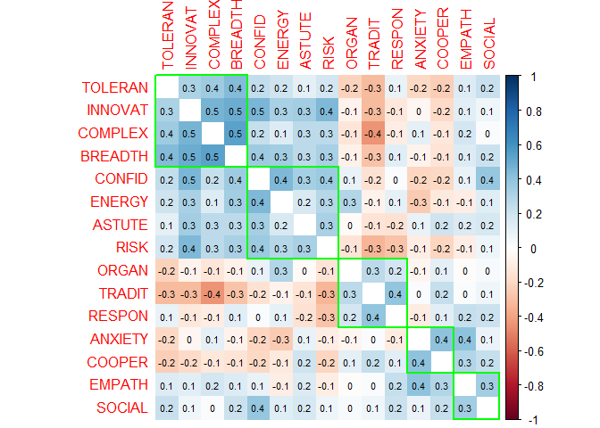
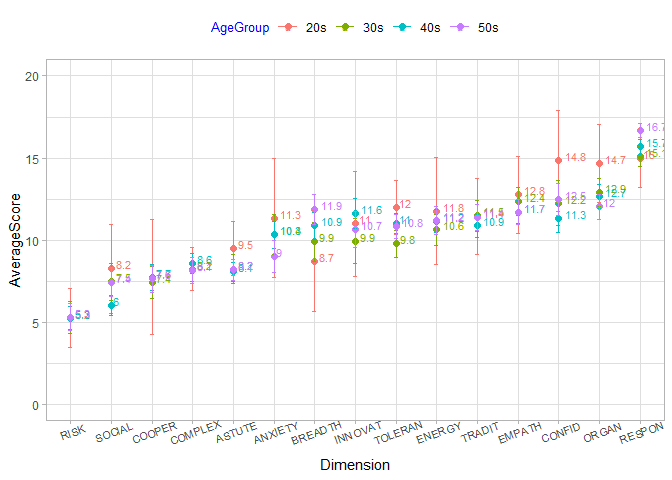
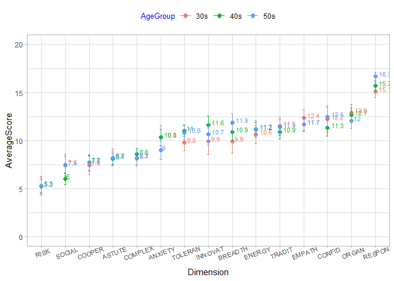
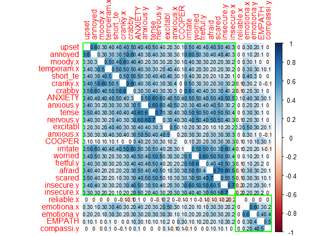

JPI-R Analysis
================

## Data obtained from the **The Eugene-Springfield Community Sample** repository at the **dataverse,** harvard.edu.

## Eugene-Springfield JPI-R Results by Gender

###### The **blue dashed line** represents mean values for males reported in Table 1-2 of the **“JPI-R Technical Manual” by Douglas Jackson** and provided to the author by Sigma.

<!-- -->

## JPI-R Technical Manual results for Males by select demographics.

##### Categories: High School, College, Blue Collar, Executives

###### Data extracted from Table 1-2 of the **“JPI-R Technical Manual” by Douglas Jackson** and provided to the author by Sigma.

<!-- -->

## Eugene-Springfield JPI-R results for Males by Age

<!-- -->

## K-Means Cluster Analysis of Eugene-Springfiled JPI-R results for males

##### K-means cluster analysis aimed to define 10 most common profiles of males. This approach is also presented in the JPI-R Technical Manual Modal Profile Analysis.

###### As described by Jackson: “Each modal profile represents the personality profile and the patterning of behavioral dimensions that is characteristic of the subset of persons in a particular population. In general, individuals will not be perfect representations of a single modal profile but, rather, combinations of several profiles. Even so, the modal profile most similar to an individual’s observed profile is likely to describe him or her best. By the identification of a variety of modal profiles that appear with some frequency in the population, it is possible to classify a majority of the individuals in terms of their similarities to these “pure” types. The extent to which this is possible is an empirical matter, but the goal is to reduce the apparently chaotic diversity of individual profiles to a manageable system involving relatively few modal profiles."

<!-- --><!-- -->

## Correlation of Vocational Interests to JPI-R Dimensions for Males

###### Data extracted from Table 4-18 of the **“JPI-R Technical Manual” by Douglas Jackson** and provided to the author by Sigma. Table 4-18 is described as Correlations between the Jackson Vocational Interest Survey (JVIS) and the JPI: Males (N = 127).

<table class="table table-striped table-hover table-condensed" style="margin-left: auto; margin-right: auto;">

<thead>

<tr>

<th style="text-align:left;position: sticky; top:0; background-color: #FFFFFF;">

JVISScale

</th>

<th style="text-align:right;position: sticky; top:0; background-color: #FFFFFF;">

COMPLEX

</th>

<th style="text-align:right;position: sticky; top:0; background-color: #FFFFFF;">

BREADTH

</th>

<th style="text-align:right;position: sticky; top:0; background-color: #FFFFFF;">

INNOVAT

</th>

<th style="text-align:right;position: sticky; top:0; background-color: #FFFFFF;">

TOLERAN

</th>

<th style="text-align:right;position: sticky; top:0; background-color: #FFFFFF;">

EMPATH

</th>

<th style="text-align:right;position: sticky; top:0; background-color: #FFFFFF;">

ANXIETY

</th>

<th style="text-align:right;position: sticky; top:0; background-color: #FFFFFF;">

COOPER

</th>

<th style="text-align:right;position: sticky; top:0; background-color: #FFFFFF;">

SOCIAL

</th>

<th style="text-align:right;position: sticky; top:0; background-color: #FFFFFF;">

COFID

</th>

<th style="text-align:right;position: sticky; top:0; background-color: #FFFFFF;">

ENERGY

</th>

<th style="text-align:right;position: sticky; top:0; background-color: #FFFFFF;">

ASTUTUE

</th>

<th style="text-align:right;position: sticky; top:0; background-color: #FFFFFF;">

RISK

</th>

<th style="text-align:right;position: sticky; top:0; background-color: #FFFFFF;">

ORGAN

</th>

<th style="text-align:right;position: sticky; top:0; background-color: #FFFFFF;">

TRADIT

</th>

<th style="text-align:right;position: sticky; top:0; background-color: #FFFFFF;">

RESPON

</th>

</tr>

</thead>

<tbody>

<tr>

<td style="text-align:left;">

AcademicAchievement

</td>

<td style="text-align:right;">

39

</td>

<td style="text-align:right;">

46

</td>

<td style="text-align:right;">

26

</td>

<td style="text-align:right;">

31

</td>

<td style="text-align:right;">

\-1

</td>

<td style="text-align:right;">

\-7

</td>

<td style="text-align:right;">

\-17

</td>

<td style="text-align:right;">

\-12

</td>

<td style="text-align:right;">

8

</td>

<td style="text-align:right;">

9

</td>

<td style="text-align:right;">

\-5

</td>

<td style="text-align:right;">

\-11

</td>

<td style="text-align:right;">

20

</td>

<td style="text-align:right;">

11

</td>

<td style="text-align:right;">

35

</td>

</tr>

<tr>

<td style="text-align:left;">

Engineering

</td>

<td style="text-align:right;">

10

</td>

<td style="text-align:right;">

9

</td>

<td style="text-align:right;">

20

</td>

<td style="text-align:right;">

4

</td>

<td style="text-align:right;">

\-20

</td>

<td style="text-align:right;">

\-21

</td>

<td style="text-align:right;">

\-5

</td>

<td style="text-align:right;">

\-15

</td>

<td style="text-align:right;">

0

</td>

<td style="text-align:right;">

16

</td>

<td style="text-align:right;">

\-2

</td>

<td style="text-align:right;">

3

</td>

<td style="text-align:right;">

12

</td>

<td style="text-align:right;">

6

</td>

<td style="text-align:right;">

5

</td>

</tr>

<tr>

<td style="text-align:left;">

Author-Journalism

</td>

<td style="text-align:right;">

40

</td>

<td style="text-align:right;">

12

</td>

<td style="text-align:right;">

20

</td>

<td style="text-align:right;">

14

</td>

<td style="text-align:right;">

\-2

</td>

<td style="text-align:right;">

1

</td>

<td style="text-align:right;">

\-12

</td>

<td style="text-align:right;">

14

</td>

<td style="text-align:right;">

17

</td>

<td style="text-align:right;">

7

</td>

<td style="text-align:right;">

11

</td>

<td style="text-align:right;">

10

</td>

<td style="text-align:right;">

\-8

</td>

<td style="text-align:right;">

\-18

</td>

<td style="text-align:right;">

0

</td>

</tr>

<tr>

<td style="text-align:left;">

SocialScience

</td>

<td style="text-align:right;">

17

</td>

<td style="text-align:right;">

22

</td>

<td style="text-align:right;">

19

</td>

<td style="text-align:right;">

9

</td>

<td style="text-align:right;">

\-12

</td>

<td style="text-align:right;">

\-8

</td>

<td style="text-align:right;">

\-21

</td>

<td style="text-align:right;">

\-28

</td>

<td style="text-align:right;">

\-6

</td>

<td style="text-align:right;">

6

</td>

<td style="text-align:right;">

\-4

</td>

<td style="text-align:right;">

\-19

</td>

<td style="text-align:right;">

4

</td>

<td style="text-align:right;">

24

</td>

<td style="text-align:right;">

22

</td>

</tr>

<tr>

<td style="text-align:left;">

Mathematics

</td>

<td style="text-align:right;">

24

</td>

<td style="text-align:right;">

11

</td>

<td style="text-align:right;">

16

</td>

<td style="text-align:right;">

13

</td>

<td style="text-align:right;">

\-21

</td>

<td style="text-align:right;">

\-7

</td>

<td style="text-align:right;">

\-18

</td>

<td style="text-align:right;">

\-19

</td>

<td style="text-align:right;">

\-7

</td>

<td style="text-align:right;">

11

</td>

<td style="text-align:right;">

\-15

</td>

<td style="text-align:right;">

\-11

</td>

<td style="text-align:right;">

15

</td>

<td style="text-align:right;">

9

</td>

<td style="text-align:right;">

20

</td>

</tr>

<tr>

<td style="text-align:left;">

TechnicalWriting

</td>

<td style="text-align:right;">

28

</td>

<td style="text-align:right;">

27

</td>

<td style="text-align:right;">

16

</td>

<td style="text-align:right;">

21

</td>

<td style="text-align:right;">

7

</td>

<td style="text-align:right;">

3

</td>

<td style="text-align:right;">

\-17

</td>

<td style="text-align:right;">

2

</td>

<td style="text-align:right;">

12

</td>

<td style="text-align:right;">

10

</td>

<td style="text-align:right;">

12

</td>

<td style="text-align:right;">

3

</td>

<td style="text-align:right;">

13

</td>

<td style="text-align:right;">

10

</td>

<td style="text-align:right;">

25

</td>

</tr>

<tr>

<td style="text-align:left;">

PhysicalScience

</td>

<td style="text-align:right;">

14

</td>

<td style="text-align:right;">

19

</td>

<td style="text-align:right;">

15

</td>

<td style="text-align:right;">

13

</td>

<td style="text-align:right;">

\-21

</td>

<td style="text-align:right;">

\-16

</td>

<td style="text-align:right;">

\-14

</td>

<td style="text-align:right;">

\-22

</td>

<td style="text-align:right;">

0

</td>

<td style="text-align:right;">

16

</td>

<td style="text-align:right;">

\-10

</td>

<td style="text-align:right;">

\-5

</td>

<td style="text-align:right;">

13

</td>

<td style="text-align:right;">

3

</td>

<td style="text-align:right;">

6

</td>

</tr>

<tr>

<td style="text-align:left;">

LifeScience

</td>

<td style="text-align:right;">

12

</td>

<td style="text-align:right;">

23

</td>

<td style="text-align:right;">

13

</td>

<td style="text-align:right;">

11

</td>

<td style="text-align:right;">

\-5

</td>

<td style="text-align:right;">

\-9

</td>

<td style="text-align:right;">

\-5

</td>

<td style="text-align:right;">

\-20

</td>

<td style="text-align:right;">

\-3

</td>

<td style="text-align:right;">

6

</td>

<td style="text-align:right;">

\-6

</td>

<td style="text-align:right;">

0

</td>

<td style="text-align:right;">

2

</td>

<td style="text-align:right;">

11

</td>

<td style="text-align:right;">

11

</td>

</tr>

<tr>

<td style="text-align:left;">

Teaching

</td>

<td style="text-align:right;">

7

</td>

<td style="text-align:right;">

20

</td>

<td style="text-align:right;">

12

</td>

<td style="text-align:right;">

12

</td>

<td style="text-align:right;">

18

</td>

<td style="text-align:right;">

12

</td>

<td style="text-align:right;">

10

</td>

<td style="text-align:right;">

22

</td>

<td style="text-align:right;">

11

</td>

<td style="text-align:right;">

\-4

</td>

<td style="text-align:right;">

11

</td>

<td style="text-align:right;">

\-8

</td>

<td style="text-align:right;">

3

</td>

<td style="text-align:right;">

4

</td>

<td style="text-align:right;">

22

</td>

</tr>

<tr>

<td style="text-align:left;">

ProfessionalAdvising

</td>

<td style="text-align:right;">

2

</td>

<td style="text-align:right;">

15

</td>

<td style="text-align:right;">

9

</td>

<td style="text-align:right;">

13

</td>

<td style="text-align:right;">

5

</td>

<td style="text-align:right;">

3

</td>

<td style="text-align:right;">

2

</td>

<td style="text-align:right;">

20

</td>

<td style="text-align:right;">

14

</td>

<td style="text-align:right;">

11

</td>

<td style="text-align:right;">

3

</td>

<td style="text-align:right;">

10

</td>

<td style="text-align:right;">

0

</td>

<td style="text-align:right;">

\-2

</td>

<td style="text-align:right;">

24

</td>

</tr>

<tr>

<td style="text-align:left;">

Independence

</td>

<td style="text-align:right;">

3

</td>

<td style="text-align:right;">

2

</td>

<td style="text-align:right;">

6

</td>

<td style="text-align:right;">

0

</td>

<td style="text-align:right;">

3

</td>

<td style="text-align:right;">

13

</td>

<td style="text-align:right;">

\-17

</td>

<td style="text-align:right;">

\-19

</td>

<td style="text-align:right;">

9

</td>

<td style="text-align:right;">

2

</td>

<td style="text-align:right;">

5

</td>

<td style="text-align:right;">

12

</td>

<td style="text-align:right;">

12

</td>

<td style="text-align:right;">

\-4

</td>

<td style="text-align:right;">

\-3

</td>

</tr>

<tr>

<td style="text-align:left;">

Stamina

</td>

<td style="text-align:right;">

11

</td>

<td style="text-align:right;">

19

</td>

<td style="text-align:right;">

3

</td>

<td style="text-align:right;">

14

</td>

<td style="text-align:right;">

\-11

</td>

<td style="text-align:right;">

\-1

</td>

<td style="text-align:right;">

\-7

</td>

<td style="text-align:right;">

\-17

</td>

<td style="text-align:right;">

2

</td>

<td style="text-align:right;">

17

</td>

<td style="text-align:right;">

\-10

</td>

<td style="text-align:right;">

\-14

</td>

<td style="text-align:right;">

22

</td>

<td style="text-align:right;">

20

</td>

<td style="text-align:right;">

21

</td>

</tr>

<tr>

<td style="text-align:left;">

HumanRelationsManagement

</td>

<td style="text-align:right;">

2

</td>

<td style="text-align:right;">

13

</td>

<td style="text-align:right;">

2

</td>

<td style="text-align:right;">

12

</td>

<td style="text-align:right;">

9

</td>

<td style="text-align:right;">

1

</td>

<td style="text-align:right;">

\-5

</td>

<td style="text-align:right;">

29

</td>

<td style="text-align:right;">

15

</td>

<td style="text-align:right;">

2

</td>

<td style="text-align:right;">

5

</td>

<td style="text-align:right;">

12

</td>

<td style="text-align:right;">

\-7

</td>

<td style="text-align:right;">

\-5

</td>

<td style="text-align:right;">

15

</td>

</tr>

<tr>

<td style="text-align:left;">

SocialService

</td>

<td style="text-align:right;">

7

</td>

<td style="text-align:right;">

7

</td>

<td style="text-align:right;">

1

</td>

<td style="text-align:right;">

20

</td>

<td style="text-align:right;">

39

</td>

<td style="text-align:right;">

15

</td>

<td style="text-align:right;">

7

</td>

<td style="text-align:right;">

25

</td>

<td style="text-align:right;">

\-6

</td>

<td style="text-align:right;">

\-14

</td>

<td style="text-align:right;">

3

</td>

<td style="text-align:right;">

\-12

</td>

<td style="text-align:right;">

\-8

</td>

<td style="text-align:right;">

\-1

</td>

<td style="text-align:right;">

23

</td>

</tr>

<tr>

<td style="text-align:left;">

Adventure

</td>

<td style="text-align:right;">

\-11

</td>

<td style="text-align:right;">

\-15

</td>

<td style="text-align:right;">

0

</td>

<td style="text-align:right;">

\-5

</td>

<td style="text-align:right;">

\-15

</td>

<td style="text-align:right;">

\-29

</td>

<td style="text-align:right;">

\-6

</td>

<td style="text-align:right;">

\-10

</td>

<td style="text-align:right;">

9

</td>

<td style="text-align:right;">

3

</td>

<td style="text-align:right;">

5

</td>

<td style="text-align:right;">

30

</td>

<td style="text-align:right;">

\-31

</td>

<td style="text-align:right;">

\-10

</td>

<td style="text-align:right;">

\-41

</td>

</tr>

<tr>

<td style="text-align:left;">

DominantLeadership

</td>

<td style="text-align:right;">

\-5

</td>

<td style="text-align:right;">

\-13

</td>

<td style="text-align:right;">

\-1

</td>

<td style="text-align:right;">

\-20

</td>

<td style="text-align:right;">

\-21

</td>

<td style="text-align:right;">

\-5

</td>

<td style="text-align:right;">

\-20

</td>

<td style="text-align:right;">

\-29

</td>

<td style="text-align:right;">

15

</td>

<td style="text-align:right;">

6

</td>

<td style="text-align:right;">

2

</td>

<td style="text-align:right;">

13

</td>

<td style="text-align:right;">

\-3

</td>

<td style="text-align:right;">

12

</td>

<td style="text-align:right;">

\-17

</td>

</tr>

<tr>

<td style="text-align:left;">

CreativeArts

</td>

<td style="text-align:right;">

3

</td>

<td style="text-align:right;">

\-15

</td>

<td style="text-align:right;">

\-2

</td>

<td style="text-align:right;">

\-12

</td>

<td style="text-align:right;">

\-9

</td>

<td style="text-align:right;">

\-1

</td>

<td style="text-align:right;">

7

</td>

<td style="text-align:right;">

\-17

</td>

<td style="text-align:right;">

\-15

</td>

<td style="text-align:right;">

\-15

</td>

<td style="text-align:right;">

\-14

</td>

<td style="text-align:right;">

\-15

</td>

<td style="text-align:right;">

\-14

</td>

<td style="text-align:right;">

\-15

</td>

<td style="text-align:right;">

\-24

</td>

</tr>

<tr>

<td style="text-align:left;">

MedicalService

</td>

<td style="text-align:right;">

\-6

</td>

<td style="text-align:right;">

\-1

</td>

<td style="text-align:right;">

\-2

</td>

<td style="text-align:right;">

9

</td>

<td style="text-align:right;">

0

</td>

<td style="text-align:right;">

\-25

</td>

<td style="text-align:right;">

\-5

</td>

<td style="text-align:right;">

2

</td>

<td style="text-align:right;">

3

</td>

<td style="text-align:right;">

7

</td>

<td style="text-align:right;">

\-8

</td>

<td style="text-align:right;">

8

</td>

<td style="text-align:right;">

\-19

</td>

<td style="text-align:right;">

\-4

</td>

<td style="text-align:right;">

\-24

</td>

</tr>

<tr>

<td style="text-align:left;">

PersonalService

</td>

<td style="text-align:right;">

\-22

</td>

<td style="text-align:right;">

\-29

</td>

<td style="text-align:right;">

\-3

</td>

<td style="text-align:right;">

\-22

</td>

<td style="text-align:right;">

\-2

</td>

<td style="text-align:right;">

\-5

</td>

<td style="text-align:right;">

4

</td>

<td style="text-align:right;">

4

</td>

<td style="text-align:right;">

2

</td>

<td style="text-align:right;">

\-10

</td>

<td style="text-align:right;">

3

</td>

<td style="text-align:right;">

9

</td>

<td style="text-align:right;">

\-15

</td>

<td style="text-align:right;">

\-8

</td>

<td style="text-align:right;">

\-36

</td>

</tr>

<tr>

<td style="text-align:left;">

Supervision

</td>

<td style="text-align:right;">

\-9

</td>

<td style="text-align:right;">

\-12

</td>

<td style="text-align:right;">

\-4

</td>

<td style="text-align:right;">

\-1

</td>

<td style="text-align:right;">

\-5

</td>

<td style="text-align:right;">

3

</td>

<td style="text-align:right;">

1

</td>

<td style="text-align:right;">

20

</td>

<td style="text-align:right;">

10

</td>

<td style="text-align:right;">

\-2

</td>

<td style="text-align:right;">

14

</td>

<td style="text-align:right;">

24

</td>

<td style="text-align:right;">

\-6

</td>

<td style="text-align:right;">

\-15

</td>

<td style="text-align:right;">

\-5

</td>

</tr>

<tr>

<td style="text-align:left;">

Finance

</td>

<td style="text-align:right;">

\-17

</td>

<td style="text-align:right;">

\-3

</td>

<td style="text-align:right;">

\-6

</td>

<td style="text-align:right;">

\-4

</td>

<td style="text-align:right;">

\-9

</td>

<td style="text-align:right;">

\-11

</td>

<td style="text-align:right;">

2

</td>

<td style="text-align:right;">

13

</td>

<td style="text-align:right;">

4

</td>

<td style="text-align:right;">

12

</td>

<td style="text-align:right;">

3

</td>

<td style="text-align:right;">

29

</td>

<td style="text-align:right;">

10

</td>

<td style="text-align:right;">

\-12

</td>

<td style="text-align:right;">

\-9

</td>

</tr>

<tr>

<td style="text-align:left;">

PerformingArts

</td>

<td style="text-align:right;">

\-2

</td>

<td style="text-align:right;">

\-22

</td>

<td style="text-align:right;">

\-7

</td>

<td style="text-align:right;">

\-9

</td>

<td style="text-align:right;">

\-1

</td>

<td style="text-align:right;">

\-6

</td>

<td style="text-align:right;">

\-7

</td>

<td style="text-align:right;">

1

</td>

<td style="text-align:right;">

3

</td>

<td style="text-align:right;">

\-11

</td>

<td style="text-align:right;">

\-3

</td>

<td style="text-align:right;">

5

</td>

<td style="text-align:right;">

\-32

</td>

<td style="text-align:right;">

\-14

</td>

<td style="text-align:right;">

\-38

</td>

</tr>

<tr>

<td style="text-align:left;">

Accountability

</td>

<td style="text-align:right;">

\-18

</td>

<td style="text-align:right;">

10

</td>

<td style="text-align:right;">

\-7

</td>

<td style="text-align:right;">

\-5

</td>

<td style="text-align:right;">

13

</td>

<td style="text-align:right;">

24

</td>

<td style="text-align:right;">

20

</td>

<td style="text-align:right;">

\-8

</td>

<td style="text-align:right;">

\-13

</td>

<td style="text-align:right;">

0

</td>

<td style="text-align:right;">

\-5

</td>

<td style="text-align:right;">

\-34

</td>

<td style="text-align:right;">

23

</td>

<td style="text-align:right;">

30

</td>

<td style="text-align:right;">

35

</td>

</tr>

<tr>

<td style="text-align:left;">

ElementaryEducation

</td>

<td style="text-align:right;">

5

</td>

<td style="text-align:right;">

10

</td>

<td style="text-align:right;">

\-7

</td>

<td style="text-align:right;">

11

</td>

<td style="text-align:right;">

30

</td>

<td style="text-align:right;">

22

</td>

<td style="text-align:right;">

21

</td>

<td style="text-align:right;">

33

</td>

<td style="text-align:right;">

\-11

</td>

<td style="text-align:right;">

\-10

</td>

<td style="text-align:right;">

6

</td>

<td style="text-align:right;">

\-22

</td>

<td style="text-align:right;">

6

</td>

<td style="text-align:right;">

5

</td>

<td style="text-align:right;">

26

</td>

</tr>

<tr>

<td style="text-align:left;">

Sales

</td>

<td style="text-align:right;">

\-7

</td>

<td style="text-align:right;">

\-11

</td>

<td style="text-align:right;">

\-7

</td>

<td style="text-align:right;">

\-2

</td>

<td style="text-align:right;">

9

</td>

<td style="text-align:right;">

10

</td>

<td style="text-align:right;">

11

</td>

<td style="text-align:right;">

32

</td>

<td style="text-align:right;">

6

</td>

<td style="text-align:right;">

\-4

</td>

<td style="text-align:right;">

18

</td>

<td style="text-align:right;">

21

</td>

<td style="text-align:right;">

\-1

</td>

<td style="text-align:right;">

\-21

</td>

<td style="text-align:right;">

\-10

</td>

</tr>

<tr>

<td style="text-align:left;">

Planfulness

</td>

<td style="text-align:right;">

\-17

</td>

<td style="text-align:right;">

\-2

</td>

<td style="text-align:right;">

\-7

</td>

<td style="text-align:right;">

\-14

</td>

<td style="text-align:right;">

13

</td>

<td style="text-align:right;">

18

</td>

<td style="text-align:right;">

17

</td>

<td style="text-align:right;">

0

</td>

<td style="text-align:right;">

\-6

</td>

<td style="text-align:right;">

\-8

</td>

<td style="text-align:right;">

\-2

</td>

<td style="text-align:right;">

\-17

</td>

<td style="text-align:right;">

38

</td>

<td style="text-align:right;">

12

</td>

<td style="text-align:right;">

15

</td>

</tr>

<tr>

<td style="text-align:left;">

Law

</td>

<td style="text-align:right;">

\-8

</td>

<td style="text-align:right;">

\-19

</td>

<td style="text-align:right;">

\-9

</td>

<td style="text-align:right;">

\-6

</td>

<td style="text-align:right;">

1

</td>

<td style="text-align:right;">

2

</td>

<td style="text-align:right;">

\-5

</td>

<td style="text-align:right;">

24

</td>

<td style="text-align:right;">

9

</td>

<td style="text-align:right;">

8

</td>

<td style="text-align:right;">

12

</td>

<td style="text-align:right;">

26

</td>

<td style="text-align:right;">

\-2

</td>

<td style="text-align:right;">

\-13

</td>

<td style="text-align:right;">

\-13

</td>

</tr>

<tr>

<td style="text-align:left;">

FamilyActivity

</td>

<td style="text-align:right;">

\-14

</td>

<td style="text-align:right;">

\-20

</td>

<td style="text-align:right;">

\-11

</td>

<td style="text-align:right;">

\-11

</td>

<td style="text-align:right;">

\-2

</td>

<td style="text-align:right;">

\-4

</td>

<td style="text-align:right;">

9

</td>

<td style="text-align:right;">

\-11

</td>

<td style="text-align:right;">

\-10

</td>

<td style="text-align:right;">

\-9

</td>

<td style="text-align:right;">

\-14

</td>

<td style="text-align:right;">

\-4

</td>

<td style="text-align:right;">

\-13

</td>

<td style="text-align:right;">

\-9

</td>

<td style="text-align:right;">

\-23

</td>

</tr>

<tr>

<td style="text-align:left;">

Business

</td>

<td style="text-align:right;">

\-20

</td>

<td style="text-align:right;">

\-20

</td>

<td style="text-align:right;">

\-14

</td>

<td style="text-align:right;">

\-15

</td>

<td style="text-align:right;">

8

</td>

<td style="text-align:right;">

12

</td>

<td style="text-align:right;">

12

</td>

<td style="text-align:right;">

22

</td>

<td style="text-align:right;">

\-1

</td>

<td style="text-align:right;">

\-7

</td>

<td style="text-align:right;">

10

</td>

<td style="text-align:right;">

13

</td>

<td style="text-align:right;">

1

</td>

<td style="text-align:right;">

\-16

</td>

<td style="text-align:right;">

\-1

</td>

</tr>

<tr>

<td style="text-align:left;">

SkilledTrades

</td>

<td style="text-align:right;">

\-14

</td>

<td style="text-align:right;">

\-34

</td>

<td style="text-align:right;">

\-15

</td>

<td style="text-align:right;">

\-23

</td>

<td style="text-align:right;">

4

</td>

<td style="text-align:right;">

7

</td>

<td style="text-align:right;">

13

</td>

<td style="text-align:right;">

\-13

</td>

<td style="text-align:right;">

\-19

</td>

<td style="text-align:right;">

\-13

</td>

<td style="text-align:right;">

\-10

</td>

<td style="text-align:right;">

\-14

</td>

<td style="text-align:right;">

\-7

</td>

<td style="text-align:right;">

1

</td>

<td style="text-align:right;">

\-25

</td>

</tr>

<tr>

<td style="text-align:left;">

Nature-Agriculture

</td>

<td style="text-align:right;">

\-10

</td>

<td style="text-align:right;">

\-1

</td>

<td style="text-align:right;">

\-16

</td>

<td style="text-align:right;">

\-9

</td>

<td style="text-align:right;">

1

</td>

<td style="text-align:right;">

\-5

</td>

<td style="text-align:right;">

8

</td>

<td style="text-align:right;">

\-15

</td>

<td style="text-align:right;">

\-9

</td>

<td style="text-align:right;">

0

</td>

<td style="text-align:right;">

\-5

</td>

<td style="text-align:right;">

0

</td>

<td style="text-align:right;">

\-8

</td>

<td style="text-align:right;">

11

</td>

<td style="text-align:right;">

\-13

</td>

</tr>

<tr>

<td style="text-align:left;">

OfficeWork

</td>

<td style="text-align:right;">

\-27

</td>

<td style="text-align:right;">

\-23

</td>

<td style="text-align:right;">

\-29

</td>

<td style="text-align:right;">

\-27

</td>

<td style="text-align:right;">

\-1

</td>

<td style="text-align:right;">

4

</td>

<td style="text-align:right;">

11

</td>

<td style="text-align:right;">

\-2

</td>

<td style="text-align:right;">

\-21

</td>

<td style="text-align:right;">

\-22

</td>

<td style="text-align:right;">

1

</td>

<td style="text-align:right;">

2

</td>

<td style="text-align:right;">

\-1

</td>

<td style="text-align:right;">

\-11

</td>

<td style="text-align:right;">

\-12

</td>

</tr>

<tr>

<td style="text-align:left;">

JobSecurity

</td>

<td style="text-align:right;">

\-43

</td>

<td style="text-align:right;">

\-30

</td>

<td style="text-align:right;">

\-33

</td>

<td style="text-align:right;">

\-43

</td>

<td style="text-align:right;">

12

</td>

<td style="text-align:right;">

32

</td>

<td style="text-align:right;">

36

</td>

<td style="text-align:right;">

\-7

</td>

<td style="text-align:right;">

\-30

</td>

<td style="text-align:right;">

\-30

</td>

<td style="text-align:right;">

\-1

</td>

<td style="text-align:right;">

\-38

</td>

<td style="text-align:right;">

1

</td>

<td style="text-align:right;">

21

</td>

<td style="text-align:right;">

3

</td>

</tr>

</tbody>

</table>

## JPI-R correlations to a test constructed of 8-10 IPIP Items for each JPI-R dimension

##### All CAPS represents the JPI-R dimension; lower case represents a replicated scale using IPIP items.

<!-- -->

## Demonstration of JPI-R and IPIP test results for a select individual

<!-- -->

## Summary Table: IPIP Questions

<table class="table table-striped table-hover table-condensed" style="margin-left: auto; margin-right: auto;">

<thead>

<tr>

<th style="text-align:left;position: sticky; top:0; background-color: #FFFFFF;">

Category

</th>

<th style="text-align:left;position: sticky; top:0; background-color: #FFFFFF;">

IPIP\_Item\#

</th>

<th style="text-align:right;position: sticky; top:0; background-color: #FFFFFF;">

Correlation

</th>

<th style="text-align:left;position: sticky; top:0; background-color: #FFFFFF;">

Question

</th>

</tr>

</thead>

<tbody>

<tr>

<td style="text-align:left;">

ANXIETY

</td>

<td style="text-align:left;">

H926

</td>

<td style="text-align:right;">

0.65

</td>

<td style="text-align:left;">

Change my mood a lot.

</td>

</tr>

<tr>

<td style="text-align:left;">

ANXIETY

</td>

<td style="text-align:left;">

H927

</td>

<td style="text-align:right;">

0.59

</td>

<td style="text-align:left;">

NA

</td>

</tr>

<tr>

<td style="text-align:left;">

ANXIETY

</td>

<td style="text-align:left;">

H754

</td>

<td style="text-align:right;">

0.57

</td>

<td style="text-align:left;">

NA

</td>

</tr>

<tr>

<td style="text-align:left;">

ANXIETY

</td>

<td style="text-align:left;">

H761

</td>

<td style="text-align:right;">

0.57

</td>

<td style="text-align:left;">

Get irritated easily.

</td>

</tr>

<tr>

<td style="text-align:left;">

ANXIETY

</td>

<td style="text-align:left;">

H755

</td>

<td style="text-align:right;">

0.55

</td>

<td style="text-align:left;">

Lose my temper.

</td>

</tr>

<tr>

<td style="text-align:left;">

ANXIETY

</td>

<td style="text-align:left;">

H758

</td>

<td style="text-align:right;">

0.55

</td>

<td style="text-align:left;">

Act out my frustrations on others.

</td>

</tr>

<tr>

<td style="text-align:left;">

ANXIETY

</td>

<td style="text-align:left;">

E92

</td>

<td style="text-align:right;">

0.55

</td>

<td style="text-align:left;">

Have frequent mood swings.

</td>

</tr>

<tr>

<td style="text-align:left;">

ANXIETY

</td>

<td style="text-align:left;">

S3

</td>

<td style="text-align:right;">

0.52

</td>

<td style="text-align:left;">

Am often worried by things that I said or did

</td>

</tr>

<tr>

<td style="text-align:left;">

ANXIETY

</td>

<td style="text-align:left;">

H1157

</td>

<td style="text-align:right;">

0.51

</td>

<td style="text-align:left;">

NA

</td>

</tr>

<tr>

<td style="text-align:left;">

ANXIETY

</td>

<td style="text-align:left;">

Q77

</td>

<td style="text-align:right;">

0.51

</td>

<td style="text-align:left;">

Get easily agitated.

</td>

</tr>

<tr>

<td style="text-align:left;">

ANXIETY

</td>

<td style="text-align:left;">

E150

</td>

<td style="text-align:right;">

\-0.53

</td>

<td style="text-align:left;">

Don’t worry about things that have already happened.

</td>

</tr>

<tr>

<td style="text-align:left;">

ANXIETY

</td>

<td style="text-align:left;">

E141

</td>

<td style="text-align:right;">

\-0.54

</td>

<td style="text-align:left;">

Am relaxed most of the time.

</td>

</tr>

<tr>

<td style="text-align:left;">

ANXIETY

</td>

<td style="text-align:left;">

X236

</td>

<td style="text-align:right;">

\-0.54

</td>

<td style="text-align:left;">

Never get furious.

</td>

</tr>

<tr>

<td style="text-align:left;">

ANXIETY

</td>

<td style="text-align:left;">

X265

</td>

<td style="text-align:right;">

\-0.55

</td>

<td style="text-align:left;">

Rarely get irritated.

</td>

</tr>

<tr>

<td style="text-align:left;">

ANXIETY

</td>

<td style="text-align:left;">

X269

</td>

<td style="text-align:right;">

\-0.61

</td>

<td style="text-align:left;">

Can accept criticism without getting upset.

</td>

</tr>

<tr>

<td style="text-align:left;">

ASTUTE

</td>

<td style="text-align:left;">

R78

</td>

<td style="text-align:right;">

0.52

</td>

<td style="text-align:left;">

Can play many roles convincingly.

</td>

</tr>

<tr>

<td style="text-align:left;">

BREADTH

</td>

<td style="text-align:left;">

V2

</td>

<td style="text-align:right;">

0.53

</td>

<td style="text-align:left;">

Go out of my way to attend educational events.

</td>

</tr>

<tr>

<td style="text-align:left;">

BREADTH

</td>

<td style="text-align:left;">

H1247

</td>

<td style="text-align:right;">

0.52

</td>

<td style="text-align:left;">

Can say things beautifully.

</td>

</tr>

<tr>

<td style="text-align:left;">

BREADTH

</td>

<td style="text-align:left;">

H1284

</td>

<td style="text-align:right;">

0.51

</td>

<td style="text-align:left;">

Show a mastery of language.

</td>

</tr>

<tr>

<td style="text-align:left;">

BREADTH

</td>

<td style="text-align:left;">

X211

</td>

<td style="text-align:right;">

0.51

</td>

<td style="text-align:left;">

Love to read challenging material.

</td>

</tr>

<tr>

<td style="text-align:left;">

BREADTH

</td>

<td style="text-align:left;">

H1042

</td>

<td style="text-align:right;">

\-0.51

</td>

<td style="text-align:left;">

Never challenge things.

</td>

</tr>

<tr>

<td style="text-align:left;">

BREADTH

</td>

<td style="text-align:left;">

X109

</td>

<td style="text-align:right;">

\-0.56

</td>

<td style="text-align:left;">

Avoid difficult reading material.

</td>

</tr>

<tr>

<td style="text-align:left;">

COMPLEX

</td>

<td style="text-align:left;">

X157

</td>

<td style="text-align:right;">

\-0.50

</td>

<td style="text-align:left;">

Believe that we should be tough on crime.

</td>

</tr>

<tr>

<td style="text-align:left;">

COMPLEX

</td>

<td style="text-align:left;">

X178

</td>

<td style="text-align:right;">

\-0.53

</td>

<td style="text-align:left;">

Believe that laws should be strictly enforced.

</td>

</tr>

<tr>

<td style="text-align:left;">

COMPLEX

</td>

<td style="text-align:left;">

X176

</td>

<td style="text-align:right;">

\-0.56

</td>

<td style="text-align:left;">

Have difficulty understanding abstract ideas.

</td>

</tr>

<tr>

<td style="text-align:left;">

COMPLEX

</td>

<td style="text-align:left;">

X228

</td>

<td style="text-align:right;">

\-0.57

</td>

<td style="text-align:left;">

Am not interested in abstract ideas.

</td>

</tr>

<tr>

<td style="text-align:left;">

CONFID

</td>

<td style="text-align:left;">

Q134

</td>

<td style="text-align:right;">

0.61

</td>

<td style="text-align:left;">

Have leadership abilities.

</td>

</tr>

<tr>

<td style="text-align:left;">

CONFID

</td>

<td style="text-align:left;">

S29

</td>

<td style="text-align:right;">

0.61

</td>

<td style="text-align:left;">

Like being the center of attention at a party or a social meeting

</td>

</tr>

<tr>

<td style="text-align:left;">

CONFID

</td>

<td style="text-align:left;">

P364

</td>

<td style="text-align:right;">

0.60

</td>

<td style="text-align:left;">

Am good at making impromptu speeches.

</td>

</tr>

<tr>

<td style="text-align:left;">

CONFID

</td>

<td style="text-align:left;">

Q176

</td>

<td style="text-align:right;">

0.58

</td>

<td style="text-align:left;">

Act as a leader.

</td>

</tr>

<tr>

<td style="text-align:left;">

CONFID

</td>

<td style="text-align:left;">

Q14

</td>

<td style="text-align:right;">

0.58

</td>

<td style="text-align:left;">

Have a strong personality.

</td>

</tr>

<tr>

<td style="text-align:left;">

CONFID

</td>

<td style="text-align:left;">

H17

</td>

<td style="text-align:right;">

0.57

</td>

<td style="text-align:left;">

Express myself easily.

</td>

</tr>

<tr>

<td style="text-align:left;">

CONFID

</td>

<td style="text-align:left;">

H773

</td>

<td style="text-align:right;">

0.57

</td>

<td style="text-align:left;">

Seek to influence others.

</td>

</tr>

<tr>

<td style="text-align:left;">

CONFID

</td>

<td style="text-align:left;">

H1366

</td>

<td style="text-align:right;">

0.57

</td>

<td style="text-align:left;">

Am skilled in handling social situations.

</td>

</tr>

<tr>

<td style="text-align:left;">

CONFID

</td>

<td style="text-align:left;">

P432

</td>

<td style="text-align:right;">

0.56

</td>

<td style="text-align:left;">

Have a natural talent for influencing people.

</td>

</tr>

<tr>

<td style="text-align:left;">

CONFID

</td>

<td style="text-align:left;">

H1287

</td>

<td style="text-align:right;">

0.55

</td>

<td style="text-align:left;">

Think quickly.

</td>

</tr>

<tr>

<td style="text-align:left;">

CONFID

</td>

<td style="text-align:left;">

V50

</td>

<td style="text-align:right;">

0.54

</td>

<td style="text-align:left;">

Prefer to participate fully rather than view life from the sidelines.

</td>

</tr>

<tr>

<td style="text-align:left;">

CONFID

</td>

<td style="text-align:left;">

H34

</td>

<td style="text-align:right;">

0.54

</td>

<td style="text-align:left;">

NA

</td>

</tr>

<tr>

<td style="text-align:left;">

CONFID

</td>

<td style="text-align:left;">

H16

</td>

<td style="text-align:right;">

0.54

</td>

<td style="text-align:left;">

Start conversations.

</td>

</tr>

<tr>

<td style="text-align:left;">

CONFID

</td>

<td style="text-align:left;">

P439

</td>

<td style="text-align:right;">

0.53

</td>

<td style="text-align:left;">

See myself as a good leader.

</td>

</tr>

<tr>

<td style="text-align:left;">

CONFID

</td>

<td style="text-align:left;">

P445

</td>

<td style="text-align:right;">

0.52

</td>

<td style="text-align:left;">

Have a strong need for power.

</td>

</tr>

<tr>

<td style="text-align:left;">

CONFID

</td>

<td style="text-align:left;">

P473

</td>

<td style="text-align:right;">

0.52

</td>

<td style="text-align:left;">

Like to take responsibility for making decisions.

</td>

</tr>

<tr>

<td style="text-align:left;">

CONFID

</td>

<td style="text-align:left;">

Q24

</td>

<td style="text-align:right;">

0.52

</td>

<td style="text-align:left;">

Have the ability to be a good teacher.

</td>

</tr>

<tr>

<td style="text-align:left;">

CONFID

</td>

<td style="text-align:left;">

H1310

</td>

<td style="text-align:right;">

0.51

</td>

<td style="text-align:left;">

Understand things quickly.

</td>

</tr>

<tr>

<td style="text-align:left;">

CONFID

</td>

<td style="text-align:left;">

X112

</td>

<td style="text-align:right;">

0.50

</td>

<td style="text-align:left;">

Feel comfortable around people.

</td>

</tr>

<tr>

<td style="text-align:left;">

CONFID

</td>

<td style="text-align:left;">

X83

</td>

<td style="text-align:right;">

0.50

</td>

<td style="text-align:left;">

Talk to a lot of different people at parties.

</td>

</tr>

<tr>

<td style="text-align:left;">

CONFID

</td>

<td style="text-align:left;">

V299

</td>

<td style="text-align:right;">

\-0.50

</td>

<td style="text-align:left;">

Don’t think it’s important to socialize with others.

</td>

</tr>

<tr>

<td style="text-align:left;">

CONFID

</td>

<td style="text-align:left;">

V189

</td>

<td style="text-align:right;">

\-0.50

</td>

<td style="text-align:left;">

Am not considered to have new and different ideas.

</td>

</tr>

<tr>

<td style="text-align:left;">

CONFID

</td>

<td style="text-align:left;">

X147

</td>

<td style="text-align:right;">

\-0.50

</td>

<td style="text-align:left;">

Would describe my experiences as somewhat dull.

</td>

</tr>

<tr>

<td style="text-align:left;">

CONFID

</td>

<td style="text-align:left;">

V262

</td>

<td style="text-align:right;">

\-0.51

</td>

<td style="text-align:left;">

Am rarely consulted for advice by others.

</td>

</tr>

<tr>

<td style="text-align:left;">

CONFID

</td>

<td style="text-align:left;">

P359

</td>

<td style="text-align:right;">

\-0.52

</td>

<td style="text-align:left;">

Dislike taking responsibility for making decisions.

</td>

</tr>

<tr>

<td style="text-align:left;">

CONFID

</td>

<td style="text-align:left;">

R30

</td>

<td style="text-align:right;">

\-0.52

</td>

<td style="text-align:left;">

Would be nervous playing the clown in front of other people.

</td>

</tr>

<tr>

<td style="text-align:left;">

CONFID

</td>

<td style="text-align:left;">

H154

</td>

<td style="text-align:right;">

\-0.52

</td>

<td style="text-align:left;">

NA

</td>

</tr>

<tr>

<td style="text-align:left;">

CONFID

</td>

<td style="text-align:left;">

H679

</td>

<td style="text-align:right;">

\-0.52

</td>

<td style="text-align:left;">

Hold back my opinions.

</td>

</tr>

<tr>

<td style="text-align:left;">

CONFID

</td>

<td style="text-align:left;">

X272

</td>

<td style="text-align:right;">

\-0.53

</td>

<td style="text-align:left;">

Do not have a good imagination.

</td>

</tr>

<tr>

<td style="text-align:left;">

CONFID

</td>

<td style="text-align:left;">

H1032

</td>

<td style="text-align:right;">

\-0.54

</td>

<td style="text-align:left;">

Have little to contribute.

</td>

</tr>

<tr>

<td style="text-align:left;">

CONFID

</td>

<td style="text-align:left;">

V183

</td>

<td style="text-align:right;">

\-0.55

</td>

<td style="text-align:left;">

Keep to myself.

</td>

</tr>

<tr>

<td style="text-align:left;">

CONFID

</td>

<td style="text-align:left;">

S25

</td>

<td style="text-align:right;">

\-0.56

</td>

<td style="text-align:left;">

Am a shy person

</td>

</tr>

<tr>

<td style="text-align:left;">

CONFID

</td>

<td style="text-align:left;">

P388

</td>

<td style="text-align:right;">

\-0.56

</td>

<td style="text-align:left;">

Am less capable than most people.

</td>

</tr>

<tr>

<td style="text-align:left;">

CONFID

</td>

<td style="text-align:left;">

R17

</td>

<td style="text-align:right;">

\-0.56

</td>

<td style="text-align:left;">

Prefer to let others be the center of attention.

</td>

</tr>

<tr>

<td style="text-align:left;">

CONFID

</td>

<td style="text-align:left;">

H1039

</td>

<td style="text-align:right;">

\-0.57

</td>

<td style="text-align:left;">

Have little to say.

</td>

</tr>

<tr>

<td style="text-align:left;">

CONFID

</td>

<td style="text-align:left;">

V105

</td>

<td style="text-align:right;">

\-0.57

</td>

<td style="text-align:left;">

Am not good at taking charge of a group.

</td>

</tr>

<tr>

<td style="text-align:left;">

CONFID

</td>

<td style="text-align:left;">

S16

</td>

<td style="text-align:right;">

\-0.59

</td>

<td style="text-align:left;">

When with a group, have difficulties selecting a good topic to talk
about

</td>

</tr>

<tr>

<td style="text-align:left;">

CONFID

</td>

<td style="text-align:left;">

P346

</td>

<td style="text-align:right;">

\-0.59

</td>

<td style="text-align:left;">

Lack the talent for influencing people.

</td>

</tr>

<tr>

<td style="text-align:left;">

CONFID

</td>

<td style="text-align:left;">

Q45

</td>

<td style="text-align:right;">

\-0.60

</td>

<td style="text-align:left;">

Would be afraid to give a speech in public.

</td>

</tr>

<tr>

<td style="text-align:left;">

CONFID

</td>

<td style="text-align:left;">

V91

</td>

<td style="text-align:right;">

\-0.64

</td>

<td style="text-align:left;">

Am very shy in social situations.

</td>

</tr>

<tr>

<td style="text-align:left;">

CONFID

</td>

<td style="text-align:left;">

S22

</td>

<td style="text-align:right;">

\-0.67

</td>

<td style="text-align:left;">

Try to avoid speaking in public

</td>

</tr>

<tr>

<td style="text-align:left;">

CONFID

</td>

<td style="text-align:left;">

V43

</td>

<td style="text-align:right;">

\-0.68

</td>

<td style="text-align:left;">

Don’t know how to handle myself in a new social situation.

</td>

</tr>

<tr>

<td style="text-align:left;">

COOPER

</td>

<td style="text-align:left;">

E134

</td>

<td style="text-align:right;">

\-0.54

</td>

<td style="text-align:left;">

Don’t care what others think.

</td>

</tr>

<tr>

<td style="text-align:left;">

EMPATH

</td>

<td style="text-align:left;">

E174

</td>

<td style="text-align:right;">

0.53

</td>

<td style="text-align:left;">

Am passionate about causes.

</td>

</tr>

<tr>

<td style="text-align:left;">

EMPATH

</td>

<td style="text-align:left;">

D19

</td>

<td style="text-align:right;">

0.53

</td>

<td style="text-align:left;">

Am passionate about bettering the world’s condition.

</td>

</tr>

<tr>

<td style="text-align:left;">

EMPATH

</td>

<td style="text-align:left;">

D93

</td>

<td style="text-align:right;">

\-0.60

</td>

<td style="text-align:left;">

Am seldom bothered by the apparent suffering of strangers.

</td>

</tr>

<tr>

<td style="text-align:left;">

ENERGY

</td>

<td style="text-align:left;">

H79

</td>

<td style="text-align:right;">

0.61

</td>

<td style="text-align:left;">

Do a lot in my spare time.

</td>

</tr>

<tr>

<td style="text-align:left;">

ENERGY

</td>

<td style="text-align:left;">

V50

</td>

<td style="text-align:right;">

0.58

</td>

<td style="text-align:left;">

Prefer to participate fully rather than view life from the sidelines.

</td>

</tr>

<tr>

<td style="text-align:left;">

ENERGY

</td>

<td style="text-align:left;">

D109

</td>

<td style="text-align:right;">

0.54

</td>

<td style="text-align:left;">

Can make myself work on a difficult task even when I don’t feel like
trying.

</td>

</tr>

<tr>

<td style="text-align:left;">

ENERGY

</td>

<td style="text-align:left;">

Q151

</td>

<td style="text-align:right;">

0.53

</td>

<td style="text-align:left;">

Maintain high energy throughout the day.

</td>

</tr>

<tr>

<td style="text-align:left;">

ENERGY

</td>

<td style="text-align:left;">

H533

</td>

<td style="text-align:right;">

0.53

</td>

<td style="text-align:left;">

Can easily push myself forward.

</td>

</tr>

<tr>

<td style="text-align:left;">

ENERGY

</td>

<td style="text-align:left;">

H555

</td>

<td style="text-align:right;">

0.53

</td>

<td style="text-align:left;">

Get things done quickly.

</td>

</tr>

<tr>

<td style="text-align:left;">

ENERGY

</td>

<td style="text-align:left;">

H554

</td>

<td style="text-align:right;">

0.52

</td>

<td style="text-align:left;">

Accomplish a lot of work.

</td>

</tr>

<tr>

<td style="text-align:left;">

ENERGY

</td>

<td style="text-align:left;">

H2015

</td>

<td style="text-align:right;">

0.52

</td>

<td style="text-align:left;">

Enjoy being on the go.

</td>

</tr>

<tr>

<td style="text-align:left;">

ENERGY

</td>

<td style="text-align:left;">

H54

</td>

<td style="text-align:right;">

0.51

</td>

<td style="text-align:left;">

NA

</td>

</tr>

<tr>

<td style="text-align:left;">

ENERGY

</td>

<td style="text-align:left;">

H1287

</td>

<td style="text-align:right;">

0.51

</td>

<td style="text-align:left;">

Think quickly.

</td>

</tr>

<tr>

<td style="text-align:left;">

ENERGY

</td>

<td style="text-align:left;">

Q176

</td>

<td style="text-align:right;">

0.51

</td>

<td style="text-align:left;">

Act as a leader.

</td>

</tr>

<tr>

<td style="text-align:left;">

ENERGY

</td>

<td style="text-align:left;">

H627

</td>

<td style="text-align:right;">

\-0.52

</td>

<td style="text-align:left;">

Hang around doing nothing.

</td>

</tr>

<tr>

<td style="text-align:left;">

ENERGY

</td>

<td style="text-align:left;">

V211

</td>

<td style="text-align:right;">

\-0.54

</td>

<td style="text-align:left;">

Don’t have much energy.

</td>

</tr>

<tr>

<td style="text-align:left;">

ENERGY

</td>

<td style="text-align:left;">

H1144

</td>

<td style="text-align:right;">

\-0.55

</td>

<td style="text-align:left;">

NA

</td>

</tr>

<tr>

<td style="text-align:left;">

INNOVAT

</td>

<td style="text-align:left;">

H53

</td>

<td style="text-align:right;">

0.67

</td>

<td style="text-align:left;">

Am full of ideas.

</td>

</tr>

<tr>

<td style="text-align:left;">

INNOVAT

</td>

<td style="text-align:left;">

V259

</td>

<td style="text-align:right;">

0.65

</td>

<td style="text-align:left;">

Have an imagination that stretches beyond that of my friends.

</td>

</tr>

<tr>

<td style="text-align:left;">

INNOVAT

</td>

<td style="text-align:left;">

V5

</td>

<td style="text-align:right;">

0.64

</td>

<td style="text-align:left;">

Am able to come up with new and different ideas.

</td>

</tr>

<tr>

<td style="text-align:left;">

INNOVAT

</td>

<td style="text-align:left;">

V226

</td>

<td style="text-align:right;">

0.64

</td>

<td style="text-align:left;">

Am an original thinker.

</td>

</tr>

<tr>

<td style="text-align:left;">

INNOVAT

</td>

<td style="text-align:left;">

H1313

</td>

<td style="text-align:right;">

0.64

</td>

<td style="text-align:left;">

Have excellent ideas.

</td>

</tr>

<tr>

<td style="text-align:left;">

INNOVAT

</td>

<td style="text-align:left;">

X14

</td>

<td style="text-align:right;">

0.64

</td>

<td style="text-align:left;">

Have a vivid imagination.

</td>

</tr>

<tr>

<td style="text-align:left;">

INNOVAT

</td>

<td style="text-align:left;">

H1230

</td>

<td style="text-align:right;">

0.62

</td>

<td style="text-align:left;">

Come up with something new.

</td>

</tr>

<tr>

<td style="text-align:left;">

INNOVAT

</td>

<td style="text-align:left;">

H471

</td>

<td style="text-align:right;">

0.60

</td>

<td style="text-align:left;">

Quickly think up new ideas.

</td>

</tr>

<tr>

<td style="text-align:left;">

INNOVAT

</td>

<td style="text-align:left;">

H1279

</td>

<td style="text-align:right;">

0.58

</td>

<td style="text-align:left;">

Can improvise.

</td>

</tr>

<tr>

<td style="text-align:left;">

INNOVAT

</td>

<td style="text-align:left;">

V155

</td>

<td style="text-align:right;">

0.58

</td>

<td style="text-align:left;">

Come up with new ways to do things.

</td>

</tr>

<tr>

<td style="text-align:left;">

INNOVAT

</td>

<td style="text-align:left;">

H60

</td>

<td style="text-align:right;">

0.58

</td>

<td style="text-align:left;">

Quickly recognize possibilities.

</td>

</tr>

<tr>

<td style="text-align:left;">

INNOVAT

</td>

<td style="text-align:left;">

X225

</td>

<td style="text-align:right;">

0.57

</td>

<td style="text-align:left;">

Love to think up new ways of doing things.

</td>

</tr>

<tr>

<td style="text-align:left;">

INNOVAT

</td>

<td style="text-align:left;">

V71

</td>

<td style="text-align:right;">

0.57

</td>

<td style="text-align:left;">

Like to think of new ways to do things.

</td>

</tr>

<tr>

<td style="text-align:left;">

INNOVAT

</td>

<td style="text-align:left;">

H1207

</td>

<td style="text-align:right;">

0.54

</td>

<td style="text-align:left;">

Am good at analyzing problems.

</td>

</tr>

<tr>

<td style="text-align:left;">

INNOVAT

</td>

<td style="text-align:left;">

H5

</td>

<td style="text-align:right;">

0.54

</td>

<td style="text-align:left;">

Get excited by new ideas.

</td>

</tr>

<tr>

<td style="text-align:left;">

INNOVAT

</td>

<td style="text-align:left;">

H1310

</td>

<td style="text-align:right;">

0.53

</td>

<td style="text-align:left;">

Understand things quickly.

</td>

</tr>

<tr>

<td style="text-align:left;">

INNOVAT

</td>

<td style="text-align:left;">

H472

</td>

<td style="text-align:right;">

0.53

</td>

<td style="text-align:left;">

Throw a new light on the situation.

</td>

</tr>

<tr>

<td style="text-align:left;">

INNOVAT

</td>

<td style="text-align:left;">

H1227

</td>

<td style="text-align:right;">

0.53

</td>

<td style="text-align:left;">

Carry the conversation to a higher level.

</td>

</tr>

<tr>

<td style="text-align:left;">

INNOVAT

</td>

<td style="text-align:left;">

H1236

</td>

<td style="text-align:right;">

0.52

</td>

<td style="text-align:left;">

Create something of value out of nothing.

</td>

</tr>

<tr>

<td style="text-align:left;">

INNOVAT

</td>

<td style="text-align:left;">

V268

</td>

<td style="text-align:right;">

0.52

</td>

<td style="text-align:left;">

Can find something of interest in any situation.

</td>

</tr>

<tr>

<td style="text-align:left;">

INNOVAT

</td>

<td style="text-align:left;">

V232

</td>

<td style="text-align:right;">

0.52

</td>

<td style="text-align:left;">

Can see special connections between seemingly unrelated objects or
events.

</td>

</tr>

<tr>

<td style="text-align:left;">

INNOVAT

</td>

<td style="text-align:left;">

V30

</td>

<td style="text-align:right;">

0.52

</td>

<td style="text-align:left;">

Have not created something of beauty in the last year.

</td>

</tr>

<tr>

<td style="text-align:left;">

INNOVAT

</td>

<td style="text-align:left;">

H1309

</td>

<td style="text-align:right;">

0.52

</td>

<td style="text-align:left;">

Know how things work.

</td>

</tr>

<tr>

<td style="text-align:left;">

INNOVAT

</td>

<td style="text-align:left;">

D56

</td>

<td style="text-align:right;">

0.50

</td>

<td style="text-align:left;">

Feel happy when I see a happy animal such as a playful dog or a purring
cat.

</td>

</tr>

<tr>

<td style="text-align:left;">

INNOVAT

</td>

<td style="text-align:left;">

V122

</td>

<td style="text-align:right;">

\-0.50

</td>

<td style="text-align:left;">

Don’t pride myself on being original.

</td>

</tr>

<tr>

<td style="text-align:left;">

INNOVAT

</td>

<td style="text-align:left;">

H2001

</td>

<td style="text-align:right;">

\-0.51

</td>

<td style="text-align:left;">

Am easily confused.

</td>

</tr>

<tr>

<td style="text-align:left;">

INNOVAT

</td>

<td style="text-align:left;">

P388

</td>

<td style="text-align:right;">

\-0.54

</td>

<td style="text-align:left;">

Am less capable than most people.

</td>

</tr>

<tr>

<td style="text-align:left;">

INNOVAT

</td>

<td style="text-align:left;">

V258

</td>

<td style="text-align:right;">

\-0.55

</td>

<td style="text-align:left;">

Prefer that others make the major decisions in my life.

</td>

</tr>

<tr>

<td style="text-align:left;">

INNOVAT

</td>

<td style="text-align:left;">

H1032

</td>

<td style="text-align:right;">

\-0.56

</td>

<td style="text-align:left;">

Have little to contribute.

</td>

</tr>

<tr>

<td style="text-align:left;">

INNOVAT

</td>

<td style="text-align:left;">

V335

</td>

<td style="text-align:right;">

\-0.56

</td>

<td style="text-align:left;">

Have no special urge to do something original.

</td>

</tr>

<tr>

<td style="text-align:left;">

INNOVAT

</td>

<td style="text-align:left;">

D11

</td>

<td style="text-align:right;">

\-0.56

</td>

<td style="text-align:left;">

Seldom experience sudden intuitive insights.

</td>

</tr>

<tr>

<td style="text-align:left;">

INNOVAT

</td>

<td style="text-align:left;">

H1382

</td>

<td style="text-align:right;">

\-0.57

</td>

<td style="text-align:left;">

NA

</td>

</tr>

<tr>

<td style="text-align:left;">

INNOVAT

</td>

<td style="text-align:left;">

V189

</td>

<td style="text-align:right;">

\-0.60

</td>

<td style="text-align:left;">

Am not considered to have new and different ideas.

</td>

</tr>

<tr>

<td style="text-align:left;">

INNOVAT

</td>

<td style="text-align:left;">

X272

</td>

<td style="text-align:right;">

\-0.69

</td>

<td style="text-align:left;">

Do not have a good imagination.

</td>

</tr>

<tr>

<td style="text-align:left;">

ORGAN

</td>

<td style="text-align:left;">

V98

</td>

<td style="text-align:right;">

0.63

</td>

<td style="text-align:left;">

Am a highly disciplined person.

</td>

</tr>

<tr>

<td style="text-align:left;">

ORGAN

</td>

<td style="text-align:left;">

Q104

</td>

<td style="text-align:right;">

0.61

</td>

<td style="text-align:left;">

Keep things tidy.

</td>

</tr>

<tr>

<td style="text-align:left;">

ORGAN

</td>

<td style="text-align:left;">

E11

</td>

<td style="text-align:right;">

0.56

</td>

<td style="text-align:left;">

Want everything to be “just right.”

</td>

</tr>

<tr>

<td style="text-align:left;">

ORGAN

</td>

<td style="text-align:left;">

H1161

</td>

<td style="text-align:right;">

0.53

</td>

<td style="text-align:left;">

Like to organize things.

</td>

</tr>

<tr>

<td style="text-align:left;">

ORGAN

</td>

<td style="text-align:left;">

Q163

</td>

<td style="text-align:right;">

0.52

</td>

<td style="text-align:left;">

Complete my duties as soon as possible.

</td>

</tr>

<tr>

<td style="text-align:left;">

ORGAN

</td>

<td style="text-align:left;">

H215

</td>

<td style="text-align:right;">

0.51

</td>

<td style="text-align:left;">

See that rules are observed.

</td>

</tr>

<tr>

<td style="text-align:left;">

ORGAN

</td>

<td style="text-align:left;">

V275

</td>

<td style="text-align:right;">

\-0.50

</td>

<td style="text-align:left;">

Do my tasks only just before they need to be done.

</td>

</tr>

<tr>

<td style="text-align:left;">

ORGAN

</td>

<td style="text-align:left;">

R65

</td>

<td style="text-align:right;">

\-0.50

</td>

<td style="text-align:left;">

Find it difficult to organize tasks and activities.

</td>

</tr>

<tr>

<td style="text-align:left;">

ORGAN

</td>

<td style="text-align:left;">

H931

</td>

<td style="text-align:right;">

\-0.54

</td>

<td style="text-align:left;">

Let my attention wander off.

</td>

</tr>

<tr>

<td style="text-align:left;">

ORGAN

</td>

<td style="text-align:left;">

V49

</td>

<td style="text-align:right;">

\-0.56

</td>

<td style="text-align:left;">

Don’t finish what I start.

</td>

</tr>

<tr>

<td style="text-align:left;">

ORGAN

</td>

<td style="text-align:left;">

E7

</td>

<td style="text-align:right;">

\-0.64

</td>

<td style="text-align:left;">

Am not bothered by disorder.

</td>

</tr>

<tr>

<td style="text-align:left;">

RESPON

</td>

<td style="text-align:left;">

Q111

</td>

<td style="text-align:right;">

0.50

</td>

<td style="text-align:left;">

Smile a lot.

</td>

</tr>

<tr>

<td style="text-align:left;">

SOCIAL

</td>

<td style="text-align:left;">

D70

</td>

<td style="text-align:right;">

0.64

</td>

<td style="text-align:left;">

Usually like to spend my free time with people.

</td>

</tr>

<tr>

<td style="text-align:left;">

SOCIAL

</td>

<td style="text-align:left;">

H965

</td>

<td style="text-align:right;">

0.54

</td>

<td style="text-align:left;">

Can’t do without the company of others.

</td>

</tr>

<tr>

<td style="text-align:left;">

SOCIAL

</td>

<td style="text-align:left;">

E83

</td>

<td style="text-align:right;">

\-0.51

</td>

<td style="text-align:left;">

Enjoy my privacy.

</td>

</tr>

<tr>

<td style="text-align:left;">

SOCIAL

</td>

<td style="text-align:left;">

X103

</td>

<td style="text-align:right;">

\-0.52

</td>

<td style="text-align:left;">

Don’t like to get involved in other people’s problems.

</td>

</tr>

<tr>

<td style="text-align:left;">

SOCIAL

</td>

<td style="text-align:left;">

V183

</td>

<td style="text-align:right;">

\-0.52

</td>

<td style="text-align:left;">

Keep to myself.

</td>

</tr>

<tr>

<td style="text-align:left;">

SOCIAL

</td>

<td style="text-align:left;">

H587

</td>

<td style="text-align:right;">

\-0.55

</td>

<td style="text-align:left;">

Prefer to be alone.

</td>

</tr>

<tr>

<td style="text-align:left;">

TRADIT

</td>

<td style="text-align:left;">

V39

</td>

<td style="text-align:right;">

0.61

</td>

<td style="text-align:left;">

Believe in a universal power or God.

</td>

</tr>

<tr>

<td style="text-align:left;">

TRADIT

</td>

<td style="text-align:left;">

Q193

</td>

<td style="text-align:right;">

0.61

</td>

<td style="text-align:left;">

Believe in God.

</td>

</tr>

<tr>

<td style="text-align:left;">

TRADIT

</td>

<td style="text-align:left;">

X126

</td>

<td style="text-align:right;">

0.60

</td>

<td style="text-align:left;">

Tend to vote for conservative political candidates.

</td>

</tr>

<tr>

<td style="text-align:left;">

TRADIT

</td>

<td style="text-align:left;">

X35

</td>

<td style="text-align:right;">

0.59

</td>

<td style="text-align:left;">

Believe in one true religion.

</td>

</tr>

<tr>

<td style="text-align:left;">

TRADIT

</td>

<td style="text-align:left;">

V210

</td>

<td style="text-align:right;">

0.56

</td>

<td style="text-align:left;">

Am who I am because of my faith.

</td>

</tr>

<tr>

<td style="text-align:left;">

TRADIT

</td>

<td style="text-align:left;">

Q26

</td>

<td style="text-align:right;">

0.54

</td>

<td style="text-align:left;">

Believe in a supernatural source of peace and love.

</td>

</tr>

<tr>

<td style="text-align:left;">

TRADIT

</td>

<td style="text-align:left;">

P479

</td>

<td style="text-align:right;">

0.54

</td>

<td style="text-align:left;">

Am devoted to religion.

</td>

</tr>

<tr>

<td style="text-align:left;">

TRADIT

</td>

<td style="text-align:left;">

V84

</td>

<td style="text-align:right;">

0.54

</td>

<td style="text-align:left;">

Keep my faith even during hard times.

</td>

</tr>

<tr>

<td style="text-align:left;">

TRADIT

</td>

<td style="text-align:left;">

P458

</td>

<td style="text-align:right;">

0.54

</td>

<td style="text-align:left;">

Guide my life using religious scriptures.

</td>

</tr>

<tr>

<td style="text-align:left;">

TRADIT

</td>

<td style="text-align:left;">

X157

</td>

<td style="text-align:right;">

0.52

</td>

<td style="text-align:left;">

Believe that we should be tough on crime.

</td>

</tr>

<tr>

<td style="text-align:left;">

TRADIT

</td>

<td style="text-align:left;">

X178

</td>

<td style="text-align:right;">

0.50

</td>

<td style="text-align:left;">

Believe that laws should be strictly enforced.

</td>

</tr>

<tr>

<td style="text-align:left;">

TRADIT

</td>

<td style="text-align:left;">

P406

</td>

<td style="text-align:right;">

0.50

</td>

<td style="text-align:left;">

Have experienced a spiritual force that is greater than any human being.

</td>

</tr>

<tr>

<td style="text-align:left;">

TRADIT

</td>

<td style="text-align:left;">

Q18

</td>

<td style="text-align:right;">

\-0.50

</td>

<td style="text-align:left;">

Believe that religion is foolish.

</td>

</tr>

<tr>

<td style="text-align:left;">

TRADIT

</td>

<td style="text-align:left;">

V282

</td>

<td style="text-align:right;">

\-0.62

</td>

<td style="text-align:left;">

Do not believe in a universal power or a God.

</td>

</tr>

<tr>

<td style="text-align:left;">

TRADIT

</td>

<td style="text-align:left;">

X218

</td>

<td style="text-align:right;">

\-0.64

</td>

<td style="text-align:left;">

Tend to vote for liberal political candidates.

</td>

</tr>

</tbody>

</table>

## Summary Table: Adjectives

<table class="table table-striped table-hover table-condensed" style="margin-left: auto; margin-right: auto;">

<thead>

<tr>

<th style="text-align:left;position: sticky; top:0; background-color: #FFFFFF;">

Category

</th>

<th style="text-align:left;position: sticky; top:0; background-color: #FFFFFF;">

Category1

</th>

<th style="text-align:right;position: sticky; top:0; background-color: #FFFFFF;">

Correlation

</th>

</tr>

</thead>

<tbody>

<tr>

<td style="text-align:left;">

ANXIETY

</td>

<td style="text-align:left;">

tense

</td>

<td style="text-align:right;">

0.60

</td>

</tr>

<tr>

<td style="text-align:left;">

ANXIETY

</td>

<td style="text-align:left;">

insecure.y

</td>

<td style="text-align:right;">

0.54

</td>

</tr>

<tr>

<td style="text-align:left;">

ANXIETY

</td>

<td style="text-align:left;">

nervous.y

</td>

<td style="text-align:right;">

0.51

</td>

</tr>

<tr>

<td style="text-align:left;">

ANXIETY

</td>

<td style="text-align:left;">

insecure.x

</td>

<td style="text-align:right;">

0.50

</td>

</tr>

<tr>

<td style="text-align:left;">

ANXIETY

</td>

<td style="text-align:left;">

worried

</td>

<td style="text-align:right;">

0.49

</td>

</tr>

<tr>

<td style="text-align:left;">

ANXIETY

</td>

<td style="text-align:left;">

anxious.x

</td>

<td style="text-align:right;">

0.48

</td>

</tr>

<tr>

<td style="text-align:left;">

COMPLEX

</td>

<td style="text-align:left;">

complex.x

</td>

<td style="text-align:right;">

0.53

</td>

</tr>

<tr>

<td style="text-align:left;">

COMPLEX

</td>

<td style="text-align:left;">

deep.y

</td>

<td style="text-align:right;">

0.52

</td>

</tr>

<tr>

<td style="text-align:left;">

COMPLEX

</td>

<td style="text-align:left;">

deep.x

</td>

<td style="text-align:right;">

0.48

</td>

</tr>

<tr>

<td style="text-align:left;">

CONFID

</td>

<td style="text-align:left;">

outgoing

</td>

<td style="text-align:right;">

0.62

</td>

</tr>

<tr>

<td style="text-align:left;">

CONFID

</td>

<td style="text-align:left;">

extraver.y

</td>

<td style="text-align:right;">

0.61

</td>

</tr>

<tr>

<td style="text-align:left;">

CONFID

</td>

<td style="text-align:left;">

extraver.x

</td>

<td style="text-align:right;">

0.56

</td>

</tr>

<tr>

<td style="text-align:left;">

CONFID

</td>

<td style="text-align:left;">

verbal

</td>

<td style="text-align:right;">

0.54

</td>

</tr>

<tr>

<td style="text-align:left;">

CONFID

</td>

<td style="text-align:left;">

social

</td>

<td style="text-align:right;">

0.54

</td>

</tr>

<tr>

<td style="text-align:left;">

CONFID

</td>

<td style="text-align:left;">

sociable

</td>

<td style="text-align:right;">

0.53

</td>

</tr>

<tr>

<td style="text-align:left;">

CONFID

</td>

<td style="text-align:left;">

popular

</td>

<td style="text-align:right;">

0.49

</td>

</tr>

<tr>

<td style="text-align:left;">

CONFID

</td>

<td style="text-align:left;">

outspoke.x

</td>

<td style="text-align:right;">

0.49

</td>

</tr>

<tr>

<td style="text-align:left;">

CONFID

</td>

<td style="text-align:left;">

entertai

</td>

<td style="text-align:right;">

0.48

</td>

</tr>

<tr>

<td style="text-align:left;">

CONFID

</td>

<td style="text-align:left;">

outspoke.y

</td>

<td style="text-align:right;">

0.48

</td>

</tr>

<tr>

<td style="text-align:left;">

CONFID

</td>

<td style="text-align:left;">

boring

</td>

<td style="text-align:right;">

\-0.49

</td>

</tr>

<tr>

<td style="text-align:left;">

CONFID

</td>

<td style="text-align:left;">

silent

</td>

<td style="text-align:right;">

\-0.50

</td>

</tr>

<tr>

<td style="text-align:left;">

CONFID

</td>

<td style="text-align:left;">

quiet.x

</td>

<td style="text-align:right;">

\-0.51

</td>

</tr>

<tr>

<td style="text-align:left;">

CONFID

</td>

<td style="text-align:left;">

untalkat

</td>

<td style="text-align:right;">

\-0.54

</td>

</tr>

<tr>

<td style="text-align:left;">

EMPATH

</td>

<td style="text-align:left;">

compassi.y

</td>

<td style="text-align:right;">

0.49

</td>

</tr>

<tr>

<td style="text-align:left;">

ENERGY

</td>

<td style="text-align:left;">

energeti.x

</td>

<td style="text-align:right;">

0.57

</td>

</tr>

<tr>

<td style="text-align:left;">

ENERGY

</td>

<td style="text-align:left;">

energeti.y

</td>

<td style="text-align:right;">

0.48

</td>

</tr>

<tr>

<td style="text-align:left;">

ENERGY

</td>

<td style="text-align:left;">

vigorous

</td>

<td style="text-align:right;">

0.48

</td>

</tr>

<tr>

<td style="text-align:left;">

INNOVAT

</td>

<td style="text-align:left;">

creative.y

</td>

<td style="text-align:right;">

0.71

</td>

</tr>

<tr>

<td style="text-align:left;">

INNOVAT

</td>

<td style="text-align:left;">

imaginat.y

</td>

<td style="text-align:right;">

0.70

</td>

</tr>

<tr>

<td style="text-align:left;">

INNOVAT

</td>

<td style="text-align:left;">

original

</td>

<td style="text-align:right;">

0.59

</td>

</tr>

<tr>

<td style="text-align:left;">

INNOVAT

</td>

<td style="text-align:left;">

creative.x

</td>

<td style="text-align:right;">

0.58

</td>

</tr>

<tr>

<td style="text-align:left;">

INNOVAT

</td>

<td style="text-align:left;">

clever

</td>

<td style="text-align:right;">

0.55

</td>

</tr>

<tr>

<td style="text-align:left;">

INNOVAT

</td>

<td style="text-align:left;">

talented

</td>

<td style="text-align:right;">

0.54

</td>

</tr>

<tr>

<td style="text-align:left;">

INNOVAT

</td>

<td style="text-align:left;">

curious.x

</td>

<td style="text-align:right;">

0.52

</td>

</tr>

<tr>

<td style="text-align:left;">

INNOVAT

</td>

<td style="text-align:left;">

innovati

</td>

<td style="text-align:right;">

0.51

</td>

</tr>

<tr>

<td style="text-align:left;">

INNOVAT

</td>

<td style="text-align:left;">

imaginat.x

</td>

<td style="text-align:right;">

0.50

</td>

</tr>

<tr>

<td style="text-align:left;">

INNOVAT

</td>

<td style="text-align:left;">

inquisit

</td>

<td style="text-align:right;">

0.49

</td>

</tr>

<tr>

<td style="text-align:left;">

INNOVAT

</td>

<td style="text-align:left;">

observan

</td>

<td style="text-align:right;">

0.49

</td>

</tr>

<tr>

<td style="text-align:left;">

INNOVAT

</td>

<td style="text-align:left;">

artistic.x

</td>

<td style="text-align:right;">

0.48

</td>

</tr>

<tr>

<td style="text-align:left;">

INNOVAT

</td>

<td style="text-align:left;">

uninquis

</td>

<td style="text-align:right;">

\-0.54

</td>

</tr>

<tr>

<td style="text-align:left;">

INNOVAT

</td>

<td style="text-align:left;">

uncreati.y

</td>

<td style="text-align:right;">

\-0.55

</td>

</tr>

<tr>

<td style="text-align:left;">

INNOVAT

</td>

<td style="text-align:left;">

uncreati.x

</td>

<td style="text-align:right;">

\-0.57

</td>

</tr>

<tr>

<td style="text-align:left;">

INNOVAT

</td>

<td style="text-align:left;">

unimagin

</td>

<td style="text-align:right;">

\-0.63

</td>

</tr>

<tr>

<td style="text-align:left;">

ORGAN

</td>

<td style="text-align:left;">

organize.x

</td>

<td style="text-align:right;">

0.57

</td>

</tr>

<tr>

<td style="text-align:left;">

ORGAN

</td>

<td style="text-align:left;">

organize.y

</td>

<td style="text-align:right;">

0.56

</td>

</tr>

<tr>

<td style="text-align:left;">

ORGAN

</td>

<td style="text-align:left;">

disorgan.y

</td>

<td style="text-align:right;">

\-0.50

</td>

</tr>

<tr>

<td style="text-align:left;">

ORGAN

</td>

<td style="text-align:left;">

disorgan.x

</td>

<td style="text-align:right;">

\-0.58

</td>

</tr>

<tr>

<td style="text-align:left;">

SOCIAL

</td>

<td style="text-align:left;">

extraver.y

</td>

<td style="text-align:right;">

0.55

</td>

</tr>

<tr>

<td style="text-align:left;">

SOCIAL

</td>

<td style="text-align:left;">

extraver.x

</td>

<td style="text-align:right;">

0.50

</td>

</tr>

<tr>

<td style="text-align:left;">

SOCIAL

</td>

<td style="text-align:left;">

outgoing

</td>

<td style="text-align:right;">

0.48

</td>

</tr>

<tr>

<td style="text-align:left;">

SOCIAL

</td>

<td style="text-align:left;">

introver

</td>

<td style="text-align:right;">

\-0.49

</td>

</tr>

<tr>

<td style="text-align:left;">

SOCIAL

</td>

<td style="text-align:left;">

private

</td>

<td style="text-align:right;">

\-0.54

</td>

</tr>

<tr>

<td style="text-align:left;">

TRADIT

</td>

<td style="text-align:left;">

religiou.x

</td>

<td style="text-align:right;">

0.59

</td>

</tr>

<tr>

<td style="text-align:left;">

TRADIT

</td>

<td style="text-align:left;">

religiou.y

</td>

<td style="text-align:right;">

0.57

</td>

</tr>

<tr>

<td style="text-align:left;">

TRADIT

</td>

<td style="text-align:left;">

conserva.y

</td>

<td style="text-align:right;">

0.57

</td>

</tr>

<tr>

<td style="text-align:left;">

TRADIT

</td>

<td style="text-align:left;">

conserva.x

</td>

<td style="text-align:right;">

0.51

</td>

</tr>

<tr>

<td style="text-align:left;">

TRADIT

</td>

<td style="text-align:left;">

patrioti

</td>

<td style="text-align:right;">

0.51

</td>

</tr>

<tr>

<td style="text-align:left;">

TRADIT

</td>

<td style="text-align:left;">

liberal.y

</td>

<td style="text-align:right;">

\-0.53

</td>

</tr>

<tr>

<td style="text-align:left;">

TRADIT

</td>

<td style="text-align:left;">

nonrelig

</td>

<td style="text-align:right;">

\-0.55

</td>

</tr>

<tr>

<td style="text-align:left;">

TRADIT

</td>

<td style="text-align:left;">

liberal.x

</td>

<td style="text-align:right;">

\-0.59

</td>

</tr>

</tbody>

</table>

## Eugene-Springfiled JPI-R results in a Correlation Matrix by Dimensions

##### Clustering of Dimensions show correlations within JPI-R clusters (5) and justification for using clusters in reporting.

<!-- -->

## Eugene-Springfiled JPI-R results for Females by Age

<!-- -->

## 360 amd 525 PDA Correlations.

#### This analysis aligns well-documented cybersecurity behavioral traits to the 15 measures in the JPI-R. These relationships aim to identify dimensions where high scores may suggest a propensity for cybersecurity roles.

###### The 360 PDA is an inventory of person-descriptive adjectives that included Goldberg’s (1992) 100 unipolar Big-Five factor markers, plus terms from each of the item clusters that have been hypothesized as potentially beyond the Big Five (Saucier & Goldberg, 1998).

###### The 525-PDA, a set of the 500 most familiar English person-descriptive adjectives (Saucier, 1997), plus the terms from Saucier’s (1994) 40-item Big-Five “Mini-Markers” that were not already included.

## JPI-R Cluster 1: Analytical

##### This shows the JPI-R Dimensions for “Analytical” in ALL CAPS and a selection of the 360/525 PDA markers in all lower case.

###### This data is filtered for only Males in the Age Range of 20 - 49.

<!-- -->

##### Results:

  - **INNOVATIVE** has strong corrleation to the cyberseucrity
    performance traits of: **creative, imaginative, curious,
    innovative.**

## JPI-R Cluster 2: Emotional

<!-- -->

##### Results:

  - None to note.

## JPI-R Cluster 3: Extroverted

<!-- -->

##### Results:

  - **ENERGY** has strong correlation wtih the cybersecurity performance
    traits of **energetic, active, and vigorous**.
  - **SOCIAL / SOCIAL CONFIDENCE** have a strong corrleation with
    **social and extraverted** and a strong negative correlation with
    **introverted**; cybersecurity professionals report generally low
    sociability and high introversions.

## JPI-R Cluster 4: Opportunistic

<!-- -->

##### Results:

  - **RISK** has moderate correlation wtih the cybersecurity performance
    traits of **daring, independent, and competitive**.

## JPI-R Cluster 5: Dependable

<!-- -->

##### Results:

  - **ORGANIZATION** has moderate/strong correlation wtih the
    cybersecurity performance traits of **organization, efficiency,
    perfection**.
  - **RESPONSIBLE** has strong correlation with the trait of
    **honesty.**
